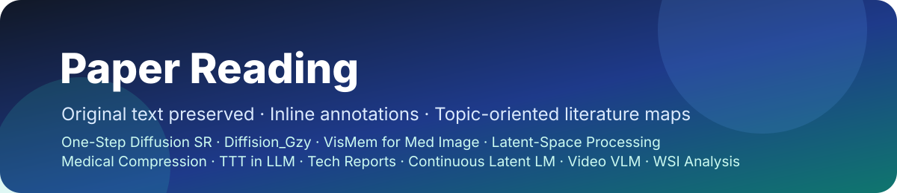

# Paper Reading · 个人文献阅读库

> **A personal research library for deep, connected reading.**<br>
> 从论文原文出发，沉淀机制理解、实验证据、研究边界与可复用问题。

[](./topics/)
[](./topics/)
[](./topics/)
[](./topics/)


这是我的个人文献阅读与研究积累仓库。它不是简单的 paper list，也不是把摘要重新改写一遍；目标是把每篇论文转化为可追溯、可比较、可继续追问的研究材料：

- **原文可追溯**：保留论文原文、PDF、MinerU 结构化结果与图表资产。
- **理解嵌入上下文**：中文旁批直接放在原文段落、公式和图表附近。
- **证据与主张分离**：记录核心数字、消融证据、适用边界与未被实验支持的推断。
- **从单篇走向研究地图**：topic README 负责横向比较、竞争关系、novelty 边界和开放问题。
- **持续演化**：阅读中的问题、复现判断与后续研究想法会继续回写到笔记。

## 阅读工作流


| 阅读层级 | 主要内容 | 适合解决的问题 |
|---|---|---|
| **原始资产** | `paper.pdf`、`full.md`、`images/`、`content_list.json` | 原文究竟写了什么？图表和公式是否被正确引用？ |
| **Section 批读** | 英文原文 + 中文旁批 + Figure/Table/Equation 解读 | 方法如何流动？每个实验支撑哪个 claim？ |
| **单篇 README** | 一句话总结、贡献、关键数字、数据流、优缺点、Q&A | 这篇论文最值得记住什么？边界在哪里？ |
| **Topic README** | 横向比较、研究谱系、novelty 审计、统一问题 | 多篇论文合起来说明了什么？下一步还能做什么？ |

## 精选研究主线

| 研究主线 | 规模 | 为什么值得从这里开始 |
|---|---:|---|
| **[ReadySlideBenchmark](./topics/ReadySlideBenchmark/README.md)** | 5 篇 | 病理 FM 的 Selector–Consumer–Budget 角色解耦：比较“谁更会选、谁更会诊断、预算如何改变排名”。 |
| **[Whole Slide Image Analysis](./topics/Whole-Slide-Image-Analysis/README.md)** | 18 篇 | 从 WSI 空间推理、MIL 注意力到病理基础模型、可信评测与部署效率的完整研究线。 |
| **[Blind Inverse Problems](./topics/Blind-Inverse-Problems-Generative-Priors/README.md)** | 13 篇 | 围绕生成先验、盲算子、联合后验采样与 posterior calibration 建立方法和评测地图。 |
| **[VLM Bottleneck Analysis](./topics/VLM-Bottleneck-Analysis-and-Method-Design/README.md)** | 17 篇 | 从 encoding、grounding、视觉调用、reward 到多图推理，系统定位多模态推理瓶颈。 |
| **[Harness](./topics/Harness/README.md)** | 6 篇 | 研究 Agent 如何诊断、修改和验证自己的运行 harness，以及 self-improvement 的可靠性边界。 |

## 最近更新

### 2026-08-19 · ReadySlideBenchmark

新增五篇 Selector–Consumer 核心批读，并完成跨 FM 角色矩阵、排名迁移、Sufficiency/Necessity/Recoverability 与部署成本的综合整理。

- [From Patches to Patients](./topics/ReadySlideBenchmark/%5BMICCAI%202026%5D%20From-Patches-to-Patients/)
- [EAGLE](./topics/ReadySlideBenchmark/%5BNat%20Commun%202026%5D%20EAGLE/)
- [FOCI](./topics/ReadySlideBenchmark/%5BArxiv%202026%5D%20FOCI/)
- [ReaMIL](./topics/ReadySlideBenchmark/%5BWACV%20Workshop%202026%5D%20ReaMIL/)
- [GCE-MIL](./topics/ReadySlideBenchmark/%5BArxiv%202026%5D%20GCE-MIL/)

### 2026-08-18 · Harness

围绕 Self-Harness、Meta-Harness、AHE、RHO、GEPA 与 Phantom Guardrails，整理 Weakness Mining、Proposal Search、Validation 三阶段升级路线。

### 2026-08-11 · WSI MIL Baseline Set

补齐 DeepSets、TransMIL、MambaMIL、MAMMOTH、PAMoE、GMMamba、RetMIL 与 Shazam，建立 foundation-model-era WSI MIL 主对比集。

## 研究地图

### 病理与医学影像

| Topic | 论文 | 研究重点 |
|---|---:|---|
| [ReadySlideBenchmark](./topics/ReadySlideBenchmark/README.md) | 5 | 病理 FM selector–consumer 角色解耦、预算化诊断与部署验证 |
| [Whole Slide Image Analysis](./topics/Whole-Slide-Image-Analysis/README.md) | 18 | WSI 空间推理、MIL、病理 FM、可信评测与高效部署 |
| [CKMIL & Re-Attention MIL](./topics/ckmil-re-attn-mil/README.md) | 10 | 注意力基础、MIL 有效性、端到端 WSI 与 PFM adaptation |
| [Medical Compression](./topics/Medical-Compression/README.md) | 11 | 医学图像/病理压缩、任务保持与 analysis-ready representation |
| [VisMem for Med Image](./topics/VisMem-for-Med-Image/README.md) | 9 | 医学 VLM、视觉记忆、latent diagnostic reasoning |

### 生成、复原与逆问题

| Topic | 论文 | 研究重点 |
|---|---:|---|
| [Blind Inverse Problems with Generative Priors](./topics/Blind-Inverse-Problems-Generative-Priors/README.md) | 13 | 盲算子、扩散先验、联合后验采样与校准 |
| [One-Step Diffusion Super-Resolution](./topics/One-Step-Diffusion-Super-Resolution/README.md) | 5 | 单步扩散 SR、蒸馏、效率与 fidelity–realism 权衡 |
| [Diffision_Gzy](./topics/Diffision_Gzy/README.md) | 2 | score distillation、timestep control 与 Real-ISR |

### 潜空间、多模态与模型能力

| Topic | 论文 | 研究重点 |
|---|---:|---|
| [VLM Bottleneck Analysis and Method Design](./topics/VLM-Bottleneck-Analysis-and-Method-Design/README.md) | 17 | encoding、grounding、visual invocation、reward 与 multi-image bottleneck |
| [TTT in LLM](./topics/TTT%20in%20LLM/README.md) | 13 | test-time training、memory、context adaptation 与在线更新 |
| [Latent-Space Processing](./topics/Latent-Space-Processing/README.md) | 4 | latent reasoning、cache augmentation 与 CoT compression |
| [Continuous Latent Language Modeling](./topics/Continuous-Latent-Language-Modeling/README.md) | 2 | 连续潜空间语言建模与非离散推理 |
| [Video VLM](./topics/video-VLM/README.md) | 1 | 流式视频理解与边看边推理 |
| [Attention](./topics/attention/%5BArxiv%5D%201706.03762/README.md) | 1 | Attention 机制的基础原理与可复用直觉 |

### Agent、优化与研究实践

| Topic | 论文 | 研究重点 |
|---|---:|---|
| [Harness](./topics/Harness/README.md) | 6 | Agent harness 的自诊断、自修改、搜索与可靠验证 |
| [GRPO](./topics/GRPO/README.md) | 1 | Group Relative Policy Optimization 与 Agentic RL |
| [Tech Reports](./topics/Tech-repoorts/README.md) | 5 | 前沿模型技术报告、训练配方与系统能力 |
| [Rebuttal](./topics/Rebuttal/README.md) | 2 | 论文论证、审稿回应与研究主张边界 |

**合计：18 个 topic，125 份论文笔记，762 个批读 section。**

## 一篇完整批读包含什么

```text
[会议 年份] 论文名/
├── README.md                 # 单篇入口：总结、贡献、关键数字、数据流、Q&A
├── sections/                 # 按论文原始大分节组织
│   ├── 00-abstract.md        # 原文 + 中文旁批
│   ├── 01-introduction.md
│   ├── 02-related-work.md
│   ├── 03-methodology.md
│   ├── 04-experiments.md
│   └── ...
├── full.md                   # MinerU 解析全文
├── images/                   # Figure、Table 与复杂公式原图
├── content_list.json         # 结构化内容与资产映射
└── paper.pdf                 # 原始论文 PDF
```

每篇 README 通常包含：

1. **一句话总结**：用一个明确判断说明论文真正做了什么。
2. **核心贡献**：区分方法组件、实验贡献和科学结论。
3. **批读导航**：从问题、方法、实验到附录逐节阅读。
4. **关键数字**：保留最能验证或限制主张的结果。
5. **数据流**：用 Mermaid 描述输入、中间表示、训练信号和输出。
6. **优缺点与还能做什么**：连接当前研究问题，而不止复述作者结论。
7. **阅读 Q&A**：记录复现、指标、因果解释和 novelty 判断中的关键疑问。
8. **Citation Landscape**：结合 Semantic Scholar 追踪参考谱系与相邻工作。

## 阅读原则

- **忠于原文**：批注不能替代论文正文，也不把作者未验证的推断写成结论。
- **Evidence before narrative**：先看表格、消融、负对照和统计单位，再接受故事线。
- **区分模型行为与科学因果**：attention、keep/drop 或可视化只能支持其协议内的模型判断。
- **比较必须保持共同对象**：排行榜迁移、跨模型比较和预算曲线都要先确认统计对象一致。
- **明确成本边界**：tile 数、FLOPs、预提特征、I/O 和端到端 wall-clock 不是同一件事。
- **保留开放问题**：好的笔记应说明“还不知道什么”，而不是把每篇论文包装成完整答案。

## 如何使用这个仓库

- **快速了解一个方向**：从对应的 topic README 开始，看论文谱系、统一问题和推荐顺序。
- **深读一篇论文**：进入论文 README，再按导航阅读 `sections/` 中的原文与旁批。
- **核对原始内容**：查看 `full.md`、`paper.pdf`、`images/` 与 `content_list.json`。
- **做相关工作或 novelty 审计**：优先阅读 topic 中的横向比较、失败分类和“还能做什么”。

---

<div align="center">
  <strong>Read deeply. Compare carefully. Keep the unanswered questions.</strong><br>
  <sub>这是持续更新的个人阅读记录；观点会随着新论文、复现结果和研究进展继续修订。</sub>
</div>
