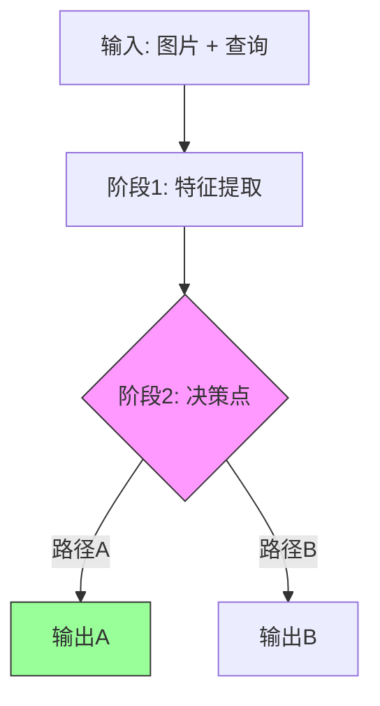

# 📖 Paper Reading 完整工作流 Skills

> 本文档包含论文批读的完整工作流所需的两个 Skill：
> 1. **MinerU** — PDF 解析为 Markdown
> 2. **Paper Reader** — 按 Section 拆分 + 批读批注
>
> 工作流：`arXiv/PDF URL` → MinerU 解析 → Paper Reader 批读 → GitHub Push

---

# Part 1: 📄 MinerU - 文档解析

**OpenDataLab 出品**

> PDF/Word/PPT/图片 → 结构化 Markdown，公式表格全保留！

---

## 🔗 资源链接

| 资源 | 链接 |
|------|------|
| **官网** | https://mineru.net/ |
| **API 文档** | https://mineru.net/apiManage/docs |
| **GitHub** | https://github.com/opendatalab/MinerU |

---

## 🎯 功能

### 支持的文件类型

| 类型 | 格式 |
|------|------|
| 📕 **PDF** | 论文、书籍、扫描件 |
| 📝 **Word** | .docx |
| 📊 **PPT** | .pptx |
| 🖼️ **图片** | .jpg, .png (OCR) |

### 核心优势

1. **公式完美保留** - LaTeX 格式输出
2. **表格结构识别** - 复杂表格也能搞定
3. **多语言 OCR** - 中英文混排无压力
4. **版面分析** - 多栏、图文混排自动处理

---

## 🚀 API 使用 (v4)

### 认证

```bash
# Header 认证
Authorization: Bearer {YOUR_API_KEY}
```

### 单文件解析

```bash
# 1. 提交任务
curl -X POST "https://mineru.net/api/v4/extract/task" \
  -H "Authorization: Bearer $MINERU_TOKEN" \
  -H "Content-Type: application/json" \
  -d '{
    "url": "https://arxiv.org/pdf/2410.17247",
    "enable_formula": true,
    "enable_table": true,
    "layout_model": "doclayout_yolo",
    "language": "en"
  }'

# 返回: {"task_id": "xxx", "status": "pending"}

# 2. 轮询结果
curl "https://mineru.net/api/v4/extract/task/{task_id}" \
  -H "Authorization: Bearer $MINERU_TOKEN"

# 返回: {"status": "done", "result": {...}}
```

### 批量解析

```bash
# 1. 获取上传 URL
curl -X POST "https://mineru.net/api/v4/file-urls/batch" \
  -H "Authorization: Bearer $MINERU_TOKEN" \
  -d '{"file_names": ["paper1.pdf", "paper2.pdf"]}'

# 2. 上传文件到返回的 presigned URLs

# 3. 批量提交任务
curl -X POST "https://mineru.net/api/v4/extract/task/batch" \
  -H "Authorization: Bearer $MINERU_TOKEN" \
  -d '{"files": [{"url": "...", "name": "paper1.pdf"}, ...]}'
```

---

## ⚙️ 参数说明

| 参数 | 类型 | 说明 |
|------|------|------|
| `url` | string | 文件 URL (支持 http/https) |
| `enable_formula` | bool | 启用公式识别 (默认 true) |
| `enable_table` | bool | 启用表格识别 (默认 true) |
| `layout_model` | string | `doclayout_yolo` (快) / `layoutlmv3` (准) |
| `language` | string | `en` / `ch` / `auto` |
| `model_version` | string | `pipeline` / `vlm` / `MinerU-HTML` |

### 模型版本对比

| 版本 | 速度 | 准确度 | 适用场景 |
|------|------|--------|----------|
| `pipeline` | ⚡ 快 | 高 | 常规文档 |
| `vlm` | 🐢 慢 | 最高 | 复杂版面 |
| `MinerU-HTML` | ⚡ 快 | 高 | 网页样式输出 |

---

## 📂 输出结构

解析完成后下载的 ZIP 包含：

```
output/
├── full.md           # 完整 Markdown
├── content_list.json # 结构化内容
├── images/           # 提取的图片
└── layout.json       # 版面分析结果
```

---

## 🔧 OpenClaw 集成工作流

### 论文解析流程

```bash
# 1. 创建论文目录
mkdir -p "./paper-reading/[CVPR 2025] NewPaper"
cd "./paper-reading/[CVPR 2025] NewPaper"

# 2. 提交解析任务
TASK_ID=$(curl -s -X POST "https://mineru.net/api/v4/extract/task" \
  -H "Authorization: Bearer $MINERU_TOKEN" \
  -H "Content-Type: application/json" \
  -d '{"url": "https://arxiv.org/pdf/XXXX.XXXXX"}' | jq -r '.task_id')

# 3. 等待完成 & 下载
# (轮询 status 直到 done，然后下载 result.zip)

# 4. 解压
unzip result.zip -d .
```

### 环境变量

在 `~/.bashrc` 或 OpenClaw config 中设置：

```bash
export MINERU_TOKEN="your_api_key_here"
```

---

## ⚠️ 限制

| 限制 | 数值 |
|------|------|
| 单文件大小 | 200 MB |
| 单文件页数 | 600 页 |
| 并发任务数 | 根据套餐 |

---

## 💡 使用技巧

1. **arXiv 论文直接用 URL**：`https://arxiv.org/pdf/2410.17247`
2. **中文论文用 `language: ch`**
3. **复杂表格用 `vlm` 模型**
4. **批量处理省 quota**：一次提交多个文件更高效

---
---

# Part 2: 📖 Paper Reader - 论文批读工作流

将 MinerU 解析的 `full.md` 按论文原始**大分节**拆分成 Section 笔记文件，使用**批读格式**：原文中内嵌批注。

---

## 🎯 功能概览

```
输入: MinerU 解析后的论文目录
      └── full.md + images/ + content_list.json

输出: 完整的批读笔记
      ├── README.md                (论文概览 + Section 导航)
      └── sections/
          ├── 00-abstract.md       (Abstract)
          ├── 01-introduction.md   (Introduction)
          ├── 02-related-work.md   (Related Work, 若论文有)
          ├── 03-methodology.md    (Method/Methodology, 若论文有)
          ├── 04-experiments.md    (Experiments, 若论文有)
          └── ...                  (按论文原始大分节继续编号)
```

---

## ⚠️ 强制规则（必须遵守）

### 规则 1：原文必须完整保留

批读 ≠ 改写。Section 文件中的原文必须**逐字从 full.md 复制**，不得省略、压缩或改写任何段落。

- **逐段复制** full.md 对应 section 的所有文字，一字不改
- **批注是额外添加的**，插在原文段落之间，用 `> 💡` 标记
- 完成后**必须 QA**：对比 full.md 行数，确保无遗漏

❌ 错误做法：把原文概括成几句话，用批注替代原文
✅ 正确做法：原文完整复制 → 段落之间插入批注解释

---

### 规则 2：清理 MinerU 解析产生的排版问题

MinerU 从 PDF 提取文本时会引入排版问题，必须修复：

1. **标题文字不要重复**：MinerU 经常在 subsection 标题下面重复标题文字（如 `## 2.1 MLLM for Planning` 下面又出现 `MLLM for Planning Existing studies...`），删掉重复部分
2. **被图片切断的段落要合并**：PDF 排版中图片经常插在段落中间，导致 full.md 里一个完整段落被 Figure 切成两半（如引用 `[6-` 和 `8, 37]` 被 Figure 分开），需要手动合并段落并把 Figure 移到合适位置
3. **清理无法渲染的 LaTeX 宏**：GitHub 不支持 `\operatorname`、`\mathrm`、`\mathbf`、`\mathsf`、`\mathbb` 等宏，作者名和简单文本改成纯文本，复杂公式用图片
4. **跨 Section 的 Figure 放到合适位置**：MinerU 按 PDF 页面顺序提取，但图片实际归属可能不同。遵循以下原则：
   - **Abstract 不放图**：Abstract 页面的 Figure（通常是 Figure 1）归属于 Introduction
   - **Related Work 不放图**：Related Work 页面的 Figure 归属于它实际描述的 Section（通常是 Method 或 Dataset）
   - 根据 Figure 的 caption 内容判断它属于哪个 Section，放到对应位置

---

### 规则 3：图片和表格必须用 MinerU 原始图片

**Figure 和 Table 都必须用 images/ 目录中的原始图片**，不要用 full.md 里的 Markdown/HTML 表格。

1. 查看 `content_list.json`，找到所有 type=image 和 type=table 的条目及其 `img_path`
2. 使用相对路径引用：``
3. 在图片下方添加斜体 caption：`*Figure/Table N: 描述*`
4. **Table 优先用图片**而非 Markdown 表格（论文原始排版更易读）
5. 每个 Figure/Table 后面加批读批注：`> 💡 **Figure/Table N 批读**: ...`

---

### 规则 4：大公式用图片（不要用 LaTeX）

GitHub 无法正确渲染复杂 LaTeX 公式。**所有 display math（`$$...$$`）都用图片替换。**

- **行内简单公式**（如 `$x_i$`、`$N$`）可以保留
- **Display math / 复杂公式**用图片：
  1. 首先检查 `content_list.json` 或 `content_list_v2.json`：找 `type=equation_interline` 的条目
  2. 如果有公式图片：``
  3. 如果没有：从 PDF 用 `pymupdf` 截取

---

### 规则 5：多子图 Figure 必须用完整整图

MinerU 经常把一个多子图 Figure 拆成多张独立小图。**必须放完整整图。**

#### 检测方法
在 `full.md` 中，如果**连续多个 `` 共享同一个 Figure caption**，说明被拆分了。

#### 修复方法
从原始 PDF 用 `pymupdf` 提取完整 Figure：
```python
import fitz
doc = fitz.open('paper.pdf')
zoom = 3.0
mat = fitz.Matrix(zoom, zoom)
page = doc[page_index]
clip = fitz.Rect(left, top, right, bottom)
pix = page.get_pixmap(matrix=mat, clip=clip)
pix.save('images/figureN_full.jpg')
```

| 情况 | 做法 |
|------|------|
| 1 张图 + 1 个 caption | ✅ 直接用 MinerU 的图 |
| N 张图 + 1 个 caption (N≥2) | ⚠️ 从 PDF 提取整图 |
| Figure 有 (a)(b)(c) 子图标签 | ⚠️ 大概率被拆，检查 |

---

### 规则 6：Section 文件按论文原始大分节生成

每篇论文的 `sections/` 目录应按论文原始**大分节**生成，而不是固定数量模板。

核心原则：
1. 以论文的顶层 section 为准，例如 `Abstract`、`Introduction`、`Related Work`、`Methodology`、`Experiments`、`Conclusion`、`Appendix`。
2. `3.1`、`3.2` 这类 subsection 不单独生成文件，必须归入所属大分节，例如都放进 `03-methodology.md`。
3. `Appendix`、`Supplementary Material` 及其后续小节归并为一个 appendix section，例如 `06-appendix.md`。
4. `References` 通常不单独作为阅读 section；如需要保留，应归入最后的 `Appendix` / `Discussion` section。
5. 文件名格式使用 `XX-section-name.md`，例如：

```text
sections/
├── 00-abstract.md
├── 01-introduction.md
├── 02-related-work.md
├── 03-methodology.md
├── 04-experiments.md
├── 05-conclusion.md
└── 06-appendix.md
```

⚠️ Section 数量由论文大分节决定，不要强行固定为 5 个，也不要把每个 subsection 都拆成独立文件。

---

### 规则 7：每篇论文必须有 README.md

每个论文目录下必须有 `README.md` 作为入口页面。

内容要求：
1. **论文元信息**：标题、作者、会议/期刊、年份、链接
2. **一句话总结**
3. **核心贡献**：3-5 点
4. **Section 导航表**：链接到每个 section 文件，带简短描述
5. **关键数字速查**（可选）
6. **数据流：输入 → 中间表示 → 输出**（必须）
7. **优缺点与还能做什么**（必须）
8. **阅读 Q&A 记录**（必须）

格式：
```markdown
# 论文标题

**作者**: ...  
**会议**: ... | **年份**: ...  
**链接**: [arXiv](...)

## 一句话总结
...

## 核心贡献
1. ...
2. ...

## 📖 批读导航

| Section | 内容 |
|---------|------|
| [00 - Abstract](sections/00-abstract.md) | 摘要 + Figure 1 |
| [01 - Introduction](sections/01-introduction.md) | 动机 + 贡献 |
| ... | ... |

## 关键数字

| 指标 | 数值 |
|------|------|
| ... | ... |

## 数据流：输入 → 中间表示 → 输出

| 阶段 | 输入 | 变换 | 输出 |
|------|------|------|------|
| 1. ... | ... | ... | ... |

## 优缺点与还能做什么

### 优点
- ...

### 局限 / 风险
- ...

### 还能做什么
- ...

## 阅读 Q&A 记录

- **Q: ...?**
  A: ...
```

同时，每个 section 文件**顶部**加返回链接：
```markdown
[← 返回 README](../README.md)
```

---

### 规则 8：批注质量必须达到 claude 风格

批注不是占位解释，必须围绕论文自身机制做具体拆解。批注作者标记为 `claude 批注`。

必须做到：
1. **批注标题具体**：使用 `问题动机`、`机制拆解`、`公式批读`、`Figure 2 批读`、`消融解读`、`Q&A 批注记录` 等有信息量的标题；不要大量使用只有 `批注` 的泛标题。
2. **每条批注回答一个问题**：这段解决什么问题、输入输出是什么、为什么这样设计、和 baseline 差异在哪里、实验是否支撑 claim。
3. **方法 section 按数据流批注**：明确输入、核心中间变量/latent、模块变换、loss/teacher 信号、最终输出。
4. **实验 section 按证据链批注**：主结果、消融、效率、视觉案例要分别说明支撑哪个 claim；区分 fidelity 指标和 perceptual 指标。
5. **图表/公式必须专门批读**：Figure/Table/Equation 后的批注不能是“这张图通常承担...”这类模板句，必须解释该图表/公式在本文中的具体作用。
6. **避免跨论文污染**：不得把另一篇论文的模块、任务或领域写入当前论文。例如 SR 论文中不得出现无关的 medical VLM 批注。
7. **Section 总结要有可复用洞察**：总结至少包含关键数字/变量、核心洞察、可追问点，而不是“原文已完整保留”这类形式化 QA。

禁止出现的模板化批注：
- “这段是 one-step SR 主线...”
- “这张图通常承担方法框架...”
- “公式通常定义过程、loss 或更新规则...”
- “本节对应论文原始大分节，原文已完整保留。”

---

### 规则 9：阅读时生成 Q&A，并沉淀到旁批注

深读时要边读边提出问题，再查正文、附录、图表、相关资料或 Semantic Scholar 信息回答，并把高价值 Q&A 写入对应 section 或 README。

Q&A 记录原则：
1. **问题来自阅读障碍或研究判断**：例如“为什么固定 timestep 会导致不可控？”、“这个 loss 的 teacher 信号是什么？”、“这个指标提升是否牺牲保真？”。
2. **回答要有定位**：说明答案来自正文哪一节、哪张图/表、哪个公式、附录或外部资料。
3. **转化为旁批注**：在相应段落旁添加 `> 💡 **Q&A 批注记录**:`，或在 README 的 `阅读 Q&A 记录` 中汇总。
4. **优先记录可复用问题**：方法复现、数据流、局限、实验证据、未来工作相关问题优先。

推荐格式：
```markdown
> 💡 **Q&A 批注记录**:
> - Q: 这个模块真正改变了哪一个中间表示？
> - A: 它把 LQ latent / visual token / teacher score 改成 ...，对应 Fig. X 和 Eq. Y。
```

---

### 规则 10：多篇论文优先用 subagent 并行

当用户一次给多篇论文时，应优先采用并行批读，而不是串行完成所有论文。

执行方式：
1. **一篇论文一个 worker/subagent**：每个 subagent 只负责一个论文目录，写集限定为该论文的 `README.md` 和 `sections/*.md`，避免互相覆盖。
2. **主线程负责公共文件**：主线程只处理 topic README、根 README、skill/template、最终 QA、git commit/push 等公共集成工作。
3. **明确所有权**：启动 subagent 时必须说明它不是唯一修改者，不能回退其他论文或公共文件。
4. **并行读写边界**：不同 subagent 的写集必须互不重叠；如果两篇论文共享同一 topic README，由主线程统一更新。
5. **最终统一 QA**：所有 subagent 完成后，主线程必须统一检查模板批注残留、跨论文串稿、README 必备 section、section 链接、原文完整性和 git diff 范围。

如果当前运行环境要求用户显式允许 subagent，则先向用户确认；一旦用户同意，多篇论文应按上述方式并行拆分。

推荐分工示例：
```text
Worker A: 只改 Paper-1/README.md 和 Paper-1/sections/*.md
Worker B: 只改 Paper-2/README.md 和 Paper-2/sections/*.md
Main: 更新 topic README、skill/template，做最终 QA 和提交
```

---

### 规则 11：添加 Citation Landscape（Semantic Scholar 数据）

每篇论文的 README.md 必须包含 `📊 Citation Landscape` section，数据来源于 Semantic Scholar API（免费，无需 API key）。

#### 包含内容

1. **TLDR**：从 Semantic Scholar 的 `tldr` 字段获取，一句话自动摘要
2. **引用统计**：参考文献数、被引次数、influential citation count
3. **参考文献分组**：按主题分类（Multi-Agent, Memory, RL, Benchmarks 等），每类展示 Top 5，按 citation count 排序
4. **推荐论文**：使用 Recommendations API 获取 10 篇最相关论文

#### API 调用方法

```bash
# 论文详情 + TLDR
curl "https://api.semanticscholar.org/graph/v1/paper/ArXiv:{arxiv_id}?fields=title,year,citationCount,referenceCount,influentialCitationCount,tldr"

# 参考文献（用于分组）
curl "https://api.semanticscholar.org/graph/v1/paper/ArXiv:{arxiv_id}/references?fields=title,year,citationCount,venue,externalIds&limit=1000"

# 推荐论文
curl -X POST "https://api.semanticscholar.org/recommendations/v1/papers/?fields=title,year,citationCount,externalIds,venue" \
  -H "Content-Type: application/json" \
  -d '{"positivePaperIds":["ArXiv:{arxiv_id}"],"negativePaperIds":[]}'
```

#### 注意事项
- 有 rate limit（无 key 约 100 req/5min），调用之间 sleep 2-3s
- Connected Papers 链接：`https://www.connectedpapers.com/main/{arxiv_id}`
- Semantic Scholar 链接：从 paper detail 的 `paperId` 构造

#### 参考示例
见 `/mnt/eason/paper-reading/Agent-Memory/[Arxiv 2602.03036] LatentMem/README.md` 的 📊 Citation Landscape section。

---

### 规则 12：完成后必须推送到 GitHub 并更新大仓库 README

批读完成后：
1. `git add -A` **整个论文目录**（不要只 add sections/，必须包含 images/、full.md、content_list.json、PDF 等所有文件）
2. **更新 `/mnt/eason/paper-reading/README.md`**：确保新论文出现在对应课题的表格中，格式与现有条目一致
3. `git add README.md`
4. `git commit -m "feat: [论文名] 批读完成"`
5. `git push`
6. 把 GitHub 链接发给用户

⚠️ **特别注意**：如果 MinerU 解析和批读分开执行（如主会话解压、子任务批读），确保 images/ 等源文件也被 push。子任务中用 `git add -A 论文目录/` 而非只 `git add sections/`。

---

## 📝 批读格式

**核心特点**：不是"原文"和"理解"分开，而是**边读边批注**。

```markdown
[← 返回 README](../README.md)

# 3. Dataset

## 📌 预览
这个 Section 讲什么，核心要点是...

---

[Section 开头段落原文]

> 💡 **Section 概览**: 这段是整个 Section 的路线图。核心思路是...

---

### 3.1 Data Collection

> 💡 **3.1 要点预览**: 如何从 X 中筛选出 Y？关键是...

[3.1 原文段落]

> 💡 **批注**: 这里的关键点是...

[更多原文]


*Figure 3: 描述*

> 💡 **Figure 3 批读**:
> - 要点 1
> - 要点 2

> 💡 **3.1 小结**:
> - 要点 1
> - 关键数字: X

---

## 🔖 Section 总结

### 关键数字速查
| 指标 | 数值 |
|------|------|
| ... | ... |

### 核心洞察
1. ...
2. ...
```

---

## 🔄 交互式批读工作流

批读是个交互过程，不是一次性生成。

```
Step 1: Agent 生成初版批读（原文 + 基础批注 + README）
         ↓
Step 2: 用户阅读，提问不懂的地方
         ↓
Step 3: Agent 补充详细解释，更新到对应 section 文件
         ↓
       (循环，直到理解透彻)
```

---

### 规则 13：批注语言必须以中文为主体

所有批注、README section 标题和正文必须是中文。**禁止**生成英文批注或英文 README 标题。

- README section 标题必须使用中文：`## 一句话总结`、`## 核心贡献`、`## 📖 批读导航`、`## 关键数字`、`## 数据流：输入 → 中间表示 → 输出`、`## 优缺点与还能做什么`、`## 阅读 Q&A 记录`、`## 📊 Citation Landscape`
- 批注标题使用中文：`问题动机`、`机制拆解`、`公式批读`、`Figure X 批读`、`消融解读`、`Q&A 批注记录`
- 批注作者名使用 `claude 批注`
- 原文（英文论文内容）保持原样不动

---

### 规则 14：公式渲染规范（GitHub 兼容）

批读笔记托管在 GitHub 上，必须遵守 GitHub MathJax 的渲染限制。

#### 14.1 行内公式
- 所有正文中的数学变量必须用 `$...$` 包裹。例如：`$H_v^0$`、`$W_{head}$`、`$τ_{gate}$`、`$Y_{pred}$`
- **在 subagent prompt 中必须明确要求**：遍历所有 section 文件，确保 `letter_subscript`、`letter_subscript^superscript` 等模式的变量全部包裹在 `$...$` 中
- 上标必须和下标在同一个 `$` 对内：`$H_{gate}^{(B+R)}$` 而非 `$H_{gate}$^(B+R)`

#### 14.2 行间公式
- `$$...$$` 块前后必须有空行（否则 MathJax 无法识别）
- 连续的 `$$` 块之间也要有空行
- **禁止**在 `$$...$$` 中使用 `\tag{1}`（GitHub MathJax 不支持，会导致公式竖排）

#### 14.3 比较运算符
- `$$` 内部的 `<` 和 `>` 必须替换为 `\lt` 和 `\gt`，否则被 Markdown 解析为 HTML 标签
- 例如：`y_{<t}` → `y_{\lt t}`，不要写 `y_{<t}`（会报 "Extra open brace" 错误）
- 行内公式 `$...$` 中的 `<` `>` 同理处理

#### 14.4 LaTeX 宏兼容性
- `\operatorname`、`\mathrm`、`\mathbf`、`\mathsf`、`\mathbb`、`\boldsymbol` 通常可渲染，但复杂嵌套时可能失败
- 优先使用 `\text{}` 替代 `\mathrm{}`
- 主线程最终 QA 时需检查所有 section 文件是否有未渲染的 LaTeX 宏

---

### 规则 15：图片展示规范

#### 15.1 图片路径
- Section 文件中引用图片必须使用相对路径：``
- **禁止**使用绝对路径或 `../../../../paper-name/images/xxx.jpg` 格式
- README.md 中引用图片使用 ``

#### 15.2 左右并列图
如果原文中两张图（如 Figure 2a 和 Figure 2b）共享同一个 caption，则使用 HTML table 左右并列展示：

```markdown
<table><tr><td width="50%"></td>
<td width="50%"></td></tr>
<tr><td align="center"><i>Figure 2a</i></td><td align="center"><i>Figure 2b</i></td></tr></table>

*Figure 2: 共享标题描述。*
```

检测方法：连续两个 `![Figure Na]` `![Figure Nb]` 后面紧跟 `**Fig. N**:` 标题。

#### 15.3 表格
优先使用 MinerU 提取的表格图片（`images/` 目录），而非 Markdown 表格或 HTML `<table>`。

---

### 规则 16：Data Flow 可视化

README.md 中的数据流部分**必须使用 Mermaid flowchart**，不得使用 ASCII 框图。

#### 规范
- 使用 ````mermaid` 代码块，GitHub 原生渲染
- 节点文本精简，用纯中文描述（Mermaid 不支持 LaTeX 渲染）
- 关键决策点用彩色节点标注
- 格式示例：

```markdown
## 数据流：输入 → 中间表示 → 输出


```

#### 流程图中禁止
- 在节点文本中使用 LaTeX 公式符号
- 节点文本过长（超过 30 个中文字符）
- 使用 ASCII 框线图

---

### 规则 17：链接与路径规范

- Topic README 和 Root README 中的链接，**空格必须编码为 `%20`**
- 例如：`[Q-Zoom](./encoding/%5BArxiv%202025%5D%20Q-Zoom/)`（`[Arxiv 2025]` 和 `Q-Zoom` 之间的空格是 `%20`）
- 所有链接需在最终 QA 中验证可跳转

---

### 规则 18：Subagent 提示词规范

启动 subagent 进行批读时，提示词必须包含以下指令：

1. **语言要求**：明确规定"所有批注、README section 标题和正文为中文"
2. **路径规范**：明确 `../images/` 相对路径，禁止绝对路径
3. **公式规范**：`$$` 块前后空行，`<` `>` 替换为 `\lt` `\gt`，移除 `\tag{}`，行内变量加 `$...$`
4. **图片规范**：并列图用 HTML table，表格用图片
5. **数据流规范**：使用 Mermaid flowchart，不用 ASCII 框图
6. **README 必备 section**：列出 9 个必备 section 并注明中文标题
7. **禁止修改**：其他论文目录、full.md、原始英文 paper text

---

### 规则 19：主线程最终 QA 检查清单

所有 subagent 完成后，主线程必须逐项检查：

- [ ] 所有 section 文件中 `![...]` 路径是否为 `../images/xxx.jpg` 格式
- [ ] 所有 `$$` 块前后是否有空行，是否移除了 `\tag{}`
- [ ] 所有 `$$` 和 `$...$` 内部是否还有 `<` 或 `>`（应为 `\lt` `\gt`）
- [ ] 行内变量是否包裹在 `$...$` 中（检查 `_` 和 `^` 模式）
- [ ] Topic README 和 Root README 链接中的空格是否编码为 `%20`
- [ ] 连续子图是否转换为 HTML table 左右并列
- [ ] Data flow 是否使用 Mermaid（而非 ASCII 框图）
- [ ] README section 标题是否为中文
- [ ] 批注作者是否统一为 `claude 批注`
- [ ] 是否有其他论文目录被意外修改
- [ ] `git add -A` 整个论文目录（含 images/、full.md、PDF 等）

---

## ⚙️ 配置

| 配置项 | 值 |
|--------|-----|
| 论文库位置 | `/data/share/hxd/haojiang/Papers/paper-reading/` |
| 目录命名 | `[会议 年份] 论文名` |
| Section 文件命名 | 按论文大分节：`00-abstract.md`、`01-introduction.md`、`02-related-work.md`、`03-methodology.md`、... |
| 批注标记 | `> 💡 **标题**: 内容` |
| 批注作者 | `claude 批注` |
| GitHub 仓库 | `Haohaha-11/Paper-Reading-form-Eason` |
| 默认分支 | `main` |
| MinerU Token | 存储于 `secrets/mineru.env` |
| GitHub Token | 存储于 `secrets/github.env` |

---

## 📂 参考示例

| 论文 | 位置 |
|------|------|
| Q-Zoom | `/data/share/hxd/haojiang/Papers/paper-reading/topics/VLM-Bottleneck-Analysis-and-Method-Design/encoding/[Arxiv 2025] Q-Zoom/` |
| VisualPRM | `/data/share/hxd/haojiang/Papers/paper-reading/topics/VLM-Bottleneck-Analysis-and-Method-Design/reward/[Arxiv 2025] VisualPRM/` |

---

## 💡 批读技巧

1. **每段后面加批注**：读完一段就批注，保持思路连贯
2. **subsection 有预览和小结**：预览告诉你要讲什么，小结总结关键点
3. **复杂概念用大白话**：避免术语堆砌，用例子说明
4. **表格画对比图**：Mermaid flowchart 比 ASCII 更直观
5. **交互式补充**：看不懂就问，把回答加到批注里
6. **公式规范**：行内用 `$...$`，行间 `$$...$$` 前后留空行，`<` `>` 写 `\lt` `\gt`
7. **图片路径**：sections/ 下用 `../images/xxx.jpg`，README 下用 `images/xxx.jpg`

---

*边读边批，理解更深！📚*
