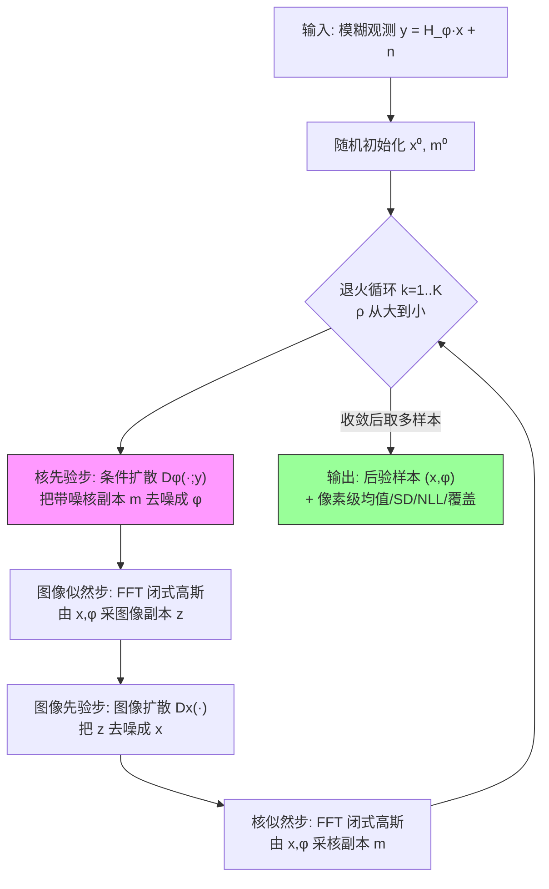

# PRISM: Probabilistic and Robust Inverse Solver with Measurement-Conditioned Diffusion Prior for Blind Inverse Problems

**作者**: Yuanyun Hu¹², Evan Bell¹, Guijin Wang², Yu Sun¹ (通讯: ysun214@jh.edu)
**机构**: ¹Johns Hopkins University　²Tsinghua University
**会议/来源**: arXiv preprint | **年份**: 2025
**链接**: [arXiv:2509.16106](https://arxiv.org/abs/2509.16106) ｜ [Semantic Scholar](https://www.semanticscholar.org/paper/c57f06e0b6478ee42b3517d3685fbf12134efd54) ｜ [Connected Papers](https://www.connectedpapers.com/main/2509.16106)

---

## 一句话总结

PRISM 把 PnP-DM 的 split-Gibbs 后验采样框架从非盲扩展到盲逆问题，用一个 **以观测 $y$ 为条件的核扩散先验** 与图像扩散先验交替采样，联合恢复图像 $x$ 与模糊核 $\varphi$，在 FFHQ 盲运动去模糊上 fidelity/perceptual 全面超 SOTA、对随机初始化鲁棒，并给出像素级不确定性（SD/NLL/覆盖）。

> **本课题定位（ROLE）**: PRISM 是"不确定性方向最直接的竞品"——同样联合估 $(x,\varphi)$、同样自称后验采样、同样报告像素 SD/NLL/3-SD 覆盖。但它不估噪声 $\sigma$、无 gauge 处理、缺 SBC/coverage 曲线/CRPS 等严格校准检验，且只验证单一任务。这正是我们"gauge-aware 联合后验采样 + 系统性校准"要正面比较的空档：**比校准，而不只是比图像质量**。

## 核心贡献

1. **把 PnP-DM 扩展到盲设定**：将 [13] 的 split Gibbs 即插即用扩散后验采样从"已知 $H$"扩到"联合估计 $(x,\varphi)$"，得到四步交替更新算法（核先验步 / 图像似然步 / 图像先验步 / 核似然步）。
2. **measurement-conditioned 核先验**（唯一核心新意）：核先验用条件扩散 $\mathsf{D}^\varphi(\cdot;y)$，让 $y$ 里的核信息被利用，相对无条件核先验(Blind-PnPDM)带来鲁棒性与性能的实质提升。
3. **两个似然步闭式可解**：图像似然与核似然（借卷积交换律 $H_m x=C_x m$）都是高斯，均值/协方差有闭式解并可 FFT 高效采样。
4. **概率化输出 + 鲁棒收敛**：作为 MCMC 采样器从单条收敛链取多样本做 UQ，且随机初始化即可稳定收敛（Fig.2）。
5. **实验验证**：FFHQ 盲运动去模糊上单样本 PSNR 领先次优 baseline >2 dB，核 RMSE 近半。

## 📖 批读导航

| Section | 内容 |
|---------|------|
| [00 - Abstract](sections/00-abstract.md) | 摘要 + probabilistic/robust 两大 claim 定位 |
| [01 - Introduction](sections/01-introduction.md) | 盲逆问题公式化 (Eq.1) + 三 baseline 短板 + Figure 1 teaser |
| [02 - Method](sections/02-method.md) | split Gibbs 增广分布 (Eq.2–4) + 四步更新 (Eq.5–11) + Algorithm 1 |
| [03 - Numerical Validation](sections/03-numerical-validation.md) | Table 1–3 + Figure 2（鲁棒性消融）+ Figure 3/4（像素级 UQ） |
| [04 - Conclusion](sections/04-conclusion.md) | 三条 claim 兑现度回收 + References |

## 关键数字

| 指标 (σ=0.05, 单样本估计) | PRISM | 次优 baseline |
|------|------|------|
| 图像 PSNR↑ | **27.317** | 24.990 (GibbsDDRM) |
| 图像 SSIM↑ | **0.744** | 0.737 (GibbsDDRM) |
| 图像 LPIPS↓ | **0.225** | 0.231 (GibbsDDRM) |
| 核 RMSE↓ (×10⁻³) | **0.788** | 1.621 (GibbsDDRM) |
| 核 SSIM↑ | **0.999** | 0.995 (GibbsDDRM) |
| 图像 NLL↓ (σ=0.05) | **-1.997** | -1.935 (GibbsDDRM) |
| 图像 NLL↓ (σ=0.02) | -1.857 | **-2.008** (BlindDPS 反超⚠) |
| 3-SD 覆盖 (Fig.3 散点) | **98.70%** | 97.64% (BlindDPS) / 97.00% (GibbsDDRM) |

| 训练/设置 | 数值 |
|------|------|
| 核扩散训练数据 | 25M 个 $(\varphi,y)$ 对 |
| 核扩散训练步数 / batch | 500,000 步 / 128 |
| 测试集 | 50 FFHQ 图 × 50 运动核 |
| 后验均值样本数 | 20（PRISM 取自单条链；baseline 20 次独立运行） |
| 噪声水平 σ | 0.05 / 0.02（$\sigma_y$ 当已知，不估计） |

## 数据流：输入 → 中间表示 → 输出

> 关键决策点在 S1（核先验步）：是否条件化于 $y$ 决定了 PRISM 与 Blind-PnPDM 的分野。粉色=唯一新意，绿色=概率化输出。

## 优缺点与还能做什么

### 优点
- **联合先验更强**：$x$ 与 $\varphi$ 都用扩散先验，避免 Kernel-Diff 那种"核误差级联到图像"的问题。
- **鲁棒**：条件核先验 + 退火，使随机初始化也能稳定收敛（Fig.2），而无条件核先验(Blind-PnPDM)崩溃或对初始化敏感。
- **UQ 廉价**：MCMC 单链连续采样，取 20 样本成本远低于反向扩散 baseline 跑 20 遍。
- **数学干净**：两个似然步闭式 + FFT；核似然借卷积交换律与图像似然同构。
- **结果全面占优**：fidelity(PSNR/SSIM)、perceptual(LPIPS)、核 RMSE 不 trade-off。

### 局限 / 风险
- **不估噪声 $\sigma_y$**：$\sigma_y$ 全程当已知量出现在闭式解里，未纳入联合估计，也无 UQ。
- **校准证据不完整**：只有 SD/NLL/3-SD 单点覆盖，缺 coverage/reliability 曲线、SBC、CRPS、PIT 直方图；且 $\sigma=0.02$ 下 NLL 被 BlindDPS 反超，暴露低噪声过自信。
- **逐像素独立高斯假设**：忽略空间相关，可能系统性偏置 NLL。
- **任务单一**：仅 FFHQ 运动去模糊；MRI/CT 等 intro 提到的盲问题未验证。
- **核先验训练贵**：需 25M 合成 $(\varphi,y)$ 对训练，鲁棒性是"买"来的。
- **成本/超参不透明**：每步扩散反向步数、总迭代 $K$、退火起止值均指向 code，正文未给，影响公平复现。

### 还能做什么（对本课题的抓手）
- **联合估计 $\sigma$**：在 Gibbs 循环里再加噪声似然/先验步，做 $x,\varphi,\sigma$ 三者联合后验。
- **gauge-aware**：显式处理核的规范不变性（scale/shift），PRISM 未涉及。
- **系统性校准**：用 SBC、coverage 曲线、CRPS 在同等 FFHQ 去模糊设置上正面比 PRISM 的校准，而非只比 PSNR。
- **跨任务泛化**：把条件先验思路迁到 MRI 灵敏度图 / CT 视角等其它 $\varphi$。

## 阅读 Q&A 记录

- **Q: PRISM 相对底座 PnP-DM [13] 到底改了什么？**
  A: PnP-DM 是非盲（$H$ 已知）的 split Gibbs 扩散后验采样。PRISM 把它扩到盲设定——多出核先验步和核似然步，且核先验步用**条件扩散 $\mathsf{D}^\varphi(\cdot;y)$**。见 [02-method](sections/02-method.md)。

- **Q: 为什么"measurement conditioning"能带来鲁棒性？**
  A: $y$（模糊图）本身携带核 $\varphi$ 的方向/长度信息，条件化让核采样从一开始就被拉向正确区域，摆脱对好初始化的依赖。实证在 Fig.2：无条件核先验(Blind-PnPDM)随机初始化直接崩溃。见 [03](sections/03-numerical-validation.md)。

- **Q: 它如何表示和评价盲不确定性？报告了哪些校准指标？**
  A: 表示=逐像素独立高斯（样本均值 $\bar x$ + 样本 SD），对图像和核都算。校准相关指标=归一化 NLL、$|\bar x-x|$ vs SD 对比、3-SD 可信区间覆盖(~99%)、核的 error-to-SD ratio。见 Table 3 + Fig.3/4。

- **Q: 还缺哪些校准证据？（本课题核心）**
  A: 缺 coverage/reliability 曲线（多名义置信度 vs 实际覆盖）、SBC、CRPS、PIT/rank 直方图；逐像素独立假设忽略空间相关；$\sigma$ 无 UQ。且 $\sigma=0.02$ 下 NLL 输给 BlindDPS，说明校准随噪声水平不稳定、低噪声过自信。这是我们"正面比校准"的切入口。

- **Q: 后验均值比较公平吗？**
  A: PRISM 从**单条收敛链**取 20 样本平均，baseline 是 **20 次独立运行**平均。这是 PRISM"MCMC 更高效"的论据，但也意味着两者计算成本量级不同，比较需带上这一背景。见 Table 2 批注。

- **Q: 为什么核似然步也能闭式求解？**
  A: 卷积可交换，$H_m x = C_x m$（把图像 $x$ 当核、$m$ 当信号，$C_x$ 是 Toeplitz），于是核似然与图像似然数学同构，均为高斯、可 FFT。见 Eq.10–11。

## 📊 Citation Landscape

> 数据来源：Semantic Scholar API（arXiv:2509.16106）。**注意**：该论文 2025 年较新，Semantic Scholar 尚未解析其参考文献与被引（`referenceCount=0, citationCount=0`），故下方"参考文献分组"依据论文自带 bibliography（23 篇）手工归类，"推荐论文"取自 Recommendations API。

**TLDR** (Semantic Scholar 自动摘要): *This work introduces a novel probabilistic and robust inverse solver with measurement-conditioned diffusion prior (PRISM) to effectively address blind inverse problems.*

**引用统计**（截至查询）:

| 指标 | 数值 |
|------|------|
| 参考文献数 (S2 已解析) | 0（未索引；论文实含 23 篇）|
| 被引次数 | 0（新论文）|
| influential citations | 0 |

### 参考文献分组（据论文自带 bibliography，按主题）

**① 扩散逆问题求解器（非盲，方法基座）**
- [13] Wu et al., *Principled probabilistic imaging using diffusion models as plug-and-play priors*, NeurIPS 2024 — **PnP-DM，PRISM 的直接前身**
- [7] Chung et al., *Diffusion posterior sampling (DPS) for general noisy inverse problems*, ICLR 2023
- [8] Kawar et al., *Denoising diffusion restoration models (DDRM)*, NeurIPS 2022
- [9] Wang et al., *Zero-shot image restoration using denoising diffusion null-space model (DDNM)*, ICLR 2023
- [20] Sun et al., *Provable probabilistic imaging using score-based generative priors*, IEEE TCI 2024

**② 盲逆问题 / 盲去模糊（直接 baseline 与竞品）**
- [10] Chung et al., *BlindDPS: Parallel diffusion models of operator and image*, CVPR 2023
- [11] Murata et al., *GibbsDDRM*, ICML 2023
- [12] Sanghvi et al., *Kernel-Diff: alternate approach to blind deconvolution*, ECCV 2024
- [14] Li et al., *Blind-PnPDM: Plug-and-play posterior sampling for blind inverse problems*, arXiv 2025 — **最近邻竞品**
- [6] Chen et al., *Blind image deblurring with local maximum gradient prior*, CVPR 2019

**③ 采样 / 优化理论（split Gibbs、ADMM、Langevin）**
- [15] Vono et al., *Split-and-augmented Gibbs sampler*, IEEE TSP 2019 — **SGS 出处**
- [17] Boyd et al., *ADMM*, FnT ML 2011
- [16] Geman & Yang, *Half-quadratic regularization*, IEEE TIP 1995
- [18] Wang et al., *Global convergence of ADMM in nonconvex optimization*, JSC 2019
- [19] Laumont et al., *Bayesian imaging using PnP priors: Langevin meets Tweedie*, SIAM J. Imaging Sci. 2022

**④ 应用领域（盲问题的现实来源）与骨干/评价**
- [1] Pruessmann et al., *SENSE: Sensitivity encoding for fast MRI*, MRM 1999
- [2] Hu et al., *SPICER: self-supervised MRI with coil sensitivity estimation*, MRM 2024
- [3] Basu & Bresler, *Uniqueness of tomography with unknown view angles*, IEEE TIP 2000
- [22] Saharia et al., *SR3: image SR via iterative refinement*, IEEE TPAMI 2023 — **核扩散架构来源**
- [23] Lakshminarayanan et al., *Deep Ensembles*, NeurIPS 2017 — **NLL/UQ 指标来源**

### 推荐论文（Recommendations API，Top 10）

| 标题 | 年份 | arXiv |
|------|------|-------|
| Hallucination-Aware Diffusion Sampling for Inverse Problems via Robust Prior Updates | 2026 | 2606.02331 |
| Generative Diffusion Prior for Unified Image and Video Restoration & Enhancement | 2026 | (IJCV) |
| Stability and Fast Solvers for Ill-Conditioned Linear Inverse Problems | 2026 | (J. Decision Sci. & Optim.) |
| From Sparse X-rays to 3D CT: Training-Free Reconstruction with Diffusion Priors | 2026 | 2606.20763 |
| Diffusion Graph Posterior Sampling for Nonlinear Inverse Problems (EIT) | 2026 | 2605.19621 |
| Learning Normalized Energy Models for Linear Inverse Problems | 2026 | 2605.15487 |
| Trajectory Constraints for Imaging Inverse Problems | 2026 | 2605.29012 |
| Exact Posterior Score Estimation for Solving Linear Inverse Problems | 2026 | 2606.17048 |
| Accelerating Video Inverse Problem Solvers with Autoregressive Diffusion Models | 2026 | 2605.20624 |
| UOTIP: Unbalanced Optimal Transport Map for Unpaired Inverse Problems | 2026 | 2605.21094 |
