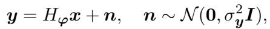
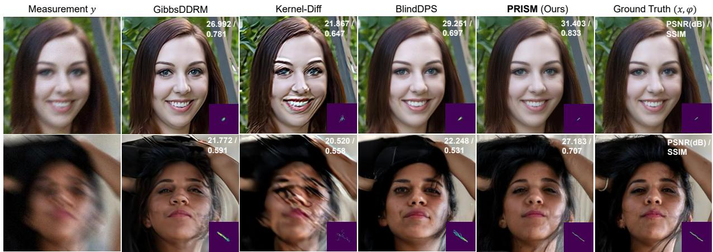

[← 返回 README](../README.md)

# 1. Introduction

## 📌 预览

Introduction 干三件事：(1) 用 MRI/CT/去模糊三个例子把"盲逆问题"公式化为 $y=H_\varphi x+n$；(2) 逐一点评三个扩散盲求解器 baseline（BlindDPS、GibbsDDRM、Kernel-Diff）各自的短板；(3) 亮出 PRISM 的定位——把三者的优点拼起来、缺点各自补上，并把最新的 Blind-PnPDM 当成最接近的对手。

---

In computational imaging, reconstructing an image when the forward model is partially unknown remains a significant challenge. Common examples of such unknowns in real applications include the sensitivity map in magnetic resonance image (MRI) reconstruction [1, 2], accurate view angles in Xray computed tomography (CT) [3, 4], and the blur kernel in image deblurring [5, 6]. Mathematically, the reconstruction task can be formulated as a blind inverse problem

where $x \in \mathbb{R}^n$ is the true underlying signal, $y \in \mathbb{R}^m$ is the observed measurement, $H_\varphi \in \mathbb{R}^{m \times n}$ is the forward matrix with unknown parameters $\varphi \in \mathbb{R}^p$, and $n$ is Gaussian measurement noise. The goal here is to recover $x$ as accurately as possible from $y$, which typically involves jointly estimating $\varphi$.

> 💡 **公式批读 (Eq.1)** (Hao 批注): 这就是整个课题的基准方程 $y = H_\varphi x + n$，$n\sim\mathcal{N}(0,\sigma_y^2 I)$。三个变量的角色要分清：$x$ 是图像信号（高维），$\varphi$ 是低维算子参数（本文即模糊核，$p\ll n$），$\sigma_y$ 是噪声标准差。非盲求解器只解 $x$；PRISM 是"jointly estimating $\varphi$"，即联合估计 $(x,\varphi)$。值得注意：本文把 $\sigma_y$ 当**已知**（后面公式里直接出现），并没有把噪声水平也纳入联合估计——这是它与我们"联合估计 $x,\varphi,\sigma$"设想的一个明确差异点。

Diffusion models have recently emerged as an effective tool for solving inverse problems [7, 8, 9]. Several methods have been developed for blind inverse problems using diffusion models, such as BlindDPS [10], GibbsDDRM [11], and Kernel-Diff [12]. Despite their effectiveness, each of these methods comes with certain limitations. For example, BlindDPS uses an unconditional diffusion model as a prior for estimating $\varphi$, leaving the rich information about $\varphi$ contained in $y$ unutilized. Similarly, although GibbsDDRM is more theoretically principled, it relies on a simple Laplace prior for $\varphi$, which often results in unsatisfactory recovery. Finally, while Kernel-Diff uses a conditional diffusion model for estimating $\varphi$ from $y$, it resorts to using a traditional non-blind deep network to predict $x$ from $y$ for a fixed estimate of $\varphi$. Since the diffusion model is not used as an image prior, any inaccuracies in estimating $\varphi$ may propagate into substantial errors in the estimate of $x$.

> 💡 **机制拆解：三个 baseline 的短板** (Hao 批注): 这段是 PRISM 的"竞品分析表"，读方法前先记牢，因为 PRISM 的每个设计都在补一个洞：
> - **BlindDPS**：核先验是**无条件**扩散模型，完全没用观测 $y$ 里关于 $\varphi$ 的信息 → PRISM 补：核先验条件化于 $y$。
> - **GibbsDDRM**：采样框架有理论依据（partially collapsed Gibbs），但核先验只是简单 **Laplace 先验**，表达力弱 → PRISM 补：用条件扩散模型当核先验。
> - **Kernel-Diff**：核估计用了条件扩散，但图像 $x$ 靠一个**传统非盲深网**从固定 $\hat\varphi$ 预测，扩散模型没当图像先验 → 后果是 $\varphi$ 估计误差会**级联**放大到 $x$。PRISM 补：$x$ 和 $\varphi$ 都用扩散先验，且交替更新而非一次性固定。

*Figure 1: Visual comparison of the image ($x$) and kernel ($\varphi$) reconstructions obtained by PRISM and baseline methods for the blind motion deblurring task ($\sigma = 0.05$). Each reconstruction shown is a single sample generated by each method (single-sample estimation). Note how PRISM recovers fine textures such as hair and skin wrinkles while also retaining high PSNR and SSIM values.*

> 💡 **Figure 1 批读** (Hao 批注): 这是 teaser 图，用**单样本**（不是后验均值）横向比较四个方法在 $\sigma=0.05$ 下的图像+核恢复。要点：
> - 强调"single sample"很关键——它对应更真实的使用场景（一次采样就要用），而后验均值需要平均多次。PRISM 声称在单样本下就能同时保住细纹理（头发、皮肤皱纹）和高 PSNR/SSIM。
> - 每个 case 同时给出重建图像和重建核，直观展示"联合估计 $(x,\varphi)$"。核缩略图能看出 GibbsDDRM/BlindDPS 的核有伪影，PRISM 的核更干净。
> - 从证据链看，Fig.1 只支撑 fidelity+perceptual 的**视觉**claim，UQ 的量化证据要到 Fig.3/4 和 Table 3。

In this work, we develop a novel diffusion-based blind inverse solver termed probabilistic and robust inverse solver with measurement-conditioned diffusion prior (PRISM) by extending the Plug-and-Play Diffusion Models (PnP-DM) framework introduced in [13] to the blind setting. The resulting approach overcomes the major limitations of BlindDPS, GibbsDDRM, and Kernel-Diff while retaining the best features of each of these algorithms. In particular, the proposed PRISM uses diffusion models as priors for reconstructing both $x$ and $\varphi$ (as in BlindDPS), employs a theoretically principled sampling scheme (as in GibbsDDRM), and leverages a powerful conditional diffusion model to effectively estimate $\varphi$ (as in Kernel-Diff). We note that a similarly derived method, Blind-PnPDM [14], was recently proposed; however we demonstrate that PRISM's use of a measurement-conditioned kernel prior offers substantial improvements over Blind-PnPDM in terms of both performance and robustness.

> 💡 **定位：PRISM = 三家优点的并集** (Hao 批注): 作者自述把 PRISM 定位成"取长补短"：扩散先验同时用于 $x$ 和 $\varphi$（学 BlindDPS）+ 有理论依据的采样框架（学 GibbsDDRM）+ 条件扩散估核（学 Kernel-Diff）。底座是 PnP-DM [13]（split Gibbs 的即插即用扩散后验采样），本文的贡献是把它**从非盲扩展到盲**。
>
> 最需要盯住的是最后一句：真正的近邻竞品是 **Blind-PnPDM [14]**（同为 2025，同样把 PnP-DM 用到盲设定）。PRISM 相对它的**唯一核心区别**就是核先验是否条件化于 $y$。全文的 robustness 论证（Fig.2）本质上是"conditional vs unconditional 核先验"的消融——这是判断 PRISM 贡献大小的关键，见 [03-numerical-validation](03-numerical-validation.md)。

---

## 🔖 Section 总结

### 关键数字/变量速查
| 符号 | 含义 |
|------|------|
| $x\in\mathbb{R}^n$ | 待恢复图像 |
| $\varphi\in\mathbb{R}^p$ | 未知算子参数（本文=模糊核，gauge 参数） |
| $\sigma_y$ | 噪声标准差（本文**已知**，不联合估计） |
| $H_\varphi$ | 前向算子 |

### 核心洞察
1. 盲逆问题统一写成 $y=H_\varphi x+n$，目标是联合恢复 $(x,\varphi)$。
2. PRISM 的每个设计都对应补一个 baseline 的洞：条件核先验补 BlindDPS，强核先验补 GibbsDDRM，双扩散先验补 Kernel-Diff 的误差级联。
3. 真正的对照组是 Blind-PnPDM，差异只在"核先验是否吃 $y$"。

### 可追问点
- 为什么"核先验条件化"能带来鲁棒性（对初始化不敏感）？→ [02-method](02-method.md) Kernel Conditional Prior Step + Fig.2。
- 联合估计里为何 $\sigma_y$ 不一起估？这是对比我们方案的关键空档。
