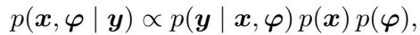
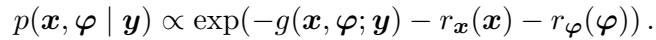
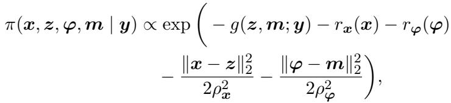
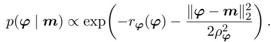
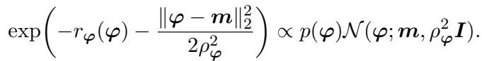
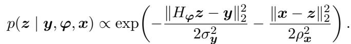
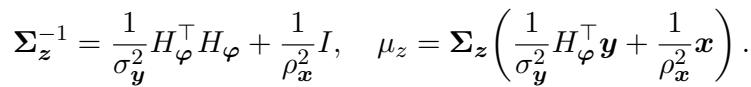
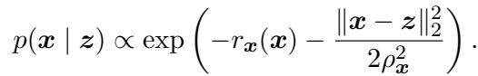
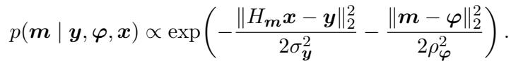
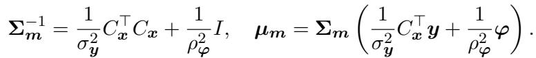

[← 返回 README](../README.md)

# 2. Method

## 📌 预览

方法节把"联合后验 $p(x,\varphi\mid y)$ 太难直接采"这个困难，用 **split Gibbs sampling (SGS)** 拆成四个交替的条件更新：核先验步、图像似然步、图像先验步、核似然步。核心技巧是引入辅助变量 $z,m$（$x,\varphi$ 的"带噪副本"），使得**先验步只碰先验、似然步只碰似然**——先验步用扩散模型去噪，似然步用 FFT 闭式求解。PRISM 相对 PnP-DM 的唯一增量：核先验步用 measurement-conditioned 扩散模型 $\mathsf{D}^\varphi(\cdot;y)$。

---

## 2.1 Blind Bayesian Inverse Problem

From a Bayesian perspective, solving blind inverse problems can be viewed as inferring the joint posterior distribution



where the likelihood $p(y \mid x, \varphi)$ enforces data fidelity, $p(x)$ is the prior of the image, and $p(\varphi)$ is the prior of the unknown parameters. In the negative log domain, we denote $g(x, \varphi; y) = -\log p(y \mid x, \varphi)$, $r_x(x) = -\log p(x)$, and $r_\varphi(\varphi) = -\log p(\varphi)$, giving



> 💡 **公式批读 (Eq.2–3)：目标分布** (Hao 批注): 这两式只是把贝叶斯拆解写清楚。联合后验 $\propto$ 似然 $\times$ 图像先验 $\times$ 核先验，三项相互独立地被建模。转到负对数域后记号：$g$=数据保真项（likelihood potential），$r_x$=图像先验正则，$r_\varphi$=核先验正则。关键设计点：图像和核**各有独立先验**（$r_x,r_\varphi$），这正是 PRISM 能对两者都用扩散先验的形式基础。

Directly sampling $p(x, \varphi \mid y)$ is difficult due to the strong coupling between $x$ and $\varphi$ and the nonconvex nature of the problem. To overcome this, we adapt the PnP-DM framework [13], which utilizes a split Gibbs sampling (SGS) strategy [15] to decouple the likelihood and priors. This is accomplished by introducing auxiliary variables $z \in \mathbb{R}^n$ and $m \in \mathbb{R}^p$ for $x$ and $\varphi$ and considering the augmented distribution



where $\rho_x, \rho_\varphi \gt 0$ control the coupling between $(x, z)$ and $(\varphi, m)$. The advantage of sampling from this distribution, rather than directly from $p(x, \varphi \mid y)$, is that the resulting updates for $x$ and $\varphi$ only involve the prior, while the corresponding updates for $z$ and $m$ only involve the likelihood. This strategy is analogous to the variable splitting technique used in Half-Quadratic Splitting [16] and ADMM [17], which has been shown to be effective for non-convex problems [18].

> 💡 **机制拆解：为什么要引入 $z,m$** (Hao 批注): 这是全文最关键的一步设计。直接采 $p(x,\varphi\mid y)$ 难在 $x$ 与 $\varphi$ **强耦合**（$H_\varphi x$ 里两者相乘）且非凸。SGS 的做法是给 $x$ 造一个辅助副本 $z$、给 $\varphi$ 造副本 $m$，用二次耦合项 $\|x-z\|^2/2\rho_x^2$、$\|\varphi-m\|^2/2\rho_\varphi^2$ 把它们"软绑定"。
> - **解耦效果**：在增广分布 Eq.4 里，$g$（似然）只出现在 $(z,m)$ 上，$r_x,r_\varphi$（先验）只出现在 $(x,\varphi)$ 上。于是更新 $x$ 时只需先验、更新 $z$ 时只需似然——这正对应 HQS/ADMM 的变量分裂。
> - **$\rho$ 的角色**：耦合强度。$\rho\to0$ 时副本被强制等于原变量（回到原问题），$\rho$ 大时解耦更彻底、混合更快。后面 annealing 就是把 $\rho$ 从大退到小。
> - **数据流视角**：辅助变量 $(z,m)$ 是本方法真正的"latent 中间表示"，四步更新就是在 $x\to z$（似然）、$z\to x$（先验）、$\varphi\to m$（似然）、$m\to\varphi$（先验）之间循环。

---

## 2.2 Proposed Method: PRISM

The proposed PRISM aims to sample from (4) by alternating between four conditional updates, which are outlined in the remainder of this section. In each update step, only one variable is updated while the others are kept fixed.

> 💡 **数据流总览：四步循环** (Hao 批注): 一次迭代 $k$ 依次做四件事（见 Algorithm 1）：
> 1. **核先验步** $m\to\varphi$：用条件扩散 $\mathsf{D}^\varphi(\cdot;y)$ 对 $m$ 去噪得到 $\varphi$；
> 2. **图像似然步** $x,\varphi\to z$：FFT 闭式采样 $z$；
> 3. **图像先验步** $z\to x$：用图像扩散 $\mathsf{D}^x(\cdot)$ 对 $z$ 去噪得到 $x$；
> 4. **核似然步** $x,\varphi\to m$：FFT 闭式采样 $m$。
> 
> 注意"先验步=扩散去噪、似然步=闭式高斯采样"这个二分是理解全文的钥匙。PRISM 的全部新意集中在第 1 步的"$;y$"条件。

### Kernel Conditional Prior Step

Given $m$, the kernel $\varphi$ is updated by sampling the distribution



The key insight in the PnP-DM framework is that right hand side of (5) is the likelihood of a Gaussian denoising problem with noise variance $\rho_\varphi^2$, prior $p(\varphi)$, and noisy observation $m$. Explicitly, this can be seen by rewriting the right hand side as



It is then straightforward to sample from this distribution using a diffusion model. In particular, [13] showed that one can simply initialize the reverse process with $\varphi$ (up to a scaling factor) and then run the reverse process from an appropriately chosen time point corresponding to a noise level of $\rho_\varphi$. We refer to [13] for complete details of how this can be performed with arbitrary diffusion models. In PRISM, we implement this step with a measurement-conditioned diffusion model denoted by $\mathsf{D}^\varphi(\cdot; y)$.

> 💡 **机制拆解：核先验步是全文唯一新意** (Hao 批注): 这一步是"measurement-conditioned diffusion prior"落地的地方。
> - **为什么是去噪问题**：Eq.5 右边 = $p(\varphi)\cdot\mathcal{N}(\varphi;m,\rho_\varphi^2 I)$（Eq.6），正是"观测到带噪 $m$、噪声方差 $\rho_\varphi^2$、先验 $p(\varphi)$，求 $\varphi$"的高斯去噪后验。而扩散模型天生就是去噪器：把 $m$ 当反向过程在噪声水平 $\rho_\varphi$ 处的输入，跑到 $t=0$ 就采出 $\varphi$。这是 PnP-DM 的核心 trick——**用扩散反向过程实现"从任意噪声水平去噪"**。
> - **PRISM 的增量**：这里的扩散模型是 $\mathsf{D}^\varphi(\cdot;y)$，**吃观测 $y$ 作为条件**。对比 Blind-PnPDM 用无条件核先验 $\mathsf{D}^\varphi(\cdot)$。直觉：$y$（模糊图）本身携带大量关于模糊核 $\varphi$ 的信息（模糊方向/长度），条件化让核采样从一开始就被 $y$ 拉向正确区域，而不是在整个核空间盲目游走。这解释了下面 Fig.2 的鲁棒性差异。
> - **数据流**：输入带噪核副本 $m$ + 观测 $y$，输出干净核样本 $\varphi$。

Empirically, we found that measurement conditioning is not a minor design choice, but is critical to the success of the proposed approach. This is demonstrated in Fig. 2, where we show that Blind-PnPDM, which is conceptually similar to PRISM but uses an unconditional kernel prior, yields poor convergence and fails to find a reasonable solution when $\varphi$ is initialized randomly.

> 💡 **claim 与证据的挂钩** (Hao 批注): 作者明确把"measurement conditioning is critical"这个 claim 绑到 Fig.2 上——这是全文最重要的一次消融（其实就是 conditional vs unconditional 核先验）。读实验节时要重点验证：Fig.2 是否真的把变量控制干净（除了条件化外其它都一样）。

### Image Likelihood Step

Given $x$ and $\varphi$, the latent $z$ is drawn from



When $H_\varphi$ is linear, this distribution is Gaussian with covariance and mean specified by



Importantly, all of the operations in (8) can be implemented efficiently using the Fast Fourier Transform (FFT). For non-linear $H_\varphi$ or non-Gaussian noise, gradient-based MCMC methods such as Langevin dynamics can be used to effectively draw samples [19, 13, 20].

> 💡 **公式批读 (Eq.7–8)：图像似然步是闭式高斯** (Hao 批注): 这一步只碰似然，不碰先验。当 $H_\varphi$ 线性、噪声高斯时，$p(z\mid y,\varphi,x)$ 是高斯，均值/协方差有闭式解（Eq.8）：精度矩阵 $\Sigma_z^{-1}=\frac{1}{\sigma_y^2}H_\varphi^\top H_\varphi+\frac{1}{\rho_x^2}I$——第一项来自数据保真、第二项来自与副本 $x$ 的耦合。
> - **为什么能 FFT**：去模糊中 $H_\varphi$ 是卷积（循环）矩阵，$H_\varphi^\top H_\varphi$ 在频域是对角的，求逆变成逐元素除法，$O(n\log n)$。这是本步高效的根源。
> - **注意 $\sigma_y$ 直接出现在公式里**——再次印证噪声水平被当作已知量，不参与联合估计。
> - 非线性/非高斯情形退回 Langevin MCMC（引 [19,13,20]），本文实验不涉及。

### Image Prior Step

Given $z$, the image $x$ is updated by sampling from



The implementation of this step is essentially identical to the Kernel Prior Step, and is achieved by running the reverse process of a pretrained diffusion model, which we denote by $\mathsf{D}^x(\cdot)$.

> 💡 **机制拆解：图像先验步用无条件扩散** (Hao 批注): 结构与核先验步完全对称——把 $z$（图像的带噪副本）当噪声水平 $\rho_x$ 处的输入，用**预训练无条件图像扩散** $\mathsf{D}^x(\cdot)$ 跑反向过程去噪得到 $x$。注意这里图像先验是**无条件**的（不吃 $y$），只有核先验才条件化。这符合 baseline 分析：图像先验各家都用扩散，PRISM 的差异化只在核先验。

### Kernel Likelihood Step

Given $x$ and $\varphi$, the kernel $m$ is drawn from



As in the image likelihood step, this distribution is Gaussian, and its mean and covariance are available in closed form. This can be seen by using the fact that convolution is commutative to treat $x$ as the kernel and $m$ as the signal. In matrix form, we can write $H_m x = C_x m$, where $C_x$ is an appropriate Toeplitz matrix constructed from $x$. We then obtain the covariance and mean exactly as in the image likelihood step



More details on how to efficiently compute these quantities and sample from $\mathcal{N}(\mu_m, \Sigma_m)$ can be found in Appendix C of [13].

> 💡 **公式批读 (Eq.10–11)：核似然步靠卷积交换律** (Hao 批注): 巧妙的对称。核似然本来含 $H_m x$（核 $m$ 卷图像 $x$），看似要对 $m$ 建新的算子。但卷积可交换：$H_m x = C_x m$，把**图像 $x$ 当作卷积核**、$m$ 当信号，$C_x$ 是由 $x$ 构造的 Toeplitz 矩阵。于是核似然步在数学上与图像似然步**同构**，同样得到闭式高斯 $\mathcal{N}(\mu_m,\Sigma_m)$，同样可 FFT 高效采样。这一手让"估图像"和"估核"共享一套线性代数机制。

The complete PRISM procedure is summarized in Algorithm 1. We initialize $x^0$ and $m^0$, then iterate the four updates with coupling parameters $\rho_x^k, \rho_\varphi^k$ annealed from large to small values. This annealing accelerates chain mixing and helps escape poor local minima in highly ill-posed blind inverse problems.

### Algorithm 1: PRISM

```text
Input:  初始化 x^0, m^0；总迭代数 K；耦合退火表 {ρ_x^k}, {ρ_φ^k}；
        似然势 g(·;y)；预训练图像扩散模型 D^x(·)（无条件）；
        核扩散模型 D^φ(·;y)（以 y 为条件）
Output: (x^K, φ^K)，作为 π(x,φ|y) 的近似样本

1: for k = 1,2,...,K do
2:     φ^k ← KernelCondPrior( m^{k-1}, ρ_φ^k, D^φ(·;y) )   # 核先验步 (Eq.5,6)
3:     z^k ← ImageLikelihood( x^{k-1}, φ^k, ρ_x^k, g(·;y) )  # 图像似然步 (Eq.7,8)
4:     x^k ← ImagePrior( z^k, ρ_x^k, D^x(·) )                # 图像先验步 (Eq.9)
5:     m^k ← KernelLikelihood( x^k, φ^k, ρ_φ^k, g(·;y) )     # 核似然步 (Eq.10,11)
6: end for
```

> 💡 **Algorithm 1 批读：一次迭代的闭环** (Hao 批注): 把四步串起来看数据流闭环——$m^{k-1}\xrightarrow{\text{条件扩散}}\varphi^k$，$\varphi^k$ 送进图像似然采 $z^k$，$z^k\xrightarrow{\text{图像扩散}}x^k$，$x^k$ 再回去采核副本 $m^k$，完成一圈。两个"先验步"是扩散去噪（贵，多步反向过程），两个"似然步"是 FFT 闭式（便宜）。
> - **退火（annealing）**：$\rho_x^k,\rho_\varphi^k$ 从大到小指数退火。大 $\rho$ 时耦合弱、探索强，帮助**逃离盲问题的坏局部极小**；小 $\rho$ 时收敛到精确解。这是 PRISM 声称"随机初始化也能稳定收敛"的机制来源之一（另一来源是核先验条件化）。
> - **与 baseline 的根本区别**：这是一条 **MCMC 链**——只需一条收敛链就能连续吐样本；而 BlindDPS/GibbsDDRM/Kernel-Diff 是反向扩散，每要一个新样本就得重跑整条反向过程。这直接决定了后面 UQ 小节里"PRISM 从单链取 20 样本 vs baseline 跑 20 次独立运行"的对比方式。
> - **本课题视角**：这正是我们关心的"gauge-aware 联合后验采样"的一个具体实例——$\varphi$（gauge/核）和 $x$ 交替更新、软耦合。但它没有对 $\sigma$ 建模，也没在算法层面处理 $\varphi$ 的规范不变性（scale/shift gauge），这是可追问的差异。

---

## 🔖 Section 总结

### 关键变量速查
| 符号 | 含义 | 更新方式 |
|------|------|----------|
| $x$ | 图像 | 图像先验步：扩散 $\mathsf{D}^x(\cdot)$ 去噪 $z$ |
| $z$ | 图像辅助副本 | 图像似然步：FFT 闭式高斯 (Eq.8) |
| $\varphi$ | 模糊核 | 核先验步：条件扩散 $\mathsf{D}^\varphi(\cdot;y)$ 去噪 $m$ |
| $m$ | 核辅助副本 | 核似然步：FFT 闭式高斯 (Eq.11) |
| $\rho_x,\rho_\varphi$ | 耦合强度 | 从大到小指数退火 |

### 核心洞察
1. **分裂技巧**：引入 $z,m$ 让先验步与似然步彻底解耦——先验步=扩散去噪，似然步=FFT 闭式高斯采样。
2. **唯一新意**：核先验步用 measurement-conditioned 扩散 $\mathsf{D}^\varphi(\cdot;y)$；图像先验仍无条件。
3. **对称性**：靠卷积交换律 $H_m x=C_x m$，核似然步与图像似然步同构，共享 FFT 机制。
4. **MCMC 本质**：一条退火链连续采样，这是它相对反向扩散 baseline 在 UQ 上更"便宜"的根源。

### 可追问点
- 每步扩散反向过程跑多少步？总迭代 $K$ 多大？（正文没给，指向 code）→ 影响与 baseline 的**公平计算成本**比较。
- 退火表如何设？"exponentially annealed"具体起止值未在正文给出。
- 为什么不把 $\sigma_y$ 也纳入 Gibbs 循环？形式上完全可以再加一步噪声似然/先验——这是我们方案的差异化空间。
