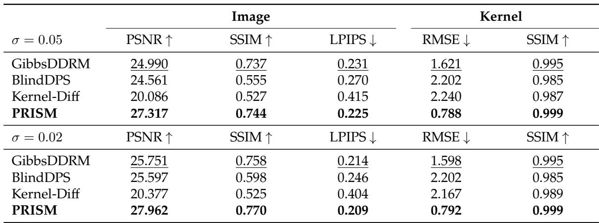
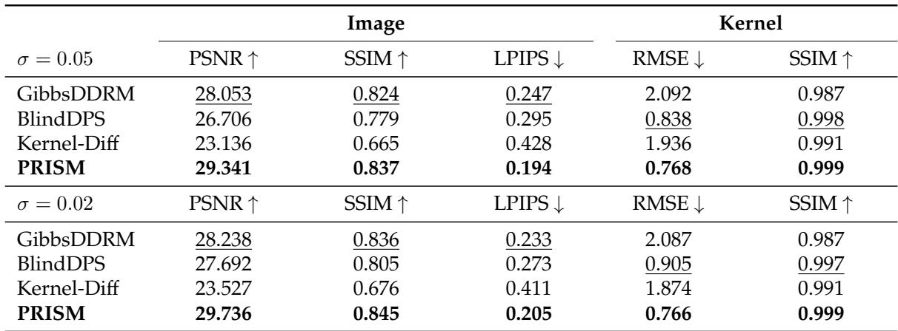
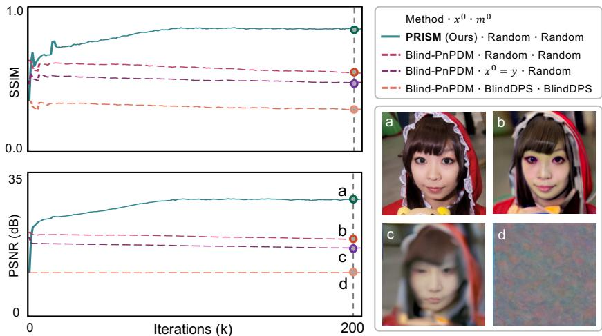
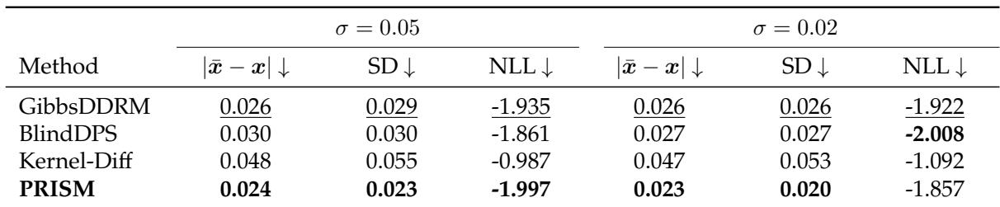
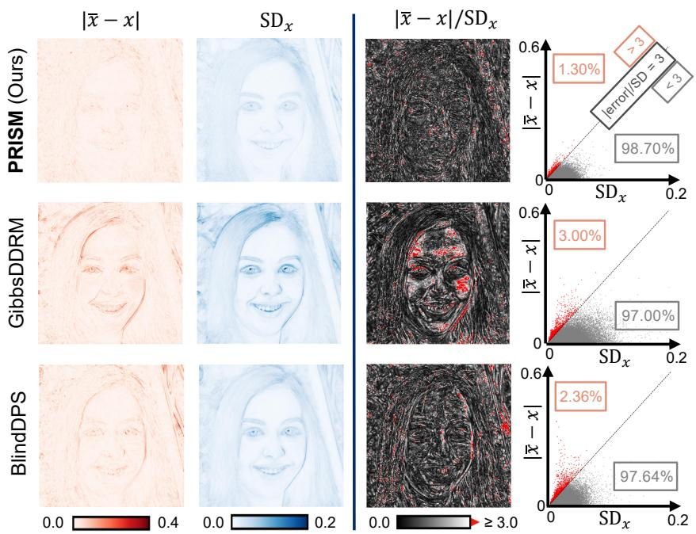
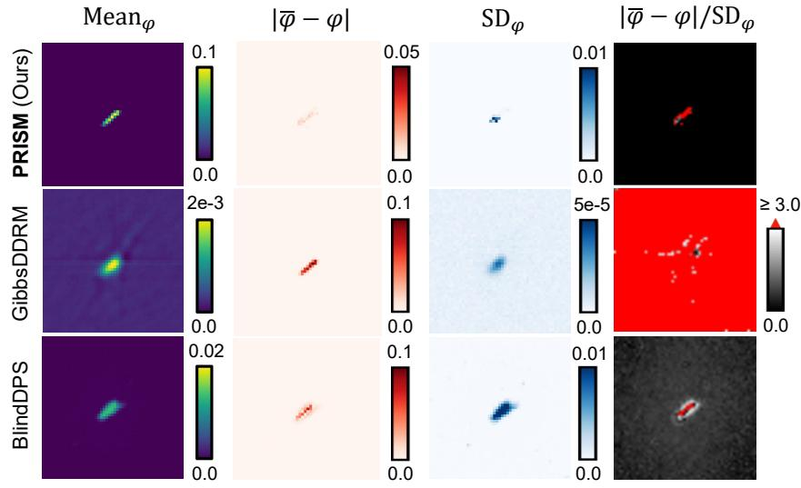

[← 返回 README](../README.md)

# 3. Numerical Validation

## 📌 预览

实验节围绕三条 claim 组织证据：(1) **重建性能**——单样本(Table 1)与后验均值(Table 2)下图像+核都更好；(2) **鲁棒性/收敛**——Fig.2 用 conditional vs unconditional 核先验的对比证明"条件化是关键"；(3) **不确定性量化(UQ)**——Table 3 的 NLL、Fig.3/4 的像素级 SD 与 3-SD 覆盖。本节是本课题最该逐字核查的部分：PRISM 到底报告了哪些校准相关指标，缺哪些。

---

## 3.1 Experimental setup

We validate PRISM on the task of blind motion deblurring using the FFHQ dataset [21]. We further corrupt the measurements with the additive white Gaussian noise of standard deviation $\sigma$. For the image prior, we use the pretrained unconditional image diffusion model from [13] as $\mathsf{D}^x(\cdot)$. For the kernel prior, we implement a measurement-conditioned kernel diffusion model $\mathsf{D}^\varphi(\cdot; y)$ based on the architecture in [22]. To train the kernel diffusion model, we use a motion blur kernel generator to create a dataset comprising 25 million $(\varphi, y)$ pairs. The kernel diffusion model is trained for 500,000 steps with a batch size of 128. For evaluation, we create a test dataset containing 50 randomly selected FFHQ images and 50 motion blur kernels. During inference, the coupling parameters $\rho_x^k$ and $\rho_\varphi^k$ are exponentially annealed. All hyperparameters of PRISM are fine-tuned using a separate validation dataset. Detailed hyperparameter values and model architectures are provided in the code. To measure the image reconstruction quality, we use peak signal-to-noise ratio (PSNR) and structural similarity index measure (SSIM). We also employ learned perceptual image patch similarity (LPIPS) for quantifying the human perception quality.

> 💡 **实验设置批读** (Hao 批注): 几个要点决定了结论的适用边界：
> - **任务单一**：只有 FFHQ 人脸的**盲运动去模糊**。没有 MRI/CT 等 intro 提到的其它盲问题，泛化性未验证。
> - **核先验的训练代价**：条件核扩散在 **25M 个 $(\varphi,y)$ 对** 上训 500k 步（batch 128）。这是 PRISM 相对无条件核先验(Blind-PnPDM)多付的成本——它把"鲁棒性"部分买单于一个庞大的合成配对训练集。评价 PRISM 时要记住：它的优势不是免费的。
> - **图像先验直接复用 [13] 的预训练模型**，没重训——所以 PRISM 的图像质量提升主要来自更好的核估计+联合采样框架，而非更强的图像先验。
> - **测试集小**：50 图 × 50 核。UQ 统计量在这个规模上的方差需留意。
> - **指标分层**：PSNR/SSIM 是 **fidelity**，LPIPS 是 **perceptual**。后面看结果要分开读——PRISM 常见的模式是 fidelity 和 perceptual 同时占优，值得注意。

Table 1: Numerical results obtained by PRISM and baselines for single-sample estimation. All values are averaged over the test dataset. RMSE values are in $10^{-3}$ units. Bold marks best results; underlined numbers indicate second best.

*Table 1: 单样本估计下 PRISM 与 baseline 的数值结果（测试集平均，RMSE 单位 $10^{-3}$）。*

> 💡 **Table 1 批读：单样本 fidelity claim** (Hao 批注): 单样本场景（每方法只取一个后验样本，最贴近真实使用）。$\sigma=0.05$ 时图像 PSNR：PRISM **27.317** vs 次优 GibbsDDRM 24.990，**领先 ~2.3 dB**（正文说"more than 2 dB"）。核恢复 RMSE：PRISM **0.788** vs GibbsDDRM 1.621，几乎砍半；核 SSIM 0.999。$\sigma=0.02$ 同趋势（PSNR 27.962）。PRISM 在 PSNR/SSIM(fidelity)、LPIPS(perceptual)、核 RMSE/SSIM 五项全占优——这是难得的"保真与感知不 trade-off"。核 RMSE 的大幅领先直接支撑"条件核先验估核更准"的 claim。

Table 2: Numerical results obtained by PRISM and baselines for posterior mean estimation. All values are averaged over the test dataset. RMSE values are in $10^{-3}$ units. Bold marks best results; underlined numbers indicate second best.

*Table 2: 后验均值估计下 PRISM 与 baseline 的数值结果（测试集平均，RMSE 单位 $10^{-3}$）。*

> 💡 **Table 2 批读：后验均值 + 关键的公平性细节** (Hao 批注): 后验均值场景（对 MSE/PSNR 最优）。PRISM 图像 PSNR **29.341/29.736**，仍领先 GibbsDDRM ~1.3 dB。但真正要划重点的是**均值是怎么算的**（见下方 3.2 正文）：PRISM 用**一条收敛链里的 20 个样本**平均，而 baseline 用 **20 次独立运行**的输出平均。这不是无关紧要的措辞——它是 PRISM"作为 MCMC 采样器更高效"的核心论据，也意味着 PRISM 拿 20 样本的**计算成本远低于** baseline 跑 20 遍完整反向扩散。评估公平性时这是要盯的点。
> - 注意 $\sigma=0.05$ 下 BlindDPS 的核 RMSE 0.838 反超 GibbsDDRM，说明后验均值场景各家排序会变，但 PRISM 始终第一。

## 3.2 Experimental Results

### Reconstruction Performance

We evaluate the reconstruction performance of PRISM for both the image and the blur kernel. We compare PRISM with three state-of-the-art baselines: GibbsDDRM [11], BlindDPS [10], and Kernel-Diff [12]. In particular, we report the numerical results for two scenarios: (i) single-sample estimate (Table 1), which considers only one posterior sample $(x, \varphi)$ for each method; and (ii) posterior mean estimate (Table 2), where PRISM averages 20 posterior samples $\{(x_i, \varphi_i)\}_{i=1}^{20}$ from one converged chain while baselines average the output of 20 independent runs (see further explanation in Uncertainty Quantification). The first scenario matches more real-world use cases, while the second one aims to approximate the mean of the posterior for optimal performance in terms of mean squared error (MSE) and PSNR. Fig. 1 presents a visual comparison of results obtained by PRISM and the baseline methods. Across all estimation scenarios and noise levels, PRISM consistently achieves superior numerical performance in both image reconstruction and kernel estimation. Notably, PRISM outperforms GibbsDDRM (the best baseline) by more than 2 dB in PSNR for single-sample estimation. In addition, PRISM accurately restores the blur kernel, attaining the lowest root MSE (RMSE) and highest SSIM values. The visual results in Fig. 1 further demonstrate PRISM's outstanding performance. Note the accurate recovery of fine image textures such as hair and skin wrinkles, as well as the blur kernel itself.

> 💡 **证据链批读：单样本 vs 后验均值** (Hao 批注): 作者刻意分两个场景是有讲究的。单样本场景对**采样器质量**更苛刻——一次采样就要好，说明后验的每个 draw 都靠谱；后验均值场景则是 MSE 最优点估计。PRISM 两个场景都赢，且它取 20 样本只需一条链，成本上占便宜。这段把 fidelity（PSNR/RMSE）、perceptual（LPIPS）、视觉（Fig.1）三类证据都归到"重建性能"claim 下。

### Robustness & Convergence

In this section, we show that the inclusion of the measurement $y$ as a condition in the kernel diffusion prior is critical for ensuring the robustness and convergence of PRISM. Fig. 2 plots the PSNR and SSIM obtained by PRISM and Blind-PnPDM [14] across 200 iterations; the final images are also visualized for comparison. We implemented Blind-PnPDM following the pseudocode and hyperparameter configurations provided in [14]. While PRISM is initialized only with random $x^0$ and $m^0$, we consider three different initializations for Blind-PnPDM to ensure full exploration of its potential: (i) random $x^0$ and $m^0$, (ii) $x^0 = y$ and random $m^0$, and (iii) the outputs of BlindDPS as $x^0$ and $m^0$. As shown in the Fig 2, PRISM converges to a high-quality image from the random initializations, with steady gains until saturation. On the other hand, Blind-PnPDM fails to converge to a reasonable image in this case. By offering better initializations, we observe that the performance of Blind-PnPDM improves; see images (b) and (c) in Fig 2. Nevertheless, it still yields to inferior reconstructions to PRISM and shows unwanted sensitivity to different initializations. Note how image (a) provides better visual quality compared to images (b), (c), and (d).

*Figure 2: Convergence comparison between PRISM and Blind-PnPDM [14]. Results for Blind-PnPDM are shown for three different initialization settings. Note that Blind-PnPDM struggles to converge to a reasonable image with fully random initializations, while PRISM achieves steady convergence to a high-quality image.*

> 💡 **Figure 2 批读：全文最核心的消融** (Hao 批注): 这张图本质是 **conditional 核先验(PRISM) vs unconditional 核先验(Blind-PnPDM)** 的受控对比，直接支撑"measurement conditioning is critical"这个招牌 claim。读法：
> - **变量控制**：PRISM 只给随机 $x^0,m^0$；Blind-PnPDM 特意给了三种初始化（含最有利的 BlindDPS 输出 (iii)）"充分发挥其潜力"。即便如此，Blind-PnPDM 随机初始化 (i) 直接**崩了**（收敛不到合理图像），好初始化 (b)(c) 也仍逊于 PRISM 且**对初始化敏感**。
> - **结论**：条件核先验让 $\varphi$ 的采样从一开始就被 $y$ 约束，摆脱对好初始化的依赖——这就是"robust"claim 的实证核心。
> - **对本课题的价值**：这正是我们关心的"gauge 初始化敏感性"问题的一个正面案例。但要注意——Fig.2 只画了 PSNR/SSIM 收敛曲线，**没有画后验分布/校准随迭代的变化**，鲁棒性论证仍停留在点估计质量层面。

### Uncertainty Quantification

We lastly discuss the uncertainty quantification (UQ) enabled by PRISM as a posterior sampling method. We considered GibbsDDRM [11], BlindDPS [10], and Kernel-Diff [12] as baselines, all of which are based on the reverse diffusion framework. PRISM differs from these methods by adopting a Markov chain Monte Carlo (MCMC) formulation, allowing samples to be drawn from a single converged chain rather than requiring multiple runs of the algorithm for generating different samples. To quantitatively measure the quality of UQ, we compute the normalized negative log-likelihood (NLL) [23] of the ground truth $x$, assuming independent pixel-wise Gaussian distributions characterized by sample mean $\bar{x}$ and standard deviation SD. Note that better UQ algorithms minimize NLL by producing an accurate $\bar{x}$ and avoiding an excessively large SD. Table. 3 summarizes the averaged NLL values obtained by all methods. We additionally summarize the pixel-wise absolute error ($|\bar{x} - x|$) and standard deviation (SD) for completeness. The results show that PRISM achieves competitive UQ performance compared with baselines. In particular, PRISM yields more accurate sample mean and avoids large SD. Fig. 3 visualizes the pixel-wise statistics associated with the image reconstruction in Fig. 1 (1st row). In the right column, we plot the 3-SD credible interval, with outside pixels highlighted in red. Note that around 99% of the pixels in the ground-truth image lie in the 3-SD interval produced by PRISM, which is superior to that achieved by GibbsDDRM and BlindDPS. Fig. 4 further visualizes the pixel-wise statistics of the reconstructed motion kernel, including the sample mean, absolute error, SD, and error-SD ratio. First, GibbsDDRM is overly confident in its inaccurate mean, as evidenced by its large absolute error and excessively small SD. While BlindDPS improves the accuracy of the sample mean, it yields large SDs for most pixels in the kernel region. In contrast, PRISM achieves both an accurate sample mean and a small SD.

> 💡 **UQ 批读：本课题最关心的一节（附完整校准审计）** (Hao 批注): 这是与我们主线正面碰撞的地方，逐条拆 PRISM 报告了什么、没报告什么。
>
> **它如何表示盲不确定性**：假设**逐像素独立高斯**，用样本均值 $\bar{x}$ 和样本标准差 SD 刻画。对图像和核都算像素级 SD。
>
> **它用了哪些校准相关指标**：
> 1. **归一化 NLL** [23]（越低越好，在 $\bar x$ 准确且 SD 不过大时最优）——Table 3；
> 2. **像素级绝对误差 $|\bar x - x|$ 与 SD** 的对比（希望两者匹配）；
> 3. **3-SD 可信区间覆盖**：约 **99%** 的真值像素落在 PRISM 的 3-SD 区间内（Fig.3），优于 GibbsDDRM/BlindDPS；
> 4. **error-to-SD ratio**（核，Fig.4）：诊断"过自信/过保守"。
>
> **采样机制差异（它的 UQ 卖点）**：PRISM 是 MCMC，从**一条收敛链**取多样本；baseline 是反向扩散，每个样本要**重跑一遍**。这让 PRISM 生成后验样本更廉价。
>
> **它缺哪些校准证据（我们要打的点）**：
> - **只有名义 3-SD（99.7%）对应 ~99% 覆盖的单点陈述**，没有画 **coverage/reliability 曲线**（多个名义置信度 vs 实际覆盖率），无法判断整体是否校准还是只在 3-SD 处凑巧。
> - **没有 SBC**（simulation-based calibration）、**没有 CRPS**、没有 rank/PIT 直方图——严格校准检验全缺。
> - **逐像素独立高斯**假设忽略空间相关，NLL 因此可能被系统性偏置；未做相关性/多元校准。
> - **UQ 只在图像和核上，$\sigma_y$ 无 UQ**（因为压根不估 $\sigma$）。
> - Fig.3/4 只展示**单个样例**的像素统计，NLL 表是数据集平均但覆盖率的 99% 只是定性描述、无置信区间。
> 
> 结论：PRISM 的 UQ 是"**probabilistic 但未系统校准**"——报告了 SD/NLL/单点覆盖，属于合理的定性 UQ；但缺 SBC/coverage 曲线/CRPS 这类可证伪的校准证据。这正是我们做"gauge-aware 联合后验 + SBC/coverage/CRPS 校准检验"的差异化切入口：**正面比校准，而不只是比图像质量**。

Table 3: The averaged absolute error ($|\bar{x} - x|$), SD and NLL values obtained by PRISM and baselines for image reconstruction. All values are averaged over the test dataset. Bold marks best results; underlined numbers indicate second best.

*Table 3: PRISM 与 baseline 在图像重建上的平均绝对误差 $|\bar x-x|$、SD 与 NLL（测试集平均）。*

> 💡 **Table 3 批读：NLL 的胜负其实很微妙** (Hao 批注): 逐列看会发现 PRISM 的 UQ 优势**没有 fidelity 那么压倒性**：
> - $\sigma=0.05$：PRISM NLL **-1.997**（最优），绝对误差 0.024、SD 0.023 都最低 → 均值更准、SD 更小，是干净的赢。
> - $\sigma=0.02$：PRISM NLL **-1.857**，反而**输给** BlindDPS 的 **-2.008**（次优是 GibbsDDRM -1.922）！虽然 PRISM 绝对误差(0.023)和 SD(0.020)仍最低。
> - 这个反常点很关键：NLL 同时惩罚"误差大"和"SD 与误差不匹配"。PRISM 在 $\sigma=0.02$ 下 SD 偏小(0.020)但误差(0.023)略大，说明它可能**略微过自信**（SD 撑不住误差），导致 NLL 被拉高。这恰恰印证了"缺 coverage 曲线就看不清校准全貌"——单看 3-SD 覆盖 99% 会以为很好，但 NLL 暴露了低噪声下的过自信倾向。
> - 对本课题：这是一个可直接引用的证据——PRISM 的校准在不同噪声水平下**不稳定**，为我们用 SBC/coverage 做更严格诊断提供了动机。

*Figure 3: Visualization of the pixel-wise statistics associated with the image reconstruction ($x$) shown in Fig. 1 (1st row). The left columns plot the absolute error ($|\bar{x} - x|$) and standard deviation (SD), and the right columns plot the 3-SD credible interval with the outlying pixels highlighted in red.*

> 💡 **Figure 3 批读：图像的像素级 UQ（含实际覆盖数字）** (Hao 批注): 左侧并排 $|\bar x-x|$ 与 SD——理想情况两张图空间模式应**相似**（误差大的地方 SD 也大，即"知道自己哪里不确定"）。右侧是 **$|\bar x-x|$ vs SD 的散点图**，用 $|\text{error}|/\text{SD}=3$ 作分界线，标出比例：**PRISM 98.70% 落在 3-SD 内（1.30% 外）**，GibbsDDRM 97.00%（3.00% 外），BlindDPS 97.64%（2.36% 外）——PRISM 覆盖最高，对应正文"~99%"。
> - 但要冷静看：三者都在 97–99% 区间，PRISM 只领先约 1–2 个百分点，**并非量级差距**；而理论 3-SD 名义覆盖应为 99.7%，三者**都偏低**（欠覆盖/略过自信），只是 PRISM 最接近。这再次说明单看一个名义置信度不够，需要 reliability 曲线扫多个置信度才能定校准。
> - 仍是**单样例定性可视化**，非数据集级校准曲线。可追问：误差与 SD 的空间相关系数是多少？正文没给量化。

*Figure 4: Visualization of the pixel-wise statistics associated with the kernel reconstruction ($\varphi$) shown in Fig. 1 (1st row). From left to right, the plots show the sample mean, absolute error ($|\bar{\varphi} - \varphi|$), standard deviation (SD), and error-to-SD ratio, where the outlying pixels are highlighted in red.*

> 💡 **Figure 4 批读：核的 UQ 与"过自信/过保守"诊断** (Hao 批注): 这张图最有信息量的是 **error-to-SD ratio** 这一列——它直接诊断校准方向：
> - **GibbsDDRM**：绝对误差大 + SD 极小 = **过自信**（对错误的均值还很笃定，危险）。
> - **BlindDPS**：均值改善了，但核区域 SD 普遍偏大 = **过保守**（不确定性虚高）。
> - **PRISM**：均值准 + SD 小，error-SD ratio 更均衡。
> 这是全文对"校准方向"最明确的定性论证，且是在 **gauge 参数 $\varphi$（核）本身**上做 UQ——正合我们对"低维算子参数的不确定性"的关注。局限同 Fig.3：单样例、无跨数据集统计。

---

## 🔖 Section 总结

### 关键数字速查
| 指标 (σ=0.05, 单样本) | PRISM | 次优 baseline |
|------|------|------|
| 图像 PSNR↑ | **27.317** | 24.990 (GibbsDDRM) |
| 图像 LPIPS↓ | **0.225** | 0.231 (GibbsDDRM) |
| 核 RMSE↓ (×10⁻³) | **0.788** | 1.621 (GibbsDDRM) |
| 图像 NLL↓ (σ=0.05) | **-1.997** | -1.935 (GibbsDDRM) |
| 图像 NLL↓ (σ=0.02) | -1.857 | **-2.008** (BlindDPS 反超) |
| 3-SD 覆盖 | ~99% | 低于 PRISM |

### 核心洞察
1. **Fidelity/perceptual 全面领先**：单样本 PSNR +2 dB、核 RMSE 近半，且 PSNR/SSIM/LPIPS 不 trade-off。
2. **鲁棒性 = 条件核先验**：Fig.2 证明 conditional 核先验对随机初始化鲁棒，unconditional(Blind-PnPDM) 崩溃或对初始化敏感。
3. **UQ 是定性优势、非严格校准**：报告 SD/NLL/3-SD 覆盖/error-SD ratio；但 $\sigma=0.02$ 下 NLL 被 BlindDPS 反超，暴露低噪声过自信；缺 SBC/coverage 曲线/CRPS。
4. **MCMC 采样更廉价**：一条链取 20 样本 vs baseline 跑 20 次。

### 可追问点（对本课题）
- PRISM 未报告 coverage/reliability 曲线、SBC、CRPS → 我们的校准检验有正面比较空间。
- 逐像素独立高斯假设忽略空间相关，NLL 可能被偏置。
- $\sigma_y$ 当已知、不做 UQ → 联合估计 $\sigma$ 是我们的差异点。
- 只在 FFHQ 运动去模糊验证，跨任务/跨算子泛化未知。
