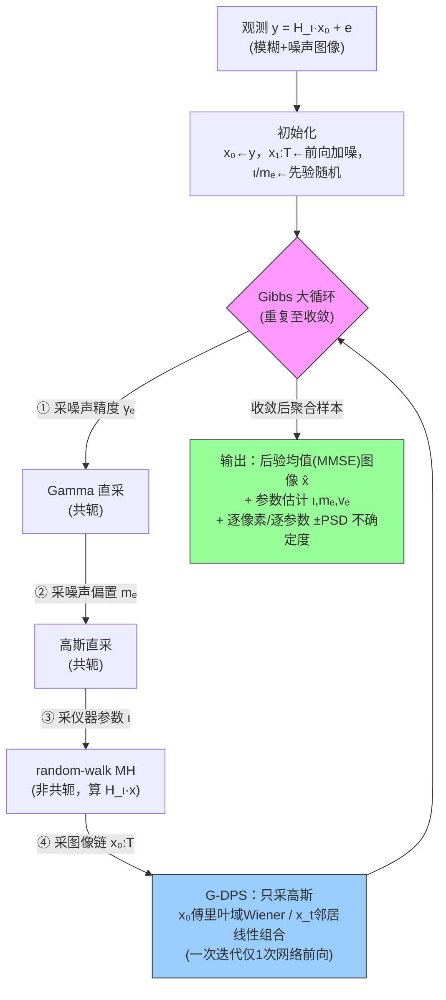

# Estimation of instrument and noise parameters for inverse problem based on prior diffusion model

**作者**: Jean-François Giovannelli（Groupe Signal-Image, IMS — Univ. Bordeaux, CNRS, BINP, Talence, France）
**会议/期刊**: arXiv preprint（EUSIPCO / IEEE Signal Processing letter 风格短文）| **年份**: 2026（2026-02-12 提交，v2 2026-07-07）
**链接**: [arXiv:2602.11711](https://arxiv.org/abs/2602.11711) · [PDF](https://arxiv.org/pdf/2602.11711v2)

## 一句话总结

在"线性算子 + 加性高斯噪声 + 扩散先验"的贝叶斯逆问题里，用一个 **Gibbs 大循环（Hyper-G-DPS）同时估计图像 $x_0$、仪器参数 $\iota$（PSF 宽度）、噪声偏置 $m_e$ 与方差 $v_e$**，并给出不确定性量化——关键靠"共轭先验让低维参数直采 + G-DPS 让图像块只采高斯"，而非新的似然 score 近似。

## 核心贡献

1. **首次在扩散先验下联合估计仪器 + 噪声参数**：相比 GibbsDDRM（[17]，只估仪器、不估噪声、不在隐变量间交替），本文把 $\iota,m_e,v_e$ 全部纳入并给 UQ（Remark 1）。
2. **共轭 + 条件独立的双重设计**：$\gamma_e{=}1/v_e$ 用 Gamma 先验（条件后验仍 Gamma，直采）、$m_e$ 用高斯先验（直采）、$\iota$ 用均匀先验（random-walk MH），图像块用 G-DPS（只采高斯、协方差对角、一次迭代只过一次网络）。
3. **可用的不确定性量化**：参数与逐像素的真值都落在 [估计 ± 2 PSD] 区间内（Tab. I、Fig. 5），且把观测参数的不确定度传播进图像后验，避免"固定参数导致的过自信"。
4. **高效且几乎无调参**：MNIST 32×32 上 952 次迭代 / 62 秒，除停机阈值外无算法超参（对比 DPS/ΠGDM 需调一堆超参）。

## 📖 批读导航

| Section | 内容 |
|---------|------|
| [00 - Abstract](sections/00-abstract.md) | 摘要 + 全文定位（联合后验 + UQ + 相对 DPS/GibbsDDRM 的差异） |
| [01 - Introduction](sections/01-introduction.md) | 问题建模 $y=H_\iota x_0+e$、为何必须联合估参数、为何扩散先验下难（Eq. 1） |
| [02 - Likelihood, Prior, Posterior](sections/02-likelihood-prior-posterior.md) | 似然 (2)、各参数共轭先验 (3)(4)(5)、扩散先验的马尔可夫表述 (6)–(9)、完整后验 (10) |
| [03 - Gibbs Sampler](sections/03-gibbs-sampler.md) | 核心方法：Fig. 1 层级图、Remark 1、图像块/$\gamma_e$/$m_e$/$\iota$ 四个条件后验 |
| [04 - Numerical Assessment](sections/04-numerical-assessment.md) | MNIST 实验：链收敛(Fig.2)、二维边缘(Fig.3)、Tab. I、图像恢复(Fig.4)、像素 UQ(Fig.5)、效率 |
| [05 - Conclusion](sections/05-conclusion.md) | 贡献综述 + 展望（模型选择） |
| [06 - Appendix](sections/06-appendix.md) | 图像块 Gibbs 细节：$x_0$(傅里叶 Wiener/Tikhonov)、$x_t$(邻居线性组合)、$x_T$(单步前向) |

## 关键数字

| 指标 | 数值 |
|------|------|
| 数据集 / 图像尺寸 | MNIST，32×32，灰度 ≈[0,1] |
| 算子 | Lorentz PSF 去卷积（宽度 $\iota$） |
| 参数真值（Tab. I） | $\iota{=}0.80$，$m_e{=}{-}0.050$，$v_e{=}2.5\times10^{-3}$ |
| 参数相对误差 | $\iota$ 3.8% / $m_e$ 2.1% / $v_e$ 1.1% |
| ±2 PSD 覆盖真值 | 三参数 + 逐像素 均 ✓ |
| Burn-in | ≈300 次迭代 |
| 迭代次数 / 总耗时 | $N=952$ / 62 秒（≈65 ms 每迭代） |
| 网络前向占比 | ≈80% 计算时间；**一次迭代仅 1 次网络前向** |
| 算法超参 | 仅停机阈值 $10^{-2}$（+ $\iota$ 的 MH 步长，未报） |

## 数据流：输入 → 中间表示 → 输出

## 优缺点与还能做什么

### 优点
- **结构优雅**：把"加未知参数"变成"加一个 Gibbs 块"，不需要重新设计似然 score 近似——相对 DPS/ΠGDM 是范式级简化。
- **UQ 完整且诚实**：观测参数的不确定度被传播进图像后验；Fig. 5 显示不确定带随信号高频区自适应变宽。
- **高效**：一次迭代只过一次网络，对图像尺寸/扩散步数 $T$ 可扩展；几乎无调参。
- **可诊断**：MCMC 输出完整链，可看 burn-in/混合（Fig. 2）、参数相关性（Fig. 3），比只出点估计或只出像素 SD 的方法信息量大。

### 局限 / 风险
- **"真后验"有一处裂缝**：§III.A 把 forward 与 backward 联合先验"当作恒等"来保证收敛，这个近似的误差未被量化——可能让样本系统性偏离 Eq. (10) 定义的真后验（呼应本课题 [Feynman-Kac-Bias-Stability]、[Principled-Posterior-Matching] 的警告）。
- **校准仅到"个案覆盖"**：只有单场景 Tab. I + 一条剖面 Fig. 5，没有跨场景的频率覆盖率统计（SBC/coverage/CRPS），"coherent UQ" 仍是弱意义。
- **toy + 内分布**：真图直接采自学出来的先验，回避了先验-真图失配；MNIST 32×32 与真实成像相距甚远。
- **$\iota$ 的 MH 隐性调参**：random-walk 提议步长/接受率未报；多参数 PSF（振幅+宽度+…）下 MH 的可扩展性未验。
- **正文数字自相矛盾**：引言段 $\iota^\star{=}0.9,m_e{=}0.1$ 与 Tab. I / Fig. 2 的 0.80 / −0.05 不符（疑笔误，以表/图为准）。

### 还能做什么
- **补严格校准**：在多次重复实验上做 SBC rank-histogram / coverage 曲线 / CRPS；本课题的 [Exact-Posterior-Score] 提供的解析参考后验可作为 gold-standard 对照，直接测 forward≈backward 近似造成的偏差。
- **提升难度**：更大图像、真实模态（天文自适应光学去卷积，作者 [6][20][21] 的主场）、先验-真图失配场景。
- **模型选择**（作者展望 [27][28][29]）：用 Gibbs 样本估边缘似然，从候选仪器/噪声模型列表里做贝叶斯模型比较——把不确定性从"参数值"上升到"模型结构"。

## 📊 Citation Landscape

> Semantic Scholar 详情/引用接口在采集时返回 429（限流）；本论文为 2026-02 新预印本，被引数预计为 0。以下推荐来自 S2 Recommendations API（可用），参考文献分组来自论文自身 References（[1]–[29]）。
> Connected Papers: https://www.connectedpapers.com/main/2602.11711

**TLDR（人工总结）**: 一个 Gibbs 采样器（Hyper-G-DPS），在扩散先验下联合估计逆问题的图像、仪器 PSF 宽度与噪声偏置/方差，靠共轭先验实现低维参数直采、靠 G-DPS 实现图像块高斯采样，并提供不确定性量化。

### 参考文献分组（来自论文 [1]–[29]）

**Diffusion posterior sampling / 盲逆核心（最相关）**
- [1] J.-F. Giovannelli, *A Gibbs posterior sampler for inverse problem based on prior diffusion model*, EUSIPCO 2026 — **本文直接基础 G-DPS**
- [17] Murata et al., *GibbsDDRM: A partially collapsed Gibbs sampler for solving blind inverse problems with DDRM*, ICML 2023 — 最近竞品（见 Remark 1；本仓库已读）
- [18] Chung et al., *Diffusion posterior sampling for general noisy inverse problems (DPS)*, ICLR 2024
- [19] Song et al., *Pseudoinverse-guided diffusion models (ΠGDM)*, ICLR 2023
- [24] Yismaw et al., *Gaussian is all you need: unified framework for DPS*, IEEE TCI 2025

**Bayesian 参数/超参估计（auto-adjusted / myopic / blind）**
- [9] Orieux, Giovannelli, Rodet, *Bayesian estimation of regularization and PSF parameters for Wiener–Hunt deconvolution*, JOSA 2010
- [7] Pereyra et al., *Estimating the granularity coefficient of a Potts-MRF within MCMC*, IEEE TIP 2013
- [8] Orieux et al., *Super-resolution in map-making (SPIRE/Herschel)*, A&A 2012
- [13] Mugnier et al., *MISTRAL: myopic edge-preserving restoration*, JOSA 2004
- [6] Yan et al., *Robust blind deconvolution of AO-corrected images*, A&A 2026

**扩散模型基础 / 教程**
- [14] Chan, *Tutorial on Diffusion Models for Imaging and Vision*, 2024
- [15] Ribeiro & Glocker, *Demystifying Variational Diffusion Models*, 2025
- [16] Nakkiran et al., *Step-by-Step Diffusion: An Elementary Tutorial*, 2025

**MCMC / 贝叶斯计算方法**
- [22] Robert, *The Bayesian Choice*, Springer 2007
- [23] Brooks et al., *Handbook of MCMC*, 2011
- [25] Girolami & Calderhead, *Riemannian manifold Hamiltonian Monte Carlo*, JRSS-B 2011

**模型选择（展望）**
- [29] Harroue, Giovannelli, Pereyra, *Optimal Bayesian strategy for comparing Wiener-Hunt deconvolution models w/o ground truth*, Inverse Problems 2024
- [27] Ando, *Bayesian model selection and statistical modeling*, 2010; [28] Ding et al., *Model selection techniques: overview*, IEEE SPM 2018

### 推荐论文（S2 Recommendations API，Top 10）

| 论文 | 年份 | arXiv |
|------|------|-------|
| A Hierarchical Likelihood Model for Non-linear Inverse Problems under Additive and Multiplicative Noise | 2026 | 2607.22330 |
| Trustworthy MRI Reconstruction via Bayesian UQ with Sparsity Prior Models | 2026 | 2606.17343 |
| Latent Diffusion Posterior Sampling with Surrogate Likelihood Guidance for PDE Inverse Problems | 2026 | 2606.26592 |
| Bayesian model updating with controlled Gaussian process predictive uncertainty | 2026 | — |
| A Stabilized Path-Space Approach to Diffusion-Based Posterior Sampling | 2026 | 2606.12710 |
| Exact Posterior Score Estimation for Solving Linear Inverse Problems | 2026 | 2606.17048 |
| An Efficient Bayesian Framework for UQ in Nonlinear Imaging Inverse Problems | 2026 | 2607.10817 |
| Semi-analytical hierarchical Bayesian inference of nonlinear model structure | 2026 | — |
| Bayesian Seasonal Adjustment for Survey Time Series | 2026 | 2607.17226 |
| Scalable Joint Modeling of Dependent Multi-Type Survey Data | 2026 | 2606.31964 |

## 阅读 Q&A 记录

- **Q: 本文和 GibbsDDRM（[17]）到底差在哪，值得单独成文吗？**
  A: 见 §III Remark 1。两点：(1) GibbsDDRM 只估仪器参数、**不估噪声偏置/方差**；(2) GibbsDDRM 的 Gibbs 只在"图像↔仪器"间交替、**不在扩散隐变量 $x_{1:T}$ 之间交替**。本文两者都做，且噪声参数用共轭直采、UQ 更完整。

- **Q: 为什么扩散先验下"估参数"比固定参数难？**
  A: 主流 DPS/ΠGDM 把算子 $H_\iota$ 塞进对图像似然 score 的近似里（§I），$\iota$ 一动整个近似都要重算且梯度纠缠。本文改用 Gibbs + 条件独立（Fig. 1），$\theta$ 的条件后验能干净剥离，加参数≈加一个 Gibbs 块。

- **Q: "收敛有保证"这句话可信吗？**
  A: 标准 Gibbs 理论下、若每个条件后验都精确采样，则链平稳分布 = 目标后验。但 §III.A 把 forward 与 backward 联合先验"当作恒等"是一处近似，其误差未被量化——这是本课题最该用 SBC/参考后验去测的裂缝。

- **Q: 三个参数为何两个能"直采"、一个要 MH？**
  A: $\gamma_e$（Gamma 先验）、$m_e$（高斯先验）对高斯似然共轭 → 条件后验是标准分布，直采；$\iota$ 用均匀先验且 $H_\iota$ 对 $\iota$ 非线性 → 条件后验非标准，只能 random-walk Metropolis-Hastings。

- **Q: 正文的参数真值和 Tab. I 为何不一致？**
  A: 引言段写 $\iota^\star{=}0.9,m_e{=}0.1$，但 Tab. I 是 $\iota{=}0.80,m_e{=}{-}0.050$；Fig. 2 链收敛值与 Tab. I 一致。$v_e$ 三处一致（$0.05^2$）。判定为引言段笔误，以 Tab. I / Fig. 2 为准。
