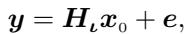

[← 返回 README](../README.md)

# I. Introduction and Problem Formulation 引言与问题建模

## 📌 预览

这一节把逆问题写成线性算子 + 加性高斯噪声的观测模型 $y=H_\iota x_0 + e$，明确"要估的三类未知量"：图像 $x_0$、仪器参数 $\iota$（PSF 宽度）、噪声参数 $\eta=[m_e,v_e]$。然后论证：**估观测参数在实践中至关重要**（我们通常只有名义值 + 不确定度，很少精确知道），而在扩散先验下这件事一直很难做——本文用 G-DPS 的条件独立结构打开了口子。

---

The present paper deals with the resolution of inverse problems [2]–[5] when the observation system is modeled by a linear operator and an additive Gaussian error:

*Equation (1): 观测模型 $y = H_\iota x_0 + e$。*

where $x_0 \in \mathbb{R}^P$ collects the unknowns, y, $e \in \mathbb{R}^M$ collect the measurements and errors, and $H_\iota \in \mathbb{R}^P \times \mathbb{R}^M$ characterizes the operator, e.g., a convolution. The vector ι parametrizes the instrument response, typically the width of a Lorentz Point Spread Function (PSF). This is one of the key parameters to be estimated. The second one, denoted $\eta$, controls the error pdf, e.g., mean $m_e$ and variance $v_e$ of an homogeneous white noise. All these parameters are gathered in the vector $\theta = [\iota, \eta]$. These parameters are included among the unknowns and this is a crucial feature of the proposed method to estimate them in addition to the image of interest.

> 💡 **公式批读**（Eq. 1）（Hao 批注）：这就是全课题共同的盲逆起点 $y=H_\iota x_0 + e$。关键在下标 $\iota$：**算子 $H_\iota$ 由低维参数 $\iota$ 参数化**（这里就是 Lorentz PSF 的宽度，一个标量）。这与 [BlindDPS](../%5BCVPR%202023%5D%20BlindDPS/)（给核建整张扩散先验）不同——本文假设算子形状已知、只有少数几个物理参数未知，属于 **myopic/parametric blind**（半盲），因此 $\iota$ 是低维、可用 MH 直接采样。三类未知量：$x_0\in\mathbb{R}^P$（图像，高维）、$\iota$（仪器，1 维）、$\eta=[m_e,v_e]$（噪声偏置 + 方差，2 维）。

The ability to estimate observation parameters, in addition to the image of interest, is crucial in practice. It is common to have information on instrument parameters or noise levels, e.g., a nominal value with an associated uncertainty, but it is rare to know them exactly. Moreover, failing to account for uncertainties in these parameters leads to erroneous uncertaintiy quantification about the image of interest.

> 💡 **机制拆解**（为什么必须联合估参数）（Hao 批注）：这段是本文对本课题最有价值的一句话——**若把 $\theta$ 当已知常数、不传播其不确定性，则图像的 UQ 会是错的（过自信）**。这正是本课题批 [PRISM](../%5BArxiv%202025%5D%20PRISM/) "低噪声过自信"的同一病根：固定算子/噪声 = 人为砍掉一部分后验方差。本文把 $\theta$ 拉进后验联合采样，是从根上修 UQ，而非事后校准。

This issue has been frequently addressed and several solutions have been proposed [6]–[13] referred to as auto-adjusted, adaptive, self-tuned, myopic/blind or self-calibrated. . . That said, in the case of priors constructed from the recent diffusion models [14]–[16], this issue remains difficult and has been very little addressed (however, see [17] and Remark 1). The difficulty may be due to the fact that the dominant approaches are inherited from ancestral sampling (designed for the prior): they attempt to correct the latter to produce posterior samples. But whilst they are exact for the prior they are approximated for the posterior. For example, to sample the posterior for the images, [18] and [19] rely on approximations that involve $H_\iota$ itself and this complicates or even makes it impossible to manage the parameter ι. In contrast, G-DPS (Gibbs Diffusion Posterior Sampling) recently proposed [1] clearly takes advantage of the Markov structure and conditional independences (see also Fig. 1), which opens up noticeable possibilities for the estimation of observation parameters and gives raise to the present contribution, referred to as Hyper-G-DPS (Hyperparameter-G-DPS).

> 💡 **核心论点批读**（"祖先采样纠偏"为何难估参数）（Hao 批注）：这段是全文动机的钥匙。**(1)** 主流 DPS/ΠGDM（[18][19]）本质是"为先验设计的祖先采样 + 事后纠偏"：它们对先验精确、对后验只是近似；**(2)** 这些近似把 $H_\iota$ 写进似然 score 的近似项里（DPS 用 $\nabla\log p(y|\hat x_0(x_t))$，其中 $\hat x_0$ 经过 $H_\iota$），于是 $\iota$ 一变、整个近似都要重算且梯度纠缠——**估 $\iota$ 变得复杂甚至不可能**。**(3)** G-DPS [1] 换成 block-Gibbs + 条件独立（Fig. 1），$\theta$ 的条件后验被从图像块里干净地"剥离"出来，加参数块几乎零成本。这就是 Hyper-G-DPS 命名的由来（Hyperparameter-G-DPS）。

> 💡 **Q&A 批注记录**（Hao 批注）：
> - Q：本文和 [17]（GibbsDDRM）到底差在哪，值得单独成文吗？
> - A：见 §III 的 Remark 1。两点：GibbsDDRM **只估仪器参数、不估噪声偏置/方差**；且它的 Gibbs **不在扩散隐变量 $x_{1:T}$ 之间交替**（把整条链当一个块近似处理）。本文两点都补上了，且噪声参数靠共轭做到"直采"。

The paper is organized as follows. Section II introduces the various distributions to model measurements and unknown quantities. Section III describes the posterior sampler. The numerical assessement using the MNIST example set is given in Section IV. Finally, Section V proposes a synthesis and includes a few perspectives. Part of the calculations are reported in the Appendix.

> 💡 **Section 小结**（Hao 批注）：
> - **关键设定**：$y=H_\iota x_0+e$，$e\sim\mathcal N(m_e, v_e I)$（平稳白噪声）；未知 $=\{x_0,\iota,m_e,v_e\}$。
> - **核心洞察**：本文的新意不在"更准的图像"，而在"**把观测参数拉进联合后验并给 UQ**"，靠的是 G-DPS 的条件独立结构而非新的 score 近似。
> - **可追问点**：它宣称 Gibbs 链收敛到"真后验"，但 §III.A 里有一步近似（把 forward/backward 联合先验当作**恒等**），这一步是否破坏"真后验"？这是本课题该盯的校准入口（见 03-gibbs-sampler.md）。
