[← 返回 README](../README.md)

# II. Likelihood, Prior, Posterior 似然、先验、后验

## 📌 预览

这一节把三块"零件"装配成联合后验：**(A)** 似然——由观测模型 (1) + 高斯误差得到 $f(y|x_0,\theta)=\mathcal N(y; m_e+H_\iota x_0, C_e)$；**(B)** 各未知量的先验——$\iota$ 用均匀先验、$m_e$ 用高斯先验、$\gamma_e=1/v_e$ 用 Gamma 先验（**刻意选共轭**）、图像 $x_0$ 用扩散先验（引入 $T$ 个隐变量 $x_{1:T}$ + forward/backward 两个马尔可夫联合分布）；**(C)** 合成完整后验 (10)。整节的设计哲学一句话：**能选共轭就选共轭，让条件后验好采样**。

---

The measurements are included via the likelihood deduced from the observation model (1) and a model for the error.

## A. Noise and measurement 噪声与测量

The measurements are included via the likelihood deduced from the observation model (1) and a model for the error. Here, the latter is described as Gauss with mean $m_e$ and covariance $C_e$ that is to say $\mathcal{N}(e; m_e, C_e)$. So, the likelihood of the unknowns $(x_0, \theta)$ attached to the measurement y reads

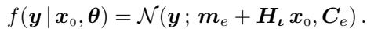

*Equation (2): 似然 $f(y|x_0,\theta)=\mathcal N(y; m_e+H_\iota x_0, C_e)$。*

> 💡 **公式批读**（Eq. 2）（Hao 批注）：似然把三个未知量都装进去了——均值里有 $m_e$（噪声偏置）和 $H_\iota x_0$（仪器 × 图像），协方差里有 $C_e$（噪声方差）。这是**线性-高斯**似然：对 $x_0$ 是线性、对 $m_e$ 是线性、对 $\gamma_e=1/v_e$ 是"精度"形式——正是这三个"线性/精度"结构，后面才能各自配到共轭先验，实现直采。唯一非线性的是 $H_\iota$ 对 $\iota$ 的依赖（PSF 宽度非线性地改变卷积核），所以 $\iota$ 只能用 MH。

Regarding the error, in subsequent developments, we focus on the stationary and white case: the mean and variance are homogeneous and denoted by $m_e$ and $v_e$ respectively and collected in the vector $\eta = [m_e, v_e]$. However, the proposed methodology can easily be generalised to cover more complex situations, and could incorporate correlation parameters, or non-Gaussian noise based on location mixture of Gaussians.

Regarding the vector ι, it collects the parameters of the instrument response. It may include the amplitude and width of the PSF, e.g., a Lorentzian as considered in the numerical study (Sect. IV). However, the proposed methodology can easily be generalised to more complex PSFs (see, e.g., [20], [21]).

> 💡 **机制拆解**（白噪声假设为何关键）（Hao 批注）：这里限定"平稳 + 白"噪声（$C_e=v_e I$，均值 $m_e$ 处处相同）。这不是偷懒，而是让协方差**对角**——后面 $\gamma_e$ 的条件后验才是标准 Gamma、$x_0$ 的条件后验才能在傅里叶域对角化直采。作者也留了出口：相关噪声/非高斯（高斯位置混合）可推广，但会破坏这份对角性红利。

The vector $\theta = [\iota, \eta]$ collects the unknown observation parameters (instrument and error), the other unknown being the image of interest $x_0$. The aim of the rest of this section is to incorporate the available knowledge about these unknowns through probability distributions.

• With regard to images, traditional approaches rely, for example, on pixel positivity, pixel correlation, contours or pulses. . . Here, we rely on the fact that the image shares a certain resemblance with available examples.

• Regarding the observation parameters, the available information may be an order of magnitude, a nominal value with uncertainty, a minimum / maximum values,. . .

When the available information is more uncertain, it is referred to as a poorly informative prior.

Among the distributions that allow this information to be taken into account, one seeks to assign a prior so that the posterior (and especially its conditionals) is easy to manipulate and sample. With this in mind, whenever possible, one relies on simple models, such as Gaussian models, and/or on the notion of conjugacy [22].

> 💡 **设计哲学批读**（共轭优先）（Hao 批注）：这句是全节的"选型准则"——**先验的选择服从于"条件后验好不好采样"**，而不是先验本身多有道理。这与纯扩散派（一切先验都用神经网络学）形成对比：本文对图像用学出来的扩散先验（表达力），对低维参数用手工共轭先验（可采样性）。这种"高维用学习先验 + 低维用共轭先验"的混搭，正是它能把 UQ 做扎实的工程关键。

## B. Prior for unknowns 各未知量的先验

**Observation parameter ι** — For the instrument parameter ι, for each component, we define a uniform prior between a minimum and a maximum values in line with the knowledge of the physical principles of the instrument. We simply write

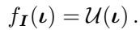

*Equation (3): 仪器参数先验 $f_I(\iota)=\mathcal U(\iota)$（均匀分布）。*

In the numerical study of Sect. IV we will consider a Lorentz PSF and ι encode the width.

> 💡 **公式批读**（Eq. 3）（Hao 批注）：$\iota$ 用**均匀先验**（在物理允许的 min/max 之间）。因为 PSF 宽度只有一个正的物理区间，均匀先验 = "只知道范围，不偏袒具体值"。代价：均匀先验不共轭，所以 $\iota$ 的条件后验 (§III.D) 不是标准分布，得靠 random-walk MH。

**Noise parameter: offset $m_e$** — Regarding the level of offset in measurements, we consider a situation where a nominal value $m_0$ and a precision $p_0$ are available and we define

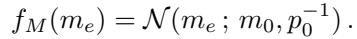

*Equation (4): 偏置先验 $f_M(m_e)=\mathcal N(m_e; m_0, p_0^{-1})$。*

In the numerical study of Sect. IV, we will consider the poorly informative case: $p_0$ is small (and $m_0 = 0$).

> 💡 **公式批读**（Eq. 4）（Hao 批注）：偏置 $m_e$ 用**高斯先验**（名义值 $m_0$、精度 $p_0$）。高斯先验对高斯似然共轭 → $m_e$ 条件后验仍是高斯，直采。实验取 $p_0$ 很小 = **弱信息先验**（几乎不注入偏见，考验方法自己能否从数据里把 $m_e$ 拽出来）。

**Noise parameter: scale $\gamma_e$** — Regarding $\gamma_e$ (for notational convenience $\gamma_e = 1/v_e$), a classical choice is a Gamma pdf:

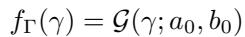

*Equation (5): 精度先验 $f_\Gamma(\gamma)=\mathcal G(\gamma; a_0, b_0)$（Gamma 分布）。*

This choice makes it easy to consider a nominal value with uncertainty based on the mean $a_0/b_0$ and the variance $a_0/b_0^2$.

> 💡 **公式批读**（Eq. 5）（Hao 批注）：注意作者对**精度** $\gamma_e=1/v_e$ 而非方差 $v_e$ 建模——因为 Gamma 对高斯精度是共轭先验（经典 Bayesian 套路）。名义值/不确定度可通过 Gamma 的均值 $a_0/b_0$ 与方差 $a_0/b_0^2$ 反解。这样 $\gamma_e$ 的条件后验 (§III.B) 还是 Gamma，直采。**三个低维参数里，$m_e$、$\gamma_e$ 共轭可直采，$\iota$ 需 MH**——这是本文采样效率的核心分工。

**Diffusion prior for the images** — This prior is described using a diffusion model [14]–[16]: essentially, available examples are transformed into noise, and conversely, new examples are generated by transforming noise realisations. To achieve this, the methodology consists in introducing (i) T latent variables $x_{1:T}$ (in addition to $x_0$) and an extended prior $\pi_{0:T}(x_{0:T})$ and (ii) two joint pdfs for $x_{0:T}$: a forward denoted $p_{0:T}^+$ and a backward denoted $p_{0:T}^-$. For practical efficiency, both are chosen in Markovian form:

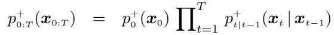

*Equation (6): 前向马尔可夫联合先验 $p_{0:T}^+$。*

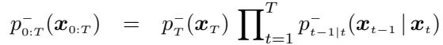

*Equation (7): 后向马尔可夫联合先验 $p_{0:T}^-$。*

which involves two terminal marginal pdfs $p_0^+$ and $p_T^-$ and two sets of transition pdfs $p_{t|t-1}^+$ and $p_{t-1|t}^-$. Regarding the terminals

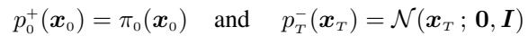

*终端边缘：$p_0^+(x_0)=\pi_0(x_0)$（样例集分布），$p_T^-(x_T)=\mathcal N(x_T;0,I)$（白噪声）。*

the first is the pdf $\pi_0$ of the example set and the second is the pdf of noise (Gaussian, white and reduced). With regard to transitions, again for practical efficiency, Gaussians are chosen with the following parameters.

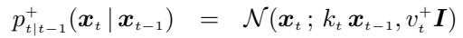

*Equation (8): 前向转移 $p_{t|t-1}^+(x_t|x_{t-1})=\mathcal N(x_t; k_t x_{t-1}, v_t^+ I)$。*

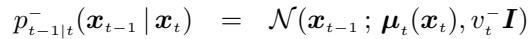

*Equation (9): 后向转移 $p_{t-1|t}^-(x_{t-1}|x_t)=\mathcal N(x_{t-1}; \mu_t(x_t), v_t^- I)$。*

The function $\mu_t(x)$ is described by a neural network $\mu_t^p(x)$ with parameter p and has two inputs: the image x and the time t. Replacing $\mu_t$ by $\mu_t^p$ in (9), and substituting in (7) yields $p_{0:T}^{-,p}$. The learning stage adjusts p to minimise the Kullback distance between the forward $p_{0:T}^+$ and the parametrized backward $p_{0:T}^{-,p}$ pdfs while ensuring that the marginal pdfs for $x_0$ and $x_T$ are

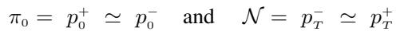

*边缘匹配：$\pi_0 = p_0^+ \simeq p_0^-$ 且 $\mathcal N = p_T^- \simeq p_T^+$。*

i.e., that of the example set and the noise. It suffices then to report the adjusted value of p in $p_{0:T}^{-,p}$ to obtain an adjusted joint backward pdf (7). Therefore, based on the latter, it is easy to sample the prior for $x_{0:T}$, starting from $t = T$ downto to $t = 0$ and it is referred to as ancestral sampling.

> 💡 **机制拆解**（扩散先验被写成"两条马尔可夫链"）（Hao 批注）：这是全文最需要吃透的一块。作者不用连续 SDE 语言，而用**离散马尔可夫链**表述扩散：
> - **前向** $p^+$（Eq. 6, 8）：从干净图 $x_0\sim\pi_0$ 逐步加噪 $x_t=k_t x_{t-1}+$ 噪声，直到 $x_T\sim\mathcal N(0,I)$。转移是高斯、系数 $k_t$、方差 $v_t^+$ 都是标量常数。
> - **后向** $p^-$（Eq. 7, 9）：从噪声 $x_T$ 逐步去噪，转移均值 $\mu_t(x_t)$ 由**神经网络** $\mu_t^p$ 给出（唯一的学习部件），方差 $v_t^-$ 也是标量。
> - **训练**：调 $p$ 让 forward 与 backward 两条联合分布的 KL 最小，且两端边缘对齐（$x_0$ 端 = 样例分布，$x_T$ 端 = 白噪声）。
>
> **为什么这么写？** 因为把扩散写成"一堆高斯转移的马尔可夫链"后，图像后验采样就变成"在链上做 block-Gibbs、每一步都只采高斯"——这正是 §III.A / Appendix 能全程只采高斯、且一次迭代只过一次网络的根源。

> 💡 **Q&A 批注记录**（Hao 批注）：
> - Q：$k_t$、$v_t^+$、$v_t^-$ 从哪来？
> - A：它们是扩散噪声调度（noise schedule）的确定性系数，不是待估参数——实验用 MATLAB 官方扩散示例 [26] 的架构与调度。真正学的只有去噪网络参数 $p$。
> - Q：forward 和 backward 是两个不同的联合分布，Gibbs 用哪个？
> - A：见 §III.A——**采隐变量 $x_{1:T}$ 用 forward 后验，采目标图 $x_0$ 用 backward 后验**，靠"训练后两者近似相等"把它们粘在一起（这一步是全文唯一的近似/收敛假设）。

## C. Full posterior 完整后验

We can then construct the joint pdf and the posterior. The latter is based on the likelihood (2) and the priors for the parameters (3), (4), (5), and the joint prior for the images $(6)-(7)$. Its construction relies on conditional independences encoded in the hierarchical model given in Fig. 1.

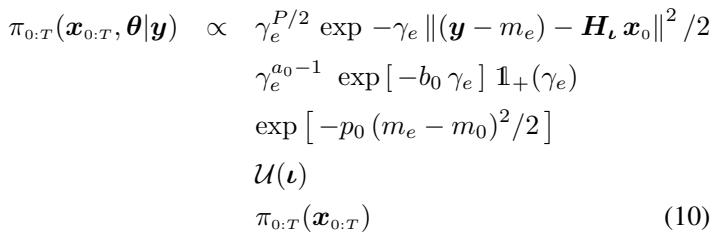

*Equation (10): 完整联合后验 $\pi_{0:T}(x_{0:T},\theta|y)$，正比于似然 × 各参数先验 × 图像联合先验。*

Due to the intricate nature of this pdf, it is not possible to compute the estimations and uncertainties directly. To this end, an MCMC sampler is used, as shown below.

> 💡 **公式批读**（Eq. 10 逐行拆）（Hao 批注）：这个后验是全文的"总账本"，五行分别对应五个零件：
> 1. 第一行 $\gamma_e^{P/2}\exp[-\gamma_e\|(y-m_e)-H_\iota x_0\|^2/2]$ = **似然**（数据一致项，同时含 $\gamma_e,m_e,\iota,x_0$）；
> 2. 第二行 $\gamma_e^{a_0-1}\exp[-b_0\gamma_e]\mathbb 1_+(\gamma_e)$ = **$\gamma_e$ 的 Gamma 先验**；
> 3. 第三行 $\exp[-p_0(m_e-m_0)^2/2]$ = **$m_e$ 的高斯先验**；
> 4. 第四行 $\mathcal U(\iota)$ = **$\iota$ 的均匀先验**；
> 5. 第五行 $\pi_{0:T}(x_{0:T})$ = **图像的扩散联合先验**。
>
> 关键观察：**每个未知量只出现在其中几行里**（条件独立，Fig. 1）。所以取某个未知量的条件后验时，只需保留含它的因子——这就是 §III 每个子问题都能化简成标准分布的机械原理。后验本身太复杂无法解析，故上 MCMC（Gibbs）。

> 💡 **Section 小结**（Hao 批注）：
> - **关键变量**：$x_0$（图像，扩散先验）、$x_{1:T}$（扩散隐变量，高斯转移）、$\iota$（均匀先验，非共轭）、$m_e$（高斯先验，共轭）、$\gamma_e=1/v_e$（Gamma 先验，共轭）。
> - **核心洞察**：整节的工程价值 = **"共轭 + 条件独立"的双重设计**。共轭保证低维参数条件后验是标准分布；条件独立（Fig. 1）保证取条件时因子干净剥离。两者合起来让 §III 的 Gibbs 每一块都好采。
> - **可追问点**：Eq. (10) 是"真"联合后验的定义，但采样时 §III.A 用 forward≈backward 的近似——**采出来的样本是否真服从 Eq. (10)？** 这是本课题最该验的 gap（作者只在实验里验了 ±2 PSD 覆盖，未做 SBC）。
