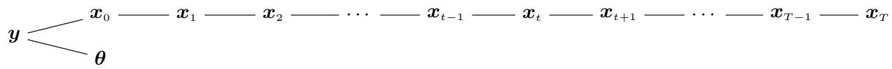
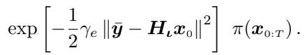
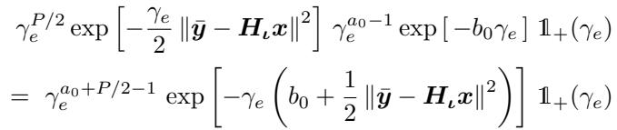
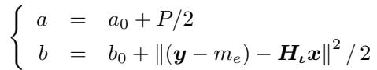
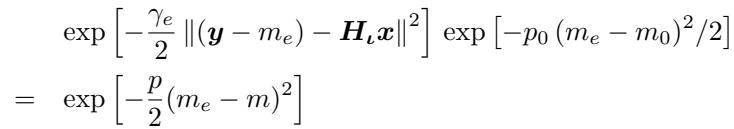
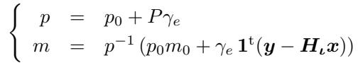
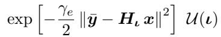

[← 返回 README](../README.md)

# III. Proposed Sampler: a Gibbs Scheme 提出的采样器：Gibbs 方案

## 📌 预览

这是全文的技术核心。思路：**用 Gibbs 大循环把"联合采样 $\{x_{0:T},\iota,m_e,\gamma_e\}$"这个难题，拆成一串各自好采的条件子问题**，轮流采。四个子块：**(A) 图像** $x_{0:T}$——套用 G-DPS [1]（本身又是 block-Gibbs，只采高斯、协方差对角、一次迭代过一次网络）；**(B) 噪声精度** $\gamma_e$——共轭 → Gamma 直采；**(C) 噪声偏置** $m_e$——共轭 → 高斯直采；**(D) 仪器参数** $\iota$——非共轭 → random-walk Metropolis-Hastings。Fig. 1 的层级图是让"加 $\theta$ 几乎免费"的结构基础。

---

To explore the posterior, we resort to a Gibbs loop that splits the global sampling problem in easier sub-problems. More precisely, the conditional posterior of each unknown is sequentially sampled under its conditional density, in an iterative way. The samples form a Markov chain whose distribution converges to the posterior [22], [23].

> 💡 **机制拆解**（Gibbs 为什么适合这里）（Hao 批注）：Gibbs 的前提是"每个未知量的**条件后验**都好采"。本文全部设计（§II 的共轭 + 条件独立）就是为满足这个前提服务的。轮流采 $x_{0:T}\to\gamma_e\to m_e\to\iota$，样本构成马尔可夫链，其平稳分布 = 目标联合后验 (10)——这是"收敛保证"的理论来源（标准 Gibbs 理论 [22][23]）。注意：这个"保证"是**条件后验都精确**时才成立；而 §III.A 的图像块里藏了一个 forward≈backward 的近似（见下）。

Remark 1 — The paper [17] is related to the work proposed here but there are two key differences. First, the estimation of an instrument parameter is considered in [17] but not the estimation of noise parameters (neither the offset nor the power), and second the Gibbs algorithm in [17] structures the alternation between the images and the instrument parameters but not between the latent variables themselves.

> 💡 **消融/定位解读**（Remark 1 = 对 GibbsDDRM 的差异化声明）（Hao 批注）：这里点名 [17] = [GibbsDDRM](../%5BICML%202023%5D%20GibbsDDRM/)，划两条线：
> 1. **GibbsDDRM 不估噪声参数**（偏置、功率都不估），只估仪器参数；本文把 $m_e,\gamma_e$ 也纳入且用共轭直采。
> 2. **GibbsDDRM 的 Gibbs 不在扩散隐变量 $x_{1:T}$ 之间交替**——它把整条扩散链当成一个"部分塌缩（partially collapsed）"的块用 DDRM 谱域近似整体处理；本文（继承 G-DPS）则**在 $x_0,x_1,\dots,x_T$ 之间逐个 block-Gibbs**。
>
> 意义：这两条差异决定了本文能"顺手"把 $\theta$ 剥离出来、且 UQ 更完整；但代价是要维护整条链的隐变量（内存/迭代更重）。这正是本课题比较两者的关键轴。

*Fig. 1. Hierarchy — $x_0$ is the image of interest, $x_{1:T}$ are the latent images and y is the measured image (blurred and noisy version of the true x). θ contains the parameters of the observation (response and error), and its estimation is the core of the article. This graph already shows that if we know how to sample the x properly including the conditional independences encoded by this hierarchy, the difficulty of sampling θ is greatly alleviated.*

> 💡 **Figure 1 批读**（层级图 = 全文的"接线图"）（Hao 批注）：
> - **链条结构**：$x_T\to\cdots\to x_1\to x_0$（扩散反向去噪链），末端 $x_0$ 经 $H_\iota$ + 加噪 → 观测 $y$。参数 $\theta=[\iota,m_e,\gamma_e]$ 只挂在 $x_0\to y$ 这条"观测边"上。
> - **关键读法（条件独立）**：给定 $x_0$ 后，$y$ 与所有隐变量 $x_{1:T}$ **条件独立**；给定 $x_0$ 后，$\theta$ 的条件后验**只依赖 $x_0$ 和 $y$**，与整条扩散链无关。所以采 $\theta$ 时，扩散网络完全不参与——这就是 caption 说的"只要会正确采 $x$，采 $\theta$ 的难度就被大大缓解"。
> - **对比 DPS**：DPS 把 $H_\iota$ 塞进对 $x_0$ 的似然 score 近似里，等于把"观测边"和"扩散链"耦在一起，$\iota$ 一动全乱；本图把两者解耦，$\theta$ 的估计退化成一个"给定 $x_0,y$ 的小型贝叶斯回归"。

For each unknown, the conditional pdf given the other unknowns is needed. Each one is proportional to the posterior (10) and hence only involves the factors including the considered unknown. Given the hierarchy in Fig. 1, several simplifications arise, which both facilitate the theoretical calculations and reduces the computational load. The conditional posteriors are now given. For notational simplicity $\bar{y} = y - m_e$.

## A. Image 图像块

This section describes the sampling of the extended image $x_{0:T}$. Up to a factor, the pdf writes

*图像块条件密度 $\propto \exp[-\frac12\gamma_e\|\bar y - H_\iota x_0\|^2]\,\pi(x_{0:T})$。*

We resort to G-DPS presented in [1]. It is itself a block-Gibbs sampler: it samples each xt in turn under its conditional pdf $\pi_{t|\star}(x_t | y, \theta, x_{\star \setminus t})$ where (t | ⋆) is the time t given all the other times (from 0 to T) except t and $(\star \backslash t)$ denotes the set of all times (from 0 to T) except t. The original idea of [1] is to play with both forward and backward pdfs. More specifically, the sampling is based on the posterior attached to the

• forward $\pi_{0:T}^+(x_{0:T} | y, \theta)$ for the latent variables $x_{1:T}$, and

• backward $\pi_{0:T}^-(x_{0:T} | y, \theta)$ for the image of interest $x_0$

This idea is justified by the fact that the two joint priors $\pi_{0:T}^+(x_{0:T})$ and $\pi_{0:T}^-(x_{0:T})$ are similar thanks to the learning stage. So, we consider here that they are identical, then the convergence is considered as guaranteed. Overall, the entire algorithm is both simple and efficient for three reasons.

1) It requires the sampling of Gaussians only (see also [24])

2) All the covariances are diagonal be it in the Fourier domain (t = 0) or in the spatial one $(t \neq 0)$

3) In addition, means and variances are easy to compute, by FFT (t = 0) or linear combination $(t \neq 0)$

The main technical details are reported in Appendix and the full details are [1].

> 💡 **机制拆解**（G-DPS 图像块的巧思：forward 采隐变量 / backward 采目标图）（Hao 批注）：这是全文最精妙、也最该警惕的一步。
> - **两条链混用**：采隐变量 $x_{1:T}$ 用 **forward 后验** $\pi^+$（因为 forward 转移 Eq. 8 简单、系数已知）；采目标图 $x_0$ 用 **backward 后验** $\pi^-$（因为 backward 才含去噪网络 $\mu_t$，能把先验知识注入 $x_0$）。
> - **粘合靠一个近似**：forward 联合 $\pi^+$ 和 backward 联合 $\pi^-$ 只是**训练后近似相等**，作者直接"**当作恒等**（consider them identical）"，于是"收敛视为有保证"。
> - **三条效率红利**：(1) 全程只采高斯；(2) 协方差全对角（$t=0$ 在傅里叶域、$t\neq0$ 在空间域）；(3) 均值/方差靠 FFT（$t=0$）或线性组合（$t\neq0$）秒算。
>
> **批判点**：第 2 步的"当作恒等"是本文"真后验"叙事里唯一的裂缝。forward≠backward 的残差有多大、会不会让采出的样本系统性偏离 Eq. (10)？作者没量化，只在实验里看 ±2 PSD 覆盖。本课题里 [Feynman-Kac-Bias-Stability]、[Principled-Posterior-Matching] 恰恰论证"即便 prior score 精确，DPS 类方法仍可能系统偏差"——这里的 forward≈backward 假设值得用 SBC/参考后验去测。

## B. Noise parameter scale $\gamma_e$ 噪声精度

Up to a factor, the conditional posterior for $\gamma_e$ reads

*$\gamma_e$ 条件后验：合并似然的 $\gamma_e^{P/2}\exp[\cdot]$ 与 Gamma 先验，仍是 Gamma。*

and the advantage of a conjugacy becomes apparent at this point: the conditional posterior for $\gamma_e$ is in the same family as the prior, namely a Gamma pdf. The parameters are:

*后验 Gamma 参数：$a = a_0 + P/2$，$b = b_0 + \|(y-m_e)-H_\iota x\|^2/2$。*

the sampling is then direct and efficient.

> 💡 **公式批读**（$\gamma_e$ 共轭直采）（Hao 批注）：这是共轭红利的第一次兑现。似然对 $\gamma_e$ 呈 $\gamma_e^{P/2}\exp[-\gamma_e\cdot\text{残差}/2]$，与 Gamma 先验 $\gamma_e^{a_0-1}\exp[-b_0\gamma_e]$ **同族**，相乘仍是 Gamma。更新极直观：形状 $a=a_0+P/2$（数据加了 $P$ 个像素的"半个自由度"），率 $b=b_0+\text{残差平方}/2$（残差越大 → $b$ 越大 → 采到的 $\gamma_e$ 越小 → 估的噪声方差 $v_e=1/\gamma_e$ 越大）。**直采、无需调参、无 MH 拒绝**。

## C. Noise parameter offset $m_e$ 噪声偏置

The conditional posterior for $m_e$ clearly appears as:

*$m_e$ 条件后验：似然的高斯 × 先验的高斯 = 高斯。*

up to a factor, that is a Gauss pdf with precision and mean

*后验高斯参数：精度 $p = p_0 + P\gamma_e$，均值 $m = p^{-1}(p_0 m_0 + \gamma_e \mathbf 1^t(y - H_\iota x))$。*

and the sampling is also direct and efficient. At this point also, the advantage of a conjugacy is apparent (the prior and the conditional posterior are in the same family).

> 💡 **公式批读**（$m_e$ 共轭直采）（Hao 批注）：第二次共轭红利。后验精度 $p=p_0+P\gamma_e$ = 先验精度 + 数据精度（$P$ 个像素 × 噪声精度 $\gamma_e$）；后验均值 $m$ 是"先验名义值 $m_0$"与"残差 $y-H_\iota x$ 的空间平均 $\mathbf 1^t(\cdot)$"按精度加权。因为实验里 $p_0$ 极小（弱信息），$m$ 基本就等于**残差图像的均值**——非常符合直觉：偏置 = 观测减去（模糊后的重建图）之后剩下的常数漂移。直采、无调参。

## D. Instrument parameter 仪器参数

The conditional posterior for the instrument parameter ι is also proportional to the joint posterior (10):

*$\iota$ 条件后验 $\propto \exp[-\frac{\gamma_e}{2}\|\bar y - H_\iota x\|^2]\,\mathcal U(\iota)$。*

This pdf is not an usual one and cannot be directly sampled. Among existing sampling algorithms [22], [23], [25], we resort to a Metropolis-Hasting step. Within this family of algorithms, several options are available (independent, random-walk,. . . ). Here it is efficient to make use of random-walk Metropolis-Hasting with a Gauss excursion.

> 💡 **公式批读**（$\iota$ 为何只能 MH）（Hao 批注）：这是**唯一不共轭**的块。$H_\iota$ 对 $\iota$（PSF 宽度）是非线性依赖——改宽度 = 换一整个卷积核，残差 $\|\bar y - H_\iota x\|^2$ 对 $\iota$ 是复杂非高斯函数，均匀先验也帮不上共轭。故退回 **random-walk Metropolis-Hastings（高斯游走提议）**：在当前 $\iota$ 附近高斯扰动出候选，按后验比接受/拒绝。代价：需评估 $H_\iota x$（一次卷积，比过网络便宜），并有 MH 拒绝率/步长的隐性调参（作者称"高斯游走高效"，但未报接受率）。
> - **数据流全景**（一次 Gibbs 迭代）：采 $\gamma_e$（Gamma 直采）→ 采 $m_e$（高斯直采）→ 采 $\iota$（MH，需算 $H_\iota x$）→ 采整条图像链 $x_{0:T}$（G-DPS，过一次网络）。**四块里三块直采、一块 MH、只过一次网络**——这就是它 62 秒跑完的原因。

> 💡 **Section 小结**（Hao 批注）：
> - **核心分工**：$x_{0:T}$→G-DPS（高斯 block-Gibbs，一次过网络）；$\gamma_e$→Gamma 直采；$m_e$→高斯直采；$\iota$→random-walk MH。
> - **关键洞察**：本文的"简单高效"不是靠新 score 近似，而是靠**把每个未知量放进它天然共轭/低维的角落**，再用条件独立（Fig. 1）保证角落之间互不干扰。**"加参数 = 加一个 Gibbs 块"**，这是相对 DPS 的结构优势。
> - **可追问点**：(1) §III.A 的 forward≈backward 近似是收敛"保证"的唯一裂缝，未量化。(2) $\iota$ 的 MH 步长/接受率未报，是否影响混合速度？(3) 只演示 1 维 $\iota$（单宽度），多参数 PSF（振幅+宽度+…）下 MH 是否还高效未验。
