[← 返回 README](../README.md)

# IV. Numerical Assessment 数值验证

## 📌 预览

在 **MNIST 32×32** toy 上验证 Hyper-G-DPS：真图是"学出来的扩散先验的一个样本"，用 Lorentz PSF（宽度 $\iota^\star$）模糊 + 加白噪声（偏置 $m_e$、方差 $v_e$）得到观测 $y$。看三件事：**(A) 三个参数 $\iota,m_e,v_e$ 的链收敛 + 后验直方图 + ±2 PSD 覆盖（Fig. 2/3, Tab. I）；图像恢复 + 逐像素 UQ（Fig. 4/5）；(B) 效率**——952 次迭代、62 秒、80% 时间在过网络、一次迭代只过一次网络、除停机阈值外无调参。

---

In order to demonstrate the feasibility and interest of the proposed Hyper-G-DPS, this Section proposes an experimental study. It relies on a toy problem based on the MNIST example set. The method has been implemented1 and the information regarding the architecture and learning stage are given in [26]. The ground-truth $x^\star$ is a sample of the learned prior (size 32× 32, gray level roughly in [0, 1]). The PSF is a Lorentz shape with width parameter $\iota^\star = 0.9$ and regarding the noise $\sigma_e^\star = 0.05$ and $m_e = 0.1$. The ground-truth $x^\star$ and the measurement (blurred and noisy image) y are shown in Fig. 4 (left and middle). Here are some implementation details.

> 💡 **实验设置批读**（toy 的选择意味着什么）（Hao 批注）：
> - **真图 = 先验的一个样本**：$x^\star\sim\pi_0$（学出来的扩散先验），这是"内分布"最理想设定——排除了先验-真图不匹配的干扰，**专测"参数估计 + UQ"这一件事**，而非泛化。好处是干净，代价是没回答"真图偏离先验时会怎样"。
> - **算子**：Lorentz PSF 去卷积，$\iota^\star=0.9$（宽度）；噪声 $\sigma_e^\star=0.05$（→ $v_e\approx2.5\times10^{-3}$）、$m_e=0.1$。
> - **注意数字不一致**：正文这里写 $\iota^\star=0.9,\,m_e=0.1$，但 Tab. I 的"True"却是 $\iota=0.80,\,m_e=-0.050,\,v_e=2.5\times10^{-3}$。$v_e$ 对得上（$0.05^2$），但 $\iota$ 和 $m_e$ 对不上——见下方 Q&A。

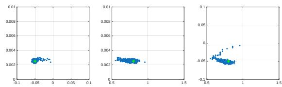

*Fig. 3. Point clouds for two dimensional marginals pdfs for the three unknown parameters: $\iota, m_e$ and $v_e$. From left to right: $(m_e, v_e), (\iota, v_e)$, and $(\iota, m_e)$. The samples are given in blue and the true values is given in green. See also Fig. 2 for one dimensional plots and Tab. I for quantitative assessment.*

> 💡 **Figure 3 批读**（二维联合边缘 = 检查参数间相关性）（Hao 批注）：三张点云分别是 $(m_e,v_e)$、$(\iota,v_e)$、$(\iota,m_e)$ 的二维后验样本（蓝点），绿点是真值。读法：
> - **绿点都落在蓝色点云内部** → 联合后验把真值包住了，UQ 合理（不只是一维覆盖，二维也覆盖）。
> - **点云形状**：$(m_e,v_e)$、$(\iota,v_e)$ 近似圆/轻椭圆 → 参数间**弱相关**，说明 Gibbs 各块之间没有强耦合，混合应当较快；$(\iota,m_e)$ 略有斜向拉伸 → $\iota$ 与 $m_e$ 有轻度相关（宽度和偏置在解释"残差常数项"上有一点竞争）。
> - **为什么重要**：本课题关心"是不是真联合后验"。强相关而 Gibbs 采不动会导致过窄的边缘 → 假 UQ。这里弱相关是好消息，但也因为是 toy。（注：此图在 MinerU 原文里被错放到了 §IV 开头，实际归属本节结果部分。）

• Regarding the scan order, the algorithm repeats this pattern: update observation parameters $v_e$ and $m_e$, then $\iota$, followed by the images for $t = 0$ up to $t = T$

• The image $x_0$ is initialized to y. The $x_{1:T}$ are set to successive noisy versions through the forward model. The width ι and the error mean $m_e$ are initialized at random under their prior. Given the scan order and the Gibbs structure, there is no need to initialize $v_e$

• As the iterations proceed, the empirical average of the images is updated. The algorithm stops when the difference between successive updates is smaller than a threshold.

> 💡 **机制拆解**（扫描顺序 + 初始化的门道）（Hao 批注）：
> - **扫描序**：每轮先采 $v_e$、$m_e$，再采 $\iota$，最后采整条图像链 $x_0\to x_T$。为什么 $v_e$ 放最前？因为它是 Gamma 直采、依赖当前残差；先更新噪声尺度再更新其它，能让后续块用上最新的噪声估计。
> - **初始化**：$x_0$ 初始化成观测 $y$（合理起点）；$x_{1:T}$ 用 forward 模型对 $y$ 逐步加噪；$\iota,m_e$ 从各自先验随机抽。$v_e$ **无需初始化**——因为扫描序里它第一个被采，采它时只用到残差和先验，不需要旧值。这是 Gibbs 结构的小便利。
> - **停机**：图像经验均值（≈后验均值 MMSE）相邻更新差 < 阈值即停。**这是唯一的"调参"**（阈值 $10^{-2}$）。

Remark — The algorithm has been run numerous times under identical and different scenarios, including variations in ground truth, noise level, PSF and initialisations. It has consistently exhibited both qualitative and quantitative behaviour.

> 💡 **稳健性声明批读**（Hao 批注）：作者称在不同真图/噪声/PSF/初始化下反复跑都稳定。**但只给了一个场景的定量表（Tab. I）**，没有多场景的统计汇总（如覆盖率随噪声变化的曲线）。对本课题而言，这正是"看似合理的样本 vs 真校准"的分水岭——一句"consistently"不等于 SBC/coverage 的系统证据。可追问：把噪声从低扫到高，±2 PSD 覆盖率是否始终≈95%？

## A. Results 结果

Fig. 2 shows a typical result regarding the three unknown parameters. The chains exhibit standard behaviour: the distributions quickly stabilise and appear stationary after about only 300 iterations (burn-in period). From a qualitative view, Fig. 2 shows that the estimated values are nearby the true values. The quantitative results are reported in Tab. I.

<table>
<tr>
<td width="50%">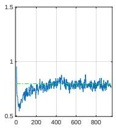</td>
<td width="50%"><i>ι：链的直方图（约 300 次迭代后平稳，绿线为真值）</i></td>
</tr>
<tr>
<td width="50%">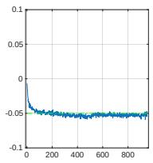</td>
<td width="50%">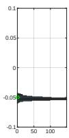</td>
</tr>
<tr>
<td width="50%">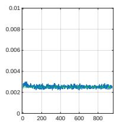</td>
<td width="50%">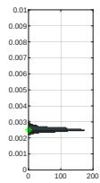</td>
</tr>
</table>

*Fig. 2. Samples provided by the Gibbs algorithm as a function of iteration index (left) and as histograms (right) for the three unknown parameters from top to bottom: $\iota, m_e$ and $v_e$. They are samples of one dimensional marginal pdfs. The green lines / dots give the true value. 上到下依次为 $\iota$、$m_e$、$v_e$；左列为随迭代的链轨迹，右列为后验直方图，绿线/绿点为真值。*

> 💡 **Figure 2 批读**（链诊断 = 收敛与混合的一手证据）（Hao 批注）：
> - **$\iota$（第一行）**：链在 $y\in[0.5,1.5]$ 内快速爬升到真值附近（绿线）后平稳抖动——典型良好混合。
> - **$m_e$（第二行）**：链从随机初值迅速掉到 $\approx-0.05$ 平稳；右侧直方图集中、单峰、绿点在峰内。
> - **$v_e$（第三行）**：链稳定在 $\approx2.5\times10^{-3}$；直方图单峰、绿点在峰内。
> - **共性**：**约 300 次迭代 burn-in** 后三条链都平稳、无明显趋势/黏滞——支持"混合快、条件独立弱耦合"的说法。这是本文对"是否真在采后验"给出的最直接（虽非最严格）证据。相比 [PRISM](../%5BArxiv%202025%5D%20PRISM/) 只给像素 SD，这里给了链轨迹，可诊断性更好。

The proposed strategy provides optimal estimations (e.g. Posterior Mean as the MMSE) and additionally coherent tools for uncertainty quantification based on posterior standard deviations. For each parameter, it is clear from Tab. I that the true value lies within the interval centered on the estimate and of width two standard deviations.

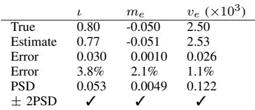

*TABLE I. Results for the three unknown parameters $\iota, m_e$ and $v_e$: true and estimated values (first and second row) then the error (third row). The Posterior Standard Deviation (PSD) is then given and the ✓ indicates that the true value does lie within the interval centered on the estimate and of width two PSD.*

> 💡 **Table I 批读**（定量证据链）（Hao 批注）：
> | 参数 | 真值 | 估计 | 绝对误差 | 相对误差 | PSD | ±2PSD 覆盖 |
> |------|------|------|----------|----------|-----|------------|
> | $\iota$ | 0.80 | 0.77 | 0.030 | 3.8% | 0.053 | ✓ |
> | $m_e$ | −0.050 | −0.051 | 0.0010 | 2.1% | 0.0049 | ✓ |
> | $v_e\,(\times10^3)$ | 2.50 | 2.53 | 0.026 | 1.1% | 0.122 | ✓ |
>
> - **两条 claim**：(1) **点估准**——三个参数相对误差 1–4%；(2) **UQ 自洽**——真值都落在 [估计 ±2PSD] 内（✓）。这正是本文相对"只出点估计"的 [Fast-Diffusion-EM](../%5BWACV%202024%5D%20Fast-Diffusion-EM/) 的卖点：**误差 < 2×PSD**，即声称的不确定度确实"盖得住"真误差。
> - **一致性核对**：$\iota$ 误差 0.030 < 2×0.053=0.106 ✓；$m_e$ 误差 0.0010 < 2×0.0049 ✓；$v_e$ 误差 0.026 < 2×0.122 ✓。三者都成立。
> - **批判**：这只是 **N=1 个场景、3 个标量**的覆盖，是"个案覆盖"而非"频率学覆盖率"。真正的校准要在多次重复实验上统计覆盖率≈95%（即 SBC/coverage）。本表是必要非充分证据。

Finally, Fig. 4-right yield the estimated image. The blur and the noise are significantly reduced in the resulting image (Fig. 4-right) with respect to the measurement (Fig. 4-middle) and it closely matches the original image (Fig. 4-left). This result is confirmed by the cross-sections also shown in Fig. 4. From Fig. 5 it is clear that, for each pixel, the true value also lies within the interval centered on the estimate and of width two standard deviations.

<table>
<tr>
<td width="33%">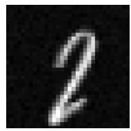</td>
<td width="33%">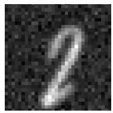</td>
<td width="33%"></td>
</tr>
<tr>
<td width="33%">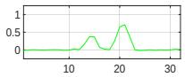</td>
<td width="33%">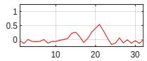</td>
<td width="33%">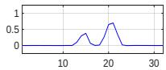</td>
</tr>
<tr>
<td align="center"><i>真图 x★</i></td>
<td align="center"><i>观测 y（模糊+噪声）</i></td>
<td align="center"><i>估计图 x̂</i></td>
</tr>
</table>

*Fig. 4. Left to right: true image $x^\star$, measurements y and estimated image x. The figure shows the images themselves (top) and cross-sections (bottom). 上行为图像本身，下行为对应的一维剖面（截线）。*

> 💡 **Figure 4 批读**（图像恢复的定性证据）（Hao 批注）：
> - **上行**：真图是清晰的手写"2"；观测 $y$ 被 Lorentz PSF 模糊 + 白噪声污染（能看到颗粒噪声和边缘晕开）；估计图 $\hat x$ 显著去模糊去噪，笔画锐利，接近真图。
> - **下行剖面**：绿（真）、红（观测，抖动大且有偏置抬升）、蓝（估计，平滑且贴合绿线）三条截线对比——蓝线把红线的噪声抖动和模糊展宽都拉回到绿线附近。
> - **意义**：这说明在**同时估参数**的情况下图像恢复没有崩（联合估计没有把误差灌到图像里），而是三方（图像 + 仪器 + 噪声）都收敛到自洽解。这是"联合后验能同时给好图 + 好参数"的定性支撑。

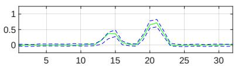

*Fig. 5. Cross-sections of $x^\star$ (plain green) and the "uncertainty" intervals (dashed blue) centered on the estimate and of width three standard deviations. 绿实线为真图剖面，蓝虚线为以估计为中心、宽度 3 倍标准差的不确定度带。*

> 💡 **Figure 5 批读**（逐像素 UQ = 本文最有分量的校准证据）（Hao 批注）：绿实线（真图剖面）几乎处处落在蓝虚线（估计 ±3 std 带）之内。读法：
> - **不确定带宽随信号变化**：在笔画/边缘（信号强、高频）处带更宽，在背景平坦处带更窄——说明后验方差**空间自适应**，在难恢复的高频区诚实地给出更大不确定度。这比"全图一个 SD"信息量大得多。
> - **对本课题的价值**：这是"像素级覆盖"证据，方向上正是 [PRISM](../%5BArxiv%202025%5D%20PRISM/) 想做但被诟病"低噪声过自信"的东西。本文因为**把噪声/仪器参数的不确定度也传播进了图像后验**，带宽看起来更诚实（没有人为收窄）。
> - **仍缺**：只画了一条剖面、一个场景；没给全图覆盖率数字（如 95% 名义带的实际覆盖比例）。

## B. Efficiency, computation time and some comments 效率、计算时间与评论

The algorithm produces N samples of the images and the parameters, $x_{0:T}^{(n)}$ and $\theta^{(n)}$ for $n = 1, \dots N$ under the joint posterior pdf for $x_{0:T}$ and θ. Note that each iteration n involves updating the three parameters $\theta = [\iota, m_e, v_e]$ and all the images xt (for $t = 0, \ldots, T)$

As mentioned earlier, as the iterations progress, the empirical average of the images $x_0^{(n)}$ (which approximates the posterior mean) is updated. The iterations stop when the difference between successive updates becomes smaller than a threshold, here set to $10^{-2}$. The algorithm thus iterated $N = 952$ times taking 62 seconds. Most of the computations time (about 80%) is due to the passage through the network.

> 💡 **效率批读**（62 秒/952 次迭代的账）（Hao 批注）：$N=952$ 次 Gibbs 迭代、共 62 秒 → **≈65 ms/迭代**。其中 **80% 时间花在过去噪网络**（$\approx50$ ms/次网络前向），剩下 20% 是三个参数块（Gamma/高斯直采 + $\iota$ 的 MH 卷积）+ FFT。这印证了 §III 的分工：低维参数几乎免费，瓶颈在网络。停机阈值 $10^{-2}$ 决定何时停。

A particular feature of the Hyper-G-DPS sampling scheme, inherited from G-DPS, is that, ultimately, each iteration n (updating all the $x_t$, for $t = 0, 1, \dots T$) requires only a single pass through the neural network (to update $x_0^{(n)}$). Therefore, scaling up to larger images does not appear to be an obstacle.

> 💡 **机制拆解**（"一次迭代只过一次网络"为何是关键卖点）（Hao 批注）：这是相对多步 DPS 的最大效率优势。标准 DPS 每生成一个后验样本要跑完整条反向链（$T$ 次网络前向）；本文一次 Gibbs 迭代**只需 1 次网络前向**（用于更新 $x_0$），其余 $x_{1:T}$ 靠高斯线性组合（Eq. 8/9 的转移，无网络）。因此计算量对图像尺寸线性、对 $T$ 不敏感 → 作者说"放大到更大图像不是障碍"。**但注意**：一次迭代 1 次前向 × 952 次迭代 = 952 次前向，和一条 $T$ 步 DPS 链 × 采多少样本相比谁更省，取决于要多少后验样本——本文用 952 个样本估后验均值/方差，这是 MCMC 的固有开销。

Another major practical advantage of Hyper-G-DSP, also inherited from G-DPS, is that it does not require the adjustment or tuning of any algorithm parameters (apart from the threshold that puts an end to the iterations), unlike many other algorithms, e.g., [18], [19].

> 💡 **无调参优势批读**（Hao 批注）：DPS/ΠGDM（[18][19]）需要调 step size / guidance 权重 / 噪声调度耦合等一堆超参，且对这些超参敏感。本文**除停机阈值外无算法超参**——因为条件后验都是解析导出的标准分布，采样无自由度。这对"可复现、可部署"很友好。**唯一隐性例外**：$\iota$ 的 random-walk MH 提议方差（步长）其实是个超参，作者未提如何设/是否敏感（见 03 节 Q&A）。

> 💡 **Section 小结**（Hao 批注）：
> - **关键数字**：MNIST 32×32；$\iota,m_e,v_e$ 相对误差 3.8% / 2.1% / 1.1%；burn-in ≈300；$N=952$ 迭代 / 62 秒 / ≈65 ms 每迭代 / 80% 时间在网络；停机阈值 $10^{-2}$；参数与像素 ±2(或 3) PSD 均覆盖真值。
> - **核心洞察**：**联合估计不牺牲图像质量**，且给出空间自适应的像素级 UQ；效率靠"一次迭代一次网络 + 低维参数直采"。
> - **可追问点**：(1) 正文 $\iota^\star=0.9/m_e=0.1$ 与 Tab. I 真值 0.80/−0.050 不符（见 Q&A）；(2) 只有单场景定量，缺多次重复的覆盖率统计（真校准证据）；(3) toy 且真图来自先验本身（内分布），未测先验-真图失配。

> 💡 **Q&A 批注记录**（Hao 批注）：
> - Q：正文说 $\iota^\star=0.9,\,m_e=0.1$，为何 Tab. I 的 True 是 $\iota=0.80,\,m_e=-0.050$？
> - A：应是**两处来自不同运行/设定或笔误**。$v_e$ 能对上（$\sigma_e=0.05\Rightarrow v_e=2.5\times10^{-3}$，与表一致），但 $\iota$ 与 $m_e$ 对不上；Fig. 2 里 $m_e$ 链收敛到 $\approx-0.05$、$\iota$ 收敛到 $\approx0.8$，与 **Tab. I 一致**、与正文引言段的 0.9/0.1 不一致。故以 Tab. I / Fig. 2 为准，正文那句的数字疑为遗留笔误。
> - Q：为什么 burn-in 只要 ~300 次这么快？
> - A：因为参数间弱相关（Fig. 3 点云近似各向同性）+ 每块都是精确条件采样（三块共轭直采、图像块高斯），Gibbs 混合没有强耦合拖累。这也是"toy + 内分布"下的乐观结果。
