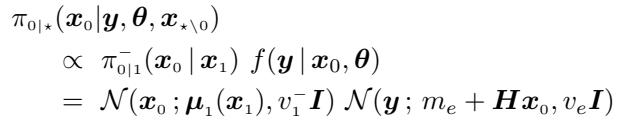
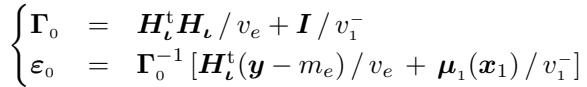
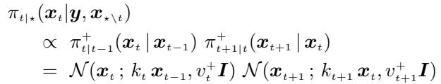
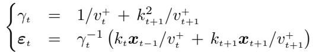
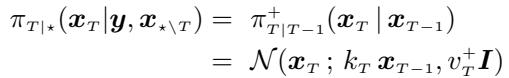
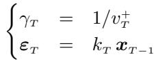

[← 返回 README](../README.md)

# Appendix 附录：图像块的 Gibbs 采样细节

## 📌 预览

这段补 §III.A 的技术细节：**如何逐个采扩散链上的 $x_t$**。分三种情形——**(1) 目标图 $x_0$**：由 backward 转移 × 似然 → 线性高斯问题（Wiener/Tikhonov 解），傅里叶域直采；**(2) 中间隐变量 $x_t\,(t\neq T)$**：由前后两个 forward 转移相乘 → 高斯，线性组合直采；**(3) 末端 $x_T$**：仅由最后一步 forward 转移 → 高斯。全部只采高斯、协方差对角。完整细节见作者的 G-DPS 原文 [1]。

---

This appendix provides computational details regarding the Gibbs algorithm used to sample the extended image $x_{0:T}$. Our previous paper [1] introduced this algorithm and gives more details. It samples each $x_t$ in turn under its conditional pdf $\pi_{t|\star}(x_t | y, \theta, x_{\star \setminus t})$ where $(t | \star)$ is the time t given all the other times (from 0 to T) except t and $(\star \backslash t)$ denotes the set of all times (from 0 to T) except t. The structure of these conditional pdfs relies on the hierarchy shown in Fig. 1.

> 💡 **附录导读**（为什么图像块也是 Gibbs）（Hao 批注）：§III.A 说"图像块用 G-DPS"，这里揭开 G-DPS 内部——它本身就是一个**在时间维 $t$ 上的 block-Gibbs**：把整条链 $x_{0:T}$ 拆成 $T{+}1$ 个块，每个 $x_t$ 在"其余所有时间固定"的条件下采。之所以每个条件都是高斯，全靠 Fig. 1 的马尔可夫结构（$x_t$ 只和邻居 $x_{t-1},x_{t+1}$ 及（对 $x_0$）观测 $y$ 相关）。

**1 - Image of interest** — Regarding $x_0$, it is sampled under

*$x_0$ 条件后验 $\propto \pi_{0|1}^-(x_0|x_1)\,f(y|x_0,\theta) = \mathcal N(x_0;\mu_1(x_1),v_1^- I)\,\mathcal N(y;m_e+H x_0, v_e I)$。*

which reveals a linear-Gauss problem and the Wiener / Tikhonov solution. So, the conditional posterior is Gauss with precision and expectation.

*精度 $\Gamma_0 = H_\iota^t H_\iota / v_e + I/v_1^-$；期望 $\varepsilon_0 = \Gamma_0^{-1}[H_\iota^t(y-m_e)/v_e + \mu_1(x_1)/v_1^-]$。*

Sampling is particularly effective in the Fourier plane: the components are independent and Gaussian, and their mean and variance are easily obtained by simple FFT [9].

> 💡 **公式批读**（$x_0$ = Wiener/Tikhonov + 先验去噪的融合）（Hao 批注）：这是全附录最有洞见的一块。$x_0$ 的条件后验是**两个高斯相乘**：
> - **似然项** $\mathcal N(y; m_e+Hx_0, v_e I)$——数据一致（把观测拉回来）；
> - **先验项** $\mathcal N(x_0; \mu_1(x_1), v_1^- I)$——这里 $\mu_1(x_1)$ 是**去噪网络对 $x_1$ 的一步去噪预测**，等于"扩散先验此刻认为 $x_0$ 该长什么样"。
>
> 两者相乘 = 经典的 **Wiener/Tikhonov 正则化解**，只不过正则化目标不是"平滑"而是"贴近网络的去噪预测 $\mu_1(x_1)$"。精度 $\Gamma_0 = H^tH/v_e + I/v_1^-$（数据精度 + 先验精度），期望 $\varepsilon_0$ 是两者按精度加权。**关键效率点**：卷积 $H$ 在傅里叶域对角化 → $\Gamma_0$ 对角 → 逐频率独立采高斯，一次 FFT 搞定（$H^tH$ 求逆变成逐元素除法）。这就是"$t=0$ 在傅里叶域直采"的由来，也是唯一需要网络前向（算 $\mu_1$）的一步。

**2.1 - Latent images $(t \neq T)$** — The $x_t$ are sampled under

*$x_t$ 条件后验 $\propto \pi_{t|t-1}^+(x_t|x_{t-1})\,\pi_{t+1|t}^+(x_{t+1}|x_t)$，两个前向转移相乘。*

also yields a Gauss pdf with precision $\gamma_t I$ and expectation $\varepsilon_t$

*精度 $\gamma_t = 1/v_t^+ + k_{t+1}^2/v_{t+1}^+$；期望 $\varepsilon_t = \gamma_t^{-1}(k_t x_{t-1}/v_t^+ + k_{t+1}x_{t+1}/v_{t+1}^+)$。*

> 💡 **公式批读**（中间隐变量 = 邻居的线性平均）（Hao 批注）：$x_t\,(t\neq0,T)$ 只和邻居 $x_{t-1},x_{t+1}$ 相关（马尔可夫），条件后验是**两个前向转移高斯相乘**。注意：**这里用的是 forward $\pi^+$**（对应 §III.A "隐变量用 forward"），转移系数 $k_t,v_t^+$ 全是已知常数，**不含网络**。结果精度 $\gamma_t$、期望 $\varepsilon_t$ 都是 $x_{t-1},x_{t+1}$ 的**闭式线性组合**——协方差各向同性（$\gamma_t I$），逐像素独立采高斯，无需 FFT、无需网络。这就是"$t\neq0$ 在空间域线性组合直采"的含义，也是为什么一次迭代**只过一次网络**（只有 $x_0$ 那步用 $\mu_1$）。

**2.2 - Latent image $(t = T)$** — For the case of $x_T$

*$x_T$ 条件后验 $= \pi_{T|T-1}^+(x_T|x_{T-1}) = \mathcal N(x_T; k_T x_{T-1}, v_T^+ I)$。*

i.e., simply the last step in the forward process: a Gaussian with precision $\gamma_T I$ and expectation $\varepsilon_T$

*精度 $\gamma_T = 1/v_T^+$；期望 $\varepsilon_T = k_T x_{T-1}$。*

> 💡 **公式批读**（末端 $x_T$ = 只有一个邻居）（Hao 批注）：$x_T$ 是链的末端，只有左邻居 $x_{T-1}$（右侧接的是终端边缘 $\mathcal N(0,I)$，不引入额外似然），所以条件后验就是**单个前向转移** $\mathcal N(x_T; k_T x_{T-1}, v_T^+ I)$——直接照前向过程走一步。精度 $\gamma_T=1/v_T^+$、期望 $\varepsilon_T=k_T x_{T-1}$，最简单的一块。

> 💡 **Section 小结**（附录数据流全景）（Hao 批注）：
> - **三类块**：$x_0$（傅里叶域 Wiener/Tikhonov，唯一用网络 $\mu_1$）、$x_t\,(t\neq T)$（空间域邻居线性组合，无网络）、$x_T$（单步前向，无网络）。
> - **核心洞察**：**"扩散先验 → 一串高斯条件"的转化，才是整套方法能高效 + 能顺手加参数块的根**。因为图像块自己就是精确高斯采样，参数块（§III.B–D）插进同一 Gibbs 循环时不会被图像块的近似污染（除了 §III.A 的 forward≈backward 那一处）。
> - **关键数字/变量**：一次完整迭代 = 1 次网络前向（$x_0$）+ $T$ 次线性组合（$x_{1:T}$）+ 3 个参数块；协方差全对角（傅里叶或空间）。
> - **可追问点**：$x_0$ 用 backward 先验项 $\mu_1(x_1)$ 而隐变量用 forward，二者的"接缝"正是 forward≈backward 近似所在——附录没有量化这个近似的误差，与 §III.A 的批注呼应。
