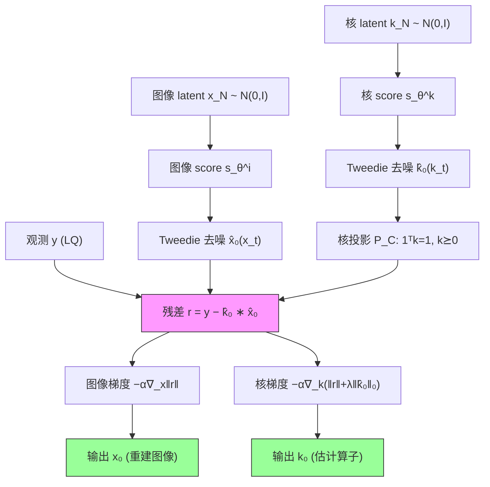

# Parallel Diffusion Models of Operator and Image for Blind Inverse Problems (BlindDPS)

**作者**: Hyungjin Chung, Jeongsol Kim, Sehui Kim, Jong Chul Ye (KAIST)
**会议**: CVPR 2023 | **年份**: 2022 (arXiv 2211.10656)
**链接**: [arXiv](https://arxiv.org/abs/2211.10656) | [PDF](https://arxiv.org/pdf/2211.10656)

---

## 一句话总结

BlindDPS 把 DPS 从"只估图像"推广到"图像 + 前向算子联合估计"——为算子参数（模糊核 $k$、湍流 tilt 场 $\phi$）**各训一个扩散先验**，让每个分量跑一条独立的反向扩散链，链间仅通过观测残差 $\|y-\hat{k}_0*\hat{x}_0\|$ 的梯度耦合，在盲去模糊和湍流成像上取得感知指标 SOTA。

> 💡 **本课题定位（Hao）**: 本文是"生成先验下参数化盲逆问题"这条线的**核心基线之一**，是所有"盲 + 扩散 + 联合采样"方法的原型。我们的 gauge-aware 联合后验采样与校准工作，正是要在保留其"联合采样"骨架的同时，修正它三处偏差来源（独立先验假设、Jensen 点估计近似、手调步长 + 硬投影 gauge），并用 SBC/coverage/CRPS 正面检验联合后验是否校准——这些是 BlindDPS 完全回避的问题。

---

## 核心贡献

1. **首次把扩散后验采样扩展到盲逆问题**：证明可以为前向算子构造独立扩散先验，实现图像与算子的联合后验采样。
2. **并行反向扩散框架 + Theorem 1**：在 $x_0\perp k_0$ 独立假设下，把 DPS 的似然近似推广到联合 $(x_t,k_t)$，构造一组形式相同的反向 SDE；可任意扩展到多分量（Remark 1，如湍流的图像+核+tilt）。
3. **Gaussian scale-space 解释**：把反向扩散等同于连续 coarse-to-fine 演化，替代传统方法离散、突变的多尺度调度。
4. **扩散先验 + 稀疏正则的混合**：对核额外加 $\ell_0/\ell_1$ 稀疏，进一步稳定运动模糊核估计。
5. **SOTA 实验**：盲去模糊（FFHQ/AFHQ）与湍流成像（FFHQ/ImageNet）上感知指标大幅领先监督/优化/DIP/扩散基线。

---

## 📖 批读导航

| Section | 内容 |
|---------|------|
| [00 - Abstract](sections/00-abstract.md) | 摘要 + 与 DPS 的核心差异 |
| [01 - Introduction](sections/01-introduction.md) | 盲 vs 非盲、动机、Figure 1 概念图 |
| [02 - Background](sections/02-background.md) | 扩散模型、DPS 似然近似、盲逆问题形式（Eq.1-14、Figure 3） |
| [03 - BlindDPS](sections/03-blinddps.md) | **核心方法**：并行反向扩散、Theorem 1、Algorithm 1、Figure 2、稀疏正则、scale-space |
| [04 - Experiments](sections/04-experiments.md) | 主结果（Table 1-3）、核估计、消融（Fig.6/Table 4）、Figure 4/5 |
| [05 - Discussion & Related Works](sections/05-discussion-related-works.md) | 谱系定位、局限与未来方向 |
| [06 - Conclusion](sections/06-conclusion.md) | 结论 + 本课题接续点 |
| [07 - Supplementary Material](sections/07-appendix.md) | 证明（Jensen gap）、湍流三分量、消融细节、扩展相关工作、实验细节、更多结果 |

---

## 关键数字

| 指标 | 数值 |
|------|------|
| 盲去模糊 FFHQ-motion FID | **29.49**（次好 MPRNet 111.6） |
| 盲去模糊 FFHQ-motion PSNR | 22.24 |
| 核估计 MNC（FFHQ-motion） | **0.955**（次好 0.454） |
| 湍流 FFHQ FID / PSNR | 27.35（SOTA） / 24.49（略输监督 26.29） |
| 消融：uniform vs 扩散核先验 (MNC) | 0.844 vs **0.958** |
| 稀疏正则 $\lambda$ | FFHQ $\ell_1,\lambda{=}1.0$；AFHQ $\ell_0,\lambda{=}5.0$ |
| 步长 $\alpha$ | 0.3（全程固定） |
| 观测噪声 $\sigma$ | 0.02 |
| 核尺寸 / score 训练数据 | 64×64 / 60k 核（50k motion + 10k Gaussian） |
| 推理耗时（单张 2080ti） | DPS 132s → 去模糊(2网) 180s → 湍流(3网) 221s |

---

## 数据流：输入 → 中间表示 → 输出

> 💡 **数据流批注（Hao）**: 两条链（图像 / 核）**先验完全解耦**，唯一交汇是残差块 $r$。每步 = 各自无条件反向扩散一步（先验驱动）+ 各自减去残差梯度（似然校正）。核多一步投影 $\mathcal{P}_C$（gauge 固定）和稀疏正则。湍流任务再并联第三条 tilt 场链。**联合后验的相关结构从未被显式建模，只靠一阶似然梯度传递**——这是偏差的结构性根源。

---

## 优缺点与还能做什么

### 优点
- **概念优雅、可组合**：每个前向分量 = 一条扩散链 + 一个 score，天然支持多分量（图像+核+tilt）。
- **无监督、泛化好**：不依赖成对训练数据，只需知道前向函数形式；对偏离训练分布的退化比监督法鲁棒。
- **感知质量 SOTA**：FID/LPIPS 大幅领先所有基线；核估计 MNC 极高。
- **coarse-to-fine 天然平滑**：反向扩散提供连续尺度演化，避免传统法离散调度的阶段突变崩溃。
- **理论有界**：Theorem 1 给出 Jensen gap 上界。

### 局限 / 风险
- **只给点估计、不谈校准**：全篇用 "posterior sampling" 措辞，却从不验证样本是否构成校准的联合后验（无 coverage/SBC/CRPS，无后验宽度展示）。
- **联合优化不稳**：参数（$\alpha,\lambda$）调不好会发散；tilt 场（高维）常估错。
- **独立先验假设 + Jensen 近似**：Eq.(16) 假设 $x_0\perp k_0$，Theorem 1 用点估计代替期望，联合样本可能系统性有偏、过自信；Jensen gap 在低噪声（强似然）区最大。
- **不 scalable**：每加一分量多一个大扩散网络，推理线性变慢；高维核仍需手工稀疏补丁。
- **非 fully-blind**：只解决"参数化盲"（函数形式已知），真正的盲（形式未知）未解。

### 还能做什么（本课题接续）
- **联合后验校准**：用 SBC / coverage / CRPS 检验 BlindDPS 联合样本的校准性，量化 miscalibration。
- **gauge-aware 采样**：把核/图像间的尺度歧义（本文用硬投影 $\mathcal{P}_C$ 粗暴消除）升级为显式、可校准的规范处理。
- **低维参数化**：把高维核（64×64）换成低维 $\varphi$（模糊长度/角度、$\sigma$）——本文 C.1 自证标量参数用简单先验即可，可绕开昂贵的核扩散先验与线性推理开销。
- **建模后验相关**：显式刻画 $x$ 与 $k$ 的后验协方差，超越"两条链只靠一阶似然梯度耦合"的近似。

---

## 阅读 Q&A 记录

- **Q: BlindDPS 和 DPS 到底差在哪？**
  A: DPS 解 $\nabla_{x_t}\log p(x_t|y)$（算子固定）；BlindDPS 解 $\nabla_{x_t,k_t}\log p(x_t,k_t|y)$（算子是随机变量）。核心新增 = 给算子也训一个扩散 score $s_{\theta^*}^k$，并把 DPS 的似然近似复制到算子分支（Theorem 1）。见 [03](sections/03-blinddps.md)。

- **Q: "并行引导"的近似具体在哪一步？**
  A: 在 Theorem 1（附录 A）。把难算的 $p(y|x_t,k_t)$ 用去噪估计代替为 $p(y|\hat{x}_0(x_t),\hat{k}_0(k_t))$（Jensen 型点估计近似）。误差上界 Eq.(44) 含交叉项 $\|\bar K_0\|m_{1,x_0}+\|\hat X_0\|m_{1,k_0}$——两分量的去噪不确定性会互相放大污染。见 [07-A](sections/07-appendix.md)。

- **Q: 图像分支和算子分支各自怎么更新？**
  A: 每步都是"无条件反向扩散一步（先验 score 驱动）+ 减去残差梯度（似然校正）"。图像：$x_{i-1}=x_{i-1}'-\alpha\nabla_{x_i}\|y-\hat{k}_0*\hat{x}_0\|$；核：$k_{i-1}=k_{i-1}'-\alpha\nabla_{k_i}(\|y-\hat{k}_0*\hat{x}_0\|+\lambda R_k)$，且核每步投影到单纯形 $\mathcal{P}_C$。见 Algorithm 1 / Figure 2。

- **Q: 联合样本可能的偏差来源有哪些？**
  A: ① Eq.(16) 假设图像与核先验独立（乘积形式），忽略后验相关；② Theorem 1 用点估计代替期望，丢失后验宽度、两分量不确定性交叉污染，Jensen gap 在低噪声区最大；③ 步长 $\alpha$、稀疏权重 $\lambda$ 手调 + 核硬投影固定 gauge，破坏校准可解释性。

- **Q: 算子非要用扩散先验吗？对我们的低维参数呢？**
  A: 附录 C.1 明确——**高维核（64×64）用 uniform 先验会崩**（MNC 0.844 vs 扩散 0.958）；但**标量参数用 uniform 即可**（作者引 Levac et al. [34]）。我们的 $\varphi$ 是几个标量，落在"简单先验够用"区间，可用轻量可校准先验替代昂贵的核扩散模型。

- **Q: 为什么湍流 PSNR 输给监督法？**
  A: perception-distortion tradeoff [4]。重度退化下扩散会生成合理但未必逐像素对的高频细节，牺牲 PSNR 换 FID/LPIPS。这也提示"生成的高频"可能是后验的合理多样性，更该用校准而非 PSNR 评判。见 [04](sections/04-experiments.md) Table 3。

---

## 📊 Citation Landscape

**TLDR (Semantic Scholar 自动摘要)**: This work shows that it can indeed solve a family of blind inverse problems by constructing another diffusion prior for the forward operator, and yields state-of-the-art performance, while also being flexible to be applicable to general blind inverse problems when the authors know the functional forms.

**引用统计**（数据来源 Semantic Scholar，截至 2026-07）:

| 指标 | 数值 |
|------|------|
| 被引次数 (citationCount) | 171 |
| Influential Citations | 28 |
| 参考文献数 (referenceCount) | 64 |
| Semantic Scholar paperId | `4fb6b6f7a21c09bdf85aeb7e53ee448eb85cd0ae` |
| Connected Papers | https://www.connectedpapers.com/main/2211.10656 |

### 参考文献分组（各组 Top 5，按被引次数排序）

**扩散模型 & 扩散逆问题求解器（本文方法根基）**
| 被引 | 年份 | 论文 |
|------|------|------|
| 32814 | 2020 | Denoising Diffusion Probabilistic Models (DDPM) [22] |
| 12381 | 2021 | Diffusion Models Beat GANs on Image Synthesis (guided-diffusion) [17] |
| 11362 | 2020 | Score-Based Generative Modeling through SDEs [53] |
| 2254 | 2011 | A Connection Between Score Matching and Denoising Autoencoders [56] |
| 1737 | 2022 | **Diffusion Posterior Sampling (DPS)** [12] — 本文的直接母方法 |

**盲去卷积 / 去模糊（经典优化与先验）**
| 被引 | 年份 | 论文 |
|------|------|------|
| 1703 | 2017 | DeblurGAN [32] |
| 1446 | 2009 | Understanding and evaluating blind deconvolution algorithms [35] |
| 1302 | 1998 | Total variation blind deconvolution [8] |
| 1191 | 2011 | Blind deconvolution using a normalized sparsity measure [31] |
| 1129 | 2019 | DeblurGAN-v2 [33] — 实验监督对手 |

**深度学习图像修复 / Transformer**
| 被引 | 年份 | 论文 |
|------|------|------|
| 4135 | 2021 | Restormer [60] |
| 2246 | 2020 | Pre-Trained Image Processing Transformer (IPT) [9] |
| 2225 | 2021 | Uformer [57] |
| 2182 | 2021 | Multi-Stage Progressive Image Restoration (MPRNet) [61] — 实验监督对手 |

**大气湍流成像**
| 被引 | 年份 | 论文 |
|------|------|------|
| 351 | 1978 | Probability of getting a lucky short-exposure image through turbulence [19] |
| 232 | 2013 | Removing Atmospheric Turbulence via Space-Invariant Deconvolution [62] |
| 152 | 2013 | Atmospheric Turbulence Mitigation Using Complex Wavelet-Based Fusion [1] |
| 130 | 2019 | Deep learning based atmospheric turbulence compensation (OAM) [39] |
| 90 | 2021 | Neutralizing turbulence via deep learning (TSR-WGAN) [26] — 实验对手 |

**数据集 / 理论 / 杂项**
| 被引 | 年份 | 论文 |
|------|------|------|
| 74477 | 2009 | ImageNet [16] |
| 13211 | 2018 | StyleGAN (FFHQ) [27] |
| 2124 | 2004 | The structure of images (scale-space) [30] |
| 1506 | 1994 | Scale-Space Theory [37] |
| 1143 | 2017 | The Perception-Distortion Tradeoff [4] |

> 💡 **参考文献批注（Hao）**: 引用结构清晰地暴露本文的"基因"——**扩散三巨头（DDPM/Song-SDE/guided-diffusion）+ DPS 母方法** 构成方法根基；**盲去卷积经典优化 + DL 修复** 构成对比对象；**湍流** 是第二应用。对我们最相关的是 DPS [12]（直系）和 Levac et al. [34]（并行工作，标量参数用 uniform 先验，C.1 消融的对照）——后者引用不高但概念上是"低维参数免扩散先验"的先例，正是我们低维路线的锚点。

### 推荐论文（Semantic Scholar Recommendations，按相关度排序）

| 年份 | 论文 | arXiv |
|------|------|-------|
| 2026 | Diffusion Graph Posterior Sampling for Nonlinear Inverse Problems (EIT) | 2605.19621 |
| 2026 | Learning Normalized Energy Models for Linear Inverse Problems | 2605.15487 |
| 2026 | Log-Reparameterized Diffusion Priors for Blind Radial Defocus Deblurring | — (TCI) |
| 2026 | Stochastic Optimal Control Sampling for Diffusion Inverse Problems | 2606.28785 |
| 2026 | Hallucination-Aware Diffusion Sampling for Inverse Problems via Robust Prior Updates | 2606.02331 |
| 2026 | ShuffleFlow: Scalable Posterior Inference for Bayesian Inverse Imaging | 2606.21099 |
| 2026 | Unbiased Diffusion Variational Inversion via Principled Posterior Matching | 2605.25042 |
| 2026 | KLIP: localized distribution shift detection via KL-divergence with diffusion priors | 2605.31596 |
| 2026 | Image Restoration via Diffusion Models with Dynamic Resolution | 2605.14267 |
| 2026 | RELD: Regularization by Latent Denoising | — (SPL) |

> 💡 **推荐论文批注（Hao）**: 推荐列表几乎全是 2026 年新作，且高度聚焦"扩散 + 逆问题 + 后验推断"——说明本文在这条线上仍是活跃锚点。其中和我们课题最贴的是 **ShuffleFlow (Scalable Posterior Inference for Bayesian Inverse Imaging)** 和 **Unbiased Diffusion Variational Inversion via Principled Posterior Matching**——它们的关键词"Bayesian / posterior inference / unbiased / posterior matching"正是 BlindDPS 缺失、我们要补的**校准的后验**方向；**Hallucination-Aware Diffusion Sampling** 则回应本文的 perception-distortion / 幻觉高频问题。这些可作为我们做联合后验校准时的对照与文献起点。

