[← 返回 README](../README.md)

# 2. Background

## 📌 预览

本节铺三层地基：(1) 扩散模型（VP-SDE / DDPM 的前向加噪、反向去噪、score matching）；(2) **DPS**——用 Tweedie 去噪估计 $\hat{x}_0(x_t)$ 代入似然，把难算的 $\nabla_{x_t}\log p(y|x_t)$ 近似成可算的 $\nabla_{x_t}\log p(y|\hat{x}_0)$；(3) 盲逆问题的经典形式——把图像先验和算子先验都写成负对数先验的正则项。BlindDPS 的方法（第 3 节）就是把 DPS 的这套近似"复制到算子分支"。

> 💡 **Section 概览（Hao 批注）**: 读这一节的目标不是重学扩散，而是**锁定 DPS 的似然近似**——因为 BlindDPS 的 Theorem 1 就是把它推广到联合 $(x_t,k_t)$。请重点记住 Eq. (8) 的 $\hat{x}_0(x_t)$（Tweedie 公式）和它下面那个"用 $\hat{x}_0$ 代替 $x_t$ 算似然梯度"的近似——这是全文所有联合采样的地基，也是我们分析"联合后验偏差"时首先要审视的近似。

---

## Diffusion models

Variance preserving (VP) diffusion models (i.e. DDPM [22]), in the score-based persepctive [53], define the forward noising process of the data ${\pmb x}(t) \triangleq {\pmb x}_t, t \in [0,1]$ with a linear stochastic differential equation (SDE)

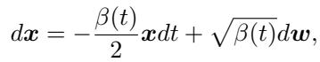

*Eq. (1): VP-SDE 前向加噪过程。*

where $\beta(t)$ is the noise schedule, and $w$ is the standard Brownian motion. One can define a proper noise schedule $\beta(t)$ such that the data distribution ${\pmb x}(0) \sim p_0 = p_{\text{data}}$ is molded into the standard Gaussian distribution $x(1) \sim p_1 \simeq \mathcal{N}(\mathbf{0}, I)$. Then, the corresponding reverse SDE is given by [2]

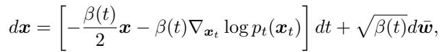

*Eq. (2): 反向 SDE，由 score function $\nabla_{x_t}\log p_t(x_t)$ 驱动。*

where $\nabla_{x_t}\log p_t(x_t)$ is the score function, typically approximated by denoising score matching (DSM) [56]

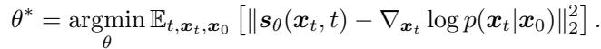

*Eq. (3): 去噪 score matching 训练目标。*

Once trained, we can use the plug-in estimate $\nabla_{x_t}\log p_t(x_t) \simeq s_\theta(x_t, t)$ for the reverse diffusion in (2), and solve by discretization (e.g. ancestral sampling of [22]), effectively sampling from the prior distribution $p(x_0)$.

> 💡 **机制拆解（Hao 批注）**: 这三条式子是标准扩散配方：Eq.(1) 加噪、Eq.(2) 去噪、Eq.(3) 学 score。对本文而言只需记一件事——**训好的 $s_\theta$ 就是先验 $\nabla\log p(x)$ 的插件估计**。BlindDPS 的创新不在这里，而在于"对核 $k$ 也训一个同样的 $s_{\theta^*}^k$"，把核当成另一个待采样的随机变量。

## Diffusion posterior sampling (DPS)

Consider the following Gaussian measurement model

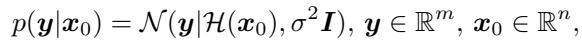

*Eq. (4): 高斯观测模型，$\mathcal{H}$ 为前向算子。*

where $y$ is the corrupted measurement, ${\pmb x}_0$ is the latent image that we wish to estimate, and $\mathcal{H}$ is the forward operator. As the problem is often ill-posed, it is desirable to be able to sample from the posterior distribution $p({\pmb x}_0 | {\pmb y})$. By Bayes' rule, we have for a general timestep $t$,

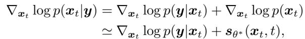

*Eq. (5)(6): 贝叶斯拆分，后验 score = 似然 score + 先验 score。*

where we can plug (6) into the reverse diffusion (2) to sample from $p({\pmb x}_0 | {\pmb y})$, i.e.

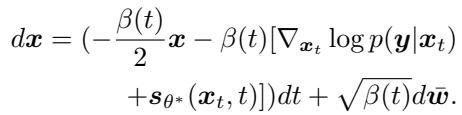

*Eq. (7): 条件反向 SDE（似然引导 + 先验 score）。*

Note that the time-conditional log-likelihood $\log p({\pmb y} | {\pmb x}_t)$ is intractable in general. However, it was shown in the work of DPS [12] that we can use an approximation to arrive at

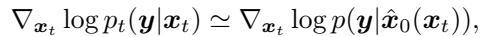

*DPS 近似：用去噪估计 $\hat{x}_0(x_t)$ 处的似然代替 $x_t$ 处的似然。*

where

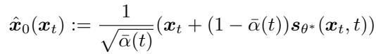

*Eq. (8): Tweedie 公式给出的去噪估计 $\hat{x}_0(x_t)$。*

is the denoised estimate of ${\pmb x}_t$ in the VP-SDE context given by the Tweedie's formula [18]. Hence, one can use the following tractable reverse SDE to sample from the posterior distribution

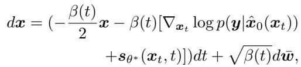

*Eq. (9): 可计算的后验反向 SDE。*

where we observe that $\nabla_{x_t}\log p({\pmb y} | \hat{\pmb x}_0({\pmb x}_t))$ can be efficiently computed using analytical likelihood, and backpropagation through the score function, i.e.

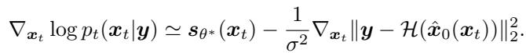

*高斯似然下的解析梯度：$s_{\theta^*} - \frac{1}{\sigma^2}\nabla_{x_t}\|y - \mathcal{H}(\hat{x}_0(x_t))\|_2^2$。*

However, one should note that the method in (9) is only applicable when the forward model $\mathcal{H}$ is fixed, and hence cannot be directly used for solving blind inverse problems.

> 💡 **公式批读：DPS 的核心近似（Hao 批注）**:
> - **问题**：Eq.(7) 需要 $\nabla_{x_t}\log p(y|x_t)$，但 $p(y|x_t)=\int p(y|x_0)p(x_0|x_t)dx_0$ 是对整条后验积分，不可解析。
> - **DPS 的招**：把这个期望**塌缩到均值点**——用 Tweedie 给出的后验均值 $\hat{x}_0(x_t)=\mathbb{E}[x_0|x_t]$（Eq.8）代入，近似 $p(y|x_t)\approx p(y|\hat{x}_0(x_t))$。于是似然梯度退化成"重建残差 $\|y-\mathcal{H}(\hat{x}_0)\|^2$ 对 $x_t$ 的梯度"，可以反传求。
> - **代价**：这是一个 Jensen 型近似，误差来自 $p(x_0|x_t)$ 的方差（去噪不确定性）。在 $t$ 大（噪声大）时后验很宽，近似误差最大——BlindDPS 附录 Theorem 1 证明了这个 gap 随 $\sigma$ 增大反而趋 0（因为高斯似然被拉平），但**这恰恰意味着高噪声阶段的引导信号偏软**。
> - **对我们课题的意义**：这个"用点估计代替期望"的近似是所有 DPS 系方法（含 BlindDPS）联合后验**不校准**的根源之一——它把后验的宽度信息在似然项里丢掉了。我们做 gauge-aware 校准时，要正面量化这一步引入的 miscalibration。

## Blind inverse problem

Blind inverse problems consider the case where the forward model $\mathcal{H}$ is unknown. Among them, we focus on the case where the forward operator is parameterized with $\varphi$, and we need to estimate the parameter $\varphi$. Specifically, consider the following forward model

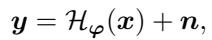

*Eq. (10): 参数化前向模型 $y = \mathcal{H}_\varphi(x) + n$。*

where $\varphi$ is the parameter of the forward model, $x$ is the ground truth image, and $n$ is some noise. Here, both $\varphi, x$ are unknown, and should be estimated. A classical way to solve (10) is to optimize for the following

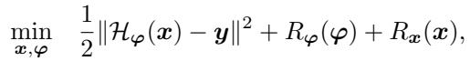

*Eq. (11): 经典联合优化目标（数据项 + 两个正则项）。*

where $R_\varphi(\varphi), R_x(x)$ are regularization functions for $\varphi, {\pmb x}$, respectively, which can also be thought of as the negative log prior for each distribution, e.g. $R(\cdot) = -\log p(\cdot)$

> 💡 **机制拆解：本文的问题设定（Hao 批注）**: Eq.(10)(11) 定义了本文的靶子——**参数化盲逆问题**。关键的一步等价是最后一句：**正则项 $R = -\log p$ 即负对数先验**。这句话是全文枢纽——它把经典的"数据项 + 手工正则"翻译成"似然 + 先验"，从而给"用扩散模型替代手工正则 $R_\varphi$"提供了理论接口。我们课题的 $\varphi$（模糊长度/角度、$\sigma$）就是这里的低维参数，只不过 BlindDPS 把 $\varphi$ 当成 64×64 核图像来处理。

For example, consider blind deconvolution from camera motion blur as illustrated in Fig. 3(a). The forward model reads

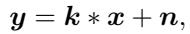

*Eq. (12): 盲去卷积前向 $y = k * x + n$，核 $k$ 即参数 $\varphi$。*

where $k$ is the blur kernel, corresponding to the parameter $\varphi$. On the other hand, although the "real" forward model for atmospheric turbulence is rarely directly used in practice due to the highly complicated nature of the wave propagation theory, the tilt-blur model is often used [6, 7, 50], as the model is simple but fairly accurate. Specifically, the visualization of such imaging process is shown in Fig. 3(b), which can be mathematically described by

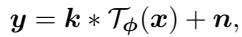

*Eq. (13): 湍流成像的 tilt-blur 模型 $y = k * \mathcal{T}_\phi(x) + n$。*

*Figure 3. Illustration of the imaging forward model. (a) Blind deconvolution, (b) Imaging through turbulence*

> 💡 **Figure 3 批读（Hao 批注）**: 这张图定义两个任务的前向物理：
> - **(a) 盲去卷积**：清晰图 $x$ 经模糊核 $k$ 卷积 + 噪声 = 观测 $y$。待估参数 = 核 $k$（一个）。
> - **(b) 湍流成像**：清晰图先经 **tilt 操作 $\mathcal{T}_\phi$**（像素级几何扭曲，模拟大气折射抖动），再经模糊核 $k$ 卷积，加噪。待估参数 = 核 $k$ **和** tilt 场 $\phi$（**两个**，且 $\phi$ 是和图像同尺寸 256×256 的向量场，维度极高）。
> - **为什么重要**：(b) 是本文"通用性"的证据——同一套并行扩散框架从 2 分量（图像+核）扩到 3 分量（图像+核+tilt）。但也埋下 Limitation：tilt 场 256×256 维、先验难学，作者后面承认"tilt 常被估错，而核和图像估对"。这对我们是重要教训——**高维算子参数的联合后验最难校准**，反证了我们做低维参数化的价值。

where $\mathcal{T}$ is the tilt operator parameterized by the tilt vector field $\phi$. To remove the scale ambiguity between the kernel and image, the magnitude and the polarity constraints of kernels are often used:

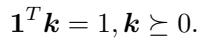

*Eq. (14): 核约束 $\mathbf{1}^T k = 1,\ k \succeq 0$（和为 1、非负）。*

Then, the success of the optimization algorithm (11) with the forward models (12) or (13) under the constraint (14) depends on two factors: 1) How closely the prior-imposing functions $R_{\{x, k\}}$ estimate the true prior, and 2) how well the optimization procedure finds the minimum value. Conventional methods are sub-optimal in both aspects. First, the prior (e.g. sparsity [42], dark channel [45], implicit from deep networks [48]) functions do not fully represent the true prior. Second, the optimization process is unstable and hard to tune. For instance, [42, 45] requires different weighting parameters per image, and often fails during the abrupt changes in the stage transition during coarse-tofine optimization strategy. In section 3, we show that our method can solve both of these problems.

> 💡 **公式批读：尺度歧义与约束（Hao 批注）**: Eq.(14) 是盲去卷积的老问题——$k*x=(ck)*(x/c)$ 存在尺度歧义，所以强制核**和为 1、非负**（投影到单纯形 $C$）。BlindDPS 在算法里通过 $\mathcal{P}_C(\hat{k}_0)$ 每步投影来施加。**这个约束是"gauge 固定"的一种朴素形式**——正好对应我们课题标题里的"gauge-aware"：核/图像间的尺度自由度是一种规范自由度，BlindDPS 用硬投影粗暴消掉，而我们要做的是在联合后验里显式、可校准地处理这类规范。
>
> 最后两句总结了传统方法的两大病：**先验不准 + 优化不稳（需逐图调参、阶段切换易崩）**。本文声称两病同治：扩散先验解决"先验不准"，反向扩散的连续 coarse-to-fine 解决"优化不稳"。

> 💡 **Section 小结（Hao 批注）**:
> - **关键公式**：Eq.(8) Tweedie $\hat{x}_0$ + DPS 似然近似 = 全文地基；Eq.(11) 把正则等同负对数先验 = 接入扩散先验的接口；Eq.(14) 核约束 = 朴素 gauge 固定。
> - **核心洞察**：DPS 只能处理算子固定的情形；盲问题的两大病是"先验不准"和"优化不稳"。
> - **可追问点**：DPS 的"点估计代替期望"近似会丢后验宽度 → 这是联合后验不校准的第一根源；Eq.(14) 硬投影处理尺度歧义 → 对照我们的 gauge-aware 校准。
