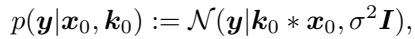
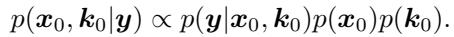
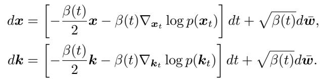
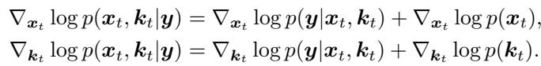
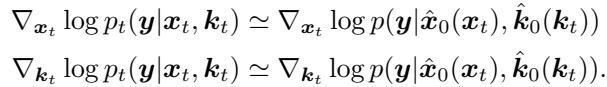
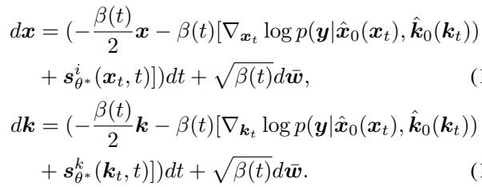
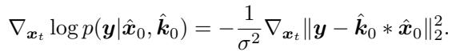
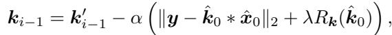

[← 返回 README](../README.md)

# 3. BlindDPS

## 📌 预览

本节是全文核心。把 DPS 从"只估图像"推广到"图像 + 算子联合估计"，做法是：为算子（核 $k$）**也训一个扩散 score** $s_{\theta^*}^k$，构造**两条并行反向 SDE**，二者仅通过似然梯度 $\nabla\|y-\hat{k}_0*\hat{x}_0\|$ 耦合。理论支撑是 Theorem 1（把 DPS 的似然近似推广到联合 $(x_t,k_t)$，依赖 $x_0\perp k_0$ 独立）。工程上再加两招：核约束投影 $\mathcal{P}_C$ 和稀疏正则 $R_k$。

> 💡 **Section 概览（Hao 批注）**: 按数据流读这一节最清楚。**输入**：观测 $y$、两个纯噪声 latent $x_N,k_N$、两个预训练/训练好的 score $s_{\theta^*}^i, s_{\theta^*}^k$。**每步中间变量**：去噪估计 $\hat{x}_0,\hat{k}_0$（Tweedie）。**耦合信号**：残差 $r=y-\hat{k}_0*\hat{x}_0$。**两分支更新**：先各自做无条件反向扩散一步（ancestral sampling），再各自减去 $\alpha\nabla r$（图像分支）/$\alpha\nabla(r+\lambda R_k)$（核分支）。**输出**：$x_0,k_0$。读的时候重点盯"耦合只发生在残差梯度、先验完全解耦"这个结构——它决定了联合样本的偏差性质。

---

In DPS [12], the authors used the diffusion prior for $R_{\pmb x}$ by training a score function that models $\nabla_{\pmb x}\log p({\pmb x})$. As for blind inverse problems, a prior model for the parameter $p(\varphi)$ should also be specified. In this regard, our proposal is to use the diffusion prior also for the forward model parameter by estimating $\nabla_\varphi \log p(\varphi)$. With such choice, one can model a much more accurate prior for the parameters compared to the conventional choices. In the following, we detail on how to build our method BlindDPS, focusing on blind deconvolution. The method for imaging through turbulence can be derived in a completely analogous fashion, where the details can be found in Supplementary section B.1.

> 💡 **核心贡献一句话（Hao 批注）**: 全文的"发明"就在这段——**给算子参数 $\varphi$ 也建扩散先验 $\nabla_\varphi\log p(\varphi)$**。DPS 只有 $R_x$（图像先验），BlindDPS 补上 $R_\varphi$（算子先验），且用扩散模型隐式表达而非手工 sparsity/dark-channel。这就是它"先验更准"的来源。

## Key idea

In blind deblurring (deconvolution), the probabilistic forward model is specified as follows



*Eq. (15): 盲去模糊的概率前向模型 $p(y|x_0,k_0)=\mathcal{N}(y|k_0*x_0,\sigma^2 I)$。*

where $k_0$ is the random variable of the convolution kernel. As ${\pmb x}_0$ and ${\pmb k}_0$ are independent, the posterior probability is given as



*Eq. (16): 联合后验分解 $p(x_0,k_0|y)\propto p(y|x_0,k_0)p(x_0)p(k_0)$。*

Note that our aim is to use implicit diffusion priors for both $p({\pmb x}_0)$ and $p({\pmb k}_0)$ through their score functions. One can easily take pre-trained score functions for the image. Similarly, the score function for the kernel can also be estimated from standard DSM (3) to get $s_{\theta^*}^k({\pmb k}, t) \simeq \nabla_{k_t}\log p_t({\pmb k}_t)$. Note that performing DSM to achieve $s_{\theta^*}^k$ costs much less than training the image score function $s_{\theta^*}^i$, as the distribution is much simpler, and the dimensionality of the vector $k$ is also sufficiently smaller than $x$.

> 💡 **公式批读：独立性假设的位置（Hao 批注）**: Eq.(16) 是全文最关键、也最值得质疑的一步——**它假设 $x_0 \perp k_0$，于是联合先验分解成乘积 $p(x_0)p(k_0)$**。这个假设让"两条独立扩散链"在数学上成立（各建各的 score）。
> - **合理性**：在合成实验里，核确实是独立随机生成的，图像和核统计独立，假设成立。
> - **风险（联合偏差来源 ①）**：真实世界里图像内容和退化往往相关（如手持拍摄的抖动与场景亮度/曝光相关）；即使先验独立，**后验 $p(x_0,k_0|y)$ 通过似然强耦合**，两条链只用一阶梯度耦合无法完整刻画这种后验相关性。这是我们后续做联合后验校准时的核心比较点。
> - **附带信息**：核的 score 比图像便宜——因为核分布简单、维度低（64×64 vs 256×256×3）。这也暗示：**对我们更低维的 $\varphi$（几个标量），是否还需要昂贵的扩散先验？** 见 C.1 消融（作者自证 uniform 先验对高维核不行，但对标量参数[34]可行）。

On the other hand, again from the independence of ${\pmb x}_0$ and $k_0$, we are able to construct two separate reverse diffusion processes of identical form:



*两条形式相同的反向扩散过程（仅能从边缘 $p(x_0)$、$p(k_0)$ 采样）。*

Note that the two reverse SDEs are only able to sample from the marginals $p({\pmb x}_0), p({\pmb k}_0)$. However, one can define the dependency between ${\pmb x}, {\pmb y}$ and $k$ from the posterior probability. Using Bayes' rule in (16) for general $t$, we have



*联合贝叶斯：$\nabla\log p(x_t,k_t|y)$ 各自 = 似然 score + 各自先验 score。*

Here, in order to estimate the time-conditional loglikelihood $\log p({\pmb y} | {\pmb x}_t, {\pmb k}_t)$ which is intractable in general, we need the following result:

**Theorem 1.** Under the same conditions in [12], we have



*Theorem 1: 联合似然梯度近似——用去噪估计 $\hat{x}_0(x_t),\hat{k}_0(k_t)$ 处的似然代替 $x_t,k_t$ 处的似然。*

**Remark 1.** Our theorem holds as long as ${\pmb x}_t$, $k_t$ are independent. Note that the theorem can be further generalized to handle more random variables whenever the independence between the variables is established. In other words, we can construct arbitrary many diffusion procedures for each component of the forward model, which can be solved analogous to the approximation proposed in Theorem 1. This result will be useful when we solve the problem of imaging through turbulence in Supplementary section B.1.

> 💡 **公式批读：Theorem 1 就是"DPS 近似 × 2"（Hao 批注）**:
> - **它做了什么**：把 DPS 的单变量近似 $p(y|x_t)\approx p(y|\hat{x}_0)$ 推广到联合——$p(y|x_t,k_t)\approx p(y|\hat{x}_0(x_t),\hat{k}_0(k_t))$。于是图像分支和核分支的似然梯度都能算（对同一个残差 $\|y-\hat{k}_0*\hat{x}_0\|$ 分别对 $x_t$、$k_t$ 反传）。
> - **关键前提（Remark 1）**：**$x_t \perp k_t$ 对所有 $t$ 成立**。这来自"两条链各自独立加噪、独立初始化"。一旦独立，就能任意增加分量（图像+核+tilt，见 Eq.48-50），这是"通用性"的理论出口。
> - **近似误差**：附录 A 用 Jensen gap 给了上界 $\propto \frac{d}{\sqrt{2\pi\sigma^2}}e^{-1/2\sigma^2}(\|\bar K_0\|m_{1,x_0}+\|\hat X_0\|m_{1,k_0})$，并指出**误差随 $\sigma$ 增大趋 0**。$m_{1,x_0},m_{1,k_0}$ 分别是图像/核后验的一阶绝对矩（去噪不确定性）。
> - **联合偏差来源 ②（我们的靶点）**：这个上界只保证"梯度方向近似对"，**不保证采样得到的联合分布等于真后验**。误差同时依赖两个后验矩 $m_{1,x_0}$ 和 $m_{1,k_0}$——即两个分量的去噪不确定性会互相污染彼此的引导。这正是"联合样本可能有偏、且不校准"的理论痕迹。

Using Theorem 1, we finally arrive at the following reverse SDEs



*Eq. (17)(18): 图像与核的两条可解反向 SDE（先验 score + 联合似然梯度）。*

The system of equations (17),(18) are now numerically solvable as the gradient of the log likelihood is analytically tractable. Specifically, for the Gaussian measurement, we have



*Eq. (19): 高斯观测下的似然梯度 $-\frac{1}{\sigma^2}\nabla_{x_t}\|y-\hat{k}_0*\hat{x}_0\|_2^2$。*

Combined with the ancestral sampling steps [22], our algorithm for posterior sampling of blind deblurring is formally given in Algorithm 1. Here, note that we choose to take static step size times the gradient of the norm instead of taking time-dependent step sizes times the gradient of the squared norm, as it was shown to be effective despite its simplicity [12]. Furthermore, in order to impose the usual condition (14), we define a set $C := \{k | \mathbf{1}^T k = 1, k \succeq 0\}$ and project onto the set through $\mathcal{P}_C(\hat{k}_0)$ in Algorithm 1, after the estimation of $\hat{\pmb k}_0$ at each intermediate step. For visual illustration of the proposed method, see Fig. 2.


*Figure 2. Description of BlindDPS. From the intermediate (noisy) estimate $x_i, k_i$, we achieve the denoised representation $\hat{x}_0(x_i), \hat{k}_0(k_i)$ through Tweedie's formula with the score functions $s_{\theta^*}^i, s_{\theta^*}^k$. The residual $\|y - \hat{k}_0 * \hat{x}_0\|$ is computed with the denoised estimates, and the residual-minimizing gradients are applied parallel to both diffusion processes.*

> 💡 **Figure 2 批读：并行引导的全貌（Hao 批注）**: 这是全文最该盯的图，按数据流逐段拆：
> - **上支（图像）**：噪声 latent $x_i$ → 图像 score $s_{\theta^*}^i$ → Tweedie 去噪得 $\hat{x}_0(x_i)$（清晰人脸）。
> - **下支（核）**：噪声 latent $k_i$ → 核 score $s_{\theta^*}^k$ → Tweedie 去噪得 $\hat{k}_0(k_i)$（一条模糊轨迹）。
> - **中间耦合块**：把两个去噪估计**卷积** $\hat{k}_0*\hat{x}_0$，与观测 $y$ 相减得残差。这是**两支唯一的信息交汇点**。
> - **回传（关键差异）**：残差梯度**分两路**——
>   - 图像支：$x_{i-1}\leftarrow x_{i-1}'-\alpha\nabla_{x_i}\|y-\hat{k}_0*\hat{x}_0\|$（粉色）。
>   - 核支：$k_{i-1}\leftarrow k_{i-1}'-\alpha\nabla_{k_i}(\|y-\hat{k}_0*\hat{x}_0\|+\|\hat{k}_0\|_0)$（绿色）——**注意核支多了一项 $\ell_0$ 稀疏正则**，图像支没有。
> - **本图揭示的偏差结构**：图像和核的先验（两个 score）**完全不交互**，只有似然残差把它们绑在一起。这等价于把联合后验强行因子化成"两个边缘先验 × 一个耦合似然"，用一阶梯度做协调。**联合后验的相关结构（$x$ 与 $k$ 的后验协方差）在这个架构里从未被显式建模**——这是我们批"联合样本偏差/不校准"的最直接图证。

**Algorithm 1  BlindDPS — Blind Deblurring**

```
Require: N, y, α, {σ̃_i}_{i=1}^N, λ, R_k(·)
 1: x_N, k_N ~ N(0, I)
 2: for i = N−1 to 0 do
 3:     ŝ^i  ← s^i_{θ*}(x_i, i)
 4:     ŝ^k  ← s^k_{θ*}(k_i, i)
 5:     x̂_0  ← (1/√ᾱ_i)(x_i + √(1−ᾱ_i) ŝ^i)
 6:     k̂_0  ← (1/√ᾱ_i)(k_i + √(1−ᾱ_i) ŝ^k)
 7:     k̂_0  ← P_C(k̂_0)                                  # 投影到 {1ᵀk=1, k⪰0}
 8:     z_i, z_k ~ N(0, I)
 9:     x'_{i−1} ← [√α_i(1−ᾱ_{i−1})/(1−ᾱ_i)] x_i + [√ᾱ_{i−1}β_i/(1−ᾱ_i)] x̂_0 + σ̃_i z_i
10:     k'_{i−1} ← [√α_i(1−ᾱ_{i−1})/(1−ᾱ_i)] k_i + [√ᾱ_{i−1}β_i/(1−ᾱ_i)] k̂_0 + σ̃_i z_k
11:     x_{i−1}  ← x'_{i−1} − α ∇_{x_i} ‖y − k̂_0 * x̂_0‖_2
12:     L_k      ← ‖y − k̂_0 * x̂_0‖_2 + λ R_k(k̂_0)
13:     k_{i−1}  ← k'_{i−1} − α ∇_{k_i} L_k
14: end for
15: return x_0, k_0
```

> 💡 **Algorithm 1 逐行批读（Hao 批注）**: 这就是 Fig. 2 的代码化，一步 = "无条件采样 + 似然校正"：
> - **行 3-4**：两个 score 各出一次 $\hat s$。
> - **行 5-6**：Tweedie 去噪得 $\hat{x}_0,\hat{k}_0$（两次网络前向）。
> - **行 7**：核投影 $\mathcal{P}_C$——固定尺度歧义（gauge）。**注意图像不投影**，尺度不确定性全压给核。
> - **行 9-10**：DDPM ancestral sampling 主步（先验驱动），产出未校正的 $x'_{i-1},k'_{i-1}$。
> - **行 11 / 13**：似然校正——各减 $\alpha\nabla(\text{残差})$。**核支的 loss（行 12）多了 $\lambda R_k$ 稀疏项**。
> - **两个关键工程细节**：① 用**静态步长 $\alpha$ 乘 norm 的梯度**（而非时变步长乘 squared-norm），照搬 DPS 的简化；② 步长 $\alpha=0.3$ 全程固定，作者在 Limitation 承认"参数调不好会发散"——**这正是联合优化不稳的残留证据**。
> - **对我们课题的批判点**：整个算法输出的是**单点** $(x_0,k_0)$。要得到后验样本只能换随机种子重跑，且没有任何机制保证这些样本的散布 = 真后验散布。步长 $\alpha$、稀疏权重 $\lambda$ 都是影响"后验宽度"的手调旋钮，破坏了校准的可解释性。

## Augmenting diffusion prior with sparsity

Implementing (17),(18) directly induces fairly stable results with the correct choice of $\alpha$. Here, we go a step further and adopt a lesson from the classic literature. As we often wish to estimate blur kernels that are sparse, we promote sparsity only to the kernel that we are estimating by augmenting the diffusion prior with $\ell_0 / \ell_1$ regularization. The minimization strategy for the kernel then becomes



*Eq. (20): 核更新加稀疏正则 $k_{i-1}=k_{i-1}'-\alpha(\|y-\hat{k}_0*\hat{x}_0\|_2+\lambda R_k(\hat{k}_0))$。*

where $\lambda$ is the regularization strength, and the choice of $R_k(\cdot) := \ell_0 / \ell_1$ regularization depends on the type of the dataset. With such augmentation, reconstruction can be further stabilized.

> 💡 **机制拆解：为什么还要手工稀疏（Hao 批注）**: 有意思的自相矛盾——本文卖点是"扩散先验取代手工先验"，但对核**又加回了经典的 $\ell_0/\ell_1$ 稀疏正则**。原因：运动模糊核本质是稀疏的一条轨迹，纯扩散先验不够强，加稀疏能进一步稳。$R_k$ 的选择依数据集而定（FFHQ 用 $\ell_1,\lambda=1$；AFHQ 用 $\ell_0,\lambda=5$）。**这说明扩散核先验并未完全"学到"稀疏结构，仍需手工补丁**——是本文方法不够干净的地方，也说明"高维核扩散先验"的性价比存疑（对我们低维 $\varphi$ 更没必要）。Table 4 / C.2 专门消融 $\lambda$。

## Interpretation in Gaussian scale-space

(Gaussian) Scale-space theory [37] states that one can represent signals in multiple scales by gradually convolving with Gaussian filters. As adding Gaussian noise to random vectors in the forward pass of the diffusion has a dual relation in the density domain (i.e. convolution with Gaussian kernels), one can think of the diffusion process as a realization of one such process. Thus, the reverse diffusion process can be interpreted as a coarse-to-fine synthesis evolving through the Gaussian scale-space, which is most visible by visualizing $\hat{\pmb x}_0({\pmb x}_t), \hat{\pmb k}_0({\pmb k}_t)$ when evolving through $t = 1 \to 0$ (see Fig. 1(c)).

For blind deconvolution problems, in order to achieve optimal quality, it is a standard practice to start the optimization process at a coarse scale by down-sampling, and sequentially upsample with a pre-determined schedule to refine the estimates [42, 43]. However, the discretized schedule is typically abrupt (e.g. [42, 43] uses 8 discretization) and ad-hoc. On the other hand, by using the reverse diffusion process, we are granted with a natural, smooth schedule of evolution, which can be thought of as a continuous generalization of the coarse-to-fine reconstruction strategy. This could be another reason why the proposed method is able to dramatically outperform the conventional methods.

> 💡 **机制拆解：coarse-to-fine 解释（Hao 批注）**: 这是本文对"为什么赢"给的第二个（非算法）解释。逻辑链：扩散前向加噪 ≡ 密度域上和高斯核卷积 ≡ Gaussian scale-space 的一层；因此反向扩散 = 从粗尺度到细尺度的连续演化。传统盲去卷积也做 coarse-to-fine，但用**离散、突变的 8 级下采样调度**（易在阶段切换处崩），而扩散给了**平滑连续**的调度。
> - **批判视角**：这是一个漂亮但**定性**的解释，没有量化证据说明"平滑调度"到底贡献了多少性能。附录 C.3 的 MSE-vs-步数曲线（Fig. C.1）是唯一的间接证据——显示核在 ~200/1000 步、图像在 ~400/1000 步就收敛到最小 MSE，之后是补高频细节（提升感知质量）。这条曲线对我们有用：**它揭示了"参数估计"和"细节生成"在时间上是分离的**，暗示后验的核部分在早期就基本定型，后期主要在图像高频上采样。

> 💡 **Section 小结（Hao 批注）**:
> - **数据流**：$(y, x_N{=}noise, k_N{=}noise)$ → 每步 [两 score 去噪 → 卷积残差 → 分两路梯度校正 → 核投影/稀疏] → $(x_0,k_0)$。
> - **核心公式**：Eq.(16) 独立性分解（假设入口）、Theorem 1（DPS 近似×2，误差随 $\sigma$ 趋 0）、Algorithm 1 行 11/13（两分支各自校正）。
> - **联合偏差三来源**：① Eq.(16) 独立先验假设；② Theorem 1 的 Jensen 点估计近似（丢后验宽度、两分量不确定性互相污染）；③ 手调 $\alpha,\lambda$ + 硬投影 gauge 固定。
> - **可复用洞察**：核估计早期收敛、图像后期补高频（Fig. C.1）；核扩散先验仍需手工稀疏补丁；尺度歧义用硬投影处理 = 朴素 gauge。这些都是我们 gauge-aware 联合后验校准要正面改进/比较的点。
