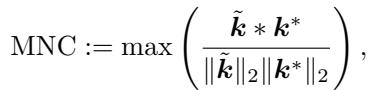
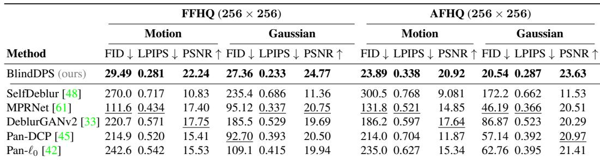
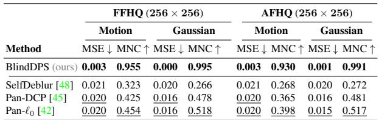
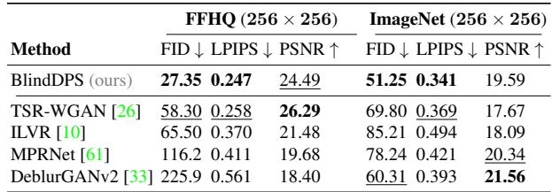
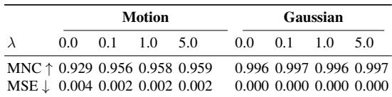

[← 返回 README](../README.md)

# 4. Experiments

## 📌 预览

两个任务：**盲去模糊**（FFHQ / AFHQ-dog，motion + Gaussian 核）和**湍流成像**（FFHQ / ImageNet）。指标分两类：图像用 FID/LPIPS/PSNR，核用 MSE/MNC。对手涵盖优化法（Pan-DCP、Pan-$\ell_0$）、深度先验法（SelfDeblur）、监督法（MPRNet、DeblurGANv2、TSR-WGAN）、扩散法（ILVR）。两个消融：① 算子扩散先验 vs uniform 先验；② 稀疏正则强度 $\lambda$。

> 💡 **Section 概览（Hao 批注）**: 读实验按"证据链"分层：(1) **主结果**证明 BlindDPS 在感知指标上大幅领先（FID/LPIPS），PSNR 偶尔略输监督法——这是 perception-distortion tradeoff 的典型表现。(2) **核估计指标**（Table 2 MSE/MNC）证明"能同时估准核"。(3) **消融①**是全文最重要的自证——证明"算子也要扩散先验"这个核心贡献确实有效（uniform 先验崩）。(4) **消融②**证明稀疏正则不敏感。注意：全部指标都是**点估计**，没有任何后验校准/覆盖度量——这正是我们要补的空白。

---

## 4.1. Experimental setup

**Blind deblurring.** For blind deblurring, we conduct experiments on FFHQ 256×256 [27], and AFHQ-dog 256×256 [11] dataset on {motion, Gaussian}-deblurring. We choose 1k validation set for FFHQ, and use 500 test sets for AFHQ-dog. We leverage pre-trained score functions, as in the experimental setting of [14]. We train the score function on 60k generated blur kernels of size 64 × 64 (both Gaussian and motion) for 3M steps with a small U-Net [17]. For testing, motion blur kernel is randomly generated with intensity 0.5 following [12], and the standard deviation of the gaussian kernels is set to 3.0. Step size for Algorithm 1 is set to $\alpha = 0.3$ for both FFHQ/AFHQ. We choose $R_k(\cdot) = \ell_1, \lambda = 1.0$ for FFHQ, and $R_k(\cdot) = \ell_0, \lambda = 5.0$ for AFHQ.

> 💡 **实验设置批读（Hao 批注）**: 几个复现关键数字：核 score 用 **60k 个 64×64 核**（50k motion + 10k Gaussian，见 F.1）训 3M 步、单张 3090 约一天——**比图像 score 便宜得多**，印证 3.1 的"核分布简单"。测试核：motion intensity=0.5（较激进的大核），Gaussian std=3.0。**注意逐数据集换 $R_k$/$\lambda$**（FFHQ 用 $\ell_1$、AFHQ 用 $\ell_0$）——这就是"逐设置调参"的残留，虽然比传统法逐图调参好，但离"免调"还有距离。

*Figure 4. Blind deblurring results. (row 1): FFHQ 256×256 motion deblurring, (row 2): AFHQ 256×256 motion deblurring. (row 3): AFHQ 256×256 Gaussian deblurring. (a) Measurement, (b) Pan-DCP [45], (c) MPRNet [61], (d) SelfDeblur [48], (e) BlindDPS (ours), (f) Ground truth. For (c), kernel not shown as the method only estimate images.*

> 💡 **Figure 4 批读（Hao 批注）**: 定性对比。看点：(a) 观测是重度模糊；(b) Pan-DCP、(d) SelfDeblur 这类优化/DIP 法在大核下**灾难性失败**（伪影或糊）；(c) MPRNet 监督法输出偏糊且不估核；(e) BlindDPS 既恢复清晰图、右下角核也贴近真值 (f)。**证据支撑**："大核激进退化下传统法崩、本文稳"这一 claim。**批判**：只展示成功案例，未展示失败或后验散布；Limitation 里承认"参数调不好会发散"，但正文图里看不到这种 case。

**Imaging through turbulence.** For imaging through turbulence, we conduct experiments with FFHQ 256×256, and ImageNet 256×256 [16], with pre-trained ImageNet score function taken from [17]. The score function for kernel blur is taken from the blind deblurring experiment, and the score function for the tilt map is trained with 50k randomly generated tilt maps following [6]. The point spread function (PSF) is assumed to be a Gaussian with standard deviation of 4.0, 2.0 for FFHQ, ImageNet, respectively (size 64×64). For both blind inverse problems, we add Gaussian measurement noise with $\sigma = 0.02$. Step size is set to $\alpha = 0.3$. Full details on experimental setup can be found in supplementary section F.

> 💡 **实验设置批读（Hao 批注）**: 湍流任务复用去模糊的核 score，**只新训 tilt 场 score**（50k tilt map）。这体现 Remark 1 的模块化——加一个分量 = 加一个 score。观测噪声 $\sigma=0.02$。注意这里是**三分量联合**（图像+核+tilt），比去模糊更难，也是 Limitation 里 tilt 常估错的来源。

**Evaluation.** We use three metrics—Frechet inception distance (FID), learned Perceptual Image Patch Similarity (LPIPS), and peak signal-to-noise-ratio (PSNR)—for quantitatively measuring the performance of the image reconstruction. For kernel estimation, we use mean-squarederror (MSE), and maximum of normalized convolution (MNC) [24], which is computed by

*Eq. (21): MNC 定义——估计核与真值核归一化互相关的峰值。*

where $\tilde{k}, k^*$ are the estimated, and the ground truth kernels, respectively.

> 💡 **公式批读：核指标 MNC（Hao 批注）**: MNC = 估计核 $\tilde k$ 与真值核 $k^*$ 的归一化互相关最大值，$\in[0,1]$，越大越好。它对**平移不变**（取 max over shift），比裸 MSE 更鲁棒（因为核估计常有整体平移歧义）。这是盲去卷积领域的标准核指标。**对我们的启示**：MNC 只衡量"点估计核 vs 真值核"的接近度，**不衡量核的后验分布是否校准**——我们要用 SBC/coverage 补上"核参数 $\varphi$ 的后验是否覆盖真值"。

## 4.2. Results

**Blind deblurring.** Motion deblurring results are presented in Fig. 1(a) and Fig. 4. As our setting for motion deblurring imposes a rather aggressive degradation with a large blur kernel, most of the prior arts fail catastrophically, not being able to generate a feasible solution. In contrast, our method accurately captures both the kernel and the image with sharpness. Similar trend can be seen for Gaussian deblurring presented in the third row of Fig. 4. Other methods fall far short of BlindDPS in the sense that they either produce reconstructions that are blurry with inaccurate blur kernel estimation, or fails dramatically (e.g. SelfDeblur). Furthermore, the proposed method establishes the state-ofthe-art in all quantitative metrics, which can be seen in Table 1 and Table 2.

*Table 1. Quantitative evaluation (FID, LPIPS, PSNR) of blind deblurring task on FFHQ and AFHQ. Bold: Best, under: second best.*

> 💡 **Table 1 批读（Hao 批注）**: 图像重建主结果。BlindDPS 在**所有 8 列 FID/LPIPS/PSNR 全部第一**，且差距巨大：如 FFHQ-motion FID 29.49 vs 次好 MPRNet 111.6（近 4 倍）；PSNR 22.24 vs 17.75。**证据链**：证明"感知 + 保真"双赢，尤其感知指标碾压。**注意**：这里 PSNR 也赢了，但湍流任务（Table 3）PSNR 就输给监督法了——说明去模糊任务退化相对可逆，本文优势最大。SelfDeblur FID 高达 270（几乎完全失败），印证 Fig.4 定性观察。

*Table 2. Quantitative evaluation (MSE, MNC [24]) of kernel estimation on FFHQ and AFHQ. Bold: Best, under: second best.*

> 💡 **Table 2 批读（Hao 批注）**: 核估计主结果，是"联合估计"claim 的直接证据。BlindDPS 的 MNC 高达 0.93~0.995、MSE 近 0，而所有对手 MNC 只有 0.27~0.52。**这是本文最强的定量支撑**——不仅图像好，核也估得极准。**批判视角（我们的靶点）**：MNC=0.955 是**单点估计**与真值的接近度；它不回答"若重复采样，核后验是否以 95% 频率覆盖真值？宽度是否合理？"。BlindDPS 把盲问题当点估计做，Table 2 的高 MNC 恰恰可能来自"后验过窄/过自信"——这正是我们要用 coverage/SBC 检验是否 miscalibrated 的地方。

**Imaging through turbulence.** We show the reconstruction results in Fig. 1(b) and Fig. 5, with quantitative metrics in Table 3. Consistent with the results from blind deblurring, BlindDPS outperforms the comparison methods in most cases, effectively removing both the blur and the tilt from the measurement. Notably, our method outperforms all other methods by large margins on perceptual metrics (i.e. FID, LPIPS). For PSNR, the proposed method often slightly underperforms against supervised learning approaches, which is to be expected, as for reconstructions from heavy degradations, retrieving the high-frequency details often penalizes such distortion metrics [4].

*Table 3. Quantitative evaluation (FID, LPIPS, PSNR) of imaging through turbulence task on FFHQ and ImageNet. Bold: Best, under: second best.*

> 💡 **Table 3 批读（Hao 批注）**: 湍流任务。BlindDPS 在 FID/LPIPS 上大幅领先（FFHQ FID 27.35 vs 次好 58.30），但 **PSNR 输给监督法**（FFHQ 24.49 vs TSR-WGAN 26.29；ImageNet 19.59 vs DeblurGANv2 21.56）。作者用 **perception-distortion tradeoff [4]** 解释：重度退化下补高频细节会牺牲逐像素保真（PSNR）。**这是诚实且正确的**——扩散生成会"幻觉"出合理但未必逐像素对的细节。**对我们**：这提醒 PSNR 不是评判生成式重建的好指标；也提示"生成的高频"可能就是后验的合理多样性，而非误差——更该用后验校准来评判。

*Figure 5. Reconstruction of imaging through turbulence. (row 1): FFHQ 256×256, (row 2-3): ImageNet 256×256. (a) Measurement, (b) ILVR [10], (c) MPRNet [61], (d) TSR-WGAN [26], (e) BlindDPS (ours), (f) Ground truth.*

> 💡 **Figure 5 批读（Hao 批注）**: 湍流定性对比。(a) 观测有几何扭曲+模糊；(b) ILVR（扩散但只做超分条件）残留扭曲；(c)(d) 监督法偏糊；(e) BlindDPS 同时去 tilt 和 blur，细节最清晰。**证据**：支撑"三分量联合估计可行"。**批判**：ImageNet 自然场景（row 2-3）比人脸更难，本文优势仍在但真值细节难完全还原——与 PSNR 略输一致。

## 4.3. Ablation studies

We perform two ablation studies to verify our design choices: 1) using the diffusion prior for the forward model parameters, and 2) augmenting the diffusion prior with the sparsity prior. Details on the experimental setup along with further analysis can be found in Supplementary section C.

**Diffusion prior for the forward model.** One may question why the score function for the kernel is necessary in the first place, since one could also estimate the kernel solely through gradient descent using the gradient of the likelihood. In fact, this corresponds to using the uniform prior for the kernel distribution, which we compare against the proposed diffusion prior (BlindDPS) in Fig. 6. We clearly see that using the uniform prior yields heavily distorted result, with poorly estimated kernel. From this experiment, we observe that using another diffusion process specifically for the forward model is crucial for the performance.

*Figure 6. Ablation study: uniform prior vs. diffusion prior. (a) Measurement, (b) uniform prior, (c) diffusion prior, (d) ground truth.*

> 💡 **Figure 6 批读：核心贡献的自证（Hao 批注）**: 这是全文最关键的消融——回答"算子到底需不需要扩散先验？"。(b) uniform 先验（核只靠似然梯度下降，$\nabla\log p(k)=0$）**严重失真、核估歪**；(c) 扩散先验干净准确。**证据链**：直接支撑核心贡献"给算子建扩散先验是必要的"。
> - **但要读懂它的边界条件（对我们极重要）**：附录 C.1 说明——uniform 先验在 Levac et al. [34] 里对**标量参数** $\kappa$ 是够用的（$\nabla\log p=0$ 即可）；只有当参数是**高维**（64×64 核）时 uniform 才崩。**换句话说，本消融证明的是"高维核需要强先验"，不能推出"低维参数也需要扩散先验"**。我们课题的 $\varphi$ 是几个标量（长度/角度/σ），恰好落在 [34] 那种"简单先验够用"的区间——所以我们完全可以用轻量可校准的先验，避免 BlindDPS 那套昂贵的核扩散模型。Table C.1 给了定量：uniform 核 MNC 0.844 vs 扩散 0.958，图像 LPIPS 0.566 vs 0.247。

**Effect of sparsity regularization.** One design choice made in BlindDPS is the additional sparsity regularization applied to kernels. Here, we analyze the effect of such regularization. In Table 4, we report on quantitative metrics for the kernel, depending on the regularization weight $\lambda$. Clearly, setting $\lambda = 0.0$ induces inferior performance especially for motion deblurring. When setting $\lambda \geq 0.1$ however, we can see that one can achieve good performance regardless of the chosen weight value. As diffusion priors have been shown to have surprisingly high generalization capacity [15, 25], we choose a mild weight value of $\lambda = 1.0$, which gives visually appealing results without down-weighting the influence of diffusion priors too much.

*Table 4. Ablation study: effect of sparsity regularization in blind deconvolution.*

> 💡 **Table 4 批读（Hao 批注）**: 稀疏权重 $\lambda$ 消融（motion / Gaussian）。$\lambda=0$（纯扩散核先验、无稀疏）时 motion 的 MNC 只有 0.929、MSE 0.004；$\lambda\ge 0.1$ 后 MNC 稳定在 0.956~0.959、MSE 降到 0.002。**证据**：说明 (i) 纯扩散核先验**不够**、需稀疏补丁（尤其 motion）；(ii) 加了之后对具体 $\lambda$ 值**不敏感**。Gaussian 核本身平滑，$\lambda$ 影响微乎其微（MNC 一直 ~0.997）。**批判**：这条消融其实暴露了 3.2 的自相矛盾——号称扩散先验取代手工先验，但 motion 核仍需手工 $\ell_0/\ell_1$ 才达最优。对我们：低维参数化根本不涉及"稀疏核"这类结构，可绕开此补丁。

> 💡 **Section 小结（Hao 批注）**:
> - **关键数字**：去模糊 FFHQ-motion FID 29.49（次好 111.6）、核 MNC 0.955；湍流 FFHQ FID 27.35 但 PSNR 24.49 略输监督；消融 uniform vs 扩散核 MNC 0.844 vs 0.958。
> - **证据链完整性**：主结果（Table 1/3）+ 核估计（Table 2）+ 消融①（Fig.6/Table C.1，证核心贡献）+ 消融②（Table 4，证稀疏鲁棒）。
> - **核心洞察**：感知指标碾压、保真偶输（perception-distortion tradeoff）；高维核确需强先验，但**低维参数 uniform 先验即可**（本文自己引 [34] 承认）。
> - **可追问点（我们的空白）**：全部指标为点估计，无任何后验覆盖/校准评估；高 MNC 可能来自后验过自信；这些正是 gauge-aware 校准要补测的。
