[← 返回 README](../README.md)

# Supplementary Material

## 📌 预览

附录含：A. Theorem 1 的完整证明（Jensen gap 上界）；B. 湍流成像的三分量推导 + Algorithm 2；C. 两个消融的细节（uniform 先验 Algorithm 3、稀疏正则、估计进程 Fig. C.1）；D. 扩展相关工作（去模糊 / 湍流两条线）；E. 前向模型设置；F. 实验/训练/对比方法细节（含推理耗时）；G. 更多定性结果。

> 💡 **附录导读（Hao 批注）**: 对我们课题，附录里最该精读三块——**A**（Jensen gap 上界，量化 Theorem 1 近似误差，是"联合后验偏差"的理论证据）、**C.1**（uniform vs 扩散核先验，明确说标量参数用 uniform 即可、引 Levac [34]）、**C.3 + Fig. C.1**（核 ~200 步、图像 ~400 步先后收敛，揭示参数估计与细节生成时间分离）。D/F/G 是背景与工程细节，可略读。

---

## A. Proofs

We first borrow the result from [12].

**Proposition 1.** For the case of VP-SDE or DDPM sampling whose the forward diffusion is given by

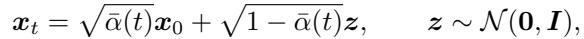

*Eq. (22): 前向扩散 $x_t=\sqrt{\bar\alpha(t)}x_0+\sqrt{1-\bar\alpha(t)}z$。*

$p({\pmb x}_0 | {\pmb x}_t)$ has the unique posterior mean at

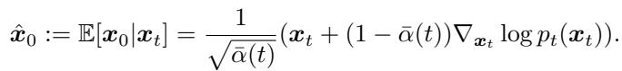

*Eq. (23): 后验均值（Tweedie）$\hat{x}_0=\mathbb{E}[x_0|x_t]$。*

In our case, Proposition 1 holds for both the reverse conditional probability $p({\pmb x}_0 | {\pmb x}_t)$ as well as $p({\pmb k}_0 | {\pmb k}_t)$, as they are both constructed from DDPM. Given the posterior mean $\hat{\pmb x}_0, \hat{\pmb k}_0$ that can be computed efficiently (i.e. via one forward pass through the neural network) during the intermediate steps, our proposal is to find a tractable approximation for $p({\pmb y} | {\pmb x}_t, {\pmb k}_t)$. Specifically, we propose the following approximation

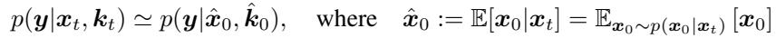

*Eq. (24): 近似 $p(y|x_t,k_t)\simeq p(y|\hat{x}_0,\hat{k}_0)$。*

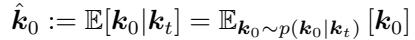

*Eq. (25): 核的后验均值 $\hat{k}_0=\mathbb{E}[k_0|k_t]$。*

Now, to quantify the approximation error induced by eq. (24),(25), the following definition is useful.

**Definition 1 (Jensen gap [20, 51]).** Let $x$ be a random variable with distribution $p({\pmb x})$. For some function $f$ that may or may not be convex, the Jensen gap is defined as

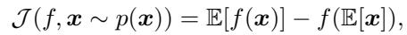

*Eq. (26): Jensen gap $\mathcal{I}=\mathbb{E}[f(x)]-f(\mathbb{E}[x])$。*

where the expectation is taken over $p({\pmb x})$

Using the Jensen gap defined in Definition 1, we attempt to achieve a meaningful upper bound on the gap. First, we have the following

**Proposition 2 (Jensen gap upper bound [20]).** Define the absolute cenetered moment as $m_p := \sqrt{\mathbb{E}[|X - \mu|^p]}$, and the mean as $\mu = \mathbb{E}[X]$. Assume that for $\alpha \gt 0$, there exists a positive number $K$ such that for any $x \in \mathbb{R}, |f(x) - f(\mu)| \leq K|x - \mu|^\alpha$. Then,

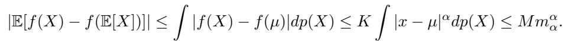

*Eq. (27): Jensen gap 的矩上界。*

The following lemmas from [12] are also useful.

**Lemma 1.** Let $\phi(\cdot)$ be a univariate Gaussian density function with mean $\mu$ and variance $\sigma^2$. There exists a constant $L$ such that $\forall x, y \in \mathbb{R}$

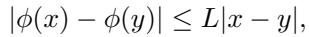

*Eq. (28): 一维高斯密度的 Lipschitz 界。*

where $L = \frac{1}{\sqrt{2\pi\sigma^2}}\exp(-\frac{1}{2\sigma^2})$.

**Lemma 2.** Let $\phi(\cdot)$ be an isotropic multivariate Gaussian density function with mean $\pmb{\mu}$ and variance $\sigma^2 I$. There exists a constant $L$ such that $\forall x, {\pmb y} \in \mathbb{R}^d$

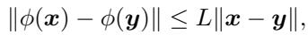

*Eq. (29): 多维各向同性高斯密度的 Lipschitz 界。*

where $L = \frac{d}{\sqrt{2\pi\sigma^2}}e^{-1/2\sigma^2}$

**Theorem 1.** Under the same conditions in [12], we have

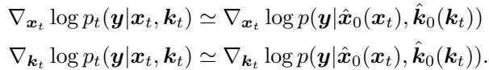

*Theorem 1（重述）：联合似然梯度近似。*

**Proof.** The proof of the theorem is inspired by and builds upon [12]. We first note that ${\pmb x}_t, {\pmb k}_t \forall t \in [0, 1]$ are independent (See Fig. A.1). Further, ${\pmb y}$ and ${\pmb x}_t$ are conditionally independent on ${\pmb x}_0$; $y$ and ${\pmb k}_t$ are conditionally independent on ${\pmb k}_0$. Then, we have the following factorization

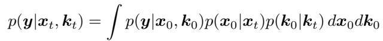

*Eq. (30): 似然按 $x_0,k_0$ 边缘化的因子分解。*

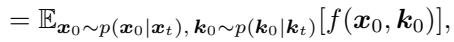

*Eq. (31): 写成对 $x_0,k_0$ 后验的期望 $\mathbb{E}[f(x_0,k_0)]$。*

where $f({\pmb x}_0, {\pmb k}_0) = h({\pmb k}_0 * {\pmb x}_0)$, with $h(\mu)$ denoting the density function of an isotropic multivariate Gaussian density function with mean $\mu$, and variance $\sigma^2 I$. Our proposal is to use the Jensen approximation

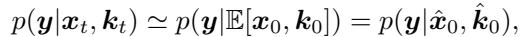

*Eq. (32): Jensen 近似 $p(y|x_t,k_t)\simeq p(y|\hat{x}_0,\hat{k}_0)$。*

where the last equality comes from the independency of ${\pmb x}_0$ and ${\pmb k}_0$. Now we derive the closed-form upper bound of the Jensen gap. For simplicity in exposition, let us define ${\pmb K}_0 {\pmb x}_0 \equiv {\pmb k}_0 * {\pmb x}_0, {\pmb X}_0 {\pmb k}_0 \equiv$ , where $K_0, X_0$ are block Hankel matrices that represent the convolution operation in matrix multiplication. Further, we denote $\|\bar{K}_0\| := \mathbb{E}_{k_0 \sim p(k_0 | k_t)}[\|K_0\|]$. Our Jensen gap reads

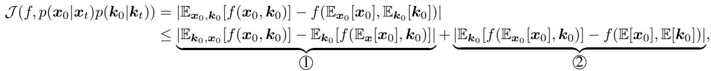

*Eq. (33)(34): 把联合 Jensen gap 拆成两项 ① + ②（先固定 $k_0$ 对 $x_0$ 展开，再对 $k_0$ 展开）。*

with

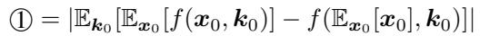

*Eq. (35): 第 ① 项定义。*

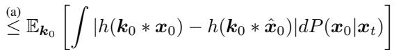

*Eq. (36): 步骤 (a)，用 Proposition 2。*

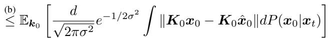

*Eq. (37): 步骤 (b)，用 Lemma 2。*

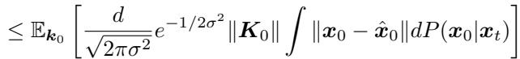

*Eq. (38): 提出卷积算子范数 $\|K_0\|$。*

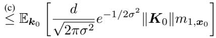

*Eq. (39): 步骤 (c)，代入一阶矩 $m_{1,x_0}$。*

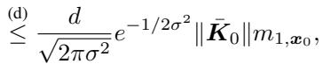

*Eq. (40): 步骤 (d)，第 ① 项最终界。*

where (a) is from Proposition. 2, (b) is from Lemma. 2, and (c-d) are from the definitions. Moreover,

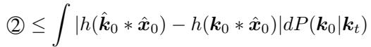

*Eq. (41): 第 ② 项，对称地对 $k_0$ 展开。*

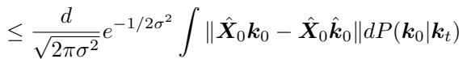

*Eq. (42): 用 Lemma 2。*

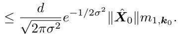

*Eq. (43): 第 ② 项最终界（含 $\|\hat{X}_0\|m_{1,k_0}$）。*

Hence

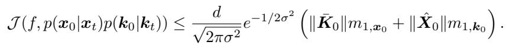

*Eq. (44): 联合 Jensen gap 总上界。*

where

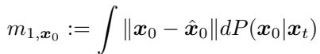

*Eq. (45): 图像一阶矩 $m_{1,x_0}$。*

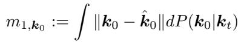

*Eq. (46): 核一阶矩 $m_{1,k_0}$。*

We have derived that the approximation (32) has the Jensen gap upper bounded by (44). Finally, taking the derivative of the log to (32), we have that

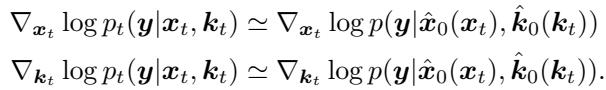

*Theorem 1 结论：对 log 求导得联合似然梯度近似。*

Note that the approximation error from the Jensen gap approaches to zero as the noise level $\sigma$ increase sufficiently. □

> 💡 **公式批读：Jensen gap 上界拆解（Hao 批注，最重要的附录）**: 这段证明是本文对"联合近似有多准"的唯一定量刻画，直接关系我们对"联合后验偏差"的判断：
> - **总界（Eq.44）**：$\mathcal{I}\le \frac{d}{\sqrt{2\pi\sigma^2}}e^{-1/2\sigma^2}(\|\bar K_0\|m_{1,x_0}+\|\hat X_0\|m_{1,k_0})$。两项分别对应"图像去噪不确定性 $m_{1,x_0}$ 经核算子放大"和"核去噪不确定性 $m_{1,k_0}$ 经图像算子放大"。
> - **关键含义 ①（交叉污染）**：图像项前乘了核的算子范数 $\|\bar K_0\|$，核项前乘了图像算子范数 $\|\hat X_0\|$——**一个分量的估计误差会被另一个分量放大**。这是"两条链只靠似然耦合"的代价，也是联合样本比非盲更不稳/更易偏的理论根源。
> - **关键含义 ②（σ 悖论）**：作者强调 gap 随 $\sigma$ 增大趋 0。但这是因为大 $\sigma$ 把高斯似然 $h$ 拉平（$L=\frac{d}{\sqrt{2\pi\sigma^2}}e^{-1/2\sigma^2}$ 减小），**似然几乎不提供信息**——近似"准"是因为引导变弱了，而非估计变好。反过来，小 $\sigma$（强似然、信息量大）时 gap 最大。**这正是我们要指出的：BlindDPS 的近似在最需要精确引导的低噪声区最不可靠**，而它从不量化由此产生的后验 miscalibration。
> - **对校准的意义**：Jensen gap ≠ 0 意味着采样得到的联合分布**系统性偏离**真后验 $p(x_0,k_0|y)$。这是 SBC 会检出偏差的理论预期。


*Figure A.1. Probabilistic graph of BlindDPS for blind deblurring.*

> 💡 **Figure A.1 批读（Hao 批注）**: 盲去模糊的概率图模型。它图示了证明所依赖的独立/条件独立结构：$x_t\perp k_t$（两条扩散链独立），$y$ 在 $x_0$ 给定下与 $x_t$ 条件独立、在 $k_0$ 给定下与 $k_t$ 条件独立。**这张图就是 Eq.(16) 独立假设和 Theorem 1 因子分解的图形化**。我们批判联合后验偏差时，可以直接指着这张图说：图像先验节点与核先验节点之间**没有边**（只有共同的子节点 $y$ 把它们 collider 式地耦合），因此后验相关性只能靠似然的一阶梯度近似传递。

## B. BlindDPS

### B.1. Imaging through turbulence

In terms of inverse problem solving, the tilt-blur model is often used [6, 7, 50], as the model is simple but fairly accurate. Specifically, we have

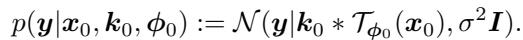

*Eq. (47): 湍流概率前向 $p(y|x_0,k_0,\phi_0)=\mathcal{N}(y|k_0*\mathcal{T}_{\phi_0}(x_0),\sigma^2 I)$。*

For details in the forward model that is used for our experiments, see Supplementary Section E. Note that the three factors are all independent, i.e.

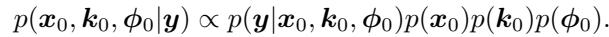

*三分量联合后验分解 $p(x_0,k_0,\phi_0|y)\propto p(y|\cdots)p(x_0)p(k_0)p(\phi_0)$。*

Then, from Remark 1, we can again construct a system of reverse SDEs (See Fig. B.1) analogous to the blind deblurring case ((17),(18)):


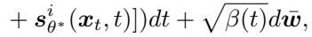

*Eq. (48): 图像分支反向 SDE（似然含 $\hat{x}_0,\hat{k}_0,\hat{\phi}_0$）。*


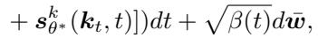

*Eq. (49): 核分支反向 SDE。*

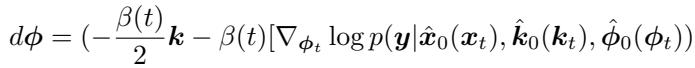

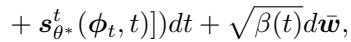

*Eq. (50): tilt 场分支反向 SDE（score $s_{\theta^*}^t$）。*

where $s_{\theta^*}^t$ is the score function trained to model the distribution of the tilt maps. Then, we can construct a similar method as shown in Algorithm 2 based on ancestral sampling analogous to Algorithm 1. Note that for solving imaging through turbulence, we do not use the $\ell_0$ sparsity prior.


*Figure B.1. Probabilistic graph of BlindDPS for imaging through turbulence.*

> 💡 **B.1 机制拆解（Hao 批注）**: 这是"通用性"的落地——把 2 分量扩到 3 分量（图像 $x$ + 核 $k$ + tilt 场 $\phi$），每个分量一条独立反向 SDE、一个 score，仅通过共同残差 $\|y-\hat{k}_0*\mathcal{T}_{\hat\phi_0}(\hat{x}_0)\|$ 耦合。Fig. B.1 概率图比 A.1 多一个孤立的 $\phi$ 分支。**注意湍流不用 $\ell_0$ 稀疏**（tilt 场不稀疏）。**批判**：三分量意味着 Jensen gap 里现在有三个交叉污染项，联合后验更难校准；也解释了 Limitation 说的"tilt 常估错"——tilt 场 256×256 维、先验最弱、误差被另两个算子放大。

**Algorithm 2  BlindDPS — Imaging through turbulence**

```
Require: N, y, α, {σ̃_i}_{i=1}^N
 1: x_N, k_N, φ_N ~ N(0, I)
 2: for i = N−1 to 0 do
 3:     ŝ^i ← s^i_{θ*}(x_i, i)
 4:     ŝ^k ← s^k_{θ*}(k_i, i)
 5:     ŝ^t ← s^t_{θ*}(φ_i, i)
 6:     x̂_0 ← (1/√ᾱ_i)(x_i + √(1−ᾱ_i) ŝ^i)
 7:     k̂_0 ← (1/√ᾱ_i)(k_i + √(1−ᾱ_i) ŝ^k)
 8:     k̂_0 ← P_C(k̂_0)
 9:     φ̂_0 ← (1/√ᾱ_i)(φ_i + √(1−ᾱ_i) ŝ^t)
10:     z_i, z_k, z_t ~ N(0, I)
11:     x'_{i−1} ← [√α_i(1−ᾱ_{i−1})/(1−ᾱ_i)] x_i + [√ᾱ_{i−1}β_i/(1−ᾱ_i)] x̂_0 + σ̃_i z_i
12:     k'_{i−1} ← [√α_i(1−ᾱ_{i−1})/(1−ᾱ_i)] k_i + [√ᾱ_{i−1}β_i/(1−ᾱ_i)] k̂_0 + σ̃_i z_k
13:     φ'_{i−1} ← [√α_i(1−ᾱ_{i−1})/(1−ᾱ_i)] φ_i + [√ᾱ_{i−1}β_i/(1−ᾱ_i)] φ̂_0 + σ̃_i z_t
14:     x_{i−1} ← x'_{i−1} − α ∇_{x_i} ‖y − k̂_0 * T_{φ_0}(x̂_0)‖_2
15:     k_{i−1} ← k'_{i−1} − α ∇_{k_i} ‖y − k̂_0 * T_{φ_0}(x̂_0)‖_2
16:     φ_{i−1} ← φ'_{i−1} − α ∇_{φ_i} ‖y − k̂_0 * T_{φ_0}(x̂_0)‖_2
17: end for
18: return x_0, k_0, φ_0
```

> 💡 **Algorithm 2 批读（Hao 批注）**: 与 Algorithm 1 结构完全一致，只是多了 tilt 分支（行 5/9/13/16），三个分支共享同一个残差 $\|y-\hat{k}_0*\mathcal{T}_{\hat\phi_0}(\hat{x}_0)\|$。三分支各减 $\alpha\nabla(\text{同一残差})$。**注意此处三分支都不加稀疏正则**（对比 Algorithm 1 核支有 $\lambda R_k$）。这清楚展示了本文"每分量一条链"的可组合性，同时也把"score 数随分量线性增长、推理线性变慢"（Limitation）写在了脸上。

## C. Detailed Ablation Studies

### C.1. Diffusion prior for the forward model

Let us revisit the Bayes' rule in the context of diffusion models for posterior sampling in blind deconvlution:

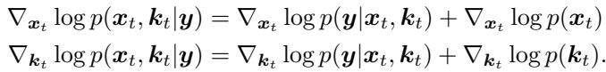

*联合贝叶斯（重述），图像与核各自 = 似然 score + 先验 score。*

We consider the case where we construct the diffusion prior for the image $x$, but not for the kernel $k$. In fact, this setting is similar to the concurrent work of Levac et al. [34], where the authors propose to use a score function only for the image, and not for the parameters for the motion artifact generating forward model. Note that the blind forward model setting here is considerably simpler than our method, since the parameter $\kappa$ to be estimated is a scalar. In this regard, the authors propose to use a uniform prior for the unknown parameter $\kappa$, which makes the gradient of the prior to be simply 0, i.e. $\nabla_{\kappa_t}\log p(\kappa_t) = 0$. If we apply such uniform prior to our setting, our discretized update rule reads

**Algorithm 3  Diffusion Posterior Sampling — Uniform prior**

```
Require: N, y, α_x, α_k, {σ̃_i}_{i=1}^N, λ, σ_init
 1: x_N ~ N(0, I)
 2: k_N ~ GaussianKernel(σ_init)
 3: for i = N−1 to 0 do
 4:     ŝ^i ← s^i_{θ*}(x_i, i)
 5:     x̂_0 ← (1/√ᾱ_i)(x_i + √(1−ᾱ_i) ŝ^i)
 6:     k_i ← P_C(k_i)
 7:     z_i ~ N(0, I)
 8:     x'_{i−1} ← [√α_i(1−ᾱ_{i−1})/(1−ᾱ_i)] x_i + [√ᾱ_{i−1}β_i/(1−ᾱ_i)] x̂_0 + σ̃_i z_i
 9:     x_{i−1} ← x'_{i−1} − α_x ∇_{x_i} ‖y − k_i * x̂_0‖_2
10:     L_k ← ‖y − k_i * x̂_0‖_2 + λ ℓ_0(k_i)
11:     k_{i−1} ← k_i − α_k ∇_{k_i} L_k
12: end for
13: return x_0, k_0
```

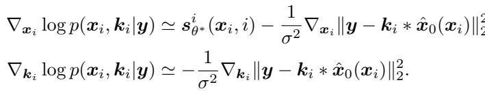

*uniform 先验下的更新规则（核只靠似然梯度，先验梯度为 0）。*

Additionally, similar to BlindDPS, one can further augment sparsity to the kernel estimation by using e.g. $\ell_0$ regularization. Combined with the ancestral sampling steps, we arrive at Algorithm 3. Note that we chose Gaussian kernel as an initialization, but other choices are also feasible. The main difference between BlindDPS (Algorithm 1) and Algorithm 3 comes from the the complexity of the priors used. In order to quantify the performance gap, we chose 100 images from the FFHQ validation set, and compared the result of Algorithm 3 against BlindDPS. We performed grid search to find the optimal parameters $\alpha_x, \alpha_k, \lambda$, which were set to $\alpha_x = 0.3, \alpha_k = 0.3$, and $\lambda = 5.0$

Representative results can be seen in Fig. 6, and quantitative results can be found in Table C.1. Clearly, uniform prior far underperforms against the diffusion prior proposed in this work. We can conclude that while simple priors such as uniform prior may be a feasible option for scalar parameters, as the one in [34], much care should be taken when applied to higher dimensional parameters such as blind deconvolution.

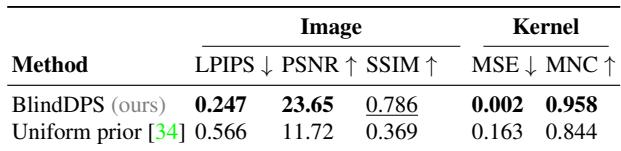

*Table C.1. Ablation study: uniform prior vs. diffusion prior (BlindDPS).*

> 💡 **C.1 批读：对我们课题最直接相关的一段（Hao 批注）**: 这段把"算子需不需要扩散先验"讲透了，而且**边界条件正好圈定我们的空间**：
> - **对手 = Levac et al. [34]**（并行工作）：只给图像建 score、算子参数用 **uniform 先验**（$\nabla\log p=0$，即纯似然梯度下降）。**关键差异**：[34] 的参数 $\kappa$ 是**标量**，uniform 就够。
> - **本文的论证**：把 uniform 先验套到**高维核**（64×64）上就崩（Fig.6b、Table C.1：核 MNC 0.844 vs 扩散 0.958，图像 LPIPS 0.566 vs 0.247，PSNR 11.72 vs 23.65）。
> - **作者亲口结论**："uniform 先验对**标量参数**可行，但高维参数需谨慎。"
> - **对我们的推论**：我们的算子参数 $\varphi$（模糊长度、角度、$\sigma$——几个标量）恰好落在 [34] 那种"简单先验够用"的区间。**因此我们无需 BlindDPS 那套昂贵的核扩散先验**，可以用轻量、可解析、可校准的低维先验，直接绕开本文最重、最不 scalable 的部分。这是"低维参数化"路线相对 BlindDPS 的结构性优势，且本文自己的消融就是最佳佐证。
> - **注意公平性**：uniform baseline 做了 $\alpha_x,\alpha_k,\lambda$ 网格搜索才对比，说明差距不是调参问题，是先验能力问题。

### C.2. Effect of sparsity regularization

To check the effect of sparsity regularization in (20), we perform an ablation study by varying $\lambda$ from 0.0 to 5.0. Specifically, we use $l_1$ sparsity regularization with different $\lambda$ for 100 blurred images taken from validation set for FFHQ, with forward model and blur kernels adjusted to be identical to those of the main experiment (section E).

> 💡 **C.2 批读（Hao 批注）**: 是正文 Table 4 的实验协议补充（100 张 FFHQ、$\ell_1$、$\lambda\in[0,5]$）。结论同 Table 4——$\lambda\ge 0.1$ 后不敏感。呼应 3.2 批注：扩散核先验仍需手工稀疏补丁才最优，说明"高维核扩散先验"并未完全学到稀疏结构。

### C.3. Progress of estimation

As discussed in section 3 of main text, the proposed method admits a natural Gaussian scale-space evolution of estimation, when visualized in the denoised representations $\hat{\pmb x}_0, \hat{\pmb k}_0$. To quantify the trend in which the estimates evolve, we measure the MSE against the ground truth image and the kernel, and average the trend over 100 of the test data. We summarize the result in Fig. C.1a, C.1b. Here, we see that the MSE value drops to the minimum value at about 400/1000, 200/1000 iterations, which is relatively early in the whole reverse diffusion process. For the rest of the steps (especially for the images), the remaining high frequency details are in-filled, boosting the perceptual quality.

<table><tr><td width="50%"></td>
<td width="50%"></td></tr>
<tr><td align="center"><i>Figure C.1a: Progress of x̂_0(x_t)</i></td><td align="center"><i>Figure C.1b: Progress of k̂_0(k_t)</i></td></tr></table>

*Figure C.1. Progress of estimation error averaged over 100 test set in blind deconvolution. Blue line: mean value, shaded area: ±1σ. Measured with MSE against the ground truth.*

> 💡 **Figure C.1 批读：参数与细节的时间分离（Hao 批注）**: 两条 MSE-vs-步数曲线（图像 / 核），阴影是 ±1σ（100 张平均）。核心读数：
> - **核在 ~200/1000 步、图像在 ~400/1000 步**就到 MSE 最低——**参数（核）比图像先收敛**，且都在反向扩散前半程就基本定型。
> - 之后的步数主要在**补图像高频细节**（提升感知质量），对 MSE 帮助不大甚至略升（生成细节 ≠ 逐像素对，呼应 PSNR tradeoff）。
> - **对我们的价值**：① 阴影 ±1σ 是全文**唯一**接近"后验宽度"的可视化，但它是"跨 100 个不同真值的估计误差散布"，**不是单个观测下的后验散布**——两者常被混淆，我们做 coverage 时必须区分。② "核早收敛、图像后补细节"提示：若要做联合后验采样加速，核/参数分支可以早停；也提示 gauge（尺度）在早期就被投影固定。
> - **批判**：作者用这张图佐证"coarse-to-fine 平滑演化"，但它其实也暴露——真正的不确定性量化缺失，只有误差均值曲线。

## D. Extended Related Works

In this section, we discuss related works categorized into two applications that we tackle - blind deblurring, and imaging through turbulence.

### D.1. Blind deblurring

We first review the optimization-based (model-based) methods that were extensively studied. The seminal work of Chan et al. [8] introduced the total variation (TV) prior, which enhances the gradient sparsity of both the image and the kernel. The scheme has been developed and re-invented over the years [35], yielding better practices to obtain stable results [46]. To promote sparsity of both the image and the kernel, regularizations based on $\ell_0$ penalty [42], $\ell_p, 0 \lt p \lt 1$ penalty [64] based on the generalized iterative shrinkage algorithm (GISA) [63], $\ell_1, \ell_2$ [31] were proposed. Later on, it was shown that non-blurry natural images have sparse "dark channel" [44], where the dark channel is computed as the union of minimum values in patch occurrences. Promoting sparsity of the dark channel [45] has shown to be an effective method for performing blind deconvolution. When the regularization functions are chosen, one typically performs alternating optimization strategies [5] to solve the problem. It should be noted that it is often the case where the optimization strategy is nontrivial, and involves many tricks such as multi-scale optimization [43], and painful parameter tuning for specific input images. Wrong choice of parameter/optimization strategy typically results in heavily compromised performance.

> 💡 **D.1 批读（Hao 批注）**: 传统盲去卷积先验谱系——TV [8] → $\ell_0$/$\ell_p$/$\ell_1$ 稀疏 [42,64,31] → dark channel [45]。核心痛点重复正文：需 alternating optimization + multi-scale + 逐图调参，选错就崩。**这正是 BlindDPS 想用"扩散先验 + 反向扩散连续 coarse-to-fine"取代的对象**。注意 Pan-$\ell_0$[42]、Pan-DCP[45] 是实验主要对手。

In recent years, deep learning (DL) based methods have been largely developed. One can categorize DL methods into 1) explicit kernel estimation methods, where the network is designed to both deblur the image, and to estimate the exact kernel; 2) amortized inference, where the estimation of kernel does not take place. For the first type of methods, convolutional neural networks (CNN) were adopted for seperate modules, estimating the kernel and the deblurred image, respectively [49, 54, 59]. Advancing the conventional model-based priors, discriminative priors [36] and deep image priors (DIP) [48] were proposed, showing improved performance. While deep priors typically improves the performance, one should note that they are also often unstable, leading to undesirable solutions: both adversarial training and jointly training two deep image priors are hard to handle.

More recently, learning the inverse mapping without explicitly estimating the kernel has gained popularity. For these methods, neural network is trained through supervised learning with paired clean and blurry images. Especially, DeblurGAN [32] used the perceptual loss that helps to maintain contents and adversarial loss that minimizes the Wasserstein distance between the clean images and reconstructed images. DeblurGAN-v2 [33] focused on handling multi-scale features to solve the blind deblurring problem. They adopted Feature Pyramide Network (FPN) and proposed double-scale discriminators, where each discriminator measures the Wasserstein distance between clean images and reconstructed images at global and local patch level, respectively. Meanwhile, MPRNet [61] adopted a multi-stage learning method that decomposes the given problem into sub-problems and solves each one through a lightweight sub-network including a supervised attention module that gives weight to local features. As a result, blurry images are progressively restored. On the other hand, transformer based methods has been proposed and shown notable performance on deblurring task. Specifically, IPT [9] pretrained transformer on multiple image processing tasks and fine-tune the transformer on each tasks, Uformer [57] proposed LeWin transformer block for locally-enhanced self attention and multi-scale modulator, and Restormer [60] proposed two specialized transformer modules called MDTA and GDFN with progressive training scheme that enhances the image restoration performance on different spatial resolutions. While often achieving stateof-the-art performance, these methods tend to compromise flexibility, modularity, and generalization capacity. For instance, the model cannot handle degradations that deviate from the traning data.

> 💡 **D.1 批读（DL 法，Hao 批注）**: 把 DL 去模糊分两类：**① 显式估核**（CNN [49,54,59]、DIP [48]=SelfDeblur——但不稳、两个 DIP 联合训难调）；**② amortized inference 不估核**（DeblurGAN/v2 [32,33]、MPRNet [61]、Transformer 系 IPT/Uformer/Restormer）。最后一句是 BlindDPS 对监督法的核心批评——**牺牲灵活性/模块化/泛化，无法处理偏离训练分布的退化**。这正是本文"unsupervised + 已知函数形式 → 可泛化"的对立面。实验里 MPRNet/DeblurGANv2 是监督对手，SelfDeblur[48] 是 DIP 对手。

### D.2. Imaging through turbulence

Although the correct estimation model for imaging through turbulence is tilt-then-blur [7], for inverse problem solving, the blur-then-tilt model is more often used. This is mainly due to the ease of applying off-the-shelf blind deblurring methods once the tilt is mitigated through, e.g. optical flow [38]. While in our work, we only consider single frame turbulence mitigation for simplicity, it is usually the case where we have multiple temporal frames that are degraded by random phase distortions. Hence, removing the tilt proceeds by e.g. temporal averaging [62], variational model [58], frame selection [1], etc. Moreover, when dealing with sequence of images, the "Lucky image fusion" step is often performed to find the reference image with the least amount of phase distortion. For details in such step, see, e.g. [19]. Once the distortion (tilt) is mitigated, the deblurring step is often performed with off-the-shelf algorithms [1,58,62]. However, as most off-the-shelf deblurring algorithms do not take into account the kernel priors specifically for turbulence, a more specified algorithm leveraging basis expansion [40] was proposed.

Similar to deblurring methods, various DL based methods have been proposed. Utilizing CNN to estimate the phase distortion map [39] was proposed. Moreover, supervised learning based on pairs of simulated atmospheric turbulence images have been proposed over the years. Transfer learning approach from pre-trained deblurring network was proposed [21]. Variants of generative adversarial network (GAN) based methods were also proposed [26, 47], leveraging the adversarial learning scheme to enhance the visual quality of the reconstructions. Recently, a method that uses physics-driven transformer architecture dubbed TurbNet [41] was proposed. To the best of our knowledge, none of the methods in the literature considered using unsupervised reconstruction scheme by utilizing the generative prior, as in our method. Although our method is developed upon a rather simplified forward model of imaging through turbulence, we believe our work establishes a proof of concept, and opens up a new are regarding turbulence reconstruction.

> 💡 **D.2 批读（Hao 批注）**: 湍流成像背景。物理上正确模型是 **tilt-then-blur [7]**，但求解常用 blur-then-tilt（便于套现成去模糊）。本文只做**单帧**（多帧会用 temporal averaging / lucky fusion）。DL 法多为监督/GAN（TSR-WGAN[26] 是实验对手）。**本文的新颖点**——首个用**无监督生成先验**做湍流重建，虽用简化前向、但作为 proof of concept。**批判**：单帧 + 简化 tilt-blur 模型限制了实用性，Limitation 也承认 tilt 常估错；对我们而言，湍流是"高维算子参数最难校准"的极端案例。

## E. Inverse problem setting

In this section, we briefly summarize how our forward model is constructed.

### E.1. Blind deblurring

The forward model is given as

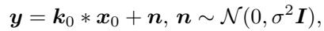

*Eq. (51): $y=k_0*x_0+n,\ n\sim\mathcal{N}(0,\sigma^2 I)$。*

where $\sigma = 0.02$ is set as the measurement noise level. The size of the kernel is set to 64 × 64. For motion blur kernels, we use the random kernel generator with intensity value set to 0.5.

### E.2. Imaging through turbulence

The forward model is given as

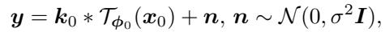

*Eq. (52): $y=k_0*\mathcal{T}_{\phi_0}(x_0)+n$。*

where $\phi$ is the tilt vector field that has identical size of the given image (i.e. in our case 256×256). Specifically, the tilt vector field is generated with the algorithm proposed in [6]. The parameters are set to $M = 500, N = 32, \sigma = 1.0$ with all the other parameters set same to the baseline. The blur kernel ${\pmb k}_0$ is taken to be isotropic Gaussian kernel with standard deviation of 0.4 (FFHQ), and 0.2 (ImageNet). The proposed algorithm for solving imaging through turbulence is presented in Algorithm. 2.

> 💡 **E 批读：复现关键（Hao 批注）**: 观测噪声 $\sigma=0.02$、核 64×64、motion intensity 0.5。湍流 tilt 场和图像同尺寸 256×256（**高维**，先验难学），用 [6] 生成。这些数字是我们若要复现/对比 BlindDPS 的必需项。注意去模糊与湍流的 PSF/tilt 参数逐数据集不同。

## F. Experimental Details

### F.1. Training

We take pre-trained score function for the FFHQ dataset, and the ImageNet dataset, following the settings of [12]. When training the score function for kernels, we create a database of that consists of 60k 64 × 64 kernels. Among them, 50k motion blur kernels were generated by sampling the intensity value I ∼ Unif(0.2, 1.0). The other 10k Gaussian blur kernels were generated with random standard deviation σ ∼ Unif(0.1, 5.0).

For training the score function for kernel / tilt-map, we use the U-Net architecture from guided-diffusion, and train the models using base configurations. The models were trained with a single RTX 3090 GPU for 3.0M / 1.5M steps, which took about one day / two days, respectively.

> 💡 **F.1 批读（Hao 批注）**: 核 score 训练数据构成——**50k motion（intensity Unif(0.2,1.0)）+ 10k Gaussian（std Unif(0.1,5.0)）= 60k**。核/tilt score 用 guided-diffusion 的 U-Net，单卡 3090 训 1~2 天。图像 score 直接借用预训练。**对我们**：这说明"给算子建扩散先验"的成本主要在合成大量算子样本 + 训一个专用扩散模型；我们低维 $\varphi$ 可用极少参数的先验（甚至解析先验）替代，成本几乎为零。

### F.2. Compute time

As stated in the limitations, the number of score functions that are used at inference time scales linearly with the number of components involved in the forward model. For blind deblurring, two neural networks are used (image, kernel), and for imaging through turbulence, three neural networks are used (image, kernel, tilt map). In order to quantify additional compute cost in each of the situation, we measure the wall-clock time to reconstruct a single image with a single RTX 2080ti GPU. DPS [12]: 132.39 sec. BlindDPS—Blind deblurring(2 score functions): 180.22 sec. BlindDPS—Imaging through turbulence(3 score functions): 220.76 sec.

> 💡 **F.2 批读：推理成本（Hao 批注）**: 关键数字——DPS(1网) 132s → BlindDPS 去模糊(2网) 180s → 湍流(3网) 221s，单张 2080ti。**每加一个分量 ~+40~50s**，验证"score 数线性增长 → 推理线性变慢"。这是本文架构对高维/多分量的 scalability 硬伤。**对我们**：低维参数不需要额外的大扩散网络，联合后验采样的额外开销可控——又一个低维路线的优势。

### F.3. Comparison methods

**Pan-DCP [45].** The method utilizes the dark channel prior as the regularization function for images. We use the official implementation, with the parameters advised for facial blur images. Optimization is performed in a coarse-to-fine strategy in 8 different stages. Parameters: $\lambda_{\text{dark}} = 4e{-}3$, $\lambda_{\text{grad}} = 4e{-}3$, $\lambda_{\text{tv}} = 1e{-}3$, $\lambda_{\text{l0}} = 5e{-}4$.

**Pan-$\ell_0$ [42].** The method regularizes $\ell_0$ regularization for both the image and the kernel. We use the official implementation. Optimization and post-processing is performed similar to Pan-DCP. Parameters: $\lambda_{\text{grad}} = 4e{-}3$, $\lambda_{\text{tv}} = 1e{-}3$, $\lambda_{\text{l0}} = 2e{-}3$.

**SelfDeblur [48].** We use the default setting of YCbCr deblurring that selfdeblur uses, with static learning rate of 0.01 for 2500 steps. Optimization is performed by minimizing the MSE for the first 500 steps, and then switching the loss to $1 - SSIM(\cdot, \cdot)$.

**MPRNet [61].** We use the official implementation, with the parameters, learning rate decay and neural network architectures advised for the deblurring task. For both FFHQ and AFHQ, we train the model for 30k iterations with a batch size of 3. For a fair comparison with the proposed method, half of the input image consists of gaussian blurred images and the other half image consists of motion blurred image.

**DeblurGANv2 [33].** We use the official implementation, by following the default settings for parameters, data augmentation strategies and neural network architectures. Specifically, we train the model by minimizing sum of pixel distance loss, WGAN-gp adversarial loss and perceptual loss with weight parameters: $\lambda_{\text{pixel}} = 5e{-}1$, $\lambda_{\text{adv}} = 6e{-}3$, $\lambda_{\text{perceptual}} = 1e{-}2$. Inception-ResNet-v2 is used as backbone of the generator. For both FFHQ and AFHQ, we train the model for 1.5 million iterations with a batch size of 1 and input image contains half Gaussian blurred images and the other half motion blurred images for fair comparison with the proposed method.

**ILVR [10].** We choose the following hyper-paremters: down-scaling factor of 16, 1000 sampling steps, with the latent guidance applied for 1000-100 sampling steps. We use the same score functions that were used for BlindDPS.

**TSR-WGAN [26].** The original work considers spatiotemporal 3D data, whereas our inverse problem setting considers single frame imaging through turbulence. Hence, we design a U-Net like network architecture that consists of 2D convolutions rather than leveraging 3D convolutions. Other training configurations follow the default setting of [26].

Note that for methods that are capable of estimating the kernel simultaneously (i.e. Pan-DCP, Pan-$\ell_0$, SelfDeblur), only odd-sized kernels can be estimated, whereas our ground truth kernels are even-sized. To match the discrepancy, we estimate 65×65 sized kernel first, and then cut the redundant row/column as the post-processing step. In practice, such discrepancy only affects the result marginally.

> 💡 **F.3 批读（Hao 批注）**: 对比方法配置。要点：(1) 监督法 MPRNet/DeblurGANv2 训练时**一半 motion 一半 Gaussian**，力求公平；(2) 传统法（Pan-DCP/Pan-$\ell_0$）用 8 级 coarse-to-fine + 官方推荐参数；(3) ILVR 复用 BlindDPS 的 score，作为扩散基线；(4) 奇偶核尺寸不匹配的处理（估 65×65 再裁）。**批判视角**：这些 baseline 都给了较认真的配置，说明 BlindDPS 的领先不是对手没调好；但注意所有对比都在**合成、已知函数形式**的设定下，真实盲场景的表现是开放问题。

### F.4. Data and Code availability

Our open source implementation will be made public upon publication.

## G. Further Experiments

Further experimental results on blind deblurring are shown in Fig. G.1, G.2, G.3, G.4. Further experimental results on imaging through turbulence are shown in Fig. G.5, G.6.


*Figure G.1. Blind motion deblurring results on the FFHQ 256 × 256 dataset. (a) Measurement, (b) Pan-DCP [45], (c) MPRNet [61], (d) SelfDeblur [48], (e) BlindDPS (ours), (f) Ground truth.*


*Figure G.2. Blind motion deblurring results on the AFHQ 256 × 256 dataset. (a) Measurement, (b) Pan-DCP [45], (c) MPRNet [61], (d) SelfDeblur [48], (e) BlindDPS (ours), (f) Ground truth.*


*Figure G.3. Blind Gaussian deblurring results on the FFHQ 256 × 256 dataset. (a) Measurement, (b) Pan-DCP [45], (c) MPRNet [61], (d) SelfDeblur [48], (e) BlindDPS (ours), (f) Ground truth.*


*Figure G.4. Blind Gaussian deblurring results on the AFHQ 256 × 256 dataset. (a) Measurement, (b) Pan-DCP [45], (c) MPRNet [61], (d) SelfDeblur [48], (e) BlindDPS (ours), (f) Ground truth.*


*Figure G.5. Imaging through turbulence results on the FFHQ 256 × 256 dataset. (a) Measurement, (b) ILVR [10], (c) MPRNet [61], (d) TSR-WGAN [26], (e) BlindDPS (ours), (f) Ground truth.*


*Figure G.6. Imaging through turbulence results on the ImageNet 256 × 256 dataset. (a) Measurement, (b) ILVR [10], (c) MPRNet [61], (d) TSR-WGAN [26], (e) BlindDPS (ours), (f) Ground truth.*

> 💡 **G 批读（Hao 批注）**: 更多定性结果（去模糊 G.1-G.4、湍流 G.5-G.6），均为成功案例，趋势与正文 Fig.4/5 一致——BlindDPS 列 (e) 最接近真值 (f)、核估计准。**批判**：仍是精选成功案例，无失败/发散案例、无后验多样性展示。要评估 BlindDPS 作为"后验采样器"的真实可信度，这些定性图远不够——必须补 coverage/SBC，这正是我们课题相对它的增量。

> 💡 **附录小结（Hao 批注）**:
> - **A**：Theorem 1 的 Jensen gap 上界 = 联合近似偏差的理论刻画（交叉污染 + σ 悖论），是"联合后验不校准"的理论预兆。
> - **B**：三分量湍流推导 + Algorithm 2，展示可组合性也暴露 scalability 硬伤。
> - **C.1**：uniform vs 扩散核先验——**明确低维/标量参数用简单先验即可**，圈定我们低维路线的正当性。
> - **C.3/Fig.C.1**：核 ~200 步、图像 ~400 步先后收敛；唯一的误差散布图但非单观测后验。
> - **F.2**：每分量 +40~50s，score 数线性开销。
