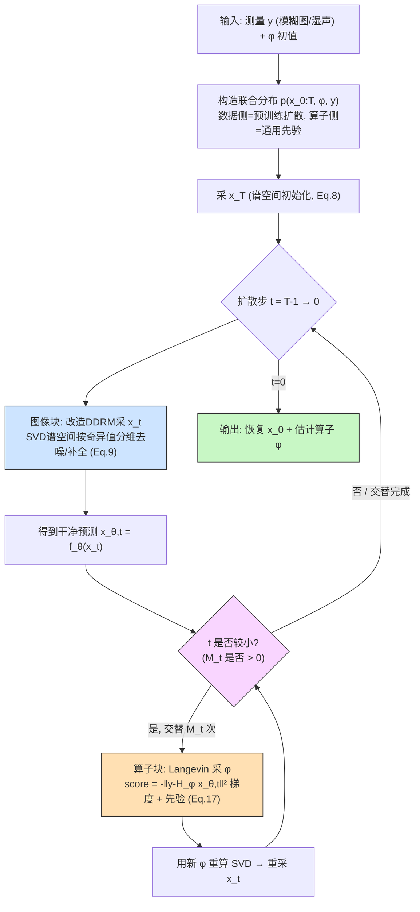

# GibbsDDRM: A Partially Collapsed Gibbs Sampler for Solving Blind Inverse Problems with Denoising Diffusion Restoration

**作者**: Naoki Murata, Koichi Saito, Chieh-Hsin Lai, Yuhta Takida, Toshimitsu Uesaka, Yuki Mitsufuji, Stefano Ermon (Sony AI / Sony Group / Stanford)
**会议**: ICML 2023 | **年份**: 2023
**链接**: [arXiv:2301.12686](https://arxiv.org/abs/2301.12686) | [代码](https://github.com/sony/gibbsddrm) | [Semantic Scholar](https://www.semanticscholar.org/paper/beaa36c83e7b8ab58d068d63a5909192ff524fdf) | [Connected Papers](https://www.connectedpapers.com/main/2301.12686)

---

## 一句话总结

GibbsDDRM 把非盲的 DDRM 扩展到"线性算子未知"的盲逆问题：构造数据 $\mathbf{x}_0$、测量 $\mathbf{y}$、算子参数 $\varphi$ 的联合分布，用**部分塌缩 Gibbs 采样（PCGS）**在图像块（改造 DDRM）和算子块（Langevin）之间高频交替，从联合后验采样——算子侧只需通用简单先验（不训任何模型），却能在盲去模糊与人声去混响上打赢包括 BlindDPS 在内的基线。

---

## 核心贡献

1. **首次把 DDRM 推广到盲设置**：算子未知时，构造 $p(\mathbf{x}_{0:T},\varphi,\mathbf{y})$ 联合分布（Eq. 6-7），数据侧用无条件预训练扩散先验，算子侧仅用 Laplace/Gaussian 通用先验，摆脱 BlindDPS "必须给算子训 score 网络"的限制。
2. **提出用 PCGS 做联合后验采样**：在 DDRM 单个扩散时间步内部交替采 $\mathbf{x}_t$ 和 $\varphi$（各 $M_t$ 次），相比 blocked Gibbs（每整条链才更 1 次 $\varphi$）大幅加速收敛；并证明（Prop 3.1）其平稳分布 = 真后验。
3. **三块条件采样的可算近似**：$\mathbf{x}_T$/$\mathbf{x}_t$ 用改造 DDRM 的 SVD 谱空间（Eq. 8-9）；$\varphi$ 用 Langevin，score 核心为 $-\frac{1}{2\sigma_\mathbf{y}^2}\nabla_\varphi\|\mathbf{y}-\mathbf{H}_\varphi\mathbf{x}_{\theta,t}\|^2$（Eq. 16-17），把扩散预测 $\mathbf{x}_{\theta,t}$ 反馈给核估计（Theorem 3.2 给误差界）。
4. **problem-agnostic 跨域验证**：同一框架用于盲图像去模糊（FFHQ/AFHQ）与人声去混响，保真指标（LPIPS/SI-SDR）大幅领先。

---

## 📖 批读导航

| Section | 内容 |
|---------|------|
| [00 - Abstract](sections/00-abstract.md) | 摘要 + 与本课题关系定位 |
| [01 - Introduction](sections/01-introduction.md) | 动机、BlindDPS 对比、Figure 1 效果预告 |
| [02 - Background](sections/02-background.md) | 盲逆问题形式、DDPM、DDRM 的 SVD 谱空间、PCGS 三操作 (Eq. 1-4) |
| [03 - Methodology](sections/03-methodology.md) | 核心：联合分布、PCGS 采样、图像块/算子块条件采样 (Eq. 6-17, Fig 2-4, Algo 1) |
| [04 - Experiments](sections/04-experiments.md) | 盲去模糊 (Table 1)、去混响 (Table 2)、Figure 5-6 |
| [05 - Conclusion](sections/05-conclusion.md) | 结论、局限、与本课题差距盘点 |
| [06 - Appendix](sections/06-appendix.md) | 证明 (Prop 3.1/Thm 3.2)、实例化、实验细节、Table 3-4、Figure 7-9 |

---

## 关键数字

| 指标 | 数值 | 说明 |
|------|------|------|
| 去模糊 FFHQ LPIPS↓ | **0.115** | 主指标，BlindDPS 0.281，DDRM+GT核 0.062（上界）|
| 去模糊 FFHQ FID↓ | 38.71 | BlindDPS 更低 (29.49)，但作者取保真优先 |
| 去模糊 FFHQ PSNR↑ | 25.80 | 监督法 MPRNet 更高 (27.23) 但视觉糊 |
| 去混响 FAD↓ / SI-SDR↑ / SRMR↑ | **4.21 / +0.59 / 8.40** | 三项全赢，关键对手 UD（同用 DDRM）|
| 扩散步数 $T$ | 100（图像）/ 50（音频）| $N=1$ 单遍 |
| $M_t$（每步 $\varphi$ 交替次数）| 图像 3（$t\lt70$）/ 音频 5（$t\leq40$）| 大 $t$ 时为 0 |
| Langevin 迭代 / 步长 | 500 / $10^{-11}$（图像）| 每次采 $\varphi$ 内部 |
| 单图耗时 | 56 s (RTX3090, batch 4) | 采样法通病 |
| 被引 / 参考 / influential | 82 / 68 / 11 | Semantic Scholar (2026-07) |

---

## 数据流：输入 → 中间表示 → 输出

---

## 优缺点与还能做什么

### 优点
- **摆脱算子先验模型**：算子侧只用 Laplace/Gaussian 通用先验，不训任何网络，实用性远超 BlindDPS。
- **理论保证**：Prop 3.1 证明 PCGS 平稳分布 = 真后验（若近似精确）；Theorem 3.2 给出核心近似的 Jensen gap 误差界。
- **保真度强**：LPIPS/SI-SDR 大幅领先，SVD 谱空间高效利用观测信息，避免"生成过头"。
- **采样式参数估计更稳**：Langevin 采 $\varphi$ 比 MAP 点估计无长尾坏解（Figure 7），实证"贝叶斯采样 > 点估计"。
- **problem-agnostic**：同框架跨图像/音频两域，数据侧扩散模型可复用。

### 局限 / 风险
- **依赖 SVD**：算子必须能高效 SVD（本文靠卷积 + FFT），非结构化/大尺度算子不适用（作者自认的唯一局限）。
- **噪声 $\sigma_\mathbf{y}$ 假设已知**：全程当常数塞进似然与 SVD 分维决策，未联合估计；估错会连带 SVD 决策出错。
- **无后验校准检验**：只报点指标（PSNR/LPIPS/FID/FAD）+ Langevin/MAP 稳定性直方图，从不检验"联合后验是否被正确采样"（无 coverage/CRPS/SBC）。
- **gauge 冗余靠硬约束**：模糊核尺度自由度靠归一化（非负、和=1）消掉，未做 gauge-aware 后验。
- **推理慢**：56 s/图，$T$ 步扩散 × 每步 $M_t$×Langevin 500 步 × 每次重算 SVD。

### 还能做什么（本课题接续）
- **联合估噪声 $\sigma$**：把 $\sigma_\mathbf{y}$ 纳入联合后验 $p(\mathbf{x}_0,\varphi,\sigma\mid\mathbf{y})$，并重新分析 Theorem 3.2 误差界对 $\sigma$ 估计误差的敏感性。
- **后验校准**：用 SBC / coverage / CRPS 检验 GibbsDDRM 式联合采样是否真正采自后验，量化 Prop 3.1 "若近似精确"打的折扣。
- **gauge-aware 处理**：显式建模算子参数的规范冗余（尺度/平移），而非靠归一化硬约束。
- **突破 SVD 依赖**：用可学习提议 / latent 空间算子处理非结构化算子，扩展可参数化算子类型。
- **摊销推理**：把每步 Langevin 换成学习式提议以降低 56 s 的推理成本。

---

## 阅读 Q&A 记录

- **Q: GibbsDDRM 到底"塌缩"了哪些变量？**
  A: 塌缩的是扩散链里"比当前步 $t$ 更干净的 latent" $\mathbf{x}_{0:t-1}$（附录 A 里记作辅助变量 $\psi_t$）。朴素 Gibbs 采 $\mathbf{x}_t$ 要条件在 $\mathbf{x}_{0:t-1}$ 上（intractable），PCGS 通过 marginalization + trimming 把它们从条件集去掉，使采 $\mathbf{x}_t$ 的条件分布退化成 DDRM 能给的 $p_\theta(\mathbf{x}_t\mid\mathbf{x}_{t+1},\varphi,\mathbf{y})$，且平稳分布不变（[Method 3.2](sections/03-methodology.md) + [Appendix A.1](sections/06-appendix.md)）。

- **Q: 图像块和算子块各自怎么采？**
  A: **图像块**（Eq. 8-9）——固定 $\varphi$，用改造 DDRM 在 $\varphi$ 依赖的 SVD 谱空间里，按奇异值 $s_i$ 与噪声水平 $\sigma_t$ 对比分三种情形更新 $\overline{\mathbf{x}}_t^{(i)}$（该信观测的信观测、信息全丢的靠扩散先验补全）。**算子块**（Eq. 11-17）——固定当前扩散预测 $\mathbf{x}_{\theta,t}$，用 Langevin 沿 $-\frac{1}{2\sigma_\mathbf{y}^2}\nabla_\varphi\|\mathbf{y}-\mathbf{H}_\varphi\mathbf{x}_{\theta,t}\|^2+\nabla_\varphi\log p(\varphi)$ 更新 $\varphi$。

- **Q: 为什么比"先点估计 $\varphi$ 再恢复"更接近联合贝叶斯推断？**
  A: 三点。（1）两块在**每个扩散步内部高频交替**（PCGS），不是"估一次算子就固定"，$\mathbf{x}$ 与 $\varphi$ 相互迭代精化；（2）$\varphi$ 是 **Langevin 采样**而非 MAP，能探索后验、逃离坏模态——Figure 7 实测 MAP 有长尾坏解、Langevin 更稳；（3）Prop 3.1 保证平稳分布=真联合后验。UD 消融（Table 2，同用 DDRM 仅算子估计方式不同）也证明联合采样式估计更优。

- **Q: 为什么核估得准，明明算子先验只是简单 Laplace？**
  A: 因为算子 score（Eq. 16）用的监督信号是**扩散不断精化的干净预测 $\mathbf{x}_{\theta,t}$**，不是原始含噪观测。Figure 4 显示即使 $\mathbf{x}_t$ 还很噪，$\mathbf{x}_{\theta,t}$ 已接近真值——"生成模型的表征能力被喂进参数估计"，所以简单先验足矣（[Method Eq.17 批注](sections/03-methodology.md)）。

- **Q: FID 输给 BlindDPS 为什么还说自己赢？**
  A: 作者立场是"盲恢复要忠实原图（LPIPS/PSNR）而非生成好看图（FID）"。BlindDPS 用 DPS 引导"生成过头"，FID 好但偏离原图；GibbsDDRM 用 SVD 精准利用观测，LPIPS 碾压。且 BlindDPS 的 FID 计算细节不明、样本量小，FID 差距本身带不确定性（[Experiments](sections/04-experiments.md) + [Appendix C.1](sections/06-appendix.md)）。

---

## 📊 Citation Landscape

> 数据来源：Semantic Scholar API（2026-07 查询）

**TLDR**: GibbsDDRM is an extension of Denoising Diffusion Restoration Models to a blind setting in which the linear measurement operator is unknown, and it achieves high performance on both blind image deblurring and vocal dereverberation tasks, despite the use of simple generic priors for the underlying linear operators.

**引用统计**：被引 **82** 次 | 参考文献 **68** 篇 | Influential Citations **11** 篇

### 参考文献分组（按主题，每组 Top 5，按被引数排序）

**① 扩散 / Score-based 生成模型（数据先验基础）**
| 论文 | 年份 | 被引 |
|------|------|------|
| Denoising Diffusion Probabilistic Models (DDPM) | 2020 | 32814 |
| Diffusion Models Beat GANs on Image Synthesis | 2021 | 12381 |
| Score-Based Generative Modeling through SDE | 2020 | 11362 |
| Deep Unsupervised Learning using Nonequilibrium Thermodynamics | 2015 | 10320 |
| Generative Modeling by Estimating Gradients of the Data Distribution | 2019 | 5727 |

**② 扩散/生成先验解逆问题（最相关，含直接前作）**
| 论文 | 年份 | 被引 |
|------|------|------|
| Diffusion Posterior Sampling (DPS, Thm 3.2 来源) | 2023 | 1737 |
| Denoising Diffusion Restoration Models (DDRM, 直接基础) | 2022 | 1324 |
| Solving Inverse Problems in Medical Imaging with Score-Based Models | 2021 | 766 |
| SNIPS: Solving Noisy Inverse Problems Stochastically | 2021 | 255 |
| Parallel Diffusion Models of Operator and Image (**BlindDPS, 主对手**) | 2023 | 171 |

**③ 盲去模糊 / 去卷积（图像任务基线与先验）**
| 论文 | 年份 | 被引 |
|------|------|------|
| Fast Image Deconvolution using Hyper-Laplacian Priors | 2009 | 1474 |
| Total variation blind deconvolution | 1998 | 1302 |
| Unnatural L0 Sparse Representation for Natural Image Deblurring | 2013 | 1148 |
| Blind Image Deblurring Using Dark Channel Prior (Pan-DCP) | 2016 | 783 |
| Neural Blind Deconvolution Using Deep Priors (SelfDeblur) | 2020 | 332 |

**④ Gibbs / PCGS / Langevin 采样理论**
| 论文 | 年份 | 被引 |
|------|------|------|
| Explaining the Gibbs Sampler | 1992 | 2925 |
| On the theory of Brownian motion (Langevin) | 1973 | 2539 |
| Covariance structure of the Gibbs sampler (blocked Gibbs) | 1994 | 651 |
| Blind Deconvolution of Sparse Pulse Sequences: PCGS Method (Kail) | 2012 | 51 |
| Partially Collapsed Gibbs Samplers: Theory and Methods (**Van Dyk & Park, PCGS 来源**) | 2008 | — |

**⑤ 音频去混响 / 图像恢复网络（音频任务基线）**
| 论文 | 年份 | 被引 |
|------|------|------|
| Multi-Stage Progressive Image Restoration (MPRNet) | 2021 | 2182 |
| DeblurGAN-v2 | 2019 | 1129 |
| Speech Dereverberation Based on Variance-Normalized Delayed Linear Prediction (WPE) | 2010 | 477 |
| Unsupervised Vocal Dereverberation with Diffusion Models (**UD, 关键消融对手**) | 2022 | 31 |
| Reverb Conversion of Mixed Vocal Tracks (RC) | 2021 | 20 |

### 推荐相关论文（Recommendations API，Top 10，均为后续同方向工作）

| 论文 | 年份 | arXiv |
|------|------|------|
| Exact Posterior Score Estimation for Solving Linear Inverse Problems | 2026 | 2606.17048 |
| Bridging data-driven priors via the score function for posterior sampling — Comparative review | 2026 | 2606.14800 |
| What Do Flow-Based Inverse Solvers Approximate? A Posterior-Transport View | 2026 | 2606.24516 |
| Separating Intrinsic Ambiguity from Estimation Uncertainty in Deep Generative Models for Linear Inverse Problems | 2026 | 2605.15050 |
| Measurement Geometry and Design for Trustworthy Generative Inverse Problems | 2026 | 2606.02309 |
| Diffusion Graph Posterior Sampling for Nonlinear Inverse Problems (EIT) | 2026 | 2605.19621 |
| Nonparametric Deconvolution and Denoising using Simulation Based Inference | 2026 | 2606.21907 |
| Correcting Neural Operator Spectral Bias via Diffusion Posterior Sampling | 2026 | 2606.03936 |
| Stochastic Optimal Control Sampling for Diffusion Inverse Problems | 2026 | 2606.28785 |
| Trustworthy MRI Reconstruction via Bayesian Uncertainty Quantification with Sparsity Prior Models | 2026 | 2606.17343 |

> 💡 **Citation Landscape 批注 (Hao 批注)**: 参考文献结构清晰印证 GibbsDDRM 的"三源合流"：**DDPM/DDRM/DPS 提供扩散逆问题基础**、**Van Dyk & Park 的 PCGS + Kail 的盲去卷积 PCGS 提供采样引擎**、**经典盲去模糊/WPE 提供任务基线**。最值得盯的两篇是 **BlindDPS**（主对手，同期 CVPR）和 **UD**（关键消融对手）。推荐列表显示后续方向明显转向"trustworthy / uncertainty quantification / posterior 校准 / 区分内在歧义与估计不确定性"（如 2605.15050、2606.02309、2606.17343）——这正是本课题（gauge-aware 联合后验 + SBC/coverage/CRPS 校准）所处的最新浪潮，GibbsDDRM 是这条线的重要起点基线。
