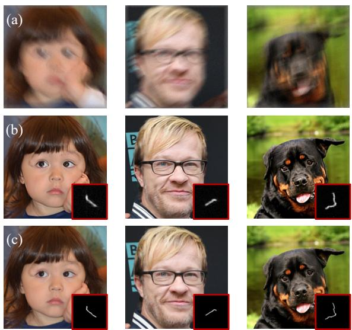

[← 返回 README](../README.md)

# 1. Introduction

## 📌 预览

引言按"逆问题是什么 → 需要先验 → 生成先验（扩散）成主流 → 但都假设算子已知 → 盲设置很常见 → BlindDPS 需要训练算子先验，太贵 → 我们 GibbsDDRM 不需要算子先验模型"的逻辑推进，最后用一段实验预告收尾（盲去模糊 LPIPS 大幅领先，去混响全指标领先）。

---

Inverse problems are frequently encountered in various science and engineering fields such as image processing, acoustic signal processing, and medical imaging. In an inverse problem, the goal is to restore a clean data signal from measurements generated by some forward (measurement) process. In image processing, problems such as deblurring (Zhu et al., 2018; Kupyn et al., 2019; Tu et al., 2022), inpainting (Yeh et al., 2017), and colorization (Larsson et al., 2016) are naturally formulated as inverse problems. In audio signal processing, problems such as dereverberation (Nakatani et al., 2010; Saito et al., 2023) and band extension (Larsen & Aarts, 2005) are also classic inverse problems. In medical imaging, many problems such as computed tomography (CT) (Zhu et al., 2018; Song et al., 2021a) also rely on inverse problem solving.

> 💡 **问题动机 (Hao 批注)**: 开篇罗列跨领域逆问题（图像去模糊/补全/上色、音频去混响/带宽扩展、医学 CT），是为了铺垫本文的 "problem-agnostic" 卖点——同一套框架、同一个预训练扩散先验，理论上能套到所有这些线性逆问题上。后文实验刻意跨了图像和音频两个领域，就是要兑现这个 claim。

*Figure 1. Blind image deblurring results obtained by GibbsDDRM: (a) measurement, (b) restored clean images with blur kernels (bottom right insets), and (c) ground truth images and blur kernels.*

> 💡 **Figure 1 批读 (Hao 批注)**: 这是全文的"效果预告图"。三列分别是 (a) 模糊+带噪的观测 $\mathbf{y}$、(b) GibbsDDRM 恢复的清晰图 + 右下角内嵌的**估计模糊核** $\varphi$、(c) 真值图 + 真值核。要看两点：（1）恢复图很锐利、身份/纹理保留好，说明数据侧扩散先验强；（2）右下角估计核的形状/朝向与真值核高度接近——注意这是在**没有任何算子先验模型**、只用 Laplace 稀疏先验的情况下估出来的，这正是本文相对 BlindDPS 的核心证据：核估计不靠专门训练的 score 网络，而靠"图像侧扩散信息通过联合采样反馈给核估计"（见 Method Eq. 17 后的批注）。

In general, inverse problems are ill-posed because the information in the original data is lost through the measurement process (e.g., because of noise); the incorporation of prior knowledge about the original data is thus critical. In the past, assumptions such as sparsity (Candes & Wakin, 2008), low rank (Fazel et al., 2008), and total variation (Candes et al., 2006) were made for the data distribution to narrow the set of plausible candidate solutions. A more recent trend has been to solve inverse problems by using richer deep generative models (Rick Chang et al., 2017; Anirudh et al., 2018; Kadkhodaie & Simoncelli, 2020; Whang et al., 2021) trained with a large amount of data as priors. In particular, the evolution of methods related to diffusion models (Kawar et al., 2021; 2022; Chung et al., 2023b;a) has been significant, and many such methods are problem-agnostic, meaning that they do not require retraining of the generative model used for inference on each task (i.e., each inverse problem).

> 💡 **机制拆解 (Hao 批注)**: 这段是"先验演进史"：手工先验（稀疏 / 低秩 / 全变分）→ 深度生成先验 → 扩散模型先验。关键词 **problem-agnostic** 在这里第一次正式定义：推理时不需要对每个任务重训生成模型。这是 DDRM/DPS 这类方法相对早期"每个任务训一个条件网络"的最大优势，GibbsDDRM 继承了这个优势，只是把它推广到盲设置。

Existing approaches typically assume that the measurement process is known. However, many settings are blind, meaning that the measurement process itself is (partially) unknown. This is known as a blind setting and includes problems such as blind image deblurring (Pan et al., 2016) and audio dereverberation (Nakatani et al., 2010). For example, in a blind image deblurring problem, the original image has to be restored from the convolution process where the blur kernel is unknown. To address this additional uncertainty, priors are introduced on both the data and the parameters of the linear operator involved (Chan & Wong, 1998; Krishnan & Fergus, 2009; Xu et al., 2013). BlindDPS (Chung et al., 2023a) is a method that uses a pre-trained diffusion model for both data and parameters. However, while it can leverage widely available pre-trained diffusion models for signals such as images and audio, it requires training a diffusion model for the parameters of the linear operators of interest, severely restricting its applicability in practice.

> 💡 **与 baseline 差异 (Hao 批注)**: 这段是全文最重要的"竞品定位"。**BlindDPS**（Chung et al., 2023a，CVPR）也是盲设置，用扩散先验，但它对**算子 $\varphi$ 也训了一个扩散/score 模型**。本文反复攻击这一点：给算子训 score 网络需要大量算子样本（比如各种模糊核数据集），实际不可得，严重限制适用性。GibbsDDRM 的整个动机就是——算子那侧**只用通用简单先验**（如 Laplace/Gaussian），不训任何模型。表 1 里 BlindDPS 打了星号并注明"用了训练好的核先验，占了不公平优势"，就是这个对比的延续。

To overcome this limitation, we propose GibbsDDRM, which does not require a data-driven prior model of the measurement process. This method is an extension of Denoising Diffusion Restoration Models (DDRM) (Kawar et al., 2022) – a method designed for non-blind linear inverse problems – to the blind linear setting. It constructs a joint distribution of the data, the measurements, and the linear operator's parameters by using a pre-trained diffusion model for the data and a generic prior for the measurement parameters. Then, it performs approximate sampling from the corresponding posterior distribution of the data and parameters conditioned on the measurements. Here, we adopt a partially collapsed Gibbs sampler (PCGS) (Van Dyk & Park, 2008) to enable efficient sampling from the posterior distribution. PCGS allows us to replace an intractable conditional distribution in the naïve Gibbs sampler with a more tractable one without changing the stationary distribution. PCGS alternately samples the data or latent variables and the linear operator's parameters, and the generative model's representational power is exploited while sampling the parameters of the linear operator. This allows our method to accurately estimate both data and the parameters despite using a simple prior for the parameters.

> 💡 **机制拆解 (Hao 批注)**: 这段是方法的"一句话预告"，四个动作要记住：（1）**构造联合分布** $p(\mathbf{x}_0,\mathbf{y},\varphi)$——数据侧用预训练扩散先验，算子侧用通用先验；（2）**从联合后验近似采样**；（3）用 **PCGS** 让采样高效；（4）PCGS 的精髓——把朴素 Gibbs 里那个 intractable 的条件分布换成 tractable 的近似，**平稳分布不变**（Proposition 3.1 会证）。最后一句 "the generative model's representational power is exploited while sampling the parameters" 是理解全文的钥匙：核估计之所以准，是因为每次采 $\varphi$ 时用的都是扩散模型当前给出的干净图像预测 $\mathbf{x}_{\theta,t}$，而不是原始含噪 $\mathbf{x}_t$——生成模型的表征能力被"喂"进了参数估计。

> 💡 **Q&A 批注记录 (Hao 批注)**:
> - Q: 为什么不直接用朴素 Gibbs（交替采 $\mathbf{x}_{0:T}$ 整条链和 $\varphi$）？
> - A: 见 Sec. 3.2——朴素 blocked Gibbs 要"每采一次 $\varphi$ 就跑完整条 DDRM（$\mathbf{x}_{0:T}$）"，$\varphi$ 更新次数太少、收敛极慢。PCGS 允许在 DDRM 的**每个时间步 $t$ 内部**交替采 $\mathbf{x}_t$ 和 $\varphi$（各 $M_t$ 次），$\varphi$ 更新频率大幅提高，收敛快。这就是"partially collapsed"带来的效率。

We conducted experiments on the tasks of blind image deblurring in the image processing domain and vocal dereverberation in the acoustic signal processing domain. The results confirm that high performance can be achieved on both tasks without strong assumptions on the prior for the linear operator's parameters. In the blind image deblurring task, GibbsDDRM demonstrates exceptional quantitative performance in terms of both image quality and faithfulness. It outperforms competing methods and BlindDPS by a large margin in LPIPS, which measures the perceptual similarity of images. The results also show that a faithful image can be restored even with large measurement noise. (see Figure 1 for restored images and estimated blur kernels.) In vocal dereverberation, GibbsDDRM outperforms alternative methods in terms of the quality of the processed vocal, the proximity of the signals, and the degree of reverberation removal.

> 💡 **证据链预告 (Hao 批注)**: 两个任务、两条证据线。图像去模糊：主打 **LPIPS**（感知相似度=保真度）大幅领先，包括压过用了核先验的 BlindDPS；同时强调大测量噪声下仍能忠实恢复（Figure 5 会展示）。人声去混响：FAD（质量）、SI-SDR（信号接近度）、SRMR（去混响程度）三项全赢。注意作者刻意区分 **FID（质量）vs LPIPS（保真）**：GibbsDDRM 在 FID 上不一定最优，但在 LPIPS 上碾压——这是全文最重要的指标叙事，后面实验节会反复出现（保真优先于纯生成质量）。

---

## 🔖 Section 总结

### 核心洞察
1. **定位**：GibbsDDRM = DDRM（非盲）→ 盲设置的扩展，核心贡献是"算子侧不需要数据驱动先验"。
2. **最大对手是 BlindDPS**：两者都用扩散先验做盲逆问题，差别在 BlindDPS 要给算子训 score 网络，GibbsDDRM 只用 Laplace/Gaussian 通用先验。
3. **技术钥匙是 PCGS**：在 DDRM 单步内部高频交替采 $\mathbf{x}_t$ 和 $\varphi$，且证明平稳分布不变；参数估计准的原因是"用扩散给出的干净预测 $\mathbf{x}_{\theta,t}$ 反馈给核估计"。
4. **指标叙事**：保真（LPIPS/SI-SDR）优先于纯生成质量（FID/FAD），这是理解实验结论的前提。

### 可追问点
- 联合后验采样是否被"正确"采到？本文只给点指标 + Langevin/MAP 稳定性对比，没有校准检验（SBC/coverage）——本课题的切入点。
- 噪声 $\sigma_\mathbf{y}$ 在本文是**已知常数**，没有联合估计；本课题要把 $\sigma$ 也纳入联合后验。
