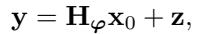
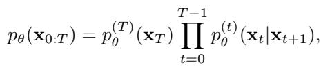
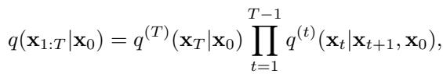
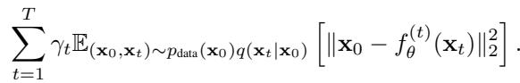
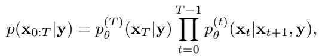

[← 返回 README](../README.md)

# 2. Background

## 📌 预览

背景铺四块拼图：（1）盲线性逆问题的数学形式与贝叶斯目标；（2）扩散模型 DDPM 的定义与去噪自编码目标；（3）DDRM——用 SVD 把 $\mathbf{x}_0$ 和 $\mathbf{y}$ 投到共享谱空间、非盲求解；（4）部分塌缩 Gibbs（PCGS）的三大操作（边缘化 / 置换 / 修剪）。这四块分别对应后文方法的目标函数、数据先验、图像块采样、算子块采样机制。

---

### Blind linear inverse problems

Blind linear inverse problems involve the estimation of both unknown clean data and the parameters of a linear operator from noisy measurements. This type of problem can be formulated as a linear system of equations of the following form:

where $\mathbf{y}\in\mathbb{R}^{d_\mathbf{y}}$ is a vector of measurements, $\mathbf{H}_\varphi\in\mathbb{R}^{d_\mathbf{y}\times d_{\mathbf{x}_0}}$ is a linear operator parameterized by $\varphi\in\mathbb{R}^{d_\varphi}$ and $\mathbf{x}_0\in\mathbb{R}^{d_{\mathbf{x}_0}}$ is the unknown original clean data to be estimated. $\mathbf{z}\sim\mathcal{N}(\mathbf{0},\sigma_\mathbf{y}^2\mathbf{I})$ is a Gaussian measurement noise with known covariance $\sigma_\mathbf{y}^2\mathbf{I}$, where $\mathbf{I}$ is the identity matrix. For notational convenience, we index the clean data $\mathbf{x}_0$ with "0" to distinguish it from latent variables of the diffusion model that are defined later. The aim here is to find estimates of both $\mathbf{x}_0$ and $\varphi$ that fit the given noisy measurements $\mathbf{y}$. The problem is ill-posed without any additional assumptions. To obtain a solution, it is assumed that $\mathbf{x}_0$ is drawn from a generative model $p_\theta(\mathbf{x}_0)$ (close to the true data distribution), and that the parameters $\varphi$ are drawn from a known prior $p(\varphi)$ independently of the data. In the Bayesian framework, the optimal solution is to sample from the posterior $p(\mathbf{x}_0,\varphi\mid\mathbf{y})$.

> 💡 **公式批读 — Eq. (1) (Hao 批注)**: 这是全文的观测模型 $\mathbf{y}=\mathbf{H}_\varphi\mathbf{x}_0+\mathbf{z}$。三个关键设定要记牢：（1）算子 $\mathbf{H}_\varphi$ 是**低维参数 $\varphi$ 参数化**的（图像里 $\varphi$ 就是模糊核，$d_\varphi$ 远小于图像维度），这是"参数化盲逆问题"的定义，也是本课题的核心结构；（2）噪声 $\mathbf{z}$ 是各向同性高斯，**协方差 $\sigma_\mathbf{y}^2\mathbf{I}$ 已知**——注意本文把 $\sigma_\mathbf{y}$ 当已知常数，不估计它；（3）贝叶斯目标是从**联合后验** $p(\mathbf{x}_0,\varphi\mid\mathbf{y})$ 采样，不是 MAP 点估计。这三点正是与本课题对齐/差异的关键：本课题额外要联合估 $\sigma$，并检验后验校准。

### Denoising Diffusion Probabilistic Models

Denoising Diffusion Probabilistic Models (Sohl-Dickstein et al., 2015; Ho et al., 2020; Song & Ermon, 2019; Song et al., 2021b; Lai et al., 2022), or diffusion models for short, are generative models with a Markov chain $\mathbf{x}_T\to\cdots\to\mathbf{x}_t\to\cdots\to\mathbf{x}_0$ represented by the following joint distribution:

where the model's output is $\mathbf{x}_0$. To train a diffusion model, a fixed variational inference distribution is introduced:

which gives the evidence lower bound (ELBO) on the maximum likelihood objective. With Gaussian parameterization for $p_\theta$ and $q$, the ELBO objective is reduced to the following denoising autoencoder objective:

Here, $f_\theta^{(t)}$ is a $\theta$-parameterized neural network that estimates noiseless data $\mathbf{x}_0$ from noisy $\mathbf{x}_t$ and characterizes $p_\theta$; $\mathbf{x}_{\theta,t}$ denotes the estimate of noise-less data by $f_\theta^{(t)}$; $\gamma_t$ are positive weighting coefficients determined by $q$.

> 💡 **公式批读 — Eq. (2)-(4) (Hao 批注)**: 这三式是标准 DDPM，作用是定义"数据先验"这一模块。真正在方法里被反复引用的是**去噪网络 $f_\theta^{(t)}$ 及其输出 $\mathbf{x}_{\theta,t}$**（从含噪 $\mathbf{x}_t$ 直接预测干净 $\mathbf{x}_0$）。记住 $\mathbf{x}_{\theta,t}$ 这个量：它是连接"图像块"和"算子块"的桥梁——算子 $\varphi$ 的梯度（Eq. 16）里用的就是 $\mathbf{x}_{\theta,t}$ 而不是 $\mathbf{x}_t$，即"把扩散给出的干净预测喂给核估计"。Eq. (4) 的去噪自编码目标说明扩散模型**无条件预训练**即可，推理时不需要针对逆问题微调（problem-agnostic 的来源）。

### Denoising Diffusion Restoration Models

Denoising Diffusion Restoration Models (DDRM) (Kawar et al., 2022) is a method that uses a pre-trained diffusion model as a prior for data in a non-blind linear inverse problem. It is defined as a Markov chain $\mathbf{x}_T\to\mathbf{x}_{T-1}\to\dots\to\mathbf{x}_1\to\mathbf{x}_0$ (where $\mathbf{x}_t\in\mathbb{R}^{d_{\mathbf{x}_0}}$) conditioned on the measurements $\mathbf{y}$:

where $\mathbf{x}_0$ is the model's output. The conditionals in DDRM are defined in terms of the denoising function $f_\theta^{(t)}$ of a pretrained diffusion model; intriguingly, the objective derived using the ELBO coincides with that of the unconditional diffusion model, except for a constant factor. This means that the unconditionally pre-trained diffusion model can be used during inference without finetuning. The core idea of DDRM is to use the singular value decomposition (SVD) of a linear operator $\mathbf{H}$ to transform both the unknown input $\mathbf{x}_0$ and the observed output $\mathbf{y}$, potentially corrupted by noise, to a shared spectral space. In this space, DDRM executes denoising on dimensions for which information from $\mathbf{y}$ is available (i.e., when the singular values are non-zero). When such information is not available (i.e., when the singular values are zero or the noise in the dimension is large), DDRM performs imputation while explicitly considering the measurement noise.

> 💡 **机制拆解 — DDRM 的 SVD 谱空间 (Hao 批注)**: 这段是理解整个图像块采样的地基。DDRM 的核心操作是对算子做 **SVD $\mathbf{H}=\mathbf{U}\boldsymbol{\Sigma}\mathbf{V}^\top$**，把 $\mathbf{x}_0$ 和 $\mathbf{y}$ 都转到**共享谱空间**（$\bar{\mathbf{x}}=\mathbf{V}^\top\mathbf{x}$，$\bar{\mathbf{y}}=\boldsymbol{\Sigma}^\dagger\mathbf{U}^\top\mathbf{y}$）。在谱空间里每个维度独立处理：奇异值 $s_i\gt0$ 且信息可靠的维度→用观测做去噪；$s_i=0$ 或噪声压过信号的维度→用扩散先验做补全（imputation）。这个"按奇异值分维度处理"的机制天然把测量噪声考虑进去，也是后文强调"大噪声下仍能忠实恢复"（Figure 5）的原因。**盲设置的新麻烦**：谱空间 $\mathbf{U}_\varphi,\boldsymbol{\Sigma}_\varphi,\mathbf{V}_\varphi$ 都依赖未知的 $\varphi$，所以每次 $\varphi$ 更新后 SVD 要重算——这是 GibbsDDRM 相对 DDRM 的额外代价，也是结论里"SVD 不可行时方法不适用"这条局限的根源。

### Partially collapsed Gibbs sampler

A Gibbs sampler is a simple, widely used Markov chain Monte Carlo method for sampling from the joint distribution of a set of variables (Casella & George, 1992). The procedure entails iterative sampling from the fully conditional distributions of each variable, given the current values of the other variables. A blocked Gibbs sampler (Liu et al., 1994) is a variant in which, instead of sampling each variable individually, variables in a group or a "block" of variables are sampled simultaneously while conditioned on all the other variables. This approach is effective when the variables within a block are highly correlated, and it can improve the sampler's convergence speed.

A partially collapsed Gibbs sampler (PCGS) (Van Dyk & Park, 2008; Kail et al., 2012) is a generalization of a blocked Gibbs sampler that effectively explores the probability space through three basic operations in the sampling procedure: marginalization, permutation, and trimming, which are described in detail in (Van Dyk & Park, 2008) and Appendix A. In short, the removal of certain variables among the conditional variables does not alter the Gibbs sampler's stationary distribution, as long as these variables are not included among the conditional variables until the next time they are sampled. Hence, we can achieve efficient sampling when the distributions obtained after trimming are tractable.

> 💡 **机制拆解 — PCGS 三操作 (Hao 批注)**: 这段定义了本文的采样引擎。从朴素 Gibbs → blocked Gibbs（把强相关变量成组一起采）→ PCGS（更一般）。PCGS 靠三个操作：**marginalization（边缘化）**——采某变量时把另一些变量一起采而非条件在它们上；**trimming（修剪）**——若某变量被采多次且中间没被当条件用，只有最后一次有效，其余可从条件集里删掉；**permutation（置换）**——在保持修剪合法性的前提下重排采样顺序。核心保证（本段最后一句）：**只要一个变量从被"修剪"到下次被采样之间不出现在条件集里，删掉它不改变平稳分布**。这就是为什么 GibbsDDRM 能把 intractable 的完整条件分布换成 tractable 的 DDRM 近似而理论上仍采自真后验（Proposition 3.1）。

---

## 🔖 Section 总结

### 关键变量速查
| 符号 | 含义 |
|------|------|
| $\mathbf{x}_0$ | 待恢复的干净数据（图像/干声） |
| $\varphi$ | 线性算子的低维参数（模糊核 / 声学传递函数） |
| $\mathbf{H}_\varphi$ | 由 $\varphi$ 参数化的线性算子 |
| $\sigma_\mathbf{y}$ | 测量噪声标准差（本文当**已知常数**） |
| $\mathbf{x}_{\theta,t}$ | 扩散网络 $f_\theta^{(t)}$ 从 $\mathbf{x}_t$ 预测的干净图 |
| $\mathbf{U}_\varphi,\boldsymbol{\Sigma}_\varphi,\mathbf{V}_\varphi$ | $\mathbf{H}_\varphi$ 的 SVD 分量（谱空间，依赖 $\varphi$）|

### 核心洞察
1. 目标是采**联合后验** $p(\mathbf{x}_0,\varphi\mid\mathbf{y})$，不是点估计。
2. 数据侧=无条件预训练扩散模型（$f_\theta$，problem-agnostic）；算子侧=通用简单先验 $p(\varphi)$。
3. 图像块靠 **DDRM 的 SVD 谱空间**按奇异值分维度去噪/补全；盲设置下谱空间随 $\varphi$ 变，需反复重算 SVD。
4. 采样引擎是 **PCGS**，靠 trimming 把 intractable 条件换成 tractable 近似而平稳分布不变。

### 可追问点
- $\sigma_\mathbf{y}$ 已知这个假设有多强？现实盲逆问题里噪声水平往往也未知——本课题要联合估 $\sigma$。
- SVD 依赖 $\varphi$ 意味着每步都要重算 SVD，效率与 $\varphi$ 表示（如 FFT 卷积）强相关（附录 B）。
