[← 返回 README](../README.md)

# 3. GibbsDDRM: Partially Collapsed Gibbs Sampler with DDRM

## 📌 预览

方法节是全文核心，分三小节：**3.1** 定义要采样的联合分布（把扩散链的所有 latent $\mathbf{x}_{0:T}$、算子参数 $\varphi$、测量 $\mathbf{y}$ 放一起）；**3.2** 用 PCGS 从联合后验采样——先解释为什么不用朴素/blocked Gibbs，再给出采样顺序（Figure 3）和 Algorithm 1，然后逐块给出三种变量的**近似条件采样**：$\mathbf{x}_T$（Eq. 8）、$\mathbf{x}_t$（Eq. 9，图像块，改造 DDRM）、$\varphi$（Eq. 11-17，算子块，Langevin）；**3.3** 实现细节（$\varphi$ 初始化、大 $t$ 时不更新 $\varphi$）。

> 💡 **数据流总览 (Hao 批注)**: 建议先建立全局数据流再读细节。**输入**：测量 $\mathbf{y}$、$\varphi$ 初值。**核心中间变量**：扩散 latent $\mathbf{x}_t$（含噪）、其干净预测 $\mathbf{x}_{\theta,t}=f_\theta^{(t)}(\mathbf{x}_t)$、算子参数 $\varphi$。**两个交替更新块**：（A）图像块——固定 $\varphi$，用改造 DDRM 在谱空间更新 $\mathbf{x}_t$；（B）算子块——固定当前 $\mathbf{x}_{\theta,t}$，用 Langevin 按 $\|\mathbf{y}-\mathbf{H}_\varphi\mathbf{x}_{\theta,t}\|^2$ 的梯度更新 $\varphi$。**输出**：$\mathbf{x}_0$ 与 $\varphi$。关键创新点：这两个块在**每个扩散时间步 $t$ 内部**交替各跑 $M_t$ 次（PCGS），而不是"跑完整条链再更一次 $\varphi$"。

---

## 3.1. Target joint distribution for blind linear inverse problems

In this paper, we seek to solve blind linear inverse problems by sampling from the posterior of the joint distribution of the data and the linear operator's parameters, given the measurements. The joint distribution of the data $\mathbf{x}_0$, parameters $\varphi$, and measurements $\mathbf{y}$ is defined as follows:

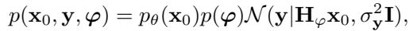

where $p_\theta(\mathbf{x}_0)$ and $p(\varphi)$ are the known prior distributions for the data and the parameters, respectively. The Gaussian distribution $\mathcal{N}(\mathbf{y}\mid\mathbf{H}_\varphi\mathbf{x}_0,\sigma_\mathbf{y}^2\mathbf{I})$ comes from the measurement model given in Eq. (1). The aim is to sample from the joint posterior distribution $p(\mathbf{x}_0,\varphi\mid\mathbf{y})$. Using a pre-trained generative model as a prior $p_\theta(\mathbf{x}_0)$ can drastically improve the solutions in inverse problems; however, inference can be challenging. Even in the non-blind setting where $\varphi$ is known, sampling from the posterior is intractable and requires approximations like in DDRM (Kawar et al., 2022).

> 💡 **公式批读 — Eq. (6) (Hao 批注)**: 联合分布分解成三项乘积：**数据先验** $p_\theta(\mathbf{x}_0)$（预训练扩散）× **算子先验** $p(\varphi)$（通用简单先验）× **似然** $\mathcal{N}(\mathbf{y}\mid\mathbf{H}_\varphi\mathbf{x}_0,\sigma_\mathbf{y}^2\mathbf{I})$（来自 Eq. 1 的观测模型）。注意先验独立假设：$\varphi$ 与 $\mathbf{x}_0$ 独立。这是本课题联合后验最标准的结构，我们要在此基础上把 $\sigma_\mathbf{y}$ 也变成待估随机变量（本文当作已知常数塞进似然）。最后一句很重要：即便非盲（$\varphi$ 已知），后验采样也 intractable，得靠 DDRM 近似——所以盲设置只会更难，需要 PCGS。

Here we model the data distribution using a pre-trained diffusion model as in Eq. (2). This leads to the following joint distribution over the data, its latent variables, and the parameters, as shown in Figure 2,

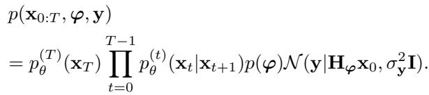

Note that sampling from the posterior distribution $p(\mathbf{x}_{0:T}\mid\varphi,\mathbf{y})$ under a fixed $\varphi$ corresponds to the objective of DDRM. In addition, we also assume that the parameters prior $p(\varphi)$ is a generic and simple prior, such as a sparsity prior.

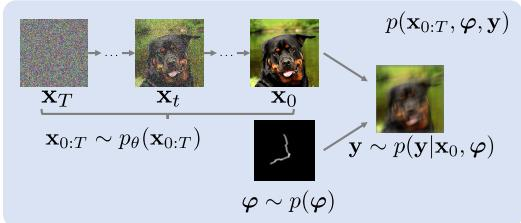
*Figure 2. Graphical model for the joint distribution in Eq. (7).*

> 💡 **公式批读 — Eq. (7) + Figure 2 批读 (Hao 批注)**: Eq. (7) 把 Eq. (6) 里的 $p_\theta(\mathbf{x}_0)$ 展开成完整的扩散链 $p_\theta^{(T)}(\mathbf{x}_T)\prod p_\theta^{(t)}(\mathbf{x}_t\mid\mathbf{x}_{t+1})$，于是联合分布现在覆盖**所有 latent $\mathbf{x}_{0:T}$**（不只是 $\mathbf{x}_0$）+ $\varphi$ + $\mathbf{y}$。图 2 的图模型说清了依赖关系：扩散链 $\mathbf{x}_T\to\cdots\to\mathbf{x}_0$ 逐级生成，$\mathbf{y}$ 同时依赖 $\mathbf{x}_0$（经 $\mathbf{H}_\varphi$）和 $\varphi$，$\varphi$ 是独立的父节点。**关键观察**：固定 $\varphi$ 时，从 $p(\mathbf{x}_{0:T}\mid\varphi,\mathbf{y})$ 采样恰好就是 DDRM 的目标——这就是为什么本文能"复用 DDRM 当图像块采样器"。把 latent 全放进联合分布，是为了下一节能在扩散链的**每一步**插入 $\varphi$ 更新。

---

## 3.2. Partially Collapsed Gibbs Sampler for the joint distribution

To sample from the joint posterior in Eq. (7), we could attempt to sample from the joint posterior distribution that includes the latent variables of the diffusion model. However, it is still not feasible to run a naïve Gibbs sampler for the posterior $p(\mathbf{x}_{0:T},\varphi\mid\mathbf{y})$, as it would require a conditional distribution for every individual variable, conditioned on all the other variables. For instance, the conditional distribution $p(\mathbf{x}_t\mid\mathbf{x}_{0:t-1},\mathbf{x}_{t+1:T},\varphi,\mathbf{y})$ for the joint distribution defined in Eq. (7) is not obvious.

> 💡 **机制拆解 — 为什么朴素 Gibbs 不行 (Hao 批注)**: 朴素 Gibbs 要对每个变量给出"条件在其余所有变量上"的全条件分布。但 Eq. (7) 里 $p(\mathbf{x}_t\mid\mathbf{x}_{0:t-1},\mathbf{x}_{t+1:T},\varphi,\mathbf{y})$——即同时条件在**比 $t$ 更早（更干净）和更晚（更噪）的所有 latent**上——不是扩散模型能直接给出的（扩散只定义了 $p(\mathbf{x}_t\mid\mathbf{x}_{t+1})$ 这种单向条件）。这就是"塌缩"要解决的对象：那些说不清的条件依赖（尤其对 $\mathbf{x}_{0:t-1}$ 的依赖）要被 trimming 掉。

A possible strategy is to use a blocked Gibbs sampler (Liu et al., 1994) with the variables divided into two groups, $\mathbf{x}_{0:T}$ and $\varphi$, and sampled alternately. In more detail, after initializing $\varphi$, the sampling procedure of DDRM is performed keeping $\varphi$ fixed to obtain an estimate of the clean data $\mathbf{x}_0$. Then, $\varphi$ is sampled such that it is consistent with the estimated data $\mathbf{x}_0$ and measurements $\mathbf{y}$. By repeating these operations, we can sample $\mathbf{x}_0$ and $\varphi$ from the joint posterior. However, this approach may be inefficient because of the small number of updates made to $\varphi$: the entire sampling of $\mathbf{x}_{0:T}$ must be performed for a step of sampling $\varphi$, which results in slow convergence.

> 💡 **机制拆解 — blocked Gibbs 的低效 (Hao 批注)**: 一个直觉方案是把变量分成两块 $\{\mathbf{x}_{0:T}\}$ 和 $\{\varphi\}$ 交替采：跑完整条 DDRM 得到 $\mathbf{x}_0$ → 采一次 $\varphi$ → 再跑整条 DDRM …。问题很直接：**$\varphi$ 每更新一次要付出跑完整条扩散链（几十上百步）的代价**，$\varphi$ 更新太稀疏，收敛极慢。这正是 GibbsDDRM 要改进的痛点。理解这一点就理解了"partially collapsed"的价值所在。

Hence, we adopt a partially collapsed Gibbs sampler (PCGS) (Van Dyk & Park, 2008) for the joint posterior. This strategy's main advantage is that we can still use a similar sampling method defined by the original DDRM. This enables simultaneous sampling of the latent variables $\mathbf{x}_{1:T}$ and the linear operator's parameters $\varphi$ within a cycle of DDRM sampling, thus improving the convergence speed.

In a naïve Gibbs sampler, the order of sampling variables is arbitrary. In a PCGS, however, the sampling order must be carefully chosen to facilitate the trimming operation, which removes conditional variables from the conditional distribution. Specifically, once a variable has been marginalized and removed from the conditional set, it should not be added back until the next time it is sampled. We show a simple example of a PCGS in Appendix A. Figure 3 shows the sampling order of the proposed PCGS. After sampling $\mathbf{x}_T$, the following operations are performed in descending order of $t$, until $t=0$: for each $t$, $\mathbf{x}_t$ is sampled once, and then $\varphi$ and $\mathbf{x}_t$ are alternately sampled $M_t$ times. One set of these operations constitutes a single cycle of the PCGS, and the operations are repeated for $N$ cycles.

The proposed PCGS is defined in Algorithm 1. The following proposition ensures that it samples from the true posterior distribution.

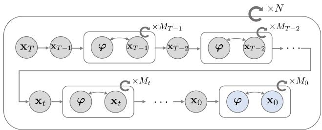
*Figure 3. Sampling order of variables in the proposed PCGS, whose output entails the final sample of data $\mathbf{x}_0$ and parameters $\varphi$.*

> 💡 **Figure 3 批读 — 采样顺序 (Hao 批注)**: 这张图是 PCGS 的时序表。读法：从 $\mathbf{x}_T$ 开始，$t$ 递减到 0；在**每个时间步 $t$**：先采一次 $\mathbf{x}_t$，然后 $\varphi\leftrightarrow\mathbf{x}_t$ **交替采 $M_t$ 次**。走完 $T\to0$ 是一个 cycle，重复 $N$ 次。对比 blocked Gibbs（每整条链才更 1 次 $\varphi$），这里 $\varphi$ 在**每步内部就更新 $M_t$ 次**，总更新数 $\approx\sum_t M_t$ 大幅增加——这就是收敛加速的来源。注意"塌缩"体现在：采 $\mathbf{x}_t$ 时不再条件于 $\mathbf{x}_{0:t-1}$（那些更干净的 latent 被 trim 掉），只条件于 $\mathbf{x}_{t+1}$、$\varphi$、$\mathbf{y}$，于是条件分布退化成 DDRM 能给的形式。图像去模糊里实际取 $N=1$、$M_t=3$（$t\lt70$）——即单遍扩散、每步内交替 3 次就够。

Proposition 3.1. The PCGS defined in Algorithm 1 has the true posterior distribution $p(\mathbf{x}_{0:T},\varphi\mid\mathbf{y})$ as its stationary distribution if the approximations to the conditional distributions are exact.

We give the proof in Appendix A.

> 💡 **公式批读 — Proposition 3.1 (Hao 批注)**: 这是本文的理论卖点：PCGS 的平稳分布**就是真后验** $p(\mathbf{x}_{0:T},\varphi\mid\mathbf{y})$——前提是"条件分布的近似是精确的"。证明思路（附录 A）：从朴素 Gibbs（Sampler 1，平稳分布已知为真后验）出发，通过 PCGS 的 marginalization + trimming 逐步变形到 Algorithm 1，每步操作都不改变平稳分布。**批判性看待**：这个保证是"若近似精确"的条件命题。实践中图像块用改造 DDRM、算子块用 Langevin + Jensen gap 近似（Theorem 3.2），都不是精确的。所以理论保证与实际采样之间有 gap——本文没有实测这个 gap（比如用 SBC 检验后验是否被正确采样），这正是本课题可以补上的校准检验环节。

Algorithm 1 Proposed PCGS for the posterior in Eq. (7)
```
Input: Measurement y, initial values φ^(0,0)
Output: Restored data x_0^(N,M_0), linear operator's parameters φ^(N,K)
K ← 0    // K counts the number of updates for φ in a cycle.
for n = 1 to N do
    φ^(n,0) ← φ^(n-1,K), K ← 0
    Sample x_T^(n,0) ~ p(x_T | φ^(n,K), y)
        // ↑ approximated by p_θ(x_T | φ, y)
    for t = T-1 to 0 do
        χ_t ← { x_{t+1}^(n,M_{t+1}), x_{t+2}^(n,M_{t+2}), ..., x_T^(n,0) }
        Sample x_t^(n,0) ~ p(x_t | φ^(n,K), χ_t, y)
            // ↑ approximated by p_θ(x_t | x_{t+1}, φ, y)
        for m = 1 to M_t do
            Sample φ^(n,K+1) ~ p(φ | x_t^(n,m-1), χ_t, y)
                // ↑ Langevin sampling with the approximated
                //   score ∇_φ log p(y | x_{θ,t}, φ)
            K ← K + 1
            Sample x_t^(n,m) ~ p(x_t | φ^(n,K), χ_t, y)
                // ↑ approximated by p_θ(x_t | x_{t+1}, φ, y)
        end for
    end for
end for
```

> 💡 **Algorithm 1 批读 — 三层循环 (Hao 批注)**: 三层嵌套：外层 $n$（cycle，共 $N$ 次）；中层 $t$（扩散步，$T-1\to0$）；内层 $m$（每步内交替，共 $M_t$ 次）。$\chi_t$ 是"比 $t$ 更晚（更噪）的 latent 集合"，作为条件——注意**没有 $\mathbf{x}_{0:t-1}$**，那些被 trim 掉了。内层做的正是**图像块 ↔ 算子块交替**：先用当前 $\mathbf{x}_t$ 采 $\varphi$（Langevin，score 用 $\mathbf{x}_{\theta,t}$），再用新 $\varphi$ 重采 $\mathbf{x}_t$（改造 DDRM）。三处 `approximated by` 注释点出了三个近似替换（对应 Proposition 3.1 里"若近似精确"的三个近似）。$K$ 只是全局计数器，记录 $\varphi$ 被更新了多少次。

Proposition 3.1 states that it is possible to sample reasonable data and parameters by executing the PCGS defined in Algorithm 1, but the conditional distributions the PCGS includes are intractable. Hence, we replace each conditional distribution with approximations from which we can efficiently sample. In the following paragraphs, we provide the details of the sampling procedures at each step.

### Sampling of $\mathbf{x}_T$

The sampling of $\mathbf{x}_T$ is performed with the distribution $p(\mathbf{x}_T\mid\varphi,\mathbf{y})$, which is obtained by trimming $\mathbf{x}_{0:T-1}$. Because this conditional distribution is intractable, as discussed above, we use modified DDRM to approximate the conditional distribution.

Here, in order to introduce the modified DDRM, we use SVD of the linear operator $\mathbf{H}_\varphi$ and its spectral space, similarly to previous studies (Kawar et al., 2021; 2022). The SVD is given as $\mathbf{H}_\varphi=\mathbf{U}_\varphi\boldsymbol{\Sigma}_\varphi\mathbf{V}_\varphi^\top$, where $\mathbf{U}_\varphi\in\mathbb{R}^{d_\mathbf{y}\times d_\mathbf{y}}$ and $\mathbf{V}_\varphi\in\mathbb{R}^{d_{\mathbf{x}_0}\times d_{\mathbf{x}_0}}$ are orthogonal matrices, and $\boldsymbol{\Sigma}_\varphi\in\mathbb{R}^{d_\mathbf{y}\times d_{\mathbf{x}_0}}$ is a rectangular diagonal matrix. Here we assume $d_\mathbf{y}\leq d_{\mathbf{x}_0}$, but our method would work for $d_\mathbf{y}\gt d_{\mathbf{x}_0}$. The diagonal elements of $\boldsymbol{\Sigma}_\varphi$ are the singular values of $\mathbf{H}_\varphi$ in descending order, denoted $s_{1,\varphi},s_{2,\varphi},\cdots,s_{d_\mathbf{y},\varphi}$. Hereafter, we omit the subscript $\varphi$ from the singular values for notational simplicity. The values in the spectral space are represented as follows: $\overline{\mathbf{x}}_t^{(i)}$ is the i-th element of $\overline{\mathbf{x}}_t=\mathbf{V}_\varphi^\top\mathbf{x}_t$ and $\overline{\mathbf{y}}^{(i)}$ is the i-th element of $\overline{\mathbf{y}}=\boldsymbol{\Sigma}_\varphi^\dagger\mathbf{U}_\varphi^\top\mathbf{y}$, where $\mathbf{A}^\dagger$ is the Moore-Penrose pseudo-inverse of a matrix $\mathbf{A}$. Note that the spectral space also depends on the parameters $\varphi$, which is unknown in our blind setting, unlike in DDRM. Our modified DDRM update for sampling $\mathbf{x}_T$ is defined as follows:

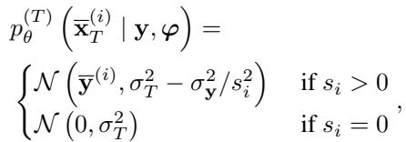

where the only difference from the original DDRM is that the parameters $\varphi$ are treated as random variables.

> 💡 **公式批读 — Eq. (8) 图像块起点 (Hao 批注)**: $\mathbf{x}_T$ 是纯噪声起点，在谱空间按维度初始化：奇异值 $s_i\gt0$ 的维度用观测 $\overline{\mathbf{y}}^{(i)}$ 当均值（方差 $\sigma_T^2-\sigma_\mathbf{y}^2/s_i^2$，减去测量噪声贡献）；$s_i=0$（信息全丢）的维度用 $\mathcal{N}(0,\sigma_T^2)$ 纯先验。**与 DDRM 唯一的差别**：这里 $\varphi$（进而谱空间 $\mathbf{U}_\varphi,\boldsymbol{\Sigma}_\varphi,\mathbf{V}_\varphi$）是随机变量而非已知常数。所以每次 $\varphi$ 更新后要重算 SVD——盲设置的额外代价。$\mathbf{x}_T$ 由 trim 掉 $\mathbf{x}_{0:T-1}$ 得到条件 $p(\mathbf{x}_T\mid\varphi,\mathbf{y})$，正是"塌缩"的直接体现。

### Sampling of $\mathbf{x}_t$

The sampling of $\mathbf{x}_t$ $(t\lt T)$ is performed by sampling from the conditional distribution $p(\mathbf{x}_t\mid\mathbf{x}_{t+1:T},\varphi,\mathbf{y})$, which trims $\mathbf{x}_{0:t-1}$ if $t\gt0$. As in the sampling of $\mathbf{x}_T$, we approximate the conditional distribution by modifying DDRM. Denoting the prediction of $\mathbf{x}_0$ at every time step $t$ by $\mathbf{x}_{\theta,t}$ which is made by the diffusion model as in Sec. 2, modified DDRM is defined as follows:

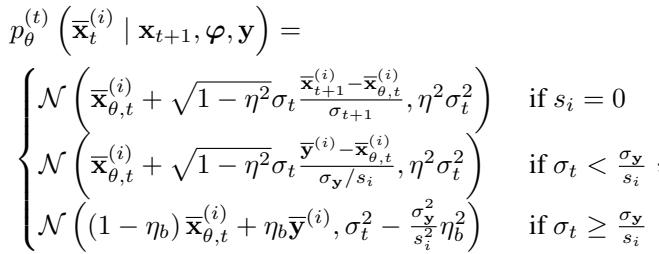

where $0\leq\eta\leq1$ and $0\leq\eta_b\leq1$ are hyperparameters, and $0=\sigma_0\lt\sigma_1\lt\sigma_2\lt\cdots\lt\sigma_T$ are noise levels that is the same as that defined with the pre-trained diffusion model.

Thus we have the approximation

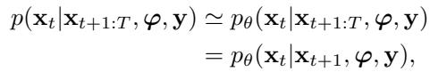

where the final equation comes from the Markov property of the modified DDRM.

> 💡 **公式批读 — Eq. (9)-(10) 图像块核心 (Hao 批注)**: 这是**图像块采样**的主体。在谱空间按维度分三种情形更新 $\overline{\mathbf{x}}_t^{(i)}$：（1）$s_i=0$——无观测信息，纯靠扩散去噪预测 $\overline{\mathbf{x}}_{\theta,t}^{(i)}$ 加 DDIM 式的方向项；（2）$\sigma_t\lt\sigma_\mathbf{y}/s_i$——扩散噪声比该维度的等效测量噪声还小，说明观测在此维度更可靠，用 $\overline{\mathbf{y}}^{(i)}$ 引导；（3）$\sigma_t\geq\sigma_\mathbf{y}/s_i$——测量噪声占优，用 $\eta_b$ 在预测和观测间插值并扣掉噪声方差。**核心洞察**：整个机制就是 DDRM 的"按奇异值 + 噪声水平分维度决定信谁"，$\eta,\eta_b$ 控制随机性/引导强度。Eq. (10) 说明改造 DDRM 保持 Markov 性——采 $\mathbf{x}_t$ 只需条件于 $\mathbf{x}_{t+1}$（不是整条 $\mathbf{x}_{t+1:T}$），这是 trimming 合法的关键。注意关键量 $\mathbf{x}_{\theta,t}$：它是算子块的输入桥梁。

### Sampling of $\varphi$

At time step $t$, the sampling of the parameters $\varphi$ is done by using the conditional distribution $p(\varphi\mid\mathbf{x}_{t:T},\mathbf{y})$. For the joint distribution defined by Eq. (7), the conditional distribution is not easily obtained because, while $\varphi$ and $\mathbf{x}_{t:T}$ are related through $\mathbf{x}_0$, the distribution of $\mathbf{x}_0$ cannot be evaluated at this point. Hence, we use the approximation in (Chung et al., 2023b;a) for the score of the conditional distribution and then perform sampling by Langevin dynamics (Langevin, 1908), as follows:

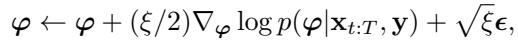

where $\xi$ is a step size and $\epsilon\sim\mathcal{N}(0,I)$. By Bayes' rule, the score $\nabla_\varphi\log q(\varphi\mid\mathbf{x}_{t:T},\mathbf{y})$ can be decomposed into two terms:

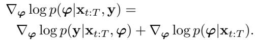

Regarding the first term, we exploit the following theorem.

> 💡 **公式批读 — Eq. (11)-(12) 算子块 Langevin (Hao 批注)**: **算子块采样**用 Langevin 动力学（Eq. 11）：$\varphi$ 沿 score 上升 + 高斯扰动。难点：$p(\varphi\mid\mathbf{x}_{t:T},\mathbf{y})$ 里 $\varphi$ 和 $\mathbf{x}_{t:T}$ 通过 $\mathbf{x}_0$ 关联，但此刻拿不到真正的 $\mathbf{x}_0$（还在扩散中间）。Eq. (12) 用贝叶斯把 score 拆成**似然项** $\nabla_\varphi\log p(\mathbf{y}\mid\mathbf{x}_{t:T},\varphi)$ + **先验项** $\nabla_\varphi\log p(\varphi\mid\mathbf{x}_{t:T})$。下面 Theorem 3.2 处理似然项（关键近似），先验项后面塌缩成简单 $p(\varphi)$。

Theorem 3.2. (modified version of Theorem 1 in (Chung et al., 2023b)) For the measurement model in Eq. (1), we have

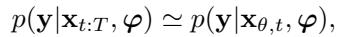

and the approximation error can be quantified with the Jensen gap (Gao et al., 2017), which is upper bounded by

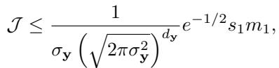

where $m_1:=\int\|\mathbf{x}_0-\mathbf{x}_{\theta,t}\|p(\mathbf{x}_0\mid\mathbf{x}_{t:T})d\mathbf{x}_0$, and $s_1$ is the largest singular value of $\mathbf{H}_\varphi$.

> 💡 **公式批读 — Theorem 3.2 关键近似 (Hao 批注)**: 这是算子块的理论支柱，也是全文最关键的近似。**Eq. (13)**：$p(\mathbf{y}\mid\mathbf{x}_{t:T},\varphi)\simeq p(\mathbf{y}\mid\mathbf{x}_{\theta,t},\varphi)$——把"对真实 $\mathbf{x}_0$ 的期望"替换成"直接代入扩散预测 $\mathbf{x}_{\theta,t}$"。这正是 DPS（Chung et al., 2023b）的核心 trick，本文把它搬到盲设置。**Eq. (14)**：近似误差（Jensen gap）上界正比于 $s_1 m_1$，其中 $m_1$ 是 $\mathbf{x}_0$ 与预测 $\mathbf{x}_{\theta,t}$ 的期望距离。含义：$t$ 越小（越接近干净）$m_1$ 越小、近似越准；$t$ 大时误差大——这直接解释了 3.3 里"大 $t$ 不更新 $\varphi$"的设计（附录 A.2 给完整证明，用高斯密度的 Lipschitz 常数）。

By leveraging Theorem 3.2, we obtain the approximate gradient with respect to $\varphi$ for the Langevin dynamics:

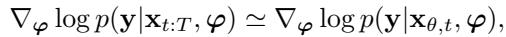

and for our measurement model in Eq. (1), the gradient is

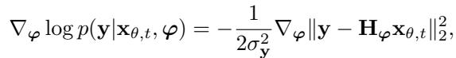

which is tractable in practice.

> 💡 **公式批读 — Eq. (15)-(16) 可算的梯度 (Hao 批注)**: Eq. (16) 是真正落地的东西：$\nabla_\varphi\log p(\mathbf{y}\mid\mathbf{x}_{\theta,t},\varphi)=-\frac{1}{2\sigma_\mathbf{y}^2}\nabla_\varphi\|\mathbf{y}-\mathbf{H}_\varphi\mathbf{x}_{\theta,t}\|_2^2$。就是**用扩散当前给出的干净预测 $\mathbf{x}_{\theta,t}$ 过一遍算子 $\mathbf{H}_\varphi$，与观测 $\mathbf{y}$ 的残差平方，对 $\varphi$ 求梯度**。对图像去模糊，$\mathbf{H}_\varphi$ 是卷积，这就是"用当前清晰图估模糊核"。这解释了 Figure 1 里核估得准的原因：核估计的监督信号来自**扩散不断精化的 $\mathbf{x}_{\theta,t}$**，而非原始含噪观测——生成模型的表征能力被喂进了核估计。

As for the second term in Eq. (12), the conditional variables can be eliminated since $\mathbf{x}_{t:T}$ and $\varphi$ are independent from Eq. (7). As a result, we can use a simple prior distribution (e.g., a Gaussian prior) for $\varphi$ that does not depend on $\mathbf{x}_{t:T}$

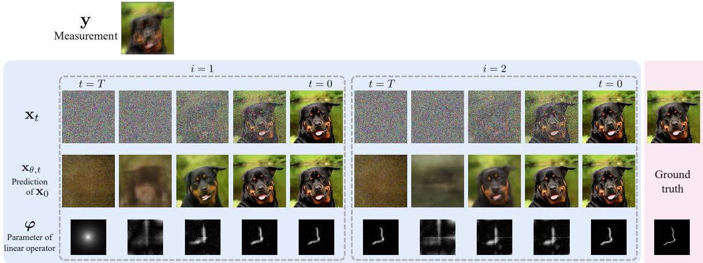
*Figure 4. Visualization of GibbsDDRM for the blind image deblurring task on the AFHQ dataset.*

> 💡 **Figure 4 批读 — 联合采样可视化 (Hao 批注)**: 这张图直观展示 $N=2$ 个 cycle 中变量随 $t$ 递减的演化：含噪 latent $\mathbf{x}_t$、干净预测 $\mathbf{x}_{\theta,t}$、估计核 $\varphi$。关键现象（对应实验节文字）：**即使 $\mathbf{x}_t$ 还很噪，$\mathbf{x}_{\theta,t}$ 已经接近真值**——这正是 Theorem 3.2 近似能用的原因（$m_1$ 小），也是核估计准的前提。核 $\varphi$ 随着采样逐步收敛，到 $t=0$ 时已很接近真值核。这张图是"图像块与算子块互相促进"的最好证据：好的 $\mathbf{x}_{\theta,t}$ → 好的 $\varphi$ → 更好的谱空间 → 更好的 $\mathbf{x}_t$，正反馈。

We now have the conditional score of $\varphi$ for the Langevin dynamics as follows:

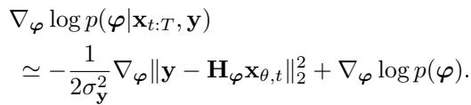

Note that at a particular time step $t$, $\mathbf{x}_t$ varies because of the Gibbs sampling, and so does $\mathbf{x}_{\theta,t}$. This iterative process can be viewed as feeding the information from the diffusion model to the parameter estimation. It allows for accurate parameter estimation even with simple priors.

We refer to the proposed PCGS as the Gibbs Denoising Diffusion Restoration Models (GibbsDDRM), and we describe the details of its instantiation for each of our experimental tasks in Appendix B.

> 💡 **公式批读 — Eq. (17) 算子块最终 score (Hao 批注)**: 合并 Eq. (16) 似然项 + 先验项，得到 $\varphi$ 的完整 Langevin score：$-\frac{1}{2\sigma_\mathbf{y}^2}\nabla_\varphi\|\mathbf{y}-\mathbf{H}_\varphi\mathbf{x}_{\theta,t}\|_2^2+\nabla_\varphi\log p(\varphi)$。前项=数据一致性（用扩散预测），后项=通用先验（图像去模糊用 Laplace，$\nabla_\varphi\log p(\varphi)=-\lambda\nabla_\varphi\|\varphi\|_1$）。最后一句是全文点睛：**"feeding the information from the diffusion model to the parameter estimation"** ——因为 $\mathbf{x}_{\theta,t}$ 随 Gibbs 迭代不断被扩散精化，所以哪怕 $p(\varphi)$ 只是简单稀疏先验，也能估准 $\varphi$。这正是相对 BlindDPS（给算子训 score 网络）的核心优势论证。

---

## 3.3. Implementation considerations

### Initialization of $\varphi$

In GibbsDDRM, the initialization for $\varphi$ is arbitrary. If an existing simple method can be used to obtain an estimate of $\varphi$, then we can use that estimate as the initial value. In our experiments, we initialize the blur kernel with a Gaussian blur kernel in the blind image deblurring task. For the vocal dereverberation task, the parameters are initialized with estimates obtained by the weighted prediction error method (WPE) (Nakatani et al., 2010), which is an unsupervised method that is not based on machine learning, to accelerate the convergence speed.

> 💡 **机制拆解 — 初始化 (Hao 批注)**: $\varphi$ 初值原则上任意（理论上 Gibbs 会收敛），但好初值加速收敛：图像用高斯模糊核起手，音频用经典无监督 WPE 算法起手。这说明方法对初始化有一定鲁棒但不是完全免疫——本课题若关心后验多模态/gauge 不变性，初始化敏感性值得单独测（本文没做）。

### Dependence of number of iterations, $M_t$, on time step

When $t$ is large, the estimation of $\mathbf{x}_0(=\mathbf{x}_{\theta,t})$ is difficult because of the large amount of noise in $\mathbf{x}_t$. This uncertainty can lead to instability in the sampling of $\varphi$. The number of sampling steps for $\varphi$ can vary across the diffusion time steps and may even be zero. Accordingly, we use a strategy of not updating $\varphi$ when $t$ is large.

> 💡 **机制拆解 — $M_t$ 随 $t$ 变 (Hao 批注)**: 直接呼应 Theorem 3.2 的误差界：$t$ 大时 $\mathbf{x}_{\theta,t}$ 不可靠（$m_1$ 大、Jensen gap 大），此时更新 $\varphi$ 会引入不稳定，所以**大 $t$ 时 $M_t=0$（不更新核）**。实验里图像取 $M_t=0$（$70\leq t\leq100$）、$M_t=3$（$t\lt70$），音频取 $M_t=0$（$40\leq t\leq50$）、$M_t=5$（$t\leq40$）。这是理论直接指导超参的漂亮例子。

---

## 🔖 Section 总结

### 关键变量/数字速查
| 符号/数字 | 含义 |
|------|------|
| $\mathbf{x}_{0:T}$ | 扩散全链 latent，全塌缩进联合分布 Eq. (7) |
| $\mathbf{x}_{\theta,t}$ | 扩散预测的干净图，**连接图像块与算子块的桥梁** |
| $\chi_t$ | 比 $t$ 更噪的 latent 集合（$\mathbf{x}_{t+1:T}$），采样条件；$\mathbf{x}_{0:t-1}$ 被 trim |
| $M_t$ | 每步内 $\varphi\leftrightarrow\mathbf{x}_t$ 交替次数（大 $t$ 时=0）|
| $N$ | cycle 数（图像/音频实验均 $N=1$）|
| $\eta,\eta_b$ | DDRM 图像块引导/随机性超参 |

### 核心洞察
1. **塌缩了什么**：把扩散全链 latent $\mathbf{x}_{0:T}$ 塞进联合分布，然后用 trimming 把采 $\mathbf{x}_t$ 时对"更干净 latent $\mathbf{x}_{0:t-1}$"的依赖去掉，使条件分布退化成 DDRM 可给的 $p_\theta(\mathbf{x}_t\mid\mathbf{x}_{t+1},\varphi,\mathbf{y})$。
2. **图像块**（Eq. 8-9）：改造 DDRM，在依赖 $\varphi$ 的 SVD 谱空间里按奇异值 + 噪声水平分维度去噪/补全。
3. **算子块**（Eq. 11-17）：Langevin，score 核心是 $-\frac{1}{2\sigma_\mathbf{y}^2}\nabla_\varphi\|\mathbf{y}-\mathbf{H}_\varphi\mathbf{x}_{\theta,t}\|^2$，用扩散预测 $\mathbf{x}_{\theta,t}$ 做监督 + 通用先验。
4. **为何比点估计更接近联合贝叶斯**：两块在每步内高频交替（PCGS），平稳分布=真后验（Prop 3.1）；且 $\varphi$ 是采样（Langevin）不是 MAP，附录 D 证明 Langevin 比 MAP 更稳定（避免长尾坏解）。

### 可追问点（本课题切入）
- 三处近似（改造 DDRM ×2 + Theorem 3.2）都非精确，Prop 3.1 的"真后验"保证在实践中打折扣——需要 SBC/coverage 检验后验是否真被采到。
- $\sigma_\mathbf{y}$ 全程当已知常数，未纳入联合采样——本课题要联合估 $\sigma$。
- 模糊核有 gauge 冗余（尺度/平移与图像互补），本文靠归一化（和为 1、非负）硬约束，未做 gauge-aware 后验处理。
