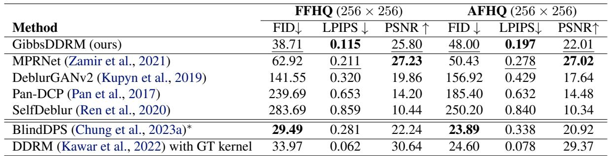
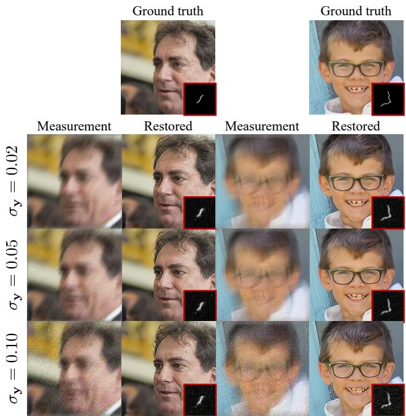
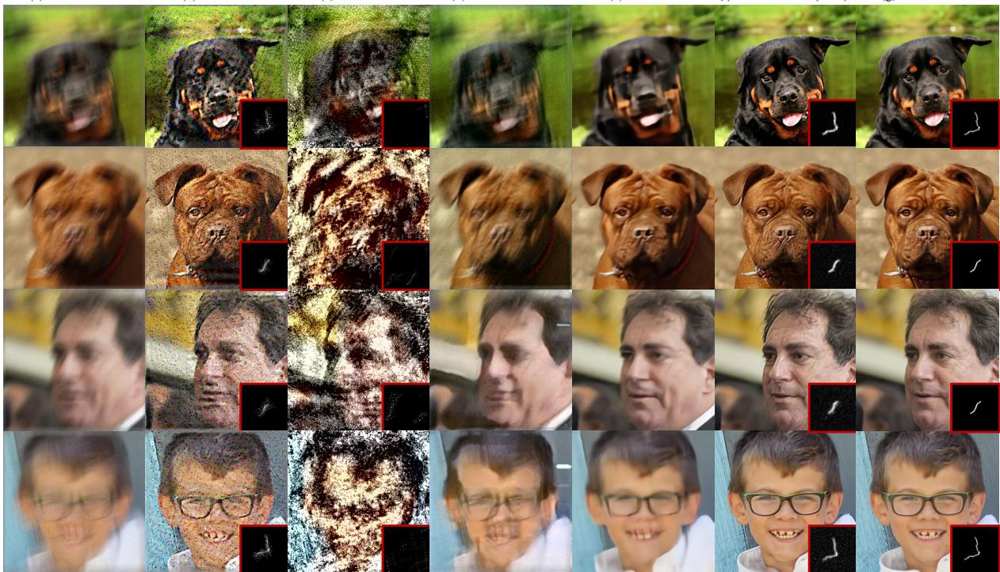
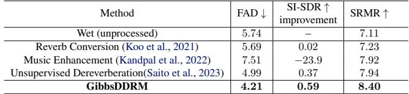

[← 返回 README](../README.md)

# 4. Experiments

## 📌 预览

两个任务、两条证据链：**4.1 盲图像去模糊**（FFHQ/AFHQ 人脸/狗脸，运动模糊 + 噪声）主打 LPIPS 保真度大幅领先，并压过用了核先验的 BlindDPS；**4.2 人声去混响**（内部干声训练 + NHSS 加人工混响测试）FAD/SI-SDR/SRMR 三项全赢。贯穿全文的指标叙事：**保真（LPIPS/SI-SDR）优先于纯生成质量（FID/FAD）**。

---

We demonstrate our approach through two tasks: blind image deblurring in the image processing domain and vocal dereverberation in the audio processing domain.

## 4.1. Blind image deblurring.

The aim of blind image deblurring is to restore a clean image from a noisy blurred image without knowledge of the blur kernel. The details of the problem formulation and its instantiation as a linear inverse problem are given in Appendix B. Our code is available at https://github.com/sony/gibbsddrm.

Experimental settings. We conduct experiments on the Flickr Face High Quality (FFHQ) 256 × 256 dataset (Karras et al., 2019) and the Animal Faces-HQ (AFHQ) 256 × 256 dataset (Choi et al., 2020b). We use a 1000-image validation set for FFHQ and a 500-image test set for the dog class in AFHQ. All images are normalized to the range [0, 1]. The blur type used is motion blur, and blur kernels of size $64\times64$ are generated via code, with an intensity value of 0.5. We use the pre-trained diffusion models from (Choi et al., 2021) for FFHQ and from (Dhariwal & Nichol, 2021) for AFHQ, without finetuning for this task. Measurements are generated by convolving the blur kernel with a ground truth image and adding Gaussian noise with $\sigma_\mathbf{y}=0.02$. We use $\eta=0.80$ and $\eta_b=0.90$ for the proposed method. The number of steps, $T$, is set to 100, and $N$ is set to 1. Following the discussion in Section 3.3, $M_t$ is set to 0 for $70\leq t\leq100$ and to 3 for $t\lt70$. The number of iterations and the step size for Langevin dynamics (Eq. (16)) are set to 500 and $1.0\times10^{-11}$, respectively. The blur kernel is initialized with a Gaussian blur kernel and normalized to have non-negative values and a sum of $1.0$, which remains normalized throughout the processing. We use a Laplace prior for the parameters $\varphi$, which has the form $\nabla_\varphi\log p(\varphi)=-\lambda\nabla_\varphi\|\varphi\|_1$. The diversity hyperparameter $\lambda$ is set to $10^3$.

> 💡 **实验设置批读 (Hao 批注)**: 几个数字要记住并做批判。（1）**预训练扩散不微调**——兑现 problem-agnostic。（2）$\sigma_\mathbf{y}=0.02$ 已知——再次强调噪声水平被当已知。（3）$T=100,N=1$——单遍扩散，$\varphi$ 只在 $t\lt70$ 更新，每步 3 次（$M_t=3$），每次 Langevin 内部又跑 500 步——所以 $\varphi$ 总更新量其实很大（$70\times3\times500$），核估计的计算主要花在这里。（4）核归一化（非负、和=1）是**处理 gauge 冗余的硬约束**——模糊核的尺度和图像亮度存在互补冗余，归一化消掉尺度自由度；本课题的 gauge-aware 后验可对照这里。（5）Laplace 先验 $\lambda=10^3$ 很强，鼓励核稀疏。

Table 1. Blind image deblurring results on FFHQ and AFHQ $(256\times256)$. The blurred images have additive Gaussian noise with $\sigma_\mathbf{y}=0.02$. (∗) The results for BlindDPS (Chung et al., 2023a), as reported in the original paper, are also listed, although that method uses a pre-trained score function for blur kernels. The results of DDRM (Kawar et al., 2022) with the ground truth kernels (i.e., non-blind setting) are also listed. Bold: Best. underscore: second best.

*Table 1. Blind image deblurring results on FFHQ and AFHQ (256×256).*

> 💡 **Table 1 批读 — 主结果证据链 (Hao 批注)**: 这是图像任务的核心证据表。读三条线：
> 1. **LPIPS（保真/感知）是主战场**：GibbsDDRM FFHQ 0.115 / AFHQ 0.197，把所有盲方法甩开——包括 BlindDPS（0.281/0.338）。这是全文最硬的 claim：**在保真度上碾压用了核先验的 BlindDPS**。
> 2. **FID（纯质量）不是最优**：BlindDPS FID 更低（29.49/23.89 vs 38.71/48.00）。作者自己承认并解释：BlindDPS "生成过头"，对含噪观测做了超出必要的生成，牺牲了保真。这正是"FID 好 ≠ 恢复对"的经典张力。
> 3. **PSNR 上监督法 MPRNet 更高**（27.23/27.02 vs 25.80/22.01）：因为 MPRNet 专门在运动模糊上训练，PSNR 偏向平滑；但它 FID/LPIPS 差、视觉发糊。
> 4. **性能天花板**：DDRM + 真值核（非盲）LPIPS 0.062/0.078、PSNR 30+——这是 GibbsDDRM 盲设置的上界，差距量化了"核未知"付出的代价。

Comparison methods. We compare GibbsDDRM with several other methods as baselines. These include MPR-Net (Zamir et al., 2021) and DeblurGANv2 (Kupyn et al., 2019) as supervised learning-based baselines, pan-dark channel prior (Pan-DCP) (Pan et al., 2017) as an optimization-based method, and SelfDeblur (Ren et al., 2020), which utilizes deep image prior (DIP) for co-estimation of the data and kernel. We also list the results for BlindDPS (Chung et al., 2023a) as reported in that paper, although it uses a prior for the blur kernel that is trained in a supervised manner, thus giving it an unfair advantage.

Evaluation metrics. For quantitative comparison of the different methods, the main metrics are the peak signal-to-noise-ratio (PSNR), the Learned Perceptual Image Patch Similarity (LPIPS) (Zhang et al., 2018), and the Fréchet Inception Distance (FID) (Heusel et al., 2017).

> 💡 **指标辨析 (Hao 批注)**: 三指标性质不同要分清：**PSNR** 像素级保真（偏向平滑，惩罚高频），**LPIPS** 深度特征感知相似度（本文主指标，衡量"看起来像不像原图"），**FID** 分布级质量（衡量"像不像真实图像分布"，不管是否对应原图）。本文的立场很明确：盲逆问题要的是**忠实恢复原图**（LPIPS/PSNR），而非生成好看的图（FID）。这个立场决定了整篇的结论叙事。

Results. Table 1 summarizes the quantitative results of blind image deblurring on FFHQ and AFHQ. While showing a lower FID score, which measures the quality of generated data, GibbsDDRM outperforms all the other methods in terms of the LPIPS, which measures faithfulness to the original image. To investigate the performance limit of our method, we also list the results of DDRM with a ground truth kernel.

Figure 4 visualizes the evolution of the variables for $N=2$. We can see that even in steps where $\mathbf{x}_t$ is still quite noisy, the estimated $\mathbf{x}_{\theta,t}$ is close to the ground truth. This leads to an accurate sampling of the blur kernel, which is quite close to the ground truth at $t=0$.

> 💡 **证据链批读 — 呼应 Figure 4 (Hao 批注)**: 这段把 Figure 4（在方法节）与主结果连起来：核估准的机理是"$\mathbf{x}_{\theta,t}$ 早早接近真值 → 反馈给 Langevin 核采样"，直接兑现 Theorem 3.2 的近似有效性论证。

Figure 5 shows the restoration results for different measurement noise levels. We can see that even with large noise, a faithful image can be restored via the SVD.

*Figure 5. Blurry images and restored images obtained with a restored blur kernel in blind image deblurring under different measurement noise conditions. The top row contains the ground truth images and blur kernels.*

> 💡 **Figure 5 批读 — 噪声鲁棒性 (Hao 批注)**: 这张图支撑"大测量噪声下仍能忠实恢复"的 claim。不同噪声水平下恢复图和估计核都保持合理——机理是 DDRM 的 SVD 谱空间**显式建模测量噪声**（Eq. 9 的第三种情形 $\sigma_t\geq\sigma_\mathbf{y}/s_i$ 会按噪声方差调整），噪声大的维度自动更依赖扩散先验而非观测。这是相对纯优化盲去卷积（对噪声敏感）的结构性优势。批判点：这里噪声水平仍是**已知**输入进 SVD 公式的；若 $\sigma_\mathbf{y}$ 估错，SVD 分维决策会错——本课题联合估 $\sigma$ 正是要解决这个脆弱点。

We find that BlindDPS has a lower (better) FID score, but the restored images are relatively far from the original image in terms of the quantitative results. We think that this is because our method uses DDRM, which enables efficient treatment of information obtained from measurements through the SVD, whereas BlindDPS performs more generation than is necessary for noisy observations, which may negatively affect its faithfulness.

> 💡 **与 baseline 差异深挖 (Hao 批注)**: 这段是全文对 BlindDPS 最完整的机理性反驳。核心论点：**DDRM 的 SVD 让观测信息被"高效、精准"地利用**（谱空间按奇异值分维度，该信观测的信观测），而 **BlindDPS 用 DPS 式引导，倾向于"生成过头"**——对含噪观测做了超出必要的生成，结果 FID 好看但偏离原图。这条区别对本课题很有启发：SVD 谱空间是一种强结构化的似然处理方式，可能比通用 DPS 引导更适合"参数化算子 + 需要校准"的场景。

Figure 6 shows the results obtained by our method and the comparison methods. The supervised method MPR achieves the highest PSNR of all the methods, but our method outperforms it in FID and LPIPS. It is observed that the images obtained by the MPRNet exhibit a certain degree of blurriness when compared to the ground truth images, whereas the images obtained by GibbsDDRM look to be of superior quality in terms of visual perception.

*Figure 6. Blind image deblurring results on the FFHQ and AFHQ datasets: (a) measurements, (b) Pan-DCP, (c) SelfDeblur, (d) DeblurGANv2, (e) MPRNet, (f) GibbsDDRM (ours), and (g) ground truth. The kernels are also shown for methods that estimate them.*

> 💡 **Figure 6 批读 — 定性对比 (Hao 批注)**: 七列横排把所有方法摆一起。要看的对比：Pan-DCP/SelfDeblur（优化/DIP 类）在大核 + 噪声下基本崩（与附录 D 文字一致）；DeblurGANv2 有伪影；MPRNet（监督、PSNR 最高）视觉发糊、缺细节；GibbsDDRM 最锐利、细节最接近真值。这张图是"PSNR 高 ≠ 视觉好"的直接视觉证据，支撑本文"LPIPS 优于 PSNR 作为盲恢复主指标"的立场。

GibbsDDRM takes approximately 56 seconds of computation time per image using one RTX3090 with a batch size of 4.

> 💡 **效率批读 (Hao 批注)**: 56 秒/图（RTX3090，batch 4）。这是采样类方法的通病——比前馈监督法（MPRNet 毫秒级）慢几个数量级，代价来自 $T=100$ 步扩散 × 每步 $\varphi$ 的 500 步 Langevin × 每次重算 SVD。本课题若走联合采样路线，推理成本是绕不开的现实约束，值得在方法设计时就考虑摊销（如 amortized/学习式提议）。

## 4.2. Vocal dereverberation

Problem formulation. The objective of vocal dereverberation is to restore the original dry vocal from a noisy, reverberant (wet) vocal. Appendix B gives the details of the problem formulation and the specific implementation of the GibbsDDRM that we use for this task.

Experimental settings. The proposed method is quantitatively evaluated on wet vocal signals. A pre-trained diffusion model is trained with dry vocal signals from an internal proprietary dataset of various genres and singers, with a total duration of 15 hours. A test dataset comprising 1000 wet vocal signals, with a total duration of around 1.4 hours, is prepared by adding artificial reverb to dry vocal signals from the NHSS dataset (Sharma et al., 2021), which contains 100 English pop songs by different singers, with a total duration of 285.24 minutes. Both the training and testing data are monaural recordings sampled at 44.1 kHz. The artificial reverb is added with commercial software by using 10 presets with an RT60 shorter than 2 seconds. The wet vocal signals are prepared by creating 100 × 10 signals, dividing them into 5-second samples, and randomly selecting 1000 of the resulting signals.

For the GibbsDDRM algorithm, the following parameter values are used: $\eta=0.8$, $\eta_b=0.8$, and $\sigma_y=1.0\times10^{-3}$. We set $T=50$ for the number of sampling steps and $N=1$. The parameter $M$ is set to zero for $40\leq t\leq50$, and to 5 for $t\leq40$. The linear operator's parameters are initialized using results from the WPE algorithm (Nakatani et al., 2010), which is an unsupervised method for dereverberation. The number of iterations and the learning rate for Langevin dynamics (Eq. (16)) are set to 400 and $1.0\times10^{-13}$, respectively. We use a Laplace prior, and the diversity hyperparameter $\lambda$ is set to 2.0. Appendix C gives the details of the network architecture and the dataset.

> 💡 **跨域泛化批读 (Hao 批注)**: 这一节兑现 problem-agnostic：同一套 GibbsDDRM 框架换个任务。算子 $\varphi$ 从"模糊核"变成"声学传递函数 $g_{l,f}$"（附录 B Eq. 34，STFT 域卷积），SVD 同样用 FFT 高效算。注意跨域后超参也换了（$T=50$、$M_t=5$、Langevin lr $10^{-13}$、$\lambda=2.0$），且初始化用领域专用的 WPE——说明"problem-agnostic"是指**框架和数据侧扩散模型可复用**，但算子侧实例化和超参仍需按任务调。这是诚实的定位。

Table 2. Vocal dereverberation results. Bold: Best.

*Table 2. Vocal dereverberation results. Bold: Best.*

> 💡 **Table 2 批读 — 音频证据链 (Hao 批注)**: 三指标全赢。**FAD 4.21**（质量，越低越好）优于所有基线含无监督 UD（4.99）；**SI-SDR improvement +0.59**（信号接近度，越高越好）最好；**SRMR 8.40**（去混响程度）最高。最关键对比是 **UD（Saito et al., 2023）**——它同样用 DDRM，唯一差别是**算子参数估计方式不同**。GibbsDDRM 全面超 UD，直接证明"用 PCGS 联合采样估算子" > "UD 的估计方式"。ME（Music Enhancement）完全失效（SI-SDR -23.9），作者归因于训练/测试分布不匹配——这也侧面说明监督法的脆弱性 vs 本文 problem-agnostic 的鲁棒。

Comparison methods. We evaluate the proposed method against three baselines: Reverb Conversion (RC) (Koo et al., 2021), Music Enhancement (ME) (Kandpal et al., 2022), and Unsupervised Dereverberation (UD) (Saito et al., 2023). RC is a state-of-the-art, end-to-end, DNN-based method that requires pairs of wet and dry vocal signals for dereverberation. It is trained with wet and dry vocal signals that are obtained with different commercial reverb plugins from those used for the test dataset. ME is a supervised method based on diffusion models that denoise and dereverb music signals containing vocal signals. It is trained with pairs of 16-kHz reverberant noisy and clean music signals and is evaluated at 16 kHz. UD is a method similar to ours, in that it uses DDRM; however, it differs in how it estimates the linear operator's parameters.

Evaluation metrics. For quantitative comparison of the different methods, the metrics are the scale-invariant signal-to-distortion ratio (SI-SDR) (Roux et al., 2019) improvement, the Fréchet Audio Distance (FAD) (Kilgour et al., 2018), and the speech-to-reverberation modulation energy ratio (SRMR) (Santos et al., 2014). Because the FAD uses the pre-trained classification model VGGish (Hershey et al., 2017), which is originally trained with 16 kHz audio samples, we downsample all the signals to 16 kHz to compute FAD.

Results. Table 2 lists the scores for each metric. GibbsDDRM outperforms the comparison methods on all metrics. In particular, the result for UD demonstrates that our proposed way of estimating the linear operator's parameters gives better performance than UD's way. Moreover, ME doesn't work at all, which may have been because the distribution of its training dataset does not cover that of its test dataset. Indeed, the wet signals for ME's training are created using only simulated natural reverb with some background noise (Kandpal et al., 2022).

> 💡 **消融式解读 — UD 对照 (Hao 批注)**: UD 是本文最有价值的"准消融"：控制变量到只剩"算子参数估计方式"。GibbsDDRM 用 PCGS 联合采样（Langevin 采 $\varphi$）胜过 UD 的估计方式，全指标领先，这是对方法核心（联合采样 vs 分离估计）最干净的支撑。结合附录 D.3 的 Langevin vs MAP 对比（Langevin 更稳定），可以推断：**"采样式"参数估计比"点估计/优化式"更鲁棒**——这与本课题主张的"联合后验采样优于点估计"完全一致，是可直接引用的证据。

---

## 🔖 Section 总结

### 关键数字速查
| 任务/指标 | GibbsDDRM | 最强对手 | 备注 |
|------|------|------|------|
| 去模糊 FFHQ LPIPS↓ | **0.115** | BlindDPS 0.281 | 主指标，碾压 |
| 去模糊 FFHQ FID↓ | 38.71 | BlindDPS **29.49** | 纯质量输，但保真赢 |
| 去模糊 FFHQ PSNR↑ | 25.80 | MPRNet **27.23** | 监督法偏平滑 |
| 去模糊上界（DDRM+GT核）| LPIPS 0.062 | — | 盲设置的天花板 |
| 去混响 FAD↓ | **4.21** | UD 4.99 | 全指标赢 |
| 去混响 SI-SDR↑ | **+0.59** | UD +0.37 | 关键准消融 |
| 单图耗时 | 56 s (RTX3090) | — | 采样法通病 |

### 核心洞察
1. **主 claim**：保真度（LPIPS/SI-SDR）大幅领先，包括压过用核先验的 BlindDPS 和同用 DDRM 的 UD。
2. **指标张力**：FID/FAD 上不一定最优，作者明确取"忠实恢复 > 生成质量"的立场。
3. **UD 准消融**证明"PCGS 联合采样估算子" > "分离式估计"，与本课题理念一致。
4. **problem-agnostic 的真实边界**：框架 + 数据侧扩散可复用，但算子实例化 + 超参 + 初始化仍需按任务调。

### 可追问点
- 所有指标都是点估计层面的；没有任何后验校准检验（coverage/CRPS/SBC），无法判断"联合后验是否被正确采到"——本课题核心缺口。
- $\sigma_\mathbf{y}$ 两任务均已知给定；噪声水平估错的敏感性未测。
