[← 返回 README](../README.md)

# Appendix

## 📌 预览

附录四块：**A. 证明**（Prop 3.1 用 PCGS 三工具从朴素 Gibbs 变形而来；Theorem 3.2 用高斯密度 Lipschitz 常数界 Jensen gap）；**B. 实例化**（去模糊=卷积核 Eq. 33、去混响=STFT 域声学传递函数 Eq. 34，都用 FFT 做 SVD）；**C. 实验细节**（对比法配置、扩散模型架构 Table 3）；**D. 附加结果**（Table 4 超参消融、Figure 7 Langevin vs MAP 稳定性、Figure 8/9 更多定性图）。

---

## A. Proofs

### A.1. Proof of Proposition 3.1

Proposition 3.1 The PCGS defined in Algorithm 1 has the true posterior distribution $p(\mathbf{x}_{0:T},\varphi\mid\mathbf{y})$ as its stationary distribution if the approximations to the conditional distributions are exact.

Before giving the proof, we revisit three basic tools for constructing a partially collapsed Gibbs sampler (PCGS) (Van Dyk & Park, 2008).

Gibbs sampler. Let $\boldsymbol{\theta}=(\theta_1,\ldots,\theta_J)^\top$ be a vector of J variables, and let $\theta_{\widetilde{j}}$ denote $\theta$ without the $j$th element $\theta_j$. To obtain samples from $p(\boldsymbol{\theta})$, a Gibbs sampler (Casella & George, 1992) iteratively generates samples of each $\theta_j$ from $p(\theta_j\mid\theta_{\tilde{j}})$ in an arbitrary order. The generated samples approximate the joint distribution of all variables.

PCGS. A PCGS is an extension of the Gibbs sampler that facilitates the following three basic tools (see (Van Dyk & Park, 2008) for details).

- Marginalization. Rather than sampling only $\theta_j$ in a step, other variables may be sampled with $\theta_j$ instead of being conditioned on. This process is called marginalization, and it can improve the convergence rate significantly, especially with a strong correlation between the target variables. Within an entire PCGS iteration, certain parameters can be sampled in more than one step.

- Trimming. If a variable is sampled in several steps and is not used as a condition on these steps, only the value sampled in the last step is relevant because the other values are never used. Such unused variables can thus be removed from the respective sampling distribution. This reduces the complexity of the sampling steps without affecting the convergence behavior.

- Permutation. It is reasonable to choose an (arbitrary) sampling order such that trimming can be performed. After trimming, permutations are only allowed if they preserve the justification of the trimming that has already been applied.

For example, the following PCGS for sampling (X, Y, Z, W) is a simple PCGS.

Step 1. Sample Y from $p(\mathbf{Y},\mathbf{W}\mid\mathbf{X},\mathbf{Z})$

Step 2. Sample Z from $p(\mathbf{Z},\mathbf{W}\mid\mathbf{X},\mathbf{Y})$

Step 3. Sample W from $p(\mathbf{W}\mid\mathbf{X},\mathbf{Y},\mathbf{Z})$

Step 4. Sample X from $p(\mathbf{X}\mid\mathbf{W},\mathbf{Y},\mathbf{Z})$

(18)

Here, the random variable W is trimmed in steps 1 and 2 because it is sampled in step 3 before being included in the conditional variables. Note that the order of steps 3 and 4 cannot be interchanged. The reason is that the variable W, which is trimmed in steps 1 and 2, would be included among the conditional variables in $p(\mathbf{X}\mid\mathbf{W},\mathbf{Y},\mathbf{Z})$, thus altering the sampler's stationary distribution.

> 💡 **机制拆解 — PCGS 玩具例子 (Hao 批注)**: Eq. (18) 这个 (X,Y,Z,W) 例子是理解 trimming 的最佳教具。W 在步 1、2 里被"顺带采"（marginalization）但没当条件，所以那两次的 W 值无用、被 trim；W 真正有效的采样在步 3。**步 3、4 不能交换**是关键：若先采 X（$p(\mathbf{X}\mid\mathbf{W},\mathbf{Y},\mathbf{Z})$），则 W 会以"被 trim 的旧值"身份进入 X 的条件集，破坏平稳分布。映射到 GibbsDDRM：$\varphi$ 类比 W（被反复采），$\mathbf{x}_t$ 采样顺序必须让被 trim 的 latent 不回流进条件集——这就是 Figure 3 采样顺序必须精心设计的原因。

Proof. To show that the proposed sample is a valid PCGS, we transform a naïve Gibbs sampler by applying the above PCGS tools to the proposed PCGS. First, we consider the naïve Gibbs sampler defined in Algorithm 2, which we denote as Sampler 1.

Sampler 1 has a stationary distribution $p(\mathbf{x}_{0:T},\varphi\mid\mathbf{y})$, since it is a naïve Gibbs sampler for the joint distribution in Eq. (7). In Gibbs sampling, the stationary distribution is unaffected by repeating certain steps and changing the order of the steps. Therefore, the sampling scheme depicted in Figure 3 constructs Sampler 2, which is defined in Algorithm 3.

Next, Sampler 2 is converted to Sampler 3, which is defined in Algorithm 4, by marginalizing the variables $\psi_t$. Subsequently, we convert the Sampler 3 to our proposed sampler by employing the PCGS trimming operation and approximating the conditional distributions. The variables $\psi_t$ for $t=0,1,\ldots,T$ can be trimmed from Sampler 3, as they do not appear in the conditional variables of the conditional distribution before they are next sampled. Because the proposed PCGS corresponds to a sampler that omits $\psi_t$ from Sampler 3, it has the true posterior distribution $p(\mathbf{x}_{0:T}\mid\mathbf{y})$ as its stationary distribution. Thus if the approximations for the conditional distributions are exact, the PCGS has the true posterior distribution as its stationary distribution. □

> 💡 **证明骨架 (Hao 批注)**: 证明是"三步变形"：Sampler 1（朴素 Gibbs，平稳分布=真后验，天然成立）→ Sampler 2（重复某些步 + 换顺序，Gibbs 性质保证平稳分布不变，得到 Figure 3 的调度）→ Sampler 3（边缘化辅助变量 $\psi_t$）→ 最终 PCGS（trim 掉 $\psi_t$）。每步变换都是 PCGS 三工具的合法操作，故平稳分布始终是真后验。**$\psi_t$ 是那些"更干净的 latent $\mathbf{x}_{0:t-1}$"的占位**——它们被边缘化再修剪，正是"部分塌缩"名字的由来。注意结论仍带前提"若近似精确"，实际近似不精确（见方法节 Prop 3.1 批注）。

Algorithm 2 Sampler 1 for the posterior in Eq. (7)
```
Input: Measurement y, initial values φ^(0), x_{0:T}^(0)
Output: Restored data x_0^(N), linear operator's parameters φ^(N)
for n = 1 to N do
    Sample x_T^(n) ~ p(x_T | x_{0:T-1}^(n-1), φ^(n-1), y)
    for t = T-1 to 0 do
        Sample x_t^(n) ~ p(x_t | x_{0:t-1}^(n-1), x_{t+1:T}^(n), φ^(n-1), y)
    end for
    φ^(n) ~ p(φ | x_{0:T}^(n), y)
end for
```

Algorithm 3 Sampler 2 for the posterior in Eq. (7)
```
Input: Measurement y, initial values φ^(0,0), x_{0:T}^(0,M_0)
Output: Restored data x_0^(N,M_0), parameters of linear operator φ^(N,K)
K ← 0    // K counts the number of updates for φ in a cycle.
for n = 1 to N do
    φ^(n,0) ← φ^(n-1,K);  K ← 0
    ψ_T ← { x_0^(n-1,M_0), x_1^(n-1,M_1), ..., x_t^(n-1,M_t), ..., x_{T-1}^(n-1,M_{T-1}) }
    Sample x_T^(n,0) ~ p(x_T | φ^(n,K), ψ_T, y)
    for t = T-1 to 0 do
        ψ_t ← { x_0^(n-1,M_0), x_1^(n-1,M_1), ..., x_{t-1}^(n-1,M_{t-1}) }
        χ_t ← { x_{t+1}^(n,M_{t+1}), x_{t+2}^(n,M_{t+2}), ..., x_T^(n,0) }
        Sample x_t^(n,0) ~ p(x_t | φ^(n,K), ψ_t, χ_t, y)
        for m = 1 to M_t do
            Sample φ^(n,K+1) ~ p(φ | x_t^(n,m-1), ψ_t, χ_t, y)
            K ← K + 1
            Sample x_t^(n,m) ~ p(x_t | φ^(n,K), ψ_t, χ_t, y)
        end for
    end for
end for
```

Algorithm 4 Sampler 3 for the posterior in Eq. (7)
```
Input: Measurement y, initial values φ^(0,0), x_{0:T}^(0,M_0)
Output: Restored data x_0^(N,M_0), parameters of linear operator φ^(N,K)
K ← 0    // K counts the number of updates for φ in a cycle.
for n = 1 to N do
    φ^(n,0) ← φ^(n-1,K);  K ← 0
    ψ_T ← { x_0^(n-1,M_0), x_1^(n-1,M_1), ..., x_t^(n-1,M_t), ..., x_{T-1}^(n-1,M_{T-1}) }
    Sample { x_T^(n,0), ψ_T } ~ p(x_T | φ^(n,K), y)
    for t = T-1 to 0 do
        ψ_t ← { x_0^(n-1,M_0), x_1^(n-1,M_1), ..., x_{t-1}^(n-1,M_{t-1}) }
        χ_t ← { x_{t+1}^(n,M_{t+1}), x_{t+2}^(n,M_{t+2}), ..., x_T^(n,0) }
        Sample { x_t^(n,0), ψ_t } ~ p(x_t | φ^(n,K), χ_t, y)
        for m = 1 to M_t do
            Sample { φ^(n,K+1), ψ_t } ~ p(φ | x_t^(n,m-1), χ_t, y)
            K ← K + 1
            Sample { x_t^(n,m), ψ_t } ~ p(x_t | φ^(n,K), χ_t, y)
        end for
    end for
end for
```

> 💡 **三个 Sampler 对照 (Hao 批注)**: 对照读三个算法就懂"塌缩"发生在哪。**Sampler 1**（朴素）：采 $\mathbf{x}_t$ 条件在 $\mathbf{x}_{0:t-1}$ 上（那个 intractable 的依赖），$\varphi$ 每整条链才采一次。**Sampler 2**：引入 $\psi_t$（旧的更干净 latent）显式当条件，$\varphi$ 已经在每步内交替 $M_t$ 次。**Sampler 3**：把 $\psi_t$ 从"条件"改成"顺带采样"（marginalization，用花括号 `{·, ψ_t}` 标记）。最终 PCGS（Algorithm 1）= Sampler 3 里 trim 掉 $\psi_t$。核心收获：Algorithm 1 里干净的 $p_\theta(\mathbf{x}_t\mid\mathbf{x}_{t+1},\varphi,\mathbf{y})$ 之所以合法，是这一串保平稳分布的变形换来的。

### A.2. Proof of Theorem 3.2

We follow the result from (Chung et al., 2023b;a). First, we confirm the following lemmas.

Lemma A.1. Let $\phi(\cdot)$ be a univariate Gaussian density function with mean $\mu$ and variance $\sigma^2$. $\phi(\cdot)$ is L-Lipschitz such that $\forall x_1,x_2\in\mathbb{R}$

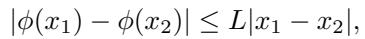

where $L=\frac{1}{\sqrt{2\pi}\sigma^2}e^{-1/2}$.

Proof. Since $\phi(\cdot)$ is an everywhere differentiable function and it has the bounded first derivative, we use the mean value theorem to get

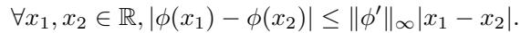

Since L is the minimal value for Eq. (19), we have that $L\leq\|\phi'\|_\infty$. Taking the limit $x_2\to x_1$ gives $|\phi'(x)|\leq L$, and thus $\|\phi'\|_\infty\leq L$. Hence

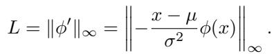

Since the derivative of $\phi'$ is given as

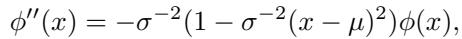

and the maximum is attained when $x=\mu\pm\sigma$, we have

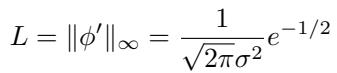

Lemma A.2. Let $f(\cdot)$ be an isotropic multivariate Gaussian density function with mean $\boldsymbol{\mu}$ and variance $\sigma^2\mathbf{I}$. $f(\cdot)$ is L-Lipschitz such that $\forall\mathbf{x}_1,\mathbf{x}_2\in\mathbb{R}^d$

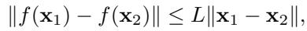

where

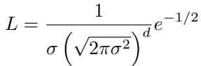

Proof. We first evaluate the value of $\max_\mathbf{x}\|\nabla f(\mathbf{x})\|$, where $f(\mathbf{x})=\prod_{i=1}^d\phi(x_i)$. Without loss of generality, we assume

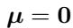

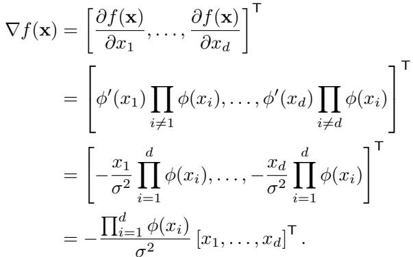

Therefore, $\max_\mathbf{x}\|\nabla f(\mathbf{x})\|$ can be evaluated as follows,

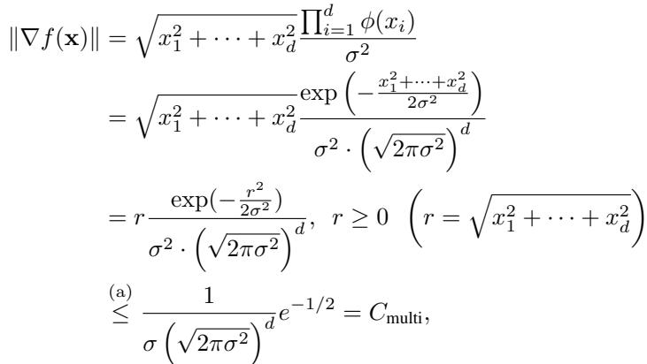

where the equality holds when $r(=\sqrt{x_1^2+\cdots+x_d^2})=\sigma$. (a) is by the result of the lemma A.1. Here, by the mean value theorem, for any $\mathbf{x}_1,\mathbf{x}_2\in\mathbb{R}^d$, the following holds:

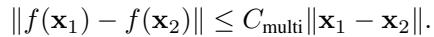

By setting $\mathbf{x}_1=[\sigma,0,\ldots,0]^\top$ and taking the limit $\mathbf{x}_2\to\mathbf{x}_1$, the equality holds. Hence, $f(\cdot)$ is L-Lipschitz with the Lipschitz constant $L=C_\text{multi}$. □

Lemma A.3. Let $\mathbf{H}\in\mathbb{R}^{d_\mathbf{y}\times d_\mathbf{x}}$ be a linear operator. The linear operator is L-Lipschitz such that $\forall\mathbf{x}_1,\mathbf{x}_2\in\mathbb{R}^{d_\mathbf{x}}$

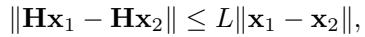

where L is the largest singular value of H.

This property has been reported in several papers, such as (Miyato et al., 2018).

Theorem 3.2 (modified version of Theorem 1 in (Chung et al., 2023b)) For the measurement model in Eq. (1), we have

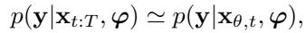

and the approximation error can be quantified with the Jensen gap (Gao et al., 2017), which is upper bounded by

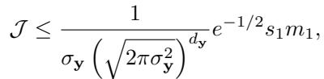

where $m_1:=\int\|\mathbf{x}_0-\mathbf{x}_{\theta,t}\|p(\mathbf{x}_0\mid\mathbf{x}_{t:T})d\mathbf{x}_0$, and $s_1$ is the largest singular value of $\mathbf{H}_\varphi$.

Proof. In our case, the Jensen gap (Gao et al., 2017) is defined as follows:

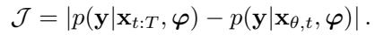

Let $f(\boldsymbol{\mu})$ be an isotropic multivariate Gaussian density function with mean $\boldsymbol{\mu}$ and variance $\sigma_\mathbf{y}^2\mathbf{I}$, and thus $p(\mathbf{y}\mid\mathbf{x}_0,\varphi)=f(\mathbf{H}_\varphi\mathbf{x}_0)$ in our case. The Jensen gap is evaluated as follows:

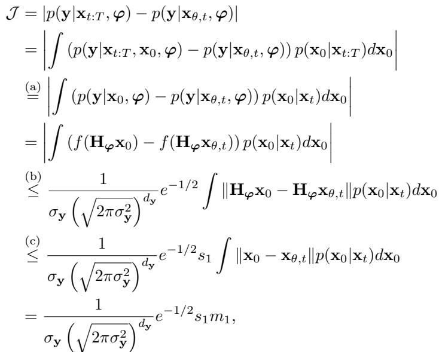

where (a) is by the conditional independence of y and $\mathbf{x}_{t:T}$ given $\mathbf{x}_0$ and the Markov property of $\mathbf{x}_{t:T}$, and (b) and (c) are by the lemmas A.2 and A.3. □

> 💡 **证明批读 — Jensen gap 界的意义 (Hao 批注)**: 三个引理拼出 Theorem 3.2 的误差界。Lemma A.1/A.2 给高斯密度的 Lipschitz 常数 $L\propto\frac{1}{\sigma_\mathbf{y}(\sqrt{2\pi\sigma_\mathbf{y}^2})^{d_\mathbf{y}}}e^{-1/2}$；Lemma A.3 给线性算子的 Lipschitz 常数=最大奇异值 $s_1$。合起来（Eq. 31）：误差 $\leq L\cdot s_1\cdot m_1$，其中 $m_1=\mathbb{E}\|\mathbf{x}_0-\mathbf{x}_{\theta,t}\|$ 是预测偏差。**三个含义**：（1）$m_1$ 随 $t$ 减小 → 小 $t$ 时近似准（支撑 $M_t$ 策略）；（2）误差正比 $s_1$（最大奇异值）→ 算子病态时更不准；（3）误差含 $\sigma_\mathbf{y}$（噪声）→ 噪声水平影响近似质量，若 $\sigma_\mathbf{y}$ 估错会连带影响。这个界是"用扩散预测代替真 $\mathbf{x}_0$"这一核心近似的定量保证，也是本课题评估近似误差可借鉴的分析工具。

---

## B. Instantiation of blind linear inverse problems

Blind image deblurring. The aim of blind image deblurring is to restore a clean image from a noisy blurred image without knowledge of the blur kernel. The problem is formulated as follows:

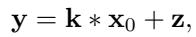

where k is the blur kernel, corresponding to the parameters $\varphi$ in our setting, and ∗ denotes the convolution operator. Although dealing with this problem in our framework requires the SVD of the convolution operator, it can be computed efficiently by using an FFT (Sedghi et al., 2019; Kruse et al., 2017). Thus, the SVD enables efficient calculation in the spectral domain. In performing the SVD with an FFT, it is necessary to consider signals in the complex domain; however, the proposed method can be naturally extended to the complex case.

Vocal dereverberation. The details of dealing with vocal dereverberation as a linear inverse problem are discussed in (Saito et al., 2023). Let $y_{\tau,f}^\text{wet}\in\mathbb{C}$ be the wet (reverberant) vocal signals in a short-time Fourier transform (STFT) domain, where τ and $f$ denote the respective time and frequency indices. We use the following measurement model:

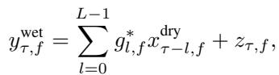

where $x_{\tau,f}^\text{dry}\in\mathbb{C}$ and $g_{\tau,f}\in\mathbb{C}$ are the dry vocal signals and the acoustic transfer function between wet and dry signals, respectively. Here, we assume additive noise $z_{\tau,f}\in\mathbb{C}$. $(.)^*$ denotes the complex conjugate, and $L$ is the length of reverberation. As with blind image deblurring, the linear operator, in this case, is a convolution operator whose acoustic transfer function is unknown. Thus, the efficient method of performing the SVD by using an FFT is applicable.

> 💡 **实例化批读 — 两任务统一到卷积 (Hao 批注)**: 这是 problem-agnostic 的技术根基。两任务的算子**都是卷积**：图像 Eq. (33) $\mathbf{y}=\mathbf{k}*\mathbf{x}_0+\mathbf{z}$（$\varphi=$ 模糊核 $\mathbf{k}$）；音频 Eq. (34) 是 STFT 域的时间卷积（$\varphi=$ 声学传递函数 $g_{l,f}$，$L$=混响长度）。卷积的 SVD 可用 **FFT 高效计算**——这正是全文效率的关键，也是"SVD 不可行则不适用"局限的另一面。**对本课题的启示**：GibbsDDRM 的适用面 = "算子能参数化成结构化线性变换（卷积/可 FFT 对角化）"的场景；我们若要突破，需要处理非结构化或非线性算子的 SVD/谱空间替代。

---

## C. Details on experimental settings

### C.1. Blind image deblurring.

Comparison methods. For methods requiring training data, images from the dataset are corrupted with blur kernels that are generated by using the MotionBlur library and Gaussian noise with variance $\sigma_\mathbf{y}=0.02$ is added. The blur kernel size is 64 × 64, and the intensity value is determined for each kernel by uniform sampling from the range [0.4, 0.6].

MPRNet (Zamir et al., 2021). We use the official implementation for the deblurring task, with the recommended parameters, learning rate decay, and neural network architectures. The model is trained for 100k iterations with a batch size of 4 for both the FFHQ and AFHQ datasets.

DeblurGANv2 (Kupyn et al., 2019). We use the official implementation while adhering to the default settings for the parameters and network architectures. Specifically, the model is trained by minimizing the sum of the pixel distance loss, WGAN-gp adversarial loss, and perceptual loss with the weight parameters specified in the official implementation. The generator uses Inception-ResNet-v2 as its backbone. For both the FFHQ and AFHQ datasets, the model is trained for 500k iterations with a batch size of 1. The hyperparameters for the loss are set to $\lambda_\text{pixel}=5.0\times10^{-1}$, $\lambda_\text{adv}=6.0\times10^{-3}$, and $\lambda_\text{perceptual}=1.0\times10^{-2}$.

Pan-DCP (Pan et al., 2016). We use the official implementation with the parameters recommended for facial images. For the hyperparameters, we use $\lambda_\text{dark}=4.0\times10^{-3}$, and $\lambda_\text{grad}=4.0\times10^{-3}$. The number of iterations is set to 5.

SelfDeblur (Ren et al., 2020). We use the official implementation with the default settings for YCbCR and a fixed learning rate of 0.01 for 2500 steps. The optimization process involves minimizing the mean squared error (MSE) for the initial 500 steps, followed by a switch to the structural similarity index (SSIM) loss function for the remaining steps.

Details on evaluation metrics. The FID scores reported in the paper are calculated using the cleanfid library (Parmar et al., 2022). Specifically, for FFHQ, the evaluation is conducted with 1,000 restored images and 70,000 images from the training and validation set. Similarly, for AFHQ, the evaluation is conducted on 500 restored images and 4,739 images from the training set. The limited number of samples used in the evaluation is due to the computational complexity of the proposed method. The BlindDPS paper doesn't provide details on the calculation of FID, so there may be slight differences in the reported values.

> 💡 **公平性批注 (Hao 批注)**: 两个细节值得记。（1）恢复图只用了 1000/500 张算 FID（因为方法慢），样本量小会让 FID 噪声偏大——解读 FID 差距时要留意。（2）BlindDPS 的 FID 计算细节不明，"可能有差异"——所以 Table 1 里 BlindDPS FID 更低这一条本身就带不确定性，进一步弱化了"FID 输"的分量，强化了本文"LPIPS 才是主战场"的叙事。

### C.2. Vocal dereverberation.

The pre-trained diffusion model for GibbsDDRM is trained with only dry vocal signals from an internal dataset containing various genres of songs by various singers. The total signal duration is around 15 hours. For a test dataset, we use 1000 wet vocal signals (1.4 hours in total) by adding artificial reverb to dry vocal signals from another dataset, the NHSS dataset (Sharma et al., 2021). That dataset contains 100 English pop songs (20 unique songs) by different singers, with a total signal duration of 285.24 minutes. Each song for training and testing is sampled at 44.1 kHz and features monaural recording. For artificial reverb, we use the presets for vocals in the FabFilter Pro-R plug-in, which is a commercial artificial reverb plug-ins. From a total of 19 kinds of vocal reverb presets, we use all the presets whose RT60 is shorter than 2 seconds (10 in total). We prepare wet test dataset by creating 100 × 10 signals, dividing them into 5-second samples, and randomly selecting 1000 of the resulting signals.

The implementation of our method and the network architecture of the pre-trained diffusion model are mostly based on the code provided by the authors of the DDRM paper. We slightly modify certain parts as follows. We convert each audio input to a complex-valued STFT representation by using a window size of 1024, a hop size of 256, and a Hann window. Further, to follow the original input configuration, we cut the direct-current components of the input signals and input them as 2-channeled 512 × 512 image data. The first and second channels correspond to the respective real and imaginary parts.

We modify the original U-Net (Ronneberger et al., 2015) architecture of the pre-trained model used on DDRM by adding a time-distributed, fully connected (TFC) layer (Choi et al., 2020a) to the last layer of every residual block expecting the TFC layers to capture the harmonic structure of music signals efficiently.

For the training, we reduce the diffusion model's size by having fewer trainable parameters (31.3 M), and the training took less than three days with an NVIDIA A100 GPU. The hyperparameters for the training of the diffusion model are in Table 3. We also incorporate an adaptive group normalization (Dhariwal & Nichol, 2021) into each residual block. We train the model using AdamW (Loshchilov & Hutter, 2019) with $\beta_1=0.9$ and $\beta_2=0.999$ in 16-bit precision (Micikevicius et al., 2018). We use an exponential moving average over model parameters with a rate of 0.9999 (Song & Ermon, 2020).

Table 3. Hyperparameters for training diffusion model on dry vocal signals. We follow the same notations defined in (Dhariwal & Nichol, 2021)

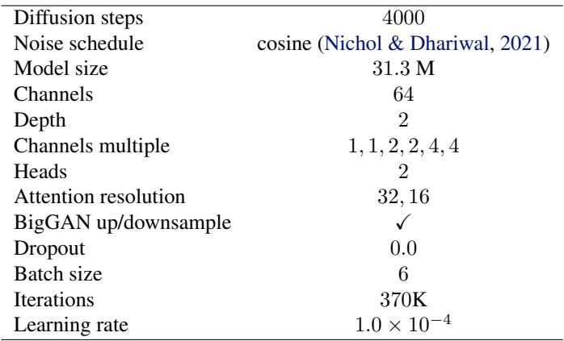
*Table 3. Hyperparameters for training diffusion model on dry vocal signals.*

For initialization of the linear operator, we used the WPE with the parameters $L=150,D=4$, and one iteration. GibbsDDRM takes 36 seconds to restore 1 second vocal signals, whereas UD takes 6 seconds.

Comparison methods. Reverb conversion: A state-of-the-art end-to-end DNN-based method for vocal dereverberation. We use the original code and the pre-trained model, which is trained with the pairs of 44.1 kHz wet and dry vocal signals. Note that the wet signals are reverbed with the artificial reverb for vocal taken from the different commercial reverb plug-ins from those of our test dataset (Koo et al., 2021). We input pairs of wet and dry signals since this method needs them for dereverberation.

Music enhancement: A supervised method to denoise and dereverb music signals based on diffusion models (Kandpal et al., 2022). We use both the original code and the pre-trained model specified in the paper. Since ME is trained with pairs of 16 kHz reverberant noisy and clean music signals containing vocal signals, we evaluate this method at 16 kHz for all the objective metrics. Note that the wet signals of the training dataset are created using room impulse responses from the DNS Challenge dataset (K. A. Reddy et al., 2021), which may have some different characteristics from artificial reverb for vocal signals, and adding the background noise from the ACE Challenge dataset (Eaton et al., 2015).

UnsupervisedDereverb: An unsupervised method for vocal dereverberation (Saito et al., 2023). This method is similar to our GibbsDDRM, which utilizes DDRM. However, it differs in how it estimates the linear operator's parameter. We use the same pre-trained diffusion model as GibbsDDRM. We set $L=150,D=4$, the number of iterations of WPE to one, $\eta=0.8,\eta_b=0.8,\sigma_y=1.0\times10^{-3}$, with the number of sampling steps T set to 50. The number of iterations, the learning rate, and the regularization parameter for refinement of the linear operator are set to 10000, $1.0\times10^{-6}$, and 1.0, respectively.

> 💡 **效率对照 + UD 公平性 (Hao 批注)**: 两点。（1）**GibbsDDRM 36 s/秒音频 vs UD 6 s**——联合采样比 UD 慢 6 倍，是准确度换来的成本。（2）UD 用**同一个预训练扩散模型**、同样的 $\eta,\eta_b,\sigma_y,T$，只有算子估计方式不同——所以 Table 2 里 GibbsDDRM 胜 UD 是真正干净的"算子估计方式"消融，可放心当作"联合采样 > 分离估计"的证据引用。

---

## D. Additional Results.

### D.1. Blind image deblurring.

Qualitative comparison. We show the results of our method and comparison methods in Figure 6 (见 [04-experiments](04-experiments.md)). The images estimated by GibbsDDRM appear perceptually similar to the ground truth images, but the images estimated by MPRNet have better quality in terms of PSNR. However, the images estimated by MPRNet lack definition compared to the ground truth images. GibbsDDRM utilizes a generative model to generate components lost during the measurement process by considering the spectral space of the linear operator, which is one of the reasons why MPRNet outperforms GibbsDDRM in terms of PSNR. In addition, it is important to note that MPRNet is specifically trained on the corruption caused by motion blur.

In our experiments, other comparison methods, except for MPRNet, do not perform well in restoring the images with a high degree of accuracy. This is consistent with the results reported in (Chung et al., 2023a). In the motion blur corruption process used in this study, the blur kernel is relatively large to the image size, and there is also measurement noise, making it challenging to estimate a stable solution in such situations.

> 💡 **PSNR vs 视觉质量再辨析 (Hao 批注)**: 作者主动解释"为什么 PSNR 输给 MPRNet 却不认输"：GibbsDDRM 用生成模型**补全测量过程丢失的高频成分**，这些生成成分未必逐像素对齐真值（PSNR 惩罚），但视觉更锐利、更接近真实（LPIPS/FID 赢）。MPRNet 则偏向输出平滑均值图（PSNR 高、视觉糊）。这是 distortion-perception tradeoff 的教科书案例，也是本课题解释指标时要反复用到的框架。

Relationship between hyperparameters η and η_b and each evaluation metric. We show the relationship between the hyperparameters η and η_b and each evaluation metric on the FFHQ dataset in Table 4. Note that although there is a small difference, the parameters that best achieve LPIPS differ from those that best achieve PSNR. The parameters for T, $M_t$, and Langevin dynamics are set to be the same as those described in the paper.

<table><tr>
<td width="33%">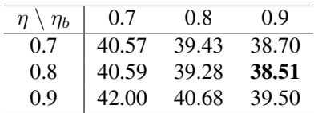</td>
<td width="33%">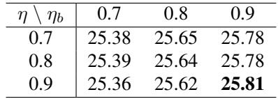</td>
<td width="33%">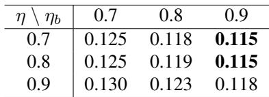</td>
</tr>
<tr><td align="center"><i>(a) FID (↓)</i></td><td align="center"><i>(b) PSNR (↑)</i></td><td align="center"><i>(c) LPIPS (↓)</i></td></tr></table>

*Table 4. Relationship between hyperparameters and evaluation metrics on FFHQ (256×256) dataset. Bold: Best.*

> 💡 **Table 4 批读 — 超参消融 (Hao 批注)**: $\eta$（随机性）× $\eta_b$（观测引导强度）的网格。关键发现：**最优 LPIPS 与最优 PSNR 的超参不完全一致**（LPIPS 在 $\eta_b=0.9$ 最好，PSNR 也偏向高 $\eta_b$ 但差异小）。这再次印证 distortion-perception tradeoff——没有一组超参同时最优所有指标。论文正文选 $\eta=0.80,\eta_b=0.90$（偏向 LPIPS）。对本课题：这类超参对指标的敏感度分析，正是校准检验前该做的稳健性摸底。

Investigation of sampling methods of $\varphi$. In GibbsDDRM, $\varphi$ is sampled by Langevin dynamics using the estimated score in (17). If no Gaussian noise is added in Eq. (11), the operation can be interpreted as a step of gradient descent method for maximum a posteriori (MAP) estimation of $\varphi$, with log $p(\varphi\mid\mathbf{x}_{t:T},\mathbf{y})$ as the likelihood function. Although this operation cannot be included in GibbsDDRM as it is not a sampling of $\varphi$, we can consider updating $\varphi$ using this procedure. This strategy is referred to as "MAP" and the GibbsDDRM as "Langevin." Figure 7 shows histograms of PSNR and LPIPS computed for the images (in total 1000-images) estimated by Langevin (GibbsDDRM) and by MAP in the blind image deblurring experiment on FFHQ $(256\times256)$ dataset. It can be seen that the MAP's histogram has a longer tail, indicating that while MAP can sometimes estimate images with high accuracy, it is less stable compared to Langevin. This suggests that Langevin sampling serves to stabilize the estimation of $\varphi$.

<table><tr>
<td width="50%">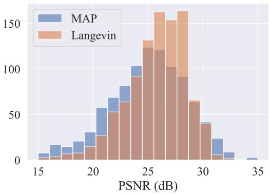</td>
<td width="50%">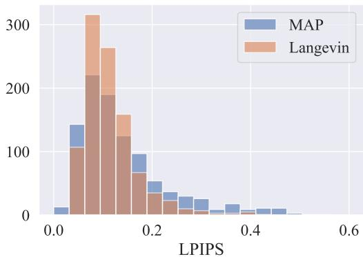</td>
</tr>
<tr><td align="center"><i>(a) PSNR</i></td><td align="center"><i>(b) LPIPS</i></td></tr></table>

*Figure 7. Histograms of blind image deblurring results on FFHQ (256 × 256) dataset obtained from different update strategies for $\varphi$. MAP: The linear operator's parameters are updated by MAP estimation, Langevin: GibbsDDRM, Proposed.*

> 💡 **Figure 7 批读 — 全文对本课题最重要的一张图 (Hao 批注)**: 这是**"采样 vs 点估计"的直接实证**，对本课题（联合后验采样优于点估计）价值最高。把 $\varphi$ 更新从 Langevin（去掉噪声项）退化成 MAP 梯度下降，对比 1000 张图的 PSNR/LPIPS 直方图：**MAP 有更长的坏尾**——偶尔估得很准，但整体不稳定（长尾=一批很差的解）；Langevin（采样）分布更集中、更稳。机理：MAP 会掉进 $\varphi$ 后验的局部尖峰/坏模态，而 Langevin 的随机扰动帮助逃离、探索后验，稳定核估计。**这正是我们要的证据链**：联合贝叶斯采样不只是"理论更漂亮"，在盲逆问题里对参数估计的稳定性有实测收益。批判点：本文只用直方图"稳定性"论证，没做真正的后验校准（是否覆盖真值、coverage 是否名义）——这一步留给本课题。

Additional figures We list additional qualitative results in Figs. 8 and 9 in order to see the details in the restored images and kernels.

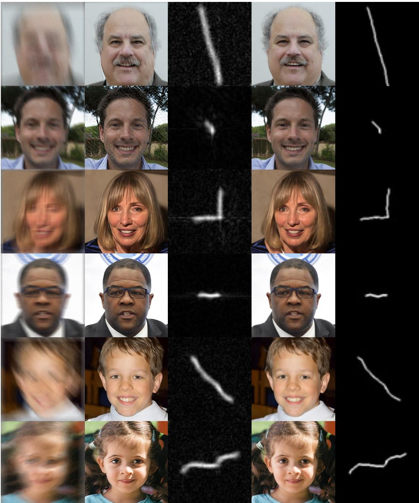
*Figure 8. Blind image deblurring results obtained by GibbsDDRM on FFHQ (256 × 256) dataset. (从左到右：Measurement / Restored / Ground truth)*

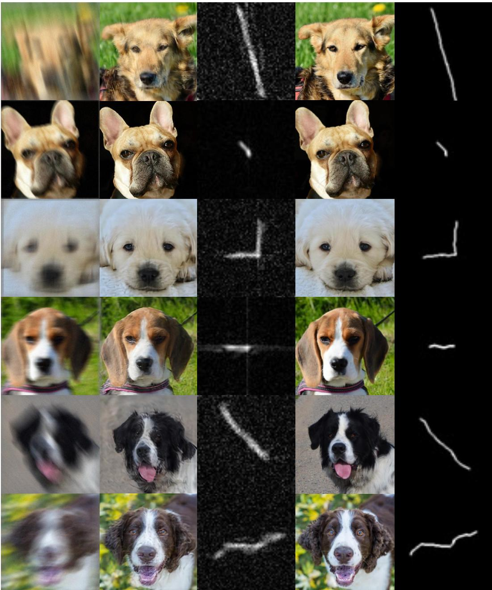
*Figure 9. Blind image deblurring results obtained by GibbsDDRM on AFHQ (256 × 256) dataset. (从左到右：Measurement / Restored / Ground truth)*

> 💡 **Figure 8/9 批读 (Hao 批注)**: 更多定性样例，FFHQ 人脸和 AFHQ 狗脸。看点仍是右下角估计核与真值核的一致性 + 恢复图的锐度。跨两个域（人脸/动物）都成立，是 problem-agnostic 在图像域内部的进一步佐证（同一框架、不同预训练扩散模型）。

---

## 🔖 Appendix 总结

### 核心洞察
1. **Prop 3.1 证明**=从朴素 Gibbs 经 marginalization/trimming 三步变形到 Algorithm 1，辅助变量 $\psi_t$（更干净 latent）被塌缩掉，平稳分布始终=真后验。
2. **Theorem 3.2**：用扩散预测 $\mathbf{x}_{\theta,t}$ 代替真 $\mathbf{x}_0$ 的误差界 $\propto L\cdot s_1\cdot m_1$，随 $t$ 减小、奇异值减小而变紧——理论指导了 $M_t$ 策略。
3. **实例化**：两任务算子都是卷积、都用 FFT 做 SVD，这是效率与 problem-agnostic 的技术根基，也是"SVD 不可行不适用"局限的来源。
4. **Figure 7（Langevin vs MAP）** 是本课题最可引用的实证：采样式参数估计比 MAP 点估计更稳定（无长尾坏解）。

### 可追问点（本课题）
- Figure 7 只证"稳定性"，未证"后验校准正确性"——补 SBC/coverage/CRPS 是直接增量。
- 误差界含 $\sigma_\mathbf{y}$，若联合估 $\sigma$，需重新分析近似误差如何受 $\sigma$ 估计误差影响。
