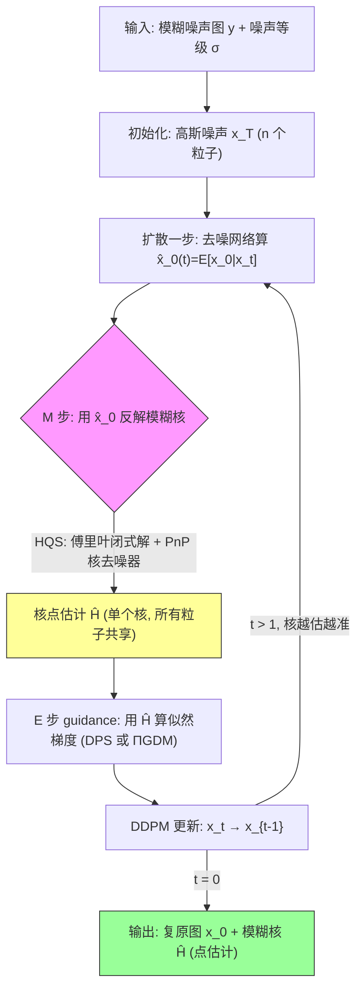

# Fast Diffusion EM: a diffusion model for blind inverse problems with application to deconvolution

**作者**: Charles Laroche (GoPro & MAP5)、Andrés Almansa (CNRS & Université Paris Cité)、Eva Coupeté (GoPro)
**会议**: WACV 2024 | **年份**: 2023 (arXiv)
**链接**: [arXiv:2309.00287](https://arxiv.org/abs/2309.00287) · [代码](https://github.com/claroche-r/FastDiffusionEM) · [Connected Papers](https://www.connectedpapers.com/main/2309.00287) · [Semantic Scholar](https://www.semanticscholar.org/paper/93ec0424a9b48d25b9805b209ff6af5a88b0941b)

---

## 一句话总结

用扩散模型做 **E 步**（在当前核估计下采样后验图像、近似期望对数似然）+ 快速 EM 做 **M 步**（用 Plug & Play 核去噪先验 + HQS 反解模糊核），把盲反卷积的模糊核 $H$ 作为 **MAP 点估计**联合求解；并把 EM 迭代直接注入单次扩散过程（Fast EM），做到既快又准。

> **本课题定位（点估计对照）**: 本文是"生成先验下参数化盲逆问题"课题的**高质量点估计对照组**。它同样联合估计图像 $x$ 和低维退化参数（模糊核 $H$），但 $H$ 始终以 $\arg\max_H p(H|y)$（MAP 点估计）出现，**从不输出核的完整后验 $p(H|y)$**，因此无法做 SBC/coverage/CRPS 校准。它证明了"点估计可以很好"（核 MSE 比 Blind DPS 好一个量级），恰好反衬出本课题追求的"可校准联合后验"的独立价值。

## 核心贡献

1. **Diffusion EM 框架**：把经典 EM 与扩散后验采样结合——E 步用非盲扩散（DPS / ΠGDM）采样近似期望对数似然 $Q$，M 步最大化 $Q$ 更新模糊核。
2. **Plug & Play 核正则（新）**：不对自然图、而是对**模糊核数据集**训练去噪器当核先验，抗噪能力远超 $\ell_1/\ell_2$（Figure 4 证实 $\sigma=5\to20$ 几乎不掉点）。
3. **Fast EM 加速**：把 M 步嵌入扩散每一步，用中间态 $\hat{x}_0(t)$ 当渐进后验样本（Eq 26-33），只跑一次扩散，从分钟级降到秒级（9 sec/img）。
4. **反直觉发现**：Fast EM 不仅更快，还比经典 Diffusion EM 更好——避开了经典版"卡在 no-blur 解"的失败模式。

## 📖 批读导航

| Section | 内容 |
|---------|------|
| [00 - Abstract](sections/00-abstract.md) | 摘要 + 点估计对照定位 |
| [01 - Introduction](sections/01-introduction.md) | 盲反卷积动机、两条对手路线、Figure 1/2 |
| [02 - Background](sections/02-background.md) | EM 框架、扩散后验采样、DPS vs ΠGDM、Algorithm 1（Eq 1-17） |
| [03 - Method](sections/03-method.md) | E 步 / M 步 / Fast EM、PnP 核正则、Algorithm 2（Eq 18-33） |
| [04 - Experiments](sections/04-experiments.md) | Table 1/2、Figure 3/4/5、$\mathcal{L}_{reblur}$、消融 |
| [05 - Conclusion](sections/05-conclusion.md) | 总结、局限、本课题接口 |
| [06 - Appendix + References](sections/06-appendix.md) | Algorithm A.1、M 步傅里叶推导 B/C/D、Figure E.1、参考文献 |

## 关键数字

| 指标（FFHQ 合成集） | Fast EM ΠGDM (n=1) | Blind DPS | 非盲 ΠGDM* |
|------|------|------|------|
| 运行时间 | 9 sec | 1min23 | 5 sec |
| PSNR ↑ | 25.66 | 24.05 | 27.65 |
| SSIM ↑ | 0.79 | 0.73 | 0.81 |
| FID ↓ | 4.26 | **2.66** | 4.50 |
| MSE kernel ↓ | **1.1e-5** | 3.9e-5 | — |
| $\mathcal{L}_{reblur}$ ↓ | **5.1e-3** | 5.6e-3 | — |
| E 步样本数 $n$ | $\{1,4,16\}$（$n=1$=Stochastic EM） | | |
| 经典 EM 轮数 $L$ | 10 | | |
| DPS / ΠGDM 扩散步数 | 1000 / 100 | | |

\* 带星号为非盲上界基线，不参与盲方法排名。

## 数据流：输入 → 中间表示 → 输出

## 优缺点与还能做什么

### 优点
- **保真 + 效率双升**：在盲方法里 PSNR/SSIM 最高、核 MSE 好一个量级、一致性 $\mathcal{L}_{reblur}$ 最低，且比 Blind DPS 快近 10 倍（9s vs 1min23）。
- **PnP 核正则抗噪强**：学出来的核先验编码真实运动模糊结构，$\sigma$ 从 5 到 20 几乎不掉点（Figure 4），远胜解析范数。
- **Fast EM 稳健**：把核估计嵌入扩散时间轴，核随 $t\to 0$ 持续修正，从不卡在 no-blur 解（经典 Diffusion EM 会）。
- **ΠGDM 强 guidance**：在 OOD（FFHQ 训练、DIV2K 测试）下仍能恢复清晰结构，不依赖精确 score 网络（Figure 5）。

### 局限 / 风险
- **仅点估计，无参数后验**：核 $H$ 是 $\arg\max$ 单点，不给 $p(H|y)$，无法量化核的不确定性，无法做 SBC/coverage/CRPS 校准。
- **仅限卷积**：算子 $H$ 必须是卷积核（傅里叶对角化才有闭式 M 步），无法直接处理空间变化模糊或更一般算子。
- **噪声等级 $\sigma$ 当已知**：未联合估计 $\sigma$（本课题需联合估 $x,\varphi,\sigma$）。
- **感知锐度略弱**：NIQE/BRISQUE/FID 输给 Blind DPS（后者靠幻觉换锐度，保真更差）。
- **$r_t^2$ 用了不确定性却不输出**：ΠGDM 版分母含 $r_t^2$（$\hat{x}_0$ 的不确定性），但只用于稳化点估计，不转化为核后验。

### 还能做什么（本课题方向）
- 把 M 步的 $\arg\max_H$ 换成对 $H$ 的**采样**（Langevin / score-based kernel prior），得到核的可校准后验，接入 SBC/coverage/CRPS。
- 联合估计噪声等级 $\sigma$（甚至更多低维算子参数 $\varphi$），并显式处理卷积的 gauge 对称性（平移/缩放自由度）。
- 复用 $\mathcal{L}_{reblur}$（Eq 34）作为 posterior predictive check 的一个组件，但需补充覆盖率检验。
- 借 latent diffusion / diffusion bridge 进一步提速（作者自陈方向）。

## 阅读 Q&A 记录

- **Q: 为什么说本文是"点估计"而不是完整后验？**
  A: 核的目标函数从头到尾是 $H_{MAP}=\arg\max_H p(H|y)$（Eq 2）和 M 步 $H_{l+1}=\arg\max_H[Q+\log p(H)]$（Eq 4/20/21）。图像端是生成式（$n$ 个样本），但参数端每步只吐**一个**核，所有粒子共享（见 04 节 Table 2 讨论）。全程不为 $H$ 定义或采样后验分布。

- **Q: E 步和 M 步各做什么？**
  A: E 步（03.1）在固定核 $H_l$ 下用非盲扩散（Algorithm 1）采 $n$ 个后验图像 $x\sim p(x|y,H_l)$，经验均值近似期望对数似然 $\hat{Q}$（Eq 18-19）。M 步（03.2）拿这些图像当"已知清晰图"，用傅里叶闭式解（Eq 24）+ PnP 核去噪（Eq 25）反解模糊核。

- **Q: Fast EM 为什么能只跑一次扩散？**
  A: 用扩散中间态 $\hat{x}_0(t)=E[x_0|x_t]$ 当"渐进后验样本"（Eq 26-28），在扩散每一步顺手做一次 M 步估核（Algorithm 2）。核随 $t\to 0$ 越估越准（Eq 30），总成本≈一次非盲扩散。

- **Q: 为什么经典 Diffusion EM 会"卡在 no-blur 解"，Fast EM 不会？**
  A: 经典版第一轮就采出锐图 → M 步误判无模糊 → 恶性循环；Fast 版在扩散早期（图还糊时）就开始估核并持续修正，避开陷阱（04.3 正文实证）。

- **Q: ΠGDM 版和 DPS 版 M 步的区别？**
  A: ΠGDM 把 $x_0$ 建成高斯 $\mathcal{N}(\hat{x}_0,r_t^2)$，M 步闭式解的分母比 DPS 多一项 $r_t^2$（附录 D.9）。这项承认 $\hat{x}_0$ 的不确定性，让核估计更稳，是 ΠGDM 版更准的数学根源。

- **Q: PnP 核正则相比 $\ell_1/\ell_2$ 好在哪？**
  A: 对模糊核数据集训练去噪器，编码了真实运动模糊核的结构分布。Figure 4（非盲隔离设定）显示噪声升高时 $\ell_1/\ell_2$ 核 MSE 急剧恶化，而 PnP 曲线几乎平。

## 📊 Citation Landscape

**数据来源**: Semantic Scholar API（2026-07 查询）

### TLDR
> An algorithm based on the well-known Expectation-Minimization (EM) estimation method and diffusion models that alternates between approximating the expected log-likelihood of the inverse problem using samples drawn from a diffusion model and a maximization step to estimate unknown model parameters.

### 引用统计
| 指标 | 数值 |
|------|------|
| 参考文献数 (referenceCount) | 57 |
| 被引次数 (citationCount) | 43 |
| 高影响力引用 (influentialCitationCount) | 6 |
| Semantic Scholar paperId | 93ec0424a9b48d25b9805b209ff6af5a88b0941b |

### 参考文献分组（按被引次数 Top 5）

**扩散 / 生成模型基础**
1. Denoising Diffusion Probabilistic Models (DDPM), NeurIPS 2020 — 32814 cites
2. High-Resolution Image Synthesis with Latent Diffusion Models, CVPR 2021 — 26033 cites
3. Denoising Diffusion Implicit Models (DDIM), ICLR 2020 — 12703 cites
4. Score-Based Generative Modeling through SDEs, ICLR 2020 — 11362 cites
5. Deep Unsupervised Learning using Nonequilibrium Thermodynamics, ICML 2015 — 10320 cites

**扩散逆问题 / 后验采样（本文方法直接基础）**
1. Diffusion Posterior Sampling for General Noisy Inverse Problems (DPS), ICLR 2022 — 1737 cites
2. Pseudoinverse-Guided Diffusion Models for Inverse Problems (ΠGDM), ICLR 2023
3. Denoising Diffusion Restoration Models (DDRM), NeurIPS 2022
4. Parallel Diffusion Models of Operator and Image for Blind Inverse Problems (Blind DPS), CVPR 2023 — 最直接对手
5. Image Super-Resolution via Iterative Refinement (SR3), TPAMI 2021 — 2551 cites

**盲反卷积 / 核估计**
1. Neural Blind Deconvolution Using Deep Priors (Self-Deblur), CVPR 2020
2. Total Variation Blind Deconvolution: The Devil Is in the Details, CVPR 2014
3. Flow-based kernel prior with application to blind super-resolution, CVPR 2021
4. Blind Super-Resolution Kernel Estimation using an Internal-GAN, NeurIPS 2019
5. Blind Image Deblurring using the l0 Gradient Prior (Anger), IPOL 2019

**EM / 贝叶斯参数估计**
1. Maximum likelihood from incomplete data via the EM algorithm (Dempster), JRSS-B 1977 — 54295 cites
2. The EM algorithm and extensions (McLachlan & Krishnan), 1996 — 6557 cites
3. A Monte Carlo Implementation of the EM Algorithm (Wei & Tanner), JASA 1990 — 1689 cites
4. DeepGEM: Generalized Expectation-Maximization for Blind Inversion, NeurIPS 2021
5. Maximum likelihood estimation of regularisation parameters (SAPG, Vidal et al.), SIAM 2019

**去噪 / 正则（PnP 与评价指标）**
1. Image quality assessment: structural similarity (SSIM), IEEE TIP 2004 — 58004 cites
2. The Unreasonable Effectiveness of Deep Features as a Perceptual Metric (LPIPS), CVPR 2018 — 18554 cites
3. Beyond a Gaussian Denoiser (DnCNN), IEEE TIP 2016 — 8468 cites
4. FFDNet: Fast and Flexible CNN-Based Denoising, IEEE TIP 2017 — 2626 cites
5. Plug-and-play image restoration with deep denoiser prior (DPIR), TPAMI 2021

### 推荐相关论文（Recommendations API，主题相关）
| 论文 | 年份 | 链接 |
|------|------|------|
| Stop Denoising Your Blurs | 2026 | [arXiv:2605.25014](https://arxiv.org/abs/2605.25014) |
| Learning Normalized Energy Models for Linear Inverse Problems | 2026 | [arXiv:2605.15487](https://arxiv.org/abs/2605.15487) |
| Diffusion Graph Posterior Sampling for Nonlinear Inverse Problems (EIT) | 2026 | [arXiv:2605.19621](https://arxiv.org/abs/2605.19621) |
| Stage-wise Distortion-Perception Traversal in Zero-shot Inverse Problems | 2026 | [arXiv:2605.28711](https://arxiv.org/abs/2605.28711) |
| Unbiased Diffusion Variational Inversion via Principled Posterior Matching | 2026 | [arXiv:2605.25042](https://arxiv.org/abs/2605.25042) |
| Exact Posterior Score Estimation for Solving Linear Inverse Problems | 2026 | [arXiv:2606.17048](https://arxiv.org/abs/2606.17048) |
| Latent Diffusion Posterior Sampling with Surrogate Likelihood Guidance for PDE Inverse Problems | 2026 | [arXiv:2606.26592](https://arxiv.org/abs/2606.26592) |
| Stochastic Optimal Control Sampling for Diffusion Inverse Problems | 2026 | [arXiv:2606.28785](https://arxiv.org/abs/2606.28785) |
| DiffRGD: Inference-Time Diffusion Guidance via Riemannian Gradient Descent | 2026 | [arXiv:2606.28417](https://arxiv.org/abs/2606.28417) |
| Image Restoration via Diffusion Models with Dynamic Resolution | 2026 | [arXiv:2605.14267](https://arxiv.org/abs/2605.14267) |

> 推荐结果多为 2026 年新作（引用尚少），主题集中在**扩散逆问题后验采样**，可作为本课题"生成先验下参数化盲逆问题"的最新对照文献池。
