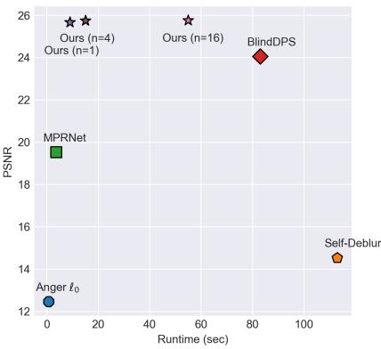
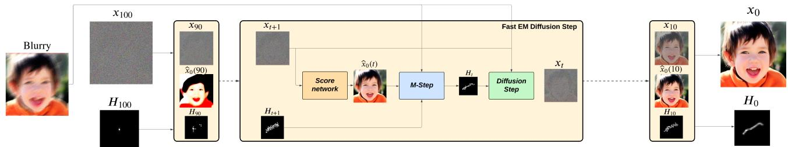

[← 返回 README](../README.md)

# 1. Introduction

## 📌 预览

引言在做两件事：（1）用"深度学习 vs 模型驱动"的老张力引出**盲反卷积**难点——模型驱动方法依赖已知退化，而实际场景核未知；（2）梳理盲反卷积的两条技术脉络（贝叶斯联合估计、扩散/Langevin 生成先验），点出核估计对**图像正则**和**核正则**的强依赖，从而给出本文的切入点：用扩散模型做 E 步采样 + EM 做核点估计，并把 Pareto 曲线（PSNR vs 运行时间，Figure 1）推向更优。

---

Image restoration aims to recover information that has been obscured by various degradations such as blur, noise, or compression artifacts. Deep-learning-based methods have revolutionized the field of image restoration by achieving impressive results in various tasks. They leverage the power of deep neural network architectures to learn a mapping between training data [11, 55, 57]. This data-driven approach allows deep-learning models to capture intricate patterns and relationships within the image data, enabling them to restore images with superior quality and perceptual fidelity [28, 51]. On the other hand, model-based approaches express the image restoration problem as an inverse problem and exploit the degradation process structure to design regularizations and optimization algorithms to find the optimal reconstruction [37]. They usually offer more control, flexibility, and interpretability.

> 💡 **问题动机（Hao 批注）**: 开篇立"两派"对立：**数据驱动**（端到端学映射，感知质量高但黑盒、依赖训练分布）vs **模型驱动**（把复原写成逆问题 $y=Hx+n$，可控/可解释但依赖已知退化算子 $H$）。本文属于第二派的现代化——保留模型驱动的可解释结构（显式 $H$、显式似然），但用扩散模型（数据驱动）当图像先验。这正是本课题"生成先验 + 参数化前向模型"的共同范式。

However, model-based approaches highly rely on the knowledge of the degradation forward process limiting their usefulness in practical applications. Some strategies try to bring the best of both worlds such as Plug-and-Play methods or deep unfolding networks [22, 23, 26, 41, 53]. One of the challenges behind inverse problems comes from their ill-posedness. In fact, for a single degraded image, there generally exist multiple plausible solutions. A common approach is to generate a single restored image that minimizes the mean squared error, but it does not allow the models to generate or hallucinate high-quality details [42, 50]. There is a growing interest in the field of image restoration to design models that can generate all the space of plausible solutions. Those models include Generative Adversarial Networks [16, 33] , conditional or PnP Diffusion Models [25, 42, 43] or Langevin dynamics [27]. This growing interest in diverse restoration is motivated by the impressive perceptual quality obtained by such methods. In particular, diffusion models that were first introduced for image synthesis tasks [20, 21, 44] are now used for a large diversity of tasks such as inverse problem solving [7, 25, 45]. In the field of blind deconvolution, it is common to use Bayesian methods to jointly estimate the blur kernel and the restored image [3, 31, 37, 38]. The kernel estimation highly relies on the restoration method that is used and it generally requires the restoration method to produce a sharp image. To do so, image regularizations such as TV, $\ell _ { 0 }$ on the gradient can be used but they tend to over-sharpen the restored image leading to unpleasant results. Even with the sharp and blurry pairs, it is not easy to estimate any type of blur kernels without efficient regularization. Common regularization on the kernels are the $\ell _ { 1 }$ norm [6], positivity, the sum to one constraint, and in some cases Gaussian constraints [4]. Some recent works also use deep neural networks such as normalizing flows to parameterize the kernels [29]. Motivated by the impressive quality of diffusion models for both estimated conditional distribution and returning high-quality images, it is natural to believe that they could be used in the context of kernel estimation. Also, a pioneer work [6] that combines parallel diffusion models for the kernel and image exhibits impressive results. Estimating the kernel and image is jointly done in the diffusion process using gradient descent on the forward model. Similarly, methods based on Monte Carlo sampling proposed parameters estimation derived from the Expectation-Maximization (EM) algorithm [14, 18], or the SAPG algorithm [13, 47]. Those methods are very efficient but Monte Carlo sampling is time-consuming. Also, the problem of kernel estimation is a complex problem so those methods highly depend on the regularization imposed in the M-step of the EM algorithm.

> 💡 **机制拆解：盲反卷积的两难（Hao 批注）**: 这段是全文动机核心，拆成三层：
> 1. **不适定性**：单张退化图对应多个合理解。MSE 复原只给一个"平均"解，不敢幻觉细节；生成式方法（GAN/扩散/Langevin）能覆盖整个合理解空间——这是选扩散当先验的理由。
> 2. **盲反卷积的鸡生蛋问题**：核估计依赖复原图要够"锐"，而复原又依赖核。传统靠图像正则（TV、梯度 $\ell_0$）强行锐化，但会过锐产生伪影。
> 3. **核正则也很关键**：核本身要正则（$\ell_1$、非负、和为 1、高斯约束、甚至用 normalizing flow 参数化核 [29]）。本文的创新点之一就在这里——**用 Plug & Play 去噪器当核先验**，替代 $\ell_1/\ell_2$。

> 💡 **两条对手路线（Hao 批注）**: 本段点名两个直接对照：
> - **Blind DPS [6]**（"pioneer work ... parallel diffusion models for the kernel and image"）：图像和核**各跑一个扩散**，在扩散过程里用前向模型梯度下降联合估计。它对核也是**生成式（走扩散）**。
> - **蒙特卡洛 + EM/SAPG [13,14,18,47]**：用 MCMC 采样做参数估计。高效但采样慢，且强依赖 M 步正则。
>
> 本文取两者中间：E 步借用扩散采样（不走 MCMC），M 步做 EM 点估计核（不走核扩散）。对本课题而言，Blind DPS 是"核也有分布但无校准"，本文是"核只有点估计"——两种都不是我们要的 gauge-aware 联合后验，但本文更纯粹地代表点估计极端。

*Figure 1. Performance comparison of the different models using the PSNR metric depending on the runtime, "Ours" corresponds to Fast EM ΠGDM method.*

> 💡 **Figure 1 批读（Hao 批注）**: 这是全文的"卖点图"——横轴运行时间（对数/秒）、纵轴 PSNR，左上角为最优（快且准）。"Ours"（Fast EM ΠGDM）被画在**左上角**，即在盲方法里同时拿到最高 PSNR 和接近非盲方法的速度（~9 秒/图）。它想传达的单一 claim：把 Pareto 前沿推向原点（更快 + 更保真）。注意纵轴是 **PSNR（保真度指标）**，所以这张图为"点估计一致性好"背书，而不是为感知质量（后文 NIQE/BRISQUE 上本文并非最佳）。

*Figure 2. Overview of the method and evolution of the current estimates. We start with random noise and apply the diffusion process. The blurry image intervenes both for the guidance and for the M-step which estimates the blur kernel.*

> 💡 **Figure 2 批读：方法数据流总览（Hao 批注）**: 这是理解全文的地图，按数据流读：
> - **起点**：纯高斯噪声 $x_T$。
> - **扩散主干（E 步）**：反向扩散逐步去噪，中间态 $x_t$ 每步用去噪网络算出 $\hat{x}_0(t)=E[x_0|x_t]$（当前干净图估计）。模糊图 $y$ 在这里作为 **guidance**（似然梯度）注入，把采样拉向"能解释 $y$"的解。
> - **核估计（M 步）**：用当前 $\hat{x}_0(t)$（或样本）和 $y$ 反解模糊核 $\hat{H}$——图里"blurry image intervenes ... for the M-step which estimates the blur kernel"。
> - **闭环**：估出的 $\hat{H}$ 又回填到下一步的 guidance 里。图底部"evolution of current estimates"展示核和图随 $t$ 逐渐清晰。
> - **点估计位置**：注意图里核 $\hat{H}$ 每一步是**一个确定的核**（不是核的一批样本），这正是"点估计"的可视化——M 步吐出单个 $\hat{H}$ 供所有粒子共享 guidance。

Motivated by the efficiency of diffusion models, we propose a diffusion model that solves the maximum a-posteriori estimator for blind deconvolution. Derived from the classical Expectation-Maximization algorithm, our model alternately estimates the expected value of the log-likelihood using samples drawn from a diffusion model and maximizes this quantity using half-quadratic splitting. In addition, we also propose a novel kernel regularization in a Plug & Play fashion. Finally, we proposed a fast version of our algorithm to facilitate the use of our method in real-world scenarios. Our experiments show that our proposed solution improves both in terms of fidelity and computational efficiency pushing the Pareto optimal curve further to the origin (Figure 1).

> 💡 **贡献清单（Hao 批注）**: 明确四点贡献：(1) 面向盲反卷积的扩散 MAP 求解器（Diffusion EM）；(2) E 步用扩散采样近似期望对数似然，M 步用 HQS 最大化；(3) Plug & Play 核正则（新）；(4) Fast 版（把 EM 折进单次扩散）。全文声称的收益是"fidelity + efficiency 双升"，即 Figure 1 的左上角。对本课题：这里的 "maximum a-posteriori estimator" 就是点估计的官方措辞——求的是 $H_{MAP}$，不是 $p(H|y)$。

---

## 🔖 Section 总结

### 核心洞察
1. **动机**：模型驱动可解释但依赖已知 $H$；盲反卷积要联合估 $x,H$，且核估计与图像锐度互相依赖（鸡生蛋）。
2. **切入点**：扩散当图像先验（E 步采样）+ EM 做核 MAP（M 步）+ Plug & Play 核正则；再加速成单次扩散。
3. **对照锚点**：官方目标是 $H_{MAP}$（点估计）。Blind DPS 让核走扩散（生成式但无校准），本文让核走 EM（纯点估计）。

### 关键数字速查
| 项 | 值 |
|------|------|
| Fast EM ΠGDM 运行时间 | ~9 sec/img（Figure 1 左上角） |
| 贡献点 | 4（EM 求解器 / E-M 分工 / PnP 核正则 / Fast 版） |

### 可追问点
- E 步的"expected log-likelihood"具体是什么形式？→ 见 02 节 Eq (3) 和 03 节 Eq (19)。
- 为什么扩散慢到需要 Fast 版？→ guidance 必须作用在全尺寸图上，无法用 latent 加速（见 03.3）。
