[← 返回 README](../README.md)

# 2. Background

## 📌 预览

本节铺两块基础：（1）**问题与 EM 框架**——把盲反卷积写成 $y=Hx+n$，目标是边缘化 MAP 估核 $H_{MAP}=\arg\max_H p(H|y)$，因 $x$ 不可解析边缘化，改用 EM（E 步算期望对数似然 $Q$，M 步最大化更新 $H$）；（2）**扩散做后验采样**——前向/反向 SDE、DPS 与 ΠGDM 两种似然近似、DDPM 更新规则，最后给出已知 $H$ 时的采样伪码 Algorithm 1。这一节是"E 步引擎"的技术底座。

---

Let us suppose that our deblurring problem fits the classical inverse problem formulation:

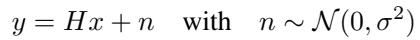

*Equation (1)*

> 💡 **公式批读 Eq (1)（Hao 批注）**: 标准线性逆问题 $y = Hx + n$，$n \sim \mathcal{N}(0,\sigma^2)$。三个量：$x$ 干净图（想要）、$y$ 模糊+噪图（观测）、$H$ 退化算子（反卷积里是卷积/模糊核）。本文的"real-world"设定是：**只有 $y$ 和噪声等级 $\sigma$**，要同时反解 $x$ 和 $H$。对本课题：$H$ 就是我们说的"低维算子参数 $\varphi$"，$\sigma$ 是噪声等级——本文把 $\sigma$ 当**已知常量**（不联合估计），只联合估 $x,H$；这是与我们"联合估 $x,\varphi,\sigma$"的一处差别。

where x is the clean image we want to estimate, y is the blurry and noisy image and H is the degradation operator, a convolution operator in the case of deconvolution. We suppose that we are in the real-world case where we only have access to the blurry image y and the noise level σ to reconstruct both the clean image and the blur kernel H. In such a setting, a common approach to estimate the blur kernel is to compute the marginalized maximum a-posteriori (MAP) estimator of the inverse problem described in Equation (1):

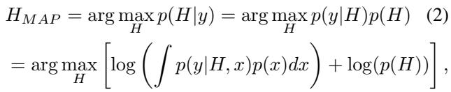

*Equation (2)*

> 💡 **公式批读 Eq (2)：为什么必须用 EM（Hao 批注）**: 这里定义核的边缘化 MAP：$H_{MAP}=\arg\max_H p(H|y)=\arg\max_H [\log \int p(y|H,x)p(x)dx + \log p(H)]$。关键难点在**积分**——要对所有可能的干净图 $x$ 边缘化，不可解析。这正是引入 EM 的理由：EM 把这个含"缺失数据 $x$"的 MAP 拆成可迭代的 E/M 两步。**注意这一步锁死了"点估计"的命运**：目标函数是 $\arg\max_H$，输出单个 $\hat{H}$；全程没有为 $H$ 定义或采样一个后验分布 $p(H|y)$。这就是本文作为本课题点估计对照的根源。

with $p ( x )$ a natural image prior, $p ( \boldsymbol { y } | \boldsymbol { H } , \boldsymbol { x } )$ the likelihood of the blurry image and $p ( H )$ the kernel's prior distribution. This MAP estimator cannot be solved easily since the marginalization in the clean image x is not tractable. Expectation-Maximization (EM) [10, 32] is an iterative algorithm that computes the MAP estimator for the parameters of a statistical model (H in our case). It is very convenient when the model contains unobserved or missing data. The EM algorithm consists of two main steps. An E-step that computes the expected log-likelihood given the current model parameter estimates and an M-step, that maximizes this expected log-likelihood to update the estimated parameters. The whole algorithm alternates between the E-step and M-step until convergence. In the case of deblurring, the parameter we want to estimate is the blur kernel H and our unobserved data are the clean images associated with the blurry image y and the estimated blur kernel H. The EM algorithm can be summarized as follows in such setting: E-Step:

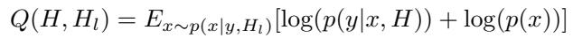

*Equation (3)*

> 💡 **公式批读 Eq (3)：E 步在算什么（Hao 批注）**: $Q(H,H_l)=E_{x\sim p(x|y,H_l)}[\log p(y|x,H)+\log p(x)]$。逐词读：在**当前核估计** $H_l$ 下，对后验 $p(x|y,H_l)$ 采样出干净图 $x$，再对新候选核 $H$ 计算对数似然 $\log p(y|x,H)$ 的期望。$H_l$ 是"上一步固定的核"，$H$ 是"待优化的核"，$x$ 是被积掉的隐变量。这就是"缺失数据 = 干净图"的含义。**E 步唯一改变的中间表示是"在旧核下的后验图像样本"**，它把不可解析的积分换成对样本求均值（后文 Monte-Carlo EM）。

M-Step:

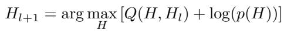

*Equation (4)*

> 💡 **公式批读 Eq (4)：M 步在更新谁（Hao 批注）**: $H_{l+1}=\arg\max_H [Q(H,H_l)+\log p(H)]$。M 步**只更新核 $H$**（图像 $x$ 已在 E 步被采样/边缘化）。$\log p(H)$ 是核先验（正则项）。E→M→E→M 交替直到收敛。对本课题：这里再次确认 M 步产出 $H_{l+1}$ 是单点 $\arg\max$，即"高质量点估计"；若要完整后验，需把 $\arg\max$ 换成对 $H$ 的采样（如 Gibbs/Langevin），本文没有这么做。

This formulation is very convenient but in many applications (including blind deblurring), the expected log-likelihood in Equation (3) cannot be computed explicitly, and even taking posterior samples $x \ \sim \ p ( x | y , H _ { l } )$ is challenging. Our method proposes to approximate the expectation in the E-step by an empirical mean in Monte-Carlo EM fashion [49] and to use a diffusion model to obtain posterior samples.

> 💡 **机制拆解：两处近似（Hao 批注）**: 本文把经典 EM 落地需要两个近似——(1) **期望→经验均值**（Monte-Carlo EM，用有限 $n$ 个样本近似 $Q$）；(2) **后验采样→扩散模型**（用非盲扩散在 $H_l$ 下采 $x$）。这两处近似正是"E 步引擎"的全部。下一小节铺扩散采样的数学。

Diffusion models for posterior sampling: To learn $p ( x _ { 0 } )$ the distribution of the data, diffusion models define a family of distributions $p ( x _ { t } )$ by gradually adding Gaussian noise of variance $\beta ( t )$ to samples of $p ( x _ { 0 } )$ until the distribution $p ( x _ { T } )$ reduces to a standard Gaussian with zero mean. For discrete timesteps $t \in \mathbb { [ 0 , } T ]$ , we can define a Markov transition kernel $p ( x _ { t } | x _ { t - 1 } ) = \mathcal { N } ( x _ { t } ; \sqrt { 1 - \beta ( t ) } x _ { t - 1 } , \beta ( t ) I )$ between two consecutive discrete timestamps. In the general continuous case, [46] described the forward noising process with the following stochastic differentiable equation (SDE) :

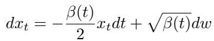

*Equation (5)*

where $w ( t )$ is the d-dimensional Wiener process. The reverse SDE of this process [2] can be written as:

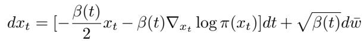

*Equation (6)*

> 💡 **公式批读 Eq (5)-(6)：前向/反向 SDE（Hao 批注）**: Eq (5) 前向加噪 SDE（把数据推成标准高斯）；Eq (6) 反向去噪 SDE，核心是 score 项 $\nabla_{x_t}\log \pi(x_t)$。这是标准 score-based 扩散骨架（[46]）。对逆问题，关键是把无条件分布 $\pi=p(x_t)$ 换成**后验** $\pi=p(x_t|y,H)$，见下。

with dt corresponding to time running backwards and dw¯ to the standard Wiener process running backwards. In the case of inverse problems, we want to use diffusion models to generate the posterior distribution $\pi ( x _ { t } ) = p ( x _ { t } | y , H )$ Using Bayes' rule Equation (6) becomes:

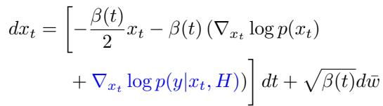

*Equation (7)*

> 💡 **公式批读 Eq (7)：后验采样的贝叶斯分解（Hao 批注）**: 用贝叶斯法则把后验 score 拆成两项：$\nabla_{x_t}\log p(x_t)$（无条件先验 score，由预训练扩散网络给）+ $\nabla_{x_t}\log p(y|x_t,H)$（**似然 guidance**，把采样拉向解释观测 $y$）。这就是所有"扩散解逆问题"的通用配方。本文的 $H$ 出现在 guidance 项里——**E 步的 guidance 用当前核 $H_l$**，这是核估计影响图像采样的唯一通道。

The main problem behind this equation is that in inverse problems, we have a relation between $y$ and $x _ { 0 }$ but not between $x _ { t }$ and $y .$ . Marginalizing in $x _ { 0 } .$ , we obtain:

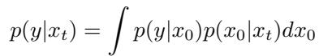

*Equation (8)*

that is intractable. The main challenge of non-blind diffusion for posterior sampling is to compute or approximate this integral. In our work, we conduct experiments with DPS [7] and ΠGDM [45] that use different approximations for this integral. Both approximations are based on the mean of $p ( x _ { 0 } | x _ { t } )$ , namely:

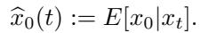

*Definition of $\widehat{x}_0(t) := E[x_0|x_t]$*

> 💡 **公式批读 Eq (8)：核心难点在 $p(y|x_t)$（Hao 批注）**: 前向模型 $y=Hx_0+n$ 只连接 $y$ 和干净图 $x_0$，但扩散在中间态 $x_t$（含噪）上操作，$y$ 与 $x_t$ 无直接关系。Eq (8) 要对 $x_0$ 边缘化算 $p(y|x_t)=\int p(y|x_0)p(x_0|x_t)dx_0$，仍不可解析。DPS 和 ΠGDM 就是对这个积分的两种近似，都基于 $\hat{x}_0(t)=E[x_0|x_t]$（当前步对干净图的最佳猜测，Tweedie 一步去噪结果）。

DPS approximates $p ( x _ { 0 } | x _ { t } )$ by a delta function

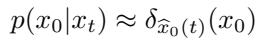

*Equation (9)*

whereas ΠGDM approximates $p ( x _ { 0 } | x _ { t } )$ by a Gaussian distribution

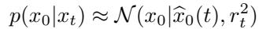

*Equation (10)*

with $r _ { t }$ a hyper-parameter. Both approximations allow us to solve the marginal in Equation (8) analytically and obtain explicit expressions for $\nabla _ { x _ { t } } \log { p ( y | x _ { t } ) }$ as detailed below.

> 💡 **公式批读 Eq (9)-(10)：DPS vs ΠGDM 的分水岭（Hao 批注）**: 两种对 $p(x_0|x_t)$ 的建模——
> - **DPS [7]**：狄拉克 δ（Eq 9），即假设 $x_0$ 完全等于点估计 $\hat{x}_0(t)$，忽略其不确定性。实现简单（任意 $H$ 都能自动微分），但 guidance 较弱。
> - **ΠGDM [45]**：高斯（Eq 10），带方差 $r_t^2$ 表达 $\hat{x}_0(t)$ 的不确定性。guidance 更强更准，但要算 $H$ 的伪逆，实现复杂。
>
> 这个"δ vs 高斯"的差异**贯穿全文**：后文 Fast EM 的 M 步公式里，ΠGDM 版分母比 DPS 版多一个 $r_t^2$ 项（见 03 节 Eq 33 / 附录 D.9）。实验也显示 ΠGDM 版更快更准（guidance 强，核更好估）。

As a recall, one property of diffusion models is that we can express the noisy measurement $x _ { t }$ in the forward model using the original sample x<sub>0</sub>:

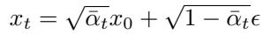

*Equation (11)*

with $\alpha _ { t } = 1 - \beta _ { t }$ and ${ \bar { \alpha } } _ { t } = \prod _ { i = 1 } ^ { t } \alpha _ { i } .$

Using a noise predictor $\boldsymbol { \epsilon } ( x _ { t } , t )$ , we can thus estimate $\widehat { x } _ { 0 } ( t ) = E [ x _ { 0 } | x _ { t } ]$ at each step t using:

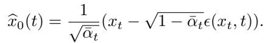

*Equation (12)*

Equivalently, we can use a score network $s ( x _ { t } , t )$ using Tweedie's identity:

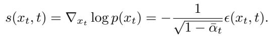

*Equation (13)*

> 💡 **公式批读 Eq (11)-(13)：噪声预测器与 score 互通（Hao 批注）**: Eq (11) 是扩散的"一步到位"加噪式 $x_t=\sqrt{\bar\alpha_t}x_0+\sqrt{1-\bar\alpha_t}\epsilon$；Eq (12) 用噪声预测网络 $\epsilon(x_t,t)$ 反解 $\hat{x}_0(t)$（Tweedie 去噪）；Eq (13) 用 Tweedie 恒等式把 score $s(x_t,t)=\nabla_{x_t}\log p(x_t)$ 与噪声预测器联系起来。这些都是标准工具，本文原样借用，目的是把 $\hat{x}_0(t)$ 送进 M 步做核估计（Fast 版的关键）。

Using DDPM [20] to discretize the unconditional reverse diffusion process (6) we obtain the update rule

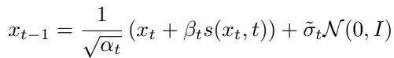

*Equation (14)*

where $\begin{array} { r } { \tilde { \sigma } _ { t } = \sqrt { \beta _ { t } } \mathrm { o r } \sqrt { \frac { ( 1 - \bar { \alpha } _ { t - 1 } ) } { 1 - \bar { \alpha } _ { t } } \beta _ { t } } } \end{array}$ . To simulate the conditional reverse diffusion process (7), we just have to add the likelihood term to the score

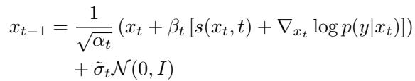

*Equation (15)*

> 💡 **公式批读 Eq (14)-(15)：无条件 vs 条件更新（Hao 批注）**: Eq (14) 是标准 DDPM 去噪一步（无条件）；Eq (15) 在 score 里加上似然 guidance $\nabla_{x_t}\log p(y|x_t)$ 就变成条件采样。差异只是"加不加 guidance 项"。这就是 Figure 2 里"模糊图作 guidance 介入扩散"的数学落点。

Using Equation (12), the DPS [7] approximation for $p ( x _ { 0 } | x _ { t } )$ leads to the following formula for the gradient of the log-likelihood:

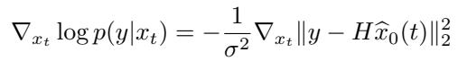

*Equation (16)*

Similarly, the ΠGDM [45] approximation leads to the following gradient for the log-likelihood:

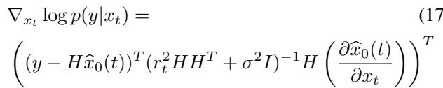

*Equation (17)*

> 💡 **公式批读 Eq (16)-(17)：两种 guidance 的实现代价（Hao 批注）**: Eq (16) DPS 的似然梯度 $-\frac{1}{\sigma^2}\nabla_{x_t}\|y-H\hat{x}_0(t)\|_2^2$——一个简单的重投影残差，自动微分即可，任意 $H$ 都适用。Eq (17) ΠGDM 的梯度含 $(r_t^2 HH^T+\sigma^2 I)^{-1}$，需要 $H$ 的伪逆，实现复杂但更精确。作者定调：**ΠGDM guidance 更强 → 对核估计更重要**（M 步能从更好的 $\hat{x}_0$ 反解出更准的核）。这解释了后文为何 ΠGDM 版全面占优。

DPS and ΠGDM derive different guidance terms for the inverse problem. While the DPS approximation leads to a gradient that is easily implemented for any degradation operator H using automatic differentiation, the ΠGDM approximated gradient of Equation (17) is much more complex to estimate for a general operator H because it requires the computation of its pseudo-inverse. On the other hand, the ΠGDM approximation is more precise and thus leads to stronger guidance which is very important for kernel estimation. We summarize in Algorithm 1 the diffusion process for inverse problems when the degradation operator H is known. This case covers both DPS and ΠGDM. The pseudo-code is written using DDPM but is not limited to this particular diffusion scheme. To compensate for the fact that the first estimations of $x _ { t }$ are uncertain, it is common to set $\zeta _ { t } = \sqrt { \bar { \alpha } _ { t } }$ , instead of the theoretical $\zeta _ { t } = 1$

```
Algorithm 1 Diffusion model for deblurring
Require: y, σ, H, T, (ζ_t)_t
Ensure: A posterior sample x_0 ~ p(x_0 | y, H)
  x_T ~ N(0, I)
  for t = T to 1 do
    ε̂ ← ε(x_t, t)
    x̂_0 = (1/√ᾱ_t)(x_t − √(1−ᾱ_t) ε̂)
    // DPS or ΠGDM approx. using x̂_0
    g ← ∇_{x_t} log p(y | x_t, H)          ▷ Equation (16) or (17)
    // Compute conditional score s = ∇_{x_t} log p(x_t | y, H)
    s ← ζ_t g − (1/√(1−ᾱ_t)) ε̂             ▷ Bayes rule and Tweedie
    // DDPM update rule
    z ← N(0, I)
    x_{t−1} ← (1/√α_t)(x_t + β_t s) + σ̃_t z
  end for
  return x_0
```

> 💡 **Algorithm 1 批读：E 步的"引擎"（Hao 批注）**: 这是**已知核 $H$** 时的非盲扩散采样，正是本文 E 步的基本单元。流程：初始化噪声 → 每步算 $\hat{x}_0$ → 算 guidance $g$（DPS 或 ΠGDM）→ 合成条件 score $s$ → DDPM 一步更新。$\zeta_t=\sqrt{\bar\alpha_t}$ 是对早期不确定 $x_t$ 的经验缩放（比理论值 1 更稳）。**关键观察**：这个算法要求 $H$ 已知——所以经典 Diffusion EM 每个 EM 轮都要完整跑一遍 Algorithm 1（慢），而 Fast EM 的巧思就是把核估计塞进这个循环内部（见 03.3）。

---

## 🔖 Section 总结

### 关键变量速查
| 符号 | 含义 |
|------|------|
| $y=Hx+n$ | 前向模型，$n\sim\mathcal{N}(0,\sigma^2)$ |
| $H_{MAP}=\arg\max_H p(H|y)$ | 核的边缘化 MAP（**点估计**目标，Eq 2） |
| $Q(H,H_l)$ | E 步的期望对数似然（Eq 3） |
| $\hat{x}_0(t)=E[x_0\|x_t]$ | 当前步干净图估计（Tweedie，Eq 12） |
| DPS / ΠGDM | 对 $p(x_0\|x_t)$ 的 δ / 高斯近似（Eq 9/10） |

### 核心洞察
1. **为什么 EM**：核 MAP 里对 $x$ 的边缘化积分不可解析，EM 用 E/M 交替绕开。这一步锁定了"$H$ 是点估计"。
2. **E 步引擎**：Algorithm 1（已知 $H$ 的非盲扩散），guidance 分 DPS（简单弱）/ ΠGDM（复杂强）两种。
3. **伏笔**：ΠGDM guidance 更强 → 核更好估；Fast 版会复用 $\hat{x}_0(t)$ 做核估计。

### 可追问点
- $r_t$（ΠGDM 方差超参）怎么选？→ 正文未细说，是 ΠGDM 原论文 [45] 的超参。
- 为什么 DPS 需 1000 步而 ΠGDM 只需 100 步？→ 见 04 节实验设置（DPS guidance 弱、收敛慢）。
