[← 返回 README](../README.md)

# 3. Method

## 📌 预览

方法节把 EM 框架落地成三块：**3.1 E 步**（用非盲扩散在当前核 $H_l$ 下采 $n$ 个后验图像样本，经验均值近似 $Q$）；**3.2 M 步**（用这些样本 + HQS 反解模糊核，创新点是 Plug & Play **核去噪器**当先验，Eq 24-25 给出傅里叶闭式解 + 去噪一步）；**3.3 Fast EM**（把 M 步塞进扩散每一步，用中间态 $\hat{x}_0(t)$ 当近似后验样本，只跑一次扩散，Algorithm 2）。

> 💡 **数据流总览（Hao 批注）**: 读方法节抓一条主线——**核 $\hat{H}$ 是唯一被"点估计"的量**。E 步产出图像样本（有随机性、有多样性），M 步把这些样本压成**单个** $\hat{H}$（$\arg\min$）。图像端是生成式（多样本），参数端是点估计（单核）。这就是本课题需要的对照：一个方法可以在图像上给分布，却在退化参数上只给点。

---

Our method proposes to solve the MAP of the blur kernel from a blurry and potentially noisy image. We estimate the MAP estimator in an EM fashion. Iteratively, we first draw samples from the posterior distribution knowing the current kernel estimate using a diffusion model. It corresponds to the E-step of the EM algorithm. Then, we update our estimated kernel with the M-step by maximizing the expected log-likelihood on the previously computed samples. To efficiently model the kernels' distribution, we use a Plug & Play kernel denoiser to regularize our MAP estimator.

## 3.1. E-step: Non-blind diffusion

> 💡 **3.1 要点预览（Hao 批注）**: E 步 = 在固定核 $H_l$ 下用非盲扩散（Algorithm 1）采 $n$ 个干净图样本，再用经验均值近似期望对数似然 $Q$。核心设计选择是**样本数 $n$**：$n$ 大 → 准但慢；$n=1$ → 退化成 Stochastic EM（随机 EM）。

The E-step of the EM algorithm consists in evaluating the expectation from Equation (3). Instead of computing its exact value, we propose to approximate it using random samples in a Monte-Carlo EM fashion. To draw the random samples, we use a non-blind diffusion model. Since the diffusion model targets $p ( x | y , H _ { l } )$ , sampling several images leads to a good approximation of the expectation. The number n of samples used to approximate the expectation is a hyperparameter of the method. Having many samples leads to a slow but accurate estimation while having only one sample is equivalent to the Stochastic EM algorithm [36]. In practice, the E-step reduces to:

Drawing samples

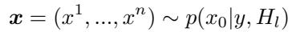

*Equation (18)*

and updating

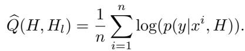

*Equation (19)*

The samples can be drawn by n parallel runs of Algorithm 1, and the empirical mean $\widehat { Q } ( H , H _ { l } ) \approx Q ( H , H _ { l } )$ approaches the expected value in Equation (3) as n → ∞. Unlike in Equation (3), we remove the term in $p ( x )$ from $\widehat { Q } ( H , H _ { l } )$ here since it does not affect the maximization in the blur kernel H.

> 💡 **公式批读 Eq (18)-(19)：E 步的两步落地（Hao 批注）**: Eq (18) 采样 $\pmb{x}=(x^1,\dots,x^n)\sim p(x_0|y,H_l)$——$n$ 次并行跑 Algorithm 1，每次给一个后验图像。Eq (19) 经验均值 $\hat{Q}(H,H_l)=\frac{1}{n}\sum_i \log p(y|x^i,H)$。**注意作者砍掉了 $\log p(x)$ 项**：因为 M 步只对核 $H$ 求 $\arg\max$，图像先验项与 $H$ 无关，是常数。这一步把 Eq (3) 的期望对数似然简化成"对样本的重投影似然均值"。$n\to\infty$ 时 $\hat{Q}\to Q$。对本课题：$n$ 个图像样本体现了图像端的分布，但它们最终只服务于压出**一个**核。

## 3.2. M-step: Kernel estimation

> 💡 **3.2 要点预览（Hao 批注）**: M 步 = 拿 E 步的图像样本当"已知清晰图"，反解模糊核。写成带正则的最小二乘（Eq 21），用 HQS 拆成"数据项闭式解（傅里叶，Eq 24）+ 核正则去噪（Eq 25）"。**本文最大创新点**：把核正则 $\Phi(\cdot)$ 从 $\ell_1/\ell_2$ 换成 **Plug & Play 核去噪器**（对模糊核数据集训练的 DnCNN/FFDNet）。

The M-step computes the MAP estimator of the blur kernel using the estimated samples from the E-step as measurements. From equations (1), (4) and (19) this step can be summarized as:

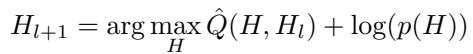

*Equation (20)*

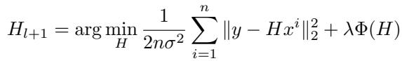

*Equation (21)*

where (21) is obtained using Equation (1) and (19). Common choices for $\Phi ( . )$ are $\ell _ { 2 } \mathrm { o r } \ell _ { 1 }$ regularizations on top of the simplex constraints on the blur kernel (non-negative values that add up to one). Despite being quite efficient when the blurry image does not have noise, they generally fail to provide good quality results when the noise increases. On the other side, Plug & Play regularizations have become more and more popular for many image restoration tasks. By training a deep denoiser on Gaussian denoising, one can obtain a powerful regularization in the domain on which the denoiser was trained. Generally, we train the denoiser on a dataset of natural images leading to a regularization on natural images. Here, we propose to train a denoiser on a dataset of blur kernels to build a Plug & Play regularization for the blur kernels. We observed that this approach leads to a kernel estimation algorithm that is more efficient and robust to noise, see Figure 4. To solve Equation (21), we use the Half-Quadratic Splitting (HQS) optimization scheme:

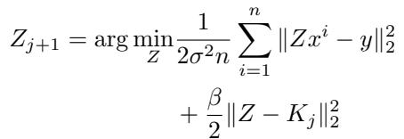

*Equation (22)*

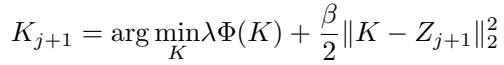

*Equation (23)*

> 💡 **公式批读 Eq (20)-(23)：M 步 = 带核先验的最小二乘（Hao 批注）**: Eq (20)-(21) 把 M 步写成 $H_{l+1}=\arg\min_H \frac{1}{2n\sigma^2}\sum_i\|y-Hx^i\|_2^2+\lambda\Phi(H)$——数据项是"用估计的核模糊每个样本图，误差要小"，正则项 $\Phi(H)$ 约束核。**这就是点估计的算子**：一个 $\arg\min$ 吐一个核。Eq (22)-(23) 是 HQS 拆解：引入辅助变量 $Z$，Eq (22) 解数据项（$Z$ 靠近 $K_j$），Eq (23) 解正则项（对 $Z$ 去噪得新核 $K$）。为何要 HQS：数据项在傅里叶域有闭式解，正则项可换成任意去噪器，两者解耦。
>
> **创新点批注**：作者把"对自然图训练去噪器当图像先验"这个 PnP 套路**搬到核上**——对**模糊核数据集**训练去噪器，得到"核先验"。动机：$\ell_1/\ell_2$ 核正则在有噪时失效（Figure 4），而学出来的核去噪器编码了真实运动模糊核的结构，抗噪强得多。

For the deconvolution problem, Equation (22) can easily be solved in the Fourier domain (more details on the computations can be found in Appendix B). Equation (23) corresponds to the regularization step. It corresponds to the MAP estimator of a Gaussian denoising problem on the variable $Z _ { j + 1 }$ . The main idea behind Plug & Play regularization is to replace this regularization step with a pre-trained denoiser D Mean Squared Error (MSE) loss. This substitution can be done thanks to the close relationship that exists between the MAP and the MMSE estimator of a Gaussian denoising problem [17]. Eventually, the M-step consists of the following iterations:

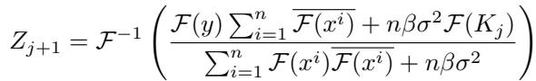

*Equation (24)*

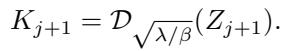

*Equation (25)*

> 💡 **公式批读 Eq (24)-(25)：M 步的实际迭代（Hao 批注）**: Eq (24) 是数据项在傅里叶域的闭式解——分子 $\mathcal{F}(y)\sum_i\overline{\mathcal{F}(x^i)}+n\beta\sigma^2\mathcal{F}(K_j)$，分母 $\sum_i\mathcal{F}(x^i)\overline{\mathcal{F}(x^i)}+n\beta\sigma^2$，本质是维纳滤波式的核反解（多样本联合）。Eq (25) 就是 PnP 一招：$K_{j+1}=\mathcal{D}_{\sqrt{\lambda/\beta}}(Z_{j+1})$，把正则子问题直接换成预训练**核去噪器** $\mathcal{D}$，去噪强度由 $\sqrt{\lambda/\beta}$ 控制。这个 MAP↔MMSE 的替换合法性来自 [17]。两步交替 = 完整 M 步。

While complex decreasing schemes for $\beta$ are often used to help HQS converge [54], we observed that using a constant $\beta$ was sufficient in our case. For the denoiser architecture, we use a simple DnCNN [55] with 5 blocks and 32 channels. In addition to the noisy kernel, we also give the noise level as an extra channel to the network to control the denoising intensity. Eventually, the complete Diffusion EM algorithm alternates between sampling from the non-blind diffusion model and the HQS algorithm for the kernel estimation. In all our experiments, we use $L = 1 0 \mathrm { E M }$ iterations. See Algorithm A.1 in the supplementary.

> 💡 **工程细节批注（Hao 批注）**: (1) $\beta$ 用常数即可（不必像 [54] 那样递减），说明本文 HQS 对超参不敏感；(2) 核去噪器用轻量 DnCNN（5 块 32 通道），噪声等级作**额外输入通道**控制去噪强度——这是 FFDNet 式设计（注意：正文这里写 DnCNN，04 节实验设置写 FFDNet，两处措辞不完全一致，都是 bias-free CNN 去噪器）；(3) 经典 Diffusion EM 用 $L=10$ 个 EM 轮，每轮完整跑一遍扩散——这就是慢的来源，引出 3.3 加速。

## 3.3. Fast EM diffusion

> 💡 **3.3 要点预览（Hao 批注）**: 核心加速思想——不要每个 EM 轮都完整跑一遍扩散（$L$ 次 × 每次 $T$ 步）。而是**在单次扩散的每一步 $t$，就用当前中间态 $\hat{x}_0(t)$ 当作近似后验样本，顺手做一次 M 步更新核**。这样核估计和图像采样共享同一个扩散循环，总成本 ≈ 一次非盲扩散。

The diffusion EM algorithm requires running a diffusion model at each step of the EM algorithm to produce a set of n particles. Executing diffusion models is time-consuming, particularly in cases where inverse problems are addressed using score guidance, as the guidance must be applied to the full-size image, precluding the utilization of acceleration techniques like latent diffusion [39]. Consequently, the diffusion EM algorithm's execution time becomes excessively long, significantly restricting its practical applicability.

> 💡 **问题动机（Hao 批注）**: 为什么扩散慢到不可用？因为 guidance（Eq 16/17）必须作用在**全尺寸图**上（要算 $Hx$），无法搬到 latent 空间加速。$L=10$ 轮 × 每轮上百步扩散 = 分钟级。这就是要 Fast 版的硬约束。

```
Algorithm 2 Fast EM DPS / ΠGDM
Require: y, σ, H_T, T
Ensure: H ≈ arg min_H p(y | H)  and  x_0^i ~ p(x_0 | y, H)
  x_T ~ (N(0, I), ..., N(0, I)) ∈ (R^{h*w*3})^n
  for t = T to 1 do
    ε̂ ← ε(x_t, t)
    x̂_0 = (1/√ᾱ_t)(x_t − √(1−ᾱ_t) ε̂)
    H_{t−1} = M-step(y, x̂_0, σ)                ▷ Iterate (24) and (25)
    // DPS or ΠGDM approx. using x̂_0
    g ← ∇_{x_t} log p(y | x_t, H_{t−1})         ▷ Equation (16) or (17)
    // Compute conditional score s = ∇_{x_t} log p(x_t | y, H)
    s ← ζ_t g − (1/√(1−ᾱ_t)) ε̂                 ▷ Bayes rule and Tweedie
    // DDPM update rule
    z ← (N(0, I), ..., N(0, I)) ∈ (R^{h*w*3})^n
    x_{t−1} ← (1/√α_t)(x_t + β_t s) + σ̃_t z
  end for
  return x_0, H_0
```

> 💡 **Algorithm 2 批读：Fast EM 的一次成型（Hao 批注）**: 对比 Algorithm 1，唯一新增的是那一行 `H_{t−1} = M-step(y, x̂_0, σ)`——**在每个扩散步先用当前 $\hat{x}_0$ 估一次核，再用这个刚更新的核 $H_{t-1}$ 做 guidance**。数据流：$x_t \to \hat{x}_0(t) \to$ 更新核 $H_{t-1} \to$ 用 $H_{t-1}$ 算 guidance $\to$ 更新 $x_{t-1}$。$n$ 个粒子作为 batch（正文用粗体变量标记）在 $x_t$ 里一起跑。返回时同时给出图像 $x_0$ 和核 $H_0$。**关键**：核在扩散推进中"越估越准"——早期 $\hat{x}_0$ 糊、核粗；后期 $\hat{x}_0$ 清晰、核精。这就是把 EM 的"交替收敛"嵌进扩散时间轴。对本课题：即便如此精巧，输出仍是**单个 $H_0$**（点估计），没有为核维护分布。

To bypass this problem, we propose a fast version of diffusion EM that incorporates the M-step directly into the diffusion process, thereby reducing the number of required diffusion model runs to just one. To do so, we use the n current samples $x _ { t } ^ { i } \sim p ( x _ { t } | y , H )$ to build an approximation of $Q ( H , H _ { t } )$ at each timestep t, as follows. First, we use the current distribution estimates $p ( x _ { 0 } | x _ { t } )$ (Equations (9) and (10) for DPS, resp. ΠGDM approximations) for each timestep t to approximate the posterior $p ( x _ { 0 } | y , H )$ by (discretized) marginalization on x<sub>t</sub>:

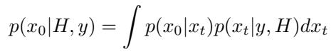

*Equation (26)*

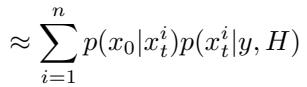

*Equation (27)*

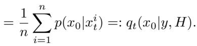

*Equation (28)*

> 💡 **公式批读 Eq (26)-(28)：用中间态当后验样本（Hao 批注）**: 这是 Fast 版的理论支点。Eq (26) 把目标后验 $p(x_0|H,y)$ 写成对 $x_t$ 边缘化 $\int p(x_0|x_t)p(x_t|y,H)dx_t$；Eq (27) 用当前 $n$ 个粒子 $x_t^i$ 离散化这个积分；Eq (28) 因为粒子已经服从 $p(x_t|y,H)$，权重都是 $1/n$，得到 $q_t(x_0|y,H)=\frac{1}{n}\sum_i p(x_0|x_t^i)$。含义：**不必等扩散跑完拿真样本 $x^i$，每步的 $p(x_0|x_t^i)$（DPS 是 δ，ΠGDM 是高斯）就是一个"当前近似后验"**，可直接喂给 M 步。

Then, using this approximation, the E-step at timestep t of the diffusion process is reformulated as follows:

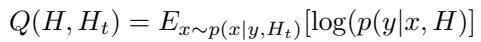

*Equation (29)*

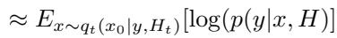

*Equation (30)*

Since the distribution $q _ { t } ( x _ { 0 } | y , H )$ progressively converges to the distribution $p ( x _ { 0 } | y , H )$ as $t  0 ,$ , we have a finer and finer estimation of the expected log-likelihood and thus, the blur kernel, through the iterations.

> 💡 **公式批读 Eq (29)-(30)：为什么核越估越准（Hao 批注）**: Eq (29)-(30) 把每步的 E 步期望从对真后验 $p$ 换成对近似 $q_t$ 求。作者论证：$q_t \to p$ 当 $t\to 0$（扩散末期粒子越来越接近真样本），所以核估计随扩散推进单调变精。这解释了 Algorithm 2 里 `H_{t-1}` 逐步收敛，也解释了后文"Fast EM 从不卡在 no-blur 解"（因为核在扩散早期就被粗估、持续修正，而经典 Diffusion EM 可能第一轮就采出锐图导致核估成 δ 单位核）。

Finally, the E-step reduces in the case of the DPS approximation (9) to:

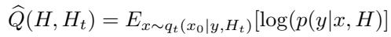

*Equation (31)*

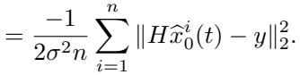

*Equation (32)*

In this case, the M-step is equivalent to the classical diffusion EM M-step of Equation (21) but applied in the current estimate $\widehat { x } _ { 0 } ^ { i } ( t )$ instead of the real sample $x ^ { i }$ . In the case of the ΠGDM approximation (10), we have:

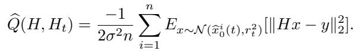

*Equation (33)*

The computations for the M-step in that case are left in Appendix D. Eventually, the only difference between the fast EM diffusion algorithm and a classical non-blind diffusion model is that we first estimate the blur kernel before applying the guidance. Our algorithm demonstrates comparable computational efficiency to non-blind diffusion algorithms, as the computation of the M-step negligibly impacts the overall diffusion process. The algorithm's pseudo-code can be found in Algorithm 2. Note that in the pseudo-code, the n particles are treated as a batch directly in the $x _ { t }$ . To point out this difference, all the variables that are seen as a batch are written in bold.

> 💡 **公式批读 Eq (31)-(33)：DPS 版 vs ΠGDM 版 M 步（Hao 批注）**: Eq (31)-(32) DPS 版：$\hat{Q}=\frac{-1}{2\sigma^2 n}\sum_i\|H\hat{x}_0^i(t)-y\|_2^2$——和经典 M 步 Eq (21) 一模一样，只是把真样本 $x^i$ 换成当前估计 $\hat{x}_0^i(t)$。Eq (33) ΠGDM 版：因为 $p(x_0|x_t)$ 是高斯（有方差 $r_t^2$），期望里多了对高斯的积分，最终在核解的**分母多一项 $r_t^2$**（见附录 D.9）——这项等于承认"$\hat{x}_0$ 本身不确定"，让核估计更保守/稳健。作者点睛：Fast EM 与普通非盲扩散**唯一区别就是"在施加 guidance 前先估一次核"**，M 步开销可忽略，故速度≈非盲扩散。

---

## 🔖 Section 总结

### 关键变量/数字速查
| 项 | 值/含义 |
|------|------|
| E 步样本数 $n$ | $\{1,4,16\}$；$n=1$ = Stochastic EM |
| 经典 Diffusion EM 轮数 $L$ | 10（每轮完整跑一次扩散 → 慢） |
| 核去噪器 | DnCNN（5 块 32 通道）/ FFDNet，噪声等级作额外通道 |
| M 步 HQS | 数据项傅里叶闭式解 Eq (24) + 核去噪 Eq (25)，常数 $\beta$ |
| Fast EM 加速比 | EM ΠGDM(n=1) 1min30s → Fast EM ΠGDM(n=1) 9s |

### 核心洞察
1. **E 步**：非盲扩散采 $n$ 样本 → 经验均值近似 $Q$（图像端是分布）。
2. **M 步**：带 Plug & Play 核去噪先验的 HQS，输出**单个** $\hat{H}$（参数端是点估计）——本课题对照锚点。
3. **Fast EM**：把 M 步嵌入扩散每一步，用 $\hat{x}_0(t)$ 当近似后验样本（Eq 26-33），核随 $t\to 0$ 越估越准，成本≈一次非盲扩散。
4. **DPS vs ΠGDM 分母差 $r_t^2$**：ΠGDM 版承认 $\hat{x}_0$ 不确定性，更稳。

### 可追问点
- 为什么 Fast EM 不会卡在 no-blur 解，而经典 Diffusion EM 会？→ 04 节实验证实；机制是核在扩散早期即被持续修正（Eq 30 论证）。
- 核去噪器的训练集怎么造？→ 04 节：用 [15] 生成的随机运动模糊核。
