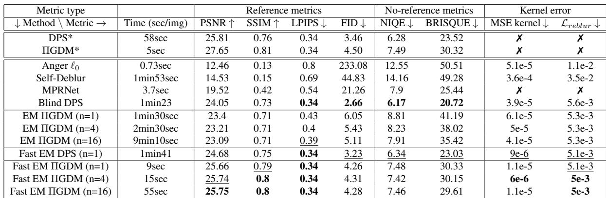
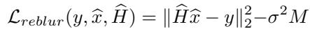
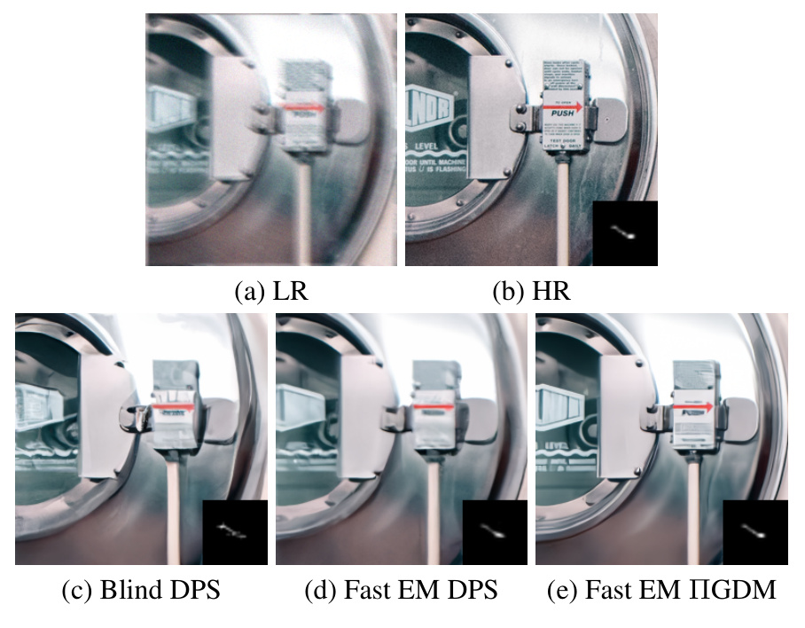
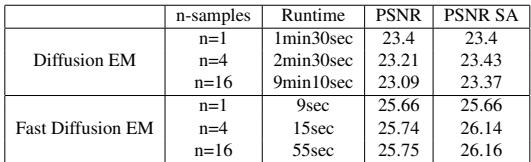

[← 返回 README](../README.md)

# 4. Experiments

## 📌 预览

实验分四块：**4.1 设置**（FFHQ 256×256 前 1000 张，随机运动模糊核 + 噪声 $\sigma\in\{5,10,20\}$；核去噪器用运动模糊核训练的 bias-free FFDNet；DPS 需 1000 步、ΠGDM 只需 100 步）；**4.2 对手**（Anger $\ell_0$、Self-Deblur、MPRNet、Blind DPS，外加非盲 DPS/ΠGDM 作上界参考）；**4.3 定量**（Table 1 全指标 + Figure 3/5 视觉 + Eq 34 一致性度量）；**4.4 消融**（Figure 4 核正则、Table 2 样本数 $n$）。

> 💡 **证据链总览（Hao 批注）**: 本节要证三件事——(1) 扩散类方法整体碾压传统优化/回归；(2) 在扩散类里，本文 Fast EM 在**保真+核精度+一致性**上最好，Blind DPS 在**感知锐度**上略胜但靠"幻觉"；(3) Fast EM 比经典 Diffusion EM 又快又好。读表时务必区分 **fidelity 指标**（PSNR/SSIM/kernel MSE/L_reblur，本文强项）和 **perceptual 指标**（NIQE/BRISQUE/FID，Blind DPS 强项）——这正是"点估计一致性 vs 生成式幻觉"的对照。

---

## 4.1. Experimental settings

We test our algorithm on the first 1000 validation images of the widely used FFHQ [24] 256x256 dataset that we degrade with random motion blur kernels computed using [15] and random Gaussian noise with noise level $\sigma \in$ {5, 10, 20}. We also provide some results on DIV2K [1] dataset. To achieve a fair comparison, we use the code and pre-trained weights provided by the authors of Blind DPS. For ΠGDM, there is no public code so we re-implemented the model using the Blind DPS code backbone. In our experiments, we observed that DPS needs more iterations to properly converge in comparison to ΠGDM. Indeed, the DPS run needs 1000 iterations while we only use 100 iterations for ΠGDM. For the kernel estimation, we use a bias-free FFDNet [56] denoiser trained on a dataset of motion blur kernels for the Plug & Play regularization. At test time, the M-step consists of 10 HQS iterations with hyperparameters $\lambda = 1$ and $\beta = 1 e 5$ . We provide experiments with different numbers of particles for both the Diffusion EM algorithm and the Fast diffusion EM algorithm. We use $n \in \{ 1 , 4 , 1 6 \}$ . All the models are evaluated on a single A100 GPU.

> 💡 **实验设置批读（Hao 批注）**: 几个关键点：(1) **合成数据**——干净图取自 FFHQ，用 [15] 的相机抖动模型生成运动模糊核，人为加噪 $\sigma\in\{5,10,20\}$，所以核 ground truth 已知，可算 kernel MSE（这是本文能给核精度指标的前提）；(2) **DPS 1000 步 vs ΠGDM 100 步**——直接印证 02 节判断"DPS guidance 弱、收敛慢"，也解释 Figure 1 里 DPS 系列在右侧（慢）；(3) 共享 Blind DPS 的 score 网络权重做公平对比（同一图像先验，差异只在核估计策略）；(4) M 步 10 次 HQS，$\lambda=1,\beta=1e5$，核去噪器是**bias-free FFDNet**（注意与 03 节"DnCNN"措辞不一，实现细节以此为准）。对本课题：$\sigma$ 在此是**已知输入**，未被联合估计——若换成我们的"联合估 $\sigma$"设定，需额外为 $\sigma$ 建后验。

## 4.2. Compared methods

To test the efficiency of our method, we compare it to state-of-the-art models for deconvolution. We chose to compare against both optimization-based methods, deep learning approaches, and diffusion models to cover all the existing approaches. More specifically, we compare our method to [3] which is a MAP-based method for kernel estimation that uses $\ell _ { 0 }$ norm on the gradient of the image as an image prior and $\ell _ { 2 }$ norm to regularize the kernel. We also compare to self-deblur [38] which is a blind deconvolution method that provides both image reconstruction and kernel estimation based on Deep Image Prior. We provide comparisons with MPRNet [52] which is a multi-scale deep learning architecture design for image restoration problems that has proven its efficiency in deblurring. Finally, we compare our kernel estimation methods to Blind DPS [6] which consists of two parallel diffusion models that jointly model the restored image and its corresponding blur kernel. We also computed the results of the non-blind model DPS and ΠGDM to highlight the loss of quality between the blind and non-blind models. For all the methods, we used the source code and pre-trained weights provided by the author.

> 💡 **对手谱系批读（Hao 批注）**: 四类基线覆盖全谱：**优化派** Anger $\ell_0$ [3]（图像梯度 $\ell_0$ + 核 $\ell_2$ 的 MAP）、**DIP 派** Self-Deblur [38]、**回归派** MPRNet [52]、**扩散派** Blind DPS [6]。外加**非盲 DPS/ΠGDM** 作"天花板参考"（知道真核时能到多好）。Table 1 里带 `*` 的就是非盲上界，不参与盲方法排名。最关键的对照是 Blind DPS——同样用扩散、同样联合估核，但它让核走扩散（生成式），本文让核走 EM（点估计），两者差异是本文的核心叙事。

## 4.3. Quantitative results

*Table 1. Model comparison on FFHQ synthetic dataset. Models with a "*" correspond to non-blind models used as baselines. Best blind models are in bold while second best are underlined. Note that baselines do not count for best model rankings.*

> 💡 **Table 1 批读：主结果证据链（Hao 批注）**: 逐列拆（↑越高越好，↓越低越好）：
> - **保真（PSNR/SSIM）**：Fast EM ΠGDM 系列 25.66-25.75 / 0.79-0.80，是所有**盲**方法最高；Blind DPS 只有 24.05 / 0.73。Fast EM DPS 24.68。传统法惨败（Anger 12.46、Self-Deblur 14.53、MPRNet 19.52）。
> - **核精度（MSE kernel ↓）**：Fast EM 系列 6e-6 ~ 1.1e-5，比 Blind DPS 的 3.9e-5 好一个量级——**点估计核最准**，这是本文最硬的 claim。
> - **一致性（$\mathcal{L}_{reblur}$ ↓）**：Fast EM 5e-3 ~ 5.1e-3，优于 Blind DPS 5.6e-3——重模糊后最贴合观测。
> - **感知（FID/NIQE/BRISQUE ↓）**：这里 Blind DPS 反超（FID 2.66、NIQE 6.17、BRISQUE 20.72），Fast EM ΠGDM 偏弱（FID 4.28、BRISQUE ~30）。作者解释：Blind DPS 更锐但靠**幻觉**（细节是编造的，故感知分高但保真/一致性差）。
> - **速度**：Fast EM ΠGDM(n=1) 仅 9 秒，vs Blind DPS 1min23、经典 EM ΠGDM(n=1) 1min30。
>
> **一句话**：本文用"感知锐度略降"换"保真+核精度+一致性+速度全面提升"。这正是点估计（收敛到一致解）vs 生成式（敢幻觉）的经典权衡。

Table 1 shows the results of the different models on FFHQ synthetic dataset. We compute both classical metrics with full or reduced reference such as PSNR, SSIM [48], LPIPS [58] and FID [19], no-reference metrics to measure perceptual quality such as NIQE [35] and BRISQUE [34] and kernel metrics such as the Mean-Squared Error (MSE) on the reconstructed kernel. We also measure the consistency of the estimated image x and kernel $\widehat { H }$ with the forward model by means of:

*Equation (34)*

> 💡 **公式批读 Eq (34)：重模糊一致性度量（Hao 批注）**: $\mathcal{L}_{reblur}(y,\hat{x},\hat{H})=\|\hat{H}\hat{x}-y\|_2^2-\sigma^2 M$，$M=3hw$。含义：用估计的核 $\hat{H}$ 去模糊估计的图 $\hat{x}$，看它离观测 $y$ 多远，再减掉噪声应贡献的期望能量 $\sigma^2 M$。理想情况残差正好等于噪声能量，$\mathcal{L}_{reblur}\approx 0$。这是一个**不需要 ground truth** 的自洽性指标——它奖励"图和核联合解释观测"。对本课题：这类一致性度量类似我们做后验校准时的 posterior predictive check，但它只测点估计的自洽，**测不出后验是否覆盖真值**（无法替代 SBC/coverage）。

We observe that classical optimization-based approaches such as Anger $\ell _ { 0 }$ [3] and Self-Deblur [38] fail to estimate the blur and reconstruct the image efficiently. The main problem with those approaches is that they fail to produce pleasant results in the presence of noise. While Anger $\ell _ { 0 }$ [3] produces results with over-sharpened noise, Self-Deblur [38] completely fails to both estimate the kernel and deblur the image. MPRNet produces better results but with artifacts due to the noise, it also fails to recover high-frequency details which is a common problem when using deep-learning models trained on mean-squared error. Diffusion-based models seem to be the most efficient. Blind DPS ranks best among the no-reference perceptual metrics and FID while ranking below our model both for reference metrics and kernel estimation. Figure 3, shows some example images where we can notice the sharpness and high quality of Blind DPS results. In our experiments, we observed that Blind DPS sometimes fails to efficiently estimate the blur kernel, especially in the presence of noise. We also noticed that on some images Blind DPS was producing sharper results than our model, even with a worst kernel prediction which is surprising since we use the same diffusion model. Yet, the fact that our model has better full-reference metrics and better measurement consistency points out the fact that Blind DPS hallucinates more details. We also conducted experiments on deblurring images from DIV2K dataset while keeping the same FFHQ-trained score model for testing. In that particular case, the prior of the score model does not match the distribution of the test images so the model won't be able to hallucinate accurate details. Some visual results of those experiments can be found in Figure 5. Those experiments showed that our model and especially the one based on ΠGDM diffusion produces sharper results. It highlights the fact that Blind DPS and DPS, in general, have weaker guidance than ΠGDM, so it requires a more accurate score model which can be a limitation in practice since training a score model on the space of natural images is not an easy task. During our experiments, we realized that Fast Diffusion EM was both faster and better in terms of quality than

*Figure 3. Visual comparison of the different models on a degraded version of the FFHQ 256x256 dataset. Ours correspond to Fast EM.*

> 💡 **Figure 3 批读：分布内视觉对比（Hao 批注）**: FFHQ（人脸，与 score 网络训练分布一致）上的定性对比。要看两点：(1) 传统法（Anger/Self-Deblur/MPRNet）有明显噪声伪影/糊；(2) Blind DPS 看着最锐，但正文点名它"hallucinates more details"——第二行有幻觉（编出不存在的细节），而本文 Fast EM 虽略柔但更忠实（对应 Table 1 更高 PSNR、更低 $\mathcal{L}_{reblur}$）。这张图服务的 claim：视觉锐 ≠ 保真，Blind DPS 的锐是"以幻觉换取"。

*Figure 5. Visual comparison on out-of-distribution images. The score network is trained on FFHQ dataset while we test on DIV2K.*

> 💡 **Figure 5 批读：OOD 才是照妖镜（Hao 批注）**: 这是最有说服力的一张。score 网络只在 FFHQ（人脸）训练，却测 DIV2K（自然图）——**先验分布不匹配，模型无法"幻觉"出正确细节**，只能靠 guidance 硬拉。结果：(c) Blind DPS 因 guidance 弱、又不能靠人脸先验幻觉，恢复得糊；(e) Fast EM ΠGDM 因 guidance 强，即便先验不匹配也能拉出清晰结构（注意右下角的估计核也最接近条状运动模糊）。这坐实了 02 节判断："ΠGDM guidance 强 → 不依赖精确 score 网络"，是本文相对 DPS 系的实际优势。对本课题：OOD 下点估计仍靠强 guidance 撑住，但也暴露了"先验不匹配时无法量化不确定性"的问题——正是需要校准后验的场景。

Diffusion EM. Indeed, Diffusion EM is sometimes stuck in the no blur solution while we never observed this problem for Fast Diffusion EM. In terms of metrics, both Fast EM DPS and Fast EM ΠGDM have better reference metrics than all the other methods, and for any number of particles. We observed better performance and faster runtime with the ΠGDM model, probably because it has stronger guidance, thus, it is easier for the M-step to estimate the blur kernel. Fast EM ΠGDM performance in no-reference metrics NIQE and BRISQUE is worse than the other diffusionbased methods: BlindDPS and Fast EM DPS have indeed slightly sharper results, but they are less accurate and less consistent (see the hallucinations of BlindDPS in the second line in Figure 3). In terms of runtime, our ΠGDMbased model ranks best among diffusion models but it is significantly slower than MPRNet and Anger $\ell _ { 0 }$

> 💡 **关键对照：Fast EM vs 经典 Diffusion EM（Hao 批注）**: 这段藏着 Fast 版最重要的证据——"Diffusion EM is sometimes stuck in the **no blur solution**"，即经典版有时把核估成"无模糊"（δ 单位核，直接判定图是清晰的），而 Fast 版从未出现。机制（呼应 03 节 Eq 30）：经典 EM 第一轮就采出锐图 → M 步误判无模糊 → 恶性循环；Fast EM 在扩散早期（图还糊时）就开始估核并持续修正，避开了这个陷阱。这是"把 EM 嵌入扩散时间轴"带来的意外稳健性收益，不只是提速。

## 4.4. Ablation studies

In this section, we discuss the efficiency of the different blocks of our algorithm. We first provide some additional results that show the efficiency of the proposed Plug & Playbased kernel regularization. Next, we study the influence of the number of samples used to estimate the E-step on the quality of the final results. To compare the efficiency of our regularization, we compared it against the $\ell _ { 1 }$ and $\ell _ { 2 }$ regularizations. To do so, we use our FFHQ synthetic dataset and estimate the blur kernel in the non-blind setting where the sharp and blurry images are both known. We compute the MSE of the reconstructed kernel for several noise levels. For all the regularizations, we used the same optimization scheme, HQS, and fine-tuned the hyper-parameters of the regularizations separately. Figure 4 shows the obtained results. We observed that our regularization is significantly better in the presence of noise and the loss of quality between $\sigma = 5$ and $\sigma = 2 0$ is very small. Finally, we also investigated the influence of the number of samples in our algorithms. We observed in Table 1 and Table 2 that increasing the number of samples increases the image reconstruction and kernel estimation accuracy. Using all the samples, we can also compute the PSNR on the average of the samples produced by the model. We refer to this metric as the "PSNR SA" in Table 2. Usually, the PSNR SA gives a higher PSNR than the PSNR on a single image, even if the average image is less sharp. We also observed that in the case of Diffusion EM, increasing the number of samples lowers the PSNR but improves all the other metrics. Averaging several samples is also possible with methods such as Blind-DPS, the main difference is that in our approach, all the samples have the same guidance at each diffusion step since we estimate a single kernel for all the samples. In Blind-DPS, all the samples have their respective kernels.

*Figure 4. Comparison of the efficiency of the different kernel regularizations depending on the noise level $\sigma \in [ 0 , 2 0 ]$ . The vertical axis shows the mean MSE over the whole FFHQ dataset for kernel estimation from a noisy and blurred observation of a known image.*

> 💡 **Figure 4 批读：核正则消融（Hao 批注）**: 横轴噪声等级 $\sigma\in[0,20]$，纵轴核 MSE（越低越好）。三条曲线：$\ell_1$、$\ell_2$、本文 PnP 核去噪器。**在非盲设定**（清晰图和模糊图都已知，隔离出核正则本身的贡献）下比较。结论：$\ell_1/\ell_2$ 随噪声升高 MSE 急剧恶化，本文 PnP 核正则曲线几乎平——"$\sigma=5$ 到 $\sigma=20$ 损失很小"。这直接支撑 03.2 的创新点 claim：**学出来的核先验编码了真实运动模糊核结构，抗噪远强于解析范数**。这是本文最干净的一个消融（控制了变量）。

*Table 2. Influence of the number of samples used to estimate the E-step in Fast EM ΠGDM. The image PSNR is computed on the first image of the batch.*

> 💡 **Table 2 批读：样本数 $n$ 消融（Hao 批注）**: 对比经典 Diffusion EM 和 Fast Diffusion EM 在 $n\in\{1,4,16\}$ 下的运行时间/PSNR/PSNR SA（SA = 对 $n$ 个样本求平均后再算 PSNR）。三点：
> - **速度碾压**：Fast EM 9s/15s/55s vs 经典 EM 1min30/2min30/9min10——加速一个量级。
> - **PSNR SA 随 $n$ 升**：Fast EM 25.66→26.16，说明多样本平均能提保真（但平均图更柔，是保真-锐度权衡）。
> - **经典 EM 反常**：$n$ 增大单图 PSNR 反降（23.4→23.09），呼应 4.3 正文"increasing samples lowers PSNR but improves other metrics"。
> - **核心差异句**：本文所有样本**每步共享同一个核 guidance**（因为 M 步只估一个核），而 Blind DPS 每个样本各有各的核。这再次点明本文的"单核点估计"本质——把核的不确定性坍缩成一个共享值。

---

## 🔖 Section 总结

### 关键数字速查
| 指标 | Fast EM ΠGDM (n=1) | Blind DPS | 非盲 ΠGDM* |
|------|------|------|------|
| Time | 9 sec | 1min23 | 5 sec |
| PSNR ↑ | 25.66 | 24.05 | 27.65 |
| SSIM ↑ | 0.79 | 0.73 | 0.81 |
| FID ↓ | 4.26 | **2.66** | 4.50 |
| MSE kernel ↓ | **1.1e-5** | 3.9e-5 | — |
| $\mathcal{L}_{reblur}$ ↓ | **5.1e-3** | 5.6e-3 | — |

### 核心洞察
1. **主结果**：Fast EM 在保真（PSNR/SSIM）、核精度（MSE kernel 好一个量级）、一致性（$\mathcal{L}_{reblur}$）、速度上全面领先盲方法；仅感知锐度（FID/NIQE/BRISQUE）输给 Blind DPS，但后者靠幻觉（Figure 3/5）。
2. **消融 1（Figure 4）**：PnP 核去噪正则抗噪远超 $\ell_1/\ell_2$，$\sigma=5\to20$ 几乎不掉——本文核心创新点被证实。
3. **消融 2（Table 2）**：多样本提 PSNR SA，但所有样本共享单核 guidance（点估计本质）；Fast EM 比经典 EM 快一个量级且从不卡在 no-blur 解。
4. **OOD（Figure 5）**：ΠGDM 强 guidance 使其在先验不匹配时仍能恢复清晰结构，是相对 DPS 系的实用优势。

### 可追问点（本课题视角）
- $\mathcal{L}_{reblur}$ 只测点估计自洽，**无法测后验覆盖率**——若要 SBC/coverage 需为 $H$ 建后验。
- 所有样本共享单核 = 把核不确定性坍缩为点。若改成"每样本各自的核 + 校准"，即接近本课题目标。
