[← 返回 README](../README.md)

# Appendix (A–E) + References

## 📌 预览

附录补四类内容：**A** 经典 Diffusion EM 的完整伪码（Algorithm A.1）；**B** M 步在傅里叶域的推导（为什么 Eq 24 是闭式解）；**C** Fast EM 的 DPS 版 M 步推导；**D** Fast EM 的 ΠGDM 版 M 步推导（关键结论：分母比 DPS 多一项 $r_t^2$）；**E** 额外视觉对比（Figure E.1）。这些是正文 Eq 24/32/33 的展开证明。

> 💡 **附录读法（Hao 批注）**: 附录 B/C/D 是同一套推导的三个变体——都在傅里叶域把核估计化成**逐频率的一维二次问题**（卷积算子在傅里叶域对角化），再用一阶条件解出闭式。三者的唯一区别在"用什么当清晰图 + 是否含 $\hat{x}_0$ 的方差"：B 用真样本 $x^i$；C 用 DPS 的点估计 $\hat{x}_0^i(t)$；D 用 ΠGDM 的高斯 $\mathcal{N}(\hat{x}_0^i(t),r_t^2)$，多出 $r_t^2$ 项。抓住这条主线就不必逐式硬啃。

---

## A. Iterative Diffusion EM algorithm

Algorithm A.1 summarizes the Diffusion EM algorithm described in sections 3.1 and 3.2.

```
Algorithm A.1 Diffusion EM algorithm
Require: y, σ, H_0, L
Ensure: H ≈ arg min_H p(y | H)  and  x_0^i ~ p(x_0 | y, H)
  for l = 1 to L do
    x = E-step(y, H_{l−1}, σ)      ▷ n samples from Alg. 1
    H_l = M-step(y, x, σ)          ▷ Iterate (24) and (25)
  end for
  return x, H_L
```

> 💡 **Algorithm A.1 批读：经典版的双层循环（Hao 批注）**: 对比正文 Algorithm 2（Fast 版），这里是**外层 EM 循环（L 轮）× 内层完整扩散（每轮 E-step 跑一遍 Algorithm 1）**。这就是慢的根源：$L=10$ 轮，每轮上百步扩散。Fast 版把这个双层循环压成单层（扩散每步顺手做一次 M 步），从 $L\times T$ 次扩散步降到 $T$ 次。这段伪码是理解"为什么要 Fast 版"的对照基准。

## B. M-step computations

In this section, we derive the computation of the M-step. In particular, we solve Equation (22) from the main paper:

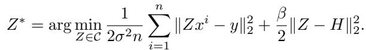

*Equation (B.1)*

with $\mathcal { C }$ the space of convolution operators.

In order to account for the fact that $H \in { \mathcal { C } }$ and $Z _ { t } \in \mathcal { C }$ are convolution operators, we rewrite the same equation in the Fourier domain, where the operators H and Z become diagonal:

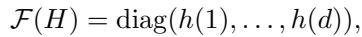

*Equation (B.2)*

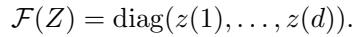

*Equation (B.3)*

Re-writing the minimization in the Fourier domain leads to:

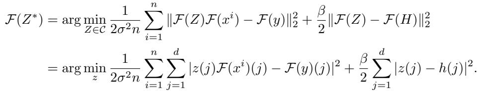

*Equation (B.4) / (B.5)*

It is straightforward that the solution to the problem is also diagonal, thus we have:

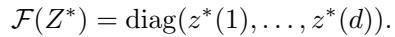

*Equation (B.6)*

Using the first-order condition and the diagonal structure of the problem, we get the following:

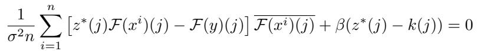

*Equation (B.7)*

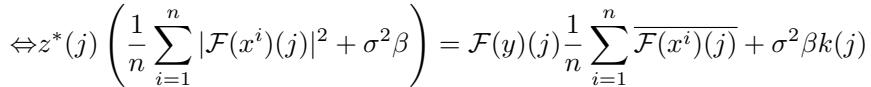

*Equation (B.8)*

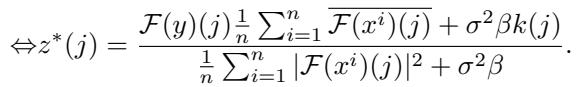

*Equation (B.9)*

> 💡 **公式批读 B.1–B.9：为什么核估计有闭式解（Hao 批注）**: 核心技巧是 **卷积在傅里叶域对角化**——B.2/B.3 把算子 $H,Z$ 写成对角阵（对角元是核的傅里叶系数 $h(j),z(j)$）。于是 B.1 的多样本最小二乘 + 二次正则在傅里叶域**逐频率解耦**成 $d$ 个独立的一维二次问题（B.4）。B.7 是一阶条件，B.9 是闭式解 $z^*(j)$——分子是"观测与样本的互功率谱 + 正则拉向 $k(j)$"，分母是"样本的功率谱 + $\sigma^2\beta$"。这就是正文 Eq (24) 的来源。对本课题：这种傅里叶闭式解只在**卷积（gauge 结构简单）**下成立，若算子参数是更一般的低维 $\varphi$（非卷积），M 步/后验采样都要换方案。

## C. M-step computations with DPS approximation

In this section, we develop the computation of the M-step in Fast EM for DPS. We start from Equation (32) of the main paper:

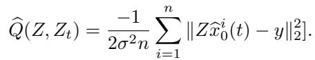

*Equation (C.1)*

Our goal is to compute:

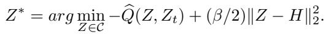

*Equation (C.2)*

We can notice that it is similar to Equation (B.4) with $\widehat { x } _ { 0 } ^ { i } ( t )$ instead of $x ^ { i }$ . Thus we have that:

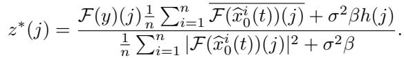

*Equation (C.3)*

> 💡 **公式批读 C.1–C.3：DPS 版就是"换清晰图"（Hao 批注）**: 作者明说 C.2 与 B.4 结构相同，**只是把真样本 $x^i$ 换成当前点估计 $\hat{x}_0^i(t)$**。所以 C.3 的闭式解 $z^*(j)$ 与 B.9 形如一辙，只是傅里叶里用 $\mathcal{F}(\hat{x}_0^i(t))$。这印证了正文说的"Fast EM DPS 的 M 步 = 经典 M 步作用在中间估计上"。DPS 是 δ 近似（无方差），所以没有额外项。

## D. M-step computations with ΠGDM approximations

In this section, we develop the computation of the M-step in Fast EM for ΠGDM. We start from Equation (33) of the main paper:

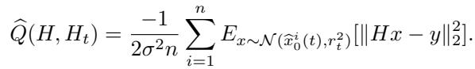

*Equation (D.1)*

Our goal is to compute:

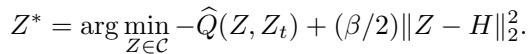

*Equation (D.2)*

Similarly to Section B, we work with diagonal operators so we have:

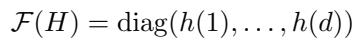

*Equation (D.3)*

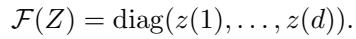

*Equation (D.4)*

and thus:

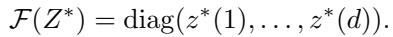

*Equation (D.5)*

We start by rewriting Equation D.1 in the Fourier domain using the fact that the Fourier transform preserves norms:

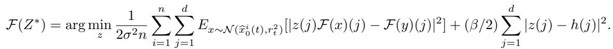

*Equation (D.6)*

We solve this problem using the first-order condition element by element since the problem is diagonal, the derivation inside the expectancy can be done using Fisher identity [12, Proposition D.4]:

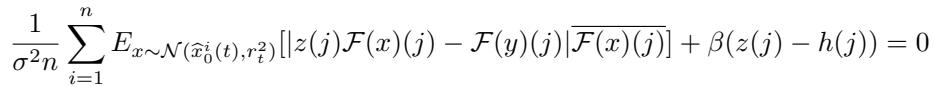

*Equation (D.7)*

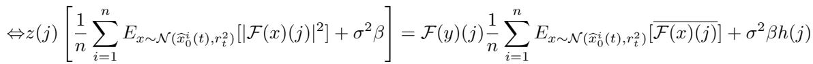

*Equation (D.8)*

Using the fact that the Fourier transform of a white Gaussian noise of variance $\sigma ^ { 2 }$ is a white Gaussian noise of variance $\sigma ^ { 2 }$ the expected values yield:

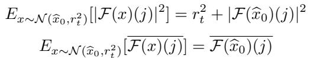

*Expected values of $|\mathcal{F}(x)(j)|^2$ and $\overline{\mathcal{F}(x)(j)}$*

So we can conclude that:

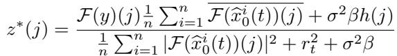

*Equation (D.9)*

The main difference with DPS approximation is that we have an extra term in the denominator $r _ { t } ^ { 2 }$

> 💡 **公式批读 D.1–D.9：ΠGDM 版多出的 $r_t^2$（Hao 批注）**: ΠGDM 把 $x_0$ 建成高斯 $\mathcal{N}(\hat{x}_0^i(t),r_t^2)$，所以 M 步的期望里要对这个高斯积分。用两个期望恒等式：$E[|\mathcal{F}(x)(j)|^2]=r_t^2+|\mathcal{F}(\hat{x}_0)(j)|^2$、$E[\overline{\mathcal{F}(x)(j)}]=\overline{\mathcal{F}(\hat{x}_0)(j)}$（白噪声傅里叶后仍是白噪声）。结果 D.9 的闭式解与 C.3 几乎相同，但**分母多了 $r_t^2$**。物理含义：$r_t^2$ 是"当前清晰图估计的不确定性"，它像一个自适应正则，在 $\hat{x}_0$ 不可靠（扩散早期，$r_t$ 大）时抑制核的过拟合。这是 ΠGDM 版更稳的数学根源，也是本文相对 DPS 版更准的核估计的来源。对本课题：$r_t^2$ 是本文里**唯一显式传播的不确定性**，但它只用于稳化点估计，并没有转化为对核 $H$ 的后验分布——一个"用了不确定性却不输出不确定性"的典型例子。

## E. Additional results

See Figure E.1.


*Figure E.1. Visual comparison of the different models on a degraded version of FFHQ 256x256 dataset. Ours correspond to Fast EM.*

> 💡 **Figure E.1 批读（Hao 批注）**: FFHQ 上的补充视觉对比，结论与正文 Figure 3 一致：Fast EM 输出忠实、少幻觉，Blind DPS 略锐但编造细节。这张图不引入新 claim，是主结果的稳健性佐证。

---

## References

[1] Eirikur Agustsson and Radu Timofte. Ntire 2017 challenge on single image super-resolution: Dataset and study. CVPR Workshops, 2017.
[2] Brian D.O. Anderson. Reverse-time diffusion equation models. Stochastic Processes and their Applications, 12, 1982.
[3] Jérémy Anger, Gabriele Facciolo, and Mauricio Delbracio. Blind Image Deblurring using the l0 Gradient Prior. IPOL, 2019.
[4] Sefi Bell-Kligler, Assaf Shocher, and Michal Irani. Blind Super-Resolution Kernel Estimation using an Internal-GAN. NeurIPS, 2019.
[5] Guillermo Carbajal, Patricia Vitoria, Jose Lezama, and Pablo Musé. Blind Motion Deblurring With Pixel-Wise Kernel Estimation via Kernel Prediction Networks. IEEE TCI, 9:928–943, 2023.
[6] Hyungjin Chung, Jeongsol Kim, Sehui Kim, and Jong Chul Ye. Parallel Diffusion Models of Operator and Image for Blind Inverse Problems. CVPR, 2023.
[7] Hyungjin Chung, Jeongsol Kim, Michael T. Mccann, Marc L. Klasky, and Jong Chul Ye. Diffusion Posterior Sampling for General Noisy Inverse Problems. ICLR, 2023. arXiv:2209.14687.
[8] Hyungjin Chung, Jong Chul Ye, Peyman Milanfar, and Mauricio Delbracio. Prompt-tuning latent diffusion models for inverse problems. arXiv:2310.01110, 2023.
[9] Valentin Debarnot and Pierre Weiss. Deep-Blur: Blind Identification and Deblurring with Convolutional Neural Networks. Preprint hal-03687822, 2022.
[10] A. P. Dempster, N. M. Laird, and D. B. Rubin. Maximum likelihood from incomplete data via the em algorithm. JRSS B, 39(1):1–38, 1977.
[11] Chao Dong, Chen Change Loy, Kaiming He, and Xiaoou Tang. Learning a Deep Convolutional Network for Image Super-Resolution. ECCV, 2014.
[12] Randal Douc, Eric Moulines, and David Stoffer. Nonlinear Time Series. Chapman and Hall/CRC, 2014.
[13] Gersende Fort, Edouard Ollier, and Adeline Samson. Stochastic proximal-gradient algorithms for penalized mixed models. Statistics and Computing, 29(2):231–253, 2019.
[14] Angela F Gao, Jorge C Castellanos, Yisong Yue, Zachary E Ross, and Katherine L Bouman. DeepGEM: Generalized Expectation-Maximization for Blind Inversion. NeurIPS, 2021.
[15] Fabien Gavant, Laurent Alacoque, Antoine Dupret, and Dominique David. A physiological camera shake model for image stabilization systems. SENSORS, IEEE, pages 1461–1464, 2011.
[16] Ian Goodfellow, Jean Pouget-Abadie, Mehdi Mirza, Bing Xu, David Warde-Farley, Sherjil Ozair, Aaron Courville, and Yoshua Bengio. Generative Adversarial Nets. NeurIPS, 2014.
[17] Rémi Gribonval. Should penalized least squares regression be interpreted as maximum a posteriori estimation? IEEE TSP, 2011.
[18] Bichuan Guo, Yuxing Han, and Jiangtao Wen. AGEM: Solving Linear Inverse Problems via Deep Priors and Sampling. NeurIPS, 2019.
[19] Martin Heusel, Hubert Ramsauer, Thomas Unterthiner, Bernhard Nessler, and Sepp Hochreiter. Gans trained by a two time-scale update rule converge to a local nash equilibrium. NeurIPS 30, 2017.
[20] Jonathan Ho, Ajay Jain, and Pieter Abbeel. Denoising Diffusion Probabilistic Models. NeurIPS, 2020.
[21] Jonathan Ho and Tim Salimans. Classifier-Free Diffusion Guidance. NeurIPS Workshop, 2022. arXiv:2207.12598.
[22] Samuel Hurault, Arthur Leclaire, and Nicolas Papadakis. Gradient Step Denoiser for convergent Plug-and-Play. ICLR, 2022.
[23] Ulugbek S. Kamilov, Charles A. Bouman, Gregery T. Buzzard, and Brendt Wohlberg. Plug-and-play methods for integrating physical and learned models in computational imaging. IEEE SPM, 40(1):85–97, 2023.
[24] Tero Karras, Samuli Laine, and Timo Aila. A style-based generator architecture for generative adversarial networks. CVPR, 2019.
[25] Bahjat Kawar, Michael Elad, Stefano Ermon, and Jiaming Song. Denoising Diffusion Restoration Models. NeurIPS, 2022.
[26] Charles Laroche, Andres Almansa, and Matias Tassano. Deep Model-Based Super-Resolution With Non-Uniform Blur. WACV, 2023.
[27] Rémi Laumont, Valentin De Bortoli, Andrés Almansa, Julie Delon, Alain Durmus, and Marcelo Pereyra. Bayesian imaging using plug & play priors: When langevin meets tweedie. SIAM J. Imaging Sciences, 2022.
[28] Jingyun Liang, Jiezhang Cao, Guolei Sun, Kai Zhang, Luc Van Gool, and Radu Timofte. SwinIR: Image Restoration Using Swin Transformer. ICCV, 2021.
[29] Jingyun Liang, Kai Zhang, Shuhang Gu, Luc Van Gool, and Radu Timofte. Flow-based kernel prior with application to blind super-resolution. CVPR, 2021.
[30] Guan-Horng Liu, Arash Vahdat, De-An Huang, Evangelos A. Theodorou, Weili Nie, and Anima Anandkumar. I²sb: Image-to-image schrodinger bridge, 2023.
[31] Ziwei Luo, Haibin Huang, Lei Yu, Youwei Li, Haoqiang Fan, and Shuaicheng Liu. Deep Constrained Least Squares for Blind Image Super-Resolution. CVPR, 2022.
[32] Geoffrey J. McLachlan and Thriyambakam Krishnan. The EM algorithm and extensions. Wiley, 2. ed, 2008.
[33] Mehdi Mirza and Simon Osindero. Conditional generative adversarial nets. Arxiv, 2014.
[34] Anish Mittal, Anush Krishna Moorthy, and Alan Conrad Bovik. No-reference image quality assessment in the spatial domain. IEEE TIP, 21(12):4695–4708, 2012.
[35] Anish Mittal, Rajiv Soundararajan, and Alan C. Bovik. Making a "completely blind" image quality analyzer. IEEE SPL, 20(3):209–212, 2013.
[36] Søren Feodor Nielsen. The stochastic em algorithm: Estimation and asymptotic results. Bernoulli, 2000.
[37] Daniele Perrone and Paolo Favaro. Total Variation Blind Deconvolution: The Devil Is in the Details. CVPR, 2014.
[38] Dongwei Ren, Kai Zhang, Qilong Wang, Qinghua Hu, and Wangmeng Zuo. Neural Blind Deconvolution Using Deep Priors. CVPR, 2020.
[39] Robin Rombach, Andreas Blattmann, Dominik Lorenz, Patrick Esser, and Bjorn Ommer. High-resolution image synthesis with latent diffusion models. CVPR, pages 10684–10695, 2022.
[40] Robin Rombach, Andreas Blattmann, Dominik Lorenz, Patrick Esser, and Bjorn Ommer. High-resolution image synthesis with latent diffusion models. CVPR, pages 10684–10695, June 2022.
[41] Ernest Ryu, Jialin Liu, Sicheng Wang, Xiaohan Chen, Zhangyang Wang, and Wotao Yin. Plug-and-Play Methods Provably Converge with Properly Trained Denoisers. ICML, 2019.
[42] Chitwan Saharia, Jonathan Ho, William Chan, Tim Salimans, David J. Fleet, and Mohammad Norouzi. Image Super-Resolution via Iterative Refinement. IEEE TPAMI, 2023.
[43] Jascha Sohl-Dickstein, Eric Weiss, Niru Maheswaranathan, and Surya Ganguli. Deep unsupervised learning using nonequilibrium thermodynamics. ICML, 2015.
[44] Jiaming Song, Chenlin Meng, and Stefano Ermon. Denoising Diffusion Implicit Models. ICLR, 2021.
[45] Jiaming Song, Arash Vahdat, Morteza Mardani, and Jan Kautz. Pseudoinverse-Guided Diffusion Models for Inverse Problems. ICLR, 2023.
[46] Yang Song, Jascha Sohl-Dickstein, Diederik P Kingma, Abhishek Kumar, Stefano Ermon, and Ben Poole. Score-Based Generative Modeling through Stochastic Differential Equations. ICLR, 2021.
[47] Ana Fernandez Vidal, Valentin De Bortoli, Marcelo Pereyra, and Alain Durmus. Maximum likelihood estimation of regularisation parameters in high-dimensional inverse problems: an empirical Bayesian approach. Part I. SIAM J. Imaging Sciences, 13(4):1945–1989, 2019.
[48] Zhou Wang, Alan C. Bovik, Hamid R. Sheikh, and Eero P. Simoncelli. Image quality assessment: from error visibility to structural similarity. IEEE TIP, 2004.
[49] Greg C. G. Wei and Martin A. Tanner. A monte carlo implementation of the em algorithm and the poor man's data augmentation algorithms. JASA, 85:699–704, 1990.
[50] Jay Whang, Mauricio Delbracio, Hossein Talebi, Chitwan Saharia, Alexandros G. Dimakis, and Peyman Milanfar. Deblurring via Stochastic Refinement. CVPR, 2022.
[51] Syed Waqas Zamir, Aditya Arora, Salman Khan, Munawar Hayat, Fahad Shahbaz Khan, Ming-Hsuan Yang, and Ling Shao. Multi-Stage Progressive Image Restoration. CVPR, 2021.
[52] Syed Waqas Zamir, Aditya Arora, Salman Khan, Munawar Hayat, Fahad Shahbaz Khan, Ming-Hsuan Yang, and Ling Shao. Multi-stage progressive image restoration. CVPR, pages 14821–14831, June 2021.
[53] Kai Zhang, Luc Van Gool, and Radu Timofte. Deep Unfolding Network for Image Super-Resolution. CVPR, 2020.
[54] Kai Zhang, Yawei Li, Wangmeng Zuo, Lei Zhang, Luc Van Gool, and Radu Timofte. Plug-and-play image restoration with deep denoiser prior. IEEE TPAMI, 2021.
[55] Kai Zhang, Wangmeng Zuo, Yunjin Chen, Deyu Meng, and Lei Zhang. Beyond a Gaussian Denoiser: Residual Learning of Deep CNN for Image Denoising. IEEE TIP, 2017.
[56] Kai Zhang, Wangmeng Zuo, and Lei Zhang. FFDNet: Toward a fast and flexible solution for cnn-based image denoising. IEEE TIP, 2018.
[57] Kai Zhang, Wangmeng Zuo, and Lei Zhang. Learning a Single Convolutional Super-Resolution Network for Multiple Degradations. CVPR, 2018.
[58] Richard Zhang, Phillip Isola, Alexei A Efros, Eli Shechtman, and Oliver Wang. The unreasonable effectiveness of deep features as a perceptual metric. CVPR, 2018.

> 💡 **参考文献速览（Hao 批注）**: 三条主脉络：(1) **扩散逆问题** [7,45,46,20]（DPS、ΠGDM、SDE、DDPM）——E 步引擎的出处；(2) **盲反卷积/核估计** [3,6,29,37,38]（Anger、Blind DPS、flow kernel prior、TV、Self-Deblur）——对手谱系；(3) **EM/贝叶斯参数估计** [10,14,18,32,47,49]（EM 理论、DeepGEM、AGEM、SAPG、Monte-Carlo EM）——本文框架根基。对本课题最相关的是 [6] Blind DPS（生成式核对照）、[14] DeepGEM（另一个 EM 盲反演）、[47] SAPG（经验贝叶斯估正则参数，接近参数后验思路）。

---

## 🔖 Section 总结

### 核心洞察
1. **附录 A**：经典 Diffusion EM 是双层循环（L×T），慢；Fast 版压成单层。
2. **附录 B/C/D**：核估计闭式解来自"卷积在傅里叶域对角化 → 逐频率一维二次问题"；DPS 用 $\hat{x}_0$、ΠGDM 额外含方差 $r_t^2$（分母多一项）。
3. **$r_t^2$ 的角色**：本文唯一显式传播的不确定性，但只用来稳化点估计，不输出为核后验——点估计对照的又一佐证。

### 可追问点
- Fisher identity [12] 在 D.7 的作用？→ 把期望内的求导换序，使高斯期望可解析。
- 若算子非卷积（无傅里叶对角化），M 步闭式解失效——本文方法的适用边界。
