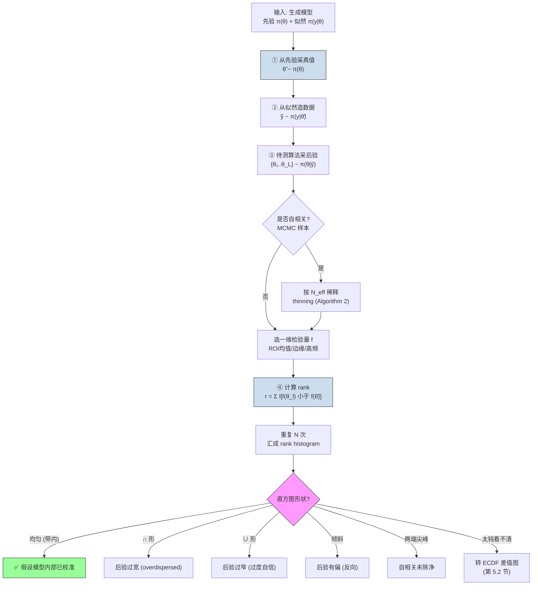

# Validating Bayesian Inference Algorithms with Simulation-Based Calibration (SBC)

**作者**: Sean Talts, Michael Betancourt, Daniel Simpson, Aki Vehtari, Andrew Gelman
**类型**: arXiv 预印本（统计方法学） | **年份**: 2018
**链接**: [arXiv:1804.06788](https://arxiv.org/abs/1804.06788) · [Connected Papers](https://www.connectedpapers.com/main/1804.06788) · [Semantic Scholar](https://www.semanticscholar.org/paper/e11817ce34636abb2aedf31442c040aee12208a4)

---

## 一句话总结

SBC 用一句可视化的"rank histogram 是否均匀"来检验**任何能产出后验样本的贝叶斯算法**（MCMC / VI / INLA）是否在**假设模型内部**算对了——不但能发现"算错了/模型代码写错了"，还能靠直方图**形状**（∩ 过宽、∪ 过窄、倾斜有偏、两端尖峰自相关）告诉你错在哪个方向；但它**不能**证明假设模型符合真实数据。

---

## 核心贡献

1. **修正 Cook-Gelman-Rubin (2006)**：用**整数 rank 统计量 + 离散均匀检验**替代连续 CDF 分位数，从根上取消连续性修正 artifact——同一个正确的 Stan 线性回归，CGR 冤判为有 bug（Figure 1），SBC 还其清白（Figure 2）。
2. **理论保证 (Theorem 1)**：证明对**任意**联合分布，只要后验样本独立采自与生成一致的后验，任意一维量的 rank 严格服从离散均匀 $\{0,\dots,L\}$（附录 B）。
3. **可解释的诊断字典 (第 4.2 节)**：把 rank histogram 的形状映射到病因——均匀=健康、∩=后验过宽、∪=后验过窄、倾斜=后验有偏、两端尖峰=自相关。这是相对前人纯检验统计量的最大增值。
4. **两个实用扩展 (第 5 节)**：按有效样本量 thinning 处理 MCMC 自相关（Algorithm 2）；小偏离用 ECDF 及其差值图放大。
5. **跨算法族实证 (第 6 节)**：在 HMC、ADVI、INLA 上分别抓出先验错、几何病态、变分欠离散、Laplace 微偏四类错误，坐实"只要能采样就通用"。

---

## 📖 批读导航

| Section | 内容 |
|---------|------|
| [00 - Abstract](sections/00-abstract.md) | 摘要：SBC 适用边界与"形状→病因"卖点 |
| [01 - Introduction](sections/01-introduction.md) | 动机：双重出错风险 + 联合分布这把通用钥匙 |
| [02 - Self-Consistency](sections/02-self-consistency.md) | 核心恒等式 (1)：数据平均后验=先验；单次恢复的反例 |
| [03 - Existing Methods](sections/03-existing-methods.md) | Geweke / CGR 及其 bug；Figure 1 假阳性现场 |
| [04 - Simulation-Based Calibration](sections/04-simulation-based-calibration.md) | rank 统计量 + Theorem 1 + Algorithm 1 + 诊断字典（Fig 2–7） |
| [05 - Extending SBC](sections/05-extending-sbc.md) | thinning 治自相关（Algorithm 2）；ECDF 治小偏离（Fig 8） |
| [06 - Experiments](sections/06-experiments.md) | 证据链：先验错 / centered HMC / ADVI / INLA（Fig 9–13） |
| [07 - Conclusion](sections/07-conclusion.md) | 三大局限 → 自动化摘要 / 定向摘要 / 多元校准 |
| [08 - Appendix & References](sections/08-appendix.md) | Stan 代码清单 + Theorem 1 完整证明 + 参考文献 |

---

## 关键数字

| 指标 | 数值 | 出处 |
|------|------|------|
| 后验样本数 $L$（实验统一） | 100（校准 → rank~U[0,100] 离散均匀） | 第 6 节 |
| 重复数 $N$（6.1–6.3） | 10,000 | 第 6 节 |
| 重复数 $N$（6.4 INLA，昂贵） | 1,000 | 第 6.4 节 |
| 每 bin 平均计数经验甜点 $N/B$ | ≈ 20 | 第 4.1 节 |
| 灰带（99% 区间） | Binomial$(N,(L+1)^{-1})$ 的 0.5%–99.5% 分位 | 第 4.1 节 |
| Figure 1 假阳性设置 | 10,000 prior draws × 100 posterior draws | 第 3 节 |
| 肯尼亚 HIV 全国流行率（INLA 适用） | 5.4%（vs 澳洲 0.1% 不适用） | 第 6.4 节 |
| 被引 / 参考 / influential | 384 / 36 / 56 | Semantic Scholar |

---

## 数据流：输入 → 中间表示 → 输出

---

## 优缺点与还能做什么

### 优点
- **通用**：唯一前提是"能生成数据 + 能采后验样本"，MCMC/ADVI/INLA 通吃，不需真后验解析形式。
- **可解释**：不只报"通过/不通过"，还用直方图形状指出错误方向（过宽/过窄/有偏/自相关）。
- **有理论保证**：Theorem 1 对任意模型成立，且证明清晰地把"独立性"与"生成=推断一致性"两前提对应到两类可诊断错误。
- **自适应**：针对手上这套具体模型给有限样本诊断，而非渐近安慰；靠选检验量 $f$ 做定向检验。
- **可并行**：$N$ 份拟合互相独立，天然铺集群。

### 局限 / 风险
- **只查"模型内部校准"**：SBC 通过 ≠ 假设模型符合真实数据（那要 PPC / 真实数据 coverage）。这是最易被过度声称的边界。
- **靠肉眼看图，不 scalable**：参数一多无法逐一手工审视（第 7 节局限一）。
- **全局 $\chi^2$ 检验不好用**：丢掉了最值钱的形状信息（局限二）。
- **只能查一维摘要**：天然多元 / 强耦合的量抓不住（局限三）。
- **贵**：要拟合 $N$ 份模拟数据；$N$ 小时 histogram 灰带太宽会漏掉真偏离（第 6.4 节 INLA）。
- **需独立样本**：MCMC 自相关会伪造两端尖峰，必须 thinning。

### 还能做什么
- **自动化数值摘要**：给每张 rank histogram 打偏离分、自动标红可疑参数（后续 rank-ECDF 检验即沿此路）。
- **分方向定向摘要**：设计专测 ∩∪（离散度）/ 倾斜（bias）的敏感统计量，替代笼统 $\chi^2$。
- **多元校准**：借气象概率预报的多元校准（Gneiting 2008、Thorarinsdottir 2013）处理联合后验。
- **免 thinning 的自相关理论**：直接刻画自相关下 rank histogram 的期望形状，并借此为任意采样器定义"有效样本量"。

---

## 🎯 本课题定位（生成先验下的参数化盲逆问题）

本项目主线是 **gauge-aware 联合后验采样与校准**：联合估计图像 $x$、低维算子参数 $\varphi$、噪声 $\sigma$，并用 **SBC / coverage / CRPS** 检验校准。SBC 在其中是**校准方法学的地基**：

- **两层结论的第一道闸门**：SBC 只能验证"算法在假设模型内部是否自洽"（关掉**算法错误**），rank histogram 上 thin 干净后残留的偏离才可能指向**模型错误**（前向/噪声模型 ≠ 真实退化），后者需 PPC / 真实数据 coverage。第 4 节开头那段"limited exclusively to the computational aspect"是这层划分的官方出处。
- **高维图像怎么 SBC**：SBC 通过一维检验量 $f$，所以对百万维 $x$ 后验，选**可解释标量投影**——ROI 均值、边缘/关键点位置、高频能量——每个 $f$ 一张 rank histogram。第 6.4 节 INLA 用"区域平均流行率"这个非线性泛函做 $f$，正是此招的范本。
- **区分算法错误的子类**：Figure 10（倾斜=真 bias，改参数化）vs Figure 11b（两端尖峰=自相关，thinning）——同为非均匀却处置迥异，对应我们要区分的"几何病态 vs 后处理不足"。
- **重参数化解耦**：Listing 3 vs 4（centered/non-centered funnel）提示我们，$x$、$\varphi$、$\sigma$ 及 gauge 自由度间的强耦合可能制造类似 funnel，重参数化 + SBC 验证是让联合采样器校准的关键手段。
- **本文留给我们的口子**：局限三（只查一维）直击我们 $(x,\varphi,\sigma)$ 联合 + gauge 耦合的需求——逐维 SBC 是**必要非充分**，需向多元校准延伸。

> ⚠️ 边界纪律：批注只借用 SBC 自身机制服务本课题定位，不引入其他论文的具体方法。

---

## 阅读 Q&A 记录

> 💡 **Q&A 批注记录**:
> - **Q: SBC 到底能不能证明我的模型是对的？**
>   A: 不能。SBC 只验证"在**假设的**联合分布内部，算法是否算对了"（第 4 节 "limited exclusively to the computational aspect"）。它用的是先验联合 $\pi(\theta,y)$ 的**模拟**数据，不碰真实数据。要验证"假设模型 vs 真实世界"得用 PPC（后验预测 $\pi(\tilde y\mid y)$）或真实数据 coverage。这正是本课题"算法错误 vs 模型错误"两层结论的分水岭。

> 💡 **Q&A 批注记录**:
> - **Q: rank histogram 的形状怎么反推病因？**
>   A: 见第 4.2 节字典——均匀=健康；**∩ 形**（中间高）=后验过宽（真值常居中）；**∪ 形**（两边高）=后验过窄/过度自信（真值常出界）；**倾斜**=后验有偏，且方向与直方图堆积**相反**（rank 堆左=后验偏大，堆右=后验偏小）；**两端尖峰**=自相关。实证对应：Fig 9(∪)、Fig 10(倾斜)、Fig 11b(尖峰)、Fig 12(极端倾斜)。

> 💡 **Q&A 批注记录**:
> - **Q: ∪ 形和自相关的两端尖峰长得一样，怎么区分？**
>   A: 关键判据是 **thinning 能否消掉**。自相关的尖峰按 $\lceil N/N_{\text{eff}}\rceil$ thin 后会消失（Fig 11a vs 11b）；真·后验过窄（Fig 9）thin 不掉，因为它是模型/近似的结构性缺陷。thin 也消不掉的偏离还提示 MCMC 可能无中心极限定理（第 5.1 节）。

> 💡 **Q&A 批注记录**:
> - **Q: 为什么 histogram 有时看不出问题，要转 ECDF？**
>   A: 当 $N$ 小（昂贵采样器，如 INLA $N=1000$）时灰带很宽、检验太钝，微弱偏离藏在带内（Fig 13a）。ECDF 在低/高 rank 端方差小，其"减去均匀期望"的差值图（Fig 13c）能把小偏离放大到零线附近的明显起伏。对我们每份数据都要跑完整联合采样、$N$ 必然小的场景，ECDF 差值图应设为默认工具。

> 💡 **Q&A 批注记录**:
> - **Q: Theorem 1 的证明用到了哪两个前提，和 SBC 能抓的错误怎么对应？**
>   A: 附录 B——(1) 后验样本**独立**（用于 order statistic 的乘积分解）；(2) 生成模型与推断模型**一致**（用于换元成均匀 $u$）。破坏 (1) → 自相关（thinning 修）；破坏 (2) → 先验写错/近似偏差/几何病态（改模型/参数化/采样器）。这正好覆盖 SBC 声称抓的两类错误。

> 💡 **Q&A 批注记录**:
> - **Q: $L$ 和 $N$ 分别控制什么，怎么定？**
>   A: $L$（后验样本数）决定单张直方图的**分辨率**（$L+1$ 个 bin）；$N$（重复数）决定每个 bin 的**统计功效**。经验甜点是每 bin 平均计数 $N/B\approx20$（$B$ 为合并后 bin 数）。技巧：取 $L+1$ 为 2 的幂（如 1024）方便 rebin。计算受限时先定得起的 $N$，反推 $B=N/20$。

---

## 📊 Citation Landscape

> 数据来源：Semantic Scholar API（`ArXiv:1804.06788`）。

**TLDR (Semantic Scholar 自动摘要)**: It is argued that SBC is a critical part of a robust Bayesian workflow, as well as being a useful tool for those developing computational algorithms and statistical software.

**引用统计**：

| 指标 | 数值 |
|------|------|
| 被引次数 (citationCount) | 384 |
| 参考文献数 (referenceCount) | 36 |
| Influential Citations | 56 |
| paperId | e11817ce34636abb2aedf31442c040aee12208a4 |

### 参考文献分组（按被引量 Top 5/组）

**A. 概率编程与采样器（SBC 的验证对象）**
1. Stan: A Probabilistic Programming Language (Carpenter et al., 2017) — 被引 ~7480
2. The No-U-Turn Sampler / NUTS (Hoffman & Gelman, 2014) — 被引 ~5258
3. A Conceptual Introduction to Hamiltonian Monte Carlo (Betancourt, 2017) — 被引 ~1461
4. MCMC Using Hamiltonian Dynamics (Neal, 2011) — 被引 ~1510
5. Automatic Differentiation Variational Inference / ADVI (Kucukelbir et al., 2016) — 被引 ~823

**B. 近似贝叶斯推断 / INLA（第 6.4 节实验基础）**
1. Approximate Bayesian inference for latent Gaussian models by INLA (Rue, Martino & Chopin, 2009) — 被引 ~5226
2. Bayesian Computing with INLA: A Review (Rue et al., 2017) — 被引 ~744
3. An explicit link between Gaussian fields and GMRF / SPDE (Lindgren, Rue & Lindström, 2011) — 被引 ~194+
4. Estimating multilevel regional variation ... via INLA (Seppä et al., 2019) — 被引 ~13
5. Comment: Getting into Space with a Weight Problem (Wakefield, Simpson & Godwin, 2016) — 被引 ~7

**C. 校准 / 概率预报评估（rank histogram 的血统 + 未来方向）**
1. Interpretation of Rank Histograms for Verifying Ensemble Forecasts (Hamill, 2001) — 被引 ~908
2. A Method for Producing and Evaluating Probabilistic Forecasts from Ensembles (Anderson, 1996) — 被引 ~487
3. Assessing probabilistic forecasts of multivariate quantities (Gneiting et al., 2008) — 被引 ~308
4. Assessing the Calibration of High-Dimensional Ensemble Forecasts Using Rank Histograms (Thorarinsdottir et al., 2013) — 被引 ~82

**D. 直接前身与勘误（SBC 修的对象）**
1. Bayesian Data Analysis, 3rd ed. (Gelman et al., 2013) — 被引 ~4880
2. Validation of Software for Bayesian Models Using Posterior Quantiles (Cook, Gelman & Rubin, 2006) — 被引 ~306
3. Getting it right: Joint distribution tests of posterior simulators (Geweke, 2004)
4. Correction to Cook, Gelman, and Rubin (2006) (Gelman, 2017) — 被引 ~7
5. BayesValidate (R package) (Cook, 2006)

**E. 先验与层级模型几何（第 6.2 节 funnel + PC 先验）**
1. Penalising Model Component Complexity / PC priors (Simpson et al., 2017) — 被引 ~1113
2. Constructing Priors that Penalize the Complexity of Gaussian Random Fields (Fuglstad et al., 2019) — 被引 ~412
3. A General Framework for the Parametrization of Hierarchical Models (Papaspiliopoulos et al., 2007) — 被引 ~344
4. Hamiltonian Monte Carlo for Hierarchical Models (Betancourt & Girolami, 2013) — 被引 ~480
5. Estimation in Parallel Randomized Experiments / 8 schools (Rubin, 1981) — 被引 ~297

### 推荐相关论文（Semantic Scholar Recommendations，10 篇）

| 年份 | 标题 | 链接 |
|------|------|------|
| 2026 | Making Recursive Bayesian Inference Robust | [arXiv:2606.07981](https://arxiv.org/abs/2606.07981) |
| 2026 | A computationally-tractable measure of global sensitivity for sampling-based Bayesian inference | [arXiv:2605.28099](https://arxiv.org/abs/2605.28099) |
| 2026 | Uncertainty Quantification in Data-Driven Inverse Optimization via Bayesian Inference | [arXiv:2605.25288](https://arxiv.org/abs/2605.25288) |
| 2026 | Corrected Integrated Laplace Approximation for Bayesian Inference in Latent Gaussian Models | [arXiv:2605.20345](https://arxiv.org/abs/2605.20345) |
| 2026 | Separating Intrinsic Ambiguity from Estimation Uncertainty in Deep Generative Models for Linear Inverse Problems | [arXiv:2605.15050](https://arxiv.org/abs/2605.15050) |
| 2026 | Benchmark of Likelihood-Free Inference Methods based on Neural and Optimal Transport Approaches | [arXiv:2605.30516](https://arxiv.org/abs/2605.30516) |
| 2026 | Stochastic Volatility in Mean Models with Heavy Tails: Fast Approximate Bayesian Inference | [arXiv:2606.22615](https://arxiv.org/abs/2606.22615) |
| 2026 | Bayesian Simultaneous Credible Bands for Polynomial Regression | [arXiv:2606.28015](https://arxiv.org/abs/2606.28015) |
| 2026 | Synthetic Data Generation With Incomplete Survey Data Under Informative Sampling | [arXiv:2605.31440](https://arxiv.org/abs/2605.31440) |
| 2026 | On the Computation of Normalized Power Priors | [arXiv:2607.05579](https://arxiv.org/abs/2607.05579) |

> 💡 **Citation Landscape 批读 (Hao 批注)**: 引用图谱清晰勾出 SBC 的三条血脉——**验证对象**（Stan/NUTS/ADVI/INLA 这些算法本身，A、B 组，被引都在千级以上，说明 SBC 生逢工具爆发期）、**方法血统**（C 组气象 rank histogram + 多元校准，这也是我们课题引入 CRPS 的同源工具箱）、**直接前身**（D 组 CGR 2006 及其勘误，SBC 就是它的 corrected implementation）。推荐论文里最贴我们课题的是 "Separating Intrinsic Ambiguity from Estimation Uncertainty in Deep Generative Models for Linear Inverse Problems"（2026）——正是"生成先验 + 线性逆问题 + 不确定性分解"的交叉点，值得追读以对接 SBC 式校准与盲逆问题。
