# Validating Bayesian Inference Algorithms with Simulation-Based Calibration

Sean Talts, Michael Betancourt, Daniel Simpson, Aki Vehtari, Andrew Gelman

Abstract. Verifying the correctness of Bayesian computation is challenging. This is especially true for complex models that are common in practice, as these require sophisticated model implementations and algorithms. In this paper we introduce simulation-based calibration (SBC), a general procedure for validating inferences from Bayesian algorithms capable of generating posterior samples. This procedure not only identifies inaccurate computation and inconsistencies in model implementations but also provides graphical summaries that can indicate the nature of the problems that arise. We argue that SBC is a critical part of a robust Bayesian workflow, as well as being a useful tool for those developing computational algorithms and statistical software.

## 1. INTRODUCTION

Powerful algorithms and computational resources are facilitating Bayesian modeling in an increasing range of applications. Conceptually, constructing a Bayesian analysis is straightforward. We first define a joint distribution over the parameters, θ, and measurements, y, with the specification of a prior distribution and likelihood,

$$
\pi ( y , \theta ) = \pi ( y \mid \theta ) \pi ( \theta ) .
$$

Conditioning this joint distribution on an observation, y˜, yields a posterior distribution,

$$
\pi ( \theta \mid \tilde { y } ) \propto \pi ( \tilde { y } , \theta ) ,
$$

that encodes information about the system being analyzed.

Implementing this Bayesian inference in practice, however, can be computationally challenging when applied to large and structured datasets. We must make our model rich enough to capture the relevant structure of the system being studied while simultaneously being able to accurately work with the resulting posterior distribution. Unfortunately, every algorithm in computational statistics requires that the posterior distribution possesses certain favorable properties in order to be successful. Consequently the overall performance of an algorithm is sensitive to the details of the model and the observed data, and an algorithm that works well in one analysis can fail spectacularly in another.

As we move towards creating sophisticated, bespoke models with each analysis, we stress the algorithms in our statistical toolbox. Moreover, the complexity of these models provides abundant opportunity for mistakes in their specification. We must verify both that our code is implementing the model we think it is and that our inference algorithm is able to perform the necessary computations accurately. While we always get some result from a given algorithm, we have no idea how good it might be without some form of validation.

Fortunately, the structure of the Bayesian joint distribution allows for the validation of any Bayesian computational method capable of producing samples from the posterior distribution, or an approximation thereof. This includes not only Monte Carlo methods but also deterministic methods that yield approximate posterior distributions amenable to exact sampling, such as integrated nested Laplace approximation (INLA) (Rue, Martino and Chopin, 2009; Rue et al., 2017) and automatic differentiation variational inference (ADVI) (Kucukelbir et al., 2017). In this paper we introduce Simulation-Based Calibration (SBC), a corrected implementation of the ideas of Cook, Gelman and Rubin (2006) for validating these algorithms in a generic and straightforward way within the scope of a given Bayesian joint distribution.

We begin with a discussion the natural self-consistency of samples from the Bayesian joint distribution and previous validation methods that have exploited this behavior. Next we introduce the simulation-based calibration framework and examine the qualitative interpretation of the SBC output, how it identifies how the algorithm being validated might be failing, and how it can be incorporated into a robust Bayesian workflow. Finally, we consider some useful extensions of SBC before demonstrating the application of the procedure over a range of analyses.

## 2. SELF-CONSISTENCY OF THE BAYESIAN JOINT DISTRIBUTION

The most straightforward way to validate a computed posterior distribution is to compare computed expectations with the exact values. An immediate problem with this, however, is that we know the true posterior expectation values for only the simplest models. These simple models, moreover, typically have a different structure to the models of interest in applications. This motivates us to construct a validation procedure that does not require access to the exact expectations, or any other property of the true posterior distribution.

A popular alternative to comparing the computed and true expectation values directly is to define a ground truth ${ \tilde { \theta } } ,$ simulate data from that ground truth, $\tilde { y } \sim \pi ( y | \tilde { \theta } )$ , and then quantify how well the computed posterior recovers the ground truth in some way. Unfortunately this approach is flawed, as demonstarted in a simple example.

Consider the model

$$
\begin{array} { l } { { y \mid \mu \sim \mathbf { N } ( \mu , 1 ^ { 2 } ) } } \\ { { \mu \sim \mathbf { N } ( 0 , 1 ^ { 2 } ) , } } \end{array}
$$

and an attempt at verification that uses the single ground truth value $\tilde { \mu } = 0$ . If we simulate from this model and draw the plausible, but extreme, data value $\tilde { y } = 2 . 1$ , then the true posterior will be $\mu \mid \tilde { y } \sim \mathbf { N } ( 1 . 0 5 , 0 . 5 ^ { 2 } )$ . As $\tilde { \mu }$ is more than two posterior standard deviations from the posterior mean, we might be tempted to say that recovery has not been successful. On the other hand, imagine that we accidentally used code that exactly fits an identical model but with the variance for both the likelihood and prior set to 10 instead of 1. In this case, the incorrectly computed posterior would be $\mathrm { N } ( 1 . 0 5 , 5 ^ { 2 } )$ and we might conclude that the code correctly recovered the posterior.

Consequently, the behavior of the algorithm in any individual simulation will not characterize the ability of the inference algorithm to fit that particular model in any meaningful way. In the example above, it might lead us to conclude that the incorrectly coded analysis worked as desired, while the correctly coded analysis failed. In order to properly characterize an analysis we need to at the very least consider multiple ground truths.

Which ground truths, however, should we consider? An algorithm might be able to recover a posterior constructed from data generated from some parts of the parameter space while faring poorly on data generated from other parts of parameter space. In Bayesian inference a proper prior distribution quantifies exactly which parameter values are relevant and hence should be considered when evaluating an analysis. This immediately suggests that we consider the performance of an algorithm over the entire Bayesian joint distribution, first sampling a ground truth from the prior, $\tilde { \theta } \sim \pi ( \theta )$ , and then data from the corresponding data generating process, $\tilde { y } \sim \pi ( y | \tilde { \theta } )$ . We can then build inferences for each simulated observation y˜ and then compare the recovered posterior distribution to the sampled parameter ${ \tilde { \theta } } .$

Advantageously, this procedure also defines a natural condition for quantifying the faithfulness of the computed posterior distributions, regardless of the structure of the model itself. Integrating the exact posteriors over the Bayesian joint distribution returns the prior distribution,

$$
\pi ( \theta ) = \int \mathrm { d } \tilde { y } \mathrm { d } \tilde { \theta } \pi ( \theta \mid \tilde { y } ) \pi ( \tilde { y } \mid \tilde { \theta } ) \pi ( \tilde { \theta } ) .\tag{1}
$$

In other words, for any model the average of any exact posterior expectation with respect to data generated from the Bayesian joint distribution reduces to the corresponding prior expectation.

Consequently, any discrepancy between the data averaged posterior (1) and the prior distribution indicates some error in the Bayesian analysis. This error can come either from inaccurate computation of the posterior or a mis-implementation of the model itself. Well-defined comparisons of these two distributions then provides a generic means of validating the analysis, at least within the scope of the modeling assumptions.

## 3. EXISTING VALIDATION METHODS EXPLOITING THE BAYESIAN JOINTDISTRIBUTION

The self-consistency of the data-averaged posterior (1) and the prior is not a novel observation. This behavior has been exploited in at least two earlier methods for validating Bayesian computational algorithms.

Geweke (2004) proposed a Gibbs sampler targeting the Bayesian joint distribution that alternatively samples from the posterior, $\pi ( \theta \mid y )$ , and the likelihood, $\pi ( y \mid \theta )$ . If an algorithm can generate accurate posterior samples, then this Gibbs sampler will produce accurate samples from the Bayesian joint distribution, and the marginal parameter samples will be indistinguishable from any sample of the prior distribution. The author recommended quantifying the consistency of the marginal parameter samples and a prior sample with z-scores of each parameter mean, with large z-scores indicating a failure of the algorithm to produce accurate posterior samples.

The main challenge with this method is that the diagnostic z-scores will be meaningful only once the Gibbs sampler has converged. Unfortunately, the data and the parameters will be strongly correlated in a generative model and the convergence of this Gibbs sampler will be slow, making it challenging to identify when the diagnostics can be considered.

Cook, Gelman and Rubin (2006) avoided the auxiliary Gibbs sampler entirely by considering cumulative distribution function (CDF) values (quantiles) approximated using samples from the simulated posterior distribution. They use the notation θ to represent any scalar model parameter or function of parameters. They noted that if $\tilde { \theta } \sim \pi ( \theta )$ and $\tilde { y } \sim \pi ( y | \tilde { \theta } )$ then the exact posterior CDF values for each parameter,

$$
q ( \tilde { \theta } ) = \int \mathrm { d } \theta \pi ( \theta \mid \tilde { y } ) \mathbb { I } [ \theta < \tilde { \theta } ] ,
$$

will be uniformly distributed provided that the posteriors are absolutely continuous. Consequently any deviation from the uniformity of the computed posterior CDF values indicates a failure in the implementation of the analysis.

The authors suggest quantifying the uniformity of these CDF values by transforming them into z-scores with an application of the inverse normal CDF. The absolute value of the $z -$ scores can then be visualized to identify deviations from normality of, and hence uniformity of the CDF values. At the same time these deviations can be quantified with a $\chi ^ { 2 }$ test.

This procedure works well in certain examples, as demonstrated by Cook, Gelman and Rubin (2006), but it can run into problems with MCMC samples as the empirical CDF values only asymptotically approach the true values. Without a central limit theorem and sufficiently small autocorrelations, the estimated quantiles from finite MCMC samples will not follow the uniform distribution assumed in Cook, Gelman and Rubin (2006). These issues make it difficult to determine whether a deviation from normality is due to pre-asymptotic behavior or biases in the posterior computations. In addition the description of the algorithm in Cook, Gelman and Rubin (2006) is incomplete in that it neglected to mention the continuity correction used for its quantile computation, as implemented in Cook (2006).

In particular, because there are only $L + 1$ positions in a posterior sample of size $L$ in between which the prior sample $\tilde { \theta }$ can fall, an empirically approximated CDF value of the prior draw $\tilde { \theta }$ within the posterior sample $\theta ,$

$$
q = \frac { 1 } { L } \sum _ { l = 1 } ^ { L } \mathbb { I } [ \theta < \tilde { \theta } ] ,
$$

is fundamentally discrete, taking one of $L + 1$ evenly spaced values on [0, 1]. This discretization causes artifacts when visualizing the CDF values and it requires some continuity corrections for the finite instances where the estimated CDF value equals 0 or 1. At the same time, autocorrelation in the simulations creates dependence in the estimated CDF values and modifies the distributions of test statistics that were worked out implicitly assuming independence, a point recognized in the recent correction (Gelman, 2017). With attempts at smoothing, we may fix visual artifacts but we have found no exact proofs of distribution for these continuous estimators.

To demonstrate these issues, we run most of the Cook, Gelman and Rubin (2006) procedure for a straightforward linear regression model (Listings 1 and 2 in the Appendix) in Stan 2.17.1 (Carpenter et al., 2017). The $\bar { \Phi } ^ { - 1 }$ transformation is not defined at 0 or 1, a problem with the underlying framework that was approximately avoided in Cook (2006) by adding an offset 0.5 to the estimated quantiles as a continuity correction (Blom, 1958). Here, we avoid the need for continuity corrections entirely by visualizing the estimated quantiles with a carefully-binned histogram. For both plots in Figure 1, we generated 10,000 draws from the prior predictive $\pi ( y )$ and fit the Stan model on each of these, taking 100 post-warmup draws from the posterior for each draw from the prior predictive. For this evaluation, we used a histogram of both α and $\beta$ parameters together in the same plot, as it was already evident that non-uniformities had been found from the combined plot.

Although Stan is known to be extremely accurate for this analysis, a histogram of the empirical CDF values demonstrates strong deviations from uniformity (Figure 1) that immediately suggests algorithmic problems that aren’t there. We also see evidence of autocorrelation in the posterior sample manifesting in the histogram, an issue we consider more thoroughly in Section 5.1.

## 4. SIMULATION-BASED CALIBRATION

We can work around the discretization artifacts of Cook, Gelman and Rubin (2006) by considering a similar consistency criterion that is immediately compatible with samplingbased algorithms. In this section we introduce simulation-based calibration (SBC) based on comparing histograms of rank statistics to the discrete uniform distribution that would arise if the analysis has been correctly implemented.

SBC requires just one assumption: that we have a generative model for our data. Given such a model, we can run any given algorithm over many simulated observations and the self consistency condition (1) provides a target to verify that the algorithm is accurate over that ensemble, and hence sufficiently calibrated for the assumed model. This calibration ensures that certain one dimensional test statistics are correctly distributed under the assumed model and is similar to checking the coverage of a credible interval under the assumed model.

Importantly, this calibration is limited exclusively to the computational aspect of our analysis. It offers no guarantee that the posterior will cover the ground truth for any single observation or that the model will be rich enough to capture the truth at all. Understanding the range of posterior behaviors for a given observation requires a more careful sensitivity analysis while validating the model assumptions themselves requires a study of predictive performance, such as posterior predictive checks (PPCs, $\mathrm { e . g . }$ , Gelman et al. (2013), chapter 6). Where SBC uses draws from the joint prior distribution $\pi ( \theta , y )$ , PPCs use the posterior predictive distribution for predicting new data $\tilde { y } , \pi ( \tilde { y } | y )$ . We view both of these checks as a vital part of a robust Bayesian workflow.

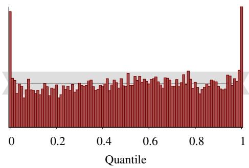

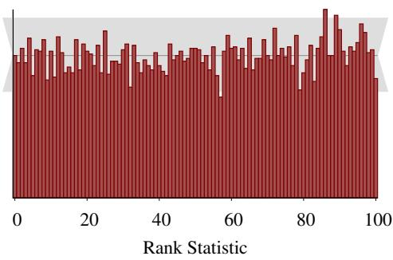  
FIG 1. The procedure of Cook, Gelman and $R u -$ bin (2006) applied to a linear regression analysis with Stan indicates significant problems despite the analysis itself being correct. In particular, the histogram of estimated CDF values (red) exhibits strong systematic deviations from the variation expected of a uniform histogram (gray).  
FIG 2. SBC Algorithm 2 applied to a linear regression analysis indicates no issues as the empirical rank statistics (red) are consistent with the variation expected of a uniform histogram (gray).

In this section we first demonstrate the expected behavior of rank statistics under a proper analysis and construct the SBC procedure to exploit this behavior. We then demonstrate how deviations from the expected behavior are interpretable and help identify the exact nature of implementation error.

## 4.1 Validating Consistency With Rank Statistics

Consider the sequence of samples from the Bayesian joint distribution and resulting posteriors,

$$
\begin{array} { c } { { \tilde { \theta } \sim \pi ( \theta ) } } \\ { { { } } } \\ { { \tilde { y } \sim \pi ( y \mid \tilde { \theta } ) } } \\ { { { } } } \\ { { \{ \theta _ { 1 } , \ldots , \theta _ { L } \} \sim \pi ( \theta \mid \tilde { y } ) . } } \end{array}\tag{2}
$$

The relationship (1) implies that the prior sample, ${ \tilde { \theta } } ,$ and an exact posterior sample, $\big \{ \theta _ { 1 } , \dots , \theta _ { L } \big \}$ , will be distributed according to the the same distribution. Consequently, for any one-dimensional random variable, $f : \Theta \to \mathbb { R }$ , the rank statistic of the prior sample relative to the posterior sample,

$$
r ( \{ f ( \theta _ { 1 } ) , \ldots , f ( \theta _ { L } ) \} , f ( \tilde { \theta } ) ) = \sum _ { l = 1 } ^ { L } \mathbb { I } [ f ( \theta _ { l } ) < f ( \tilde { \theta } ) ] \in [ 0 , L ] ,
$$

will be uniformly distributed across the integers $[ 0 , L ]$

THEOREM 1. Let ${ \tilde { \theta } } \sim \pi ( \theta ) , { \tilde { y } } \sim \pi ( y \mid { \tilde { \theta } } )$ , and $\{ \theta _ { 1 } , . . . , \theta _ { L } \} \sim \pi ( \theta \mid \tilde { y } )$ for any joint distribution $\pi ( \boldsymbol { y } , \boldsymbol { \theta } )$ . The rank statistic of any one-dimensional random variable over θ is uniformly distributed over the integers $[ 0 , L ]$

The proof is given in Appendix B.

There are many ways of testing the uniformity of the rank statistics, but the SBC procedure, outlined in Algorithm 1, exploits a histogram of rank statistics for a given random variable to enable visual inspection of uniformity (Figure 3). We first sample N draws from the Bayesian joint distribution. For each replicated generated dataset we then sample L exact draws from the posterior distribution and compute the corresponding rank statistic. We then bin the L rank statistics in a histogram spanning the $L + 1$ possible values, $\{ 0 , \ldots , L \}$ . If only correlated posteriors samples can be drawn then the procedure can be modified as discussed in Section 5.1.

```latex
Algorithm 1 SBC generates a histogram from an ensemble of rank statistics of prior samples
relative to corresponding posterior samples. Any deviation from uniformity of this histogram
indicates that the posterior samples are inconsistent with the prior samples. For a multidimen
sional problem the procedure is repeated for each parameter or quantity of interest to give
multiple histograms.
Initialize a histogram with bins centered around $0 , \ldots , L .$
for n in N do
Draw a prior sample, $\tilde { \theta } \sim \pi ( \theta )$
Draw a simulated data set, $\dot { y } \sim \pi ( y | \tilde { \theta } )$
Draw posterior samples $\{ \theta _ { 1 } , . . . , \theta _ { L } \} \sim \pi ( \theta \mid \tilde { y } )$
for each one-dimensional random variable, f do
Compute the rank statistic $r ( \{ f ( \theta _ { 1 } ) , \cdot \cdot \cdot , \bar { f } ( \theta _ { L } ) \} , f ( \tilde { \theta } ) )$ as defined in (4.1)
Increment the histogram with $r ( \{ f ( \theta _ { 1 } ) , \dots , f ( \theta _ { L } ) \} , | f ( \tilde { \theta } ) )$
Analyze the histogram for uniformity.
```

In order to help identify deviations, each histogram is complemented with a gray band indicating 99% of the variation expected from a uniform histogram. Formally, the vertical extent of the band extends from the 0.005 percentile to the 0.995 percentile of the Binomial $( N , ( L + 1 ) ^ { - 1 } )$ distribution so that under uniformity we expect that, on average, the counts in only one bin in a hundred will deviate outside this band.

In complex problems computational resources often limit the number of replications, N , and hence the sensitivity of the resulting SBC histogram. In order to reduce the noise from small replications it can be beneficial to uniformly bin the histogram, for example by pairing neighboring ranks together into a single bin to give $B = L / 2$ total bins. Our experiments have shown that keeping $N / B \approx 2 0$ lead to a good trade-off between the expressiveness of the binned histogram and the necessary variance reduction. Choosing $L + 1$ to be divisible by a large power of 2 makes this re-binning easier; for example, instead of generating 1000 draws in a problem with known computational limitations, one could sample $1 0 2 4 - 1 = 1 0 2 3$ draws from the posterior distributions.

Regardless of the binning, however, it will be difficult to identify sufficiently small deviations in the SBC histogram and it can be useful to consider alternative visualizations of the rank statistics. We consider this Section 5.2.

## 4.2 Interpreting SBC

What makes the SBC procedure particularly useful is that the deviations from uniformity in the SBC histogram can indicate how the computed posteriors are incorrect. We follow an observation from the forecast calibration literature (Anderson, 1996; Hamill, 2001), which suggests that the way the rank histogram deviates from uniformity can indicate bias or miscalibration of the computed posterior distributions.

A histogram without any appreciable deviations is shown in Figure 3. The histogram of rank statistics is consistent with the expected uniform behavior, here shown with the 99% interval in light gray and the median in dark gray.

Figure 4 demonstrates the deviation from uniformity exhibited by correlated posterior samples. The correlation between the posterior samples causes them to cluster relative to the proceeding prior sample, biasing the ranks to extremely small or large values. The similarity to Figure 1 is no coincidence. We describe how to process correlated posterior samples generated from Markov chain Monte Carlo algorithms in Section 5.1.

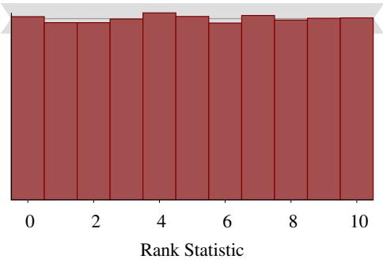

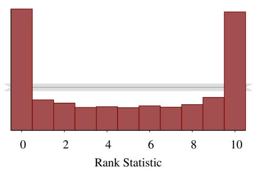  
FIG 4. The spikes at the boundaries of the SBC histogram indicate that posterior samples possess non-negligible autocorrelation.

FIG 3. Uniformly distributed rank statistics are consistent with the ranks being computed from independent samples from the exact posterior of a correctly specified model.  
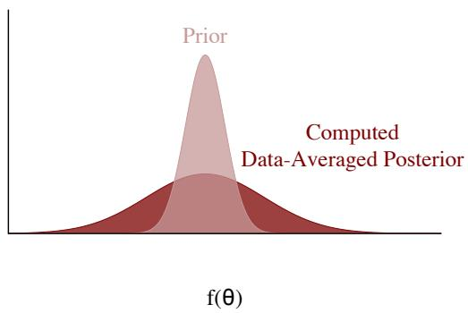  
(a)

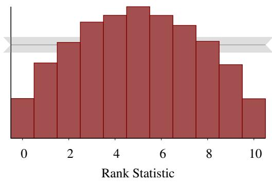  
(b)  
FIG 5. A symmetric, ∩-shaped distribution indicates that the computed data-averaged posterior distribution (dark red) is overdispersed relative to the prior distribution (light red). This implies that on average the computed posterior will be wider than the true posterior.

Next, consider a computational algorithm that produces, on average, posteriors that are overdispersed relative to the true posterior. When averaged over the Bayesian joint distribution this results in a data-averaged posterior distribution (1) that is overdispersed relative to the prior distribution (Figure 5a), and hence rank statistics that are biased towards the extremes that manifests as a characteristic ∩-shaped histogram (Figure 5b).

Conversely, an algorithm that computes posteriors that are, on average, under-dispersed relative to the true posterior produces a histogram of rank statistics with a characteristic ∪ shape (Figure 6).

Finally, we might have an algorithm that produces posteriors that are biased above or below the true posterior. This bias results in a data-averaged posterior distribution biased in the same direction relative to the prior distribution (Figure 7a) and rank statistics that are biased in the opposite direction (Figure 7b). For example, posterior samples biased to smaller values results in higher rank statistics, where as posterior samples biased to larger values results in lower rank statistics.

A misbehaving analysis can in general manifest many of these deviations at once. Because each deviation is relatively distinct from the others, however, in practice the systematic deviations are readily separated into the different behaviors if they are large enough.

## 4.3 Simulation-Based Calibration Plays a Vital Role in a Robust Bayesian Workflow

SBC is one of the few tools for evaluating the critical but frequently unexamined choice of computational method made in any Bayesian analysis. We have already argued that performance on a single simulated observation is, at best, a blunt instrument. Moreover, while most theoretical results only provide asymptotic comfort, SBC adapts to the specific model design under consideration.

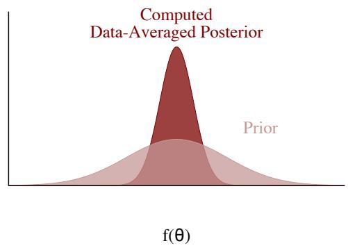  
(a)

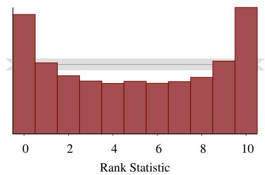  
(b)  
FIG 6. A symmetric ∪ shape indicates that the computed data-averaged posterior distribution (dark red) is underdispersed relative to the prior distribution (light red). This implies that on average the computed posterior will be narrower than the true posterior.

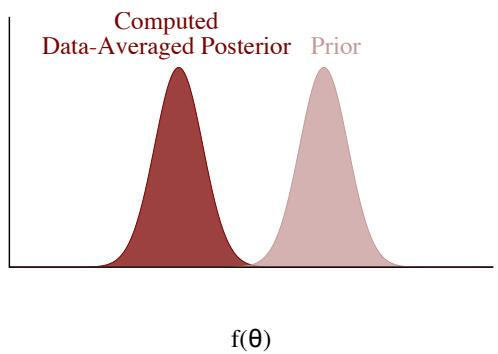  
(a)

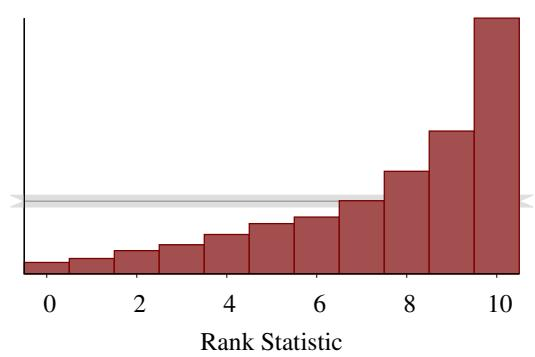  
(b)  
FIG 7. Asymmetry in the rank histogram indicates that the computed data-averaged posterior distribution (dark red) will be biased in the opposite direction relative to the prior distribution (light red). This implies that on average the computed posterior will be biased in the same opposite direction.

Furthermore, because SBC validates accuracy through one-dimensional random variables we can use carefully chosen random variables to make targeted assessments of an analysis based on our inferential needs and priorities. As these needs and priorities change we can run SBC again to verify the analysis anew.

The downside of using SBC in practice is that it is expensive; instead of fitting a single observation we have to fit N simulated observations before even considering the measured data. These fits, however, are embarrassingly parallel, which makes it possible to leverage access to computational resources through multicore personal computers, computing clusters, and cloud computing. For example, all of the examples in Section 6 were run on clusters and took, at most, a few hours.

The procedure can be sped up further by reducing the number of independent draws needed from the posterior at the cost of losing some sensitivity. Even a few simulations are useful to catch gross problems in an analysis.

## 5. EXTENDING SIMULATION-BASED CALIBRATION

SBC provides a straightforward procedure for validating simulation-based algorithms applied to Bayesian analyses, but the procedure can be limited in a few circumstances. In this section we discuss some small modifications that allow SBC to remain useful in some common practical circumstances.

## 5.1 Mitigating the Effect of Autocorrelation

As we saw in Section 4.2, SBC histograms will deviate from uniformity if the posterior samples are dependent, making it difficult to identify any bias in the samples. Unfortunately this limits the utility of the ideal SBC procedure when applied to Markov chain Monte Carlo (MCMC) algorithms. Given the popularity of these algorithms in practice, and the consequent need for validation schemes, we turn now to ameliorating the effects of autocorrelation with an appropriate thinning scheme.

Under certain ergodicity conditions, Markov chain Monte Carlo estimators achieve a central limit theorem,

$$
\frac { 1 } { N _ { \mathrm { e f f } } } \sum _ { n = 1 } ^ { N _ { \mathrm { e f f } } } f ( \theta _ { n } ) \sim \mathbf { N } \left( \mathbb { E } [ f ] , \frac { \mathbb { V } [ f ] } { N _ { \mathrm { e f f } } [ f ] } \right) ,
$$

where $\mathbb { E } [ f ]$ is the posterior expectation of a function $f , \mathbb { V } [ f ]$ is the variance of $f ,$ and $N _ { \mathrm { e f f } } [ f ]$ is the effective sample size for $f ,$

$$
N _ { \mathrm { e f f } } [ f ] = \frac { N _ { \mathrm { s a m p } } } { 1 + 2 \sum _ { m = 0 } ^ { \infty } \rho _ { m } [ f ] } ,
$$

with $\rho _ { m } [ f ]$ the lag-m autocorrelation of $f ,$ , which we estimate from the realized Markov chain (Gelman et al., 2013, Ch. 11). In words, $N _ { \mathrm { s a m p } }$ correlated samples contains roughly the same information as $N _ { \mathrm { e f f } }$ exact samples when estimating the expectation of $f .$

This suggests that thinning a Markov chain by keeping only every $T$ states so that $\begin{array} { r } { 2 \sum _ { m = T } ^ { \infty } \rho _ { m } [ f ] < \epsilon } \end{array}$ should yield a sample with negligible autocorrelation. In practice, we have observed that when $N _ { \mathrm { e f f } } [ f ] \le N$ , thinning by $\lceil N / N _ { \mathrm { e f f } } [ f ] \rceil$ reduces the autocorrelation sufficiently to produce samples that are well-suited for the SBC giving us (Algorithm 2). Some MCMC algorithms, such as dynamic HMC, can produce antithetic Markov chains with $N _ { \mathrm { e f f } } [ f ] > N$ . In such cases, we suggest first thinning by 2, which removes the negative odd lag correlations, and then thin as suggested above.

By carefully thinning the autocorrelated samples we should be able to significantly reduce the ∪ shape demonstrated in Figure 4 and maximize the sensitivity to any remaining issues with the model or algorithm. As the rank statistic is closely related to cumulative distribution function $P ( f ( \theta ) \leq f ^ { * } )$ , we suggest computing minimum $N _ { \mathrm { e f f } } [ P ]$ with $f ^ { * }$ being empirical quantiles of $f \left( \theta \right) \left( \mathrm { e . g } \right.$ . 19 equispaced quantiles). When running the SBC procedure over multiple quantities of interest we suggest thinning the chain just once using the largest thinning value determined with the above procedure over all quantities.

```latex
Algorithm 2 Simulation-based calibration can be applied to the correlated posterior samples
generated by a Markov chain provided that the Markov chain can be thinned to L effective
samples at each iteration.
Initialize a histogram with bins centered around $0 , \ldots , L .$
for n in N do
draw a prior sample $\tilde { \theta } \sim \pi ( \theta )$
draw a simulated data set $\dot { y } \sim \pi ( y | \tilde { \theta } )$
run a Markov chain for $L ^ { \prime }$ iterations to generate the correlated posterior samples,
$\{ \theta _ { 1 } , \dots , \theta _ { L ^ { \prime } } \} \sim \pi ( \theta \mid \tilde { y } )$
compute the effective sample size, $N _ { \mathrm { e f f } } [ f ]$ of $\big \{ \theta _ { 1 } , \dots , \theta _ { L ^ { \prime } } \big \}$ for the function $f$
if $\hat { N } _ { \mathrm { e f f } } [ f ] < L$ then
rerun the Markov for $L ^ { \prime } \cdot L / N _ { \mathrm { e f f } } [ f ]$ iterations
uniformly thin the correlated sample to L states and truncate any leftover draws at L
compute the rank statistic $r ( \{ f ( \bar { \theta _ { 1 } } ) , \dots , f ( \theta _ { L } ) \} , f ( \tilde { \theta } ) )$ as defined in (4.1)
increment the histogram with $r ( \{ f ( \theta _ { 1 } ) , \dots , f ( \theta _ { L } ) \} , f ( \tilde { \theta } ) )$
Analyze the histogram for uniformity.
```

Although some autocorrelation will remain in a sample that has been thinned by effective sample size, our experience has been that this strategy is sufficient to remove the autocorrelation artifacts from the SBC histogram. If desired, more conservative thinning strategies such as the truncation rules of Geyer (1992) can remove autocorrelation completely from the sample. A sample thinned with these rules is typically much smaller than the sample achieved by thinning based on the effective sample size, and we have not seen any significant benefit for SBC from the increased computation time needed for these more elaborate thinning methods to date.

Deviations that cannot be mitigated by thinning provide strong evidence that the Markov chain Monte Carlo estimators do not follow a central limit theorem and the Markov chains are not adequately exploring the target parameter space. This is particularly useful given that establishing central limit theorems for particular Markov chains and particular target distributions is a notoriously challenging problem even in relatively simple circumstances.

## 5.2 Simulation-Based Calibration for Small Deviations

The SBC histogram provides a general and interpretable means of identifying deviations from uniformity of the rank statistics and hence inaccuracies in our posterior computation, at least when the inaccuracies are large enough. For small deviations, however, the SBC histogram may not be sensitive enough for the deviations to be evident and other visualization strategies may be advantageous.

One option is to bin the SBC histogram multiple times to see if any deviation persists regardless of the binning. This approach, however, is ungainly to implement when there are many parameters and can be difficult to interpret. In particular, considering multiple histograms introduces a vulnerability to multiple testing biases.

Another approach is to pair the SBC histogram with the empirical cumulative distribution function (ECDF) which reduces variation at small and large ranks, making it easier to identify deviations around those values (Figure 8b). The deviation of the empirical CDF away from the expected uniform behavior is especially useful for identifying these small deviations (Figure 8c).

More subtle deviations can be isolated by considering more particular summary statistics, such as ranks quantiles or averages. While these have the potential to identify small biases they can also be harder to interpret and not as sensitive to the systematic deviations that manifest in the SBC histogram. Identifying a robust suite of diagnostic statistics is an open area of research and at present we recommend using the SBC histogram whenever possible.

## 6. EXPERIMENTS

In this section we consider the application of SBC on a series of examples that demonstrates the utility of the procedure for identifying and correcting incorrectly implemented analyses. For each example we implement the SBC procedure using posterior samples $L = 1 0 0$ so that, if the algorithm is properly calibrated, then the rank statistics will follow a U [0, 100] discrete uniform distribution. The experiments in Section 6.1 through Section 6.3 used $N =$ 10, 000 replicated observations while the experiment in Section 6.4 used N = 1000 replicated observations.

## 6.1 Misspecified Prior

Let’s first consider the case where we build our posterior using a different prior than that which we use to generate prior samples. This is not an uncommon mistake, even when models are specified in probabilistic programming languages.

Consider the linear regression model that we used before (Listing 2 in the Appendix) but with the prior on $\beta$ modified to $\mathbf { N } ( 0 , 1 ^ { 2 } )$ . With the prior samples still drawn according to $\mathrm { { N } ( 0 , 1 0 ^ { 2 } ) }$ , we expect that the posterior for $\beta$ will be under-dispersed relative to the prior even when the computation is exact. This should then lead to the deviation demonstrated in Figure 6 and, indeed, we see the characteristic ∪ shape in the SBC histogram for $\beta$ (Figure 9).

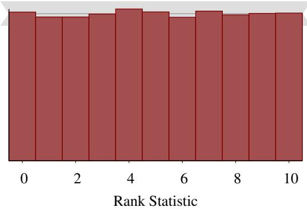  
(a)

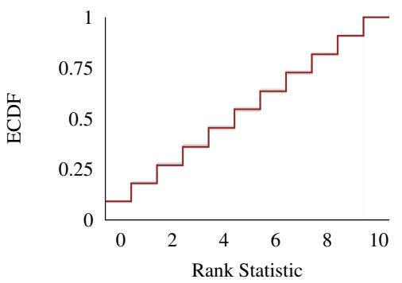  
(b)

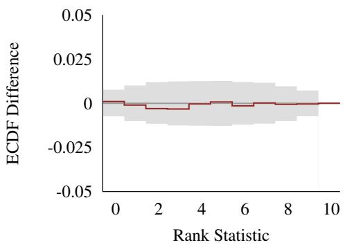  
(c)

FIG 8. In order to emphasize small deviations at low and large ranks we can pair the (a) SBC histogram with the corresponding (b) empirical cumulative distribution function (dark red) along with the variation expected of the empirical cumulative distribution function under uniformity. (c) Deviations are often easier to identify by subtracting the expected uniform behavior from the empirical cumulative distribution function.  
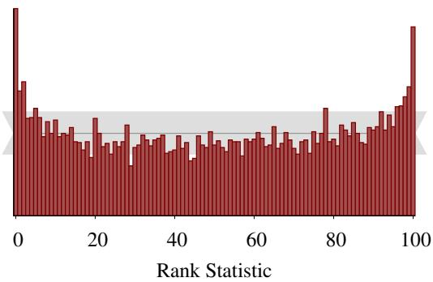  
FIG 9. When the data are simulated using a much wider prior than was used $t o \ : f i t \ :$ the model, the SBC histogram for a regression parameter $\beta$ exhibits a characteristic ∪-shape.

## 6.2 Biased Markov chain Monte Carlo

Hierarchical models implemented with a centered parameterization (Papaspiliopoulos, Roberts and Sköld, 2007) are known to exhibit a challenging geometry that can cause MCMC algorithms to return biased posterior samples. While some algorithms, such as Hamiltonian Monte Carlo (Neal et al., 2011; Betancourt and Girolami, 2013) provide diagnostics capable of identifying this problem, these diagnostics are not available for general MCMC algorithms. Consequently the SBC procedure will be particularly useful in hierarchical models if it can identify this problem.

Here we consider a hierarchical model of the eight schools data set Rubin (1981) using a centered parameterization (Listing 3 in the Appendix). In this example the centered parameterization exhibits a classic funnel shape that contracts into a region of strong curvature around small values of $\tau ,$ , making it difficult for most Markov chain methods to adequately explore.

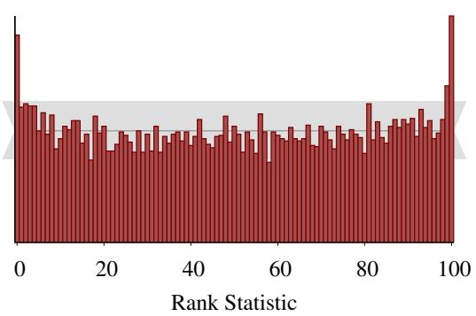  
(a)

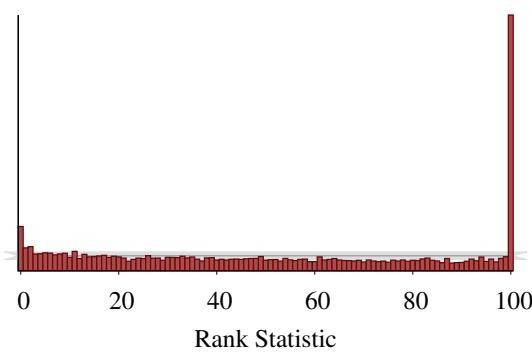  
(b)

FIG 10. Even without thinning, the underlying Markov chains, the SBC histograms for θ[1] and τ in the 8 schools centered parameterization of Section 6.2 demonstrate that Hamiltonian Monte Carlo yields samples that are biased towards larger values of τ than were used to generate the data.  
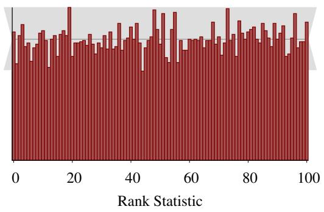  
(a)

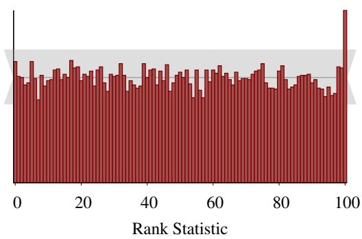  
(b)  
FIG 11. Once thinned (a), the SBC histogram for τ from the 8 schools non-centered parameterization in Section 6.2 show no evidence of bias. Without thinning, the SBC histogram for τ in the same model, (b), exhibits characteristic signs of autocorrelation in the posterior samples.

The SBC rank histogram for τ produced from Algorithm 1 clearly demonstrates that the posterior samples from Stan’s dynamic Hamiltonian Monte Carlo extension of the NUTS algorithm (Hoffman and Gelman, 2014; Betancourt, 2017) are biased below the prior samples, consistent with the known pathology (Figure 11b). Here we used Algorithm 1 instead of 2 because the algorithm’s unfaithfulness is evident over the deviation caused by the autocorrelation. Moreover, the extra computation required to return $L = 1 0 0$ effective samples post-thinning is impractical here as the centered parameterization, among other failing HMC diagnostics, has a low effective sample size per sample rate.

The corresponding non-centered parameterization should behave much better. Indeed, the SBC histogram thinned using Algorithm 2 (Figure 11) shows no deviation from uniformity as we expected given that Hamiltonian Monte Carlo is known to yield accurate computation for this analysis. If the SBC histogram is computed without thinning (Figure 11), the autocorrelation manifests as a large spikes at $L = 1 0 0$ , consistent with the discussion in Section 5.1.

## 6.3 ADVI can fail for simple models

We next consider automatic differentiation variational inference (ADVI) applied to our linear regression model (Listing 2 in the Appendix). In particular, we run the implementation of ADVI in Stan 2.17.1 that returns exact samples from a variational approximation to the posterior. Here we use Algorithm 1 again because we know that ADVI does not produce autocorrelated posterior samples.

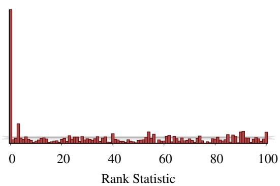  
FIG 12. The SBC histogram resulting from applying ADVI on the simple linear regression model indicates that the algorithm is strongly biased towards larger values of β in the true posterior.

Algorithm 1 immediately identifies that the variational approximation found by ADVI drastically underestimates the posterior for the slope, $\beta$ (Figure 12). Compare this with the results from Hamiltonian Monte Carlo (Figure 2), which yields a rank histogram consistent with uniformity.

## 6.4 INLA is slightly biased for spatial disease prevalence mapping

Finally let’s consider a sophisticated spatial model for HIV prevalence fit to data from the 2003 Demographic Health Survey in Kenya (Corsi et al., 2012). We follow the experimental setup of (Wakefield, Simpson and Godwin, 2016) and fit the model using INLA.

The data were collected by dividing Kenya into 400 enumeration areas (EAs) and in the ith EA randomly sampling $m _ { i }$ households, with the jth household containing $N _ { i j }$ people. Both $m _ { i }$ and $N _ { i j }$ are chosen to be consistent with the Kenya DHS 2003 AIDS recode. The number of positive responses $y _ { i j }$ is modeled as

$$
\begin{array} { r } { y _ { i j } \sim \mathrm { B i n } ( N _ { i j } , p _ { i j } ) } \\ { p _ { i j } = \mathrm { l o g i t } ^ { - 1 } ( \beta _ { 0 } + S ( x _ { i } ) + \epsilon _ { i j } ) , } \end{array}
$$

where $S ( \cdot )$ is a Gaussian process, $x _ { i }$ is the centroid of the ith $\mathrm { E A }$ , and $\epsilon _ { i j }$ are iid Gaussian error terms with standard deviation $\tau$ . Following the computation reasoning of Wakefield, Simpson and Godwin (2016) we approximate $S ( \cdot )$ using the stochastic partial differential equation approximation (Lindgren, Rue and Lindström, 2011) to a Gaussian process with isotropic covariance function

$$
c ( x _ { 1 } , x _ { 2 } ; \rho , \sigma ) = \frac { \sqrt { 8 } \sigma ^ { 2 } } { \rho } \left\| x _ { 1 } - x _ { 2 } \right\| K _ { 1 } \left( \frac { \sqrt { 8 } } { \rho } \left\| x _ { 1 } - x _ { 2 } \right\| \right) ,
$$

where $\rho$ is the distance at which the spatial correlation between points is approximately 0.1, $\sigma$ is the pointwise standard deviation, and $K _ { 1 } ( \cdot )$ is a modified Bessel function of the second kind.

To complete the model, we must specify priors on $\beta _ { 0 } , ~ \rho , ~ \sigma$ , and $\tau .$ . We specify a $\mathrm { N } ( - 2 . 5 , 1 . { \bar { 5 } } ^ { 2 } )$ prior on the logit baseline prevalence $\beta _ { 0 }$ . This prior is based on the national HIV prevalence across the world ranges from 0.3% to 20% (Central Intelligence Agency, 2018). We use penalized complexity priors (Simpson et al., 2017; Fuglstad et al., 2019) on the remaining parameters tuned to ensure $\operatorname* { P r } ( \rho < 0 . 1 ) = \operatorname* { P r } ( \sigma > 1 ) = \operatorname* { P r } ( \tau > 1 ) = 0 . 1$

One of the quantities of interest for this model is the average prevalence over a subregion A of Kenya,

$$
{ \frac { 1 } { | A | } } \int _ { A } \log \mathrm { i t } ^ { - 1 } ( \beta _ { 0 } + S ( x ) ) d x .
$$

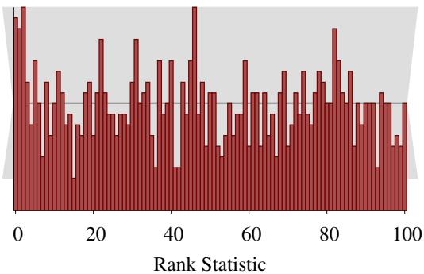  
(a)

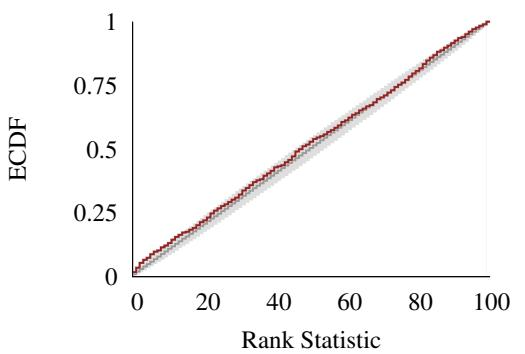  
(b)

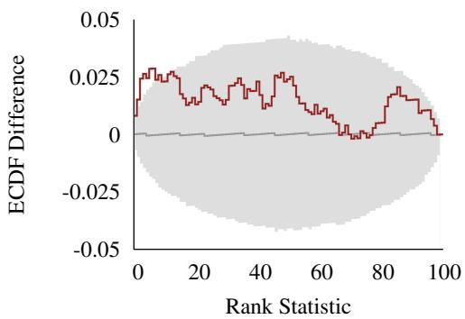  
(c)  
FIG 13. (a) The SBC histogram for the average prevalence of a spatial model doesn’t exhibit any obvious deviations, although the large span of the expected variation (gray) suggests that this test maybe too noisy to capture some potentially important discrepancies. (b) The empirical cumulative distribution function (dark red), however, shows that there is a small deviation at low ranks beyond the variation expected from a uniform distribution (gray). (c) The deviation is more evident by looking at the difference between the empirical cumulative distribution function and the stepwise-linear behavior expected of a discrete uniform distribution.

Wakefield, Simpson and Godwin (2016) suggested fitting this model using the R-INLA package to speed up the computation. As the quantity of interest is a non-linear transformation of a number of parameters, we need to use the R-INLA’s approximate posterior sampler, which is a relatively recent feature (Seppä et al., 2019).

Figure 13a shows the SBC histogram for N = 1000 replications to which are limited given the relatively high cost to run INLA in this model. The histogram shows that all of the ranks fall within the gray bars, but the large span of the bars indicates that the visual diagnostic may be too noisy to capture some potentially important discrepancies. In our tests, we saw that it’s common for deviations from a uniform distribution to be sufficiently severe that this histogram will still exhibit the signs of a poorly fitting procedure. Hence for a more finescale view of the fit we follow the recommendation in Section 5.2 and consider the ECDF (Figure 13b, c). Here we see that low ranks are seen slightly more often in the computed ranks than we would expect from a uniform distribution.

It is not surprising that INLA exhibits some bias in this example. Binomial data with low expected counts does not contain much information, which poses some problems for the Laplace approximation. Even though this feature is only present when the observed values of $y _ { i j } / N _ { i j }$ are close to zero, the SBC procedure is a sufficiently sensitive instrument to identify the problem. Overall, we would view INLA as a good approximation in a country like Kenya where the national prevalence is around 5.4%, while it would be inappropriate in Australia where the prevalence is 0.1% (Central Intelligence Agency, 2018). If we repeated this type of survey in a country with only 0.1% prevalence, however, then we would end up with too many zero observations for the method to be useful.

## 7. CONCLUSION

In this paper, we introduce simulation-based calibration (SBC), a readily-implemented procedure that can identify sources of poorly implemented analyses, including biased computational algorithms or incorrect model specifications. The visualizations produced by the procedure allow us to not only identify that a problem exists but also learn how the problem will affect resulting inferences. The ability to both identify and interpret these issues makes SBC an important step in a robust Bayesian workflow.

Our reliance on interpreting the SBC diagnostic through visualization, however, can be a limitation in practice, especially when dealing with models featuring a large number of parameters. One immediate direction for future work is to develop reliable numerical summaries that quantify deviations from uniformity of each SBC histogram and provide automated diagnostics that can flag certain parameters for closer inspection.

Global summaries, such as a $\chi ^ { 2 }$ goodness-of-fit test of the SBC histogram with respect to a uniform response, are natural options, but we found they did not perform particularly well in the above examples. The reason for this is that the deviation from uniformity tends to occur in only a few systematic ways, as discussed in Section 4.2, whereas these tests consider only global behavior and hence do not exploit these known failure modes. A potential alternative is to report a number of summaries that are designed to be sensitive to the specific types of deviation from uniformity we might expect to see.

Another future direction is deriving the expected behavior of the SBC histograms in the presence of autocorrelation and dropping the thinning requirement of SBC. This could even be done empirically, using the output of chains with known autocorrelations to calibrate the deviations in the rank histograms. These calibrated deviations could be used to define a sense of effective sample size for any algorithm capable of generating samples, not just Markov chain Monte Carlo.

Finally, the SBC histograms are only able to assess the calibration of one-dimensional posterior summaries. This is a limitation, especially in situations where the quantities of interest are naturally multivariate. An interesting extension of this methodology would be to incorporate some of the advances in multivariate calibration of probabilistic forecasts (Gneiting et al., 2008; Thorarinsdottir, Scheuerer and Heinz, 2013).

Acknowledgements. We thank Bob Carpenter, Chris Ferro, and Mitzi Morris for their helpful comments. The plot in Figure 13(c) shares the same derivation as the inla.ks.plot function written by Finn Lindgren and found in the R-INLA package. We thank the Academy of Finland (grant 313122), Sloan Foundation (grant G-2015-13987), U.S. National Science Foundation (grant CNS-1730414), Office of Naval Research (grants N00014-15-1-2541, N00014-16-P-2039, and N00014-19-1-2204), Defense Advanced Research Projects Agency (grant DARPA BAA-16-32), Institute of Education Sciences (grant R305D190048), and Schmidt Futures for partial support of this research.

## REFERENCES

CENTRAL INTELLIGENCE AGENCY (2018). Country comparison :: HIV/AIDS - Adult prevalence rate. World Factbook. https://www.cia.gov/library/publications/the-world-factbook/rankorder/2155rank.html. Accessed: 2018-04-04.

ANDERSON, J. L. (1996). A method for producing and evaluating probabilistic forecasts from ensemble model integrations. Journal of Climate 9 1518–1530.

BETANCOURT, M. (2017). A conceptual introduction to Hamiltonian Monte Carlo. arXiv:1701.02434.

BETANCOURT, M. J. and GIROLAMI, M. (2013). Hamiltonian Monte Carlo for hierarchical models arXiv:1701.02434.

BLOM, G. (1958). Statistical Estimates and Transformed Beta-Variables. Wiley; New York.

CARPENTER, B., GELMAN, A., HOFFMAN, M., LEE, D., GOODRICH, B., BETANCOURT, M., BRUBAKER, M., GUO, J., LI, P. and RIDDELL, A. (2017). Stan: A probabilistic programming language. Journal of Statistical Software, Articles 76 1–32.

COOK, S. (2006). BayesValidate (R package). https://CRAN.R-project.org/package=BayesValidate.

COOK, S. R., GELMAN, A. and RUBIN, D. B. (2006). Validation of software for Bayesian models using posterior quantiles. Journal of Computational and Graphical Statistics 15 675–692.

CORSI, D. J., NEUMAN, M., FINLAY, J. E. and SUBRAMANIAN, S. (2012). Demographic and health surveys: a profile. International Journal of Epidemiology 41 1602–1613.

FUGLSTAD, G.-A., SIMPSON, D., LINDGREN, F. and RUE, H. (2019). Constructing priors that penalize the complexity of Gaussian random fields. Journal of the American Statistical Association 114 445–452.

GELMAN, A. (2017). Correction to Cook, Gelman, and Rubin (2006). Journal of Computational and Graphical Statistics 26 940.

GELMAN, A., CARLIN, J. B., STERN, H. S., DUNSON, D. B., VEHTARI, A. and RUBIN, D. B. (2013). Bayesian Data Analysis, third edition. CRC Press.

GEWEKE, J. (2004). Getting it right: Joint distribution tests of posterior simulators. Journal of the American Statistical Assocation 98 799–804.

GEYER, C. J. (1992). Practical Markov chain Monte Carlo. Statistical Science 473–483.

GNEITING, T., STANBERRY, L. I., GRIMIT, E. P., HELD, L. and JOHNSON, N. A. (2008). Assessing probabilistic forecasts of multivariate quantities, with an application to ensemble predictions of surface winds. Test 17 211.

HAMILL, T. M. (2001). Interpretation of rank histograms for verifying ensemble forecasts. Monthly Weather Review 129 550–560.

HOFFMAN, M. D. and GELMAN, A. (2014). The no-U-turn sampler: Adaptively setting path lengths in Hamiltonian Monte Carlo. Journal of Machine Learning Research 15 1351–1381.

KUCUKELBIR, A., TRAN, D., RANGANATH, R., GELMAN, A. and BLEI, D. M. (2017). Automatic differentiation variational inference. Journal of Machine Learning Research 18 430–474.

LINDGREN, F., RUE, H. and LINDSTRÖM, J. (2011). An explicit link between Gaussian fields and Gaussian Markov random fields: The stochastic partial differential equation approach. Journal of the Royal Statistical Society: Series B (Statistical Methodology) 73 423–498.

NEAL, R. M. et al. (2011). MCMC using Hamiltonian dynamics. In Handbook of Markov Chain Monte Carlo (S. Brooks, A. Gelman, G. L. Jones and X. L. Meng, eds.) CRC Press.

PAPASPILIOPOULOS, O., ROBERTS, G. O. and SKÖLD, M. (2007). A general framework for the parametrization of hierarchical models. Statistical Science 22 59–73.

RUBIN, D. B. (1981). Estimation in parallel randomized experiments. Journal of Educational Statistics 6 377– 401.

RUE, H., MARTINO, S. and CHOPIN, N. (2009). Approximate Bayesian inference for latent Gaussian models by using integrated nested Laplace approximations. Journal of the Royal Statistical Society: Series B (Statistical Methodology) 71 319–392.

RUE, H., RIEBLER, A., SØRBYE, S. H., ILLIAN, J. B., SIMPSON, D. P. and LINDGREN, F. K. (2017). Bayesian computing with INLA: A review. Annual Review of Statistics and its Application 4 395–421.

SEPPÄ, K., RUE, H., HAKULINEN, T., LÄÄRÄ, E., SILLANPÄÄ, M. J. and PITKÄNIEMI, J. (2019). Estimating multilevel regional variation in excess mortality of cancer patients using integrated nested Laplace approximation. Statistics in Medicine 38 778–791.

SIMPSON, D., RUE, H., RIEBLER, A., MARTINS, T. G., SØRBYE, S. H. et al. (2017). Penalising model component complexity: A principled, practical approach to constructing priors. Statistical Science 32 1–28.

THORARINSDOTTIR, T. L., SCHEUERER, M. and HEINZ, C. (2013). Assessing the calibration of highdimensional ensemble forecasts using rank histograms. Journal of Computational and Graphical Statistics 25 105–122.

WAKEFIELD, J., SIMPSON, D. and GODWIN, J. (2016). Comment: Getting into Space with a Weight Problem. Journal of the American Statistical Association 111 1111–1118.

## APPENDIX A: CODE LISTINGS

We advise the reader to keep in mind that the Stan modeling language parameterizes the normal distribution using the mean and standard deviation whereas we have used a mean and variance parameterization throughout this text.

```c
1 data {
2 int<lower=1> N;
3 real X[N];
4 }
5
6 generated quantities {
7 real beta;
8 real alpha;
9 real y[N];
10
11 beta = normal_rng(0, 10);
12 alpha = normal_rng(0, 10);
13
14 for (n in 1:N)
15 y[n] = normal_rng(X[n] <sub>*</sub> beta + alpha, 1.2);
16 }
```  
LISTING 1. Data generating process for linear regression

1 data {   
2 int<lower=1> N;   
3 vector[N] X;   
4 vector[N] y;   
5 }   
6   
7 parameters {   
8 real beta;   
9 real alpha;   
10 }   
11   
12 model {   
13 beta ∼ normal(0, 10);   
14 alpha ∼ normal(0, 10);   
15   
16 y ∼ normal(X <sub>\*</sub> beta + alpha, 1.2);   
17 }  
LISTING 2. Inference model for linear regression

1 data {   
2 int<lower=0> J;   
3 real y[J];   
4 real<lower=0> sigma[J];   
5 }   
6   
7 parameters {   
8 real mu;   
9 real<lower=0> tau;   
10 real theta[J];   
11 }   
12   
13 model {   
14 mu ∼ normal(0, 5);   
15 tau ∼ normal(0, 5);   
16 theta ∼ normal(mu, tau);

17 y ∼ normal(theta, sigma);   
18 }

```c
1 data {
2 int<lower=0> J;
3 real y[J];
4 real<lower=0> sigma[J];
5 }
6
7 parameters {
8 real mu;
9 real<lower=0> tau;
10 real theta_tilde[J];
11 }
12
13 transformed parameters {
14 real theta[J];
15 for (j in 1:J)
16 theta[j] = mu + tau <sub>*</sub> theta_tilde[j];
17 }
18
19 model {
20 mu ∼ normal(0, 5);
21 tau ∼ normal(0, 5);
22 theta_tilde ∼ normal(0, 1);
23 y ∼ normal(theta, sigma);
24 }
```  
LISTING 4. 8 schools, non-centered parameterization

## APPENDIX B: PROOF OF THEOREM 1

THEOREM 2. Let ${ \tilde { \theta } } \sim \pi ( \theta ) , { \tilde { y } } \sim \pi ( y \mid { \tilde { \theta } } )$ , and $\big \{ \theta _ { 1 } , \dots , \theta _ { L } \big \}$ sampled independently from $\pi ( \theta \mid \tilde { y } )$ for any joint distribution $\pi ( y , \theta )$ . The rank statistic of any one-dimensional random variable over θ is uniformly distributed over the integers [0, L].

PROOF. Consider the one-dimensional random variable $f : \Theta \to \mathbb { R }$ and let ${ \tilde { f } } = f ( { \tilde { \theta } } )$ be the evaluation of the random variable with respect to the prior sample with $f _ { l } = f ( \theta _ { l } )$ the evaluation of the random variable with respect to one draw from the posterior sample. Similarly let $\pi ( f )$ and $\pi ( f \mid { \tilde { y } } )$ denote the pushforward probability density function of the prior density function and posterior density function, respectively.

Without loss of generality we can relabel the elements of the posterior sample such that they are ordered with respect to the random variable,

$$
f _ { 1 } \leq f _ { 2 } \leq \ldots \leq f _ { L - 1 } \leq f _ { L } .
$$

We can then write the probability mass function of the prior rank statistic as

$$
\begin{array} { l } { \displaystyle \pi ( \boldsymbol { r } ) = \int \mathrm { d } f \mathrm { d } y \pi ( y , f ) \frac { L ! } { r ! ( L - r ) ! } \mathbb { P } [ f _ { l } < f ] \cdot \mathbb { P } [ f _ { l } \ge f ] } \\ { \displaystyle \quad = \frac { L ! } { r ! ( L - r ) ! } \int \mathrm { d } f \mathrm { d } y \pi ( y , f ) \mathbb { P } \left[ f _ { l } < f \right] \cdot \mathbb { P } [ f _ { l } \ge f ] } \\ { \displaystyle \quad = \frac { L ! } { r ! ( L - r ) ! } \int \mathrm { d } f \mathrm { d } y \pi ( y , f ) \left[ \displaystyle \prod _ { l = 1 } ^ { r } \int _ { - \infty } ^ { f } \mathrm { d } f _ { l } \pi ( f _ { l } \mid f , y ) \right] \left[ \displaystyle \prod _ { l = r + 1 } ^ { L } \int _ { f } ^ { \infty } \mathrm { d } f _ { l } \pi ( f _ { l } \mid f , y ) \right] } \end{array}
$$

$$
\begin{array} { l } { { \displaystyle = \frac { L ! } { r ! ( L - r ) ! } \int \mathrm { d } f \mathrm { d } y \pi ( y , f ) \left[ \int _ { - \infty } ^ { f } \mathrm { d } f _ { l } \pi ( f _ { l } \mid f , y ) \right] ^ { r } \left[ \int _ { f } ^ { \infty } \mathrm { d } f _ { l } \pi ( f _ { l } \mid f , y ) \right] ^ { L - r } } } \\ { { \displaystyle = \frac { L ! } { r ! ( L - r ) ! } \int \mathrm { d } f \mathrm { d } y \pi ( y , f ) \left[ \int _ { - \infty } ^ { f } \mathrm { d } f _ { l } \pi ( f _ { l } \mid f , y ) \right] ^ { r } \left[ 1 - \int _ { - \infty } ^ { f } \mathrm { d } f _ { l } \pi ( f _ { l } \mid f , y ) \right] ^ { L - r } } } \end{array}
$$

Once we condition on an observation the distribution of the posterior samples is independent of the conditioning model configuration,

$$
\pi ( f _ { l } \mid f , y ) = \pi ( f _ { l } \mid y ) .
$$

Consequently

$$
\begin{array} { l } { { \displaystyle \pi ( \boldsymbol { r } ) = \frac { L ! } { r ! ( L - r ) ! } \int \mathrm { d } f \mathrm { d } y \pi ( y , f ) \left[ \int _ { - \infty } ^ { f } \mathrm { d } f _ { l } \pi ( f _ { l } \mid y ) \right] ^ { r } \left[ 1 - \int _ { - \infty } ^ { f } \mathrm { d } f _ { l } \pi ( f _ { l } \mid y ) \right] ^ { L - r } } } \\ { { \displaystyle = \frac { L ! } { r ! ( L - r ) ! } \int \mathrm { d } f \mathrm { d } y \pi ( f \mid y ) \pi ( y ) \left[ \int _ { - \infty } ^ { f } \mathrm { d } f _ { l } \pi ( f _ { l } \mid y ) \right] ^ { r } \left[ 1 - \int _ { - \infty } ^ { f } \mathrm { d } f _ { l } \pi ( f _ { l } \mid y ) \right] ^ { L - r } } } \\ { { \displaystyle = \frac { L ! } { r ! ( L - r ) ! } \int \mathrm { d } y \pi ( y ) \int \mathrm { d } f \pi ( f \mid y ) \left[ \int _ { - \infty } ^ { f } \mathrm { d } f _ { l } \pi ( f _ { l } \mid y ) \right] ^ { r } \left[ 1 - \int _ { - \infty } ^ { f } \mathrm { d } f _ { l } \pi ( f _ { l } \mid y ) \right] ^ { L - r } } } \end{array}
$$

Now because the model used to simulate data and construct posterior distributions is the same we have

$$
\pi ( f _ { l } \mid y ) = \pi ( f \mid y ) .
$$

This allows us to consider the change of variables

$$
u ( y ) = \int _ { - \infty } ^ { f } \mathrm { d } f ^ { \prime } \pi ( f ^ { \prime } \mid y )
$$

which gives

$$
\begin{array} { l } { { \displaystyle \pi ( r ) = \frac { L ! } { r ! ( L - r ) ! } \int \mathrm { d } y \pi ( y ) \int \mathrm { d } u [ u ] ^ { r } [ 1 - u ] ^ { L - r } } } \\ { { \displaystyle \quad = \frac { L ! } { r ! ( L - r ) ! } \int \mathrm { d } y \pi ( y ) \frac { r ! ( L - r ) ! } { ( L + 1 ) ! } } } \\ { { \displaystyle \quad = \frac { L ! } { r ! ( L - r ) ! } \frac { r ! ( L - r ) ! } { ( L + 1 ) ! } \int \mathrm { d } y \pi ( y ) } } \\ { { \displaystyle \quad = \frac { 1 } { L + 1 } \int \mathrm { d } y \pi ( y ) } } \\ { { \displaystyle \qquad = \frac { 1 } { L + 1 } , } } \end{array}
$$

consistent with a uniform distribution over the $L + 1$ possible ranks, as desired.