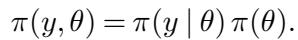
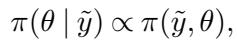

[← 返回 README](../README.md)

# 1. Introduction

## 📌 预览

引言先复述贝叶斯建模"概念上很简单"（先验×似然=联合，条件化=后验），再点出实践中的痛处：**复杂模型 + 复杂算法 = 双重出错风险**，而算法总能返回一个结果却无从验证。作者指出，贝叶斯联合分布本身的结构提供了一把通用钥匙——任何"能产出后验样本"的方法（含 MCMC、INLA、ADVI）都能被验证。SBC 就是对 Cook-Gelman-Rubin (2006) 想法的一个**修正实现**。

---

Powerful algorithms and computational resources are facilitating Bayesian modeling in an increasing range of applications. Conceptually, constructing a Bayesian analysis is straightforward. We first define a joint distribution over the parameters, θ, and measurements, y, with the specification of a prior distribution and likelihood,

Conditioning this joint distribution on an observation, y˜, yields a posterior distribution,

that encodes information about the system being analyzed.

> 💡 **机制拆解 (Hao 批注)**: 这两个公式定下全文的记号地基。联合分布 $\pi(y,\theta)=\pi(y\mid\theta)\pi(\theta)$ 拆成似然×先验；对一次观测 $\tilde{y}$ 条件化得到后验 $\pi(\theta\mid\tilde{y})\propto\pi(\tilde{y},\theta)$。SBC 的全部魔力都来自"从**同一个**联合分布里既能正向生成数据、又能反向做推断"这一对偶结构——正向 $\theta\to y$ 定义了 ground truth，反向 $y\to\theta$ 是待检验的算法。后面第 2 节会证明：把后验对整个联合分布平均，必须还原成先验。

Implementing this Bayesian inference in practice, however, can be computationally challenging when applied to large and structured datasets. We must make our model rich enough to capture the relevant structure of the system being studied while simultaneously being able to accurately work with the resulting posterior distribution. Unfortunately, every algorithm in computational statistics requires that the posterior distribution possesses certain favorable properties in order to be successful. Consequently the overall performance of an algorithm is sensitive to the details of the model and the observed data, and an algorithm that works well in one analysis can fail spectacularly in another.

> 💡 **问题动机 (Hao 批注)**: 这里点出一个对我们盲逆问题尤其致命的事实——"an algorithm that works well in one analysis can fail spectacularly in another"。算法性能对**模型细节和数据**都敏感。对我们联合估计 $(x,\varphi,\sigma)$ 的采样器，这意味着：在某个算子参数区域采样器可能校准良好，换一组 $\varphi$（比如更强的模糊/更大的下采样倍率）后验几何变差，采样器就可能失效。SBC 的价值正是它"adapts to the specific model design"——针对你当前这套模型逐一验证，而不是给一个泛化保证。

As we move towards creating sophisticated, bespoke models with each analysis, we stress the algorithms in our statistical toolbox. Moreover, the complexity of these models provides abundant opportunity for mistakes in their specification. We must verify both that our code is implementing the model we think it is and that our inference algorithm is able to perform the necessary computations accurately. While we always get some result from a given algorithm, we have no idea how good it might be without some form of validation.

> 💡 **机制拆解 (Hao 批注)**: 这句"verify both...and..."明确了 SBC 要同时抓的两类错误：**(1) 模型实现错误**（代码实现的模型 ≠ 你以为的模型，第 6.1 节先验写错就是例子）；**(2) 算法计算错误**（采样器算不准，第 6.2 节 centered 参数化 + HMC、第 6.3 节 ADVI 就是例子）。"we always get some result...no idea how good"是全文的灵魂吐槽——采样器不会报错，它只会安静地给你一个错的后验。

Fortunately, the structure of the Bayesian joint distribution allows for the validation of any Bayesian computational method capable of producing samples from the posterior distribution, or an approximation thereof. This includes not only Monte Carlo methods but also deterministic methods that yield approximate posterior distributions amenable to exact sampling, such as integrated nested Laplace approximation (INLA) (Rue, Martino and Chopin, 2009; Rue et al., 2017) and automatic differentiation variational inference (ADVI) (Kucukelbir et al., 2017). In this paper we introduce Simulation-Based Calibration (SBC), a corrected implementation of the ideas of Cook, Gelman and Rubin (2006) for validating these algorithms in a generic and straightforward way within the scope of a given Bayesian joint distribution.

> 💡 **机制拆解 (Hao 批注)**: 关键限定语再次出现——"within the scope of a given Bayesian joint distribution"。SBC 的所有结论都被锁在"你假设的这个联合分布"内部。它能告诉你"在假设的模型下算法是否算对了"，但**不能**告诉你"这个假设的模型是否描述了真实数据"。这就是我们课题里"算法错误 vs 模型错误"两层结论的分水岭：SBC 关掉第一层（算法），把不可约的偏离甩给第二层（模型），后者需要 posterior predictive checks / coverage on real data 来查。另外注意 SBC 被定位为对 Cook-Gelman-Rubin (2006) 的 "corrected implementation"——第 3 节会讲清原版哪里出了 bug（离散化 + 自相关导致假阳性）。

We begin with a discussion the natural self-consistency of samples from the Bayesian joint distribution and previous validation methods that have exploited this behavior. Next we introduce the simulation-based calibration framework and examine the qualitative interpretation of the SBC output, how it identifies how the algorithm being validated might be failing, and how it can be incorporated into a robust Bayesian workflow. Finally, we consider some useful extensions of SBC before demonstrating the application of the procedure over a range of analyses.

> 💡 **Section 小结 (Hao 批注)**:
> - **核心命题**: 贝叶斯联合分布的自洽性（后验数据平均=先验）是一把通用钥匙，可以验证任何能产出后验样本的算法，而无需知道真后验的解析形式。
> - **两类被抓的错误**: 模型实现错误 + 算法计算错误。
> - **适用面**: MCMC、INLA、ADVI 通吃，只要能采样。
> - **可追问点**: "corrected implementation" 到底修了什么？（→ 第 3 节：离散化 artifact + 自相关导致的假阳性）；SBC 为什么只在"假设模型内部"有效？（→ 第 2、4 节的自洽性恒等式与 Theorem 1）。
