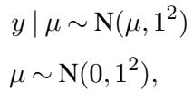
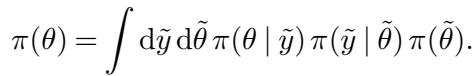

[← 返回 README](../README.md)

# 2. Self-Consistency of the Bayesian Joint Distribution

## 📌 预览

这一节回答"该拿什么当验证的靶子"。作者先否掉两种朴素做法：(1) 直接和真后验期望比——但只有最简单的模型才知道真后验；(2) 定一个 ground truth $\tilde\theta$、模拟一份数据、看后验能不能"恢复"它——一个反例就说明这招不可靠。正确姿势是：**从先验采 ground truth $\tilde\theta$，再从对应数据生成过程采 $\tilde y$，覆盖整个联合分布**。由此得到一个模型无关的恒等式（公式 (1)）：**后验对联合分布做平均 = 先验**。任何偏离都意味着分析出错。

---

The most straightforward way to validate a computed posterior distribution is to compare computed expectations with the exact values. An immediate problem with this, however, is that we know the true posterior expectation values for only the simplest models. These simple models, moreover, typically have a different structure to the models of interest in applications. This motivates us to construct a validation procedure that does not require access to the exact expectations, or any other property of the true posterior distribution.

> 💡 **问题动机 (Hao 批注)**: 这段把"和真后验比"这条路堵死了——真后验期望只有玩具模型才知道，而玩具模型的几何又和真正想验证的复杂模型不一样。所以 SBC 必须是一个**不依赖真后验任何性质**的检验。这个约束非常关键：它逼出的解（rank 均匀性）只用到"从联合分布采样"这一件事，因此对我们高维图像 + 低维 $\varphi$ 的复杂联合模型同样成立。

A popular alternative to comparing the computed and true expectation values directly is to define a ground truth $\tilde{\theta}$, simulate data from that ground truth, $\tilde{y} \sim \pi(y|\tilde{\theta})$, and then quantify how well the computed posterior recovers the ground truth in some way. Unfortunately this approach is flawed, as demonstarted in a simple example.

Consider the model

and an attempt at verification that uses the single ground truth value $\tilde{\mu} = 0$. If we simulate from this model and draw the plausible, but extreme, data value $\tilde{y} = 2.1$, then the true posterior will be $\mu \mid \tilde{y} \sim \mathbf{N}(1.05, 0.5^2)$. As $\tilde{\mu}$ is more than two posterior standard deviations from the posterior mean, we might be tempted to say that recovery has not been successful. On the other hand, imagine that we accidentally used code that exactly fits an identical model but with the variance for both the likelihood and prior set to 10 instead of 1. In this case, the incorrectly computed posterior would be $\mathrm{N}(1.05, 5^2)$ and we might conclude that the code correctly recovered the posterior.

> 💡 **机制拆解 (Hao 批注)**: 这个反例是全节的杀招，值得逐步拆。正确模型 $y\mid\mu\sim N(\mu,1)$、$\mu\sim N(0,1)$，取 ground truth $\tilde\mu=0$，抽到一个偏极端但合法的数据 $\tilde y=2.1$，真后验是 $N(1.05,0.5^2)$。此时 $\tilde\mu=0$ 落在后验均值外 2 个标准差——看起来"没恢复成功"，但代码其实**是对的**。反过来，一份**错误**代码把方差都设成 10，后验变成 $N(1.05,5^2)$，$\tilde\mu=0$ 落在均值内不到 1 个标准差——看起来"恢复成功"，但代码其实**是错的**。结论：单次"恢复 ground truth"的成败会给出**完全颠倒**的判断。

Consequently, the behavior of the algorithm in any individual simulation will not characterize the ability of the inference algorithm to fit that particular model in any meaningful way. In the example above, it might lead us to conclude that the incorrectly coded analysis worked as desired, while the correctly coded analysis failed. In order to properly characterize an analysis we need to at the very least consider multiple ground truths.

> 💡 **本课题定位 (Hao 批注)**: 这条对我们盲逆问题是直接警告——**不要用"单张图 + 单组算子参数下后验能否套住真值"来判断校准**。单次实验的成败被数据的随机性主导，过宽的后验反而更容易"套住"真值（假的安全感）。这也是为什么我们的校准协议必须做成分布级的（SBC rank / coverage 曲线 / CRPS），在多组 ground truth $(x,\varphi,\sigma)$ 上统计，而不是给几张漂亮的恢复图。

Which ground truths, however, should we consider? An algorithm might be able to recover a posterior constructed from data generated from some parts of the parameter space while faring poorly on data generated from other parts of parameter space. In Bayesian inference a proper prior distribution quantifies exactly which parameter values are relevant and hence should be considered when evaluating an analysis. This immediately suggests that we consider the performance of an algorithm over the entire Bayesian joint distribution, first sampling a ground truth from the prior, $\tilde{\theta} \sim \pi(\theta)$, and then data from the corresponding data generating process, $\tilde{y} \sim \pi(y|\tilde{\theta})$. We can then build inferences for each simulated observation y˜ and then compare the recovered posterior distribution to the sampled parameter $\tilde{\theta}$.

> 💡 **机制拆解 (Hao 批注)**: 这里回答"该考虑哪些 ground truth"——答案是**让先验来决定权重**。先验 $\pi(\theta)$ 本身就量化了"哪些参数值是相关的"，所以正确做法是从先验采 $\tilde\theta$，再从数据生成过程采 $\tilde y$，覆盖整个联合分布。这一步把"选哪些 ground truth"从主观决定变成由模型自身的先验自动定义，是 SBC 数据流的第一环：**先验采样 $\tilde\theta\to$ 模拟数据 $\tilde y\to$ 后验采样 $\to$ rank**。对我们的课题，这意味着 SBC 的 $\tilde\varphi$、$\tilde\sigma$ 必须从我们真正打算用的先验里抽——先验一改，SBC 的验证范围就跟着改。

Advantageously, this procedure also defines a natural condition for quantifying the faithfulness of the computed posterior distributions, regardless of the structure of the model itself. Integrating the exact posteriors over the Bayesian joint distribution returns the prior distribution,

In other words, for any model the average of any exact posterior expectation with respect to data generated from the Bayesian joint distribution reduces to the corresponding prior expectation.

> 💡 **公式批读 (Hao 批注)**: 这是全文的**心脏——公式 (1)**。$\pi(\theta)=\int \mathrm{d}\tilde y\,\mathrm{d}\tilde\theta\,\pi(\theta\mid\tilde y)\pi(\tilde y\mid\tilde\theta)\pi(\tilde\theta)$。读法：把 ground truth $\tilde\theta$ 从先验采出、数据 $\tilde y$ 从似然采出、再对每份数据算后验 $\pi(\theta\mid\tilde y)$，然后把这些后验按数据生成的概率平均——结果**必须**精确还原成先验 $\pi(\theta)$。直觉：$\tilde\theta$ 和 $\tilde y$ 是从联合分布采的，$\pi(\theta\mid\tilde y)\pi(\tilde y\mid\tilde\theta)\pi(\tilde\theta)$ 内层积掉 $\tilde\theta$ 就是 $\pi(\theta\mid\tilde y)\pi(\tilde y)$，再积掉 $\tilde y$ 得边缘 $\pi(\theta)$。这个恒等式的妙处：它**模型无关**、**不需要真后验**，只需要"能采样"。SBC 后面所有检验（rank 均匀性）都是这条恒等式的可操作化身。

Consequently, any discrepancy between the data averaged posterior (1) and the prior distribution indicates some error in the Bayesian analysis. This error can come either from inaccurate computation of the posterior or a mis-implementation of the model itself. Well-defined comparisons of these two distributions then provides a generic means of validating the analysis, at least within the scope of the modeling assumptions.

> 💡 **Section 小结 (Hao 批注)**:
> - **核心恒等式**: 数据平均后验 = 先验（公式 (1)），模型无关、不需真后验，只需可采样。
> - **偏离的两种病因**: 后验计算不准（算法错） 或 模型实现有误（模型代码错）——注意这里的"model mis-implementation"指的是**代码写的模型 ≠ 打算写的模型**，仍属"假设内部"的错，不是"假设 ≠ 真实数据"。
> - **反例洞察**: 单次 ground truth 恢复的成败会给出颠倒结论，过宽后验反而假装成功——必须用分布级检验。
> - **可追问点**: 公式 (1) 是"分布相等"，怎么变成一个可视化的一维检验？（→ 第 3、4 节：先用 CDF 分位数，再升级成 rank 统计量 + histogram）。
