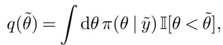
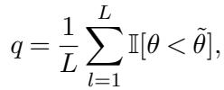
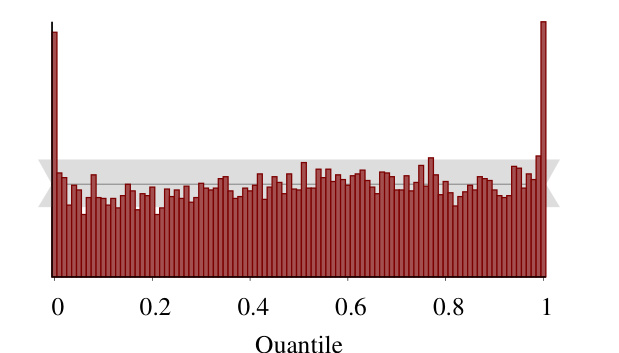

[← 返回 README](../README.md)

# 3. Existing Validation Methods Exploiting the Bayesian Joint Distribution

## 📌 预览

这一节做文献 + 反面教材。公式 (1) 的自洽性不是新观察，前人已用过两次：**Geweke (2004)** 用一个在后验和似然之间交替的 Gibbs sampler，比较边缘参数样本和先验样本的 z-score；**Cook-Gelman-Rubin (2006, CGR)** 更巧妙，直接看后验 CDF 分位数是否均匀。作者指出 CGR 的两大硬伤——(1) 有限后验样本下经验 CDF 是**离散的**（只有 $L+1$ 个取值），需要连续性修正，会产生 artifact；(2) MCMC 样本的**自相关**破坏了均匀性假设，导致对**本来正确**的分析（Stan 线性回归）报出假阳性（Figure 1）。这两点正是 SBC 要修的 bug。

---

The self-consistency of the data-averaged posterior (1) and the prior is not a novel observation. This behavior has been exploited in at least two earlier methods for validating Bayesian computational algorithms.

Geweke (2004) proposed a Gibbs sampler targeting the Bayesian joint distribution that alternatively samples from the posterior, $\pi(\theta \mid y)$, and the likelihood, $\pi(y \mid \theta)$. If an algorithm can generate accurate posterior samples, then this Gibbs sampler will produce accurate samples from the Bayesian joint distribution, and the marginal parameter samples will be indistinguishable from any sample of the prior distribution. The author recommended quantifying the consistency of the marginal parameter samples and a prior sample with z-scores of each parameter mean, with large z-scores indicating a failure of the algorithm to produce accurate posterior samples.

> 💡 **机制拆解 (Hao 批注)**: Geweke 的思路：构造一个在 $\pi(\theta\mid y)$（待测采样器）和 $\pi(y\mid\theta)$（似然，正向已知）之间交替的 Gibbs 链。如果待测采样器是对的，这条链就在采样联合分布 $\pi(y,\theta)$，其边缘参数样本应和"直接从先验采"无法区分——用参数均值的 z-score 量化差异，z-score 大就说明采样器有偏。这本质上是把公式 (1) 变成"边缘 = 先验"的检验。

The main challenge with this method is that the diagnostic z-scores will be meaningful only once the Gibbs sampler has converged. Unfortunately, the data and the parameters will be strongly correlated in a generative model and the convergence of this Gibbs sampler will be slow, making it challenging to identify when the diagnostics can be considered.

> 💡 **消融解读 (Hao 批注)**: Geweke 法的致命伤——这条辅助 Gibbs 链**收敛慢**。因为生成模型里数据和参数强相关，交替采样混合很差，你根本不知道 z-score 什么时候才可信。更糟的是这条链把"待测采样器的错误"和"辅助链自身没收敛"耦合在一起，难以归因。SBC 后面完全抛弃这条辅助链，改成对每份数据独立地重新采后验（embarrassingly parallel），从根上绕开这个收敛问题。

Cook, Gelman and Rubin (2006) avoided the auxiliary Gibbs sampler entirely by considering cumulative distribution function (CDF) values (quantiles) approximated using samples from the simulated posterior distribution. They use the notation θ to represent any scalar model parameter or function of parameters. They noted that if $\tilde{\theta} \sim \pi(\theta)$ and $\tilde{y} \sim \pi(y|\tilde{\theta})$ then the exact posterior CDF values for each parameter,

will be uniformly distributed provided that the posteriors are absolutely continuous. Consequently any deviation from the uniformity of the computed posterior CDF values indicates a failure in the implementation of the analysis.

> 💡 **公式批读 (Hao 批注)**: CGR 的核心洞察——把公式 (1) 落成一维检验。定义 ground truth $\tilde\theta$ 在后验里的 CDF 值 $q(\tilde\theta)=\int\mathrm{d}\theta\,\pi(\theta\mid\tilde y)\,\mathbb{I}[\theta\lt\tilde\theta]$，即"真值在后验分布中处于哪个分位"。若后验绝对连续且计算正确，这个分位数 $q$ 会**均匀分布在 $[0,1]$**。这就是"概率积分变换 (PIT)"的贝叶斯版本：把分布相等的高维命题压成"分位数是否均匀"的一维、可视化命题。SBC 用的 rank 统计量正是这个 CDF 值的离散采样对应物。

The authors suggest quantifying the uniformity of these CDF values by transforming them into z-scores with an application of the inverse normal CDF. The absolute value of the $z-$ scores can then be visualized to identify deviations from normality of, and hence uniformity of the CDF values. At the same time these deviations can be quantified with a $\chi^2$ test.

> 💡 **机制拆解 (Hao 批注)**: CGR 的检验方式：把均匀的分位数经逆正态 CDF $\Phi^{-1}$ 变成 z-score，若原本均匀则 z-score 应服从标准正态，再用 $\chi^2$ 检验偏离。问题的种子已经埋下——$\Phi^{-1}$ 在 0 和 1 处**发散**，而有限样本下分位数恰好取到 0/1 是常事，必须打连续性修正补丁。这个补丁正是后面 artifact 的来源。

This procedure works well in certain examples, as demonstrated by Cook, Gelman and Rubin (2006), but it can run into problems with MCMC samples as the empirical CDF values only asymptotically approach the true values. Without a central limit theorem and sufficiently small autocorrelations, the estimated quantiles from finite MCMC samples will not follow the uniform distribution assumed in Cook, Gelman and Rubin (2006). These issues make it difficult to determine whether a deviation from normality is due to pre-asymptotic behavior or biases in the posterior computations. In addition the description of the algorithm in Cook, Gelman and Rubin (2006) is incomplete in that it neglected to mention the continuity correction used for its quantile computation, as implemented in Cook (2006).

> 💡 **消融解读 (Hao 批注)**: 这是 SBC 要修的第一个 bug 的核心诊断——CGR 假设经验分位数**精确**服从均匀，但 MCMC 样本只在**渐近**下才逼近真 CDF。没有中心极限定理保证、且自相关不够小时，有限 MCMC 分位数**不**均匀。于是你看到偏离时无法归因：到底是"采样器有偏"还是"只是样本量不够的 pre-asymptotic 行为"？这个归因困境使 CGR 在 MCMC 时代基本失效。

In particular, because there are only $L + 1$ positions in a posterior sample of size $L$ in between which the prior sample $\tilde{\theta}$ can fall, an empirically approximated CDF value of the prior draw $\tilde{\theta}$ within the posterior sample $\theta$,

is fundamentally discrete, taking one of $L + 1$ evenly spaced values on [0, 1]. This discretization causes artifacts when visualizing the CDF values and it requires some continuity corrections for the finite instances where the estimated CDF value equals 0 or 1. At the same time, autocorrelation in the simulations creates dependence in the estimated CDF values and modifies the distributions of test statistics that were worked out implicitly assuming independence, a point recognized in the recent correction (Gelman, 2017). With attempts at smoothing, we may fix visual artifacts but we have found no exact proofs of distribution for these continuous estimators.

> 💡 **公式批读 (Hao 批注)**: 这是"离散化"病根的精确表述。经验 CDF $q=\frac{1}{L}\sum_{l=1}^{L}\mathbb{I}[\theta\lt\tilde\theta]$ 只能取 $\{0,\frac1L,\dots,1\}$ 共 $L+1$ 个值——它**本质离散**，而 CGR 却拿它当连续均匀来做 $\Phi^{-1}$ 变换。两个后果：(1) 取到 0 或 1 时 $\Phi^{-1}$ 发散，需连续性修正（偏移 0.5），修正本身制造可视化 artifact；(2) 自相关让各分位数**相互依赖**，破坏了检验统计量隐含的独立性假设（Gelman 2017 的勘误就承认了这点）。SBC 的对策很干脆：**不把 rank 当连续量、也不做 $\Phi^{-1}$ 变换，而是直接把 rank 当整数丢进 histogram，用离散均匀分布做参照**——从根上消掉连续性修正。

To demonstrate these issues, we run most of the Cook, Gelman and Rubin (2006) procedure for a straightforward linear regression model (Listings 1 and 2 in the Appendix) in Stan 2.17.1 (Carpenter et al., 2017). The $\bar{\Phi}^{-1}$ transformation is not defined at 0 or 1, a problem with the underlying framework that was approximately avoided in Cook (2006) by adding an offset 0.5 to the estimated quantiles as a continuity correction (Blom, 1958). Here, we avoid the need for continuity corrections entirely by visualizing the estimated quantiles with a carefully-binned histogram. For both plots in Figure 1, we generated 10,000 draws from the prior predictive $\pi(y)$ and fit the Stan model on each of these, taking 100 post-warmup draws from the posterior for each draw from the prior predictive. For this evaluation, we used a histogram of both α and $\beta$ parameters together in the same plot, as it was already evident that non-uniformities had been found from the combined plot.

Although Stan is known to be extremely accurate for this analysis, a histogram of the empirical CDF values demonstrates strong deviations from uniformity (Figure 1) that immediately suggests algorithmic problems that aren't there. We also see evidence of autocorrelation in the posterior sample manifesting in the histogram, an issue we consider more thoroughly in Section 5.1.

*FIG 1. The procedure of Cook, Gelman and Rubin (2006) applied to a linear regression analysis with Stan indicates significant problems despite the analysis itself being correct. In particular, the histogram of estimated CDF values (red) exhibits strong systematic deviations from the variation expected of a uniform histogram (gray).*

> 💡 **Figure 1 批读 (Hao 批注)**: 这张图是 SBC 存在的理由——**假阳性的现场直播**。实验设置：Stan 拟合一个简单线性回归（Stan 对它公认极其准确），10,000 份 prior predictive 数据、每份取 100 个后验样本，把 $\alpha$ 和 $\beta$ 的分位数合并画 histogram。结果红色分位数直方图在**两端 0 和 1 处飙出尖峰**，严重偏离灰色均匀带。但分析本身**完全正确**！这些尖峰不是算法错误，而是 (1) 连续性修正的 artifact + (2) 后验样本的自相关共同伪造出来的。教训：CGR 会把一个正确的分析冤枉成有 bug。对照下一节的 Figure 2（同一个线性回归、同一个 Stan，用 SBC 就干净均匀），就能看出 SBC 修好了什么。注意两端尖峰的形状会在第 4.2 节 Figure 4 里被正式归因为"自相关"。

> 💡 **Section 小结 (Hao 批注)**:
> - **两位前辈**: Geweke (2004) 辅助 Gibbs 链 + z-score（毛病：链收敛慢、难归因）；CGR (2006) 后验 CDF 分位数均匀性检验（毛病：离散化 artifact + 自相关假阳性）。
> - **关键实验**: Figure 1——正确的 Stan 线性回归被 CGR 冤判为有 bug，两端尖峰是 artifact 而非真错误。
> - **SBC 要修的两个 bug**: ①用整数 rank + histogram + 离散均匀参照，取消连续性修正；②用 thinning 处理自相关（第 5.1 节）。
> - **可追问点**: rank 统计量与 CGR 分位数到底差在哪？（→ 第 4.1 节：rank 是 $\tilde\theta$ 在后验样本中的整数名次，天然离散、正好用离散均匀检验，无需连续化）。
