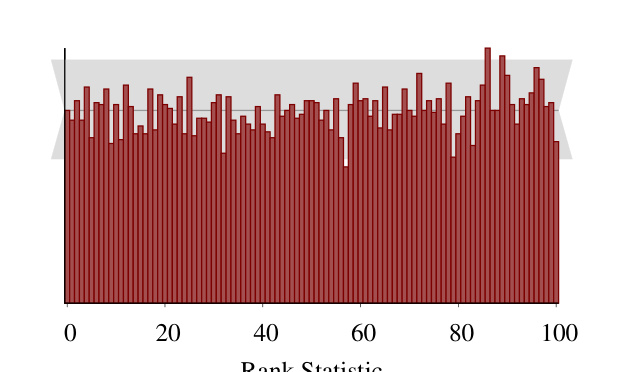
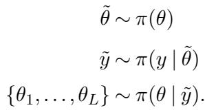
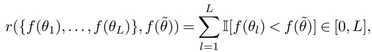
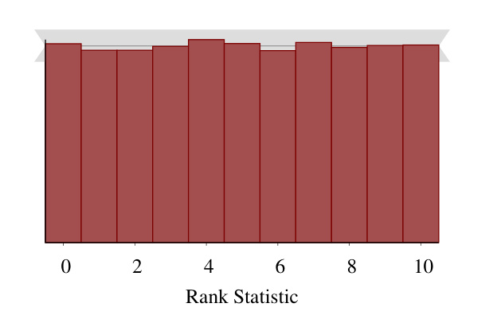
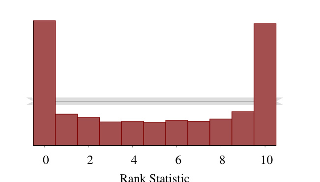
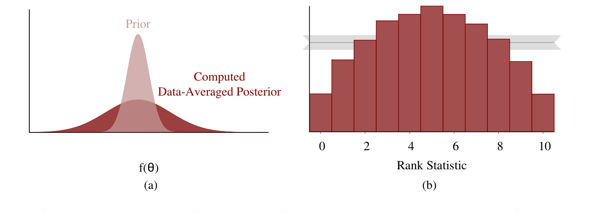
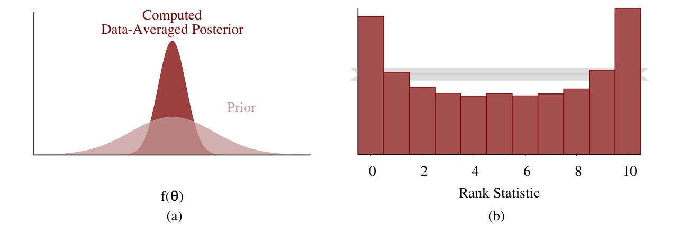
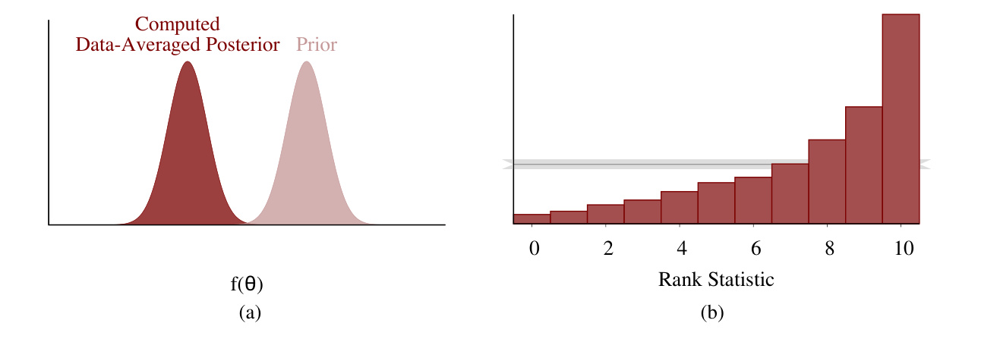

[← 返回 README](../README.md)

# 4. Simulation-Based Calibration

## 📌 预览

本节是全文核心，把第 2 节的自洽恒等式落成一个可操作、可视化、且对采样器友好的流程。三步走：**(4.1)** 用 **rank 统计量**（真值 $\tilde\theta$ 在 $L$ 个后验样本中的整数名次）替代 CGR 的连续分位数——rank 天然离散，正好用离散均匀分布检验，无需连续性修正（Theorem 1 给出理论保证）；**(4.2)** 建立"rank histogram 形状 → 病因"的诊断字典：∩=过宽、∪=过窄、倾斜=有偏、两端尖峰=自相关；**(4.3)** 论证 SBC 为何是稳健贝叶斯工作流的必备一环——它能针对当前模型逐一验证，代价是要拟合 $N$ 份模拟数据（但完美并行）。

---

We can work around the discretization artifacts of Cook, Gelman and Rubin (2006) by considering a similar consistency criterion that is immediately compatible with samplingbased algorithms. In this section we introduce simulation-based calibration (SBC) based on comparing histograms of rank statistics to the discrete uniform distribution that would arise if the analysis has been correctly implemented.

SBC requires just one assumption: that we have a generative model for our data. Given such a model, we can run any given algorithm over many simulated observations and the self consistency condition (1) provides a target to verify that the algorithm is accurate over that ensemble, and hence sufficiently calibrated for the assumed model. This calibration ensures that certain one dimensional test statistics are correctly distributed under the assumed model and is similar to checking the coverage of a credible interval under the assumed model.

> 💡 **机制拆解 (Hao 批注)**: 一句话点明 SBC 的**唯一前提**——"we have a generative model for our data"。只要能正向生成数据，就能跑 SBC。它验证的是"算法在这个 ensemble 上是否准确、是否对**假设的模型**充分校准"，作者明确把它类比成"检查可信区间在假设模型下的覆盖率 (coverage)"。这条类比对我们课题是直接的桥：SBC（rank 均匀）和 coverage（区间覆盖率）是同一枚硬币两面，我们的校准协议同时用两者 + CRPS 就是在多个角度逼近同一个"假设内部校准"的目标。

Importantly, this calibration is limited exclusively to the computational aspect of our analysis. It offers no guarantee that the posterior will cover the ground truth for any single observation or that the model will be rich enough to capture the truth at all. Understanding the range of posterior behaviors for a given observation requires a more careful sensitivity analysis while validating the model assumptions themselves requires a study of predictive performance, such as posterior predictive checks (PPCs, e.g., Gelman et al. (2013), chapter 6). Where SBC uses draws from the joint prior distribution $\pi(\theta, y)$, PPCs use the posterior predictive distribution for predicting new data $\tilde{y}, \pi(\tilde{y} | y)$. We view both of these checks as a vital part of a robust Bayesian workflow.

> 💡 **本课题定位 (Hao 批注)**: **这段是我们整个课题最该引用的一段。** 作者亲口划清 SBC 的边界——"limited exclusively to the computational aspect"：SBC 只能验证**计算/算法层面在假设模型内部是否自洽**，它**不保证** (1) 后验对任何单次观测套住真值，(2) 模型本身足够丰富到能描述真相。验证"模型假设本身对不对"要靠 **PPC**（用后验预测 $\pi(\tilde y\mid y)$ 对比真实数据），而 SBC 用的是先验联合 $\pi(\theta,y)$ 的模拟数据。这正是我们"算法错误 vs 模型错误"两层结论的官方出处：**SBC 关第一层（算法自洽），PPC/真实数据 coverage 关第二层（模型 vs 现实）**。做盲逆问题报告时，SBC 通过 ≠ 我们的前向/噪声模型在真实退化下成立，这点必须写清，否则会过度声称。



*FIG 2. SBC Algorithm 2 applied to a linear regression analysis indicates no issues as the empirical rank statistics (red) are consistent with the variation expected of a uniform histogram (gray).*

> 💡 **Figure 2 批读 (Hao 批注)**: 这张图是 Figure 1 的"平反"。同一个线性回归、同一个 Stan（HMC），但改用 SBC（rank 统计量 + 恰当 thinning，Algorithm 2）：红色 rank 直方图落在灰色均匀带内，**没有**Figure 1 里两端的假尖峰。横轴从 CGR 的 "Quantile"（0–1 连续）变成 "Rank Statistic"（0–100 整数），这个坐标轴的变化就是方法论修复的可视化标志。对比 Fig 1 vs Fig 2，SBC 的价值一目了然：把一个被冤枉的正确分析还了清白。这张 uniform histogram 也是后面第 6.3 节 ADVI 失败（Figure 12）的正面对照组。

In this section we first demonstrate the expected behavior of rank statistics under a proper analysis and construct the SBC procedure to exploit this behavior. We then demonstrate how deviations from the expected behavior are interpretable and help identify the exact nature of implementation error.

---

## 4.1 Validating Consistency With Rank Statistics

> 💡 **4.1 要点预览 (Hao 批注)**: 把 CGR 的连续分位数升级成整数 rank 统计量，并证明它在正确分析下服从**离散均匀** $\{0,\dots,L\}$（Theorem 1）。核心数据流：先验采 $\tilde\theta$ → 似然采 $\tilde y$ → 后验采 $\{\theta_1,\dots,\theta_L\}$ → 数 $\tilde\theta$ 的名次 = rank。

Consider the sequence of samples from the Bayesian joint distribution and resulting posteriors,



The relationship (1) implies that the prior sample, $\tilde{\theta}$, and an exact posterior sample, $\{\theta_1, \dots, \theta_L\}$, will be distributed according to the the same distribution. Consequently, for any one-dimensional random variable, $f : \Theta \to \mathbb{R}$, the rank statistic of the prior sample relative to the posterior sample,



will be uniformly distributed across the integers $[0, L]$

> 💡 **公式批读 (Hao 批注)**: 这是 SBC 的操作定义。公式 (2) 是数据流三步：$\tilde\theta\sim\pi(\theta)$（从先验采真值）、$\tilde y\sim\pi(y\mid\tilde\theta)$（从似然造数据）、$\{\theta_1,\dots,\theta_L\}\sim\pi(\theta\mid\tilde y)$（待测采样器产出后验样本）。由公式 (1)，$\tilde\theta$ 和每个 $\theta_l$ **同分布**。于是对任意一维函数 $f$，rank 统计量 $r=\sum_{l=1}^{L}\mathbb{I}[f(\theta_l)\lt f(\tilde\theta)]\in[0,L]$——即"有多少个后验样本小于真值"，也就是真值在 $L$ 个后验样本里的**整数名次**——服从**离散均匀** $\{0,\dots,L\}$。关键洞察：rank 从定义上就是整数，天然匹配离散均匀检验，彻底绕开 CGR 的连续性修正。这里的 $f$ 是一维"检验量"的选择自由度——对我们高维图像后验，$f$ 就是 ROI 均值、边缘位置、高频能量这类可解释标量，把百万维后验压成能查的一维 rank。

THEOREM 1. Let $\tilde{\theta} \sim \pi(\theta), \tilde{y} \sim \pi(y \mid \tilde{\theta})$, and $\{\theta_1, ..., \theta_L\} \sim \pi(\theta \mid \tilde{y})$ for any joint distribution $\pi(y, \theta)$. The rank statistic of any one-dimensional random variable over θ is uniformly distributed over the integers $[0, L]$

The proof is given in Appendix B.

> 💡 **机制拆解 (Hao 批注)**: Theorem 1 是 SBC 的理论地基——"for **any** joint distribution"，即**模型无关**。它保证：只要 (a) $\tilde\theta$ 从先验采、(b) 后验样本从**同一个**模型的真后验独立采，则任意一维量的 rank 严格离散均匀。这条定理的两个隐含前提（独立采样 + 生成模型与推断模型一致）恰恰对应 SBC 能抓的两类错误：**破坏独立性 → 自相关 spike（第 5.1 节）；破坏一致性 → 先验/几何/近似导致的非均匀（第 6 节）**。证明见 Appendix B（用 order statistic 的经典积分 + 换元）。

There are many ways of testing the uniformity of the rank statistics, but the SBC procedure, outlined in Algorithm 1, exploits a histogram of rank statistics for a given random variable to enable visual inspection of uniformity (Figure 3). We first sample N draws from the Bayesian joint distribution. For each replicated generated dataset we then sample L exact draws from the posterior distribution and compute the corresponding rank statistic. We then bin the L rank statistics in a histogram spanning the $L + 1$ possible values, $\{0, \ldots, L\}$. If only correlated posteriors samples can be drawn then the procedure can be modified as discussed in Section 5.1.

> 💡 **机制拆解 (Hao 批注)**: 这里给出完整数据流循环——外层 $N$ 次重复（每次一份新的 ground truth + 数据），内层每份数据采 $L$ 个后验样本、算 1 个 rank，把 $N$ 个 rank 丢进跨 $\{0,\dots,L\}$ 的 histogram。注意区分：$L$ 决定单次 rank 的分辨率（histogram 有多少 bin），$N$ 决定统计功效（每个 bin 有多少计数）。第 6 节实验用 $L=100$、$N=10{,}000$。若只能采相关样本（MCMC），改用 Algorithm 2 先 thinning。

```latex
Algorithm 1 SBC generates a histogram from an ensemble of rank statistics of prior samples
relative to corresponding posterior samples. Any deviation from uniformity of this histogram
indicates that the posterior samples are inconsistent with the prior samples. For a multidimen
sional problem the procedure is repeated for each parameter or quantity of interest to give
multiple histograms.
Initialize a histogram with bins centered around $0 , \ldots , L .$
for n in N do
Draw a prior sample, $\tilde { \theta } \sim \pi ( \theta )$
Draw a simulated data set, $\dot { y } \sim \pi ( y | \tilde { \theta } )$
Draw posterior samples $\{ \theta _ { 1 } , . . . , \theta _ { L } \} \sim \pi ( \theta \mid \tilde { y } )$
for each one-dimensional random variable, f do
Compute the rank statistic $r ( \{ f ( \theta _ { 1 } ) , \cdot \cdot \cdot , \bar { f } ( \theta _ { L } ) \} , f ( \tilde { \theta } ) )$ as defined in (4.1)
Increment the histogram with $r ( \{ f ( \theta _ { 1 } ) , \dots , f ( \theta _ { L } ) \} , | f ( \tilde { \theta } ) )$
Analyze the histogram for uniformity.
```

> 💡 **Algorithm 1 批读 (Hao 批注)**: 伪代码把数据流钉死。注意最后两句：多维问题**对每个参数/感兴趣量各画一张 histogram**——SBC 是逐一维检验，没有联合校准（这正是第 7 节承认的局限，也是我们课题里"多维 quantity of interest"需要额外手段的原因）。对我们联合估计 $(x,\varphi,\sigma)$：$\varphi$、$\sigma$ 这些低维参数可以直接每维一张 rank histogram；高维图像 $x$ 则需先用 $f$ 投影成 ROI 均值/边缘位置/高频能量等标量再查。这一循环"embarrassingly parallel"——$N$ 份拟合互相独立，可直接铺到集群。

In order to help identify deviations, each histogram is complemented with a gray band indicating 99% of the variation expected from a uniform histogram. Formally, the vertical extent of the band extends from the 0.005 percentile to the 0.995 percentile of the Binomial $(N, (L + 1)^{-1})$ distribution so that under uniformity we expect that, on average, the counts in only one bin in a hundred will deviate outside this band.

> 💡 **公式批读 (Hao 批注)**: 灰带的来历要讲清——若 rank 真均匀，每个 bin 的计数服从 Binomial$(N,(L+1)^{-1})$（$N$ 次试验、落入某 bin 概率 $1/(L+1)$）。灰带取该二项分布的 0.5% 到 99.5% 分位，覆盖 99% 的自然波动。所以"落在灰带内"= 计数与均匀假设相容；"冲出灰带"才算显著偏离。这条灰带是我们读所有 rank histogram 的**判读基准线**：不是零波动就叫均匀，而是波动落在这条二项带内。第 6.4 节 INLA 例子会展示灰带**太宽**（$N$ 小）时 histogram 会漏掉真实偏离，需转投 ECDF。

In complex problems computational resources often limit the number of replications, N, and hence the sensitivity of the resulting SBC histogram. In order to reduce the noise from small replications it can be beneficial to uniformly bin the histogram, for example by pairing neighboring ranks together into a single bin to give $B = L / 2$ total bins. Our experiments have shown that keeping $N / B \approx 20$ lead to a good trade-off between the expressiveness of the binned histogram and the necessary variance reduction. Choosing $L + 1$ to be divisible by a large power of 2 makes this re-binning easier; for example, instead of generating 1000 draws in a problem with known computational limitations, one could sample $1024 - 1 = 1023$ draws from the posterior distributions.

> 💡 **消融解读 (Hao 批注)**: 实操经验值——**每 bin 平均计数 $N/B\approx20$** 是表达力和降噪的甜点。$B$ 太大（bin 太细）每 bin 计数太少、噪声淹没信号；$B$ 太小（bin 太粗）看不出形状。技巧：取 $L+1$ 为 2 的大幂次（如 $1023+1=1024$）方便相邻 rank 合并 rebin。对我们计算昂贵的盲逆问题（每份数据都要跑一次完整联合采样，$N$ 必然受限），这条 $N/B\approx20$ 的经验直接给出预算分配：先定得起的 $N$，再反推 bin 数 $B=N/20$。

Regardless of the binning, however, it will be difficult to identify sufficiently small deviations in the SBC histogram and it can be useful to consider alternative visualizations of the rank statistics. We consider this Section 5.2.

---

## 4.2 Interpreting SBC

> 💡 **4.2 要点预览 (Hao 批注)**: 本小节是 SBC 的"诊断字典"——教你从 rank histogram 的**形状**反推病因。这是 SBC 相对所有前人方法（只给通过/不通过）的独门价值。四种典型形状：均匀（Fig 3，健康）、两端尖峰（Fig 4，自相关）、∩ 形（Fig 5，后验过宽）、∪ 形（Fig 6，后验过窄）、倾斜（Fig 7，后验有偏）。

What makes the SBC procedure particularly useful is that the deviations from uniformity in the SBC histogram can indicate how the computed posteriors are incorrect. We follow an observation from the forecast calibration literature (Anderson, 1996; Hamill, 2001), which suggests that the way the rank histogram deviates from uniformity can indicate bias or miscalibration of the computed posterior distributions.

> 💡 **机制拆解 (Hao 批注)**: 血统交代——这套"rank histogram 形状诊断"直接借自**集合天气预报**的 rank histogram / Talagrand diagram 文献（Anderson 1996、Hamill 2001）。气象学家早就用它判断集合预报是不是"欠离散/过离散/有偏"。Talts 等把它移植到贝叶斯后验校准。这条血缘对我们有用：CRPS 也是气象概率预报评分出身，所以我们课题用 SBC + coverage + CRPS 其实是把整套气象校准工具箱搬到盲逆问题上。

A histogram without any appreciable deviations is shown in Figure 3. The histogram of rank statistics is consistent with the expected uniform behavior, here shown with the 99% interval in light gray and the median in dark gray.



*FIG 3. Uniformly distributed rank statistics are consistent with the ranks being computed from independent samples from the exact posterior of a correctly specified model.*

> 💡 **Figure 3 批读 (Hao 批注)**: 这是"健康基线"——所有 bin 高度都落在灰带内、无系统性起伏。它对应 Theorem 1 的理想情形：**独立**后验样本 + **正确指定**的模型。记住这张脸，后面所有病态形状都是相对它的偏离。注意这里 $L$ 较小（横轴 0–10），是示意图；真实实验用 $L=100$。

Figure 4 demonstrates the deviation from uniformity exhibited by correlated posterior samples. The correlation between the posterior samples causes them to cluster relative to the proceeding prior sample, biasing the ranks to extremely small or large values. The similarity to Figure 1 is no coincidence. We describe how to process correlated posterior samples generated from Markov chain Monte Carlo algorithms in Section 5.1.



*FIG 4. The spikes at the boundaries of the SBC histogram indicate that posterior samples possess non-negligible autocorrelation.*

> 💡 **Figure 4 批读 (Hao 批注)**: **两端尖峰 = 自相关**。机制：MCMC 后验样本互相聚集（不独立），相对真值 $\tilde\theta$ 一起偏小或一起偏大，导致 rank 被推向极端 0 或 $L$。"与 Figure 1 相似绝非巧合"——第 3 节 CGR 那张假阳性图的两端尖峰，本质就是这里的自相关病，只是 CGR 没有对应的解药，而 SBC 用 thinning（第 5.1 节）能把它压掉。**判读要点**：看到两端尖峰先别急着说采样器有偏，先怀疑是自相关没 thin 干净——这是自相关和真实 miscalibration 的关键区分。第 6.2 节 Figure 11(b) 会给一个真实的两端尖峰实例。

Next, consider a computational algorithm that produces, on average, posteriors that are overdispersed relative to the true posterior. When averaged over the Bayesian joint distribution this results in a data-averaged posterior distribution (1) that is overdispersed relative to the prior distribution (Figure 5a), and hence rank statistics that are biased towards the extremes that manifests as a characteristic ∩-shaped histogram (Figure 5b).



*FIG 5. A symmetric, ∩-shaped distribution indicates that the computed data-averaged posterior distribution (dark red) is overdispersed relative to the prior distribution (light red). This implies that on average the computed posterior will be wider than the true posterior.*

> 💡 **Figure 5 批读 (Hao 批注)**: **∩ 形（中间高两边低）= 后验过宽 (overdispersed)**。左图 (a) 给因：计算出的数据平均后验（深红）比先验（浅红）**更胖**。右图 (b) 给果：后验太宽 → 真值 $\tilde\theta$ 经常落在后验样本的**中间**位置 → rank 集中在中段 → ∩ 形。直觉：后验过宽意味着它把太多概率质量摊到远处，真值反而显得"居中"。对我们课题这是高频误诊——若联合采样器对 $\varphi$/$\sigma$ 的不确定性估计过大（后验过宽），会给出假的"我很不确定所以我很安全"，SBC 的 ∩ 形能当场揭穿。**注意别把 Fig 5 和 Fig 6 记反**：∩=过宽（真值居中），∪=过窄（真值出界）。

Conversely, an algorithm that computes posteriors that are, on average, under-dispersed relative to the true posterior produces a histogram of rank statistics with a characteristic ∪ shape (Figure 6).



*FIG 6. A symmetric ∪ shape indicates that the computed data-averaged posterior distribution (dark red) is underdispersed relative to the prior distribution (light red). This implies that on average the computed posterior will be narrower than the true posterior.*

> 💡 **Figure 6 批读 (Hao 批注)**: **∪ 形（两边高中间低）= 后验过窄 (underdispersed)**。左 (a)：数据平均后验（深红）比先验（浅红）**更瘦、更尖**。右 (b)：后验太窄 → 真值经常落在后验样本**之外**（比所有样本都小或都大）→ rank 堆在两端 0 和 $L$ → ∪ 形。这是最危险的 miscalibration——**过度自信**：后验声称精度很高，实际却系统性套不住真值。对我们盲逆问题，∪ 形是红灯：说明联合后验对 $(x,\varphi,\sigma)$ 的不确定性被低估，coverage 会低于名义值。第 6.1 节先验写错、第 6.3 节 ADVI 都产生这类"过窄"病。**∪ 形和 Fig 4 的自相关尖峰长得像**——区别在自相关的尖峰能被 thinning 消除，真·过窄不能。

Finally, we might have an algorithm that produces posteriors that are biased above or below the true posterior. This bias results in a data-averaged posterior distribution biased in the same direction relative to the prior distribution (Figure 7a) and rank statistics that are biased in the opposite direction (Figure 7b). For example, posterior samples biased to smaller values results in higher rank statistics, where as posterior samples biased to larger values results in lower rank statistics.



*FIG 7. Asymmetry in the rank histogram indicates that the computed data-averaged posterior distribution (dark red) will be biased in the opposite direction relative to the prior distribution (light red). This implies that on average the computed posterior will be biased in the same opposite direction.*

> 💡 **Figure 7 批读 (Hao 批注)**: **倾斜（单调升/降）= 后验有偏 (biased)**，且**方向相反**。左 (a)：后验（深红）整体偏离先验（浅红）某方向。右 (b)：rank 直方图单调倾斜，方向与后验偏移**相反**——记法：后验样本系统性**偏小** → 真值显得偏大 → 更多后验样本小于真值 → **高 rank** 堆积（直方图右高）；后验偏大 → 低 rank 堆积（左高）。这个"反向"关系是判读易错点，务必记牢：直方图往哪边堆，后验就往**反**方向偏。第 6.2 节 Figure 10（centered 8 schools，$\tau$ 后验偏大 → rank 偏低）和第 6.3 节 Figure 12（ADVI，$\beta$ 后验偏小 → rank 偏高，堆在左端）都是这类倾斜的真实实例。

A misbehaving analysis can in general manifest many of these deviations at once. Because each deviation is relatively distinct from the others, however, in practice the systematic deviations are readily separated into the different behaviors if they are large enough.

> 💡 **机制拆解 (Hao 批注)**: 现实中一个坏采样器可能**同时**过宽 + 有偏 + 自相关，直方图是几种形状的叠加。但因为四种基本形状（均匀/尖峰/∩∪/倾斜）足够正交，只要偏离够大就能拆开读。这也是为什么第 7 节说全局 $\chi^2$ 检验反而**不好用**——$\chi^2$ 只看"是否偏离"却丢掉了形状信息，而形状恰恰是 SBC 最值钱的诊断维度。

---

## 4.3 Simulation-Based Calibration Plays a Vital Role in a Robust Bayesian Workflow

> 💡 **4.3 要点预览 (Hao 批注)**: 论证 SBC 在工作流里不可替代——它是少数能检验"计算方法选择"这一常被忽视环节的工具；能针对当前模型自适应验证；靠选 $f$ 做定向检验。代价是贵（要拟合 $N$ 份数据），但完美并行。

SBC is one of the few tools for evaluating the critical but frequently unexamined choice of computational method made in any Bayesian analysis. We have already argued that performance on a single simulated observation is, at best, a blunt instrument. Moreover, while most theoretical results only provide asymptotic comfort, SBC adapts to the specific model design under consideration.

> 💡 **机制拆解 (Hao 批注)**: 两个卖点。(1) SBC 检验的是"计算方法的选择"——这是每次分析都要做、却几乎从不验证的决定（你凭什么信 NUTS/ADVI/INLA 对你这个模型算得准？）。(2) "adapts to the specific model design"——多数理论保证只是渐近安慰（$N\to\infty$ 才成立），而 SBC 直接针对**你手上这套具体模型**给出有限样本诊断。这对盲逆问题尤其重要：我们的联合后验几何随 $\varphi$/$\sigma$ 剧烈变化，没有通用理论保证采样器处处校准，只能逐配置 SBC。

Furthermore, because SBC validates accuracy through one-dimensional random variables we can use carefully chosen random variables to make targeted assessments of an analysis based on our inferential needs and priorities. As these needs and priorities change we can run SBC again to verify the analysis anew.

> 💡 **本课题定位 (Hao 批注)**: **"carefully chosen random variables" 是我们把 SBC 用到高维图像上的钥匙。** SBC 通过一维 $f$ 检验，所以可以**按推断需求定制** $f$。对盲逆问题：若我们关心某个 ROI 的平均亮度，就用 $f=$ ROI 均值；关心结构定位就用 $f=$ 边缘/关键点位置；关心纹理保真就用 $f=$ 高频能量。每个 $f$ 一张 rank histogram，定向检验"后验在这个可解释量上是否校准"。需求变了（换 ROI、换关心的物理量）重跑即可。这把"百万维图像后验没法直接 SBC"的难题化解成"选一组有意义的标量投影"。

The downside of using SBC in practice is that it is expensive; instead of fitting a single observation we have to fit N simulated observations before even considering the measured data. These fits, however, are embarrassingly parallel, which makes it possible to leverage access to computational resources through multicore personal computers, computing clusters, and cloud computing. For example, all of the examples in Section 6 were run on clusters and took, at most, a few hours.

The procedure can be sped up further by reducing the number of independent draws needed from the posterior at the cost of losing some sensitivity. Even a few simulations are useful to catch gross problems in an analysis.

> 💡 **消融解读 (Hao 批注)**: 成本诚实交代——SBC 要拟合 $N$ 份模拟数据（第 6 节用到 $N=10{,}000$），比拟合单份观测贵 $N$ 倍。但 $N$ 份互相独立、**embarrassingly parallel**，铺到集群几小时能跑完。可用"减少 $L$/减少 $N$"换速度、损灵敏度；哪怕几十份模拟也能抓出**大**问题（gross problems）。对我们计算极贵的盲逆联合采样，实操策略：先用小 $N$ 快速筛掉离谱 bug，再对可疑配置加大 $N$ 做精细校准。

> 💡 **Section 总结 (Hao 批注)**:
> - **关键变量**: $\tilde\theta$（先验采的真值）、$\{\theta_l\}_{l=1}^L$（后验样本）、rank $r=\sum\mathbb{I}[f(\theta_l)\lt f(\tilde\theta)]$、$f$（一维检验量）、$N$（重复数）、$L$（后验样本数/分辨率）。
> - **核心洞察**: rank 天然离散 → 用离散均匀检验，修好 CGR 的连续化 artifact（Theorem 1 保证任意模型下均匀）。
> - **诊断字典**: 均匀=健康；两端尖峰=自相关；∩=后验过宽（真值居中）；∪=后验过窄（真值出界，过度自信）；倾斜=后验有偏（方向与直方图堆积**相反**）。
> - **判读基准**: 灰带 = Binomial$(N,(L+1)^{-1})$ 的 99% 区间；落带内=相容，冲出=显著偏离。
> - **可追问点**: 自相关尖峰和真·过窄 ∪ 形怎么区分？（→ thinning 能消掉的是自相关，第 5.1 节）；histogram 不够灵敏怎么办？（→ ECDF，第 5.2 节）。
