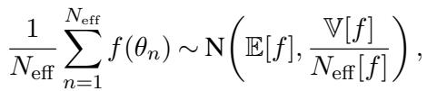
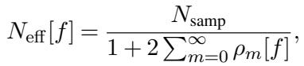
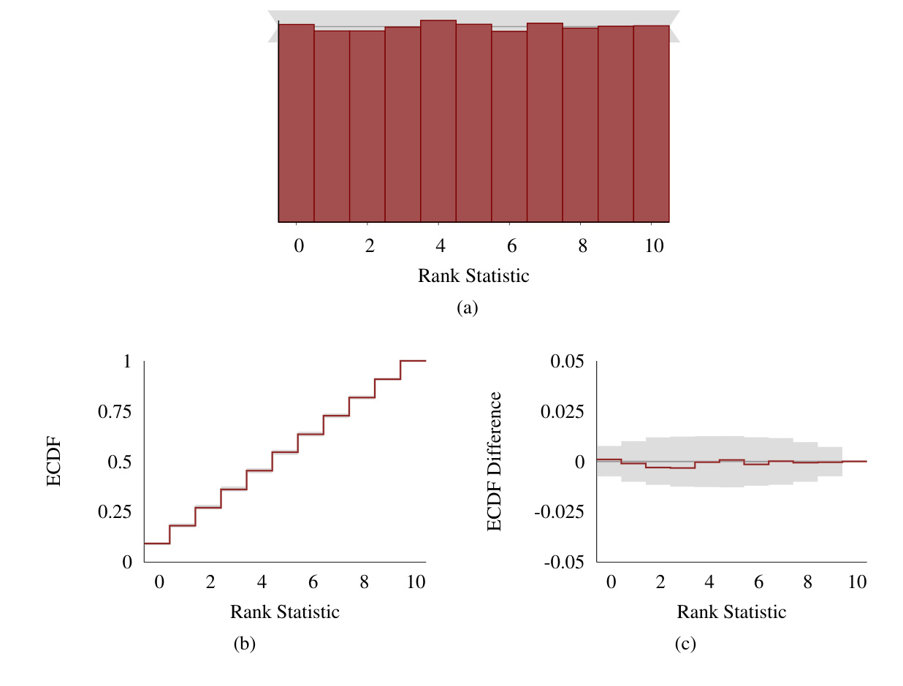

[← 返回 README](../README.md)

# 5. Extending Simulation-Based Calibration

## 📌 预览

理想 SBC 要求"独立"后验样本，但两个现实场景会破坏它：**(5.1)** MCMC 产出的样本天生**自相关**，会伪造出 Figure 4 式的两端尖峰——解药是按有效样本量 (effective sample size) **thinning**，把相关样本稀释到近似独立（Algorithm 2）；**(5.2)** 当偏离**很小**时，histogram 分辨率不够——解药是配合 **ECDF**（经验累积分布函数）及其"减去均匀基线"的差值图，把低/高 rank 处的小偏离放大。

---

SBC provides a straightforward procedure for validating simulation-based algorithms applied to Bayesian analyses, but the procedure can be limited in a few circumstances. In this section we discuss some small modifications that allow SBC to remain useful in some common practical circumstances.

---

## 5.1 Mitigating the Effect of Autocorrelation

> 💡 **5.1 要点预览 (Hao 批注)**: 解决 MCMC 自相关污染 rank histogram 的问题。核心手段：用有效样本量 $N_{\text{eff}}$ 估计自相关强度，按 $\lceil N/N_{\text{eff}}\rceil$ thinning，得到近似独立的 $L$ 个样本再算 rank（Algorithm 2）。这是让 SBC 能用在 HMC/NUTS 等主流采样器上的关键补丁。

As we saw in Section 4.2, SBC histograms will deviate from uniformity if the posterior samples are dependent, making it difficult to identify any bias in the samples. Unfortunately this limits the utility of the ideal SBC procedure when applied to Markov chain Monte Carlo (MCMC) algorithms. Given the popularity of these algorithms in practice, and the consequent need for validation schemes, we turn now to ameliorating the effects of autocorrelation with an appropriate thinning scheme.

> 💡 **问题动机 (Hao 批注)**: Theorem 1 的前提是后验样本**独立**。MCMC 违反这一前提——相邻样本高度相关，导致 Fig 4 式两端尖峰，把真实的 bias 信号淹没。而 MCMC 又是最主流的采样器，所以必须处理。这一节本质是在恢复 Theorem 1 的"独立"前提。对我们课题：如果用 Langevin/HMC 类算法做联合后验采样，rank histogram 上的两端尖峰要**先归因于自相关**（试 thinning），thin 干净后残留的偏离才算真校准问题。

Under certain ergodicity conditions, Markov chain Monte Carlo estimators achieve a central limit theorem,



where $\mathbb{E}[f]$ is the posterior expectation of a function $f, \mathbb{V}[f]$ is the variance of $f$, and $N_{\mathrm{eff}}[f]$ is the effective sample size for $f$,



with $\rho_m[f]$ the lag-m autocorrelation of $f$, which we estimate from the realized Markov chain (Gelman et al., 2013, Ch. 11). In words, $N_{\mathrm{samp}}$ correlated samples contains roughly the same information as $N_{\mathrm{eff}}$ exact samples when estimating the expectation of $f$.

> 💡 **公式批读 (Hao 批注)**: 两个公式给出 thinning 的理论依据。上式是 MCMC 的中心极限定理：估计量方差是 $\mathbb{V}[f]/N_{\text{eff}}$，注意分母是**有效**样本量而非原始样本量。下式定义 $N_{\text{eff}}[f]=\frac{N_{\text{samp}}}{1+2\sum_{m}\rho_m[f]}$——原始样本被自相关 $\rho_m$ "打折"：自相关越强、$\sum\rho_m$ 越大、$N_{\text{eff}}$ 越小。直白说：$N_{\text{samp}}$ 个相关样本 ≈ $N_{\text{eff}}$ 个独立样本的信息量。thinning 的目标就是把链稀释到相邻样本近似独立，让保留下来的 $L$ 个样本真的值 $L$ 个独立样本。

This suggests that thinning a Markov chain by keeping only every $T$ states so that $2\sum_{m=T}^{\infty}\rho_m[f] \lt \epsilon$ should yield a sample with negligible autocorrelation. In practice, we have observed that when $N_{\mathrm{eff}}[f] \le N$, thinning by $\lceil N / N_{\mathrm{eff}}[f] \rceil$ reduces the autocorrelation sufficiently to produce samples that are well-suited for the SBC giving us (Algorithm 2). Some MCMC algorithms, such as dynamic HMC, can produce antithetic Markov chains with $N_{\mathrm{eff}}[f] \gt N$. In such cases, we suggest first thinning by 2, which removes the negative odd lag correlations, and then thin as suggested above.

> 💡 **机制拆解 (Hao 批注)**: 实操 thinning 规则——每 $T$ 步保留一个，使残余自相关 $2\sum_{m\ge T}\rho_m\lt\epsilon$。经验值：thin 步长取 $\lceil N/N_{\text{eff}}\rceil$。一个反直觉的细节：动态 HMC（NUTS）可能产生 **antithetic** 链（$N_{\text{eff}}\gt N$，负自相关，比独立采样还高效！），此时先 thin by 2 去掉负的奇数 lag 相关，再按常规 thin。这说明 SBC 的 thinning 不是无脑降采样，而要看自相关结构。

By carefully thinning the autocorrelated samples we should be able to significantly reduce the ∪ shape demonstrated in Figure 4 and maximize the sensitivity to any remaining issues with the model or algorithm. As the rank statistic is closely related to cumulative distribution function $P(f(\theta) \leq f^*)$, we suggest computing minimum $N_{\mathrm{eff}}[P]$ with $f^*$ being empirical quantiles of $f(\theta)$ (e.g. 19 equispaced quantiles). When running the SBC procedure over multiple quantities of interest we suggest thinning the chain just once using the largest thinning value determined with the above procedure over all quantities.

> 💡 **机制拆解 (Hao 批注)**: 这段把 thinning 的收益和多量省算技巧说全。收益：thin 后能压掉 Figure 4 的自相关 ∪/尖峰，把灵敏度让给"模型或算法的真问题"。多量技巧：因为 rank 本质是 CDF $P(f(\theta)\le f^*)$ 的指示，作者建议用 $f^*$ 取 19 个等距分位、算这些指示函数的**最小** $N_{\text{eff}}[P]$ 来定 thinning，比直接用 $f$ 的 $N_{\text{eff}}$ 更贴合 rank 检验；且多个 quantity 只 thin **一次**，取所有量里最大的 thinning 值统一稀释。对我们同时查 $x$ 投影、$\varphi$、$\sigma$ 多个量：按最保守的量 thin 一次即可。

```latex
Algorithm 2 Simulation-based calibration can be applied to the correlated posterior samples
generated by a Markov chain provided that the Markov chain can be thinned to L effective
samples at each iteration.
Initialize a histogram with bins centered around $0 , \ldots , L .$
for n in N do
draw a prior sample $\tilde { \theta } \sim \pi ( \theta )$
draw a simulated data set $\dot { y } \sim \pi ( y | \tilde { \theta } )$
run a Markov chain for $L ^ { \prime }$ iterations to generate the correlated posterior samples,
$\{ \theta _ { 1 } , \dots , \theta _ { L ^ { \prime } } \} \sim \pi ( \theta \mid \tilde { y } )$
compute the effective sample size, $N _ { \mathrm { e f f } } [ f ]$ of $\big \{ \theta _ { 1 } , \dots , \theta _ { L ^ { \prime } } \big \}$ for the function $f$
if $\hat { N } _ { \mathrm { e f f } } [ f ] < L$ then
rerun the Markov for $L ^ { \prime } \cdot L / N _ { \mathrm { e f f } } [ f ]$ iterations
uniformly thin the correlated sample to L states and truncate any leftover draws at L
compute the rank statistic $r ( \{ f ( \bar { \theta _ { 1 } } ) , \dots , f ( \theta _ { L } ) \} , f ( \tilde { \theta } ) )$ as defined in (4.1)
increment the histogram with $r ( \{ f ( \theta _ { 1 } ) , \dots , f ( \theta _ { L } ) \} , f ( \tilde { \theta } ) )$
Analyze the histogram for uniformity.
```

> 💡 **Algorithm 2 批读 (Hao 批注)**: 相比 Algorithm 1，多了三步自适应 thinning：(1) 先跑 $L'$ 步拿相关样本；(2) 估 $N_{\text{eff}}[f]$；(3) 若 $N_{\text{eff}}\lt L$（有效样本不够），把链**重跑**到 $L'\cdot L/N_{\text{eff}}$ 步，再均匀 thin 到 $L$ 个。代价明显——为了拿 $L=100$ 个**有效**样本，实际要跑远多于 100 步的链，$N_{\text{eff}}/$步 越低越贵。这也是第 6.2 节 centered 参数化那里作者宁愿用 Algorithm 1（不 thin）的原因：centered 几何太差，thin 到 $L=100$ 有效样本代价不可承受，而它的 bias 本来就大到盖过自相关。

Although some autocorrelation will remain in a sample that has been thinned by effective sample size, our experience has been that this strategy is sufficient to remove the autocorrelation artifacts from the SBC histogram. If desired, more conservative thinning strategies such as the truncation rules of Geyer (1992) can remove autocorrelation completely from the sample. A sample thinned with these rules is typically much smaller than the sample achieved by thinning based on the effective sample size, and we have not seen any significant benefit for SBC from the increased computation time needed for these more elaborate thinning methods to date.

Deviations that cannot be mitigated by thinning provide strong evidence that the Markov chain Monte Carlo estimators do not follow a central limit theorem and the Markov chains are not adequately exploring the target parameter space. This is particularly useful given that establishing central limit theorems for particular Markov chains and particular target distributions is a notoriously challenging problem even in relatively simple circumstances.

> 💡 **机制拆解 (Hao 批注)**: 这段给出一个极有价值的**副产品诊断**——"thin 也消不掉的偏离"本身就是强证据，说明该 MCMC **不满足中心极限定理**、链没有充分探索目标分布。这把 SBC 从"校验采样精度"升格为"检测采样器根本性失效"的工具。对盲逆问题：如果我们的联合采样器在某组 $\varphi$ 下无论怎么 thin rank histogram 都畸形，那不是 thinning 不够，而是后验几何（如多模态、funnel）让链根本走不动——这是要换参数化或换采样器的信号，正对应第 6.2 节 centered vs non-centered 的教训。

---

## 5.2 Simulation-Based Calibration for Small Deviations

> 💡 **5.2 要点预览 (Hao 批注)**: histogram 对**小**偏离不敏感，尤其在低/高 rank 端。解法：配合 ECDF（经验累积分布函数）及其"减去均匀期望"的差值图，把小偏离放大。这一节直接服务于第 6.4 节 INLA 那种"histogram 看不出、ECDF 才现形"的微弱偏差。

The SBC histogram provides a general and interpretable means of identifying deviations from uniformity of the rank statistics and hence inaccuracies in our posterior computation, at least when the inaccuracies are large enough. For small deviations, however, the SBC histogram may not be sensitive enough for the deviations to be evident and other visualization strategies may be advantageous.

One option is to bin the SBC histogram multiple times to see if any deviation persists regardless of the binning. This approach, however, is ungainly to implement when there are many parameters and can be difficult to interpret. In particular, considering multiple histograms introduces a vulnerability to multiple testing biases.

> 💡 **消融解读 (Hao 批注)**: 第一个想法（多次 rebin 看偏离是否稳健）被作者自己否掉——参数多时不好实现，且**多重检验偏差**：看的 histogram 越多，越容易碰巧看到"显著"偏离（假阳性）。这提醒我们做多量 SBC 时要警惕 p-hacking 式误读，别把随机波动当成 bug。

Another approach is to pair the SBC histogram with the empirical cumulative distribution function (ECDF) which reduces variation at small and large ranks, making it easier to identify deviations around those values (Figure 8b). The deviation of the empirical CDF away from the expected uniform behavior is especially useful for identifying these small deviations (Figure 8c).



*FIG 8. In order to emphasize small deviations at low and large ranks we can pair the (a) SBC histogram with the corresponding (b) empirical cumulative distribution function (dark red) along with the variation expected of the empirical cumulative distribution function under uniformity. (c) Deviations are often easier to identify by subtracting the expected uniform behavior from the empirical cumulative distribution function.*

> 💡 **Figure 8 批读 (Hao 批注)**: 三联图展示"histogram → ECDF → ECDF 差值"的灵敏度升级。(a) 是常规 rank histogram（看整体形状）；(b) 是 ECDF——把 rank 累积起来，均匀分布对应一条直线（对角），ECDF 在低/高 rank 端天然方差小，更容易看出偏离；(c) 是**杀手锏**：ECDF 减去均匀期望的**差值图**，把偏离从"斜线上的小扭曲"变成"零线附近的明显起伏"，配上灰色置信带一眼看出是否越界。这里 (c) 的红线基本贴着零线在带内=健康。对照第 6.4 节 Figure 13(c)，同样的差值图会显示 INLA 在低 rank 处冲出灰带——这就是 histogram 漏掉、ECDF 差值图抓到的微弱偏差。对我们课题：当联合后验的 miscalibration 很轻微（比如 $\sigma$ 估计略有偏差），优先用 ECDF 差值图，比 histogram 灵敏得多。

More subtle deviations can be isolated by considering more particular summary statistics, such as ranks quantiles or averages. While these have the potential to identify small biases they can also be harder to interpret and not as sensitive to the systematic deviations that manifest in the SBC histogram. Identifying a robust suite of diagnostic statistics is an open area of research and at present we recommend using the SBC histogram whenever possible.

> 💡 **Section 总结 (Hao 批注)**:
> - **关键变量**: $N_{\text{eff}}[f]=N_{\text{samp}}/(1+2\sum_m\rho_m)$、thinning 步长 $\lceil N/N_{\text{eff}}\rceil$、ECDF 及其差值图。
> - **核心洞察**: SBC 理想版要独立样本；MCMC 自相关用 thinning 修（恢复 Theorem 1 前提），小偏离用 ECDF 差值图放大。
> - **副产品诊断**: thin 也消不掉的偏离 = MCMC 无中心极限定理 = 链没探索开（换参数化/采样器的信号）。
> - **可追问点**: 这两个补丁在真实算法上怎么表现？（→ 第 6.2 节 thinning 修 HMC 8 schools 的 Fig 11；第 6.4 节 ECDF 抓 INLA 微偏 Fig 13）。
