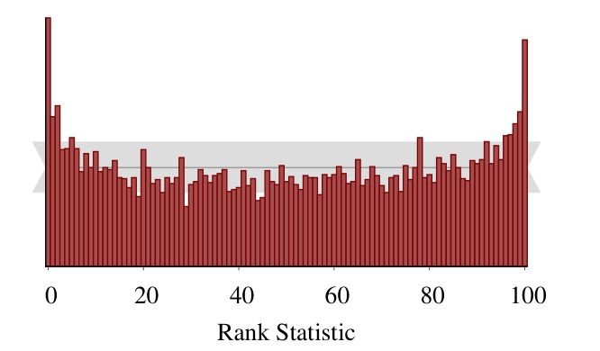
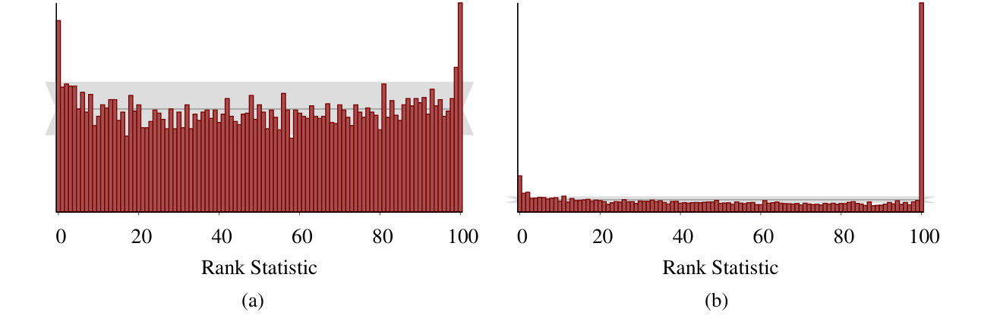
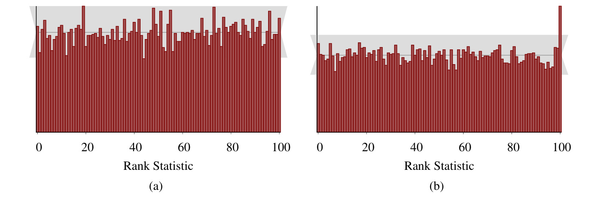
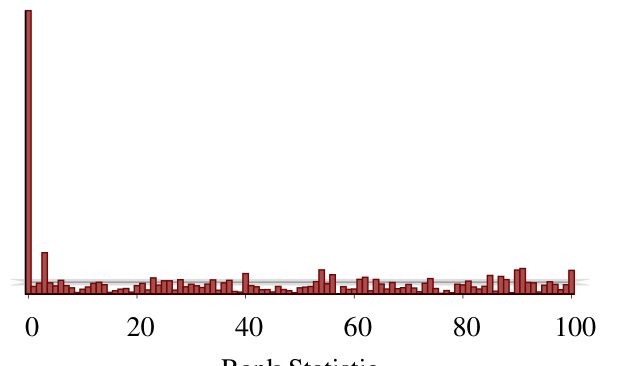
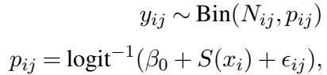
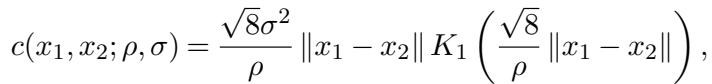
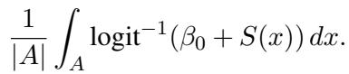
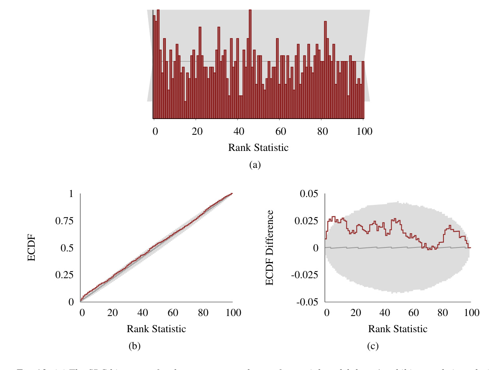

[← 返回 README](../README.md)

# 6. Experiments

## 📌 预览

四个实验构成一条**证据链**，逐一展示 SBC 如何抓出不同病因，并把第 4.2 节的"形状→病因"字典对上真实案例：
- **6.1 先验写错**（模型实现错误）→ ∪ 形（后验过窄），对应 Figure 6。
- **6.2 centered 参数化 + HMC**（算法计算错误 / 几何病态）→ 倾斜（$\tau$ 后验偏大）+ 自相关尖峰，展示 thinning 的作用。
- **6.3 ADVI 失败**（近似算法系统性欠离散）→ 强倾斜堆在低 rank（$\beta$ 后验偏小）。
- **6.4 INLA 微偏**（Laplace 近似在低计数二项数据上失灵）→ histogram 看不出、ECDF 差值图才现形。

统一设置：$L=100$（校准时 rank 服从 U[0,100] 离散均匀）；6.1–6.3 用 $N=10{,}000$，6.4 用 $N=1000$。

---

In this section we consider the application of SBC on a series of examples that demonstrates the utility of the procedure for identifying and correcting incorrectly implemented analyses. For each example we implement the SBC procedure using posterior samples $L = 100$ so that, if the algorithm is properly calibrated, then the rank statistics will follow a U [0, 100] discrete uniform distribution. The experiments in Section 6.1 through Section 6.3 used $N = 10,000$ replicated observations while the experiment in Section 6.4 used N = 1000 replicated observations.

> 💡 **证据链总览 (Hao 批注)**: 四个实验刻意覆盖 SBC 声称能抓的所有错误类型——**模型实现错误**（6.1 先验）、**采样器几何病态 + 自相关**（6.2 HMC）、**变分近似欠离散**（6.3 ADVI）、**确定性近似的微弱偏差**（6.4 INLA）。而且横跨三种完全不同的算法族（HMC/ADVI/INLA），坐实了 SBC "只要能采样就通用"的卖点。每个实验的读法：先看 rank histogram 的形状，再对照第 4.2 节字典反推病因，最后核对与已知理论病理是否一致。

---

## 6.1 Misspecified Prior

> 💡 **6.1 要点预览 (Hao 批注)**: 最干净的"模型实现错误"演示——推断用的先验和生成数据用的先验不一致。这是概率编程里极常见的手滑 bug，SBC 能一眼抓出，且形状可预测（∪ 形）。

Let's first consider the case where we build our posterior using a different prior than that which we use to generate prior samples. This is not an uncommon mistake, even when models are specified in probabilistic programming languages.

Consider the linear regression model that we used before (Listing 2 in the Appendix) but with the prior on $\beta$ modified to $\mathbf{N}(0, 1^2)$. With the prior samples still drawn according to $\mathrm{N}(0, 10^2)$, we expect that the posterior for $\beta$ will be under-dispersed relative to the prior even when the computation is exact. This should then lead to the deviation demonstrated in Figure 6 and, indeed, we see the characteristic ∪ shape in the SBC histogram for $\beta$ (Figure 9).

*FIG 9. When the data are simulated using a much wider prior than was used to fit the model, the SBC histogram for a regression parameter $\beta$ exhibits a characteristic ∪-shape.*

> 💡 **Figure 9 批读 (Hao 批注)**: 病因清清楚楚——**生成用宽先验 $N(0,10^2)$，拟合却用窄先验 $N(0,1^2)$**。后果推理链：拟合先验太窄 → 后验被人为收紧 → 相对生成先验**过窄 (under-dispersed)** → 真值 $\tilde\beta$（从宽先验采，常落在窄后验之外）→ rank 堆在两端 → **∪ 形**。注意这里计算本身**完全精确**（就是解析后验），偏离**纯粹**来自模型指定不一致——这精准演示了 SBC 抓的第二类错误（model mis-implementation），与算法无关。∪ 形与第 4.2 节 Figure 6 的预测严丝合缝，验证了诊断字典。**对我们课题的警示**：如果我们对 $\varphi$ 或 $\sigma$ 的先验在"生成 SBC 数据"和"实际推断"两处不一致（很容易在代码里写岔），SBC 会以 ∪/∩ 形当场报警——这是复现联合采样时必查的一致性。

---

## 6.2 Biased Markov chain Monte Carlo

> 💡 **6.2 要点预览 (Hao 批注)**: 展示 SBC 抓"采样器几何病态"——层级模型的 centered 参数化会制造 funnel 几何，让 HMC 系统性采偏。看点有三：(1) 倾斜形状指向 $\tau$ 后验偏大；(2) 为什么这里用 Algorithm 1 不 thin；(3) non-centered 参数化 + thinning 修好后 rank 恢复均匀（Fig 11a）vs 不 thin 的自相关尖峰（Fig 11b）。

Hierarchical models implemented with a centered parameterization (Papaspiliopoulos, Roberts and Sköld, 2007) are known to exhibit a challenging geometry that can cause MCMC algorithms to return biased posterior samples. While some algorithms, such as Hamiltonian Monte Carlo (Neal et al., 2011; Betancourt and Girolami, 2013) provide diagnostics capable of identifying this problem, these diagnostics are not available for general MCMC algorithms. Consequently the SBC procedure will be particularly useful in hierarchical models if it can identify this problem.

Here we consider a hierarchical model of the eight schools data set Rubin (1981) using a centered parameterization (Listing 3 in the Appendix). In this example the centered parameterization exhibits a classic funnel shape that contracts into a region of strong curvature around small values of $\tau$, making it difficult for most Markov chain methods to adequately explore.

> 💡 **问题动机 (Hao 批注)**: 经典案例——8 schools 层级模型的 **centered 参数化**（直接对 $\theta_j\sim N(\mu,\tau)$ 采样）会在 $\tau$ 小时形成 **funnel**（漏斗）几何：$\tau$ 越小，$\theta_j$ 被挤进越窄的曲率极强区域，MCMC 步长两难（大步跳出、小步走不动），无法充分探索小 $\tau$ 区。HMC 有自带诊断（divergences）能报警，但**通用 MCMC 没有**——所以 SBC 作为"模型无关"诊断在这里价值凸显：不管你用什么 MCMC，rank histogram 都能告诉你采样器有没有被 funnel 困住。

*FIG 10. Even without thinning the underlying Markov chains, the SBC histograms for θ[1] and τ in the 8 schools centered parameterization of Section 6.2 demonstrate that Hamiltonian Monte Carlo yields samples that are biased towards larger values of τ than were used to generate the data.*

> 💡 **Figure 10 批读 (Hao 批注)**: 两张 rank histogram（左 $\theta[1]$、右 $\tau$）。右图 $\tau$ 呈明显**倾斜**——rank 堆在**低端**。按第 4.2 节的反向规则：rank 偏低 ⟺ 后验样本系统性**偏大**。即 HMC 在 centered 参数化下算出的 $\tau$ 后验**偏大于**真值。物理解释：采样器进不去小 $\tau$ 的 funnel 尖端，被迫停留在 $\tau$ 较大的宽敞区，于是系统性高估 $\tau$。这与"funnel 困住小 $\tau$ 探索"的已知病理完全一致，SBC 独立地重现了它。注意这里 $\theta[1]$ 的偏离没 $\tau$ 那么剧烈——SBC 逐量检验的好处：能定位到**具体哪个参数**出问题（$\tau$ 是病根）。

The SBC rank histogram for τ produced from Algorithm 1 clearly demonstrates that the posterior samples from Stan's dynamic Hamiltonian Monte Carlo extension of the NUTS algorithm (Hoffman and Gelman, 2014; Betancourt, 2017) are biased below the prior samples, consistent with the known pathology (Figure 11b). Here we used Algorithm 1 instead of 2 because the algorithm's unfaithfulness is evident over the deviation caused by the autocorrelation. Moreover, the extra computation required to return $L = 100$ effective samples post-thinning is impractical here as the centered parameterization, among other failing HMC diagnostics, has a low effective sample size per sample rate.

> 💡 **机制拆解 (Hao 批注)**: 这里解释为何**故意用 Algorithm 1（不 thin）**。两个理由：(1) centered 参数化的 bias **大到盖过**自相关的干扰——倾斜信号本身就压过了两端尖峰，不 thin 也看得清；(2) centered 几何的 $N_{\text{eff}}/$步 极低，要 thin 到 $L=100$ 个**有效**样本得跑天量迭代，不划算。这是第 5.1 节"thinning 有成本"的实战权衡：当病足够重时，不 thin 反而更省且够用。这也提醒我们：SBC 的 Algorithm 1/2 选择要看 bias 和自相关的相对强弱。

The corresponding non-centered parameterization should behave much better. Indeed, the SBC histogram thinned using Algorithm 2 (Figure 11) shows no deviation from uniformity as we expected given that Hamiltonian Monte Carlo is known to yield accurate computation for this analysis. If the SBC histogram is computed without thinning (Figure 11), the autocorrelation manifests as a large spikes at $L = 100$, consistent with the discussion in Section 5.1.

*FIG 11. Once thinned (a), the SBC histogram for τ from the 8 schools non-centered parameterization in Section 6.2 show no evidence of bias. Without thinning, the SBC histogram for τ in the same model, (b), exhibits characteristic signs of autocorrelation in the posterior samples.*

> 💡 **Figure 11 批读 (Hao 批注)**: 这张对比图是第 5.1 节 thinning 的实战验收，也是全文最有教育意义的一组对照。同一个 **non-centered** 参数化（把 $\theta_j=\mu+\tau\cdot\tilde\theta_j$、$\tilde\theta_j\sim N(0,1)$ 解开 funnel），HMC 已知能算准：**(a) thin 后** rank histogram 干净均匀——证明 non-centered 修好了几何，采样器确实校准；**(b) 不 thin** 则在 $L=100$ 端冒出大尖峰——这是**纯自相关** artifact（对应第 4.2 节 Fig 4），不是真 bias。**关键教训（三层结论）**：Fig 10（centered 倾斜）= 真·采样器 bias（换参数化解决）；Fig 11b（non-centered 尖峰）= 自相关假象（thinning 解决）；Fig 11a（non-centered thin）= 真·校准。这正是我们课题要的"区分算法错误的不同子类"——同样是非均匀，倾斜和两端尖峰指向完全不同的处置（改模型 vs 改后处理），绝不能混为一谈。

---

## 6.3 ADVI can fail for simple models

> 💡 **6.3 要点预览 (Hao 批注)**: 打脸变分推断——ADVI 连最简单的线性回归都会系统性失败。看点：ADVI 无自相关（故用 Algorithm 1），rank 强烈堆在低端 → $\beta$ 后验严重偏小（欠估计不确定性 + 有偏），与 Figure 2 的 HMC 干净结果形成鲜明对照。

We next consider automatic differentiation variational inference (ADVI) applied to our linear regression model (Listing 2 in the Appendix). In particular, we run the implementation of ADVI in Stan 2.17.1 that returns exact samples from a variational approximation to the posterior. Here we use Algorithm 1 again because we know that ADVI does not produce autocorrelated posterior samples.

*FIG 12. The SBC histogram resulting from applying ADVI on the simple linear regression model indicates that the algorithm is strongly biased towards larger values of β in the true posterior.*

> 💡 **Figure 12 批读 (Hao 批注)**: 触目惊心的**极端倾斜**——rank 几乎全堆在 rank=0 附近的**第一个 bin**（还有一根冲破天际的尖峰），其余 bin 贴地。读法：rank 极低 ⟺ 后验样本系统性**偏小于**真值，即 ADVI 的 $\beta$ 后验被拉低且过窄。注意 caption 说 "biased towards larger values of β in the true posterior"——意思是真后验 $\beta$ 应更大，而 ADVI 给的偏小，导致真值几乎总大于所有 ADVI 样本 → rank 挤到最低端。因为 ADVI 无自相关（用 Algorithm 1），这个偏离**不可能**用 thinning 洗掉——它是变分近似的**结构性缺陷**（mean-field 高斯近似低估相关与方差）。**对照组是 Figure 2**：同一个线性回归、同一个 SBC，HMC 给出完美均匀，ADVI 却惨败。教训：对我们盲逆问题，若图省算用变分/摊还近似做联合后验，务必先跑 SBC——简单模型都能崩，高维强相关的 $(x,\varphi,\sigma)$ 联合后验更危险，且崩了 thinning 救不了。

Algorithm 1 immediately identifies that the variational approximation found by ADVI drastically underestimates the posterior for the slope, $\beta$ (Figure 12). Compare this with the results from Hamiltonian Monte Carlo (Figure 2), which yields a rank histogram consistent with uniformity.

---

## 6.4 INLA is slightly biased for spatial disease prevalence mapping

> 💡 **6.4 要点预览 (Hao 批注)**: 收官实验最贴近真实科研——INLA 拟合肯尼亚 HIV 空间流行率模型。看点：(1) 这是个 sophisticated 空间模型（GP + SPDE + PC 先验），SBC 照样能套；(2) 偏离**很微弱**，histogram（Fig 13a）看不出（灰带太宽），必须靠 ECDF 差值图（Fig 13c）才现形——第 5.2 节的实战；(3) 病因诊断有可解释性：低计数二项数据让 Laplace 近似失灵，且能推广到"何时该/不该用 INLA"的实践建议。

Finally let's consider a sophisticated spatial model for HIV prevalence fit to data from the 2003 Demographic Health Survey in Kenya (Corsi et al., 2012). We follow the experimental setup of (Wakefield, Simpson and Godwin, 2016) and fit the model using INLA.

The data were collected by dividing Kenya into 400 enumeration areas (EAs) and in the ith EA randomly sampling $m_i$ households, with the jth household containing $N_{ij}$ people. Both $m_i$ and $N_{ij}$ are chosen to be consistent with the Kenya DHS 2003 AIDS recode. The number of positive responses $y_{ij}$ is modeled as

where $S(\cdot)$ is a Gaussian process, $x_i$ is the centroid of the ith EA, and $\epsilon_{ij}$ are iid Gaussian error terms with standard deviation $\tau$. Following the computation reasoning of Wakefield, Simpson and Godwin (2016) we approximate $S(\cdot)$ using the stochastic partial differential equation approximation (Lindgren, Rue and Lindström, 2011) to a Gaussian process with isotropic covariance function

where $\rho$ is the distance at which the spatial correlation between points is approximately 0.1, $\sigma$ is the pointwise standard deviation, and $K_1(\cdot)$ is a modified Bessel function of the second kind.

> 💡 **公式批读 (Hao 批注)**: 模型分层看。似然层：某 EA 某户阳性数 $y_{ij}\sim\text{Bin}(N_{ij},p_{ij})$，阳性率 $p_{ij}=\text{logit}^{-1}(\beta_0+S(x_i)+\epsilon_{ij})$——基线 $\beta_0$ + 空间效应 $S$ + 户级噪声 $\epsilon$。空间层：$S(\cdot)$ 是 Matérn 型高斯过程（协方差含修正 Bessel $K_1$），$\rho$ 控空间相关尺度、$\sigma$ 控幅度，并用 SPDE 近似把连续 GP 变成可算的 GMRF。这是一个远比前几个玩具复杂的真实模型——SBC 能套上去，正说明它"只要能生成+能采样"的通用性不打折。

To complete the model, we must specify priors on $\beta_0, \rho, \sigma$, and $\tau$. We specify a $\mathrm{N}(-2.5, 1.5^2)$ prior on the logit baseline prevalence $\beta_0$. This prior is based on the national HIV prevalence across the world ranges from 0.3% to 20% (Central Intelligence Agency, 2018). We use penalized complexity priors (Simpson et al., 2017; Fuglstad et al., 2019) on the remaining parameters tuned to ensure $\operatorname{Pr}(\rho \lt 0.1) = \operatorname{Pr}(\sigma \gt 1) = \operatorname{Pr}(\tau \gt 1) = 0.1$

One of the quantities of interest for this model is the average prevalence over a subregion A of Kenya,

> 💡 **机制拆解 (Hao 批注)**: 关注量是子区域 $A$ 的**平均流行率** $\frac{1}{|A|}\int_A\text{logit}^{-1}(\beta_0+S(x))\,dx$——这是参数的**非线性泛函**，不是单个参数。这一点很重要：它正是第 4.1 节 "one-dimensional random variable $f$" 的一个真实、有物理意义的选择——$f=$ 区域平均流行率。因为是非线性变换，还得用 R-INLA 的近似后验采样器（相对新的功能）才能拿到样本做 SBC。**对我们课题的直接类比**：这就是"对高维隐场（GP $S$ / 图像 $x$）用一个可解释泛函 $f$（区域平均 / ROI 均值）投影成标量再 SBC"的范本——盲逆问题里我们查 ROI 均值、边缘位置、高频能量，方法论上和这里查"区域平均流行率"是同一招。

*FIG 13. (a) The SBC histogram for the average prevalence of a spatial model doesn't exhibit any obvious deviations, although the large span of the expected variation (gray) suggests that this test maybe too noisy to capture some potentially important discrepancies. (b) The empirical cumulative distribution function (dark red), however, shows that there is a small deviation at low ranks beyond the variation expected from a uniform distribution (gray). (c) The deviation is more evident by looking at the difference between the empirical cumulative distribution function and the stepwise-linear behavior expected of a discrete uniform distribution.*

> 💡 **Figure 13 批读 (Hao 批注)**: 三联图是第 5.2 节"histogram 不够灵敏 → 转 ECDF"的实战闭环。**(a) histogram**：所有 bin 都落在灰带内，看似健康——但注意 $N$ 只有 1000（INLA 太贵），灰带**很宽**，检验太钝，可能漏掉真偏离。**(b) ECDF**：红线在低 rank 处已微微溢出灰带。**(c) ECDF 差值图**（减去均匀期望）：低 rank 处红线明显冲出灰色置信椭圆——**低 rank 出现频率略高于均匀预期**。按反向规则：低 rank 偏多 ⟺ 后验略偏大 / 真值偏小方向的轻微 bias。这个偏差 histogram 完全看不出、只有 ECDF 差值图抓到，完美验证第 5.2 节。**对我们课题的双重启示**：(1) $N$ 受限（昂贵采样器）时 histogram 会失灵，要靠 ECDF 差值图——盲逆问题每份数据都要跑完整联合采样，$N$ 必然小，ECDF 是默认工具；(2) 微弱 miscalibration 也可能是真问题，不能因为"落在宽灰带内"就宣布校准通过。

Wakefield, Simpson and Godwin (2016) suggested fitting this model using the R-INLA package to speed up the computation. As the quantity of interest is a non-linear transformation of a number of parameters, we need to use the R-INLA's approximate posterior sampler, which is a relatively recent feature (Seppä et al., 2019).

Figure 13a shows the SBC histogram for N = 1000 replications to which are limited given the relatively high cost to run INLA in this model. The histogram shows that all of the ranks fall within the gray bars, but the large span of the bars indicates that the visual diagnostic may be too noisy to capture some potentially important discrepancies. In our tests, we saw that it's common for deviations from a uniform distribution to be sufficiently severe that this histogram will still exhibit the signs of a poorly fitting procedure. Hence for a more finescale view of the fit we follow the recommendation in Section 5.2 and consider the ECDF (Figure 13b, c). Here we see that low ranks are seen slightly more often in the computed ranks than we would expect from a uniform distribution.

It is not surprising that INLA exhibits some bias in this example. Binomial data with low expected counts does not contain much information, which poses some problems for the Laplace approximation. Even though this feature is only present when the observed values of $y_{ij} / N_{ij}$ are close to zero, the SBC procedure is a sufficiently sensitive instrument to identify the problem. Overall, we would view INLA as a good approximation in a country like Kenya where the national prevalence is around 5.4%, while it would be inappropriate in Australia where the prevalence is 0.1% (Central Intelligence Agency, 2018). If we repeated this type of survey in a country with only 0.1% prevalence, however, then we would end up with too many zero observations for the method to be useful.

> 💡 **消融解读 (Hao 批注)**: 病因诊断有可解释性且可推广——INLA 的核心是 **Laplace 近似**（用高斯逼近后验），而**低计数二项数据**（$y_{ij}/N_{ij}$ 接近 0）信息量少、后验偏离高斯，Laplace 就失准。妙处在于 SBC 不但发现偏差，还能把它翻译成**实践边界**：肯尼亚 5.4% 流行率下 INLA 够用（够多阳性计数），但澳大利亚 0.1% 流行率下会有太多零观测、Laplace 失效、INLA 不该用。这把校准诊断升华成"方法适用性地图"。**对我们课题的镜像**：同一个采样/近似算法在不同信息量的观测下校准表现不同——比如强退化（大模糊、高噪声 $\sigma$、极少测量）时观测信息少，联合后验偏离近似假设，SBC 会现形。所以我们该像这里一样，把 SBC 结果绘成"在哪些 $\varphi$/$\sigma$/测量密度区域算法可信"的适用性地图，而不是给一个笼统的"通过/不通过"。

> 💡 **Section 总结 (Hao 批注)**:
> - **关键设置**: $L=100$（校准 → U[0,100] 离散均匀）；6.1–6.3 $N=10{,}000$，6.4 $N=1000$。
> - **证据链对形状字典**: 6.1 先验错→∪（过窄，Fig 9）；6.2 centered HMC→倾斜低 rank（$\tau$ 偏大，Fig 10）+ 自相关尖峰（Fig 11b）vs thin 后均匀（Fig 11a）；6.3 ADVI→极端低 rank 堆积（$\beta$ 偏小，Fig 12）；6.4 INLA→histogram 看不出、ECDF 差值图现形（Fig 13）。
> - **核心洞察**: SBC 跨 HMC/ADVI/INLA 三大算法族通用；能区分"真 bias（改模型/参数化）vs 自相关（thinning）"；$N$ 小时 histogram 失灵要转 ECDF；诊断可翻译成方法适用性边界。
> - **可追问点**: SBC 只能逐一维查、依赖可视化，参数多时怎么办？（→ 第 7 节局限：需自动化数值摘要 + 多元校准扩展）。
