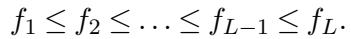
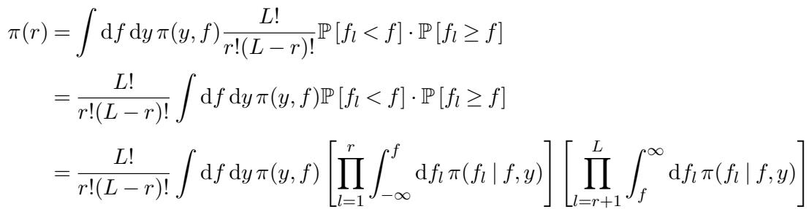
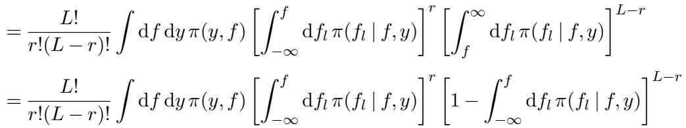
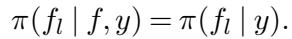
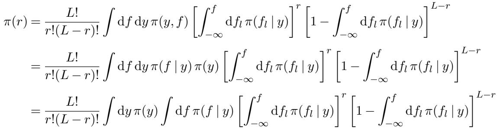
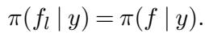
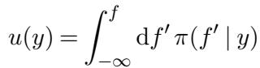
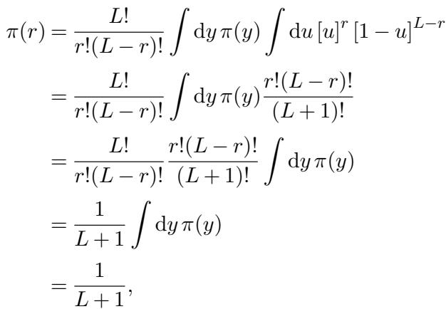

[← 返回 README](../README.md)

# Acknowledgements / References / Appendix

## 📌 预览

本页归并原文的致谢、参考文献、附录 A（Stan 代码清单：生成过程 + 三个推断模型）和附录 B（Theorem 1 的完整证明）。附录 B 是 SBC 全部理论合法性的来源——用 order statistic 的经典积分技巧证明：只要后验样本独立采自与生成模型一致的后验，任意一维量的 rank 严格服从离散均匀 $\{0,\dots,L\}$。

---

## Acknowledgements

Acknowledgements. We thank Bob Carpenter, Chris Ferro, and Mitzi Morris for their helpful comments. The plot in Figure 13(c) shares the same derivation as the inla.ks.plot function written by Finn Lindgren and found in the R-INLA package. We thank the Academy of Finland (grant 313122), Sloan Foundation (grant G-2015-13987), U.S. National Science Foundation (grant CNS-1730414), Office of Naval Research (grants N00014-15-1-2541, N00014-16-P-2039, and N00014-19-1-2204), Defense Advanced Research Projects Agency (grant DARPA BAA-16-32), Institute of Education Sciences (grant R305D190048), and Schmidt Futures for partial support of this research.

---

## References

CENTRAL INTELLIGENCE AGENCY (2018). Country comparison :: HIV/AIDS - Adult prevalence rate. World Factbook.

ANDERSON, J. L. (1996). A method for producing and evaluating probabilistic forecasts from ensemble model integrations. Journal of Climate 9 1518–1530.

BETANCOURT, M. (2017). A conceptual introduction to Hamiltonian Monte Carlo. arXiv:1701.02434.

BETANCOURT, M. J. and GIROLAMI, M. (2013). Hamiltonian Monte Carlo for hierarchical models arXiv:1701.02434.

BLOM, G. (1958). Statistical Estimates and Transformed Beta-Variables. Wiley; New York.

CARPENTER, B., GELMAN, A., HOFFMAN, M., LEE, D., GOODRICH, B., BETANCOURT, M., BRUBAKER, M., GUO, J., LI, P. and RIDDELL, A. (2017). Stan: A probabilistic programming language. Journal of Statistical Software, Articles 76 1–32.

COOK, S. (2006). BayesValidate (R package).

COOK, S. R., GELMAN, A. and RUBIN, D. B. (2006). Validation of software for Bayesian models using posterior quantiles. Journal of Computational and Graphical Statistics 15 675–692.

CORSI, D. J., NEUMAN, M., FINLAY, J. E. and SUBRAMANIAN, S. (2012). Demographic and health surveys: a profile. International Journal of Epidemiology 41 1602–1613.

FUGLSTAD, G.-A., SIMPSON, D., LINDGREN, F. and RUE, H. (2019). Constructing priors that penalize the complexity of Gaussian random fields. Journal of the American Statistical Association 114 445–452.

GELMAN, A. (2017). Correction to Cook, Gelman, and Rubin (2006). Journal of Computational and Graphical Statistics 26 940.

GELMAN, A., CARLIN, J. B., STERN, H. S., DUNSON, D. B., VEHTARI, A. and RUBIN, D. B. (2013). Bayesian Data Analysis, third edition. CRC Press.

GEWEKE, J. (2004). Getting it right: Joint distribution tests of posterior simulators. Journal of the American Statistical Assocation 98 799–804.

GEYER, C. J. (1992). Practical Markov chain Monte Carlo. Statistical Science 473–483.

GNEITING, T., STANBERRY, L. I., GRIMIT, E. P., HELD, L. and JOHNSON, N. A. (2008). Assessing probabilistic forecasts of multivariate quantities, with an application to ensemble predictions of surface winds. Test 17 211.

HAMILL, T. M. (2001). Interpretation of rank histograms for verifying ensemble forecasts. Monthly Weather Review 129 550–560.

HOFFMAN, M. D. and GELMAN, A. (2014). The no-U-turn sampler: Adaptively setting path lengths in Hamiltonian Monte Carlo. Journal of Machine Learning Research 15 1351–1381.

KUCUKELBIR, A., TRAN, D., RANGANATH, R., GELMAN, A. and BLEI, D. M. (2017). Automatic differentiation variational inference. Journal of Machine Learning Research 18 430–474.

LINDGREN, F., RUE, H. and LINDSTRÖM, J. (2011). An explicit link between Gaussian fields and Gaussian Markov random fields: The stochastic partial differential equation approach. Journal of the Royal Statistical Society: Series B (Statistical Methodology) 73 423–498.

NEAL, R. M. et al. (2011). MCMC using Hamiltonian dynamics. In Handbook of Markov Chain Monte Carlo (S. Brooks, A. Gelman, G. L. Jones and X. L. Meng, eds.) CRC Press.

PAPASPILIOPOULOS, O., ROBERTS, G. O. and SKÖLD, M. (2007). A general framework for the parametrization of hierarchical models. Statistical Science 22 59–73.

RUBIN, D. B. (1981). Estimation in parallel randomized experiments. Journal of Educational Statistics 6 377–401.

RUE, H., MARTINO, S. and CHOPIN, N. (2009). Approximate Bayesian inference for latent Gaussian models by using integrated nested Laplace approximations. Journal of the Royal Statistical Society: Series B (Statistical Methodology) 71 319–392.

RUE, H., RIEBLER, A., SØRBYE, S. H., ILLIAN, J. B., SIMPSON, D. P. and LINDGREN, F. K. (2017). Bayesian computing with INLA: A review. Annual Review of Statistics and its Application 4 395–421.

SEPPÄ, K., RUE, H., HAKULINEN, T., LÄÄRÄ, E., SILLANPÄÄ, M. J. and PITKÄNIEMI, J. (2019). Estimating multilevel regional variation in excess mortality of cancer patients using integrated nested Laplace approximation. Statistics in Medicine 38 778–791.

SIMPSON, D., RUE, H., RIEBLER, A., MARTINS, T. G., SØRBYE, S. H. et al. (2017). Penalising model component complexity: A principled, practical approach to constructing priors. Statistical Science 32 1–28.

THORARINSDOTTIR, T. L., SCHEUERER, M. and HEINZ, C. (2013). Assessing the calibration of highdimensional ensemble forecasts using rank histograms. Journal of Computational and Graphical Statistics 25 105–122.

WAKEFIELD, J., SIMPSON, D. and GODWIN, J. (2016). Comment: Getting into Space with a Weight Problem. Journal of the American Statistical Association 111 1111–1118.

---

## APPENDIX A: CODE LISTINGS

We advise the reader to keep in mind that the Stan modeling language parameterizes the normal distribution using the mean and standard deviation whereas we have used a mean and variance parameterization throughout this text.

> 💡 **代码批注 (Hao 批注)**: 一句极易踩坑的提醒——正文全程用**方差**参数化 $N(\mu,\sigma^2)$，但 Stan 代码用**标准差** $N(\mu,\sigma)$。所以正文里的 $N(0,10^2)$ 在代码里写成 `normal_rng(0, 10)`（标准差=10）。复现时若把方差直接填进 Stan 会得到错误的先验宽度——这本身就是第 6.1 节"先验写错"式 bug 的高发来源。

```c
data {
  int<lower=1> N;
  real X[N];
}

generated quantities {
  real beta;
  real alpha;
  real y[N];

  beta = normal_rng(0, 10);
  alpha = normal_rng(0, 10);

  for (n in 1:N)
    y[n] = normal_rng(X[n] * beta + alpha, 1.2);
}
```
LISTING 1. Data generating process for linear regression

> 💡 **代码批注 (Hao 批注)**: 这是 SBC 数据流的**第一环——生成过程**（对应 $\tilde\theta\sim\pi(\theta)$、$\tilde y\sim\pi(y\mid\tilde\theta)$）。`generated quantities` 块先从先验采 `beta`、`alpha`（$N(0,10)$），再造数据 `y ~ N(X*beta+alpha, 1.2)`。注意噪声标准差固定 1.2。这个 block 只负责"正向造真值 + 造数据"，不做任何推断——它定义了 SBC 的 ground truth。

```c
data {
  int<lower=1> N;
  vector[N] X;
  vector[N] y;
}

parameters {
  real beta;
  real alpha;
}

model {
  beta ~ normal(0, 10);
  alpha ~ normal(0, 10);

  y ~ normal(X * beta + alpha, 1.2);
}
```
LISTING 2. Inference model for linear regression

> 💡 **代码批注 (Hao 批注)**: 这是数据流的**第二环——推断模型**（对应 $\{\theta_l\}\sim\pi(\theta\mid\tilde y)$）。关键点：推断模型的先验 `beta ~ normal(0,10)` 必须**与 Listing 1 的生成先验一致**。第 6.1 节的 bug 就是故意把这里改成 `normal(0,1)`（窄先验）、而生成仍用 `normal(0,10)`（宽先验），制造出 ∪ 形。Listing 1 + Listing 2 配成一对，就是 SBC 的完整"生成→推断"闭环。

```c
data {
  int<lower=0> J;
  real y[J];
  real<lower=0> sigma[J];
}

parameters {
  real mu;
  real<lower=0> tau;
  real theta[J];
}

model {
  mu ~ normal(0, 5);
  tau ~ normal(0, 5);
  theta ~ normal(mu, tau);
  y ~ normal(theta, sigma);
}
```
LISTING 3. 8 schools, centered parameterization

> 💡 **代码批注 (Hao 批注)**: 第 6.2 节的**病态**参数化。`theta ~ normal(mu, tau)` 直接对 $\theta_j$ 采样——当 $\tau\to0$ 时 $\theta_j$ 被挤进极窄区间，形成 funnel，HMC 走不进小 $\tau$ 尖端，导致 $\tau$ 系统性偏大（Figure 10 的倾斜低 rank）。对比下面 Listing 4 的解法。

```c
data {
  int<lower=0> J;
  real y[J];
  real<lower=0> sigma[J];
}

parameters {
  real mu;
  real<lower=0> tau;
  real theta_tilde[J];
}

transformed parameters {
  real theta[J];
  for (j in 1:J)
    theta[j] = mu + tau * theta_tilde[j];
}

model {
  mu ~ normal(0, 5);
  tau ~ normal(0, 5);
  theta_tilde ~ normal(0, 1);
  y ~ normal(theta, sigma);
}
```
LISTING 4. 8 schools, non-centered parameterization

> 💡 **代码批注 (Hao 批注)**: 第 6.2 节的**解药**——non-centered 重参数化。关键在 `theta_tilde ~ normal(0,1)` + `theta[j] = mu + tau * theta_tilde[j]`：把 $\theta_j$ 拆成"标准正态 $\tilde\theta_j$ × 尺度 $\tau$ + 位置 $\mu$"，让采样器在与 $\tau$ **解耦**的 $\tilde\theta$ 空间里走，funnel 被拉平。结果 HMC 恢复准确（Figure 11a thin 后均匀）。**对我们课题的直接启发**：盲逆问题里 $x$ 和 $\varphi$/$\sigma$ 之间、以及 gauge 自由度也可能制造类似 funnel/强耦合几何，重参数化（把强相关变量解耦）是让联合采样器校准的关键手段之一——SBC 正好能验证重参数化前后校准是否改善。

---

## APPENDIX B: PROOF OF THEOREM 1

> 💡 **证明预览 (Hao 批注)**: 这是 SBC 全部合法性的来源。要证：$\tilde\theta\sim\pi(\theta)$、$\tilde y\sim\pi(y\mid\tilde\theta)$、$\{\theta_l\}$ **独立**采自 $\pi(\theta\mid\tilde y)$，则任意一维量的 rank 服从离散均匀 $\{0,\dots,L\}$，即 $\pi(r)=1/(L+1)$。证明技巧：把 rank=r 写成 order statistic 事件（$r$ 个样本小于 $\tilde f$、$L-r$ 个大于），用二项系数计数，再借"后验样本与真值同分布"做换元，最后 Beta 积分约掉一切模型依赖。注意标题写 Theorem 2 是 MinerU/排版笔误，即正文的 Theorem 1。

THEOREM 2. Let $\tilde{\theta} \sim \pi(\theta), \tilde{y} \sim \pi(y \mid \tilde{\theta})$, and $\{\theta_1, \dots, \theta_L\}$ sampled independently from $\pi(\theta \mid \tilde{y})$ for any joint distribution $\pi(y, \theta)$. The rank statistic of any one-dimensional random variable over θ is uniformly distributed over the integers [0, L].

PROOF. Consider the one-dimensional random variable $f : \Theta \to \mathbb{R}$ and let $\tilde{f} = f(\tilde{\theta})$ be the evaluation of the random variable with respect to the prior sample with $f_l = f(\theta_l)$ the evaluation of the random variable with respect to one draw from the posterior sample. Similarly let $\pi(f)$ and $\pi(f \mid \tilde{y})$ denote the pushforward probability density function of the prior density function and posterior density function, respectively.

Without loss of generality we can relabel the elements of the posterior sample such that they are ordered with respect to the random variable,



We can then write the probability mass function of the prior rank statistic as





> 💡 **公式批读 (Hao 批注)**: 起手把 rank=$r$ 事件写成 order statistic 概率。$\frac{L!}{r!(L-r)!}$ 是从 $L$ 个后验样本里选出 $r$ 个"小于 $\tilde f$"的组合数；$\mathbb{P}[f_l\lt f]^r$ 是这 $r$ 个都小于真值、$\mathbb{P}[f_l\ge f]^{L-r}$ 是剩下 $L-r$ 个都不小于。因为样本**独立**，联合概率就是各自的积——这一步用光了 Theorem 的"独立"前提，也解释了为什么自相关（不独立）会破坏均匀性（第 5.1 节的根源）。

Once we condition on an observation the distribution of the posterior samples is independent of the conditioning model configuration,



Consequently



> 💡 **公式批读 (Hao 批注)**: 第一个关键化简 $\pi(f_l\mid f,y)=\pi(f_l\mid y)$——一旦条件在观测 $y$ 上，后验样本 $f_l$ 就与"生成这份数据的那个真值 $f$"无关了（后验只依赖数据）。这一步把被积项里对 $f$ 的依赖从条件分布中剥离，为下一步换元铺路。

Now because the model used to simulate data and construct posterior distributions is the same we have



This allows us to consider the change of variables



which gives



> 💡 **公式批读 (Hao 批注)**: 第二个关键化简 $\pi(f_l\mid y)=\pi(f\mid y)$——**生成数据的模型和做推断的模型是同一个**，所以真值 $f$ 和后验样本 $f_l$ 服从同一个后验分布。这一步用光了 Theorem 的"一致性"前提，也正是第 6.1 节先验写错（生成≠推断）会破坏均匀性的根源。有了它就能做换元 $u(y)=\int_{-\infty}^{f}\pi(f'\mid y)\,df'$（把真值 $f$ 变成它自己在后验里的 CDF 值，$du=\pi(f\mid y)df$，$u\in[0,1]$ 均匀）。最后一串积分：内层 $\int_0^1 u^r(1-u)^{L-r}du=\frac{r!(L-r)!}{(L+1)!}$ 是 Beta 函数，恰好与前面的组合数 $\frac{L!}{r!(L-r)!}$ 相乘约成 $\frac{1}{L+1}$，外层 $\int dy\,\pi(y)=1$。得 $\pi(r)=\frac{1}{L+1}$——**与 $r$ 无关**，即离散均匀。**两个前提各司其职**：独立性→order statistic 的乘积分解；生成=推断一致性→换元成均匀 $u$。SBC 抓的两类错误正是分别破坏这两个前提。

consistent with a uniform distribution over the $L + 1$ possible ranks, as desired.

> 💡 **Section 总结 (Hao 批注)**:
> - **附录 A**: 四段 Stan 代码钉死 SBC 数据流——Listing 1（生成过程/ground truth）+ Listing 2（推断模型）配对成闭环；Listing 3（centered，funnel 病态）vs Listing 4（non-centered，解耦解药）。方差 vs 标准差参数化是复现高发坑。
> - **附录 B**: Theorem 1 的证明只靠两个前提——后验样本**独立** + 生成模型与推断模型**一致**；证明模型无关，靠 order statistic + Beta 积分。
> - **核心对应**: SBC 能抓的两类错误恰好对应破坏这两个前提——自相关破坏独立性（→thinning 修）；先验/近似/几何病态破坏一致性（→改模型/参数化/采样器）。
