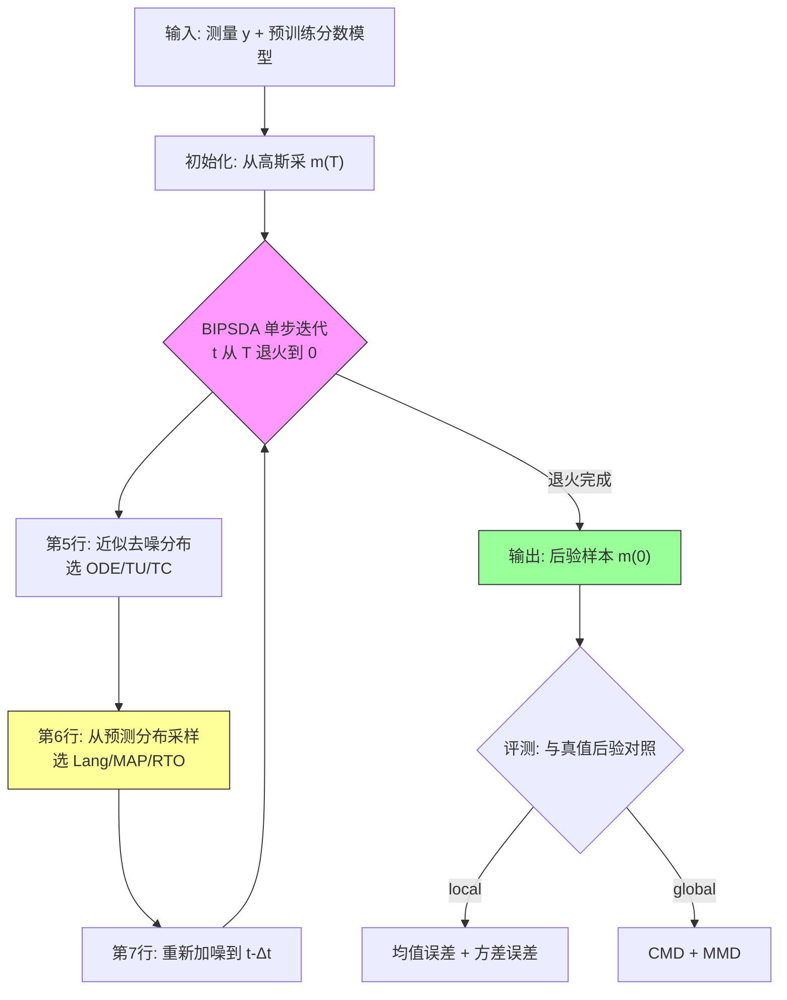

# Benchmarking Diffusion Annealing-Based Bayesian Inverse Problem Solvers

**作者**: Evan Scope Crafts, Umberto Villa（The University of Texas at Austin, Oden Institute / Dept. of Biomedical Engineering）
**类型**: arXiv preprint（面向 IEEE 期刊）| **年份**: 2025
**链接**: [arXiv 2503.03007](https://arxiv.org/abs/2503.03007) | [代码 (Zenodo)](https://doi.org/10.5281/zenodo.14908136) | [数据 (Dataverse)](https://doi.org/10.7910/DVN/0L5KGB)

> 本课题：**Blind Inverse Problems with Generative Priors（生成先验下的参数化盲逆问题）** → 支线 **posterior-calibration（后验保真度 / UQ）**。本篇（#18 Crafts & Villa）是该支线的**关键参照物**：它第一次用「后验解析可知」的 benchmark 严格检验「扩散退火采样到底给不给严格 UQ」。

---

## 一句话总结

本文构造了三个「后验密度 + 加噪先验分数双解析可知」的低维 benchmark（inpainting / X-ray CT / phase retrieval 风格），并提出统一框架 **BIPSDA**（把 DAPS、DiffPIR 抽象成「去噪分布近似 × 预测分布采样」两个正交维度的 3×3 算法网格，含原创 RTO、TC 技术），从而首次量化地证明：扩散退火采样在**单峰后验上给出可信 UQ**，在**线性多峰上依赖设计选择**，但在**非线性多峰（phase retrieval）上全员给出错误的不确定性估计**——即便先验分数解析已知（零建模误差）。

## 核心贡献

1. **BIPSDA 统一框架**：把解耦噪声退火采样抽象为两个正交插槽——去噪分布近似（ODE / TU / TC）× 预测分布采样（Lang / MAP / RTO），共 9 个算法。DAPS = Lang-ODE、DiffPIR = MAP-TU，其余 7 个为新算法。
2. **原创 RTO 采样技术**：借用 MCMC 的 randomize-then-optimize，先给去噪均值和测量各加一次噪声再求 MAP 点——兼得「MAP 的现成快速优化器（快）」与「真采样（准，线性高斯下可证明为精确采样）」，修正了 MAP 的方差系统性低估。
3. **原创引入 TC 去噪近似**：把 hijacking 语境的广义 Tweedie 协方差移植到退火语境，零超参、理论自洽，用二阶分数抓协方差相关结构（非线性问题上 analytic score 最优，但 learned score 下受限于二阶分数不可靠）。
4. **三个严格 UQ benchmark**：Gaussian mixture 先验让后验密度**和加噪先验分数都解析可知**，从而能把误差解耦为「算法固有误差（analytic score）」与「先验建模误差（learned score）」，是社区可复用的 UQ 检验尺子。
5. **系统性负面结论**：扩散退火不提供无条件严格 UQ——UQ 保真度呈「单峰强 → 线性多峰敏感 → 非线性多峰全崩」的三级台阶。

## 📖 批读导航

| Section | 内容 |
|---------|------|
| [00 - Abstract](sections/00-abstract.md) | 评测盲区母题 + 两条贡献线（benchmark + BIPSDA）+ 与本 topic 关系 |
| [01 - Introduction](sections/01-introduction.md) | 动机三段论、框架卖点、Gaussian mixture 实验设计、四指标分工 |
| [02 - Background](sections/02-background.md) | 贝叶斯逆问题、扩散 VE-SDE/ODE、hijacking 病理诊断（多峰下 noisy-likelihood 崩） |
| [03 - Methodology (BIPSDA)](sections/03-methodology.md) | 解耦退火两阶段、Algorithm 1、9 变体网格、RTO/TC/TU 公式批读、Table 1 |
| [04 - Numerical Studies](sections/04-numerical-studies.md) | 四 study 难度阶梯、前向模型、score model 训练、CMD/MMD 定义、Figure 1 |
| [05 - Results](sections/05-results.md) | Table 2-6、Figure 2-4：三采样器固有偏差、RTO-TU 综合最优、phase retrieval 全崩 |
| [06 - Discussion & Appendix A](sections/06-discussion-appendix.md) | UQ 三级台阶总判决、选型指南、三条局限、ODE=Tweedie 证明 |

## 关键数字

| 指标 | 数值 |
|------|------|
| 参数维度 $D$ | 10 |
| 先验峰数 $N_m$ | 3（权重 0.4/0.3/0.3，均值 −5/0/+5） |
| 退火步数 $N_A$ | 200 |
| score model | 6 层 MLP 宽 512，$\sigma(t)=t$，$T=10$，8 万训练样本 |
| trials / study | 100，每 trial 采 10000 样本 |
| 评测指标 | 均值误差、方差误差（local）+ CMD、MMD（global） |
| RTO-TU 低噪 inpainting 方差误差 | 0.06（Reference 下界 0.03，MAP-TU 为 0.95） |
| Lang 高噪 inpainting 方差误差 | ~44（Reference 0.22，彻底崩坏） |
| RTO-TU X-ray CT | 全指标夺冠（方差误差 0.19 vs MAP-TU 1.67） |
| phase retrieval | 全员方差误差 4~8（Reference 0.79） |
| inpainting 运行时间（10000 样本） | RTO-TU/MAP-TU ~1.2-1.4s vs Lang-TU 26.7s |

## 数据流：输入 → 中间表示 → 输出

## 优缺点与还能做什么

### 优点
- **方法论突破**：Gaussian mixture 先验让「后验 + 加噪先验分数双解析」，首次能把「算法误差」与「先验建模误差」严格解耦——这是过去在自然图像上无法做到的。
- **框架统一性**：3×3 网格把 DAPS/DiffPIR 收编，暴露 7 个新组合，RTO-TU 在单峰/线性多峰/非线性单峰上综合最优（又快又准）。
- **结论诚实且可复现**：明确指出扩散退火不给无条件严格 UQ；reference MCMC 质控严格（PSRF≈1.0006、ESS>47000），撇清「ground truth 不准」质疑。
- **实践选型清晰**：默认 RTO-TU；learned score 弃用 TC；Lang 慎用于多峰。

### 局限 / 风险
- **低维 → 高维 gap**：所有严格结论在 10 维 GM 上得出，真实图像高维、先验隐式，外推性仅靠 Supplementary 的 proof-of-principle（Fig S.5、Table S.1）背书。
- **TC 工程受限**：理论最优但需可靠二阶分数（learned score 的 Jacobian 不可用），实际部署废弃。
- **phase retrieval 全崩**：非线性多峰上无一方法给准 UQ，根源在「去噪分布高斯近似」从源头丢多峰信息。
- **learned score 数值发散**：phase retrieval 下 RTO-TU 185/百万样本发散（低密度区 score 误差）。

### 还能做什么
- 用二阶分数导数信息改进 score 训练（[55]），缓解低密度区发散。
- 改进 RTO：早期迭代 apodize 噪声扰动、或给 RTO 加 Metropolis 校正。
- 构造「先验良好刻画的大规模图像 benchmark」，把严格 UQ 评测搬到高维。
- 用这三个 benchmark 检验 BIPSDA 之外的扩散采样器（如 hijacking 类、latent diffusion 类）。

## 阅读 Q&A 记录

- **Q: 为什么非要能解析算出「加噪先验分数」？普通 benchmark 不也能给 ground-truth 后验样本吗？**
  A: 普通 benchmark 只能对照「最终采样质量」，无法回答「误差是先验没学好还是采样算法有病」。GM 先验的 $\pi_t$ 仍是 GM、分数闭式可得，于是可把学到的 score 换成真值，观察算法在零先验误差下的表现——这是本文能证明「UQ 失真是结构性问题」的唯一途径。（见 01/04 节）

- **Q: 为什么 Lang 用解析真值 score 也在多峰上崩？**
  A: 因为这是采样器的结构性缺陷而非先验建模误差。高噪 inpainting（多峰）下 Lang 把样本撒到似然低密度区、高估方差；phase retrieval 下无校正 Langevin 直接数值失稳。这直接支撑「诊断准 ≠ 修复完」。（见 05.A 节 Table 3、Figure 2）

- **Q: RTO 凭什么同时又快又准？**
  A: 它先给去噪均值和测量各加一次噪声、再求 MAP 点。这样既能用 MAP 的现成快速优化器（快），又在线性高斯似然下等价于精确采样（准）——修正了 MAP「只求众数、系统性低估峰内方差」的问题。（见 03 节 Eq. 10）

- **Q: 这篇对本 topic「诊断+修复是增量的」主张有何用？**
  A: 它提供硬证据——即便先验分数解析已知，扩散退火在非线性多峰上仍给错 UQ；单峰、线性多峰的 UQ 是靠 RTO/TC 一个个具体病因逐步修好的（超参敏感、方差低估、数值发散各有药方）。不存在一劳永逸的严格 UQ 保证，是持续增量过程。（见 06 节 Results Analysis + Limitations）

- **Q: 四个评测指标分别敏感于什么？**
  A: 均值误差 + 逐点方差误差 = local（一阶、二阶矩）；CMD（截到 5 阶中心矩）+ MMD（RKHS 距离）= global（整体分布形状、多峰结构）。MAP 变体典型特征是「均值准但方差误差大」，只看 PSNR 完全暴露不出来。（见 04.C 节）

## 📊 Citation Landscape

> Semantic Scholar API 在本次批读时段持续返回 429（限流），论文详情（citationCount/TLDR）未能拉取；以下参考文献与推荐论文数据取自成功返回的调用。

**自动摘要（基于正文归纳）**：本文提出 BIPSDA 统一框架与三个后验解析可知的 benchmark，系统评测扩散退火贝叶斯逆问题采样器的 UQ 保真度，结论是其在单峰/线性多峰上可信、在非线性多峰上失效。

### 关键参考文献（按被引量，Top，取自 references API）

**扩散模型基础**
| 被引 | 年份 | 标题 |
|------|------|------|
| 33210 | 2020 | Denoising Diffusion Probabilistic Models (DDPM) [14] |
| 12489 | 2021 | Diffusion Models Beat GANs on Image Synthesis [54] |
| 11505 | 2020 | Score-Based Generative Modeling through SDEs [15] |
| 12834 | 2020 | Denoising Diffusion Implicit Models (DDIM) [56] |
| 5778 | 2019 | Generative Modeling by Estimating Gradients of the Data Distribution [13] |
| 2272 | 2011 | A Connection Between Score Matching and Denoising Autoencoders (Vincent) [32] |

**扩散逆问题求解器（本文直接对比 / 收编对象）**
| 被引 | 年份 | 标题 |
|------|------|------|
| 1761 | 2022 | Diffusion Posterior Sampling for General Noisy Inverse Problems (DPS) [19] |
| — | 2024 | Improving Diffusion Inverse Problem Solving with Decoupled Noise Annealing (DAPS) [22] |
| — | 2023 | Denoising Diffusion Models for Plug-and-Play Image Restoration (DiffPIR) [23] |
| — | 2024 | Tweedie Moment Projected Diffusions (Boys et al, TC 技术来源) [33] |

**贝叶斯逆问题 / RTO / MCMC**
| 被引 | 年份 | 标题 |
|------|------|------|
| 6583 | 2012 | A Kernel Two-Sample Test (MMD) [28] |
| 2045 | 2010 | Inverse problems: A Bayesian perspective (Stuart) [7] |
| 1669 | 2011 | Riemann manifold Langevin and HMC methods [46] |
| — | 2014 | Randomize-then-Optimize (Bardsley et al, RTO 原始技术) [24] |

### 推荐相关论文（Recommendations API，2026 年前沿后继工作）

| 年份 | arXiv | 标题 |
|------|-------|------|
| 2026 | 2606.12710 | A Stabilized Path-Space Approach to Diffusion-Based Posterior Sampling |
| 2026 | 2605.25042 | Unbiased Diffusion Variational Inversion via Principled Posterior Matching |
| 2026 | 2606.28785 | Stochastic Optimal Control Sampling for Diffusion Inverse Problems |
| 2026 | 2606.14800 | Bridging data-driven priors via the score function for posterior sampling |
| 2026 | 2606.26592 | Latent Diffusion Posterior Sampling with Surrogate Likelihood Guidance |
| 2026 | — | Approximate Maximum a Posteriori Training of Diffusion Models for Imaging |
| 2026 | 2606.22346 | Flow Annealing Posterior Sampling for Function-Space Regression and Inversion |
| 2026 | 2605.28711 | Stage-wise Distortion-Perception Traversal in Zero-shot Inverse Problems |
| 2026 | 2606.17048 | Exact Posterior Score Estimation for Solving Linear Inverse Problems |
| 2026 | 2606.24516 | What Do Flow-Based Inverse Solvers Approximate? A Posterior-Transport view |

- **Connected Papers**: https://www.connectedpapers.com/main/2503.03007
- **Semantic Scholar**: https://www.semanticscholar.org/arxiv/2503.03007
