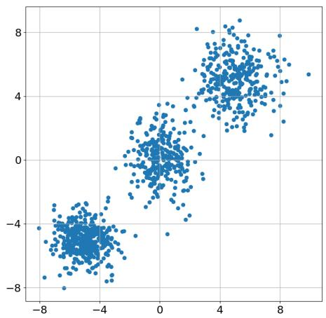

[← 返回 README](../README.md)

# IV. NUMERICAL STUDIES — 实验设置

## 📌 预览

本节交代 benchmark 的全部细节：为什么用 10 维 Gaussian mixture（3 峰）先验、四个 study（低噪 inpainting / 高噪 inpainting / X-ray CT 泊松 / phase retrieval）的前向模型与噪声、score model 怎么训（同时准备 learned 和 analytic 两套 score）、ground-truth 后验样本怎么拿（线性问题精确采样、非线性用 PyDREAM MCMC），以及四个评测指标 CMD/MMD/均值误差/方差误差的定义。

---

The performance of difusion-model-based posterior sampling algorithms is often evaluated on high-dimensional problems (e.g., imaging problems), where the prior distribution is characterized implicitly through a dataset of examples (samples). In this setting, the posterior density is analytically unknown, making it dificult to evaluate the ability of the algorithm under consideration to capture the global structure of the posterior distribution and facilitate uncertainty quantification. To address this issue, we created a suite of benchmark problems for which the prior distribution, as well as the score of the denoising distribution, is analytically known. Using these benchmark problems, which use a Gaussian mixture as the prior distribution, we can rigorously assess the performance of the algorithms in our framework, which include the popular DAPS [22] and DifPIR [23] algorithms.

The use of a Gaussian mixture prior to test the performance of difusion-model-based posterior samplers has a number of advantages. First, in this setting the posterior density function is known, and in certain cases (e.g., linear-Gaussian likelihood function, where the posterior is also a Gaussian mixture) can be straightforwardly sampled from, enabling us to investigate errors in the global structure of the samples from these algorithms. Second, under this choice $\pi _ { t } ( \mathbf { m } ( t ) )$ is also a Gaussian mixture and the noisy prior score $\nabla _ { \mathbf { m } ( t ) } \log \pi _ { t } ( \mathbf { m } ( t ) )$ is known analytically. This enables the decoupling of error in the score modeling error from error inherent to the sampling algorithm under consideration in a principled manner. Third, Gaussian mixture distributions can be made arbitrarily complex through the choice of the number of modes and the covariances of each component Gaussian.

> 💡 **机制拆解 (Hao 批注)**: 这里把「为什么 Gaussian mixture」讲透了，三个优势要牢记：(1) 后验密度已知，线性高斯时后验仍是 GM，可精确采样 → 有 ground truth 对照 global 结构；(2) $\pi_t$ 仍是 GM，加噪先验分数**解析可得** → 能把 score 误差和算法误差解耦；(3) GM 可任意复杂（调峰数、协方差）。第 (2) 点是本文能下强结论的方法论支柱——所有实验表都并列 analytic / learned score 两栏，就是靠这个。代价是牺牲了「真实图像」的高维性，作者在讨论节承认这个外推 gap。

Each of the studies conducted corresponds to a diferent choice of likelihood function for the Bayesian inverse problem. In the first and second studies, the likelihood function was inspired by image inpainting problems. We assumed a (linear) binary sampling mask as the forward model and additive Gaussian measurement noise. In the first study a low noise regime was considered, with the noise level set so that the posterior was unimodal up to numerical precision. In the second study, a high noise regime was considered where the posterior contained distinct modes. The third study considered a nonlin ear likelihood function with Poisson measurement noise inspired by problems in X-ray computed tomography (CT) [44]. Finally, the fourth study considered a problem with a nonlinear Gaussian phase retrieval forward model and Gaussian measurement noise. Phase retrieval is a dificult inverse problem often arising in optical imaging applications [45] and exhibits a complicated multi-modal posterior distribution.

> 💡 **机制拆解 (Hao 批注)**: 四个 study 是精心设计的**难度阶梯**，各自考验不同能力：(1) 低噪 inpainting → 线性 + 单峰后验（最简单，测 baseline）；(2) 高噪 inpainting → 线性 + 多峰后验（测多峰能力，暴露 Lang 缺陷）；(3) X-ray CT → 非线性泊松 + 近似单峰（测非线性下 RTO 优势）；(4) phase retrieval → 非线性 + 多峰（地狱难度，全员翻车）。这个阶梯让结论有层次：「单峰 OK → 多峰+线性看设计选择 → 非线性多峰全崩」。

*FIGURE 1. Two components of samples from the ten-dimensional Gaussian mixture prior distribution used in all of the numerical studies. The distribution has three distinct modes and each mode has a diferent covariance matrix.*

> 💡 **Figure 1 批读 (Hao 批注)**: 这张图展示的是 10 维 GM 先验投影到两个分量后的样子——三个清晰分离的峰，各自协方差不同。它是所有四个 study 共享的先验。关键信息：**峰是良好分离的**，所以后验多峰与否完全由似然（噪声大小、前向非线性）决定。低噪 inpainting 时似然把后验锁在单峰，高噪时后验重新暴露先验的多峰——这正是「测多峰采样」的机关所在。

In each study, we tested the performance of the nine algorithms within the BIPSDA framework summarized in Table 1. Additional details regarding the implementation of these algorithms, as well as the problem setting and metrics used to evaluate the performance of the algorithms, are provided in the following subsections.

## A. PROBLEM SETTINGS

As previously mentioned, all of the numerical studies described in this work consider inverse problems with inversion parameter m $\mathbf { \Lambda } \in \mathbb { R } ^ { 1 0 }$ and a Gaussian mixture prior, i.e.,

$$
\pi _ { \mathrm { p r } } ( \mathbf { m } ) = \sum _ { i = 1 } ^ { N _ { m } } w _ { i } \pi _ { \mathrm { p r } , i } ( \mathbf { m } )
$$

where each $\pi _ { \mathrm { p r } , i }$ is a Gaussian, $w _ { i }$ is the weight of the ith component, and we set $N _ { m } = 3$ . Here $\pi _ { \mathrm { p r } , 1 }$ has mean $[ - 5 , \cdots , - 5 ] ^ { T }$ and identity covariance matrix, $\pi _ { \mathrm { p r } , 2 }$ has mean $[ 0 , \cdots , 0 ] ^ { T }$ and a diagonal covariance matrix with entries linearly spaced between 1 and $^ { 2 , }$ and $\pi _ { \mathrm { p r } , 3 }$ has mean $[ 5 , \cdots , 5 ] ^ { T }$ and a covariance matrix with the same eigenvalues as $\pi _ { \mathrm { p r } , 2 }$ but randomly chosen eigenvectors. The corresponding weights were set as $w _ { 1 } = 0 . 4 , w _ { 2 } = 0 . 3$ , and $w _ { 3 } = 0 . 3$ . A plot of two components of samples from this distribution is shown in Figure 1.

> 💡 **公式批读 (Hao 批注)**: 具体先验参数：3 峰，均值分别在 $[-5,...]$、$[0,...]$、$[5,...]$，权重 0.4/0.3/0.3。第 3 峰特意用「与第 2 峰相同特征值但随机特征向量」的协方差——制造一个有旋转相关结构的峰，好考验 TC 变体（用二阶分数抓相关性）的价值。这个设计不是随意的：它保证了各峰各向异性、有相关性，让「协方差怎么估」这件事真的有区分度。

Both the stylized inpainting and phase retrieval studies consider likelihood functions with additive Gaussian noise, as in (1), with white noise covariance $\pmb { \Sigma _ { \mathbf { z } } } = \tau ^ { 2 } \mathbf { I }$ In the stylized inpainting studies, the forward model was given as $f ( \mathbf { m } ) \mathbf { \alpha } = \mathbf { A } \mathbf { m }$ , where $\textbf { A } \in \ \mathbb { R } ^ { 8 \times 1 0 }$ is a binary subsampling operator. The noise standard deviation was set as $\tau = 0 . 1$ (low noise regime, SNR ≈ 30.4687 dB) or $\tau = 5$ (high noise regime, SNR ≈ −3.5107 dB). For the stylized phase retrieval problem, the forward model was given as $f ( { \bf m } ) = ( { \bf B } { \bf m } ) ^ { 2 }$ , where here the square operation is applied elementwise and $\mathbf { B } \in \mathbb { R } ^ { 5 \times 1 0 }$ is a matrix with i.i.d. standard Gaussian entries. The noise level for this problem was set as τ = 25 (SNR ≈ −0.8243 dB). Finally, the likelihood function of the stylized x-ray tomography has the form

$$
\pi _ { \mathrm { l i k e } } ( \mathbf { y } \mid \mathbf { m } ) = \mathrm { P o i } ( f ( \mathbf { m } ) ) , \quad f ( \mathbf { m } ) = I _ { 0 } \ \exp \left( - \mathbf { C } \mathbf { m } \right)
$$

where Poi(·) is the Poisson distribution, the exponential operator is applied pointwise, and $\mathbf { C } \in \mathbb { R } ^ { 1 5 \times 1 0 }$ . We set $I _ { 0 } = 1 0 0 0$ and populated C with i.i.d. random entries from the uniform distribution over the interval [.01, .05] (SNR ≈ 23.1709 dB).

> 💡 **公式批读 (Hao 批注)**: 四个前向模型速查——inpainting：$f=\mathbf{Am}$（$8\times10$ 二值采样，线性），低噪 $\tau=0.1$（SNR 30dB）/ 高噪 $\tau=5$（SNR −3.5dB）；phase retrieval：$f=(\mathbf{Bm})^2$（$5\times10$，逐元素平方 → 非线性且丢符号，天然多峰），$\tau=25$；X-ray CT：$f=I_0\exp(-\mathbf{Cm})$ 泊松噪声（$15\times10$，非线性但单调）。注意维度都是「欠定」（观测维 < 10），保证 ill-posed、后验有实质不确定性。phase retrieval 的平方是多峰之源：$\mathbf{Bm}$ 和 $-\mathbf{Bm}$ 给出相同观测。

## B. ALGORITHM IMPLEMENTATIONS

Each of the BIPSDA algorithms variants summarized in Table 1 was implemented using $N _ { A } = 2 0 0$ timepoints in the noise annealing, with the $t _ { i }$ set by polynomial interpolation between T and 0. The ‘ODE’ and ‘TU’ variants for approximating the denoising distribution were implemented with $\beta ( t ) ~ = ~ \sigma ( t )$ in the covariance approximation $\mathbf { C } _ { \mathrm { a p r x } } = \beta ( t ) ^ { 2 } \mathbf { I }$ ; the ‘ODE’ method for approximating the denoising distribution was implemented by solving the probability flow ODE using the Euler discretization with five discretization time-steps. The above settings are the same as used by Zhang et al; see [22] for details.

> 💡 **机制拆解 (Hao 批注)**: 关键控制变量——所有 9 个变体共享同一套退火调度（$N_A=200$ 步、多项式插值），且超参尽量沿用 DAPS 原文。这是为了**公平对比**：性能差异只来自「去噪近似 + 采样器」两个插槽，而非退火调度调参。这个设计正是讨论节能说「TC/RTO 减超参也不输 DAPS」的前提。

The implementation of the Langevin dynamics based sampler and the MAP solver used in the ‘MAP‘ and ‘RTO‘ variants was problem specific. The sampler for the stylized inpainting problem was implemented with step $\mathrm { s i z e } = 5 \times 1 0 ^ { - 5 }$ , 100 subiterations per algorithm iteration, and no Metropolis correction, as in [22]. The implementation was the same for the stylized x-ray tomography based problem, but with 1000 subiterations instead of 100. For the phase retrieval problem, we observed severe stability issues with unadjusted Langevin dynamics, and instead implemented Langevin dynamics with Metropolis adjustment and preconditioning [46]. Here 1000 subiterations were used with step size = .2, and at each iteration we fixed the preconditioning matrix as the average of a set of matrices, where each matrix in the set is the Gauss-Newton Hessian approximation [47] evaluated at diferent representative sample points. Regarding the MAP solver used in the ‘MAP‘ and ‘RTO‘ variants, for the stylized inpainting problem we exploited the fact that the MAP point has a closed form expression. For the stylized x-ray tomography and phase retrieval problems, we estimated the MAP point using the PyTorch implementation of the limitedmemory Broyden–Fletcher–Goldfarb–Shanno (L-BFGS) algorithm [47] (40 subiterations per algorithm iteration, strong Wolfe line search).

> 💡 **机制拆解 (Hao 批注)**: 这段藏着一个重要证据：**phase retrieval 上无校正 Langevin 直接失稳，必须加 Metropolis 校正 + 预条件才能跑**。这说明 Lang 变体的脆弱性不是调参问题而是结构问题——多峰非线性下 unadjusted Langevin 会发散。另外注意 inpainting 的 MAP 有闭式解（所以 MAP/RTO 在 inpainting 上极快，见 Table 6），CT/phase retrieval 得用 L-BFGS 迭代。这解释了 Table 6 里 inpainting 的 MAP/RTO 比 Lang 快 20 倍、而 CT/PR 只快 2-3 倍。

Each of the algorithms described above was implemented using the same pretrained score model corresponding to a difusion model with $\sigma ( t ) ~ = ~ t$ and $T = 1 0$ . The score model was given as $s _ { \pmb \theta } ( \mathbf m ( t ) , t ) = \nabla _ { \mathbf { m } ( t ) } g _ { \pmb { \theta } } ( \mathbf { m } ( t ) , t )$ where $g _ { \theta } ( \mathbf { m } ( t ) , t ) \ : \ \mathbb { R } ^ { 1 0 } \times \mathbb { R } _ { + } \ \to \ \mathbb { R }$ was a deep neural network. In particular, the network architecture had six total hidden layers $( \mathrm { w i d t h } = 5 1 2 )$ with the noise level $\sigma ( t )$ appended to the input $\mathbf { m } ( t )$ and to the network state after the 4th layer, width $= \ 5 1 2$ The network weights were trained to minimize the loss function in (6), with $N = 8 0 , 0 0 0$ total samples in the training set, $w ( t ) = \sigma ^ { 2 } ( t )$ , and $T _ { \mathrm { m i n } } = . 0 1$ . The Adam optimizer [48] was used with learning rate $1 0 ^ { - 5 }$ and a batch size of 8000 $\{ \mathbf { m } _ { i } , \mathbf { z } _ { i } , t _ { i } \}$ pairs (with the $\mathbf { z } _ { i }$ and $t _ { i }$ picked i.i.d. at each iteration). The network was trained for 50, 000 optimization iterations. Additionally, each algorithm was also tested with the exact ground truth score $\nabla _ { \mathbf { m } ( t ) } \log \pi _ { t } \mathbf { m } ( t )$ used instead of the score model to isolate the efect of the score modeling error from other sources of error in the algorithms’ performance.

> 💡 **机制拆解 (Hao 批注)**: score model 细节：$\sigma(t)=t$（配合 Appendix A 让 ODE=Tweedie）、$T=10$、6 层 MLP（宽 512）、8 万训练样本。**score 建成 $s_\theta=\nabla g_\theta$**（分数是某标量势函数的梯度，保证是保守场）。最关键的一句在末尾：**每个算法还额外用解析真值 score 跑一遍**——这就是「解耦 score 误差 vs 算法误差」的实操。所以后面每张表的 analytic score 栏 = 算法固有能力上限，learned score 栏 = 实际部署表现，二者之差 = 先验建模误差贡献。

## C. EVALUATION METHODS

We evaluated the performance of the BIPSDA algorithms by comparing the samples obtained by the algorithms with those produced by a reference method (exact sampling in the linear inverse problem case, MCMC for the non-linear inverse problems). In particular, in the stylized inpainting studies, we leveraged the fact that the ground truth posterior is a Gaussian mixture to obtain exact samples from the posterior as a reference. In the stylized x-ray tomography and phase retrieval studies, we used the $\mathrm { P y }$ Dream implementation [49] of the MT-DREAM (ZS) algorithm [50], a state-of-theart MCMC posterior sampling algorithm for Bayesian inverse problems where the prior density function is known analytically, to obtain approximate ground truth samples from the posterior. In the stylized x-ray tomography study, we implemented PyDream with 10 chains and 200, 000 iterations per chain, and obtained the final posterior samples by discarding the first half of each chain as burn-in and randomly sub-sampling the remaining samples. A similar procedure was followed in the stylized phase retrieval study, but with additional features incorporated to address the challenging nature of the problem. In particular, we took advantage of the fact that the posterior is a mixture distribution, i.e.,

$$
\pi _ { \mathrm { p o s t } } ( \mathbf { m } \mid \mathbf { y } ) \propto \pi _ { \mathrm { l i k e } } ( \mathbf { y } \mid \mathbf { m } ) \pi _ { \mathrm { p r } } ( \mathbf { m } ) = \sum _ { i = 1 } ^ { N _ { m } } w _ { i } \pi _ { \mathrm { l i k e } } ( \mathbf { y } \mid \mathbf { m } ) \pi _ { \mathrm { p r } , i } ( \mathbf { m } )
$$

and sampled each of the $N _ { m }$ components separately. For each component, we implemented PyDream with 40 chains, 200, 000 iterations run per chain, and Latin hypercube sampling [51] to seed the sampling history. After discarding the first half of each chain as burn-in, the remaining samples were sub-sampled according to the weights of each of the $N _ { m }$ components.

> 💡 **机制拆解 (Hao 批注)**: ground-truth 后验怎么来是评测可信度的命门。线性 inpainting：后验仍是 GM → **精确采样**（无误差）。非线性 CT/PR：用 PyDREAM（MT-DREAM(ZS)，SOTA MCMC，需要已知先验密度）当 reference。phase retrieval 太难，作者用了「按混合成分分别采样」的技巧（每个分量 40 链、20 万迭代、拉丁超立方 seed）。这里的深意：**连需要已知后验密度的传统 MCMC 都要用尽这些技巧才能采好 phase retrieval**——所以后面说「扩散方法在 PR 上全崩」时，作者能撇清「不是我们 reference 不准」，而是问题本身极难。

We assessed the convergence of the MCMC samples to the target distribution using well-established MCMC diagnostics, including the potential scale reduction factor (PSRF) [52] and efective sample size (ESS) [53] metrics. These metrics were computed for a randomly selected single posterior sampling trial. For the x-ray tomography problem, the maximum PSRF value over all parameter dimensions was 1.0006, with PSRF values less than 1.01 generally indicating that the parallel chains have stabilized, and samples are likely to have reached the target distribution [52]. The minimum ESS computed for each parameter independently was 47, 077.65, which is much larger than the number of posterior samples used in our evaluation metrics (10, 000). For the phase retrieval study, PSRF and ESS were computed separately for each PyDREAM run corresponding to each component of the posterior mixture in Eq. (11). The maximum PSRF value was 1.0004 and the minimum ESS was 49, 862.49, which again indicate that a suficient number of high-quality samples from the target distribution were generated.

> 💡 **消融解读 (Hao 批注)**: 这段是给 reference 样本「验明正身」的质控。PSRF < 1.01 表示多链已收敛（本文 max 1.0006/1.0004，远优于阈值），ESS 远大于评测用的 1 万样本。意义：作者提前堵住了审稿人质疑——「你说扩散方法在 PR 上不准，会不会是你的 ground truth 本身不准？」答案：reference 的 MCMC 诊断全部达标，所以扩散方法的误差是真实的。

The reference samples were compared to the samples produced by the BIPSDA algorithms both qualitatively and quantitatively. In particular, in each study we compared the performance of the BIPSDA algorithms to the reference over 100 total trials, with each trial corresponding to sampling from the posterior distribution $\pi _ { \mathrm { p o s t } } ( \mathbf { m } \textrm { \textbf { | } } \mathbf { y } _ { i } )$ and $\mathbf { y } _ { i } ( i \ = \ 1 , \ldots , 1 0 0 )$ chosen i.i.d. from the measurement distribution. In each trial, 10, 000 posterior samples were obtained from both the reference and each of the proposed algorithms.

For the quantitative tests, four diferent error metrics were used: the central moment discrepancy (CMD) metric [27], the maximum mean discrepancy (MMD) metric [28], and the two-norm error in both the predicted posterior mean and the predicted posterior pointwise variance. The CMD metric is the weighted sum of discrepancies between the central moments of the two distributions. In particular, for two distributions $\pi _ { 1 }$ and $\pi _ { 2 } .$ the CMD metric can be written as follows:

$$
\mathrm { C M D } ( \pi _ { 1 } , \pi _ { 2 } ) = \frac { 1 } { \alpha } \| \mathbb { E } _ { \pi _ { 1 } } [ \mathbf { m } ] - \mathbb { E } _ { \pi _ { 2 } } [ \mathbf { m } ] \| _ { 2 } + \sum _ { k = 2 } ^ { \infty } \frac { 1 } { \alpha ^ { k } } \| c _ { k } ( \pi _ { 1 } ) - c _ { k } ( \pi _ { 2 } ) \| _ { 2 }
$$

where $c _ { k } ( \cdot )$ is the kth central moment of the given distribution and $\alpha \gt 0$ is a decay rate parameter. In practice, the infinite sum is truncated at some finite index K (we use $K = 5$ in this work) for computability, which is theoretically justified by the fact that the terms in the sum can be shown to converge to zero as $k \to \infty$ for large enough $\alpha .$ The expectations and central moments are also replaced by empirical approximations. Finally, in this work we set the decay rate as $\alpha = 4 \hat { \eta } _ { \mathrm { m a x } }$ , where $\hat { \eta } _ { \mathrm { m a x } }$ is an empirical estimate of

$$
\eta _ { \mathrm { m a x } } = \mathbb { E } _ { \mathbf { y } } \left[ | | \pmb { \eta } ( \mathbf { y } ) | | _ { \infty } \right]
$$

and $\pmb { \eta } ( \mathbf { y } ) \in \mathbb { R } ^ { D }$ is the componentwise standard deviation of the posterior distribution $\pi _ { \mathrm { p o s t } } ( \mathbf { m } \mid \mathbf { y } )$

> 💡 **公式批读 (Hao 批注)**: CMD 是 global 指标——它把两个分布的**各阶中心矩差异**加权求和（本文截到 $K=5$，即到 5 阶矩）。第 1 项是均值差、后面是 2~5 阶中心矩差，用 $1/\alpha^k$ 衰减加权。$\alpha=4\hat\eta_{\max}$ 由后验标准差标定，保证高阶项收敛。意义：CMD 不止看均值方差，还看偏度、峰度等高阶结构——这才是「捕捉后验 global 形状」的关键。一个方法即使均值方差都对，若多峰权重错、高阶矩错，CMD 也会大。

The MMD metric is based on the diference between the two probability distributions in a reproducing kernel Hilbert space (RKHS) [28]. In particular, the MMD metric is an integral probability metric in the RKHS space and can be written as

$$
\mathrm { M M D } ( \pi _ { 1 } , \pi _ { 2 } ) = \operatorname* { s u p } _ { f \in { \mathcal F } } \left( \mathbb { E } _ { \pi _ { 1 } } [ f ( \mathbf { m } ) ] - \mathbb { E } _ { \pi _ { 2 } } [ f ( \mathbf { m } ) ] \right)
$$

where $\pi _ { 1 }$ and $\pi _ { 2 }$ are probability distributions and $\mathcal { F }$ is the set of functions lying on the unit ball in the RKHS. An RKHS space is characterized by the choice of kernel function $k ( \cdot , \cdot )$ , with $\{ k ( \cdot , \mathbf { m } ) \mid \mathbf { m } \in \mathbb { R } ^ { D } \}$ forming a set of basis functions for ${ \mathcal F } .$ . In this work, we set the kernel as the sum of Gaussian radial basis functions with diferent bandwidths, i.e.,

$$
k ( \mathbf { m } _ { 1 } , \mathbf { m } _ { 2 } ) = \sum _ { i = 1 } ^ { N _ { b } } \mathrm { e x p } \left( - \frac { | | \mathbf { m } _ { 1 } - \mathbf { m } _ { 2 } | | _ { 2 } ^ { 2 } } { \epsilon _ { i } } \right)
$$

with $N _ { b } = 5 , \epsilon _ { i } = \bar { \epsilon } 2 ^ { i - \lceil N _ { b } / 2 \rceil }$ , and ¯ϵ set as the average squared two-norm distance between samples from the reference distribution (as in [28]).

> 💡 **公式批读 (Hao 批注)**: MMD 是另一个 global 指标——在 RKHS 里衡量两分布差异（多带宽高斯核，$N_b=5$）。和 CMD 互补：CMD 显式看矩、可解释（哪阶矩错了），MMD 隐式看整体分布距离、对多峰错配敏感。四指标分工总结：**均值误差 + 方差误差 = local（一阶二阶矩）**，**CMD + MMD = global（整体分布形状/多峰）**。后面读表就靠这个分工——比如 MAP 变体的特征是「均值误差小、方差误差大」，Lang 变体在高噪时「方差误差爆炸」。

---

## 🔖 Section 总结

### 关键数字速查
| 项目 | 设置 |
|------|------|
| 参数维度 $D$ | 10 |
| 先验峰数 $N_m$ | 3（权重 0.4/0.3/0.3，均值 −5/0/+5） |
| inpainting $f$ | $\mathbf{Am}$，$8\times10$，$\tau=0.1$(低噪 30dB)/$\tau=5$(高噪 −3.5dB) |
| X-ray CT $f$ | $I_0\exp(-\mathbf{Cm})$ 泊松，$15\times10$，$I_0=1000$ |
| phase retrieval $f$ | $(\mathbf{Bm})^2$，$5\times10$，$\tau=25$ |
| 退火步数 $N_A$ | 200 |
| score model | 6 层 MLP 宽 512，$\sigma(t)=t$，$T=10$，8 万样本 |
| trials / study | 100，每 trial 采 10000 样本 |
| reference | 线性=精确采样；非线性=PyDREAM(MT-DREAM(ZS)) |
| 评测指标 | 均值误差、方差误差、CMD、MMD |

### 核心洞察
1. **analytic + learned score 双栏**是全文方法论支柱，解耦算法误差与先验建模误差。
2. **四指标分工**：均值/方差抓 local，CMD/MMD 抓 global（多峰/高阶矩）。
3. **reference 质控严格**（PSRF≈1.0006、ESS>47000），撇清「ground truth 不准」的质疑。

### 可追问点
- 为什么 phase retrieval 天生多峰？→ 前向 $(\mathbf{Bm})^2$ 逐元素平方丢符号，$\pm\mathbf{Bm}$ 观测相同。
