[← 返回 README](../README.md)

# V. RESULTS — 实验结果

## 📌 预览

结果节按难度阶梯展开：(A) inpainting 低噪/高噪 → 低噪几乎全员过关、RTO-TU 最强；高噪暴露 Lang 全崩、MAP/RTO 稳。(B) X-ray CT → 全员尚可，RTO-TU 全指标夺冠、纠正了 MAP 的方差低估。(C) phase retrieval → **全员翻车**，即便解析 score 也无一能给准确 UQ。(D) 计算开销 → MAP/RTO 比 Lang 快，inpainting 里闭式 MAP 快 20 倍。核心结论：扩散退火在单峰、线性多峰上能给可用 UQ，但非线性多峰上给不出严格 UQ。

---

In this section, representative results from the stylized inpainting, x-ray, and phase retrieval studies are shown to illustrate the performance of the proposed framework.

## A. STYLIZED INPAINTING STUDIES

We first examine the performance of the framework in the stylized inpainting studies. Table 2 shows the average error in the low noise regime with regards to the mean and pointwise variance of the posterior, as well as CMD and MMD metrics, for the nine BIPSDA algorithms tested. The corresponding results in the high noise regime are given in Table 3. Here we first note that when the analytic scores are used, the Tweedie Correlated (‘TC’) based approaches perform comparably with the Tweedie-Uncorrelated (‘TU’) based approaches. However, ‘TC’ variants were not implemented when using the learned scores, as the Jacobian of the learned score is not a reliable estimator of the denoising distribution covariance matrix. The performance of the ‘TC’ variants in the learned score regime was thus omitted from this and all subsequent studies.

> 💡 **消融解读 (Hao 批注)**: 开篇就交代了 TC 的工程死穴——**learned score 的 Jacobian（二阶分数）不可靠**，所以 TC 只在 analytic score 下展示，learned score 全部略去。这不是小事：TC 是理论上零超参、最优的协方差估计，但因为二阶分数太难学，实际部署里用不了。这正好印证本 topic 的「诊断+修复增量」观——理论方案（TC）诊断出了「协方差该怎么估」，但修复（可靠学二阶分数）还没到位，需要 [37] 那样的辅助网络。

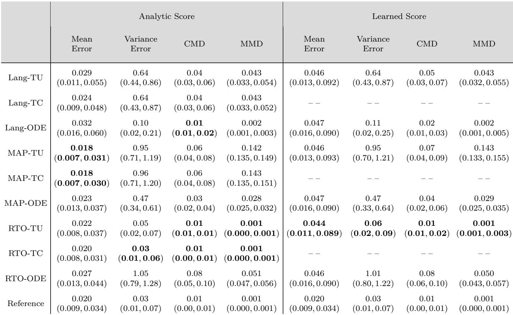

*TABLE 2. Stylized inpainting study, low noise regime: 后验均值、逐点方差的估计误差，以及 CMD、MMD 误差（learned 和 analytic score 均含）。括号内为十分位区间，Reference 行给出两组 ground-truth i.i.d. 样本之间的误差作为下界。每个指标最优方法加粗。learned score 下除未实现的 TC 外所有方法都表现良好，MAP 和 RTO 变体尤其强。*

> 💡 **Table 2 批读 (Hao 批注)**: 低噪 inpainting（后验单峰）是「送分题」。关键读数：learned score 下 **RTO-TU 的方差误差 0.06、CMD 0.01、MMD 0.001**，几乎贴到 Reference 下界（0.03/0.01/0.001）——这是能达到的理论最好。对比 MAP-TU 方差误差 0.95（严重高于 RTO），说明**即使单峰，MAP 也已经在低估方差**（MAP 方差误差大是因为它系统性偏离真方差）。而 Lang-ODE 也不错（方差 0.11）。结论：单峰下 RTO-TU 最接近真后验。

All of the methods that were tested perform fairly well in the low noise regime using the learned score, with the ‘RTO-TU’ approach providing particularly strong performance. In contrast, in the high noise regime, the Langevin dynamics-based approaches all perform significantly worse than the other approaches, while the ‘MAP’ variants perform well despite lacking the theoretical basis of the ‘Lang’ and ‘RTO’ variants. Further, this discrepancy is not due to score modeling error, as the ‘Lang’ variants perform poorly even when the analytic scores are used.

> 💡 **消融解读 (Hao 批注)**: 这是全文最关键的判据之一。高噪（后验多峰）下 **Lang 全崩，MAP 反而好**，而且「**这不是 score 误差造成的——Lang 用解析真值 score 照样崩**」。这就把责任精确定位到「Langevin 采样器本身」在多峰上的失败，而非先验建模。对本 topic 意义重大：它证明了 UQ 失真是**采样器的结构性缺陷**，光把先验/score 学准（诊断准）不足以修复——必须换采样机制（RTO/MAP）。这是「诊断+修复增量」论证的硬证据。

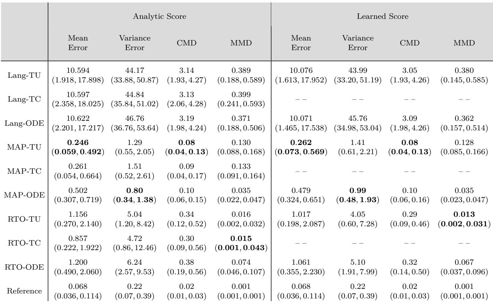

*TABLE 3. Stylized inpainting study, high noise regime: 各 BIPSDA 方法的均值、方差、CMD、MMD 平均误差（含十分位区间与 Reference 下界）。可见 ‘Lang’ 变体给出很差的均值与方差估计，而 ‘MAP’ 和 ‘RTO’ 变体表现相对强。*

> 💡 **Table 3 批读 (Hao 批注)**: 高噪 inpainting（多峰）的数字触目惊心：**Lang 系列均值误差 ~10.6、方差误差 ~44**（Reference 仅 0.068/0.22），CMD ~3.1——完全崩坏。而 MAP-TU 均值误差 0.26、RTO-TU 均值误差 1.0，秒杀 Lang。注意 RTO-TU 的 MMD（0.013）优于 MAP-TU（0.128），说明 RTO 的 global 分布匹配更好；但 MAP-TU 均值误差更小。这印证了讨论节的分工：MAP 抓多峰权重准（均值准），RTO 抓 global 形状准（MMD 好）。Lang 则两头不占。

Figure 2, which displays scatter plots of samples from three diferent BIPSDA methods in a representative high-noise trial, provides insight into the failure of the ‘Lang’ variants. In particular, it can be seen that the Langevin dynamics based approach produces samples in low-density regions with respect to the likelihood and therefore overestimates the variance of the posterior distribution. The ‘RTO’ variants, while still overestimating the posterior variance, are much more accurate. Finally, the ‘MAP’ variants, while underestimating the variance of each of the modes, provide the most accurate estimate of the weights of the modes of all the methods tested.

<table><tr>
<td width="50%">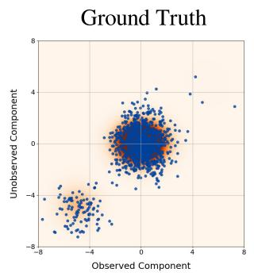</td>
<td width="50%">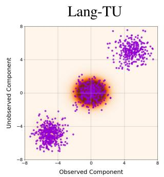</td>
</tr><tr>
<td width="50%">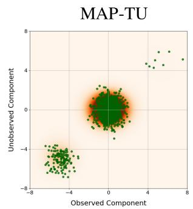</td>
<td width="50%">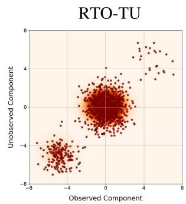</td>
</tr></table>

*FIGURE 2. Stylized inpainting study, high noise regime: 三种 BIPSDA 方法与 ground-truth 后验样本的散点图（代表性 trial）。可视化了十维样本中的两个分量，其中一个分量位于前向算子的零空间。样本叠加在后验密度上。可见 ‘RTO’ 和 ‘MAP’ 变体都给出有竞争力的表现，而 ‘Lang’ 变体显著高估后验方差。*

> 💡 **Figure 2 批读 (Hao 批注)**: 这张图是「Lang 为什么崩」的可视化解剖。三种失效模式一目了然：**Lang 把样本撒到似然低密度区 → 高估方差**（散点摊得太开）；**RTO 仍略高估方差但准得多**；**MAP 低估每个峰的方差（散点缩成团）但多峰权重估得最准**。有一个分量特意选在前向算子零空间（即数据完全不约束的方向），这里后验方差最大、最考验采样器——Lang 在这个方向失控。这三种模式贯穿全文：Lang=方差高估、MAP=方差低估、RTO=居中最优。对本 topic：即便先验完美，采样机制决定 UQ 对不对。

## B. STYLIZED X-RAY TOMOGRAPHY STUDY

We now analyze the results from the stylized x-ray tomography study. Table 4 reports the average mean, variance, CMD, and MMD errors for the diferent BIPSDA algorithms in this problem setting. As can be seen, in this problem setting all of the approaches we considered performed fairly well, despite the non-linearity of the forward model. The ‘RTO-TU’ approach provides particularly strong performance and is the top performing approach with respect to all metrics we considered in the learned score regime. This demonstrates the potential of the RTO-based approaches in the context of non-linear inverse problems.

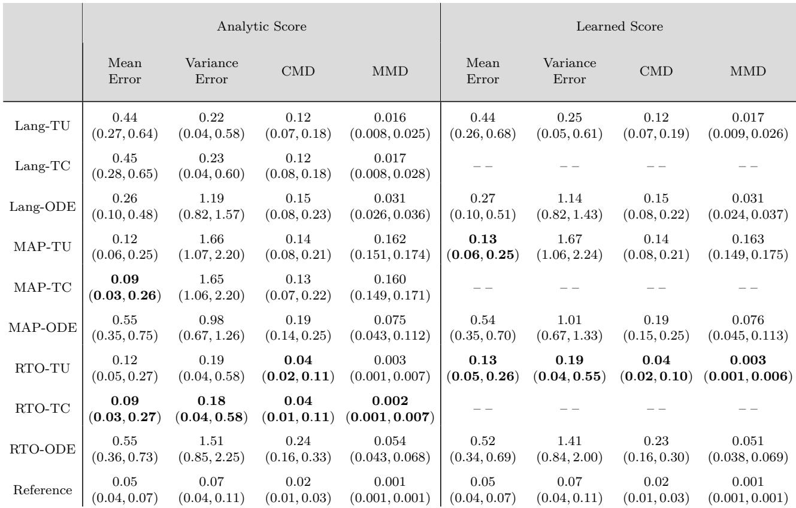

*TABLE 4. Stylized x-ray tomography study: 各 BIPSDA 方法的均值、方差、CMD、MMD 平均误差（含十分位区间与 Reference 下界）。虽然所有方法都有竞争力，但 ‘RTO-TU’ 在几乎所有指标上都优于其他方法。*

> 💡 **Table 4 批读 (Hao 批注)**: X-ray CT（非线性泊松但近似单峰）是 RTO 的主场。learned score 下 **RTO-TU 方差误差 0.19、CMD 0.04、MMD 0.003 全部夺冠**。对比：MAP-TU 方差误差 1.67（严重低估），Lang-TU 方差误差 0.25（还行但 CMD 0.12 差些）。RTO-TU **既修正了 MAP 的方差低估、又保持了非线性下的稳定**。这是「RTO 兼取快与准」的最强正面证据——非线性问题上它是唯一全指标最优的。

Figure 3 shows scatter plots of samples from the ground truth posterior and the ‘Lang-TU’, ‘MAP-TU’, and ‘RTO-TU’ algorithms for a representative trial. As can be seen, for this problem the posterior is approximately unimodal. Further, while all of the tested algorithms perform fairly well, the ‘MAP-TU’ approach underestimates the posterior variance, which is consistent with the results of the stylized inpainting study. The ‘RTO-TU’ approach is able to correct the variance underestimation of the ‘MAP-TU’ approach and performs similarly to the ‘Lang-TU’ method on this trial.

<table><tr>
<td width="50%">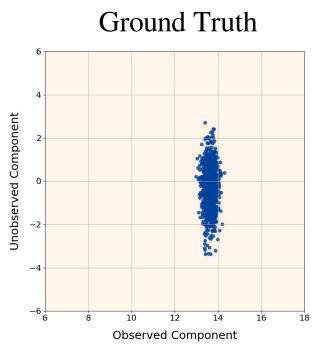</td>
<td width="50%">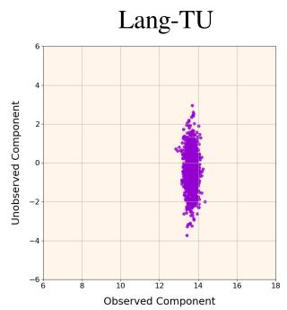</td>
</tr><tr>
<td width="50%">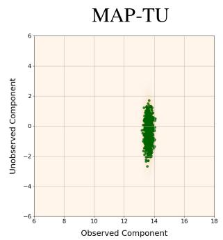</td>
<td width="50%">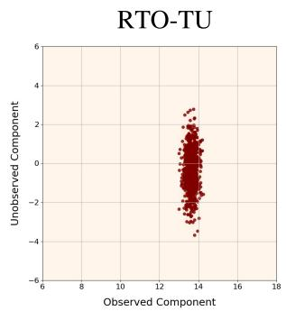</td>
</tr></table>

*FIGURE 3. Stylized x-ray tomography study: 三种 BIPSDA 方法与 ground-truth 后验样本的散点图（代表性 trial）。样本投影到前向算子 C 最大与最小奇异值对应的两个右奇异向量张成的空间，并叠加在该投影下后验密度的核密度近似上。可见三种方法都表现良好，‘Lang’ 和 ‘RTO’ 变体尤其强。*

> 💡 **Figure 3 批读 (Hao 批注)**: 投影到 C 的最大/最小奇异向量方向——最小奇异值方向就是「数据约束最弱、方差最大」的方向，最考验 UQ。图里 MAP-TU 的散点在这个方向明显缩得比 ground truth 紧（低估方差），**RTO-TU 把它撑回到正确 spread**，和 Lang-TU 接近 ground truth。单峰非线性下三者都能对多峰权重（只有一个峰），差异纯粹在「峰内方差估得准不准」——RTO 赢在这。

## C. STYLIZED PHASE RETRIEVAL STUDY

We now examine the performance of the algorithms in the stylized phase retrieval study. Figure 4 shows scatter plots of samples from the ground-truth posterior and the ‘Lang-TU’, ‘MAP-TU’, and ‘RTO-TU’ algorithms in a representative trial (with learned score). As can be seen, both the ‘Lang-TU’ and ‘RTO-TU’ algorithms produce samples that lie in a low-density region between the two posterior modes. The ‘MAP-TU’ approach avoids this issue, but sufers from significant underestimation of the variance of each of the modes.

<table><tr>
<td width="50%">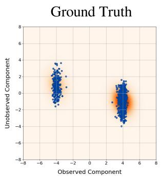</td>
<td width="50%">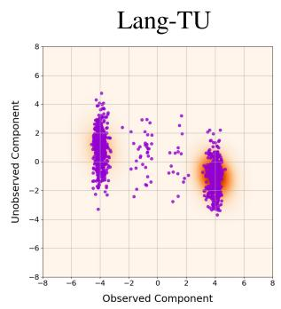</td>
</tr><tr>
<td width="50%">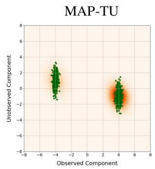</td>
<td width="50%">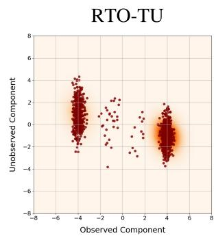</td>
</tr></table>

*FIGURE 4. Stylized phase retrieval study: 三种 BIPSDA 方法与 ground-truth 后验样本的散点图（代表性 trial）。样本投影到前向算子 B 最大与最小奇异值对应的两个右奇异向量张成的空间，叠加在该投影下后验密度的核密度近似上。可见 ‘RTO’ 和 ‘Lang’ 变体都在两个分布模之间遗留样本，而 ‘MAP’ 变体低估各模的方差。*

> 💡 **Figure 4 批读 (Hao 批注)**: 这是全文的「反面高潮」——phase retrieval 的双峰后验，没有一个方法能干净复现。**Lang-TU 和 RTO-TU 在两峰之间的低密度区撒出「幽灵样本」**（连接两峰的错误质量），**MAP-TU 避开了幽灵样本但把两个峰各自缩成一团（严重低估方差）**。三者没有赢家。这直接支撑本文最重要的负面结论：**即便退火解耦、即便用对采样器，扩散方法在非线性多峰上仍无法给严格 UQ**。根源在 03 节埋的伏笔——去噪分布 $\pi_{0|t}$ 本身多峰，而所有变体都用高斯近似它，从源头丢了多峰信息，采样器再好也补不回。

Table 5 shows the average errors in estimation of the mean and variance, as well as average CMD and MMD errors, for all nine BIPSDA methods tested. Here we first note that, when the score is known analytically, the ‘TC’ variants perform better than the ‘TU’ and ‘ODE’ variants, and on some trials produce strong performance, as evidenced by the provided interdecile ranges. This indicates that the ‘TC’ variants have some promise if a reliable approximation of the second-order score can be estimated using, e.g. the methods in [37]. However, there is wide variance in performance across the trials, and in general the ‘TC’ variants cannot fully overcome the issues observed with the ‘TU’ variants in Figure 2. All of the BIPSDA algorithms we tested thus face performance issues in this problem context.

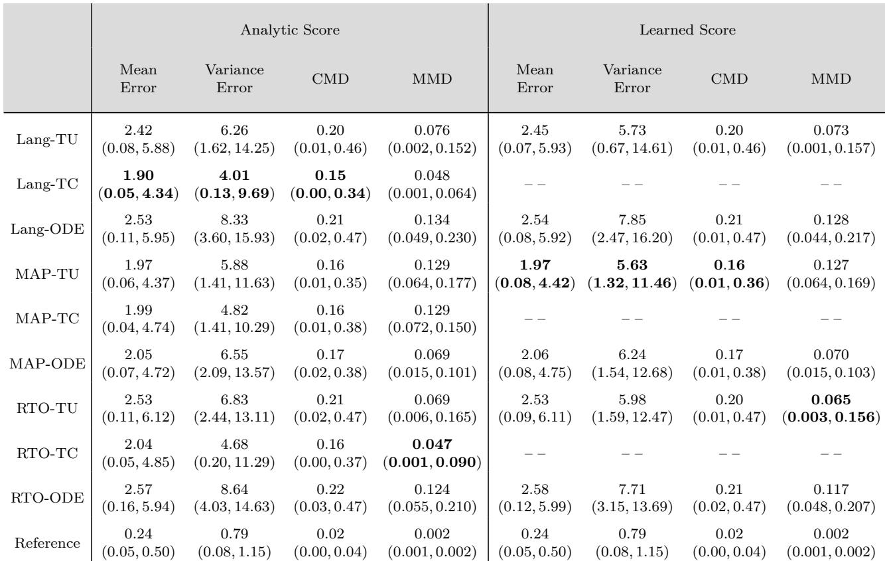

*TABLE 5. Stylized phase retrieval study: 各 BIPSDA 方法的均值、方差、CMD、MMD 平均误差（含十分位区间与 Reference 下界）。注意 learned score 下 ‘Lang-TU’ 和 ‘RTO-TU’ 分别有 29 和 185 个样本（百万总样本中）数值发散被丢弃。可见所有分析的算法在这个高难度问题上都产生显著的后验采样误差。*

> 💡 **Table 5 批读 (Hao 批注)**: 数字坐实全崩——所有方法均值误差 ~2（Reference 0.24），方差误差 4~8（Reference 0.79），CMD ~0.2（Reference 0.02）。最好的 analytic-score TC 变体（Lang-TC 方差误差 4.01）也远离 Reference。一个重要工程警报：**learned score 下 RTO-TU 有 185 个样本数值发散**——这是讨论节说的「learned score 在先验低密度区误差大导致发散」的直接证据，指向「用二阶分数信息改进 score 训练」的未来方向。TC 在 analytic score 下略优，说明「若能可靠估二阶分数，TC 有希望」，但 TU 的根本问题（高斯近似丢多峰）它也解决不了。

## D. COMPUTATIONAL CONSIDERATIONS

Here we examine the computational cost associated with the diferent BIPSDA algorithms. Table 6 shows the runtimes associated with each tested BIPSDA algorithm across all four studies (learned score regime). For each test-case, we measured the runtime to generate 10,000 samples per trial. The reported runtimes are the average over 100 trials. As can be seen, ‘TU’ variants are consistently faster than their ‘ODE’ counterparts due to the reduced number of score evaluations associated with ‘TU’ variants. However, the dominant computational cost in our problem settings is sampling from the approximate prediction distribution, not approximating the denoising distribution. Here we find that the ‘MAP’ and ‘RTO variants are consistently faster than the ‘Lang’ variants. The diference in runtimes is particularly pronounced in the inpainting studies, where the MAP point can be computed eficiently in closed form. Note that the cost of the Langevin dynamics based approaches could be reduced by reducing the number of Langevin iterations, but this may hurt the quality of the generated samples. In general, the computational feasibility of BIPSDA algorithms in a given problem setting is dependent on finding eficient MAP solvers (for the ‘MAP’ and ‘RTO’ variants) or eficient MCMC algorithms (for the ‘Lang variants) for the given problem.

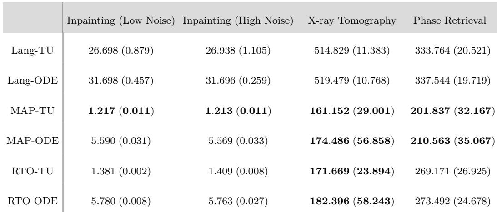

*TABLE 6. 生成 10000 个后验样本的计算时间（秒，100 trial 平均，learned score）。括号内为标准差。全部在 Nvidia A100 80GB 上运行。虽然计算成本高度依赖具体实现，但一般 ‘MAP’ 和 ‘RTO’ 变体比 ‘Lang’ 快，在 inpainting 中 MAP 问题可闭式高效求解时提速尤其明显。*

> 💡 **Table 6 批读 (Hao 批注)**: 效率账本。inpainting 里 **MAP-TU/RTO-TU 仅 1.2~1.4 秒，Lang-TU 要 26.7 秒**（快约 20 倍）——因为 MAP 有闭式解。CT/PR 里 MAP/RTO 也比 Lang 快约 2-3 倍（161s vs 515s）。另一条：**TU 一致快于 ODE**（ODE 要多次 score 评估）。综合前面精度结论：**RTO-TU 是精度与效率的双料赢家**（inpainting、CT 上又快又准），Lang 又慢又在多峰上崩，MAP 快但低估方差。这给实践者清晰建议：优先 RTO-TU。

---

## 🔖 Section 总结

### 关键数字速查（learned score，方差误差 / Reference 下界）
| Study | RTO-TU | MAP-TU | Lang | 结论 |
|-------|--------|--------|------|------|
| inpainting 低噪（单峰） | 0.06 / 0.03 | 0.95 | 0.11(ODE) | RTO-TU 贴近下界 |
| inpainting 高噪（多峰） | 4.05 | 1.41 | ~44 崩 | Lang 全崩，MAP 均值准，RTO global 好 |
| X-ray CT（非线性单峰） | 0.19 / 0.07 | 1.67 | 0.25 | RTO-TU 全指标夺冠 |
| phase retrieval（非线性多峰） | 5.98 / 0.79 | 5.63 | 5.73 | 全员翻车 |

### 计算开销（inpainting，10000 样本）
| 方法 | 时间 |
|------|------|
| RTO-TU / MAP-TU | ~1.2-1.4s |
| Lang-TU | 26.7s |

### 核心洞察
1. **三种采样器的固有偏差**：Lang=高估方差（多峰崩）、MAP=低估峰内方差（但多峰权重准）、RTO=居中最优。
2. **RTO-TU 是综合最优**：单峰、线性多峰、非线性单峰上又快又准；且线性高斯下理论上是精确采样。
3. **phase retrieval 全崩是结构性的**：即便解析 score，去噪分布的高斯近似丢多峰信息，采样器无法弥补 → 扩散退火给不出严格 UQ。
4. **learned score 会数值发散**（RTO-TU 185 个样本），指向二阶分数信息改进 score 训练。

### 可追问点
- 为什么 Lang 用解析 score 也崩？→ 证明是采样器结构问题，非先验建模误差（支撑「诊断准≠修复完」）。
