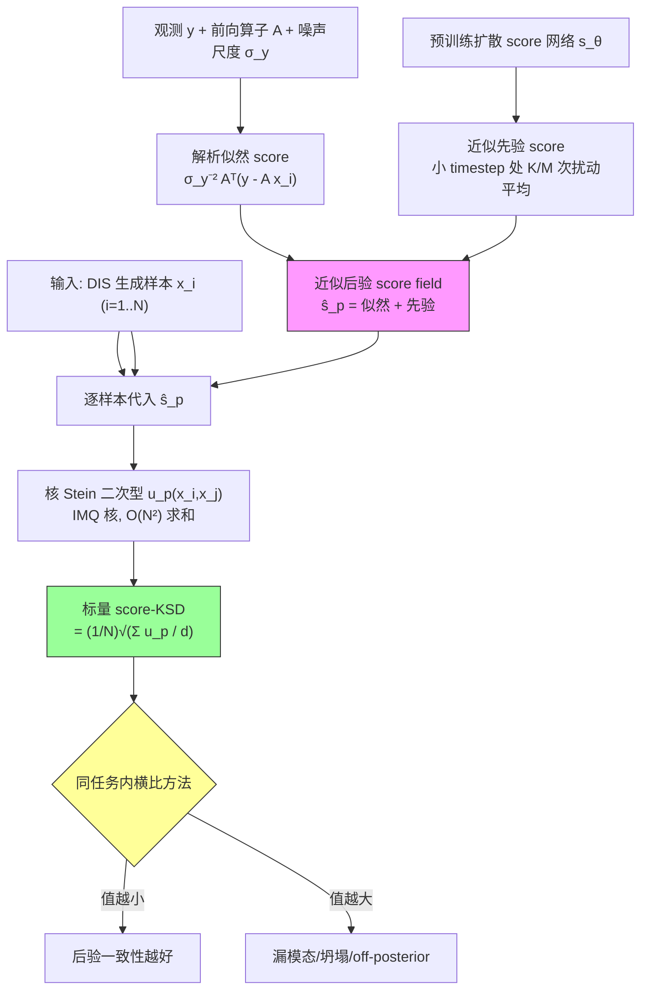

# Beyond Accuracy: Evaluating Posterior Fidelity of Diffusion Inverse Solvers

**作者**: Xiaoyu Qiu, Taewon Yang, Zhanhao Liu, Guanyang Wang, Liyue Shen（University of Michigan / Rutgers University）
**会议/来源**: arXiv preprint | **年份**: 2026
**arXiv**: [2602.04189](https://arxiv.org/abs/2602.04189) | **Semantic Scholar**: [289692a9](https://www.semanticscholar.org/paper/289692a9e07db52ec347f36b63abc98863c0a1a5) | [Connected Papers](https://www.connectedpapers.com/main/2602.04189)

---

## 一句话总结

现有扩散逆求解器（DIS）基准只看重建精度（PSNR）却忽略后验分布行为，本文命名这一"精度陷阱（Accuracy Trap）"，并提出 **score-KSD**——一个无需真后验样本/密度、仅由前向模型与学习到的扩散先验拼出目标后验 score field 的诊断指标，用核 Stein 差异衡量 DIS 生成样本与后验的一致性，证明"高精度不必然意味着高后验保真"。

## 核心贡献

1. **命名并系统研究 Accuracy Trap**：在有解析真后验的受控仿真里比较一大批 DIS，用散点可视化揭示"精度相近但分布行为（漏模态/坍塌/分散）迥异"。
2. **提出 score-KSD**：后验 score = 解析似然 score（前向模型给）+ 近似先验 score（扩散模型在小 timestep 处给）；代入核 Stein 差异（KSD 只需目标分布 score、不需其样本），得到 ground-truth-free 的后验一致性诊断。三命题给出理论保证（Stein 恒等式、有效度量、经验闭式）。
3. **双重验证**：仿真里证明 score-KSD 排序与散点可视化一致、近似 score 可靠替代解析 score；真实 MRI/CT/逆散射里证明精度与 score-KSD 无单调关系，OOD 下 KSD 上升。

## 📖 批读导航

| Section | 内容 |
|---------|------|
| [00 - Abstract](sections/00-abstract.md) | 摘要 + Figure 1（Accuracy Trap 海报） |
| [01 - Introduction](sections/01-introduction.md) | 评价目标错位、Accuracy Trap、中心问题、三点贡献 |
| [02 - Preliminaries](sections/02-preliminaries.md) | 扩散模型/DIS 框架/AU-EU 分解/现有指标局限 |
| [03 - Methodology](sections/03-methodology.md) | score-KSD：后验 score 近似 + KSD + Algorithm 1 + 三命题 |
| [04 - Numerical Simulation](sections/04-numerical-simulation.md) | toy 散点(Fig 2)、有限样本行为(Fig 3)、对齐验证(Table 1) |
| [05 - Real Data Experiments](sections/05-real-data-experiments.md) | 逆散射/MRI/CT、五条发现、OOD 与超参消融 |
| [06 - Discussion & Conclusion](sections/06-discussion-conclusion.md) | 结论、$\sigma_y$ 局限、References |
| [07 - Appendix](sections/07-appendix.md) | 实现细节(A)、仿真设定(B)、补充结果(C)、证明(D) |

## 关键数字

| 指标 | 数值 |
|------|------|
| 被评价 DIS 方法 | 10 类（DPS/DAPS/DDRM/DDNM/DiffPIR/FPS/MCG-Diff/PnPDM/RED-Diff 等） |
| 真实任务 | 3 类：线性逆散射、欠采样 MRI、稀疏视角 CT（含 OOD 癌症 CT） |
| 每观测采样数 | $N=50$（真实任务）；仿真用 100/500/5000 |
| toy 维度 | $(d_x,d_y)=(16,14)$；双模态高斯混合权重 0.8 / 0.2 |
| An-KSD 跨方法跨度（σ=0.2） | 0.28（MCG-Diff N run）→ 1.77（FPS one run），而 RMSE 仅 1.04→1.27 |
| Accuracy Trap 实证 | CT(20v) DPS PSNR 31.52 > DAPS 28.23，但 KSD 2211.65 ≫ 11.01 |
| score-KSD 核 | IMQ，$\beta=-1/2$，$c=1/(\text{median}(s(\mathcal{A}))+1)$ |
| 先验 score 近似 | EDM $\sigma_{\text{score}}=0.3$，$M=4$ 次扰动平均 |
| 核心局限 | 需已知噪声尺度 $\sigma_y$ 与前向算子 $\mathcal{A}$ |

## 数据流：输入 → 中间表示 → 输出

## 优缺点与还能做什么

### 优点
- **填补评价真空**：首个把"后验保真度"作为独立评价轴、且能用于无真后验真实任务的诊断，直击 PSNR 只评单点的盲区。
- **ground-truth-free 且理论扎实**：只需前向模型 + 扩散先验即可算目标 score field；三命题（Stein 恒等式 / 有效度量 / 经验闭式）给出合优度检验级别的保证。
- **证据链完整**：仿真做内部效度（排序 vs 可视化一致、近似≈解析），真实数据做外部效度（区分平凡基线、跨图稳定、超越精度、OOD 敏感）。
- **边际成本低**：评价侧一次性 $O(N^2)$（$N=50$），可与其他校准检验并行。

### 局限 / 风险
- **依赖已知 $\sigma_y$ 与 $\mathcal{A}$**：似然 score 显式含 $\sigma_y^{-2}\mathcal{A}^\top$，$\sigma_y$ 估错则读数失真；作者自列为 future work。
- **仅同任务诊断**：绝对量级被后验锐度（噪声/观测强度/维度）主导，不能跨任务比大小。
- **用近似 score $\hat{s}_p$**：Prop 2 唯一性对近似误差的鲁棒性未理论量化，仅靠 Table 1 的 Ap≈An 经验兜底。
- **超参敏感**：排序会被各方法超参左右（Table 8 DPS 极端敏感），横比须锁定公平超参。
- **$N=50$ 偏小**：真实任务样本量远小于 Fig 3 建议的大 $N$，有限样本偏差需注意。

### 还能做什么（与本课题衔接）
- **迁移到盲设置的三维后验**：本文只评 $x$-后验且假设 $\mathcal{A},\sigma_y$ 已知；我们的 gauge-aware 盲逆问题需评 $x$、低维算子参数 $\phi$、噪声 $\sigma$ 三部分后验，似然 score 里的 $\mathcal{A}(\phi),\sigma$ 需联合估计——这是最直接的扩展面。
- **与 SBC/coverage/CRPS 互补**：score-KSD 走"样本对 score field"路线（$x$ 维、$\sigma$ 已知）；对 $\phi,\sigma$ 维改用"重复模拟-秩检验"的正交校准检验，两条路线拼成完整校准评价。
- **补 $\sigma_y$ 估计误差敏感性实验**：正是本文列出的 future work，也是联合估计 $\sigma$ 的动机验证。

## 阅读 Q&A 记录

- **Q: 为什么重建精度（PSNR）不能代替分布一致性？**
  A: 病态逆问题一个 $y$ 对应一族合理解，PSNR 只奖励"某个随机重建碰巧接近真值 $x^*$"。Figure 1(a) 给出反例——off-posterior 的 $\hat{x}_2$ 可能因离 $x^*$ 近而 PSNR 高于后验合理的 $\hat{x}_3$。Table 1 数值化：σ=0.2 下 RMSE 全挤在 1.0–1.3，而 An-KSD 从 0.28 到 1.77 差 6 倍；Table 2 里 DPS 的 PSNR 高于 DAPS 但 KSD 差两个数量级。见 [00](sections/00-abstract.md)、[04](sections/04-numerical-simulation.md)、[05](sections/05-real-data-experiments.md)。

- **Q: score-KSD 具体怎么计算？**
  A: 三步（Algorithm 1，见 [03](sections/03-methodology.md)）：(1) 逐样本算解析似然 score $\sigma_y^{-2}\mathcal{A}^\top(y-\mathcal{A}x_i)$；(2) 用预训练扩散网络在小 timestep 处做 $M=4$ 次扰动平均得近似先验 score，两者相加成近似后验 score $\hat{s}_p(x_i)$；(3) 对所有样本对算 IMQ 核 Stein 二次型 $u_p$，求和后 $\text{score-KSD}=\frac1N\sqrt{\sum u_p/d}$。越小越一致，仅同任务内可比。

- **Q: 为什么用 KSD 而不是 Wasserstein/FID？**
  A: KSD 只需"目标分布的 score"、不需其样本或归一化密度（Stein 恒等式性质），而 Wasserstein/FID/LPIPS 都需要目标分布也能采样。真实逆问题里真后验既无采样器也无密度，只有 KSD 这类单边度量可用。见 [02](sections/02-preliminaries.md) 2.4。

- **Q: 这套评价如何迁移到盲设置（x、φ、σ 三部分后验误差）？**
  A: 本文默认 $\mathcal{A}$、$\sigma_y$ 已知、只评 $x$。盲设置需把 $\phi$（算子参数）、$\sigma$（噪声）也作为后验变量：似然 score 里的 $\mathcal{A}\to\mathcal{A}(\phi)$、$\sigma_y\to\sigma$ 需联合估计，会遇到"评价用的 score field 依赖待估参数"的鸡生蛋问题。可行路线是 $x$-维沿用 score-KSD、$\phi/\sigma$-维用 SBC/coverage/CRPS 正交检验。本文的 $\sigma_y$ 局限（[06](sections/06-discussion-conclusion.md)）与 OOD 敏感性（[05](sections/05-real-data-experiments.md)）正是这一迁移的动机与证据。

- **Q: 有限样本下真后验的 score-KSD 是 0 吗？可以当下界吗？**
  A: 不是。总体级 KSD=0（Prop 2），但有限样本经验 score-KSD 非零（Fig 3 随 $N$ 单调降趋 0）。且它**不是严格下界**——某些采样器在给定核下甚至比真后验参考样本更小（Table 1 中 MCG-Diff N run 0.28 < 参考 0.35）。只能当"有限样本参考基线"。见 [04](sections/04-numerical-simulation.md) 4.2/4.3。

## 📊 Citation Landscape

> 数据来源：Semantic Scholar API（2026-07 查询）。本文已被 S2 收录（paperId `289692a9e07db52ec347f36b63abc98863c0a1a5`）。

**TLDR (S2 自动摘要)**: To enable posterior-aware evaluation on real-world inverse problems where ground-truth posterior is unavailable, the proposed score-KSD is proposed, a theoretically-grounded and ground-truth-free metric that measures the consistency of the distribution of generated samples from a DIS method with the target posterior score field, induced by the forward model and learned diffusion prior.

**引用统计**（截至查询日）:

| 指标 | 数值 |
|------|------|
| 参考文献数 (referenceCount) | 52 |
| 被引次数 (citationCount) | 0（新论文） |
| Influential Citations | 0 |

### 参考文献分组（按 citation count Top5）

**扩散逆求解器 / DIS 算法（被评价对象）**
| 论文 | 年份 | 引用数 |
|------|------|--------|
| Diffusion Posterior Sampling for General Noisy Inverse Problems (DPS) [5] | 2022 | 1737 |
| Denoising Diffusion Restoration Models (DDRM) [23] | 2022 | 1324 |
| Zero-Shot Image Restoration Using DDNM [41] | 2022 | 762 |
| Pseudoinverse-Guided Diffusion Models (ΠGDM) [36] | 2023 | 580 |
| Denoising Diffusion Models for Plug-and-Play Image Restoration (DiffPIR) [50] | 2023 | 447 |

**扩散模型基础**
| 论文 | 年份 | 引用数 |
|------|------|--------|
| Denoising Diffusion Probabilistic Models (DDPM) [16] | 2020 | 32814 |
| Denoising Diffusion Implicit Models (DDIM) [35] | 2020 | 12703 |
| Score-Based Generative Modeling through SDEs [38] | 2020 | 11362 |
| Elucidating the Design Space of Diffusion Models (EDM) [22] | 2022 | 3628 |
| Solving Inverse Problems in Medical Imaging with Score-Based Models [37] | 2021 | 766 |

**评价工具 / KSD / 不确定性理论**
| 论文 | 年份 | 引用数 |
|------|------|--------|
| The Unreasonable Effectiveness of Deep Features (LPIPS) [48] | 2018 | 18554 |
| GANs Trained by Two Time-Scale Update Rule (FID) [15] | 2017 | 18864 |
| What Uncertainties Do We Need in Bayesian Deep Learning [24] | 2017 | 6223 |
| Aleatoric and epistemic uncertainty in ML [18] | 2021 | 2117 |
| A Kernelized Stein Discrepancy for Goodness-of-fit Tests (KSD) [29] | 2016 | 563 |

**贝叶斯逆问题 / 采样器**
| 论文 | 年份 | 引用数 |
|------|------|--------|
| Inverse problems: A Bayesian perspective [39] | 2010 | 2032 |
| Statistical and Computational Inverse Problems [21] | 2006 | 1667 |
| Robust Compressed Sensing MRI with Deep Generative Priors [19] | 2021 | 468 |
| Measuring Sample Quality with Kernels [13] | 2017 | 262 |
| Monte Carlo Guided Diffusion (MCG-Diff) [2] | 2023 | — |

### 推荐相关论文（Recommendations API，Top10）

| 论文 | arXiv | 年份 |
|------|-------|------|
| Unbiased Diffusion Variational Inversion via Principled Posterior | 2605.25042 | 2026 |
| Flow Annealing Posterior Sampling for Function-Space Regression | 2606.22346 | 2026 |
| Separating Intrinsic Ambiguity from Estimation Uncertainty in Deep ... | 2605.15050 | 2026 |
| Hallucination-Aware Diffusion Sampling for Inverse Problems | 2606.02331 | 2026 |
| Diffusion Graph Posterior Sampling for Nonlinear Inverse Problems | 2605.19621 | 2026 |
| Pointwise Metrics Mislead: An Evaluation Protocol for Multimodal ... | 2605.22891 | 2026 |
| Stochastic Optimal Control Sampling for Diffusion Inverse Problems | 2606.28785 | 2026 |
| Latent Diffusion Posterior Sampling with Surrogate Likelihood Guidance | 2606.26592 | 2026 |
| Geometry-Correct Diffusion Posterior Sampling with Denoiser-Pullback | 2605.27990 | 2026 |
| What Do Flow-Based Inverse Solvers Approximate? A Posterior-Transport... | 2607.01176 / 2605.xxxxx | 2026 |

> 💡 **Citation Landscape 批注 (Hao 批注)**: 参考文献画出本文的"评价论文"身份——它不发明新采样器，而是把 DIS 算法（DPS/DDRM/DDNM/DiffPIR/MCG-Diff...）当被测对象，用 KSD 血统（Liu-Lee-Jordan [29]、Gorham-Mackey [13,14]）造评价工具，参照 InverseBench [49] 的科学任务。推荐列表里 "Pointwise Metrics Mislead"（2605.22891）与 "What Do Flow-Based Inverse Solvers Approximate"（后验一致性视角）与本文母命题高度同频，说明"点估计指标误导 + 后验保真评价"正在成为 2026 年的活跃方向，与本课题的后验校准主线直接相关。
