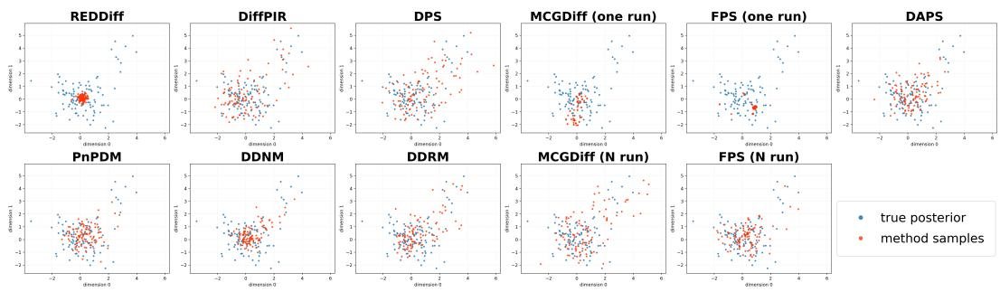
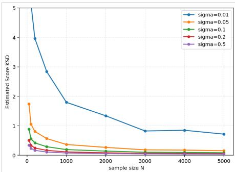
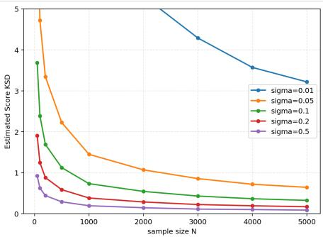
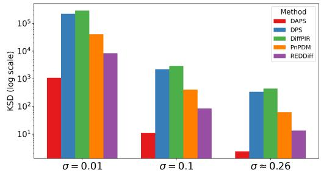
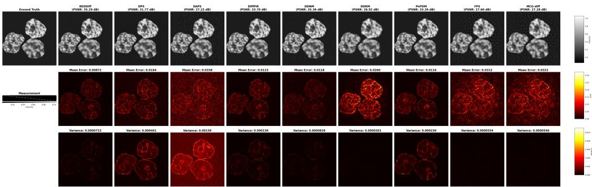
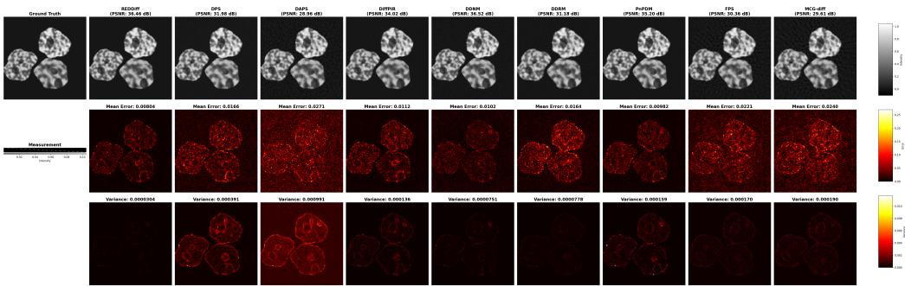
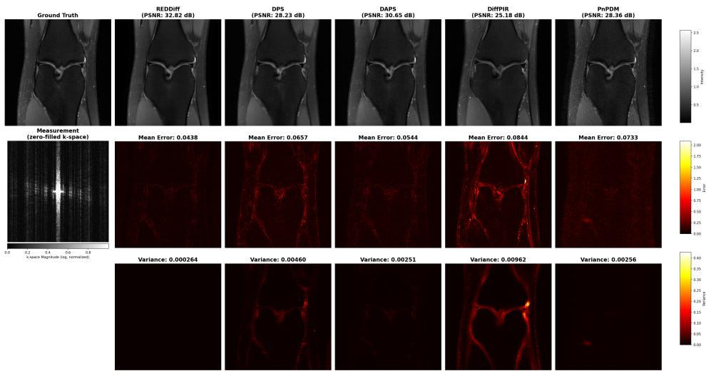
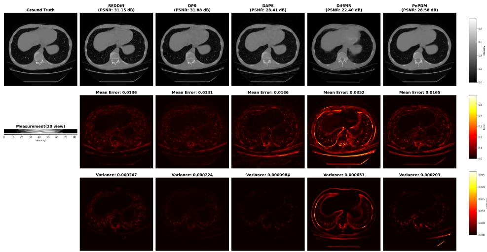
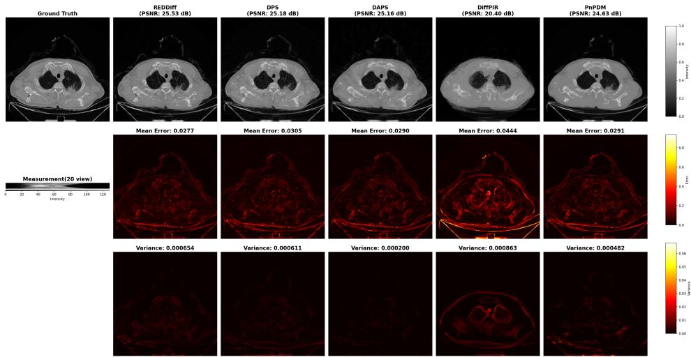
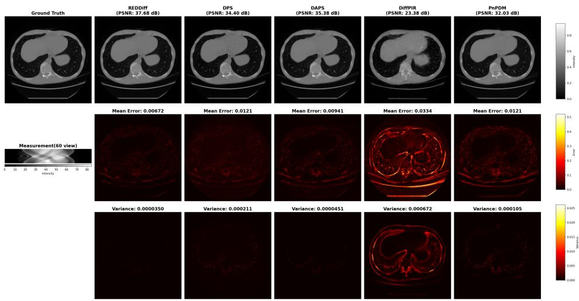

# Beyond Accuracy: Evaluating Posterior Fidelity of Diffusion Inverse Solvers

Xiaoyu Qiu1 Taewon Yang2 Zhanhao Liu2 Guanyang Wang3 Liyue Shen2

1Department of Statistics, University of Michigan

2Department of EECS, University of Michigan

3Department of Statistics, Rutgers University

xiaoyuq@umich.edu {taewony, zhanhaol, liyues}@umich.edu guanyang.wang@rutgers.edu

## Abstract

Uncertainty evaluation is critical in scientific and engineering inverse problems. However, existing benchmarks on Diffusion Inverse Solvers (DIS) primarily focus on reconstruction accuracy but overlook uncertainty and distributional behavior. Since stochastic inverse solvers represent uncertainty through diffusion-based posterior samples, evaluating how well their generated samples capture the target posterior distribution becomes an important aspects of uncertainty quantification. To address this limitation and better understand this distributional behavior of diffusion samplers, we conduct a systematic study to investigate the posterior fidelity of a broad range of existing DIS methods in controlled simulation settings with known analytical true posterior. Furthermore, to enable posterior-aware evaluation on real-world inverse problem where ground-truth posterior is unavailable, we propose score-based Kernel Stein Discrepancy (score-KSD), a theoretically-grounded and ground-truth-free metric that measures the consistency of generated sample distribution from a DIS method with the target posterior score field, induced by the forward model and learned diffusion prior. Through both simulation experiments and real-world inverse problem solving, we validate the effectiveness of proposed score-KSD and demonstrate that it provides meaningful posterior fidelity diagnostics beyond reconstruction accuracy, revealing that higher reconstruction accuracy does not necessarily imply better posterior consistency.

## 1 Introduction

Inverse problems are ubiquitous and fundamental across diverse scientific and engineering applications, including astronomy [8], oceanography [44], medical imaging [37, 6], geophysics [40], and audio signal processing [27, 32], among others. Recently, Diffusion Inverse Solvers (DIS) have emerged as a promising paradigm for solving these inverse problems, leveraging the generative power of pretrained diffusion models to regularize solutions effectively [5, 4, 2, 34]. Despite rapid algorith mic advancements, evaluation and benchmarking efforts lag behind, typically focusing on a set of natural image restoration tasks such as image denoising, deblurring and super-resolution [20, 36, 31]. Furthermore, to evaluate real-world scientific applications with greater structural challenges in forward modeling, where priors and observations are governed by underlying physics, Zheng et al. introduced InverseBench [49] , a comprehensive evaluation of existing diffusion inverse solver methods focused on scientific tasks.

However, another gap remains in evaluation objective. Natural image restoration tasks often reward pixel-wise accuracy (e.g., Peak Signal-to-Noise Ratio (PSNR)) from a random reconstruction [20]. In contrast, inverse problems are inherently ill-posed with measurement noise which can leads to multiple physically plausible solutions (Fig. 1), naturally leading to statistical uncertainty quantification[21, 39].

(d)  
(a)  
  
Figure 1: (a): Illustration of the Accuracy Trap phenomenon and distinct uncertainty behaviors by different DIS samplers. (b)∼(d): Demonstration of posterior fidelity and accuracy performance across various DIS algorithms in three inverse problems: (b) linear inverse scattering, (c) undersampling MRI, and (d) sparse-view CT reconstruction.

Moreover, such uncertainty analysis is especially important and required in engineering and scientific applications, i.e., calibrated uncertainty that preserves all physically valid solutions and enables principled risk quantification [11, 26]. This creates a crucial gap across evaluation of existing DIS works: not only are we ignoring the inherent stochastic nature of DIS, but we are also overlooking the critical role of uncertainty behavior of the sampled distribution requested in scientific applications. This mismatch is evident as shown in Fig. 1, where several DIS methods produce similar accuracy performance in reconstructions for the same task, yet induce markedly different distributional behaviors, reflecting distinct posterior fidelity.

We call this phenomenon the Accuracy Trap. As illustrated in Fig. 1, relying solely on point accuracy metrics (e.g., PSNR) can fundamentally mischaracterize posterior samplers. For instance, an offposterior reconstruction ${ \hat { x } } _ { 2 }$ may achieve a higher PSNR than a posterior-plausible reconstruction ${ \hat { x } } _ { 3 }$ simply because ${ \hat { x } } _ { 2 }$ happens to be closer to the ground-truth $x ^ { * }$ . Moreover, different DISs can exhibit qualitatively different uncertainty behaviors. Some solvers may produce well-dispersed samples that largely reflect the posterior uncertainty, some may generate a mixture of posterior-plausible and off-posterior samples, and others may collapse to nearly deterministic outputs. Consequently, robust uncertainty quantification (UQ) is not an optional add-on, but a prerequisite for deploying DIS methods in risk-sensitive scientific applications.

Since stochastic inverse solvers represent uncertainty through posterior samples, evaluating how well their generated samples capture the target posterior distribution becomes an important aspects of uncertainty quantification. Aligned with this goal, some recent DIS methods make efforts to introduce provable samplers [43, 2, 10, 7], and validate the posterior estimation on controlled simulations where the analytical posterior is known using metrics such as sliced Wasserstein distance [2]. However, evaluating posterior fidelity in realistic inverse problems remains largely unsolved. Existing distributional metrics, such as FID and LPIPS, require samples from both compared distributions and therefore inapplicable to real-world inverse problem without ground truth posterior samples.

Encouragingly, UQ has received growing attention in machine learning, through aleatoric uncertainty(AU) and epistemic uncertainty(EU) decomposition [18], single-model uncertainty estimation [17, 3, 30], uncertainty-based distribution shift detection for DIS [25], and controlled statistical benchmarking studies [45]. Yet, to our knowledge, no existing work address the following central question: Can stochastic DIS recover the posterior p(x | y), and how should we evaluate such posterior fidelity without true posterior sampler and density, as in real-world inverse problems?

Contributions. To address this challenge, we provide a systematic study and propose a new metric to evaluate the posterior fidelity for DIS methods:

• We conduct a systematic study of posterior fidelity for a broad range of DIS in controlled simulation settings with known analytical true posterior. Beyond reconstruction accuracy, we analyze how well generated samples capture the target posterior distribution and characterize the distributional behavior of different DIS methods.

• We propose score-based Kernel Stein Discrepancy (score-KSD), a theoretically grounded and ground-truth-free metric for evaluating posterior consistency of DIS methods in inverse problem solving. The proposed metric measures agreement between generated samples and posterior score field induced by the forward model and learned diffusion prior, enabling posterior-aware evaluation even when exact posterior samplers or densities are unavailable.

• Through experiments on both toy models and real-world inverse problems, we demonstrate that score-KSD provides meaningful diagnostics of posterior fidelity beyond reconstruction accuracy, revealing that strong reconstruction performance does not necessarily imply better posterior consistency (Fig. 1), highlighting the importance of distribution-aware evaluation for stochastic inverse solvers.

## 2 Preliminarily and Background

## 2.1 Diffusion Models

Diffusion models (DM) have demonstrated extraordinary ability to generate high quality images [38, 16, 35]. A diffusion model defines a forward noising process that transforms clean data $x _ { 0 } \sim p _ { \mathrm { d a t a } }$ into noisy variables $x _ { t }$ for $t \in [ 0 , T ]$ , and learns a network that enables reversing this process. In practice, the training of diffusion model can be viewed as either (i) estimating a score function $s _ { \theta } ( x _ { t } , t ) \approx \nabla _ { x _ { t } } \log p _ { t } ( x _ { t } )$ as formulated in the score-based DM [38], or (ii) learning a denoiser that predicts a clean image $\hat { x } _ { 0 } = \mathrm { D e n o i s e } _ { \theta } ( x _ { t } , t )$ from the noisy image $x _ { t }$ as formulated in Denoising Diffusion Probabilistic Model $[ 1 6 ]$ , where t denotes the diffusion sampling steps. Throughout, we view the diffusion model as an implicit distributional prior that can be queried via the score function or denoising operations, when the prior density log $p _ { \theta } ( x _ { 0 } )$ is not available in closed form.

## 2.2 Diffusion Priors for Inverse Problem Solving

The inverse problem aims at reconstructing an unknown signal x $\in \mathbb { R } ^ { n }$ based on the measurements $y \in \mathbb { R } ^ { m }$ . Formally, y derives from a forward process determined by $y = \mathcal { A } x + \epsilon$ , where $\mathcal { A }$ can be either a linear operator, such as the Radon transform in sparse-view CT reconstruction and Fourier transform in accelerated MRI, or a nonlinear operator, such as the JPEG restoration encoder. $\mathcal { A }$ can also be either given or unknown. In this work, we focus on the situation where A is given. The term ϵ denotes random measurement noise.

Diffusion inverse solver (DIS) methods combine a pretrained diffusion model prior $p _ { \theta } ( x )$ with a known forward model to perform inference for the posterior $p _ { \theta } ( x \mid y ) \propto p ( y \mid x ) p _ { \theta } ( x )$ , where the prior term $p _ { \theta } ( x )$ comes from the diffusion model prior and the likelihood term $p ( y \mid x )$ is determined by forward operator A and the noise model. The likelihood term enforces measurement consistency by favoring reconstructions that yield high $p ( y \mid x )$ . In practice, DIS algorithms impose measurement consistency in the diffusion sampling trajectory via different mechanisms, including gradients [5, 47, 43], projection [6, 19, 23, 41, 23], sampling [2, 10], or other optimizations [31, 36].

Prior work has proposed different taxonomies for diffusion-based inverse solvers depending on the different criterion, such as algorithmic structure, optimization technique, or the type of inverse problems [9, 49]. For example, InverseBench groups existing DIS methds mainly based on algorithmic structure, including linear guidance, general guidance, variable-splitting, variational Bayes, and sequential Monte Carlo [49]. InverseBench further provides a comprehensive benchmark that evaluates reconstruction performance across diverse tasks using standard accuracy metrics including PSNR and Structural Similarity Index Measure (SSIM) [49]. While this accuracy assessment provides useful insights, it does not evaluate the posterior fidelity to understand the uncertainty and distributional behavior of different DIS methods.

## 2.3 Posterior Uncertainty in Inverse Problems

Solutions to the ill-posed inverse problems are inherently uncertain due to incomplete measurements, measurement noise, and imperfect prior information [21, 39]. In machine learning literature, these uncertainties are commonly categorized into epistemic uncertainty (EU) arising from limited information or model uncertainty, and aleatoric uncertainty (AU) arising from intrinsic stochasticity in the measurement generation process [24, 33].

In diffusion-based inverse problems solving, AU is primarily induced by measurement noise, while EU is associated with information loss from the ill-posed forward operator, potential model specification or prior mismatch. Thus, intrinsic posterior distribution induced by the inverse problem should exhibit substantial uncertainty, particularly under ill-posed measurement settings. Since stochastic DIS aims to characterize posterior uncertainty through generated samples, posterior fidelity naturally becomes a key criterion for evaluating whether the sampled distributions reflect the underlying posterior behavior induced by the inverse problem.

## 2.4 Limitation on Current Evaluation Metrics

Existing work mainly benchmarks the reconstruction quality by accuracy (e.g., PSNR/SSIM). While accuracy metrics remain necessary, they are insufficient for evaluating DIS methods. There are two fundamental reasons: (i) in ill-posed inverse problems the target is a posterior distribution $p ( x \mid y )$ with many plausible reconstructions of the same measurement, and (ii) most DIS algorithms are inherently stochastic, producing a distribution of reconstructions rather than a single deterministic output. Together, the object of interest is a distribution over reconstructions, motivating uncertaintyaware evaluation.

Although posterior fidelity of DIS has recently received increasing attention [2, 45], existing metric such as Wasserstein distance is primarily limited to controlled simulation settings where ground-truth posterior is accessible. Common distributional metrics in real images such as FID [15] and LPIPS [48] require samples from both compared distributions, making them inapplicable to real-world inverse problems where neither true posterior samplers nor normalized posterior densities are accessible. This limitation highlights an urgent need for distributional posterior fidelity evaluation methods that do not rely on access to ground-truth posterior distribution or samples.

## 3 Posterior Fidelity Evaluation via Score-KSD

## 3.1 Posterior Score Approximation

To evaluate posterior fidelity, we seek a metric that measures how well the sample distribution induced by a DIS matches the Bayesian posterior. In synthetic settings, this can be achieved by comparing to ground-truth posterior samples. However, such samples are unavailable in realistic inverse problems, making direct distributional comparison infeasible.

A key observation is that, although the posterior density $p ( x \mid y )$ is intractable, its score can be computed up to approximation. Using Bayes’ rule $p ( x \mid y ) \propto p ( y \mid x ) p ( x )$ , the posterior can be decomposed into $\ddot { \nabla } _ { x } \log p ( x \mid y ) = \check { \nabla _ { x } } \log \overset { } { p } ( y \mid x ) \overset { \cdot } { + } \nabla _ { x } ^ { } \log p ( \overset { \cdot } { x } )$ after taking log and gradient.

Assuming Gaussian measurement noise $\varepsilon \sim \mathcal { N } ( 0 , \sigma _ { y } ^ { 2 } I )$ , the likelihood score is analytically available $\begin{array} { r } { \nabla _ { x } \log p ( y \mid x ) = \frac { 1 } { \sigma _ { * } ^ { 2 } } J _ { A } ( x ) ^ { \top } \big ( y - \mathcal { A } ( x ) \big ) } \end{array}$ , where $J _ { \cal A } ( x )$ is the Jacobian of A and it reduces to $\sigma _ { y } ^ { - 2 } { \mathcal { A } } ^ { \top } ( y - { \mathcal { A } } x )$ in the linear inverse problem. Moreover, although the prior score on clean image $\check { \nabla } _ { x } \log p ( x )$ is unavailable, it can be approximated using the pretrained diffusion model through the pretrained score function $s _ { \theta } ( x _ { t } , t )$ at small diffusion sampling timestep t. Specifically, for a collection of small diffusion times $\{ t _ { k } \} _ { k = 1 } ^ { K }$ , we perturb x as $x _ { t _ { k } } = \alpha _ { t _ { k } } x + \sigma _ { t _ { k } } z _ { k } , \quad z _ { k } \sim \mathcal { N } ( 0 , I )$ , and average them to approximate the diffusion score for clean images: $\begin{array} { r } { \widehat { s } _ { \mathrm { p r i o r } } ( x ) = \frac { 1 } { K } \sum _ { k = 1 } ^ { K } \alpha _ { t _ { k } } s _ { \theta } ( x _ { t _ { k } } , t _ { k } ) } \end{array}$ This yields an approximated posterior score $\begin{array} { r } { \hat { s } _ { \mathrm { p } } ( x ; y ) = \mathbf { \bar { \nabla } } \nabla _ { x } \log p ( y \mid x ) + \mathbf { \bar { \hat { s } } } _ { \mathrm { p r i o r } } \mathbf { \bar { ( } } x ) } \end{array}$ . The practical approximation details are provided in Appendix A.

## 3.2 Kernel Stein Discrepancy

Given this approximated posterior score induced by the pretrained diffusion score function $s _ { \theta } ,$ together with generated N posterior samples from a DIS method $\{ x _ { i } \} _ { i = 1 } ^ { N } .$ , we can evaluate its posterior fidelity without access to posterior samples by using Kernel Stein Discrepancy (KSD) [29]. KSD provides a score-based measure of whether generated samples are consistent with the Stein identity associated with the target posterior distribution.

Algorithm 1 Score-Based KSD for DIS   
Require: $\{ x _ { i } \} _ { i = 1 } ^ { N } , y , \mathcal { A } , s _ { \theta }$   
1: for $i = 1 , \ldots , N$ do   
2: $\begin{array} { r } { s _ { \mathrm { l i k } } ( x _ { i } ) = \frac { 1 } { \sigma _ { u } ^ { 2 } } \mathcal { A } ^ { \top } ( y - \mathcal { A } x _ { i } ) } \end{array}$   
3: $z _ { k } \sim \mathcal { N } ( 0 , \check { I } )$   
4: $\begin{array} { r } { \hat { s } _ { \mathrm { p r i o r } } ( x _ { i } ) = \frac { 1 } { K } \sum _ { k = 1 } ^ { K } \alpha _ { t _ { k } } s _ { \theta } ( \alpha _ { t _ { k } } x _ { i } + \sigma _ { t _ { k } } z _ { k } , t _ { k } ) } \end{array}$   
5: $\hat { s } _ { p } ( x _ { i } ) = s _ { \mathrm { l i k } } \bar { ( } x _ { i } ) + \hat { s } _ { \mathrm { p r i o r } } ( x _ { i } )$   
6: end for   
7: Compute $u _ { p } ( x _ { i } , x _ { j } )$ using Equation 1.   
8: return score- $\begin{array} { r } { \mathrm { K S D } = \frac { 1 } { N } \sqrt { \sum _ { i , j = 1 } ^ { N } u _ { p } ( x _ { i } , x _ { j } ) / d } } \end{array}$

Let $q ( x \mid y )$ denote the implicit sample distribution induced by a DIS method, and let $\widehat { s } _ { \mathrm { p } } ( x ; y )$ denote the approximated posterior score. For a test function $f : \mathbb { R } ^ { d }  \mathbb { R } ^ { d }$ , the Langevin Stein operator is $\begin{array} { r } { T _ { p } \dot { f } ( x ) = \widehat { s } _ { \mathrm { p } } ( \dot { x ; } y ) ^ { \top } f ( x ) + \nabla _ { x } \cdot f ( x ) } \end{array}$ . Under standard regularity conditions, if $X \sim p ( x \mid y )$ then $\mathbb { E } [ \mathcal { T } _ { p } f ( X ) ] = 0$ (see Proposition 1). KSD measures the maximum violation of this identity over a reproducing kernel Hilbert space (RKHS): $\begin{array} { r } { \mathrm { K S D } ( q , p ) = \operatorname* { s u p } _ { \| f \| _ { \mathcal { H } ^ { d } } \leq 1 } \mathbb { E } _ { X \sim q } \left[ \mathcal { T } _ { p } f ( X ) \right] } \end{array}$ . For empirical samples $\begin{array} { r } { \hat { q } _ { N } = \frac { 1 } { N } \sum _ { i = 1 } ^ { N } \delta _ { x _ { i } } , \quad x _ { i } \sim q ( x \mid y ) } \end{array}$ , the squared KSD admits the closed-form empirical estimator $\begin{array} { r } { \mathrm { K S D } ^ { 2 } ( \hat { q } _ { N } , p ) = \frac { 1 } { N ^ { 2 } } \sum _ { i , j = 1 } ^ { N } u _ { p } ( x _ { i } , x _ { j } ) } \end{array}$ , where

$$
u _ { p } ( x _ { i } , x _ { j } ) = s _ { p } ( x _ { i } ) ^ { \top } k ( x _ { i } , x _ { j } ) s _ { p } ( x _ { j } ) + s _ { p } ( x _ { i } ) ^ { \top } \nabla _ { x _ { j } } k ( x _ { i } , x _ { j } ) + s _ { p } ( x _ { j } ) ^ { \top } \nabla _ { x _ { i } } k ( x _ { i } , x _ { j } ) + \mathrm { t r } \big ( \nabla _ { x _ { i } } \nabla _ { x _ { j } } k ( x _ { i } , x _ { j } ) \big )
$$

$$
k ( x _ { i } , x _ { j } )
$$

of $x ,$ we applied a normalization in our proposed metric: score $\begin{array} { r } { - \mathrm { K S D } = \frac { 1 } { N } \sqrt { \sum _ { i , j = 1 } ^ { N } { u _ { p } ( x _ { i } , x _ { j } ) / d } } . } \end{array}$ where d is the dimension of $x .$ . Throughout the paper, score-KSD refers to this empirical normalized quantity unless otherwise specified. KSD is used as a posterior-consistency diagnostic for generated samples. Under suitable kernel conditions[29, 14], KSD is nonnegative and equals zero if and only if the sample distribution matches the target posterior distribution (see Proposition 2). Consequently, within a fixed inverse problem setup, a smaller score-KSD generally indicates stronger consistency between the generated sample distribution and the target posterior score field. Note that the absolute magnitude of score-KSD depends on posterior sharpness, dimensionality, etc. Therefore, score-KSD should be interpreted as a within-task posterior-consistency diagnostic to evaluate posterior fidelity, rather than an absolute cross-task metric.

Proposition 1 (Stein identity for the posterior [14, 29]). Let $p ( x \mid y )$ be a differentiable posterior density on $\mathbb { R } ^ { d } { } _ { : }$ , and define its score as $s _ { p } ( x ) : = \nabla _ { a }$ x log p(x | y). For a vector-valued test function $f : \mathbb { R } ^ { d }  \mathbb { R } ^ { d }$ , define the Langevin Stein operator $\mathcal { T } _ { p } f ( x ) = s _ { p } ( x ) ^ { \top } f ( x ) + \nabla _ { x } \cdot f ( x )$ . Assume $f$ is sufficiently smooth and satisfies the boundary condition lim $\operatorname { \mathbb { 1 } } \lVert x \rVert \to \infty p ( x \mid y ) f ( x ) = 0$ , so that integration by parts is valid. Then, $i f X \sim p ( x \mid y )$

$$
\mathbb { E } _ { X \sim p ( x \mid y ) } \left[ { \mathcal { T } } _ { p } f ( X ) \right] = 0 .
$$

Proposition 2 (KSD is a valid discrepancy measure). Kernel Stein Discrepancy satisfies the following properties:

1. Non-negativity: $\mathrm { K S D } ( q , p ) \geq 0$

2. Identity of indiscernibles: Under suitable smoothness and integrability conditions on $p \ : / 2 9 , \ : I 2 7 ,$ , and for a characteristic kernel k, $\mathrm { K S D } ( q , p ) = 0 \quad \Longleftrightarrow \quad q ( x \mid y ) = p ( x \mid y )$

Proposition 3 (Closed-form KSD with empirical distribution). Let $p ( x \mid y )$ be the target posterior with score $s _ { p } ( x ) = \nabla _ { x } \log p ( x \mid y )$ , and let $q ( x \mid y )$ be the sample posterior distribution induced by a sampler. Given samples $\begin{array} { r } { \dot { x _ { i } } \sim q ( x \mid y ) , \quad i = 1 , \dotsc , N . } \end{array}$ define the empirical distribution $\begin{array} { r } { \hat { q } _ { N } = \frac { 1 } { N } \sum _ { i = 1 } ^ { N } \delta _ { x _ { i } } } \end{array}$ . Let H be an RKHS with scalar kernel k, and let $\mathcal { H } ^ { d }$ be the corresponding vector-valued RKHS. The KSD between $\hat { q } _ { N }$ and p is $\begin{array} { r } { \mathrm { K S D } ( \hat { q } _ { N } , p ) = \operatorname* { s u p } _ { \| f \| _ { \mathcal { H } ^ { d } } \leq 1 } \frac { 1 } { N } \sum _ { i = 1 } ^ { N } \mathcal { T } _ { p } f ( x _ { i } ) } \end{array}$ where $\mathcal { T } _ { p } f ( x ) = s _ { p } ( x ) ^ { \top } f ( x ) + \nabla _ { x } \cdot f ( x )$ . Then the squared empirical KSD admits the closed-form expression

$$
\mathrm { K S D } ^ { 2 } ( \hat { q } _ { N } , p ) = \frac { 1 } { N ^ { 2 } } \sum _ { i = 1 } ^ { N } \sum _ { j = 1 } ^ { N } u _ { p } ( x _ { i } , x _ { j } ) ,
$$

where $u _ { p } ( x _ { i } , x _ { j } ) \ : = \ : s _ { p } ( x _ { i } ) ^ { \top } k ( x _ { i } , x _ { j } ) s _ { p } ( x _ { j } ) + s _ { p } ( x _ { i } ) ^ { \top } \nabla _ { x _ { j } } k ( x _ { i } , x _ { j } ) + s _ { p } ( x _ { j } ) ^ { \top } \nabla _ { x _ { i } } k ( x _ { i } , x _ { j } ) + s _ { p } ( x _ { i } ) ^ { \top } \nabla _ { x _ { j } } k ( x _ { i } , x _ { j } ) .$ $\operatorname { t r } \big ( \nabla _ { x _ { i } } \nabla _ { x _ { j } } k ( x _ { i } , x _ { j } ) \big )$

  
Figure 2: Posterior sample comparison in toy model experiments with an inverse problem setting $( \bar { d _ { x } } , d _ { y } ) = ( 1 6 , 1 4 )$ . The scatter plots visualize the unobserved dimensions 0 and 1, whose prior follows a two-mode mixture-of-Gaussians distribution with modes centered at (0, 0) and (3, 3) with sample size $N = 5 0 0$ , noise scale $\sigma = 0 . 2$ . Blue and red points denote samples from the ground-truth posterior sampler and each diffusion sampler, respectively.1

## 4 Numerical Simulation Study

## 4.1 Qualitative Analysis of Posterior Behavior

The first emphasis of this work is to understand the distributional behavior of different DIS methods in inverse problem settings. To this end, we conduct a numerical study using a mixture-of-Gaussians prior under the noisy linear inverse problem $y = \mathcal { A } x + \epsilon$ , for which the analytical posterior density is available. We visualize posterior sample behavior through pairwise scatter plots and compare the generated samples against ground-truth posterior samples. These visualizations provide an intuitive assessment of posterior fidelity, including recovery of the overall posterior geometry, correlation structure, concentration, and mode coverage. Detailed experiment settings are provided in Supp B.

As shown in Fig. 2, some DIS methods fail to recover the weaker mode, while others preserve multimodal structure. Moreover, even within the same mode, different DIS methods exhibit diverse sample concentration behavior: some collapse a small limited region while others produce more dispersed samples that better align with the true posterior. These observations demonstrate that DIS methods have fundamentally different posterior behaviors despite generated reconstruction samples mostly fall in the plausible posterior region, highlighting the necessity of posterior fidelity evaluation beyond accuracy alone.

## 4.2 Empirical KSD Finite Particle Analysis

To validate our proposed score-KSD as a posterior fidelity diagnostic, we first study its finite-sample behavior using posterior samples in this numerical study. Although the population-level KSD of the true posterior satisfies $\mathrm { K S D } ( q , p ) = 0$ as described in Proposition 2, the empirical score-KSD computed from a finite number of posterior samples is generally nonzero due to finite sample effects. We therefore investigate how score-KSD behaves with respect to sample size, observation strength, and measurement noise.

In Fig. 3, empirical score-KSD decreases monotonically as the number of samples N increases, approaching zero as the empirical distribution better approximates the true posterior. Moreover, larger measurement noise $\sigma _ { y }$ and observation settings with weaker constraints or sparser observations both lead to smaller empirical score-KSD values, since they induce smoother and less sharply concentrated posterior geometries with reduced posterior-score magnitude, thereby reducing the finite-sample variability of score-KSD. Importantly, due to finite-sample effects, the empirical score-KSD computed from true posterior samples should not be interpreted as a strict lower bound of the metric, but rather as a finite-sample reference baseline in a controlled inverse-problem setting.

(a)  

(b)  
  
Figure 3: (a): Score-KSD curve of finite posterior samples under $( d _ { y } = 1 4 )$ and observations scale ∈ [0.1, 0.75] with varying measurement noise scales, (b): Score-KSD curve of finite posterior samples under $( d _ { y } = 4 )$ and observations scale = 3 with varying measurement noise scales.

Table 1: Root Mean Square Error (RMSE) for accuracy evaluation, score-KSD using analytical posterior score (An-KSD), and score-KSD using approximate posterior score (Ap-KSD) under different noise levels using sample size $N = 5 0 0$ with many weak measurements. Results are reported as mean and standard deviation across 5 noise draws generated from $N \sim ( 0 , \sigma ^ { 2 } )$ .
<table><tr><td rowspan="2">Method</td><td colspan="3"> $\sigma = 0 . 2$ </td><td colspan="3"> $\pmb { \sigma } = \mathbf { 0 . 5 }$ </td></tr><tr><td>RMSE↓</td><td>An-KSD</td><td>Ap-KSD ↓</td><td>RMSE↓</td><td>An-KSD ↓</td><td>Ap-KSD ↓</td></tr><tr><td>DAPS[47]</td><td>1.04 (0.06)</td><td>0.64 (0.05)</td><td>0.63 (0.04)</td><td>1.57 (0.29)</td><td>1.10 (0.21)</td><td>1.04 (0.19)</td></tr><tr><td>DDNM[41]</td><td>1.23 (0.25)</td><td>1.23 (0.21)</td><td>1.20 (0.18)</td><td>1.86 (0.42)</td><td>2.12 (0.46)</td><td>2.02 (0.41)</td></tr><tr><td>DDRM[23]</td><td>1.08 (0.10)</td><td>0.51 (0.05)</td><td>0.50 (0.05)</td><td>1.29 (0.17)</td><td>0.60 (0.10)</td><td>0.57 (0.09)</td></tr><tr><td>DiffPIR[50]</td><td>1.20 (0.11)</td><td>0.50 (0.07)</td><td>0.49 (0.06)</td><td>1.69 (0.28)</td><td>0.99 (0.22)</td><td>0.93 (0.19)</td></tr><tr><td>DPS[5]</td><td>1.14 (0.01)</td><td>0.74 (0.12)</td><td>0.74 (0.13)</td><td>1.23 (0.04)</td><td>0.25 (0.04)</td><td>0.25 (0.04)</td></tr><tr><td>FPS (N runs)[10]</td><td>1.27 (0.23)</td><td>0.96 (0.17)</td><td>0.93 (0.15)</td><td>1.76 (0.34)</td><td>1.20 (0.29)</td><td>1.13 (0.26)</td></tr><tr><td>FPS (one run)</td><td>1.21 (0.21)</td><td>1.77 (0.29)</td><td>1.74 (0.27)</td><td>1.83 (0.32)</td><td>1.71 (0.47)</td><td>1.62 (0.42)</td></tr><tr><td>MCG-Diff (N runs)[2]</td><td>1.07 (0.03)</td><td>0.28 (0.01)</td><td>0.28 (0.01)</td><td>1.26 (0.08)</td><td>0.25 (0.02)</td><td>0.25 (0.02)</td></tr><tr><td>MCG-Diff (one run)</td><td>1.21 (0.21)</td><td>1.09 (0.17)</td><td>1.09 (0.17)</td><td>1.37 (0.15)</td><td>0.85 (0.30)</td><td>0.84 (0.29)</td></tr><tr><td>PnPDM[43]</td><td>1.19 (0.18)</td><td>1.04 (0.13)</td><td>1.02 (0.10)</td><td>1.83 (0.38)</td><td>1.61 (0.35)</td><td>1.52 (0.31)</td></tr><tr><td>RED-Diff[31, 36]</td><td>1.11 (0.08)</td><td>1.57 (0.05)</td><td>1.56 (0.05)</td><td>1.65 (0.29)</td><td>2.14 (0.29)</td><td>2.06 (0.26)</td></tr><tr><td>Finite Posterior Reference</td><td>1.13 (0.04)</td><td>0.35 (0.00)</td><td>0.35 (0.00)</td><td>1.30 (0.06)</td><td>0.24 (0.00)</td><td>0.24 (0.00)</td></tr></table>

## 4.3 Score-KSD Aligns with Posterior Visualization

After characterizing the finite-sample behavior of score-KSD, we next investigate whether score-KSD can meaningfully detect posterior fidelity of different DIS methods. We compute score-KSD using both the analytical posterior score derived from the exact posterior density and the approximate posterior score constructed from the likelihood model and the learned diffusion prior for each experimental setting. We further compare the numerical score-KSD values of $\sigma = 0 . 2$ in Table 1 with its posterior scatter visualizations in Fig. 2. We observe that methods exhibiting severe posterior mismatch, such as mode collapse or failure to recover weaker posterior modes, consistently produce larger score-KSD values using analytical score (e.g., RED-Diff: 1.57, FPS (one run): 1.77). In contrast, methods that successfully recover both posterior modes and generate samples whose geometry better aligns with the analytical posterior achieve considerably smaller values (e.g., MCG-Diff (N run): 0.28, DiffPIR: 0.50, DDRM: 0.51). This qualitative consistency between the scatter visualizations and the corresponding score-KSD rankings provides empirical evidence that score-KSD meaningfully captures posterior-consistency behavior across different DIS methods.

Moreover, score-KSD computed using the approximate posterior score is close to the score-KSD using the analytical posterior score across different methods and noise scales, supporting that our proposed posterior score approximation based on the likelihood model and learned diffusion prior provides a practical and effective tool for posterior-consistency evaluation when the analytical posterior score is unavailable. Finally while posterior reference samples provide an important calibration baseline, they do not necessarily attain the minimum score-KSD due to finite-sample error. In particular, some samplers may produce more regular or score-consistent finite sample sets under the chosen kernel, leading to slightly smaller score-KSD values than finite posterior samples. We therefore interpret score-KSD primarily as a posterior-consistency diagnostic based on finite-sample score information within the same task under finite samples, rather than as an absolute population-level discrepancy metric.

<table><tr><td rowspan="3">Method</td><td colspan="4">Linear Inverse Scattering (σ = 0.0001)</td></tr><tr><td colspan="2">180 views</td><td colspan="2">360 views</td></tr><tr><td>PSNR(std) ↑</td><td>KSD↓</td><td>PSNR(std) ↑</td><td>KSD↓</td></tr><tr><td>DAPS</td><td>27.81(0.10)</td><td>3.70</td><td>29.21(0.12)</td><td>5.63</td></tr><tr><td>DDNM</td><td>35.14(0.10)</td><td>5.04</td><td>36.25(0.11)</td><td>8.04</td></tr><tr><td>DDRM</td><td>26.97(0.01)</td><td>30.53</td><td>31.17(0.05)</td><td>21.92</td></tr><tr><td>DPS</td><td>31.42(0.19)</td><td>96.95</td><td>31.65(0.19)</td><td>234.83</td></tr><tr><td>DiffPIR</td><td>33.41(0.14)</td><td>11.18</td><td>33.64(0.15)</td><td>19.56</td></tr><tr><td>FPS</td><td>27.69(0.02)</td><td>2.65</td><td>30.45(0.08)</td><td>3.58</td></tr><tr><td>MCG-Diff</td><td>27.36(0.03)</td><td>1.94</td><td>29.52(0.13)</td><td>2.18</td></tr><tr><td>PnPDM</td><td>32.94(0.16)</td><td>11.81</td><td>34.83(0.16)</td><td>18.00</td></tr><tr><td>RED-Diff</td><td>35.09(0.09)</td><td>8.59</td><td>36.24(0.10)</td><td>11.19</td></tr><tr><td>Uncond.</td><td>8.98(0.77)</td><td>901.65</td><td>8.98(0.77)</td><td>1783.04</td></tr><tr><td>Noise</td><td>12.26(0.04)</td><td>3182.67</td><td>12.26(0.04)</td><td>6131.81</td></tr></table>

(a) Results for linear inverse scattering task.

  
(b) Score-KSD with various measurement noise scales in 20-view CT reconstruction task.  
Figure 4: Performance comparison and score-KSD behavior.

Table 2: Results comparison of different DIS methods in MRI and CT reconstruction tasks (averaged value across 50 samples for one target image). Experiments are held on MRI measurements degraded with $\sigma = 0 . 0 1$ , in-distribution (ID) CT measurements degraded with $\sigma = 0 . 1$ , and out-ofdistribution(OOD) CT measurements degraded with $\sigma = 0 . 1$ . (Bold marks the best value for each reported metric, and underline marks the second-best value.)
<table><tr><td rowspan="3"></td><td colspan="4">MRI</td><td colspan="4">CT (ID)</td><td colspan="2">CT (OOD)</td></tr><tr><td colspan="2">AR = 8</td><td colspan="2">AR = 4</td><td colspan="2">20 views</td><td colspan="2">60 views</td><td colspan="2">20 views</td></tr><tr><td>PSNR(std) ↑</td><td>KSD↓</td><td>PSNR(std) ↑</td><td>KSD ↓</td><td>PSNR(std) ↑</td><td>KSD↓</td><td>PSNR(std) ↑</td><td>KSD↓</td><td>PSNR(std) ↑</td><td>KSD↓</td></tr><tr><td>DAPS</td><td>30.38(0.18)</td><td>4.92</td><td>33.00(0.05)</td><td>7.24</td><td>28.23(0.06)</td><td>11.01</td><td>35.15(0.08)</td><td>48.96</td><td>25.03(0.06)</td><td>17.44</td></tr><tr><td>DiffPIR</td><td>24.32(0.35)</td><td>95.00</td><td>25.52(0.27)</td><td>127.58</td><td>22.02(0.17)</td><td>2903.88</td><td>23.18(0.12)</td><td>16291.87</td><td>20.20(0.09)</td><td>3407.80</td></tr><tr><td>DPS</td><td>27.77(0.44)</td><td>41.40</td><td>29.73(0.13)</td><td>62.14</td><td>31.52(0.19)</td><td>2211.65</td><td>34.4(0.33)</td><td>14777.64</td><td>24.79(0.21)</td><td>2108.72</td></tr><tr><td>PnPDM</td><td>28.15(0.03)</td><td>11.62</td><td>28.81(0.02)</td><td>17.59</td><td>27.40(0.48)</td><td>404.25</td><td>32.11(0.07)</td><td>756.99</td><td>24.36(0.14)</td><td>382.65</td></tr><tr><td>RED-Diff</td><td>32.66(0.06)</td><td>2.82</td><td>35.18(0.03)</td><td>3.61</td><td>31.31(0.09)</td><td>83.97</td><td>37.75(0.05)</td><td>139.54</td><td>25.36(0.07)</td><td>111.31</td></tr><tr><td>Uncond.</td><td>6.68(0.01)</td><td>1315.57</td><td>6.68(0.01)</td><td>946.50</td><td>14.16(1.24)</td><td>20918.91</td><td>14.16(1.24)</td><td>77759.81</td><td>14.16(1.24)</td><td>20918.91</td></tr><tr><td>Noise</td><td>18.42(1.07)</td><td>1363.02</td><td>18.17(1.02)</td><td>836.29</td><td>5.43(0.02)</td><td>102111.27</td><td>5.43(0.02)</td><td>379789.52</td><td>5.43(0.02)</td><td>102111.27</td></tr></table>

## 5 Real Data Experiments

## 5.1 Experiment Setup

Tasks and Datasets. We evaluate the posterior fidelity performance of DIS methods through our proposed score-KSD on three representative real-data inverse problems: (i) linear inverse scattering, (ii) under-sampling MRI reconstruction, and (iii) sparse-view CT reconstruction.

For the linear inverse scattering (data from [42]) and multi-coil MRI (fastMRI knee data from [46]), we follow the corresponding experimental setups in InverseBench [49]. For inverse scattering, we consider the number of receivers M = 180, 360 and the noise scale $\sigma = 0 . 0 0 0 1$ , while for sparse-sampling MRI, we evaluate ×4 and ×8 acceleration rate (AR) and noise scale $\sigma = 0 . 0 1$

For sparse-view CT (SVCT) task, we conduct experiments using the LIDC-IDRI dataset [1]. The original CT volumes are resampled to a slice thickness of 1 mm, and each slice is resized to 256×256. The training set consists of 23,040 images, and in-distribution evaluation is conducted on the hold-out data. The diffusion model is trained using the pipeline proposed in [22] and the same trained model is used for all PnPDP methods. For out-of-distribution (OOD) evaluation, we use Lung-PET-CT-Dx dataset [28] from cancer patients. We directly use the pretrained diffusion models from LIDC-IDRI dataset as the prior for reconstructing images from Lung-PET-CT-Dx dataset without any adaptation, thus as OOD task with imperfect or mismatch priors.

Evaluation Procedure. For each task, we first sample a noise $\epsilon \sim N ( 0 , \sigma ^ { 2 } )$ , and generate the simulated observation $y = A x + \epsilon$ . We run each DIS method $N = 5 0$ times with different random seeds to generate posterior samples for the simulated observation y. We evaluation reconstruction accuracy using PSNR and accessing posterior fidelity using the proposed score-KSD metric. See more details for hyperparameter settings in Appendix C.2.

  
Figure 5: Under-sampling MRI reconstruction under ×4 acceleration rate (AR=4).

## 5.2 Results and Findings

Score-KSD distinguishes meaningful posterior behavior from trivial baselines. We add the unconditional prior sampling and pure noise images as the trivial baseline for an intuitive comparison. Across all real-world inverse problem tasks in Table 2, all DIS methods achieve substantially smaller score-KSD values than these two trivial baselines within the same task. This indicates that score-KSD meaningfully captures the posterior behaviors.

Score-KSD ranking exhibits partial cross-task consistency. We observe partially consistent score-KSD rankings across different inverse-problem tasks. Some DIS methods consistently achieve better performance in score-KSD across multiple settings, as demonstrated in Fig. 1(b)-(d)), suggesting a stable posterior fidelity behavior. Meanwhile, we also observe that the score-KSD rankings remain task-dependent, consistent with the fact that score-KSD is a within-task posterior-consistency diagnostic, since posterior score can vary substantially with forward operators, noise scales, etc.

Score-KSD is stable for different test images within the same task. Although score-KSD values are not directly comparable across different inverse problems, we observe stable score-KSD behavior across different test images within the same task setting as shown in Appendix (Table 5 and 6). This finding supports the robustness of score-KSD as a within-task posterior-consistency diagnostic.

Score-KSD captures distributional behavior beyond accuracy. Methods with similar accuracy can exhibit substantially different score-KSD values (Fig. 1(b)-(d)) and pixel variance maps (Fig. 5), and we do not observe any monotonic relationship in which better reconstruction accuracy necessarily corresponds to better posterior fidelity. These results highlight that accuracy alone fails to fully characterize the behavior of stochastic DIS algorithms, and our proposed score-KSD serves as an important complementary metric for evaluating posterior consistency behavior beyond accuracy.

Ablation Study on OOD task and hyperparamter sensitivity. We further explored OOD inverse problems and hyperparameter sensitivity, discovering that DPS is highly sensitive to hyperparameter choices while DAPS requires hyperparameter adjustment to obtain reasonable reconstruction quality (Table 8 and Sec. C.2 in Appendix). OOD settings consistently lead to degraded reconstruction quality together with larger score-KSD values, indicating worse posterior consistency (Table 2).

## 6 Discussion and Conclusion

In this work, we identify the critical "Accuracy Trap" in DIS benchmarking, and study their posterior behavior from a distributional perspective. Motivated by that, we propose the theory-grounded and ground-truth-free score-KSD as a posterior-aware diagnostic for evaluating posterior fidelity.

Through controlled simulations, and real-world inverse problems, our results suggest that score-KSD constructed from the likelihood model and learned diffusion prior, provides a practical and meaningful tool for posterior-consistency evaluation when neither true posterior samples nor posterior density are accessible. One limitation of the proposed score-KSD framework is that it requires the noise scale $\sigma _ { y }$ in the inverse problem, which may not be directly accessible in practice and require additional estimation. How inaccuracies in such estimates affect the score-KSD evaluation remains an important direction for future work.

## Acknowledgment

Guanyang Wang acknowledges support from the National Science Foundation through grant DMS–2210849 and an Adobe Data Science Research Award. Liyue Shen acknowledges funding support by National Science Foundation (NSF) via grant IIS-2435746, Defense Advanced Research Projects Agency (DARPA) under contract No. HR00112520042, as well as the University of Michigan MIDAS PODS Grant Award.

## References

[1] Samuel G Armato, Geoffrey McLennan, Luc Bidaut, Michael F McNitt-Gray, and Charles R Meyer. The lung image database consortium (LIDC) and image database resource initiative (IDRI): A completed reference database of lung nodules on CT scans. Medical Physics, 38:915–931, 2011.

[2] Gabriel Cardoso, Yazid Janati El Idrissi, Sylvain Le Corff, and Eric Moulines. Monte carlo guided diffusion for bayesian linear inverse problems. arXiv preprint arXiv:2308.07983, 2023.

[3] Matthew Chan, Maria Molina, and Chris Metzler. Estimating epistemic and aleatoric uncertainty with a single model. Advances in Neural Information Processing Systems, 37:109845–109870, 2024.

[4] Haoxuan Chen, Yinuo Ren, Martin Renqiang Min, Lexing Ying, and Zachary Izzo. Solving inverse problems via diffusion-based priors: An approximation-free ensemble sampling approach. arXiv preprint arXiv:2506.03979, 2025.

[5] Hyungjin Chung, Jeongsol Kim, Michael T Mccann, Marc L Klasky, and Jong Chul Ye. Diffusion posterior sampling for general noisy inverse problems. arXiv preprint arXiv:2209.14687, 2022.

[6] Hyungjin Chung and Jong Chul Ye. Score-based diffusion models for accelerated mri. Medical Image Analysis, page 102479, 2022.

[7] Florentin Coeurdoux, Nicolas Dobigeon, and Pierre Chainais. Plug-and-play split gibbs sampler: embedding deep generative priors in bayesian inference. https://arxiv.org/abs/2304.11134, 2023.

[8] I Craig and J Brown. Inverse problems in astronomy. Adam Hilger Ltd.,Accord, MA, 12 1985.

[9] Giannis Daras, Hyungjin Chung, Chieh-Hsin Lai, Yuki Mitsufuji, Jong Chul Ye, Peyman Milanfar, Alexandros G. Dimakis, and Mauricio Delbracio. A survey on diffusion models for inverse problems. https://arxiv.org/abs/2410.00083, 2024.

[10] Zehao Dou and Yang Song. Diffusion posterior sampling for linear inverse problem solving: A filtering perspective. In The Twelfth International Conference on Learning Representations, 2024.

[11] Vineet Edupuganti, Morteza Mardani, Shreyas Vasanawala, and John Pauly. Uncertainty quantification in deep mri reconstruction. https://arxiv.org/abs/1901.11228, 2020.

[12] Wenbo Gong, Yingzhen Li, and José Miguel Hernández-Lobato. Sliced kernelized stein discrepancy. https://arxiv.org/abs/2006.16531, 2021.

[13] Jackson Gorham and Lester Mackey. Measuring sample quality with kernels. In International Conference on Machine Learning, pages 1292–1301. PMLR, 2017.

[14] Jackson Gorham and Lester Mackey. Measuring sample quality with stein’s method. https://arxiv.org/abs/1506.03039, 2019.

[15] Martin Heusel, Hubert Ramsauer, Thomas Unterthiner, Bernhard Nessler, and Sepp Hochreiter. Gans trained by a two time-scale update rule converge to a local nash equilibrium. Advances in neural information processing systems, 30, 2017.

[16] Jonathan Ho, Ajay Jain, and Pieter Abbeel. Denoising diffusion probabilistic models. https://arxiv.org/abs/2006.11239, 2020.

[17] Paul Hofman, Yusuf Sale, and Eyke Hüllermeier. Quantifying aleatoric and epistemic uncertainty with proper scoring rules. arXiv preprint arXiv:2404.12215, 2024.

[18] Eyke Hüllermeier and Willem Waegeman. Aleatoric and epistemic uncertainty in machine learning: an introduction to concepts and methods. Machine Learning, 110(3):457–506, March 2021.

[19] Ajil Jalal, Marius Arvinte, Giannis Daras, Eric Price, Alexandros G. Dimakis, and Jonathan I. Tamir. Robust compressed sensing mri with deep generative priors. https://arxiv.org/abs/2108.01368, 2021.

[20] Zahra Kadkhodaie and Eero Simoncelli. Stochastic solutions for linear inverse problems using the prior implicit in a denoiser. In M. Ranzato, A. Beygelzimer, Y. Dauphin, P.S. Liang, and J. Wortman Vaughan, editors, Advances in Neural Information Processing Systems, volume 34, pages 13242–13254. Curran Associates, Inc., 2021.

[21] Jari P Kaipio and Erkki Somersalo. Statistical and computational inverse problems. Springer, 2005.

[22] Tero Karras, Miika Aittala, Samuli Laine, and Timo Aila. Elucidating the design space of diffusion-based generative models. In Proceedings of the 36th International Conference on Neural Information Processing Systems, NIPS ’22, Red Hook, NY, USA, 2022. Curran Associates Inc.

[23] Bahjat Kawar, Michael Elad, Stefano Ermon, and Jiaming Song. Denoising diffusion restoration models. In Advances in Neural Information Processing Systems, 2022.

[24] Alex Kendall and Yarin Gal. What uncertainties do we need in bayesian deep learning for computer vision? In I. Guyon, U. Von Luxburg, S. Bengio, H. Wallach, R. Fergus, S. Vishwanathan, and R. Garnett, editors, Advances in Neural Information Processing Systems, volume 30. Curran Associates, Inc., 2017.

[25] Namhoon Kim and Sara Fridovich-Keil. Towards distribution-shift uncertainty estimation for inverse problems with generative priors. https://arxiv.org/abs/2510.10947, 2025.

[26] Preetam Kumar, Aniket Patra, ES Shivaleela, Vincenzo Caligiuri, Roman Krahne, Antonio De Luca, and T Srinivas. Multi-solution inverse design in photonics using generative modeling. Journal of the Optical Society of America B, 41(2):A152–A160, 2024.

[27] Jean-Marie Lemercier, Julius Richter, Simon Welker, Eloi Moliner, Vesa Välimäki, and Timo Gerkmann. Diffusion models for audio restoration: A review [special issue on model-based and data-driven audio signal processing]. IEEE Signal Processing Magazine, 41(6):72–84, 2025.

[28] P. Li, S. Wang, T. Li, J. Lu, Y. HuangFu, and D. Wang. A large-scale ct and pet/ct dataset for lung cancer diagnosis (lung-pet-ct-dx), 2020.

[29] Qiang Liu, Jason D. Lee, and Michael I. Jordan. A kernelized stein discrepancy for goodnessof-fit tests and model evaluation. https://arxiv.org/abs/1602.03253, 2016.

[30] Guanxiong Luo, Moritz Blumenthal, Martin Heide, and Martin Uecker. Bayesian mri reconstruction with joint uncertainty estimation using diffusion models. Magnetic Resonance in Medicine, 90(1):295–311, March 2023.

[31] Morteza Mardani, Jiaming Song, Jan Kautz, and Arash Vahdat. A variational perspective on solving inverse problems with diffusion models. arXiv preprint arXiv:2305.04391, 2023.

[32] Eloi Moliner, Jaakko Lehtinen, and Vesa Välimäki. Solving audio inverse problems with a diffusion model. In ICASSP 2023 - 2023 IEEE International Conference on Acoustics, Speech and Signal Processing (ICASSP), pages 1–5, 2023.

[33] Joseph B Nagel and Bruno Sudret. A unified framework for multilevel uncertainty quantification in bayesian inverse problems. Probabilistic Engineering Mechanics, 43:68–84, 2016.

[34] Bowen Song, Soo Min Kwon, Zecheng Zhang, Xinyu Hu, Qing Qu, and Liyue Shen. Solving inverse problems with latent diffusion models via hard data consistency. https://arxiv.org/abs/2307.08123, 2024.

[35] Jiaming Song, Chenlin Meng, and Stefano Ermon. Denoising diffusion implicit models. https://arxiv.org/abs/2010.02502, 2022.

[36] Jiaming Song, Arash Vahdat, Morteza Mardani, and Jan Kautz. Pseudoinverse-guided diffusion models for inverse problems. In International Conference on Learning Representations, 2023.

[37] Yang Song, Liyue Shen, Lei Xing, and Stefano Ermon. Solving inverse problems in medical imaging with score-based generative models. https://arxiv.org/abs/2111.08005, 2022.

[38] Yang Song, Jascha Sohl-Dickstein, Diederik P. Kingma, Abhishek Kumar, Stefano Ermon, and Ben Poole. Score-based generative modeling through stochastic differential equations. https://arxiv.org/abs/2011.13456, 2021.

[39] Andrew M Stuart. Inverse problems: a bayesian perspective. Acta numerica, 19:451–559, 2010.

[40] J. Virieux and S. Operto. An overview of full-waveform inversion in exploration geophysics. Geophysics, 74(6):WCC1–WCC26, 12 2009.

[41] Yinhuai Wang, Jiwen Yu, and Jian Zhang. Zero-shot image restoration using denoising diffusion null-space model. The Eleventh International Conference on Learning Representations, 2023.

[42] David Wiesner, David Svoboda, Martin Maška, and Michal Kozubek. Cytopacq: a web-interface for simulating multi-dimensional cell imaging. Bioinformatics, 35(21):4531–4533, 2019.

[43] Zihui Wu, Yu Sun, Yifan Chen, Bingliang Zhang, Yisong Yue, and Katherine Bouman. Principled probabilistic imaging using diffusion models as plug-and-play priors. In The Thirty-eighth Annual Conference on Neural Information Processing Systems, 2024.

[44] Carl Wunsch. The Ocean Circulation Inverse Problem. Cambridge University Press, 1996.

[45] Martin Zach, Youssef Haouchat, and Michael Unser. A statistical benchmark for diffusion posterior sampling algorithms. https://arxiv.org/abs/2509.12821, 2025.

[46] Jure Zbontar, Florian Knoll, Anuroop Sriram, Tullie Murrell, Zhengnan Huang, Matthew J. Muckley, Aaron Defazio, Ruben Stern, Patricia Johnson, Mary Bruno, Marc Parente, Krzysztof J. Geras, Joe Katsnelson, Hersh Chandarana, Zizhao Zhang, Michal Drozdzal, Adriana Romero, Michael Rabbat, Pascal Vincent, Nafissa Yakubova, James Pinkerton, Duo Wang, Erich Owens, C. Lawrence Zitnick, Michael P. Recht, Daniel K. Sodickson, and Yvonne W. Lui. fastmri: An open dataset and benchmarks for accelerated mri. https://arxiv.org/abs/1811.08839, 2019.

[47] Bingliang Zhang, Wenda Chu, Julius Berner, Chenlin Meng, Anima Anandkumar, and Yang Song. Improving diffusion inverse problem solving with decoupled noise annealing. https://arxiv.org/abs/2407.01521, 2024.

[48] Richard Zhang, Phillip Isola, Alexei A Efros, Eli Shechtman, and Oliver Wang. The unreasonable effectiveness of deep features as a perceptual metric. In Proceedings of the IEEE conference on computer vision and pattern recognition, pages 586–595, 2018.

[49] Hongkai Zheng, Wenda Chu, Bingliang Zhang, Zihui Wu, Austin Wang, Berthy Feng, Caifeng Zou, Yu Sun, Nikola Borislavov Kovachki, Zachary E Ross, Katherine Bouman, and Yisong Yue. Inversebench: Benchmarking plug-and-play diffusion priors for inverse problems in physical sciences. In The Thirteenth International Conference on Learning Representations, 2025.

[50] Yuanzhi Zhu, Kai Zhang, Jingyun Liang, Jiezhang Cao, Bihan Wen, Radu Timofte, and Luc Van Gool. Denoising diffusion models for plug-and-play image restoration. In IEEE Conference on Computer Vision and Pattern Recognition Workshops (NTIRE), 2023.

## A Details for score-KSD

## A.1 IMQ Kernel

We use the inverse multiquadric (IMQ) kernel

$$
k ( z , z ^ { \prime } ) = \left( c ^ { 2 } + \| z - z ^ { \prime } \| _ { 2 } ^ { 2 } \right) ^ { \beta } , \qquad \beta \in ( - 1 , 0 ) ,
$$

with $\beta = - 1 / 2$ . The scale parameter c is chosen adaptively as $c = \frac { 1 } { \mathrm { m e d i a n } ( s ( A ) ) + 1 }$ , to keep a fair comparison across each method within the same task, where $s ( A )$ denotes the singular values of the forward operator A.

The IMQ kernel is widely used in the KSD literature due to its strong empirical performance and favorable theoretical properties for detecting distributional mismatch, particularly in the tails [13]. While the choice of kernel is not unique and can influence the absolute KSD values and relative rankings, the IMQ kernel provides a robust and sensitive measure of posterior inconsistency in practice.

## A.2 Prior Score Approximation Details

For approximate posterior score in score-KSD computation, we approximate the clean prior score using the pretrained diffusion score network evaluated near the clean-data limit. In our EDM implementation, the network is parameterized by the noise scale σ with noise level $\sigma _ { \mathrm { s c o r e } } = 0 . 3$ and draw $M = 4$ independent Gaussian perturbations for each sample x. The approximate prior score is computed as

$$
\widehat { s } _ { \theta , 0 } ( x ) = \frac { 1 } { M } \sum _ { m = 1 } ^ { M } \alpha _ { \sigma _ { \mathrm { s c o r e } } } s _ { \theta } \left( \alpha _ { \sigma _ { \mathrm { s c o r e } } } x + \sigma _ { \mathrm { s c o r e } } z _ { m } , \sigma _ { \mathrm { s c o r e } } \right) , \qquad z _ { m } \sim \mathcal { N } ( 0 , I ) .
$$

We then construct the approximate posterior score by combining the likelihood score with the approximated prior score.

## B Numerical Simulations Settings and Additional Results

Prior Distribution We define a structured prior distribution over the unknown signal $x \in \mathbb { R } ^ { 1 6 }$

The first two coordinates $( x _ { 1 } , x _ { 2 } )$ follow a two-component Gaussian mixture model, while the remaining coordinates are modeled as independent standard Gaussian variables.

Specifically, let

$$
x = \left[ \begin{array} { l } { x _ { \mathrm { m o g } } } \\ { x _ { \mathrm { t a i l } } } \end{array} \right] , \quad x _ { \mathrm { m o g } } = ( x _ { 1 } , x _ { 2 } ) ^ { \top } \in \mathbb { R } ^ { 2 } , \quad x _ { \mathrm { t a i l } } = ( x _ { 3 } , \ldots , x _ { 1 6 } ) ^ { \top } \in \mathbb { R } ^ { 1 4 } .
$$

The mixture prior on the first two dimensions is

$$
p ( x _ { \mathrm { m o g } } ) = \sum _ { k = 1 } ^ { 2 } \pi _ { k } \mathcal { N } ( x _ { \mathrm { m o g } } ; \mu _ { k } , \Sigma _ { k } ) ,
$$

with mixture weights

$$
\pi _ { 1 } = 0 . 8 , \quad \pi _ { 2 } = 0 . 2 ,
$$

means

$$
\mu _ { 1 } = \left[ 0 \right] , \quad \mu _ { 2 } = \left[ 3 \right] ,
$$

and covariance matrices

$$
\Sigma _ { 1 } = \left[ { \begin{array} { c c } { 1 } & { 0 } \\ { 0 } & { 1 } \end{array} } \right] , \quad \Sigma _ { 2 } = \left[ { \begin{array} { c c } { 2 } & { 0 } \\ { 0 } & { 2 } \end{array} } \right] .
$$

Table 3: RMSE, score-KSD using analytical posterior score (An-KSD), and score-KSD using approximate posterior score (Ap-KSD) under different noise levels using sample size $N = 1 0 0$ with many weak observations. Results are reported as mean and standard deviation across 5 noise draws generated from $N \sim ( 0 , \sigma ^ { 2 } )$
<table><tr><td rowspan="2">Method</td><td colspan="3"> $\sigma = 0 . 2$ </td><td colspan="3"> $\sigma = 0 . 5$ </td></tr><tr><td>RMSE</td><td>An-KSD</td><td>Ap-KSD</td><td>RMSE</td><td>An-KSD</td><td>Ap-KSD</td></tr><tr><td>DAPS[47]</td><td>0.92 (0.04)</td><td>0.72 (0.05)</td><td>1.02 (0.08)</td><td>1.77 (0.30)</td><td>1.35 (0.27)</td><td>1.78 (0.35)</td></tr><tr><td>DDNM[41]</td><td>1.00 (0.11)</td><td>1.18 (0.13)</td><td>1.54 (0.18)</td><td>2.22 (0.49)</td><td>2.56 (0.52)</td><td>3.19 (0.65)</td></tr><tr><td>DDRM[23]</td><td>0.92 (0.04)</td><td>0.67 (0.06)</td><td>0.96 (0.09)</td><td>1.30 (0.13)</td><td>0.70 (0.13)</td><td>1.03 (0.18)</td></tr><tr><td>DiffPIR[50]</td><td>1.06 (0.05)</td><td>0.61 (0.06)</td><td>0.88 (0.09)</td><td>1.92 (0.33)</td><td>1.23 (0.28)</td><td>1.62 (0.34)</td></tr><tr><td>DPS[5]</td><td>0.95 (0.01)</td><td>0.42 (0.02)</td><td>0.62 (0.02)</td><td>1.17 (0.06)</td><td>0.38 (0.07)</td><td>0.57 (0.09)</td></tr><tr><td>FPS (N run)[10]</td><td>1.06 (0.09)</td><td>1.00 (0.14)</td><td>1.36 (0.19)</td><td>2.04 (0.39)</td><td>1.52 (0.32)</td><td>1.97 (0.39)</td></tr><tr><td>FPS (one run)</td><td>1.11 (0.25)</td><td>1.69 (0.17)</td><td>2.15 (0.23)</td><td>1.97 (0.38)</td><td>2.34 (0.41)</td><td>2.92 (0.52)</td></tr><tr><td>MCG-DIFF (N run)[2]</td><td>0.99 (0.02)</td><td>0.42 (0.02)</td><td>0.63 (0.03)</td><td>1.21 (0.03)</td><td>0.24 (0.01)</td><td>0.39 (0.03)</td></tr><tr><td>MCG-DIFF (one run)</td><td>1.11 (0.08)</td><td>0.90 (0.17)</td><td>1.18 (0.19)</td><td>1.27 (0.18)</td><td>0.72 (0.12)</td><td>0.95 (0.14)</td></tr><tr><td>PnPDM[43]</td><td>1.00 (0.09)</td><td>1.03 (0.10)</td><td>1.39 (0.14)</td><td>2.20 (0.48)</td><td>1.98 (0.45)</td><td>2.51 (0.56)</td></tr><tr><td>RED-DIFF[31, 36]</td><td>0.99 (0.05)</td><td>1.61 (0.07)</td><td>2.00 (0.12)</td><td>1.91 (0.35)</td><td>2.49 (0.43)</td><td>3.11 (0.56)</td></tr><tr><td>Posterior reference</td><td>1.08 (0.01)</td><td>0.36 (0.02)</td><td>0.54 (0.03)</td><td>1.29 (0.03)</td><td>0.24 (0.00)</td><td>0.31 (0.00)</td></tr></table>

For the remaining coordinates, we use an independent Gaussian tail prior:

$$
\begin{array} { r } { x _ { \mathrm { t a i l } } \sim \mathcal { N } ( 0 , I _ { 1 4 } ) . } \end{array}
$$

Therefore, the full prior factorizes as

$$
\begin{array} { l } { p ( x ) = p ( x _ { \mathrm { m o g } } ) p ( x _ { \mathrm { t a i l } } ) , } \\ { \qquad = \left[ 0 . 8 \mathcal { N } \left( \left[ x _ { \mathrm { 1 } } \right] ; \left[ 0 \right] , \left[ 0 \right] \right) + 0 . 2 \mathcal { N } \left( \left[ x _ { \mathrm { 1 } } \right] ; \left[ 3 \right] , \left[ 2 \right] \right) \right] \prod _ { j = 3 } ^ { 1 6 } \mathcal { N } ( x _ { j } ; 0 , 1 ) . } \end{array}
$$

Forward Operator and Noise Model We consider four experimental settings formed by combining two forward operators and two noise models:

Forward Operators (A1) many-weak-observation. The forward operator $A ~ \in ~ \mathbb { R } ^ { 1 4 \times 1 6 }$ observes most coordinates of x with individual scaling: $y _ { i } = s _ { i } x _ { \mathbb { Z } _ { i } } , \quad i = 1 , \dots , 1 4$ , whereI = $\{ 3 , 4 \dots , 1 6 \} , \quad s = ( 0 . 1 , 0 . 1 5 , 0 . 2 , \dots , 0 . 7 5 ) ^ { \top }$ . The forward matrix $A \in \mathbb { R } ^ { 1 4 \times 1 6 }$ is defined by

$$
A _ { i , j } = { \left\{ \begin{array} { l l } { s _ { i } , } & { { \mathrm { i f ~ } } j = \mathbb { Z } _ { i } , } \\ { 0 , } & { { \mathrm { o t h e r w i s e } } . } \end{array} \right. }
$$

(A2) few-strong-observation. The forward operator $A \in \mathbb { R } ^ { 4 \times 1 6 }$ observes only a small subset of coordinates with uniform scaling: $y _ { i } = 3 x _ { i } , \quad i = 1 , \ldots , 4$ . The matrix $A \in \mathbb { R } ^ { 4 \times 1 6 }$ is given by

$$
A _ { i , j } = \left\{ { \begin{array} { l l } { 3 , } & { { \mathrm { i f ~ } } j = i , \ i \in \{ 1 , 2 , 3 , 4 \} , } \\ { 0 , } & { { \mathrm { o t h e r w i s e } } . } \end{array} } \right.
$$

Noise Models $y = A x + \epsilon , \quad \epsilon \sim N ( 0 , \sigma ^ { 2 } ) ( { \bf N } { \bf 1 } ) . \sigma = 0 . 5 ( { \bf N } { \bf 2 } ) . \sigma = 0 . 2$

Ground Truth x:

$$
x _ { \mathrm { { t r u e } } } = [ 3 . 0 , \ 2 . 0 , \ 0 . 5 , \ - 0 . 5 , \ 1 . 0 , \ 0 . 8 , \ - 0 . 6 , \ 1 . 1 , \ - 0 . 9 , \ 0 . 4 , \ 0 . 0 , \ - 1 . 2 , \ 0 . 7 , \ - 0 . 3 , \ 0 . 5 , \ - 0 . 8 ] ^ { \top } .
$$

## C Additional Real Data Experiment

## C.1 Additional Results

Table 4: RMSE, score-KSD using analytical posterior score (An-KSD), and score-KSD using approximate posterior score (Ap-KSD) under different noise levels using sample size N = 500 with few strong observations. Results are reported as mean and standard deviation across 5 noise draws generated from $N \sim ( 0 , \sigma ^ { 2 } )$ ).
<table><tr><td rowspan="2">Method</td><td colspan="3">σ = 0.2</td><td colspan="3">σ = 0.5</td></tr><tr><td>RMSE</td><td>An-KSD</td><td>Ap-KSD</td><td>RMSE</td><td>An-KSD</td><td>Ap-KSD</td></tr><tr><td>DAPS[47]</td><td>1.10 (0.00)</td><td>0.60 (0.00)</td><td>0.59 (0.00)</td><td>1.11 (0.00)</td><td>0.48 (0.00)</td><td>0.47 (0.00)</td></tr><tr><td>DDNM[41]</td><td>0.89 (0.01)</td><td>1.46 (0.02)</td><td>1.46 (0.02)</td><td>0.82 (0.01)</td><td>0.89 (0.02)</td><td>0.90 (0.01)</td></tr><tr><td>DDRM[23]</td><td>1.05 (0.00)</td><td>0.73 (0.01)</td><td>0.73 (0.00)</td><td>1.06 (0.01)</td><td>0.44 (0.00)</td><td>0.44 (0.00)</td></tr><tr><td>DiffPIR[50]</td><td>1.24 (0.00)</td><td>0.67 (0.00)</td><td>0.68 (0.00)</td><td>1.25 (0.00)</td><td>0.44 (0.00)</td><td>0.44 (0.00)</td></tr><tr><td>DPS[5]</td><td>1.17 (0.00)</td><td>0.50 (0.00)</td><td>0.50 (0.00)</td><td>1.17 (0.01)</td><td>0.44 (0.01)</td><td>0.44 (0.01)</td></tr><tr><td>FPS (N run)[10]</td><td>0.95 (0.01)</td><td>2.02 (0.11)</td><td>2.02 (0.10)</td><td>0.98 (0.01)</td><td>0.71 (0.07)</td><td>0.72 (0.08)</td></tr><tr><td>FPS (one run)</td><td>1.02 (0.08)</td><td>9.65 (0.57)</td><td>9.66 (0.57)</td><td>1.01 (0.06)</td><td>1.96 (0.08)</td><td>1.99 (0.08)</td></tr><tr><td>MCG-DIFF (N run)[2]</td><td>1.10 (0.01)</td><td>1.19 (0.05)</td><td>1.18 (0.05)</td><td>1.13 (0.02)</td><td>0.44 (0.01)</td><td>0.44 (0.00)</td></tr><tr><td>MCG-DIFF (one run)</td><td>1.17 (0.12)</td><td>13.08 (4.08)</td><td>13.10 (4.09)</td><td>1.12 (0.08)</td><td>1.72 (0.32)</td><td>1.71 (0.31)</td></tr><tr><td>PnPDM[43]</td><td>0.96 (0.00)</td><td>0.68 (0.00)</td><td>0.67 (0.00)</td><td>0.97 (0.01)</td><td>0.52 (0.01)</td><td>0.50 (0.01)</td></tr><tr><td>RED-DIFF[31, 36]</td><td>0.85 (0.01)</td><td>1.16 (0.00)</td><td>1.13 (0.00)</td><td>0.86 (0.01)</td><td>1.18 (0.01)</td><td>1.15 (0.01)</td></tr><tr><td>Posterior reference</td><td>1.17 (0.01)</td><td>1.31 (0.00)</td><td>1.31 (0.00)</td><td>1.20 (0.01)</td><td>0.64 (0.00)</td><td>0.64 (0.00)</td></tr></table>

  
Figure 6: Inverse linear scattering with 180 receivers

Figure 7: Inverse linear scattering with 360 receivers
<table><tr><td rowspan="2">Setting</td><td rowspan="2">Method</td><td colspan="2">Test Image 1</td><td colspan="2">Test Image 2</td><td colspan="2">Test Image 3</td><td colspan="2">Test Image 4</td><td colspan="2">Test Image 5</td></tr><tr><td>PSNR(std)</td><td>KSD</td><td>PSNR(std)</td><td>KSD</td><td>PSNR(std)</td><td>KSD</td><td>PSNR(std)</td><td>KSD</td><td>PSNR(std)</td><td>KSD</td></tr><tr><td rowspan="6">σ = 0.01</td><td>DAPS</td><td>28.24(0.06)</td><td>1075.13</td><td>27.64(0.08)</td><td>998.91</td><td>27.53(0.09)</td><td>1033.83</td><td>27.51(0.08)</td><td>968.10</td><td>27.2(0.07)</td><td>960.91</td></tr><tr><td>DPS</td><td>31.54(0.2)</td><td>221240.34</td><td>31.14(0.22)</td><td>214006.06</td><td>30.65(0.21)</td><td>214636.31</td><td>30.64(0.23)</td><td>213411.11</td><td>30.47(0.2)</td><td>213461.80</td></tr><tr><td>DiffPIR</td><td>22.02(0.17)</td><td>290340.77</td><td>21.92(0.19)</td><td>219286.31</td><td>22.17(0.21)</td><td>229036.86</td><td>21.78(0.21)</td><td>215080.82</td><td>21.25(0.21)</td><td>205437.87</td></tr><tr><td>PnPDM</td><td>27.4(0.48)</td><td>40381.45</td><td>27.11(0.54)</td><td>38866.05</td><td>27.09(0.52)</td><td>39297.84</td><td>27.11(0.64)</td><td>37512.72</td><td>27.07(0.54)</td><td>35247.54</td></tr><tr><td>REDDiff</td><td>31.29(0.09)</td><td>8348.56</td><td>30.9(0.11)</td><td>8223.45</td><td>30.57(0.1)</td><td>8265.44</td><td>30.39(0.1)</td><td>7958.68</td><td>30.74(0.12)</td><td>7967.16</td></tr><tr><td>DAPS</td><td>28.23(0.06)</td><td>11.01</td><td>27.66(0.07)</td><td>10.19</td><td>27.52(0.08)</td><td>10.57</td><td>27.5(0.08)</td><td>9.94</td><td>27.2(0.07)</td><td>9.80</td></tr><tr><td rowspan="5">σ = 0.1</td><td>DPS</td><td>31.52(0.19)</td><td>2211.65</td><td>31.09(0.22)</td><td>2138.74</td><td>30.61(0.2)</td><td>2136.88</td><td>30.62(0.23)</td><td>2133.68</td><td>30.36(0.21)</td><td>2135.96</td></tr><tr><td>DiffPIR</td><td>22.02(0.17)</td><td>2903.88</td><td>21.92(0.19)</td><td>2193.25</td><td>22.17(0.21)</td><td>2290.67</td><td>21.78(0.21)</td><td>2149.57</td><td>21.07(0.22)</td><td>2119.35</td></tr><tr><td>PnPDM</td><td>27.4(0.48)</td><td>404.25</td><td>27.09(0.53)</td><td>389.15</td><td>27.09(0.52)</td><td>393.21</td><td>27.11(0.64)</td><td>375.60</td><td>26.97(0.55)</td><td>357.95</td></tr><tr><td>REDDiff</td><td>31.31(0.09)</td><td>83.97</td><td>30.87(0.11)</td><td>82.74</td><td>30.56(0.09)</td><td>83.16</td><td>30.38(0.1)</td><td>80.23</td><td>30.58(0.1)</td><td>79.35</td></tr><tr><td>DAPS</td><td>28.21(0.06)</td><td>2.36</td><td>27.66(0.07)</td><td>2.06</td><td>27.49(0.08)</td><td>2.03</td><td>27.47(0.08)</td><td>2.04</td><td>27.18(0.07)</td><td>2.07</td></tr><tr><td rowspan="4">σ ≈ 0.26</td><td>DPS</td><td>31.42(0.19)</td><td>337.91</td><td>30.91(0.22)</td><td>263.07</td><td>30.55(0.2)</td><td>245.41</td><td>30.49(0.23)</td><td>258.79</td><td>30.43(0.2)</td><td>275.05</td></tr><tr><td>DiffPIR</td><td>22.02(0.17)</td><td>440.86</td><td>21.93(0.19)</td><td>270.35</td><td>22.17(0.21)</td><td>263.98</td><td>21.78(0.21)</td><td>261.56</td><td>21.07(0.22)</td><td>272.78</td></tr><tr><td>PnPDM</td><td>27.4(0.48)</td><td>61.57</td><td>27.05(0.53)</td><td>48.18</td><td>27.08(0.52)</td><td>45.50</td><td>27.13(0.63)</td><td>45.78</td><td>26.97(0.54)</td><td>46.31</td></tr><tr><td>REDDiff</td><td>31.31(0.1)</td><td>13.26</td><td>30.78(0.11)</td><td>10.74</td><td>30.52(0.09)</td><td>10.10</td><td>30.42(0.1)</td><td>10.34</td><td>30.66(0.1)</td><td>10.78</td></tr></table>

Table 5: PSNR and KSD scores across five test images on 20-view CT reconstruction (InD) under different degradation settings.

  
Figure 8: Sparse-sampling MRI under ×8 acceleration rate (AR=8).

  
Figure 9: 20 view CT reconstruction (InD)

  
Figure 10: 20 view cancer CT reconstruction (OOD)

  
Figure 11: 60 view CT reconstruction (InD)

<table><tr><td rowspan="2">Setting</td><td rowspan="2">Method</td><td colspan="2">Test Image 1</td><td colspan="2">Test Image 2</td><td colspan="2">Test Image 3</td><td colspan="2">Test Image 4</td><td colspan="2">Test Image 5</td></tr><tr><td>PSNR(std)</td><td>KSD</td><td>PSNR(std)</td><td>KSD</td><td>PSNR(std)</td><td>KSD</td><td>PSNR(std)</td><td>KSD</td><td>PSNR(std)</td><td>KSD</td></tr><tr><td rowspan="5">CT cancer, σ = 0.01</td><td>DAPS</td><td>25.04(0.06)</td><td>1740.52</td><td>25.22(0.06)</td><td>1743.21</td><td>24.9(0.06)</td><td>1734.35</td><td>27.64(3.37)</td><td>1206.38</td><td>25.06(0.06)</td><td>1730.23</td></tr><tr><td>DPS</td><td>24.8(0.2)</td><td>210922.06</td><td>24.92(0.16)</td><td>209845.06</td><td>24.97(0.21)</td><td>210047.86</td><td>28.46(0.4)</td><td>213748.52</td><td>25.25(0.22)</td><td>210133.82</td></tr><tr><td>DiffPIR</td><td>20.2(0.09)</td><td>340760.73</td><td>20.21(0.1)</td><td>336048.86</td><td>19.75(0.11)</td><td>341703.17</td><td>21.54(0.13)</td><td>342059.94</td><td>20.16(0.1)</td><td>348602.84</td></tr><tr><td>PnPDM</td><td>24.36(0.14)</td><td>38180.62</td><td>24.46(0.23)</td><td>38745.92</td><td>24.38(0.24)</td><td>40020.66</td><td>26.95(0.27)</td><td>40112.75</td><td>24.43(0.18)</td><td>41974.18</td></tr><tr><td>REDDiff</td><td>25.36(0.07)</td><td>11093.03</td><td>25.53(0.08)</td><td>11063.26</td><td>25.63(0.1)</td><td>11199.65</td><td>28.01(0.09)</td><td>10325.06</td><td>25.64(0.06)</td><td>11595.82</td></tr><tr><td rowspan="6">CT cancer, σ ≈ 0.1</td><td>DAPS</td><td>25.03(0.06)</td><td>17.44</td><td>25.21(0.06)</td><td>17.48</td><td>24.90(0.06)</td><td>17.40</td><td>27.63(3.37)</td><td>12.67</td><td>25.06(0.06)</td><td>17.34</td></tr><tr><td>DPS</td><td>24.79(0.21)</td><td>2108.72</td><td>24.91(0.16)</td><td>2097.73</td><td>24.92(0.21)</td><td>2100.35</td><td>28.46(0.39)</td><td>2126.26</td><td>25.25(0.22)</td><td>2097.72</td></tr><tr><td>DiffPIR</td><td>20.20(0.09)</td><td>3407.80</td><td>20.21(0.10)</td><td>3360.23</td><td>19.75(0.11)</td><td>3417.05</td><td>21.54(0.13)</td><td>3420.62</td><td>20.16(0.10)</td><td>3485.87</td></tr><tr><td>PnPDM</td><td>24.36(0.14)</td><td>382.65</td><td>24.45(0.23)</td><td>387.95</td><td>24.38(0.23)</td><td>401.35</td><td>26.95(0.27)</td><td>401.75</td><td>24.43(0.18)</td><td>420.58</td></tr><tr><td>REDDiff</td><td>25.36(0.07)</td><td>111.31</td><td>25.53(0.08)</td><td>111.12</td><td>25.63(0.10)</td><td>112.35</td><td>28.01(0.09)</td><td>103.83</td><td>25.64(0.06)</td><td>116.41</td></tr><tr><td>DAPS</td><td>25.01(0.06)</td><td>2.69</td><td>25.19(0.06)</td><td>2.73</td><td>24.88(0.06)</td><td>2.72</td><td>27.6(3.37)</td><td>3.96</td><td>25.04(0.06)</td><td>2.73</td></tr><tr><td rowspan="4">CT cancer, σ ≈ 0.26</td><td>DPS</td><td>24.77(0.2)</td><td>269.03</td><td>24.88(0.16)</td><td>270.46</td><td>24.75(0.2)</td><td>269.96</td><td>28.41(0.4)</td><td>275.79</td><td>25.21(0.22)</td><td>271.99</td></tr><tr><td>DiffPIR</td><td>20.2(0.09)</td><td>433.71</td><td>20.21(0.1)</td><td>433.67</td><td>19.75(0.11)</td><td>439.82</td><td>21.54(0.13)</td><td>440.40</td><td>20.17(0.1)</td><td></td></tr><tr><td>PnPDM</td><td>24.35(0.14)</td><td>48.82</td><td>24.43(0.23)</td><td>50.30</td><td>24.37(0.23)</td><td>51.93</td><td>26.94(0.27)</td><td>51.98</td><td>24.42(0.19)</td><td>452.78 54.83</td></tr><tr><td>REDDiff</td><td>25.33(0.07)</td><td>14.50</td><td>25.51(0.08)</td><td>14.71</td><td>25.6(0.11)</td><td>14.80</td><td>27.98(0.08)</td><td>13.80</td><td>25.63(0.06)</td><td>15.46</td></tr></table>

Table 6: PSNR and KSD scores across five test images on 20-view cancer CT reconstruction (OOD) under different degradation settings.

## C.2 Hyperparameter Details

For tasks (i) linear inverse scattering (180 and 360 views respectively) and (ii) MRI (simulated), we adopt the solver hyperparameters from Table 12 of InverseBench [49] except for the noise level in DAPS for MRI task, where we fail to make reasonable reconstruction, and made a sweeping based on best accuracy, then changed the noise level into 0.008. For the CT task, hyperparameters are tuned separately following standard validation procedures as stated in InverseBench [49] Section B.7.2. All hyperparameters are reported in Table 7.

<table><tr><td>Methods/Parameters</td><td>Search space</td><td>Linear inverse scattering (360 / 180)</td><td>MRI (Sim.)</td><td>CT (20 view / 60 view)</td></tr><tr><td>DPS</td><td></td><td></td><td></td><td></td></tr><tr><td>Guidance scale</td><td> $[ 1 0 ^ { - 3 } , 1 0 ^ { 3 } ]$ </td><td>280/380</td><td>0.589</td><td> $1 0 ^ { - 1 }$ </td></tr><tr><td>REDDiff</td><td></td><td></td><td></td><td></td></tr><tr><td>Learning rate</td><td> $[ 1 0 ^ { - 4 } , 1 . 0 ]$ </td><td>0.04</td><td> $4 \times 1 0 ^ { - 2 }$ </td><td>0.2</td></tr><tr><td>Regularization  $\lambda _ { \mathrm { b a s e } }$ </td><td> $[ 1 0 ^ { - 3 } , 1 . 0 ]$ </td><td>0.0005</td><td> $2 . 3 3 \times 1 0 ^ { - 1 }$ </td><td>20</td></tr><tr><td>Regularization schedule</td><td>constant, linear, sqrt</td><td>constant</td><td>sqrt</td><td>constant</td></tr><tr><td>Gradient weight</td><td> $[ 1 0 ^ { - 2 } , 1 \dot { 0 } ^ { 2 } ]$ </td><td>1500</td><td>6.68 × 101</td><td>0.5</td></tr><tr><td>DiffPIR</td><td></td><td></td><td></td><td></td></tr><tr><td># sampling steps</td><td> $\{ 2 0 0 , 4 0 0 , \ldots , 1 0 0 0 \}$ </td><td>200</td><td>1000</td><td>50</td></tr><tr><td>Regularization λ</td><td>[1,105]</td><td> $4 \times 1 0 ^ { - 4 }$ </td><td>163</td><td>1000/2000</td></tr><tr><td>Stochasticity ζ</td><td> $[ 1 0 ^ { - 5 } , 1 ]$ </td><td>1</td><td>0.114</td><td>0.5/0.4</td></tr><tr><td>PnPDM</td><td></td><td></td><td></td><td></td></tr><tr><td>Annealing step</td><td>[50,200]</td><td>100</td><td>100</td><td>100</td></tr><tr><td>Annealing sigma max</td><td>[10,50]</td><td>10</td><td>10</td><td>50</td></tr><tr><td>Annealing decay rate</td><td> $[ 0 . 6 0 , 0 . 9 9 ]$ </td><td>0.9</td><td>0.93</td><td>0.93</td></tr><tr><td>Langevin step size</td><td> $[ 1 0 ^ { - 6 } , 1 0 ^ { - 3 } ]$ </td><td> $2 \times 1 0 ^ { - 5 }$ </td><td>10-6</td><td>1 × 10−4</td></tr><tr><td>Langevin step number</td><td> $[ 1 0 , 5 0 0 ]$ </td><td>200</td><td>200</td><td>100</td></tr><tr><td>DAPS</td><td></td><td></td><td></td><td></td></tr><tr><td>Annealing step</td><td>[50,200]</td><td>200</td><td>200</td><td>100</td></tr><tr><td>Diffusion step</td><td>[1, 10]</td><td>10</td><td>5</td><td>5</td></tr><tr><td>Langevin step size</td><td> $[ 1 0 ^ { - 6 } , 1 0 ^ { - 3 } ]$ </td><td> $4 \times 1 0 ^ { - 5 }$ </td><td> $1 . 0 3 \times 1 0 ^ { - 5 }$ </td><td> $1 . 8 \times 1 0 ^ { - 7 }$ </td></tr><tr><td>Langevin step number</td><td>[10, 500]</td><td>50</td><td>100</td><td>100</td></tr><tr><td>Noise level</td><td>[10−4, 10]</td><td> $1 0 ^ { - 4 }$ </td><td>0.008</td><td>0.015</td></tr><tr><td>DDRM</td><td></td><td></td><td></td><td></td></tr><tr><td>Stochasticity η</td><td>[0,1]</td><td>0.85</td><td></td><td></td></tr><tr><td>DDNM</td><td></td><td></td><td></td><td></td></tr><tr><td>Stochasticity η</td><td>[0, 1]</td><td>0.95</td><td>1</td><td></td></tr><tr><td># time-travel steps L</td><td>[0, 5]</td><td>1</td><td></td><td></td></tr><tr><td>IIGDM</td><td></td><td></td><td></td><td></td></tr><tr><td>Stochasticity η</td><td>[0, 1]</td><td>0.2</td><td>一</td><td></td></tr><tr><td>FPS</td><td></td><td></td><td></td><td></td></tr><tr><td>Stochasticity η</td><td>[0, 1]</td><td>0.9</td><td>一</td><td></td></tr><tr><td># particles</td><td>[1, 20]</td><td>20</td><td>一</td><td></td></tr><tr><td>MCG-diff</td><td></td><td></td><td></td><td></td></tr><tr><td># particles</td><td>[1, 64]</td><td>16</td><td></td><td></td></tr></table>

Table 7: Hyperparameter settings used for each inverse problem.

<table><tr><td>Guidance scale</td><td>PSNR</td><td>KSD</td></tr><tr><td>0.2</td><td>30.81(0.42)</td><td>458615.46</td></tr><tr><td>0.4</td><td>27.86(1.90)</td><td>1063583.36</td></tr><tr><td>0.6</td><td>26.17(3.22)</td><td>1584447.02</td></tr><tr><td>0.8</td><td>24.11(3.85)</td><td>2137034.27</td></tr><tr><td>1.0</td><td>21.05(3.94)</td><td>3227196.72</td></tr></table>

Table 8: Hyperparameter sensitivity evaluation on DPS solving 20-view CT reconstruction degraded with $\sigma = 0 . 0 1$

## C.3 Computation Resources

Diffusion Prior Training. Training of the CT diffusion prior model was performed using a single NVIDIA A100 GPU for approximately two days.

Inference and Sampling. Inference and sampling experiments were conducted using a combination of NVIDIA L40S GPUs and A100 GPUs. Each inference takes 1-5 minutes depends on different methods.

KSD Experiments. Kernel Stein Discrepancy (KSD) evaluation used L40S GPUs.

## D Proof

Proof of Proposition 1. By definition,

$$
\mathbb { E } _ { X \sim p ( x \mid y _ { 0 } ) } \left[ \mathcal { T } _ { p } f ( X ) \right] = \int \left[ s _ { p } ( x ) ^ { \top } f ( x ) + \nabla _ { x } \cdot f ( x ) \right] p ( x \mid y _ { 0 } ) d x .
$$

Since

$$
s _ { p } ( x ) = \nabla _ { x } \log p ( x \mid y _ { 0 } ) = { \frac { \nabla _ { x } p ( x \mid y _ { 0 } ) } { p ( x \mid y _ { 0 } ) } } ,
$$

we have

$$
s _ { p } ( x ) p ( x \mid y _ { 0 } ) = \nabla _ { x } p ( x \mid y _ { 0 } ) .
$$

Therefore,

$$
\begin{array} { l } { \displaystyle \mathbb { E } _ { p } \left[ \mathcal { T } _ { p } f ( \boldsymbol { X } ) \right] = \int f ( \boldsymbol { x } ) ^ { \top } \nabla _ { \boldsymbol { x } } p ( \boldsymbol { x } \mid \boldsymbol { y _ { 0 } } ) d \boldsymbol { x } + \int p ( \boldsymbol { x } \mid \boldsymbol { y _ { 0 } } ) \nabla _ { \boldsymbol { x } } \cdot \boldsymbol { f } ( \boldsymbol { x } ) d \boldsymbol { x } } \\ { \displaystyle = \int \nabla _ { \boldsymbol { x } } \cdot \left[ p ( \boldsymbol { x } \mid \boldsymbol { y _ { 0 } } ) f ( \boldsymbol { x } ) \right] d \boldsymbol { x } . } \end{array}
$$

By the divergence theorem and the boundary condition,

$$
\int \nabla _ { x } \cdot \left[ p ( x \mid y _ { 0 } ) f ( x ) \right] d x = 0 .
$$

Hence,

$$
\mathbb { E } _ { X \sim p ( x | y _ { 0 } ) } \left[ \mathcal { T } _ { p } f ( X ) \right] = 0 .
$$

Proof of Proposition 2. We first show non-negativity. By definition,

$$
\mathrm { K S D } ( q , p ) = \operatorname* { s u p } _ { \| f \| _ { \mathcal { H } ^ { d } } \leq 1 } \mathbb { E } _ { X \sim q ( x | y _ { 0 } ) } \left[ \mathcal { T } _ { p } f ( X ) \right] .
$$

Since the zero function $f \equiv 0$ belongs to $\mathcal { H } ^ { d }$ , we have

$$
\mathbb { E } _ { X \sim q ( x | y _ { 0 } ) } \left[ \mathcal { T } _ { p } f ( X ) \right] = 0 ,
$$

which implies

$$
\mathrm { K S D } ( q , p ) \geq 0 .
$$

Next, suppose $q ( x \mid y _ { 0 } ) = p ( x \mid y _ { 0 } )$ . By the Stein identity,

$$
\mathbb { E } _ { X \sim p ( x \mid y _ { 0 } ) } \left[ { \mathcal { T } } _ { p } f ( X ) \right] = 0
$$

for all admissible test functions f . Therefore,

$$
\mathrm { K S D } ( q , p ) = \operatorname* { s u p } _ { \| f \| _ { \mathcal { H } ^ { d } } \leq 1 } 0 = 0 .
$$

Conversely, suppose $\mathrm { K S D } ( q , p ) = 0$ . Then

$$
\mathbb { E } _ { X \sim q ( x | y _ { 0 } ) } \left[ { \mathcal { T } } _ { p } f ( X ) \right] = 0 \qquad \forall f \in { \mathcal { H } } ^ { d } .
$$

Under standard regularity conditions on $p ( x \mid y _ { 0 } )$ and for a characteristic kernel $k \left( \mathrm { e . g . } \right.$ , the inverse multiquadric kernel), the only distribution satisfying these Stein identities is $p ( x \mid y _ { 0 } )$ . Hence,

$$
q ( x \mid y _ { 0 } ) = p ( x \mid y _ { 0 } ) .
$$

Proof of Proposition 3. Since $\hat { q } _ { N }$ is empirical,

$$
\mathbb { E } _ { X \sim \hat { q } _ { N } } \left[ \mathcal { T } _ { p } f ( X ) \right] = \frac { 1 } { N } \sum _ { i = 1 } ^ { N } \mathcal { T } _ { p } f ( x _ { i } ) .
$$

Therefore,

$$
\mathrm { K S D } ( \boldsymbol { \hat { q } _ { N } } , p ) = \operatorname* { s u p } _ { \| \boldsymbol { f } \| _ { \mathcal { H } ^ { d } } \leq 1 } \frac { 1 } { N } \sum _ { i = 1 } ^ { N } \left[ \boldsymbol { s _ { p } } ( \boldsymbol { x _ { i } } ) ^ { \top } \boldsymbol { f } ( \boldsymbol { x _ { i } } ) + \nabla _ { \boldsymbol { x } } \cdot \boldsymbol { f } ( \boldsymbol { x _ { i } } ) \right] .
$$

Using the reproducing property of the RKHS, the functional

$$
f \mapsto \frac { 1 } { N } \sum _ { i = 1 } ^ { N } \mathcal { T } _ { p } f ( x _ { i } )
$$

can be written as an inner product in $\mathcal { H } ^ { d } \mathrm { : }$

$$
\frac { 1 } { N } \sum _ { i = 1 } ^ { N } \mathcal { T } _ { p } f ( \boldsymbol { x } _ { i } ) = \left. f , \frac { 1 } { N } \sum _ { i = 1 } ^ { N } \xi _ { p } ( \boldsymbol { x } _ { i } , \cdot ) \right. _ { \mathcal { H } ^ { d } } ,
$$

where

$$
\xi _ { p } ( x _ { i } , \cdot ) = s _ { p } ( x _ { i } ) k ( x _ { i } , \cdot ) + \nabla _ { x _ { i } } k ( x _ { i } , \cdot ) .
$$

Hence, by Cauchy–Schwarz,

$$
\begin{array} { l } { { \displaystyle \mathrm { K S D } ( \hat { q } _ { N } , p ) = \operatorname* { s u p } _ { \| f \| _ { \mathcal H ^ { d } } \leq 1 } \Biggl \langle f , \frac { 1 } { N } \sum _ { i = 1 } ^ { N } \xi _ { p } ( x _ { i } , \cdot ) \Biggl \rangle _ { \mathcal H ^ { d } } } } \\ { { \displaystyle \quad = \left\| \frac { 1 } { N } \sum _ { i = 1 } ^ { N } \xi _ { p } ( x _ { i } , \cdot ) \right\| _ { \mathcal H ^ { d } } . } } \end{array}
$$

Squaring both sides gives

$$
\begin{array} { r l } & { \mathrm { K S D } ^ { 2 } ( \hat { q } _ { N } , p ) = \left. \displaystyle \frac { 1 } { N } \sum _ { i = 1 } ^ { N } \xi _ { p } ( x _ { i } , \cdot ) , \frac { 1 } { N } \sum _ { j = 1 } ^ { N } \xi _ { p } ( x _ { j } , \cdot ) \right. _ { \mathscr { H } ^ { d } } } \\ & { \quad \quad \quad \quad = \displaystyle \frac { 1 } { N ^ { 2 } } \sum _ { i = 1 } ^ { N } \sum _ { j = 1 } ^ { N } \left. \xi _ { p } ( x _ { i } , \cdot ) , \xi _ { p } ( x _ { j } , \cdot ) \right. _ { \mathscr { H } ^ { d } } . } \end{array}
$$

Define

$$
\begin{array} { r } { u _ { p } ( x _ { i } , x _ { j } ) : = \langle \xi _ { p } ( x _ { i } , \cdot ) , \xi _ { p } ( x _ { j } , \cdot ) \rangle _ { \mathcal { H } ^ { d } } . } \end{array}
$$

Expanding this RKHS inner product yields

$$
\begin{array} { r l } & { u _ { p } ( x _ { i } , x _ { j } ) = s _ { p } ( x _ { i } ) ^ { \top } k ( x _ { i } , x _ { j } ) s _ { p } ( x _ { j } ) + s _ { p } ( x _ { i } ) ^ { \top } \nabla _ { x _ { j } } k ( x _ { i } , x _ { j } ) } \\ & { \phantom { = } + s _ { p } ( x _ { j } ) ^ { \top } \nabla _ { x _ { i } } k ( x _ { i } , x _ { j } ) + \mathrm { t r } \big ( \nabla _ { x _ { i } } \nabla _ { x _ { j } } k ( x _ { i } , x _ { j } ) \big ) . } \end{array}
$$

This proves the closed-form estimator for $\mathrm { K S D } ^ { 2 } ( \hat { q } _ { N } , p )$