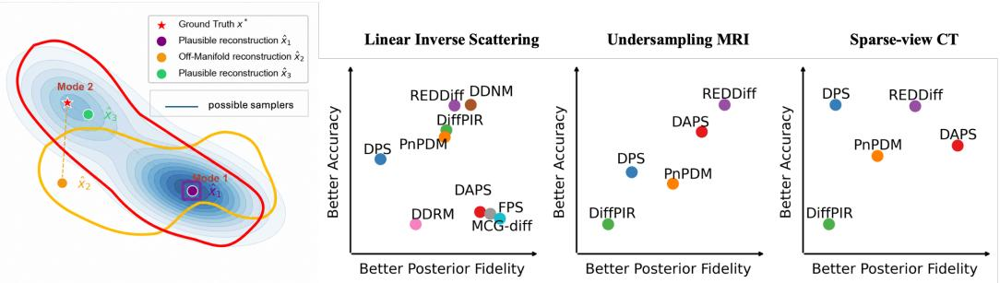

[← 返回 README](../README.md)

# 0. Abstract

## 📌 预览

摘要抛出一个核心质疑：现有扩散逆求解器（DIS）基准几乎只看重建精度（PSNR/SSIM），却忽略了**不确定性 / 分布行为**。既然随机 DIS 是用"后验样本"来表达不确定性的，那么评价的重点就应当是"生成样本分布对目标后验分布的还原程度"——即**后验保真度（posterior fidelity）**。作者的两步走：(1) 在有解析真后验的受控仿真里系统比较一大批 DIS 的后验行为；(2) 提出 **score-KSD**——一个无需真后验样本/密度、只依赖前向模型与学习到的扩散先验的诊断指标，用于真实逆问题。核心发现：**更高的重建精度并不必然意味着更好的后验一致性**。

---

Uncertainty evaluation is critical in scientific and engineering inverse problems. However, existing benchmarks on Diffusion Inverse Solvers (DIS) primarily focus on reconstruction accuracy but overlook uncertainty and distributional behavior. Since stochastic inverse solvers represent uncertainty through diffusion-based posterior samples, evaluating how well their generated samples capture the target posterior distribution becomes an important aspects of uncertainty quantification. To address this limitation and better understand this distributional behavior of diffusion samplers, we conduct a systematic study to investigate the posterior fidelity of a broad range of existing DIS methods in controlled simulation settings with known analytical true posterior. Furthermore, to enable posterior-aware evaluation on real-world inverse problem where ground-truth posterior is unavailable, we propose score-based Kernel Stein Discrepancy (score-KSD), a theoretically-grounded and ground-truth-free metric that measures the consistency of generated sample distribution from a DIS method with the target posterior score field, induced by the forward model and learned diffusion prior. Through both simulation experiments and real-world inverse problem solving, we validate the effectiveness of proposed score-KSD and demonstrate that it provides meaningful posterior fidelity diagnostics beyond reconstruction accuracy, revealing that higher reconstruction accuracy does not necessarily imply better posterior consistency.

> 💡 **问题动机 (Hao 批注)**: 这段摘要的逻辑链条要拆成三段读。
> - **诊断的对象变了**：过去评的是"点估计 $\hat{x}$ 离真值 $x^*$ 多近"（PSNR）；本文评的是"样本分布 $q(x\mid y)$ 离真后验 $p(x\mid y)$ 多近"。前者是点对点距离，后者是分布对分布距离，两者可以严重脱钩——这正是全文母命题。
> - **难点在真后验不可得**：仿真里可以算解析后验，用 Wasserstein / sliced-Wasserstein 直接比。但真实逆问题（MRI/CT）既没有真后验采样器也没有归一化密度，FID/LPIPS 这类"两分布都要采样"的指标失效。score-KSD 的卖点就是**单边**：只要生成样本 $\{x_i\}$ 加上一个可算的目标后验 score field，就能打分。
> - **对本课题（gauge-aware 盲逆问题联合后验采样）的定位**：score-KSD 提供的正是"无真后验时如何量化后验一致性"的直接工具。但要注意它默认前向算子 $\mathcal{A}$ 和噪声 $\sigma_y$ 已知；盲设置里 $\mathcal{A}=\mathcal{A}(\phi)$ 与 $\sigma$ 都要估——摘要末句"精度不等于后验一致"更是我们校准评价（SBC/coverage/CRPS）的动机基石，后续 section 会逐一拆开这两点。

---

*Figure 1: (a): Illustration of the Accuracy Trap phenomenon and distinct uncertainty behaviors by different DIS samplers. (b)∼(d): Demonstration of posterior fidelity and accuracy performance across various DIS algorithms in three inverse problems: (b) linear inverse scattering, (c) undersampling MRI, and (d) sparse-view CT reconstruction.*

> 💡 **Figure 1 批读 (Hao 批注)**: 这是全文的"论点海报"，一张图讲清"Accuracy Trap"。
> - **左图 (a) 的几何直觉**：蓝色等高线是真后验密度，有两个模态（Mode 1 主、Mode 2 弱）。红/黄两条曲线代表两个不同采样器实际覆盖的区域。关键三个点：真值 $x^*$（红星）、离流形远但离 $x^*$ 近的 $\hat{x}_2$（橙，off-manifold）、后验合理的 $\hat{x}_3$（绿）。一个 off-posterior 的 $\hat{x}_2$ 完全可能因为"恰好离 $x^*$ 近"而拿到比 $\hat{x}_3$ 更高的 PSNR——这就是"精度陷阱"的一句话定义。
> - **右侧 (b)(c)(d) 是散点定位图**：横轴"后验保真度越好→右"，纵轴"精度越高→上"。如果精度能代表后验一致性，所有方法应落在一条对角线上。实际却四散：例如 REDDiff 常在"高精度但后验保真差"（偏左上），MCG-diff/FPS 偏右（后验保真好）。**这种散布本身就是全文最强的证据**——两个坐标轴不共线，说明必须用第二个坐标轴（score-KSD）来补充评价。
> - **给本课题的读法**：这张图论证的是"需要第二个评价轴"。迁移到盲设置，我们要的不止一个轴，而是 $x$、$\phi$、$\sigma$ 三组后验各自的"保真度轴"——本文只解决了 $x$ 这一轴且假定 $\phi,\sigma$ 已知。
