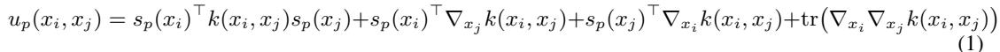
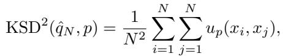

[← 返回 README](../README.md)

# 3. Posterior Fidelity Evaluation via Score-KSD

## 📌 预览

这是全文的方法核心，回答"没有真后验时怎么打分"。两步：
- **3.1 后验 score 近似**：后验密度 $p(x\mid y)$ 算不出，但它的 **score（对数梯度）可以拼出来**——似然 score 由前向模型 + 高斯噪声解析给出，先验 score 由预训练扩散模型在小 timestep 处近似。二者相加 = 近似后验 score field $\hat{s}_p(x;y)$。
- **3.2 Kernel Stein Discrepancy**：KSD 的独特性质是"只需目标分布的 score，不需目标分布的样本"。把 $\hat{s}_p$ 代入 KSD，就能仅凭 DIS 生成的样本 $\{x_i\}$ 评价它们与后验 score field 的一致性。数值越小越一致。

**数据流一句话**：`{生成样本 x_i} + y + A + σ_y + 预训练 s_θ` → 逐样本算 `似然score + 近似先验score` = `近似后验score` → 核 Stein 二次型 `u_p` 求和开方归一化 → 标量 `score-KSD`。

---

## 3.1 Posterior Score Approximation

To evaluate posterior fidelity, we seek a metric that measures how well the sample distribution induced by a DIS matches the Bayesian posterior. In synthetic settings, this can be achieved by comparing to ground-truth posterior samples. However, such samples are unavailable in realistic inverse problems, making direct distributional comparison infeasible.

> 💡 **数据流批注 (Hao 批注)**: 起点是一个"缺失"：真实场景没有真后验样本，所以任何"样本比样本"的距离（Wasserstein/FID）都用不了。接下来的所有推导都是为了绕过这个缺失——**从密度比较退化到 score 比较**。

A key observation is that, although the posterior density $p(x \mid y)$ is intractable, its score can be computed up to approximation. Using Bayes' rule $p(x \mid y) \propto p(y \mid x) p(x)$, the posterior can be decomposed into

$$
\nabla_x \log p(x \mid y) = \nabla_x \log p(y \mid x) + \nabla_x \log p(x)
$$

after taking log and gradient.

> 💡 **公式批读 (Hao 批注)**: 这是整套方法的地基。对 Bayes 公式取对数再取梯度，归一化常数（分母那个难算的证据项 $p(y)$）因为不含 $x$、梯度直接消掉。于是后验 score = **似然 score + 先验 score**，两个都可以单独搞定：似然 score 靠前向模型解析算，先验 score 靠扩散模型近似。这就是"密度算不出但 score 能拼"的关键——KSD 恰好只吃 score。

Assuming Gaussian measurement noise $\varepsilon \sim \mathcal{N}(0, \sigma_y^2 I)$, the likelihood score is analytically available

$$
\nabla_x \log p(y \mid x) = \frac{1}{\sigma_y^2} J_{\mathcal{A}}(x)^\top \big(y - \mathcal{A}(x)\big),
$$

where $J_{\mathcal{A}}(x)$ is the Jacobian of A and it reduces to $\sigma_y^{-2} \mathcal{A}^\top (y - \mathcal{A}x)$ in the linear inverse problem. Moreover, although the prior score on clean image $\nabla_x \log p(x)$ is unavailable, it can be approximated using the pretrained diffusion model through the pretrained score function $s_\theta(x_t, t)$ at small diffusion sampling timestep t. Specifically, for a collection of small diffusion times $\{t_k\}_{k=1}^{K}$, we perturb x as $x_{t_k} = \alpha_{t_k} x + \sigma_{t_k} z_k, \; z_k \sim \mathcal{N}(0, I)$, and average them to approximate the diffusion score for clean images:

$$
\widehat{s}_{\text{prior}}(x) = \frac{1}{K} \sum_{k=1}^{K} \alpha_{t_k} s_\theta(x_{t_k}, t_k).
$$

This yields an approximated posterior score $\hat{s}_p(x; y) = \nabla_x \log p(y \mid x) + \widehat{s}_{\text{prior}}(x)$. The practical approximation details are provided in Appendix A.

> 💡 **公式批读 (Hao 批注)**: 逐项拆两块 score：
> - **似然 score（解析、精确）**：假设高斯噪声后，$\nabla_x\log p(y\mid x)=\sigma_y^{-2}J_{\mathcal{A}}^\top(y-\mathcal{A}(x))$。线性算子时 Jacobian 退化成 $\mathcal{A}^\top$，就是"残差 $y-\mathcal{A}x$ 经伴随算子回投、按噪声方差缩放"。**注意这一项显式吃 $\sigma_y$ 和 $\mathcal{A}$——两者必须已知**，这正是 Section 6 承认的局限，也是盲设置的障碍。
> - **先验 score（近似）**：clean 图的先验 score 拿不到，但可以在**极小的 timestep** $t_k$ 处用扩散网络 $s_\theta$ 逼近。做法：对同一个 $x$ 加 $K$ 次小噪声得到 $x_{t_k}$，查网络 score 再按 $\alpha_{t_k}$ 加权平均，降低单次采样方差。附录 A.2 给的具体数值：EDM 参数化下 $\sigma_{\text{score}}=0.3$、$M=4$ 次扰动。
> - **拼装**：两者相加 = $\hat{s}_p(x;y)$，一个"逐点可求值的后验 score field"。这就是 score-KSD 的唯一外部输入。**对本课题**：这套"似然 score（前向给）+ 先验 score（扩散给）"的加法拼装，是我们评价 $x$-后验时可直接复用的模板；难点是把 $J_{\mathcal{A}}$、$\sigma_y$ 换成依赖 $\phi,\sigma$ 的版本。

## 3.2 Kernel Stein Discrepancy

Given this approximated posterior score induced by the pretrained diffusion score function $s_\theta$, together with generated N posterior samples from a DIS method $\{x_i\}_{i=1}^{N}$, we can evaluate its posterior fidelity without access to posterior samples by using Kernel Stein Discrepancy (KSD) [29]. KSD provides a score-based measure of whether generated samples are consistent with the Stein identity associated with the target posterior distribution.

> 💡 **机制拆解 (Hao 批注)**: 这里点明 KSD 之所以是"天选度量"：KSD 衡量的是"样本是否满足目标分布对应的 Stein 恒等式"，而 Stein 恒等式只依赖目标分布的 score（$s_p$）——不需要目标分布的样本，也不需要归一化常数。于是 score-KSD = 把 3.1 拼出来的 $\hat{s}_p$ 塞进 KSD。输入方 $\{x_i\}$ 是被评价的 DIS 样本，目标方只贡献一个 score field。

### Algorithm 1: Score-Based KSD for DIS

```
Require: {x_i}_{i=1}^N , y , A , s_θ
1: for i = 1, ..., N do
2:     s_lik(x_i) = (1/σ_y^2) A^T (y - A x_i)                       # 似然 score
3:     z_k ~ N(0, I)
4:     ŝ_prior(x_i) = (1/K) Σ_{k=1}^K α_{t_k} s_θ(α_{t_k} x_i + σ_{t_k} z_k, t_k)   # 近似先验 score
5:     ŝ_p(x_i) = s_lik(x_i) + ŝ_prior(x_i)                         # 近似后验 score
6: end for
7: Compute u_p(x_i, x_j) using Equation 1.
8: return score-KSD = (1/N) sqrt( Σ_{i,j=1}^N u_p(x_i, x_j) / d )
```

> 💡 **数据流批注 (Hao 批注)**: Algorithm 1 就是 score-KSD 的完整实现流程，把它当伪代码复现基准：
> - **输入**：DIS 生成的 $N$ 个样本、观测 $y$、前向算子 $\mathcal{A}$、噪声尺度 $\sigma_y$（隐含）、预训练 score 网络 $s_\theta$。
> - **循环体（逐样本）**：第 2 行算解析似然 score；第 3–4 行用 $K$ 次小噪声扰动近似先验 score；第 5 行相加得每个样本处的后验 score $\hat{s}_p(x_i)$。
> - **成对项（第 7 行）**：对所有样本对 $(i,j)$ 算核 Stein 二次型 $u_p(x_i,x_j)$（下方 Equation 1）。这是 $O(N^2)$ 的复杂度来源。
> - **输出（第 8 行）**：把所有 $u_p$ 求和，除以维度 $d$ 归一化后开方、再除 $N$，得一个标量 score-KSD。**越小 = 样本分布越贴合后验 score field**。整套只需前向模型 + 扩散先验，不碰真后验样本——这就是"ground-truth-free"。

Let $q(x \mid y)$ denote the implicit sample distribution induced by a DIS method, and let $\widehat{s}_p(x; y)$ denote the approximated posterior score. For a test function $f : \mathbb{R}^d \to \mathbb{R}^d$, the Langevin Stein operator is $\mathcal{T}_p f(x) = \widehat{s}_p(x; y)^\top f(x) + \nabla_x \cdot f(x)$. Under standard regularity conditions, if $X \sim p(x \mid y)$ then $\mathbb{E}[\mathcal{T}_p f(X)] = 0$ (see Proposition 1). KSD measures the maximum violation of this identity over a reproducing kernel Hilbert space (RKHS): $\text{KSD}(q, p) = \sup_{\|f\|_{\mathcal{H}^d} \leq 1} \mathbb{E}_{X \sim q}[\mathcal{T}_p f(X)]$. For empirical samples $\hat{q}_N = \frac{1}{N} \sum_{i=1}^{N} \delta_{x_i}, \; x_i \sim q(x \mid y)$, the squared KSD admits the closed-form empirical estimator $\text{KSD}^2(\hat{q}_N, p) = \frac{1}{N^2} \sum_{i,j=1}^{N} u_p(x_i, x_j)$, where



*Equation 1: 核 Stein 二次型 $u_p(x_i, x_j)$，即 Algorithm 1 第 7 行调用的核。*

> 💡 **公式批读 (Hao 批注)**: KSD 的逻辑是"用 Stein 恒等式当试金石"：
> - **Langevin Stein 算子** $\mathcal{T}_p f(x) = \hat{s}_p(x;y)^\top f(x) + \nabla_x\cdot f(x)$，只通过 $\hat{s}_p$ 依赖目标后验。
> - **Stein 恒等式**：若 $X$ 真的来自后验 $p$，则对任意光滑 $f$ 有 $\mathbb{E}[\mathcal{T}_p f(X)]=0$（Proposition 1，分部积分 + 边界消失）。
> - **KSD = 最大违反量**：在 RKHS 单位球上取 $\sup$，找"最能暴露样本不像后验"的检验函数 $f$。样本分布 $q$ 越偏离后验，违反越大。
> - **闭式估计（Equation 1 的 $u_p$）**：四项之和——score 交叉项 $s_p(x_i)^\top k\, s_p(x_j)$、两个 score 与核梯度的交叉项、以及核的二阶导迹项 $\text{tr}(\nabla_{x_i}\nabla_{x_j}k)$。妙处在于 $\sup$ 有闭式，不用真的解优化，直接对样本对求和即可。核 $k$ 用 IMQ（附录 A.1），尾部敏感。

where $k(x_i, x_j)$ is the kernel (原文此处被 MinerU 排版切断). To account for the scale of $x$, we applied a normalization in our proposed metric:

$$
\text{score-KSD} = \frac{1}{N} \sqrt{\sum_{i,j=1}^{N} u_p(x_i, x_j) / d},
$$

where d is the dimension of $x$. Throughout the paper, score-KSD refers to this empirical normalized quantity unless otherwise specified. KSD is used as a posterior-consistency diagnostic for generated samples. Under suitable kernel conditions [29, 14], KSD is nonnegative and equals zero if and only if the sample distribution matches the target posterior distribution (see Proposition 2). Consequently, within a fixed inverse problem setup, a smaller score-KSD generally indicates stronger consistency between the generated sample distribution and the target posterior score field. Note that the absolute magnitude of score-KSD depends on posterior sharpness, dimensionality, etc. Therefore, score-KSD should be interpreted as a within-task posterior-consistency diagnostic to evaluate posterior fidelity, rather than an absolute cross-task metric.

> 💡 **机制拆解 (Hao 批注)**: 两个必须牢记的使用约束，实验节反复用到：
> 1. **归一化后仍非绝对指标**：除以维度 $d$、开方、除 $N$ 是为了在同一任务内跨方法可比，但 score-KSD 的绝对量级依赖后验的"锐度"（噪声越小、观测越强，后验越尖，score 幅度越大，score-KSD 越大）。所以**只能同任务内横比方法排序，不能跨任务比大小**。这解释了为什么 Table 2 里 CT(20 view) 的 KSD 数量级到几千而 MRI 只有个位数——不是 CT 方法差，是任务后验更尖。
> 2. **KSD=0 当且仅当分布匹配**（Proposition 2，需特征核如 IMQ）：这是它作为"合优度检验"的理论保证。但有限样本下即使真后验样本 KSD 也不为 0（Section 4.2 会量化这个"有限样本参考基线"）。

Proposition 1 (Stein identity for the posterior [14, 29]). Let $p(x \mid y)$ be a differentiable posterior density on $\mathbb{R}^d$, and define its score as $s_p(x) := \nabla_x \log p(x \mid y)$. For a vector-valued test function $f : \mathbb{R}^d \to \mathbb{R}^d$, define the Langevin Stein operator $\mathcal{T}_p f(x) = s_p(x)^\top f(x) + \nabla_x \cdot f(x)$. Assume $f$ is sufficiently smooth and satisfies the boundary condition $\lim_{\|x\| \to \infty} p(x \mid y) f(x) = 0$, so that integration by parts is valid. Then, if $X \sim p(x \mid y)$

$$
\mathbb{E}_{X \sim p(x \mid y)} \left[ \mathcal{T}_p f(X) \right] = 0.
$$

Proposition 2 (KSD is a valid discrepancy measure). Kernel Stein Discrepancy satisfies the following properties:

1. Non-negativity: $\text{KSD}(q, p) \geq 0$

2. Identity of indiscernibles: Under suitable smoothness and integrability conditions on $p$ [29, 12], and for a characteristic kernel k, $\text{KSD}(q, p) = 0 \iff q(x \mid y) = p(x \mid y)$

Proposition 3 (Closed-form KSD with empirical distribution). Let $p(x \mid y)$ be the target posterior with score $s_p(x) = \nabla_x \log p(x \mid y)$, and let $q(x \mid y)$ be the sample posterior distribution induced by a sampler. Given samples $x_i \sim q(x \mid y), \; i = 1, \dots, N$, define the empirical distribution $\hat{q}_N = \frac{1}{N} \sum_{i=1}^{N} \delta_{x_i}$. Let H be an RKHS with scalar kernel k, and let $\mathcal{H}^d$ be the corresponding vector-valued RKHS. The KSD between $\hat{q}_N$ and p is $\text{KSD}(\hat{q}_N, p) = \sup_{\|f\|_{\mathcal{H}^d} \leq 1} \frac{1}{N} \sum_{i=1}^{N} \mathcal{T}_p f(x_i)$ where $\mathcal{T}_p f(x) = s_p(x)^\top f(x) + \nabla_x \cdot f(x)$. Then the squared empirical KSD admits the closed-form expression



*Equation 2: 经验 KSD 的闭式平方估计 $\text{KSD}^2(\hat{q}_N, p) = \frac{1}{N^2}\sum_{i,j} u_p(x_i, x_j)$。*

where $u_p(x_i, x_j) = s_p(x_i)^\top k(x_i, x_j) s_p(x_j) + s_p(x_i)^\top \nabla_{x_j} k(x_i, x_j) + s_p(x_j)^\top \nabla_{x_i} k(x_i, x_j) + \text{tr}\big(\nabla_{x_i} \nabla_{x_j} k(x_i, x_j)\big)$.

> 💡 **公式批读 (Hao 批注)**: 三个命题是 score-KSD 的"合法性证明链"（完整证明在附录 D）：
> - **Prop 1（Stein 恒等式）**：真后验样本让期望为 0——这是"合优度"的锚点。证明就是分部积分 + 边界项消失（散度定理）。
> - **Prop 2（有效差异度量）**：非负 + 唯一性（KSD=0 ⟺ 分布相等），需要特征核。这保证 score-KSD 不会"假阴性"（不同分布却得 0）。
> - **Prop 3（经验闭式）**：把 $\sup$ 通过 RKHS 再生性 + Cauchy-Schwarz 化成对样本对求和的闭式，$O(N^2)$ 可算。**这是能真正跑起来的原因**。
> 注意本文用 $\hat{s}_p$（近似后验 score）替换命题里的精确 $s_p$，所以理论保证是"近似意义下"的——Section 4.3 用实验证明近似 score-KSD (Ap-KSD) 与解析 score-KSD (An-KSD) 数值几乎一致，把这个近似的可靠性补上了。

> 💡 **3 小结 (Hao 批注)**:
> - **关键变量**：似然 score $s_{\text{lik}}=\sigma_y^{-2}\mathcal{A}^\top(y-\mathcal{A}x)$、近似先验 score $\hat{s}_{\text{prior}}$（$K$/$M$ 次扰动平均）、近似后验 score $\hat{s}_p$、核 Stein 项 $u_p$、标量 score-KSD。
> - **核心洞察**：把"分布比分布"（需双边样本）降维成"样本对目标 score field"（只需单边样本），这是 KSD 的结构红利；扩散模型提供先验 score、前向模型提供似然 score，正好补齐目标 score。
> - **可追问点**：(1) $\sigma_y$ 未知时怎么办？→ Section 6 列为局限。(2) $O(N^2)$ 在高维图像上代价？→ 附录 C.3 说明用 L40S GPU。(3) 迁到盲设置：似然 score 里的 $\mathcal{A},\sigma_y$ 变成 $\mathcal{A}(\phi),\sigma$，需要联合估计——本文未覆盖，是本课题的扩展面。
