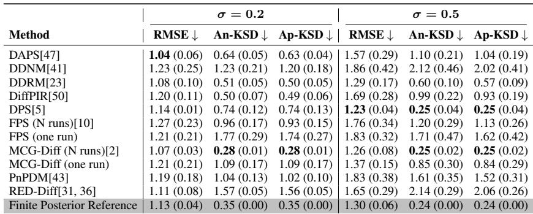

[← 返回 README](../README.md)

# 4. Numerical Simulation Study

## 📌 预览

这一节在**有解析真后验**的 toy 模型上做三件事，为 score-KSD 建立可信度：
- **4.1 定性**：用高斯混合先验的线性带噪逆问题画散点图，肉眼看不同 DIS 的后验行为（漏模态、坍塌、分散）。证据支撑"精度相近但分布行为迥异"。
- **4.2 有限样本行为**：score-KSD 随样本数 $N$、观测强度、噪声尺度如何变化——为"读数怎么解释"立规矩。
- **4.3 对齐验证**：score-KSD 的数值排序是否和散点可视化一致；近似 score (Ap-KSD) 是否接近解析 score (An-KSD)。这是 score-KSD 的"内部效度"证明。

---

## 4.1 Qualitative Analysis of Posterior Behavior

The first emphasis of this work is to understand the distributional behavior of different DIS methods in inverse problem settings. To this end, we conduct a numerical study using a mixture-of-Gaussians prior under the noisy linear inverse problem $y = \mathcal{A}x + \epsilon$, for which the analytical posterior density is available. We visualize posterior sample behavior through pairwise scatter plots and compare the generated samples against ground-truth posterior samples. These visualizations provide an intuitive assessment of posterior fidelity, including recovery of the overall posterior geometry, correlation structure, concentration, and mode coverage. Detailed experiment settings are provided in Supp B.

> 💡 **实验设计批注 (Hao 批注)**: toy 模型是"金标准环境"——因为高斯混合先验 + 线性高斯似然 = 后验有解析式，可以直接采真后验样本当参照。设计变量维度 $(d_x,d_y)=(16,14)$，前两维是双模态高斯混合（模态 (0,0) 权重 0.8、模态 (3,3) 权重 0.2），其余 14 维标准高斯（附录 B）。**关键：只可视化未观测的前两维**（0 号和 1 号维度），因为这两维承载了后验最难还原的多模态结构。

As shown in Fig. 2, some DIS methods fail to recover the weaker mode, while others preserve multimodal structure. Moreover, even within the same mode, different DIS methods exhibit diverse sample concentration behavior: some collapse a small limited region while others produce more dispersed samples that better align with the true posterior. These observations demonstrate that DIS methods have fundamentally different posterior behaviors despite generated reconstruction samples mostly fall in the plausible posterior region, highlighting the necessity of posterior fidelity evaluation beyond accuracy alone.

*Figure 2: Posterior sample comparison in toy model experiments with an inverse problem setting $(d_x, d_y) = (16, 14)$. The scatter plots visualize the unobserved dimensions 0 and 1, whose prior follows a two-mode mixture-of-Gaussians distribution with modes centered at (0, 0) and (3, 3) with sample size $N = 500$, noise scale $\sigma = 0.2$. Blue and red points denote samples from the ground-truth posterior sampler and each diffusion sampler, respectively.*

> 💡 **Figure 2 批读 (Hao 批注)**: 这张 11 面板散点是"后验保真度可视化字典"，蓝=真后验、红=方法样本，重合越好越对。按第 1 节的失败模式对号入座：
> - **模态坍塌 / 漏弱模态**：REDDiff、FPS(one run) 的红点挤成一团或只覆盖主模态附近，明显丢掉了 (3,3) 弱模态或过度集中——这类后面 score-KSD 最大（RED-Diff 1.57、FPS one run 1.77）。
> - **贴合良好**：MCG-Diff(N run)、DDRM、DiffPIR 的红蓝云基本重叠，双模态都覆盖——score-KSD 小（MCG-Diff 0.28、DDRM 0.51、DiffPIR 0.50）。
> - **过度分散 / 混合**：DPS、DAPS 红点铺得比蓝点更散或混入 off-posterior 点。
> **最重要的一句结论**：即便这些方法的重建大多落在"合理后验区"（所以 PSNR 都不差），它们的分布形态却根本不同——这就是"精度掩盖后验行为"的最直接证据，也是 score-KSD 存在的理由。

## 4.2 Empirical KSD Finite Particle Analysis

To validate our proposed score-KSD as a posterior fidelity diagnostic, we first study its finite-sample behavior using posterior samples in this numerical study. Although the population-level KSD of the true posterior satisfies $\text{KSD}(q, p) = 0$ as described in Proposition 2, the empirical score-KSD computed from a finite number of posterior samples is generally nonzero due to finite sample effects. We therefore investigate how score-KSD behaves with respect to sample size, observation strength, and measurement noise.

In Fig. 3, empirical score-KSD decreases monotonically as the number of samples N increases, approaching zero as the empirical distribution better approximates the true posterior. Moreover, larger measurement noise $\sigma_y$ and observation settings with weaker constraints or sparser observations both lead to smaller empirical score-KSD values, since they induce smoother and less sharply concentrated posterior geometries with reduced posterior-score magnitude, thereby reducing the finite-sample variability of score-KSD. Importantly, due to finite-sample effects, the empirical score-KSD computed from true posterior samples should not be interpreted as a strict lower bound of the metric, but rather as a finite-sample reference baseline in a controlled inverse-problem setting.

<table><tr><td width="50%"></td>
<td width="50%"></td></tr>
<tr><td align="center"><i>(a) $d_y=14$, obs scale ∈ [0.1, 0.75]</i></td><td align="center"><i>(b) $d_y=4$, obs scale = 3</i></td></tr></table>

*Figure 3: (a): Score-KSD curve of finite posterior samples under $(d_y = 14)$ and observations scale ∈ [0.1, 0.75] with varying measurement noise scales, (b): Score-KSD curve of finite posterior samples under $(d_y = 4)$ and observations scale = 3 with varying measurement noise scales.*

> 💡 **Figure 3 批读 (Hao 批注)**: 这两条曲线族是 score-KSD 的"标定手册"，回答"读数受什么影响"。三条规律：
> - **随 $N$ 单调下降趋 0**：样本越多，经验分布越逼近真后验，有限样本偏差越小。这验证了 Prop 2 的极限行为，也提醒复现时 $N$ 要够大（正文真实实验用 $N=50$，仿真用到 500/5000）。
> - **噪声 $\sigma_y$ 越大，score-KSD 越小**：因为噪声大→后验更平滑更宽→score 幅度小→有限样本波动小。对比 (a)(b) 里 $\sigma=0.01$（蓝，最上）和 $\sigma=0.5$（紫，最下）差出几倍。
> - **观测越弱/越稀，score-KSD 越小**：同理后验更宽。
> **这直接支撑 Section 3.2 的告诫"score-KSD 不是跨任务绝对指标"**——因为它的量级被后验锐度（由 $\sigma_y$、观测强度、维度决定）主导。最后一句关键：真后验样本的有限样本 score-KSD 只是"参考基线"，**不是严格下界**——某些方法在特定核下甚至能比真后验样本更小，读表时不能把"参考基线"当成理论最优。

## 4.3 Score-KSD Aligns with Posterior Visualization

After characterizing the finite-sample behavior of score-KSD, we next investigate whether score-KSD can meaningfully detect posterior fidelity of different DIS methods. We compute score-KSD using both the analytical posterior score derived from the exact posterior density and the approximate posterior score constructed from the likelihood model and the learned diffusion prior for each experimental setting. We further compare the numerical score-KSD values of $\sigma = 0.2$ in Table 1 with its posterior scatter visualizations in Fig. 2. We observe that methods exhibiting severe posterior mismatch, such as mode collapse or failure to recover weaker posterior modes, consistently produce larger score-KSD values using analytical score (e.g., RED-Diff: 1.57, FPS (one run): 1.77). In contrast, methods that successfully recover both posterior modes and generate samples whose geometry better aligns with the analytical posterior achieve considerably smaller values (e.g., MCG-Diff (N run): 0.28, DiffPIR: 0.50, DDRM: 0.51). This qualitative consistency between the scatter visualizations and the corresponding score-KSD rankings provides empirical evidence that score-KSD meaningfully captures posterior-consistency behavior across different DIS methods.

*Table 1: Root Mean Square Error (RMSE) for accuracy evaluation, score-KSD using analytical posterior score (An-KSD), and score-KSD using approximate posterior score (Ap-KSD) under different noise levels using sample size $N = 500$ with many weak measurements. Results are reported as mean and standard deviation across 5 noise draws generated from $N \sim (0, \sigma^2)$.*

> 💡 **Table 1 批读（证据链核心） (Hao 批注)**: 这是全文最关键的一张表——它同时给三列：RMSE（精度）、An-KSD（解析 score 的 KSD）、Ap-KSD（近似 score 的 KSD），让"精度 vs 后验保真"的错位一目了然。
> - **精度不区分后验**：看 $\sigma=0.2$ 列，RMSE 全挤在 1.0–1.3（DAPS 1.04、RED-Diff 1.11、MCG-Diff 1.07），几乎无差别；但 An-KSD 从 0.28（MCG-Diff N run）到 1.77（FPS one run）差了 6 倍多。**RMSE 看不出的后验差异，score-KSD 一眼分开**——这就是 Accuracy Trap 的数值版。
> - **排序与散点一致**：An-KSD 最大的 RED-Diff(1.57)/FPS one run(1.77) 正是 Figure 2 里坍塌/漏模态的；最小的 MCG-Diff N run(0.28)/DiffPIR(0.50)/DDRM(0.51) 正是散点贴合的。可视化与数值互证 = 内部效度。
> - **近似≈解析**：Ap-KSD 与 An-KSD 几乎逐格相等（如 DAPS 0.64/0.63、DPS 0.74/0.74）。**这是 score-KSD 能落地真实任务的命门**——真实任务只有 Ap-KSD 可算，这里证明它可靠替代 An-KSD。
> - **参考基线**：Finite Posterior Reference 的 An-KSD=0.35，并非最小（MCG-Diff N run 0.28 更小），再次印证 4.2 的"参考基线非下界"。
> - **单/多次运行差异**：MCG-Diff/FPS 的"N runs"远好于"one run"（MCG-Diff 0.28 vs 1.09），因为单次运行的粒子滤波样本相关性强、覆盖差。对本课题：这提醒我们评价采样器时要区分"独立多链"与"单链"，否则误判后验保真。

Moreover, score-KSD computed using the approximate posterior score is close to the score-KSD using the analytical posterior score across different methods and noise scales, supporting that our proposed posterior score approximation based on the likelihood model and learned diffusion prior provides a practical and effective tool for posterior-consistency evaluation when the analytical posterior score is unavailable. Finally while posterior reference samples provide an important calibration baseline, they do not necessarily attain the minimum score-KSD due to finite-sample error. In particular, some samplers may produce more regular or score-consistent finite sample sets under the chosen kernel, leading to slightly smaller score-KSD values than finite posterior samples. We therefore interpret score-KSD primarily as a posterior-consistency diagnostic based on finite-sample score information within the same task under finite samples, rather than as an absolute population-level discrepancy metric.

> 💡 **4 小结 (Hao 批注)**:
> - **关键数字**：$\sigma=0.2$ 下 An-KSD 跨方法 0.28→1.77（差 6×），而 RMSE 仅 1.04→1.27；Ap-KSD 与 An-KSD 逐格接近；有限样本参考基线 An-KSD=0.35。
> - **核心洞察**：(1) 精度对后验形态几乎盲；(2) score-KSD 排序与散点可视化一致，且近似 score 可靠替代解析 score；(3) 参考基线是"finite-sample reference"而非严格下界。
> - **可追问点**：多次 vs 单次运行的 score-KSD 差距说明"样本独立性"是后验保真的隐藏变量——盲设置里联合采样 $(x,\phi,\sigma)$ 时更要小心链间相关。
