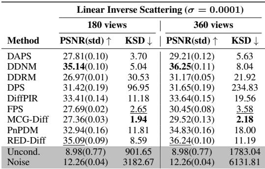
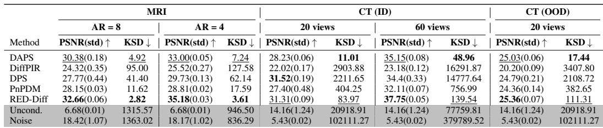

[← 返回 README](../README.md)

# 5. Real Data Experiments

## 📌 预览

把 score-KSD 搬到**没有真后验**的三个真实科学逆问题：线性逆散射、欠采样 MRI、稀疏视角 CT（含 OOD 癌症 CT）。跑法：每个观测让 DIS 用 50 个随机种子生成 50 个后验样本，同时报 PSNR（精度）和 score-KSD（后验保真）。五条发现依次论证 score-KSD 的外部效度：能区分平凡基线、跨任务部分一致、同任务跨图稳定、捕捉精度之外的分布行为、OOD 下退化。

---

## 5.1 Experiment Setup

Tasks and Datasets. We evaluate the posterior fidelity performance of DIS methods through our proposed score-KSD on three representative real-data inverse problems: (i) linear inverse scattering, (ii) under-sampling MRI reconstruction, and (iii) sparse-view CT reconstruction.

For the linear inverse scattering (data from [42]) and multi-coil MRI (fastMRI knee data from [46]), we follow the corresponding experimental setups in InverseBench [49]. For inverse scattering, we consider the number of receivers M = 180, 360 and the noise scale $\sigma = 0.0001$, while for sparse-sampling MRI, we evaluate ×4 and ×8 acceleration rate (AR) and noise scale $\sigma = 0.01$

For sparse-view CT (SVCT) task, we conduct experiments using the LIDC-IDRI dataset [1]. The original CT volumes are resampled to a slice thickness of 1 mm, and each slice is resized to 256×256. The training set consists of 23,040 images, and in-distribution evaluation is conducted on the hold-out data. The diffusion model is trained using the pipeline proposed in [22] and the same trained model is used for all PnPDP methods. For out-of-distribution (OOD) evaluation, we use Lung-PET-CT-Dx dataset [28] from cancer patients. We directly use the pretrained diffusion models from LIDC-IDRI dataset as the prior for reconstructing images from Lung-PET-CT-Dx dataset without any adaptation, thus as OOD task with imperfect or mismatch priors.

> 💡 **实验设计批注 (Hao 批注)**: 任务设计有两个用心处：
> - **复用 InverseBench [49] 的 setup**：逆散射和 MRI 直接沿用其超参（附录 C.2），保证"精度侧"与已有基准可比，只在其上加"后验保真侧"。这让 Accuracy Trap 的论证站在公认基准之上而非自定义环境。
> - **专门设计 OOD 任务**：用 LIDC 训的扩散先验去重建 Lung-PET-CT-Dx 癌症 CT，不做任何适配——**故意制造先验失配（EU 增大）**，用来检验 score-KSD 能否感知"先验错了"。这是 2.3 节 EU 概念的实证入口，也和本课题"先验失配下的校准"高度相关。

Evaluation Procedure. For each task, we first sample a noise $\epsilon \sim N(0, \sigma^2)$, and generate the simulated observation $y = Ax + \epsilon$. We run each DIS method $N = 50$ times with different random seeds to generate posterior samples for the simulated observation y. We evaluation reconstruction accuracy using PSNR and accessing posterior fidelity using the proposed score-KSD metric. See more details for hyperparameter settings in Appendix C.2.

> 💡 **数据流批注 (Hao 批注)**: 复现要点——**同一个观测 $y$，跑 50 个不同随机种子得到 50 个后验样本**，这 50 个样本喂进 Algorithm 1 算一个 score-KSD。这里 $N=50$ 相对 Figure 3 建议的大 $N$ 偏小，但因为是"同任务内横比方法"、有限样本偏差对所有方法一致，排序仍有效（Section 5.2 第三条"跨图稳定"补充了鲁棒性证据）。注意：真实任务里真后验根本不存在，所以只能用 Ap-KSD（近似 score）——Table 1 已证其可靠。

*Figure 5: Under-sampling MRI reconstruction under ×4 acceleration rate (AR=4).*

> 💡 **Figure 5 批读 (Hao 批注)**: 这张 MRI 三行图是"精度陷阱的像素级实证"，也是理解 score-KSD 价值的最佳直观案例。三行含义：第一行是重建均值 + PSNR，第二行是平均误差图，第三行是**逐像素方差图（不确定性图）**。
> - **看 REDDiff 列**：PSNR 最高（35.25 dB），误差最小（0.0342），但第三行方差极低（0.000195）——它几乎坍塌成确定性输出，**不确定性被吃光了**。精度最好却后验保真最差。
> - **看 DiffPIR 列**：PSNR 最低（26.36 dB），方差最大（0.00719），方差图在解剖边界处高亮。
> - **关键对比**：DPS 方差 0.00272、DAPS 0.00153、PnPDM 0.00181——精度接近的方法方差差一个数量级。**这正是 PSNR 完全看不到、而 score-KSD/方差图能看到的分布行为**。对风险敏感的医学重建，REDDiff 那种"高 PSNR 零方差"是危险的（假装很确定），这条正是本文要警示的。

## 5.2 Results and Findings

*Figure 4(a): Results for linear inverse scattering task (PSNR 与 KSD，180/360 receivers，$\sigma=0.0001$)。*

*Figure 4: Performance comparison and score-KSD behavior. (b) Score-KSD with various measurement noise scales in 20-view CT reconstruction task.*

> 💡 **Figure 4 批读 (Hao 批注)**: 两部分互补。
> - **(a) 逆散射表**：注意平凡基线 Uncond.（无条件采样）和 Noise（纯噪声）的 KSD 是 901.65 / 3182.67，比所有 DIS 高 2–3 个数量级；而 DIS 里 MCG-Diff(1.94)、FPS(2.65) 最低，DPS 高达 96.95。**再次出现精度陷阱**：DPS 的 PSNR(31.42) 不低，KSD 却是 DIS 里最差的之一——高精度、低后验保真。
> - **(b) CT 噪声曲线**：score-KSD 随测量噪声尺度变化的趋势，呼应 Figure 3 的规律（噪声改变后验锐度进而改变 KSD 量级），说明真实任务里同样要"固定噪声尺度再横比方法"。

*Table 2: Results comparison of different DIS methods in MRI and CT reconstruction tasks (averaged value across 50 samples for one target image). Experiments are held on MRI measurements degraded with $\sigma = 0.01$, in-distribution (ID) CT measurements degraded with $\sigma = 0.1$, and out-of-distribution (OOD) CT measurements degraded with $\sigma = 0.1$. (Bold marks the best value for each reported metric, and underline marks the second-best value.)*

> 💡 **Table 2 批读（主结果） (Hao 批注)**: 这是真实任务的总账本，五条发现都能在这张表里找到数字支撑：
> - **平凡基线拉开量级**：Uncond./Noise 的 KSD 在 CT(20 view) 高达 2 万–10 万级，所有 DIS 都在几十到几千级——score-KSD 确实"能识别有意义的后验行为 vs 垃圾输出"（发现 1）。
> - **精度与后验保真无单调关系**：CT(20 view) 里 DPS 的 PSNR(31.52) 高于 DAPS(28.23)，但 DPS 的 KSD(2211.65) 比 DAPS(11.01) 差两个数量级；DiffPIR PSNR 最低(22.02) 而 KSD 最差(2903.88)。**高 PSNR 完全不保证低 KSD**（发现 4，核心命题的真实数据证据）。
> - **跨任务部分一致**：DAPS、RED-Diff 在多数设置的 KSD 都相对好，说明存在稳定的后验保真行为（发现 2）；但绝对排序随任务变（KSD 是同任务诊断）。
> - **OOD 退化**：CT(OOD) 20 views 相比 ID，所有方法 PSNR 下降、KSD 上升（如 DAPS ID 11.01 → OOD 17.44），说明先验失配时后验一致性变差——score-KSD 能感知 EU 增大（发现 5）。

Score-KSD distinguishes meaningful posterior behavior from trivial baselines. We add the unconditional prior sampling and pure noise images as the trivial baseline for an intuitive comparison. Across all real-world inverse problem tasks in Table 2, all DIS methods achieve substantially smaller score-KSD values than these two trivial baselines within the same task. This indicates that score-KSD meaningfully captures the posterior behaviors.

Score-KSD ranking exhibits partial cross-task consistency. We observe partially consistent score-KSD rankings across different inverse-problem tasks. Some DIS methods consistently achieve better performance in score-KSD across multiple settings, as demonstrated in Fig. 1(b)-(d)), suggesting a stable posterior fidelity behavior. Meanwhile, we also observe that the score-KSD rankings remain task-dependent, consistent with the fact that score-KSD is a within-task posterior-consistency diagnostic, since posterior score can vary substantially with forward operators, noise scales, etc.

Score-KSD is stable for different test images within the same task. Although score-KSD values are not directly comparable across different inverse problems, we observe stable score-KSD behavior across different test images within the same task setting as shown in Appendix (Table 5 and 6). This finding supports the robustness of score-KSD as a within-task posterior-consistency diagnostic.

Score-KSD captures distributional behavior beyond accuracy. Methods with similar accuracy can exhibit substantially different score-KSD values (Fig. 1(b)-(d)) and pixel variance maps (Fig. 5), and we do not observe any monotonic relationship in which better reconstruction accuracy necessarily corresponds to better posterior fidelity. These results highlight that accuracy alone fails to fully characterize the behavior of stochastic DIS algorithms, and our proposed score-KSD serves as an important complementary metric for evaluating posterior consistency behavior beyond accuracy.

> 💡 **证据链批注 (Hao 批注)**: 把四条发现按"证明什么"归类，方便引用：
> - **发现 1（区分平凡基线）= 灵敏度下界**：证明 score-KSD 不是随机噪声，至少能把"真采样器"和"乱采样"分开。
> - **发现 2（跨任务部分一致）+ 发现 3（同任务跨图稳定）= 鲁棒性**：告诉你这个诊断在同任务内可信（附录 Table 5/6 支撑跨图稳定），但别拿绝对值跨任务比。
> - **发现 4（超越精度）= 核心命题**：Table 2 + Figure 5 的方差图共同证明"精度和后验保真无单调关系"。这是全文最重要的结论，也是本课题"为什么不能只用重建误差校准"的直接引证。

Ablation Study on OOD task and hyperparamter sensitivity. We further explored OOD inverse problems and hyperparameter sensitivity, discovering that DPS is highly sensitive to hyperparameter choices while DAPS requires hyperparameter adjustment to obtain reasonable reconstruction quality (Table 8 and Sec. C.2 in Appendix). OOD settings consistently lead to degraded reconstruction quality together with larger score-KSD values, indicating worse posterior consistency (Table 2).

> 💡 **消融解读 (Hao 批注)**: 两点消融很有实操价值：
> - **超参敏感性**：附录 Table 8 显示 DPS 的 guidance scale 从 0.2→1.0，PSNR 从 30.81 跌到 21.05，KSD 从 45 万飙到 322 万——**DPS 极度不稳，一调超参后验保真崩盘**。DAPS 也需要专门调噪声级才有合理重建。这提醒：score-KSD 的排序会被超参左右，横比时必须锁定各方法的最佳/公平超参（本文用 InverseBench 的超参表）。
> - **OOD 一致退化**：先验失配→精度降 + KSD 升，双双变差，说明 score-KSD 对"先验错了"敏感。**对本课题**：这正是我们关心的场景——当扩散先验或算子参数 $\phi$ 标定不准时，后验会失配，需要能感知这种失配的诊断。score-KSD 在 $x$ 这一维给了范例。

> 💡 **5 小结 (Hao 批注)**:
> - **关键数字**：平凡基线 KSD 比 DIS 高 2–3 个数量级；CT(20 view) DPS PSNR(31.52)>DAPS(28.23) 但 KSD(2211.65)≫DAPS(11.01)；OOD 使 DAPS KSD 11.01→17.44；DPS guidance 0.2→1.0 使 KSD 45万→322万。
> - **核心洞察**：真实任务里"高 PSNR ≠ 低 score-KSD"被反复证实（Table 2、Fig 5 方差图），score-KSD 是精度之外的必要补充；它是同任务诊断（跨图稳、跨任务量级不可比）。
> - **可追问点**：$N=50$ 是否足够？超参敏感性是否会污染排序？OOD 下 KSD 上升是先验失配还是 $\sigma$ 估计偏差所致？——最后一点直指 Section 6 的局限，也是盲设置的核心风险。
