[← 返回 README](../README.md)

# 附录 (Appendix A–D)

## 📌 预览

附录补齐四块细节：**A** score-KSD 的实现细节（IMQ 核、先验 score 近似的具体参数）；**B** 数值仿真的完整设定（高斯混合先验、两种前向算子、两种噪声、真值 $x$）与 Table 3；**C** 真实数据的补充结果（Table 4/5/6、Figures 6–11、超参 Table 7、DPS 超参敏感性 Table 8、计算资源）；**D** 三个命题的完整证明。

---

## A. Details for score-KSD

### A.1 IMQ Kernel

We use the inverse multiquadric (IMQ) kernel

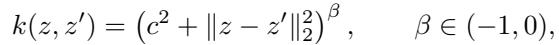

*IMQ 核：$k(z,z')=(c^2+\|z-z'\|_2^2)^\beta,\; \beta\in(-1,0)$。*

with $\beta = -1/2$. The scale parameter c is chosen adaptively as $c = \frac{1}{\text{median}(s(A)) + 1}$, to keep a fair comparison across each method within the same task, where $s(A)$ denotes the singular values of the forward operator A.

The IMQ kernel is widely used in the KSD literature due to its strong empirical performance and favorable theoretical properties for detecting distributional mismatch, particularly in the tails [13]. While the choice of kernel is not unique and can influence the absolute KSD values and relative rankings, the IMQ kernel provides a robust and sensitive measure of posterior inconsistency in practice.

> 💡 **实现细节批注 (Hao 批注)**: 两个复现关键：(1) **核选 IMQ 而非高斯 RBF**，因为 IMQ 尾部敏感、能抓住"漏模态/尾部不覆盖"这类后验失配，正是 Figure 2 里要检测的病。(2) **尺度 $c$ 用前向算子 $\mathcal{A}$ 的奇异值中位数自适应**，$c=1/(\text{median}(s(\mathcal{A}))+1)$——这保证同一任务内所有方法用同一个核（公平横比），也把核尺度锚定到问题的几何上。作者也坦承核的选择会影响绝对值和排序，所以 score-KSD 的排序是"给定核 + 给定任务"下的诊断。

### A.2 Prior Score Approximation Details

For approximate posterior score in score-KSD computation, we approximate the clean prior score using the pretrained diffusion score network evaluated near the clean-data limit. In our EDM implementation, the network is parameterized by the noise scale σ with noise level $\sigma_{\text{score}} = 0.3$ and draw $M = 4$ independent Gaussian perturbations for each sample x. The approximate prior score is computed as

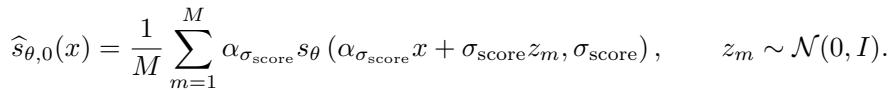

*近似先验 score：$\widehat{s}_{\theta,0}(x)=\frac{1}{M}\sum_{m=1}^{M}\alpha_{\sigma_{\text{score}}}s_\theta(\alpha_{\sigma_{\text{score}}}x+\sigma_{\text{score}}z_m,\sigma_{\text{score}}),\; z_m\sim\mathcal{N}(0,I)$。*

We then construct the approximate posterior score by combining the likelihood score with the approximated prior score.

> 💡 **实现细节批注 (Hao 批注)**: 这是 Section 3.1 里 $\hat{s}_{\text{prior}}$ 的落地版。EDM 参数化下用 $\sigma_{\text{score}}=0.3$（接近 clean-data 极限的小噪声）、每个样本做 $M=4$ 次独立高斯扰动再平均。**为什么在小 $\sigma_{\text{score}}$ 处查**：clean 图先验 score 无法直接得，但扩散网络在小噪声处的 score 最接近 clean 先验 score；平均 $M$ 次是降方差。这里 $K$（Section 3）在实现中即 $M=4$。复现时这两个数（0.3 与 4）是关键旋钮。

## B. Numerical Simulations Settings and Additional Results

Prior Distribution. We define a structured prior distribution over the unknown signal $x \in \mathbb{R}^{16}$. The first two coordinates $(x_1, x_2)$ follow a two-component Gaussian mixture model, while the remaining coordinates are modeled as independent standard Gaussian variables. Specifically, let

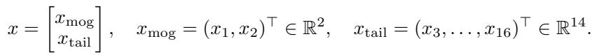

The mixture prior on the first two dimensions is

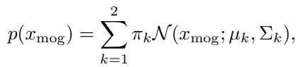

with mixture weights $\pi_1 = 0.8, \; \pi_2 = 0.2$, means $\mu_1 = [0,0]^\top, \; \mu_2 = [3,3]^\top$, and covariance matrices $\Sigma_1 = I_2, \; \Sigma_2 = 2 I_2$.

For the remaining coordinates, we use an independent Gaussian tail prior $x_{\text{tail}} \sim \mathcal{N}(0, I_{14})$. Therefore, the full prior factorizes as

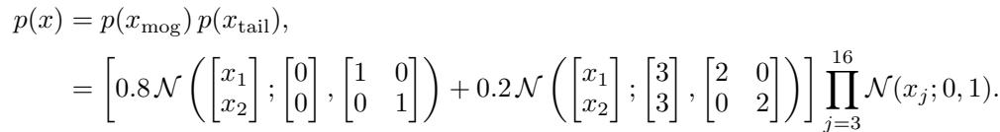

> 💡 **仿真设定批注 (Hao 批注)**: 这个先验的设计非常"教科书式刻意"：前 2 维是双模态高斯混合（主模态 (0,0) 权重 0.8、弱模态 (3,3) 权重 0.2、协方差不同），后 14 维是无聊的标准高斯。**用意**：把"难还原的多模态结构"集中到前 2 维，这样 Figure 2 只画这 2 维就能暴露"漏弱模态/坍塌"；后 14 维当"填充"保证维度够高、似然 score 有意义。弱模态权重仅 0.2 是故意的——它最容易被采样器漏掉，是区分方法的试金石。

Forward Operator and Noise Model. We consider four experimental settings formed by combining two forward operators and two noise models:

- **(A1) many-weak-observation**. The forward operator $A \in \mathbb{R}^{14 \times 16}$ observes most coordinates of x with individual scaling: $y_i = s_i x_{\mathcal{I}_i}, \; i = 1, \dots, 14$, where $\mathcal{I} = \{3, 4, \dots, 16\}, \; s = (0.1, 0.15, 0.2, \dots, 0.75)^\top$. The forward matrix is defined by

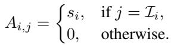

- **(A2) few-strong-observation**. The forward operator $A \in \mathbb{R}^{4 \times 16}$ observes only a small subset of coordinates with uniform scaling: $y_i = 3 x_i, \; i = 1, \dots, 4$. The matrix is given by

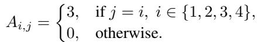

Noise Models: $y = Ax + \epsilon, \; \epsilon \sim N(0, \sigma^2)$; (N1) $\sigma = 0.5$; (N2) $\sigma = 0.2$.

Ground Truth x:

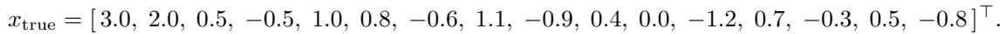

> 💡 **仿真设定批注 (Hao 批注)**: 两种前向算子对应两种病态形态，这解释了为什么正文和附录要分表报（Table 1 many-weak vs Table 4 few-strong）：
> - **A1 many-weak（14×16）**：观测很多维但每维缩放很弱（0.1→0.75），且**不观测前 2 维**（$\mathcal{I}$ 从第 3 维起）——所以前 2 维的多模态完全靠先验撑，后验最难还原。
> - **A2 few-strong（4×16）**：只观测前 4 维但缩放强（×3）——前 2 维被强观测锁定，后验更尖。
> 两者噪声各配 0.2/0.5 = 四种组合。**这套设计让 score-KSD 在"后验宽/尖 × 观测强/弱"的四象限里都被测过**，是它"within-task diagnostic"结论的实验基础。

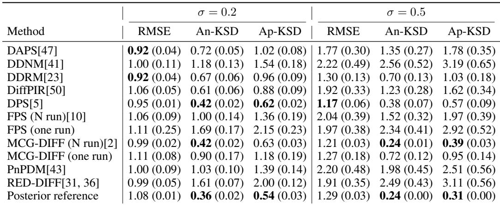

*Table 3: RMSE, An-KSD, Ap-KSD under different noise levels using sample size $N = 100$ with many weak observations.*

> 💡 **Table 3 批读 (Hao 批注)**: 这是 Table 1（$N=500$）的小样本版（$N=100$，many-weak）。对比两表能看出**有限样本效应**：$N=100$ 时 Ap-KSD 明显高于 An-KSD（如 DAPS 1.02 vs 0.72），差距比 $N=500$ 时大——样本少时近似 score 的噪声更突出。但**方法间的相对排序基本不变**（MCG-Diff/DPS 仍小，RED-Diff/FPS one run 仍大），印证 score-KSD 作为排序诊断对样本量鲁棒。

## C. Additional Real Data Experiment

### C.1 Additional Results

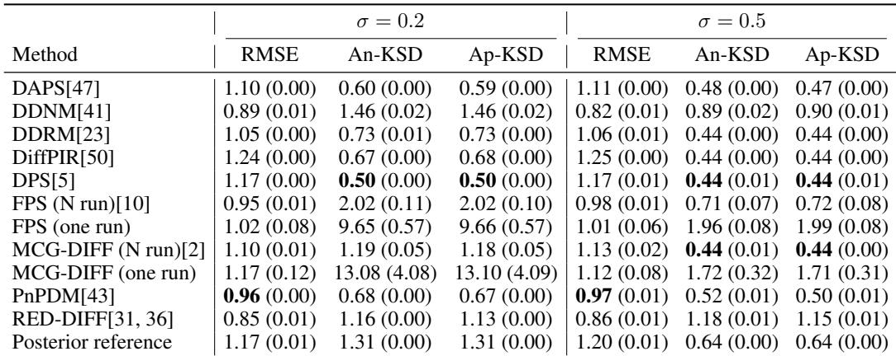

*Table 4: RMSE, An-KSD, Ap-KSD under different noise levels using sample size $N = 500$ with few strong observations.*

> 💡 **Table 4 批读 (Hao 批注)**: few-strong 设置（A2）。注意 FPS(one run) 和 MCG-Diff(one run) 的 KSD 在 $\sigma=0.2$ 时暴涨（9.65、13.08），远超 many-weak 时——**强观测让后验更尖，单次运行的粒子相关性问题被放大**。这再次说明：后验越尖（观测强/噪声小），对采样器的后验保真要求越苛刻，score-KSD 的判别力也越强。

<table><tr><td width="50%"></td>
<td width="50%"></td></tr>
<tr><td align="center"><i>Figure 6: Inverse linear scattering, 180 receivers</i></td><td align="center"><i>Figure 7: Inverse linear scattering, 360 receivers</i></td></tr></table>

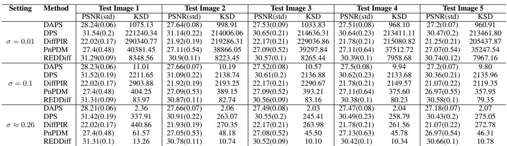

*Table 5: PSNR and KSD scores across five test images on 20-view CT reconstruction (InD) under different degradation settings.*

<table><tr><td width="50%"></td>
<td width="50%"></td></tr>
<tr><td align="center"><i>Figure 8: Sparse-sampling MRI, AR=8</i></td><td align="center"><i>Figure 9: 20 view CT reconstruction (InD)</i></td></tr></table>

<table><tr><td width="50%"></td>
<td width="50%"></td></tr>
<tr><td align="center"><i>Figure 10: 20 view cancer CT reconstruction (OOD)</i></td><td align="center"><i>Figure 11: 60 view CT reconstruction (InD)</i></td></tr></table>

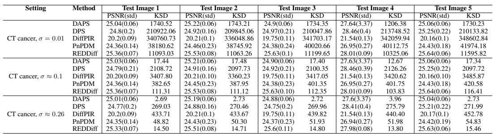

*Table 6: PSNR and KSD scores across five test images on 20-view cancer CT reconstruction (OOD) under different degradation settings.*

> 💡 **Table 5/6 与 Figures 6–11 批读 (Hao 批注)**: 这批补充结果支撑正文的两条发现：
> - **同任务跨图稳定（发现 3）**：Table 5/6 把同一任务下 5 张测试图的 KSD 并排，同一方法的 KSD 在 5 张图上量级一致（如 20-view CT σ=0.1 下 DAPS 恒在 9.8–11.0），说明 score-KSD 不是对单张图过拟合的读数，可作稳定的 within-task 诊断。
> - **噪声改变量级（呼应 Figure 3）**：Table 5 同一方法在 σ=0.01/0.1/0.26 三档下 KSD 差几个数量级（DAPS 从 ~1000 → ~11 → ~2.3），再次证明 KSD 绝对值被后验锐度主导，绝不能跨噪声档比。
> - **Figure 10（OOD）vs Figure 9/11（InD）**：视觉上 OOD 癌症 CT 的重建质量与不确定性结构明显劣于 InD，与 Table 2 的"OOD KSD 上升"一致。

### C.2 Hyperparameter Details

For tasks (i) linear inverse scattering (180 and 360 views respectively) and (ii) MRI (simulated), we adopt the solver hyperparameters from Table 12 of InverseBench [49] except for the noise level in DAPS for MRI task, where we fail to make reasonable reconstruction, and made a sweeping based on best accuracy, then changed the noise level into 0.008. For the CT task, hyperparameters are tuned separately following standard validation procedures as stated in InverseBench [49] Section B.7.2. All hyperparameters are reported in Table 7.

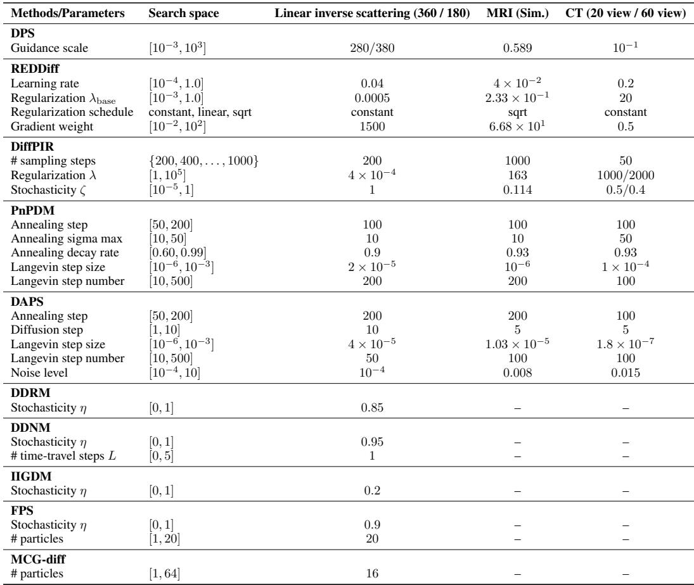

*Table 7: Hyperparameter settings used for each inverse problem.*

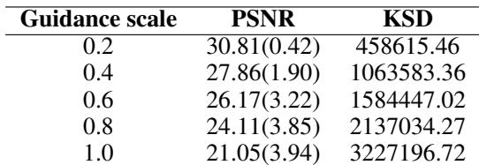

*Table 8: Hyperparameter sensitivity evaluation on DPS solving 20-view CT reconstruction degraded with $\sigma = 0.01$.*

> 💡 **Table 7/8 批读 (Hao 批注)**: Table 8 是全文最尖锐的超参消融——DPS 的 guidance scale 从 0.2→1.0，PSNR 单调下降（30.81→21.05），KSD 单调暴涨（458615→3227197，约 7 倍）。**含义**：(1) score-KSD 对超参极敏感，横比方法时必须锁定各自公平超参（本文用 InverseBench 表）；(2) 这也暴露 DPS 这类梯度引导法本身的脆弱——引导强度稍大就同时牺牲精度与后验保真。Table 7 给出全部方法的可复现超参，是复现基准的必查表。

### C.3 Computation Resources

- **Diffusion Prior Training.** Training of the CT diffusion prior model was performed using a single NVIDIA A100 GPU for approximately two days.
- **Inference and Sampling.** Inference and sampling experiments were conducted using a combination of NVIDIA L40S GPUs and A100 GPUs. Each inference takes 1-5 minutes depends on different methods.
- **KSD Experiments.** Kernel Stein Discrepancy (KSD) evaluation used L40S GPUs.

> 💡 **计算成本批注 (Hao 批注)**: score-KSD 的边际成本不高——它是"评价时"的一次性 $O(N^2)$ 计算（$N=50$ 很小），跑在 L40S 上即可；真正贵的是 DIS 推理本身（每次 1–5 分钟）和先验训练（A100 两天）。**对本课题**：这意味着把 score-KSD 作为校准诊断加进评价管线几乎零额外成本，可与 SBC/coverage/CRPS 并行计算。

## D. Proof

### Proof of Proposition 1 (Stein 恒等式)

By definition,

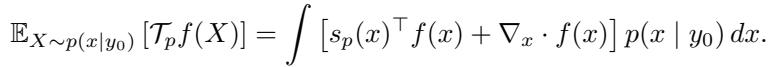

Since $s_p(x) = \nabla_x \log p(x \mid y_0) = \frac{\nabla_x p(x \mid y_0)}{p(x \mid y_0)}$, we have $s_p(x) p(x \mid y_0) = \nabla_x p(x \mid y_0)$. Therefore,

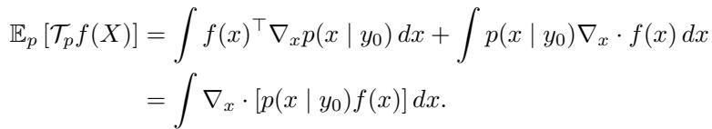

By the divergence theorem and the boundary condition, $\int \nabla_x \cdot [p(x \mid y_0) f(x)] dx = 0$. Hence $\mathbb{E}_{X \sim p(x | y_0)}[\mathcal{T}_p f(X)] = 0$.

> 💡 **证明批读 (Hao 批注)**: Prop 1 的证明就一招——**分部积分 / 散度定理**。把 score 乘密度还原成密度的梯度 $s_p\, p=\nabla p$，于是 $\mathbb{E}[\mathcal{T}_p f]$ 变成一个全散度的积分 $\int\nabla\cdot[pf]$，在边界条件（$p f$ 在无穷远趋 0）下积分为 0。这就是"真后验样本让 Stein 期望归零"的数学根据，也是 score-KSD 能当合优度检验的起点。

### Proof of Proposition 2 (有效差异度量)

Non-negativity: since the zero function $f \equiv 0$ belongs to $\mathcal{H}^d$, $\mathbb{E}_{X \sim q}[\mathcal{T}_p f(X)] = 0$ for $f\equiv 0$, which implies $\text{KSD}(q, p) \geq 0$.

Identity of indiscernibles: if $q = p$, then by the Stein identity $\mathbb{E}_{X \sim p}[\mathcal{T}_p f(X)] = 0$ for all admissible f, so $\text{KSD}(q, p) = \sup 0 = 0$. Conversely, if $\text{KSD}(q, p) = 0$, then $\mathbb{E}_{X \sim q}[\mathcal{T}_p f(X)] = 0$ for all $f \in \mathcal{H}^d$; under standard regularity conditions on $p(x \mid y_0)$ and for a characteristic kernel k (e.g., IMQ), the only distribution satisfying these Stein identities is $p$. Hence $q(x \mid y_0) = p(x \mid y_0)$.

> 💡 **证明批读 (Hao 批注)**: Prop 2 保证 score-KSD 是"真度量"：非负（取 $f\equiv0$ 即得下界 0）+ 唯一性（KSD=0 ⟺ 分布相等）。唯一性的正向靠 Stein 恒等式，反向靠**特征核**（characteristic kernel，如 IMQ）——这就是为什么 A.1 特意选 IMQ 而非任意核：只有特征核才能杜绝"分布不同却 KSD=0"的假阴性。这条是把 score-KSD 从"启发式指标"提升为"合优度检验"的关键。

### Proof of Proposition 3 (经验闭式)

Since $\hat{q}_N$ is empirical, $\mathbb{E}_{X \sim \hat{q}_N}[\mathcal{T}_p f(X)] = \frac{1}{N} \sum_{i=1}^{N} \mathcal{T}_p f(x_i)$. Using the reproducing property of the RKHS, the functional $f \mapsto \frac{1}{N} \sum_{i=1}^{N} \mathcal{T}_p f(x_i)$ can be written as an inner product in $\mathcal{H}^d$:

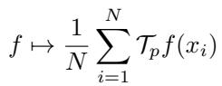

where $\xi_p(x_i, \cdot) = s_p(x_i) k(x_i, \cdot) + \nabla_{x_i} k(x_i, \cdot)$. Hence, by Cauchy–Schwarz,

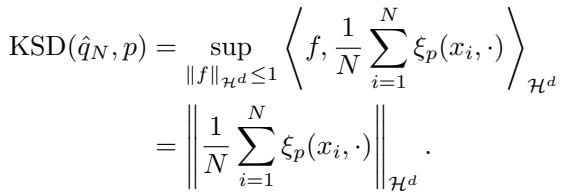

Squaring both sides gives

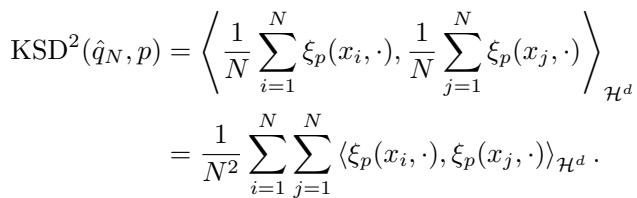

Define $u_p(x_i, x_j) := \langle \xi_p(x_i, \cdot), \xi_p(x_j, \cdot) \rangle_{\mathcal{H}^d}$. Expanding this RKHS inner product yields

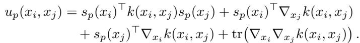

> 💡 **证明批读 (Hao 批注)**: Prop 3 是 score-KSD "能算"的证明，三步：(1) 经验分布下期望变成对样本求平均；(2) **RKHS 再生性**把"对 $f$ 取 $\sup$"这个无穷维优化，转成一个固定向量 $\xi_p$ 的范数——$\xi_p(x_i,\cdot)=s_p(x_i)k(x_i,\cdot)+\nabla_{x_i}k(x_i,\cdot)$ 把 score 和核梯度打包；(3) Cauchy-Schwarz 给出 $\sup$ 的闭式 = $\|\frac1N\sum\xi_p\|$，平方展开就是对样本对求 $u_p$ 的双重和。**核心洞察**：正因为 $\sup$ 有闭式，score-KSD 不用真解优化，只需 $O(N^2)$ 次核与 score 的求值——这是 Algorithm 1 第 7–8 行的理论依据。

> 💡 **附录小结 (Hao 批注)**:
> - **关键复现旋钮**：IMQ 核 $\beta=-1/2$、$c=1/(\text{median}(s(\mathcal{A}))+1)$；先验 score $\sigma_{\text{score}}=0.3$、$M=4$；仿真真值/算子/噪声见 B 节；DAPS-MRI 噪声级改为 0.008。
> - **核心洞察**：三命题的完整证明把 score-KSD 钉成"理论有保证（Prop 1/2）且可计算（Prop 3）"的合优度检验；特征核（IMQ）是唯一性的必要条件。
> - **可追问点**：证明全程假设精确 score $s_p$，而实际用近似 $\hat{s}_p$——近似误差对 Prop 2 唯一性的破坏程度未在附录量化（正文 Table 1 用 Ap≈An 做了经验兜底）。这与 Section 6 的 $\sigma_y$ 局限同源，是盲设置迁移时要补的理论缺口。
