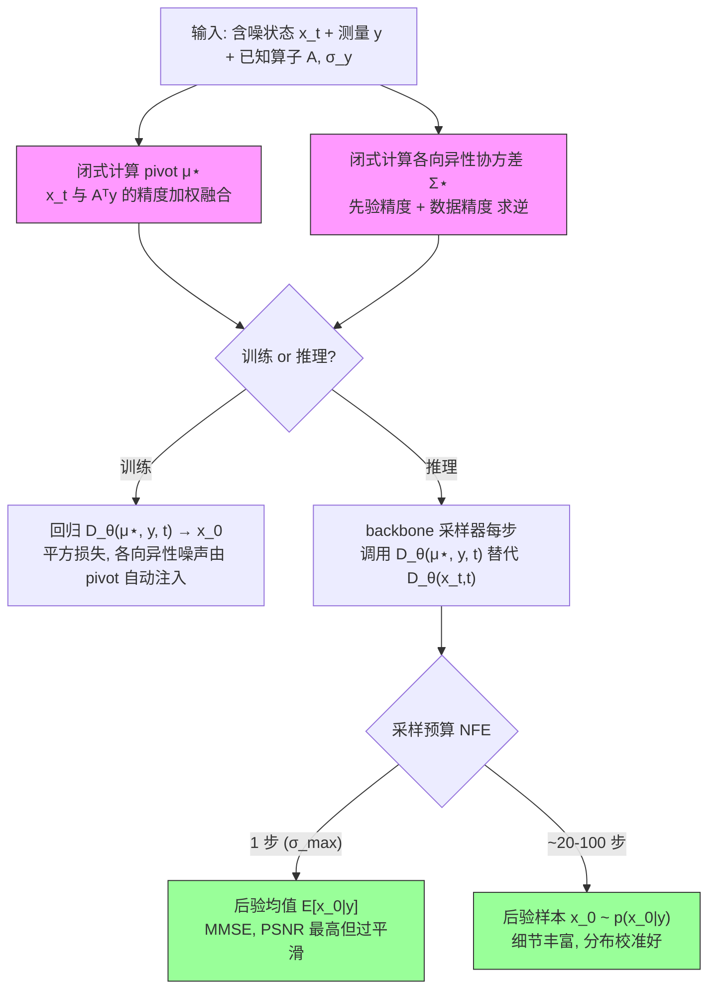

# Exact Posterior Score Estimation for Solving Linear Inverse Problems

**作者**: Abbas Mammadov, Ozgur Kara, Kaan Oktay, Adil Kaan Akan, Hyungjin Chung, James Matthew Rehg, Iskander Azangulov, Yee Whye Teh（University of Oxford / UIUC / fal / EverEx）
**会议/来源**: arXiv preprint | **年份**: 2026
**链接**: [arXiv:2606.17048](https://arxiv.org/abs/2606.17048) · [Connected Papers](https://www.connectedpapers.com/main/2606.17048)

> 本课题定位（posterior-calibration / 精确后验 score 方向）：本文针对**线性高斯逆问题**推导出后验 score 的**闭式解**，说明后验采样在什么结构下可精确/可校正，并精确指出 DPS 等近似 likelihood 方法偏差在哪。它为我们"生成先验下参数化盲逆问题"的**低维可知真后验参考实验**提供了构造依据（Theorem 1 + 附录 A.7 的 GP/岭回归解读）。

---

## 一句话总结

对于线性高斯逆问题，后验 score 有**闭式解**——后验采样仍是一个去噪问题，只是要在"被测量拉偏的 pivot $\mu_\star$"上、在"算子相关的各向异性协方差 $\Sigma_\star$"下去噪；把这个恒等式写成保留预训练结构的去噪训练目标 EPS，即可用一个数量级更少的去噪器评估超越所有 training-free 与 training-based 基线，且 fidelity 与分布校准双赢。

---

## 核心贡献

1. **闭式后验 score（Theorem 1）**：证明线性高斯逆问题 + 一般高斯 interpolant 下，$\nabla_{x_t}\log p(x_t\mid y)=\frac{1}{\beta_t^2}(\alpha_t D_{\Sigma_\star(t)}(\mu_\star)-x_t)$，其中 pivot $\mu_\star$ 是 $x_t$ 与 $A^\top y$ 的 precision 加权贝叶斯融合、$\Sigma_\star$ 是后验协方差；且 $D_{\Sigma_\star}(\mu_\star)=\mathbb{E}[x_0\mid x_t,y]$。Prop 2 把结论推广到 flow/velocity。
2. **精确定位已有方法的偏差（Eq. 14 + Section 3.3）**：measurement-matching score 精确等于"后验去噪器（在 $\mu_\star$）− 无条件去噪器（在 $x_t$）"之差；DPS/DDNM/ΠGDM/moment-matching 全都在**错误的点 $x_t$** 用**融合测量前的分布 $p(x_0\mid x_t)$** 近似，而精确对象在 $\mu_\star$ 处、是融合测量后的 $p(x_0\mid x_t,y)$。
3. **EPS 训练目标（Eq. 16 + Prop 3）**：把恒等式变成"换了输入（$x_t\to\mu_\star$）的标准去噪回归"；Prop 3 证明各向异性噪声由 pivot 构造**自动免费**注入，训练无需开方或采各向异性噪声。可随机初始化或从预训练 checkpoint warm-start。
4. **推理零额外开销 + 一步后验均值（Section 3.5 + Observation 4）**：采样复用 backbone 采样器、无似然梯度/投影；高噪声极限下单次去噪调用即返回后验均值 $\mathbb{E}[x_0\mid y]$（MMSE）。
5. **全面实验（五任务 × 两数据集 × 三类指标）**：pointwise（PSNR/SSIM）+ perceptual（LPIPS/FID）+ **分布校准（CRPS/MMD）** 全面领先，~20 NFE 收敛，每步成本 ≈ 裸去噪器 1.006×。

---

## 📖 批读导航

| Section | 内容 |
|---------|------|
| [00 - Abstract](sections/00-abstract.md) | 摘要 + 全文张力（无条件 vs 后验 score）+ 与本课题关系 |
| [01 - Introduction](sections/01-introduction.md) | 动机、两大阵营的近似来源、Figure 1（query geometry 直觉） |
| [02 - Background](sections/02-background.md) | Interpolant 统一框架、Tweedie 三件套、后验 score 分解与近似模板 |
| [03 - Exact Posterior Score](sections/03-exact-posterior-score.md) | **核心**：各向异性 Tweedie、Theorem 1、Prop 2、Section 3.3 偏差诊断、EPS 损失、Algorithm 1、Observation 4 |
| [04 - Experiments](sections/04-experiments.md) | Figure 2/3、Table 1、主结果与采样效率证据链 |
| [05 - Related Work](sections/05-related-work.md) | EPS 在 guidance 谱系与 bridge 谱系里的坐标（与 GLASS 的关系） |
| [06 - Conclusion](sections/06-conclusion.md) | 总结 + 局限（线性/高斯假设、latent diffusion）+ 对本课题的边界 |
| [07 - Appendix](sections/07-appendix.md) | A 全部证明、B 实现、C 影响、D.1–D.14 补充实验、E 基线配置、F 指标定义 |

---

## 关键数字

| 指标 | 数值 |
|------|------|
| 评测任务 | 5（70% 随机 inpaint、box inpaint、4× 超分、高斯去模糊、运动去模糊） |
| 数据集 | FFHQ-64、ImageNet-64（主）；ImageNet-256（附录 D.10） |
| 观测噪声 | $\sigma_y=0.05$（训练/评测固定） |
| EPS 收敛所需 NFE | ~15–20（基线 100–250 仍追不上其渐近线） |
| EPS 每步成本 | 裸无条件 EDM 的 **1.006×**（DPS/ΠGDM ~2.3×，DAPS ~2.2×） |
| ImageNet random inpaint | EPS-20 PSNR **24.87** vs Palette 24.09 vs ΠGDM 23.95 |
| 1-NFE 后验均值 | ImageNet random inpaint PSNR **26.60**（MMSE，但 CRPS/FID 变差） |
| 极端 95% inpaint | EPS-20 FID 比最强基线 ΠGDM 降 ~25%、比 DPS 降 ~30% |
| 评测协议 | 100 图 × 10 后验 seed，固定种子对齐所有方法 |
| Backbone | ImageNet 用公开 EDM-ADM（~296M）；FFHQ 从头训 EDM-DDPM++ |
| Fine-tune 成本 | 每任务 ~25k 迭代，ImageNet ~24h / FFHQ ~10h（4× B200） |

---

## 数据流：输入 → 中间表示 → 输出

---

## 优缺点与还能做什么

### 优点
- **理论精确**：不是又一个近似 guidance，而是线性高斯下**闭式后验 score**；采样路径无 per-step 偏差（不像 DPS）。
- **结构保留 → 效率三连**：保留预训练去噪结构 → warm-start 快收敛（Figure 4）→ ~20 NFE 收敛（Figure 3）→ 每步 ≈ 裸去噪器（Table 11）。
- **校准友好**：CRPS/MMD 分布指标作为一等公民，零空间样本多样性真实（Figure 9/12/13）——这正是本课题最看重的性质。
- **干净的隔离性消融**：Palette = EPS 把 $\mu_\star$ 换回 $x_t$，Table 2 单调链把"pivot 是主功臣"钉死。
- **通用性**：diffusion / flow / EDM 通吃（Prop 2）；amortized 单网络覆盖五算子（Table 4）。

### 局限 / 风险
- **线性 + 高斯假设**：Theorem 1 的闭式只在线性算子 + 高斯噪声下成立；非线性算子闭式失效（只能局部线性化或对真似然训练）。
- **算子需已知且固定**：pivot 的 precision 加权按训练算子校准，测试算子 OOD（如 70%→90% 掩码）时 PSNR/SSIM 退化快（Table 8）——**盲设定下若不联合更新 $\varphi$，pivot 会失配**。
- **latent diffusion 受限**：decoder 把像素域线性算子变成 latent 域非线性算子，本文全在像素空间做。
- **需一步训练**：相比纯 zero-shot（GLASS 在各向同性特例免训练），EPS 用一步 fine-tune 换通用各向异性能力。

### 还能做什么（对本课题）
- **构造参考后验**：在低维 + 高斯/GMM 可解析先验 + 已知线性 $A$ 下，Theorem 1 + 附录 A.7 给出**完全解析的高斯后验**，可作 SBC/coverage/CRPS 的 gold-standard。
- **向盲设定推广**：把训练算子分布 $p(A)$ 换成 $p(A\mid\varphi),\varphi\sim p(\varphi)$，得到对 $\varphi$ amortize 的后验去噪器（D.5 已证 amortization 可行）；采样时 pivot 必须用**当前推断的 $\varphi$** 构造 $A(\varphi)$——这正是 gauge-aware 联合估计的必要性来源（D.9 的 OOD 警示）。
- **校准评测协议直接迁移**：100 图 × 10 seed、CRPS-pixel/inception + MMD-pixel/inception 的组合可直接用于检验我们的联合后验采样器。

---

## 阅读 Q&A 记录

- **Q: 后验采样和普通去噪到底差在哪？**
  A: 只差"查询几何"。普通去噪在 $x_t$、各向同性噪声 $\beta_t^2 I$ 下；后验去噪在 pivot $\mu_\star$、各向异性 $\Sigma_\star$ 下（Theorem 1 / Figure 1）。目标类型（clean $x_0$）和平方损失完全一样。

- **Q: EPS 相对 DPS 的本质优势是什么？**
  A: DPS 在错误的点 $x_t$、用融合测量前的分布 $p(x_0\mid x_t)$ 近似 measurement-matching score（Eq. 14），偏差每步累积、更多 NFE 也消不掉（Figure 3）；EPS 采样链无此偏差，故 CRPS/MMD 校准显著更好。

- **Q: 训练各向异性噪声需要对 $\Sigma_\star$ 开方吗？**
  A: 不需要。Prop 3（附录 A.4）证明：用两个各向同性高斯 $\epsilon,\eta$ 按闭式构造 pivot，$\mu_\star\mid x_0$ 自动服从 $\mathcal{N}(x_0,\Sigma_\star)$——各向异性腐蚀"免费"由 pivot 构造注入。

- **Q: 1-NFE 行能用于校准检验吗？**
  A: 不能。1-NFE 是后验均值（MMSE 点估计，Observation 4），不是样本；CRPS/MMD 会退化（Table 5）。校准必须用 20/100-NFE 的多步采样样本。

- **Q: 这篇能直接给我们"真后验"吗？**
  A: 部分能。$D_{\Sigma_\star}(\mu_\star)=\mathbb{E}[x_0\mid x_t,y]$ 是精确的、采样路径无近似；但去噪器本身是学出来的网络。只有在数据先验也可解析（高斯/GP，见附录 A.7）时才是完全解析的真后验——这正是低维参考实验的最佳落脚点。

- **Q: 为什么 EPS 比 Palette 收敛快、效果好，明明都是 training-based？**
  A: 二者唯一差别是输入 $\mu_\star$ vs $x_t$（Palette = EPS 换回 $x_t$）。$\mu_\star$ 初始化就编码了测量几何（warm-start 起点就好，Figure 4），且保留预训练去噪边缘分布只需学 $\Sigma_\star$ 的各向异性几何（Section 3.4）。Table 2 单调链证明这来自 pivot 而非训练技巧。

---

## 📊 Citation Landscape

> ⚠️ **说明**：本文 arXiv 编号为 2606.17048（2026 年 6 月），属极新预印本。Semantic Scholar Graph API 在批读时**持续返回 429（Too Many Requests，共享 IP 限流），且该新论文很可能尚未被 S2 收录**，故无法获取自动 TLDR、citationCount、influentialCitationCount 与 Recommendations。以下 Citation Landscape 依据**论文自带的 54 篇参考文献**手工按主题归类整理（无法提供 S2 citation 排序，按主题内代表性排列）。

**自动 TLDR**：不可用（S2 未收录 / API 限流）。人工一句话 TLDR 见上方"一句话总结"。

**引用统计**：referenceCount = 54（论文正文 References 计数）；citationCount / influentialCitationCount 不可用（S2 未收录）。

### 参考文献分组（按主题，组内取代表性 Top5）

**A. Diffusion / Flow 生成先验基础**
1. Ho et al., Denoising Diffusion Probabilistic Models (DDPM), NeurIPS 2020 [12]
2. Song et al., Score-Based Generative Modeling through SDEs, 2020 [13]
3. Karras et al., Elucidating the Design Space of Diffusion Models (EDM), 2022 [17]
4. Liu et al., Flow Straight and Fast: Rectified Flow, 2022 [16]
5. Albergo et al., Stochastic Interpolants: A Unifying Framework, JMLR 2025 [15]

**B. Training-free 后验采样 / guidance（本文主要对比对象）**
1. Chung et al., Diffusion Posterior Sampling (DPS), 2022 [18]
2. Song et al., Pseudoinverse-Guided Diffusion Models (ΠGDM), ICLR 2023 [20]
3. Wang et al., Denoising Diffusion Null-Space Model (DDNM), 2022 [19]
4. Zhang et al., Decoupled Annealing Posterior Sampling (DAPS), CVPR 2025 [22]
5. Holderrieth et al., GLASS Flows, 2025 [52]（最近的 training-free 亲戚，各向同性特例与 EPS 重合）

**C. Training-based / conditional / bridge / distillation（本文次要对比对象）**
1. Saharia et al., Palette: Image-to-Image Diffusion Models, SIGGRAPH 2022 [32]（核心对照组）
2. Elata et al., InvFusion: Bridging Supervised and Zero-shot Diffusion, 2025 [34]
3. Delbracio & Milanfar, Inversion by Direct Iteration (InDI), 2023 [35]
4. Liu et al., I²SB: Image-to-Image Schrödinger Bridge, 2023 [36]
5. Mammadov et al., Amortized Posterior Sampling with Diffusion Prior Distillation, 2024 [37]

**D. 渐近精确 / SMC 后验采样**
1. Wu et al., Practical and Asymptotically Exact Conditional Sampling in Diffusion Models, NeurIPS 2023 [29]
2. Cardoso et al., Monte Carlo Guided Diffusion for Bayesian Linear Inverse Problems, 2023 [30]
3. Dou & Song, DPS for Linear Inverse Problem Solving: A Filtering Perspective, ICLR 2024 [31]

**E. 统计基础 / Tweedie / GP**
1. Efron, Tweedie's Formula and Selection Bias, JASA 2011 [40]
2. Robbins, An Empirical Bayes Approach to Statistics, 1992 [39]
3. Williams & Rasmussen, Gaussian Processes for Machine Learning, 2006 [54]

**F. 评测指标 / 感知-失真**
1. Heusel et al., FID (GANs Trained by a Two Time-Scale Update Rule), NeurIPS 2017 [43]
2. Zhang et al., LPIPS (Unreasonable Effectiveness of Deep Features), CVPR 2018 [42]
3. Gretton et al., MMD (A Kernel Two-Sample Test), JMLR 2012 [45]
4. Blau & Michaeli, The Perception-Distortion Tradeoff, CVPR 2018 [48]
5. Gneiting & Katzfuss, Probabilistic Forecasting (CRPS), 2014 [44]

### 推荐延伸阅读（人工挑选，替代 S2 Recommendations，共 10 篇）

1. **DPS** [18] — 最经典的 training-free 后验采样，本文的头号对比与偏差诊断对象。
2. **ΠGDM** [20] — 伪逆 guidance，本文最强采样类基线。
3. **DDNM** [19] — null-space 分解，与 EPS 高噪声极限的伪逆重建直觉相通。
4. **DAPS** [22] — 解耦噪声退火，256×256 基线数字来源。
5. **GLASS** [52] — 等效时间 training-free 方法，EPS 各向同性特例的免训练版本（附录 A.6）。
6. **Palette** [32] — 核心隔离性对照组（EPS 把 $\mu_\star$ 换回 $x_t$）。
7. **InvFusion** [34] — 桥接监督与 zero-shot 的条件扩散，training-based 谱系代表。
8. **I²SB** [36] — Schrödinger bridge 恢复，本文视为互补（EPS 是"精确解线性高斯后验的那条 bridge"）。
9. **EDM** [17] — 本文 backbone 与采样器基础。
10. **DPS filtering perspective** [31] — 渐近精确的滤波视角，与本文"精确闭式"形成对照。

**相关工具**：[Connected Papers](https://www.connectedpapers.com/main/2606.17048) · Semantic Scholar 页面（该 arXiv 收录后可用）。
