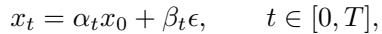
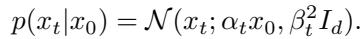
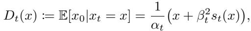
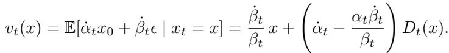
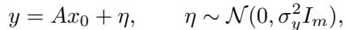
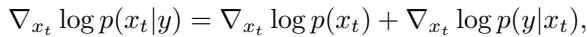

[← 返回 README](../README.md)

# 2 Background

## 📌 预览

本节把两块必要的前置知识摆好：(2.1) 把 diffusion/flow 统一成一个"学到的去噪器 $D_\theta$"，并用 Tweedie 恒等式把 score、去噪器、velocity 三者互相打通；(2.2) 定义线性高斯逆问题，写出后验 score 的分解，并给出已有 zero-shot 方法的通用近似模板。这两块正是 Section 3 推导的起点。

---

## 2.1 Generative Models as Denoising Trajectories

Let $x_0 \sim p_{\text{data}}$ and $\epsilon \sim \mathcal{N}(0, I_d)$. A stochastic interpolant defines

with $(\alpha_0, \beta_0) = (1, 0)$ and $(\alpha_T, \beta_T) = (0, 1)$ in the data-to-noise convention. Different choices of $(\alpha_t, \beta_t)$ recover variance-preserving diffusion [12, 13], rectified flow [16], and EDM [17], with corresponding network parameterizations as a score, noise predictor, velocity, or EDM-preconditioned denoiser; the conversion between them is deterministic once $(\alpha_t, \beta_t)$ are fixed, so we write all backbones through a learned denoiser $D_\theta$. The forward kernel is

> 💡 **机制拆解：统一到 $D_\theta$ (Hao 批注)**: 作者用 stochastic interpolant（Eq. 1）$x_t=\alpha_t x_0+\beta_t\epsilon$ 作为统一框架，DDPM/rectified flow/EDM 只是 $(\alpha_t,\beta_t)$ 的不同选择。关键动作是"把所有 backbone 都写成一个学到的去噪器 $D_\theta$"——因为 score、noise predictor、velocity、EDM denoiser 在 $(\alpha_t,\beta_t)$ 固定后可**确定性互相转换**。这个统一是 EPS 通用性的基础：后面只要给出"后验去噪器"，score 和 velocity 就自动跟着有了。Eq. 2 是前向核，$x_t$ 给定 $x_0$ 是均值 $\alpha_t x_0$、方差 $\beta_t^2 I$ 的各向同性高斯——**注意这个"各向同性"，它正是 EPS 要打破的东西**。

The marginal score $s_t(x) = \nabla_x \log p(x)$ is equivalent to the optimal denoiser through Tweedie's identity,

and the reverse velocity follows from the same identity:

This viewpoint sets up EPS: if the posterior denoiser is known, the posterior score and posterior velocity follow immediately from the same identities, and the base model's sampler can be reused.

> 💡 **公式批读：Tweedie 三件套 (Hao 批注)**: Eq. 3 是 Tweedie 恒等式——最优去噪器 $D_t(x)=\mathbb{E}[x_0\mid x_t=x]=\frac{1}{\alpha_t}(x+\beta_t^2 s_t(x))$，即 **score 和去噪器是同一件事的两种写法**。Eq. 4 把 velocity 也写成 $D_t$ 的线性函数。这段最后一句是整篇论文的"结构支点"：**只要能拿到后验去噪器 $\mathbb{E}[x_0\mid x_t,y]$，后验 score（Theorem 1）和后验 velocity（Prop 2）就自动通过同样的恒等式得到，采样器原封不动复用**。所以 EPS 把整个后验采样问题**归约成"学一个去噪器"**——这是它相对 DPS/Palette 的结构优势所在。

## 2.2 Inverse Problems and Approximate Posterior Sampling

We observe

for a known linear operator $A \in \mathbb{R}^{m \times d}$. This notation covers masks, downsampling, and convolutional blur operators, and includes rank-deficient settings where many signals are consistent with the same observation. The target is the posterior $p(x_0 | y) \propto p(y | x_0) p_{\text{data}}(x_0)$. A reverse sampler should therefore use

where the second term is the measurement-matching score. Zero-shot solvers approximate it with the template $\nabla_{x_t} \log p(y | x_t) \approx - L_t M_t / G_t$ [28], where $M_t$ is a measurement residual, $L_t$ lifts it back to sample space, and $G_t$ is the guidance strength.

> 💡 **公式批读：后验 score 的分解与近似模板 (Hao 批注)**: Eq. 5 定义线性高斯观测 $y=Ax_0+\eta$，$\eta\sim\mathcal{N}(0,\sigma_y^2 I_m)$，$A$ **已知**（掩码/下采样/卷积模糊，含秩亏）。Eq. 6 是全文的靶子：$\nabla_{x_t}\log p(x_t\mid y)=\nabla_{x_t}\log p(x_t)$（无条件 score，预训练给的）$+\ \nabla_{x_t}\log p(y\mid x_t)$（measurement-matching score，缺的那块）。
> 所有 zero-shot 方法都在近似第二项，统一模板是 $-L_t M_t/G_t$（[28] 的 survey 总结）：$M_t$ 是测量残差、$L_t$ 把残差 lift 回样本空间、$G_t$ 是 guidance 强度。DPS、ΠGDM、DDNM 的区别只是这三者的具体形式。**本文的贡献就是给出第二项的精确闭式（Eq. 14），并指出所有模板方法在"该在哪个点评估网络"上都错了**——它们在 $x_t$ 评估，应该在 $\mu_\star$ 评估。

> 💡 **Section 2 小结 (Hao 批注)**:
> - **关键变量**：去噪器 $D_t(x)=\mathbb{E}[x_0\mid x_t]$；前向噪声各向同性 $\beta_t^2 I$；后验 score 分解 Eq. 6。
> - **核心洞察**：把 score/velocity 全部归约到"去噪器"这一个对象上 → 只要给出后验去噪器，采样管线全部复用。
> - **可追问点**：后验去噪器 $\mathbb{E}[x_0\mid x_t,y]$ 到底长什么样？这正是 Section 3 Theorem 1 要回答的——答案是"在 pivot $\mu_\star$ 上、各向异性 $\Sigma_\star$ 下的去噪器"。
